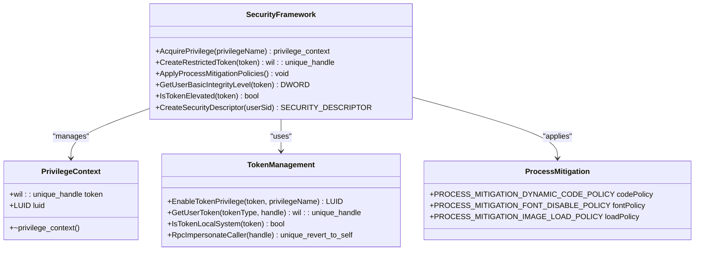
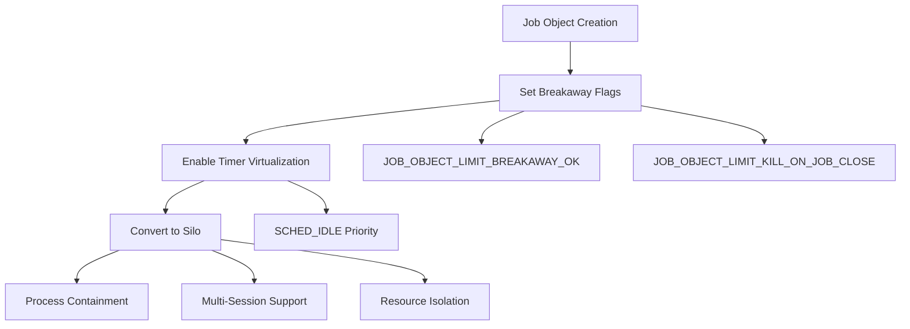
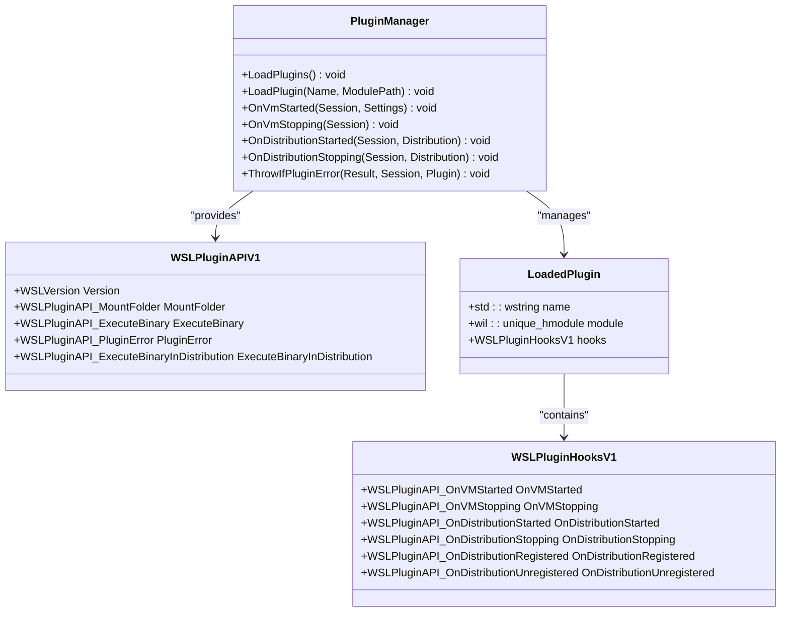
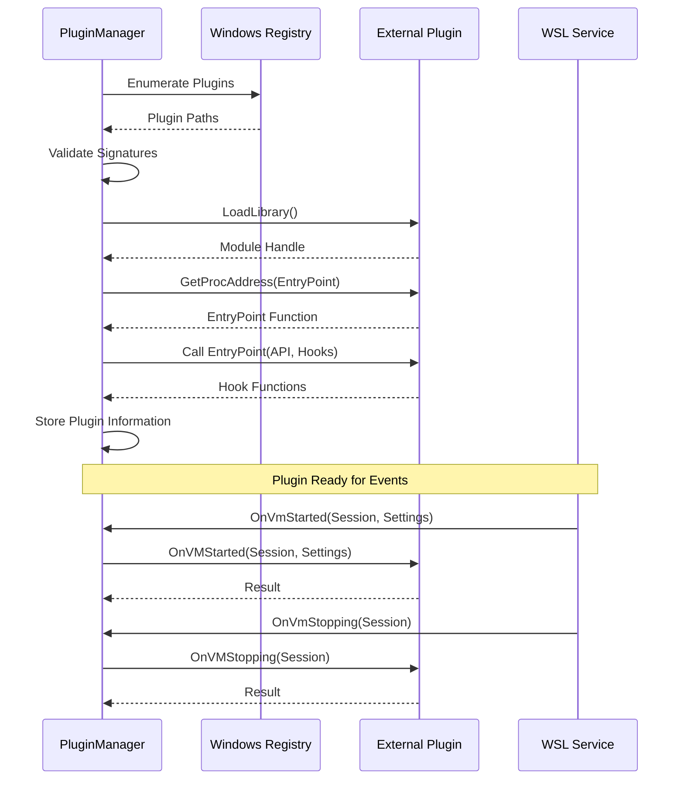
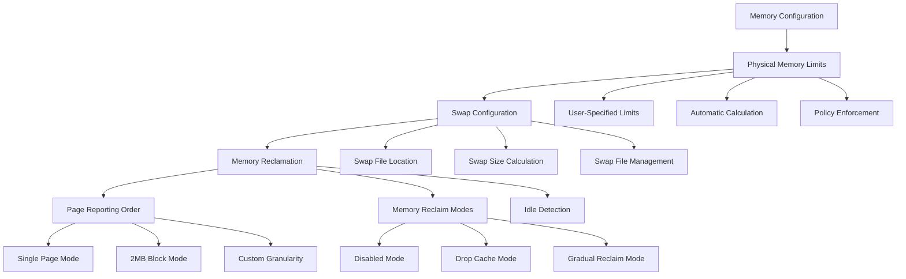
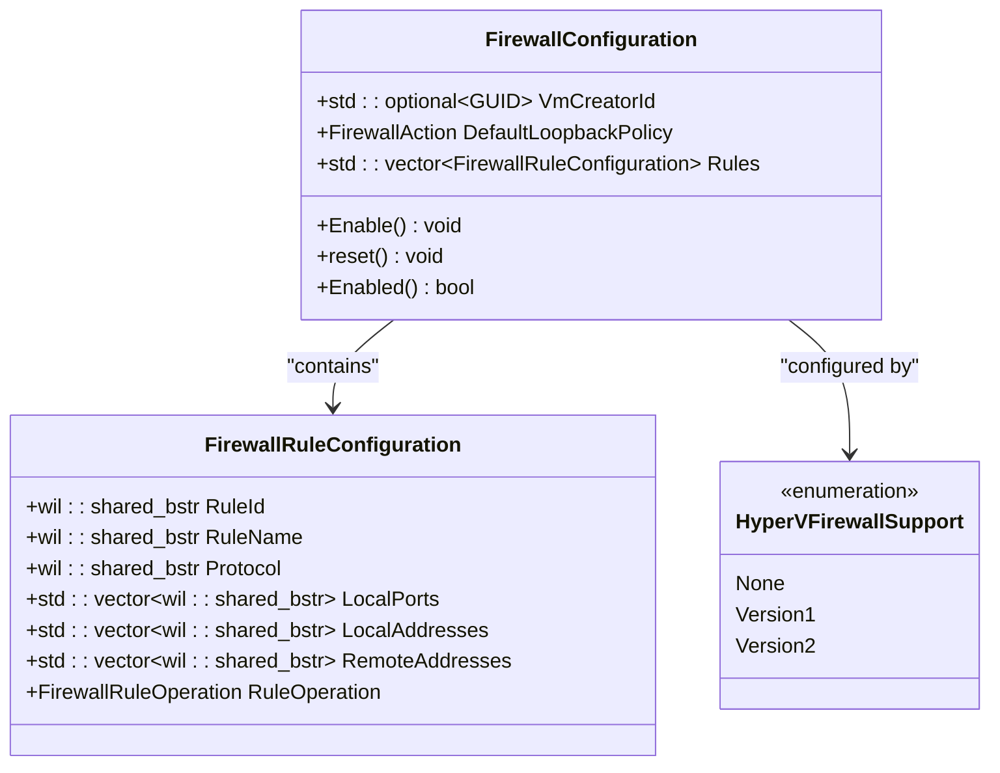
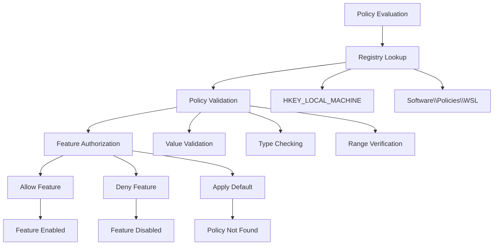

# Advanced Topics

<cite>
**Referenced Files in This Document**
- [WslSecurity.cpp](file://src/windows/common/WslSecurity.cpp)
- [WslSecurity.h](file://src/windows/common/WslSecurity.h)
- [WslCoreConfig.cpp](file://src/windows/common/WslCoreConfig.cpp)
- [PluginManager.cpp](file://src/windows/service/exe/PluginManager.cpp)
- [PluginManager.h](file://src/windows/service/exe/PluginManager.h)
- [WslPluginApi.h](file://src/windows/inc/WslPluginApi.h)
- [WslCoreFirewallSupport.cpp](file://src/windows/common/WslCoreFirewallSupport.cpp)
- [LxssSecurity.cpp](file://src/windows/service/exe/LxssSecurity.cpp)
- [wslpolicies.h](file://src/windows/inc/wslpolicies.h)
- [MemAndProcViewModel.cs](file://src/windows/wslsettings/ViewModels/Settings/MemAndProcViewModel.cs)
- [main.cpp](file://src/linux/init/main.cpp)
- [resourcelimits.c](file://test/linux/unit_tests/resourcelimits.c)
</cite>

## Table of Contents
1. [Introduction](#introduction)
2. [Security Model Architecture](#security-model-architecture)
3. [Plugin System Implementation](#plugin-system-implementation)
4. [Performance Tuning and Resource Management](#performance-tuning-and-resource-management)
5. [Firewall Integration and Network Security](#firewall-integration-and-network-security)
6. [Policy Enforcement Mechanisms](#policy-enforcement-mechanisms)
7. [Configuration Management](#configuration-management)
8. [Common Issues and Solutions](#common-issues-and-solutions)
9. [Advanced Configuration Examples](#advanced-configuration-examples)
10. [Troubleshooting Guide](#troubleshooting-guide)

## Introduction

Windows Subsystem for Linux (WSL) implements a sophisticated multi-layered architecture that encompasses security isolation, plugin extensibility, performance optimization, and comprehensive policy enforcement. This document delves into the advanced implementation details of these critical systems, providing developers and administrators with deep insights into WSL's internal workings.

The WSL architecture consists of several interconnected components: the Windows host layer, the WSL service, virtual machine management, Linux kernel emulation, and user-space applications. Each layer implements specific security measures, performance optimizations, and extensibility mechanisms that collectively provide a robust and secure containerized Linux environment.

## Security Model Architecture

### User Isolation and Privilege Management

WSL implements a comprehensive security model centered around user isolation, privilege management, and process containment. The security framework operates across multiple layers to ensure proper isolation between different WSL instances and the host system.



**Diagram sources**
- [WslSecurity.cpp](file://src/windows/common/WslSecurity.cpp#L18-L181)
- [WslSecurity.h](file://src/windows/common/WslSecurity.h#L23-L120)

The security framework implements several key mechanisms:

**Privilege Escalation Control**: The [`AcquirePrivilege`](file://src/windows/common/WslSecurity.cpp#L18-L26) function provides controlled access to system privileges through RAII-style context management. Each privilege acquisition creates a [`privilege_context`](file://src/windows/common/WslSecurity.cpp#L28-L48) that automatically restores the original privilege state when destroyed.

**Restricted Token Creation**: The [`CreateRestrictedToken`](file://src/windows/common/WslSecurity.cpp#L68-L99) function generates tokens with reduced capabilities and medium integrity levels, preventing unauthorized access to system resources while maintaining functional capability.

**Process Mitigation Policies**: The [`ApplyProcessMitigationPolicies`](file://src/windows/common/WslSecurity.cpp#L40-L58) function enforces multiple security mitigations including dynamic code protection, font disable policies, and image load restrictions to prevent exploitation vectors.

**Section sources**
- [WslSecurity.cpp](file://src/windows/common/WslSecurity.cpp#L18-L181)
- [WslSecurity.h](file://src/windows/common/WslSecurity.h#L23-L120)

### Job Object Security and Containerization

WSL employs Windows job objects for process containment and resource management. The [`InitializeInstanceJob`](file://src/windows/service/exe/LxssSecurity.cpp#L20-L37) function configures job objects with specific security flags:



**Diagram sources**
- [LxssSecurity.cpp](file://src/windows/service/exe/LxssSecurity.cpp#L20-L37)

**Section sources**
- [LxssSecurity.cpp](file://src/windows/service/exe/LxssSecurity.cpp#L20-L49)

## Plugin System Implementation

### WSL Plugin API Architecture

The WSL Plugin API provides a comprehensive framework for extending WSL functionality through external tools and services. The plugin system operates through COM interfaces and follows a well-defined lifecycle model.



**Diagram sources**
- [PluginManager.cpp](file://src/windows/service/exe/PluginManager.cpp#L103-L324)
- [WslPluginApi.h](file://src/windows/inc/WslPluginApi.h#L137-L146)

### Plugin Lifecycle Management

The plugin system implements a comprehensive lifecycle management approach that handles plugin loading, initialization, and cleanup:



**Diagram sources**
- [PluginManager.cpp](file://src/windows/service/exe/PluginManager.cpp#L103-L171)

### Plugin Communication Interfaces

The WSL Plugin API provides several communication interfaces for different operational scenarios:

**Mount Folder Operations**: The [`MountFolder`](file://src/windows/service/exe/PluginManager.cpp#L30-L48) function enables plugins to create Plan9 mounts between Windows and Linux namespaces, facilitating file system integration.

**Process Execution**: The [`ExecuteBinary`](file://src/windows/service/exe/PluginManager.cpp#L51-L62) and [`ExecuteBinaryInDistribution`](file://src/windows/service/exe/PluginManager.cpp#L84-L97) functions allow plugins to execute programs in various contexts, from the root namespace to specific distributions.

**Error Reporting**: The [`PluginError`](file://src/windows/service/exe/PluginManager.cpp#L65-L82) function provides a mechanism for plugins to report errors to users with appropriate messaging.

**Section sources**
- [PluginManager.cpp](file://src/windows/service/exe/PluginManager.cpp#L103-L324)
- [WslPluginApi.h](file://src/windows/inc/WslPluginApi.h#L90-L150)

## Performance Tuning and Resource Management

### Memory Management and Optimization

WSL implements sophisticated memory management strategies to optimize performance while maintaining system stability. The memory subsystem includes configurable limits, automatic reclaim mechanisms, and intelligent caching strategies.



**Diagram sources**
- [WslCoreConfig.cpp](file://src/windows/common/WslCoreConfig.cpp#L308-L327)
- [main.cpp](file://src/linux/init/main.cpp#L267-L422)

### CPU and Resource Limits

The resource management system provides fine-grained control over CPU allocation, memory limits, and I/O operations:

**CPU Configuration**: The [`Initialize`](file://src/windows/common/WslCoreConfig.cpp#L289-L302) function calculates optimal processor counts based on host capabilities while respecting user preferences and policy constraints.

**Memory Allocation**: Memory limits are dynamically calculated with fallback mechanisms to ensure system stability under low-memory conditions.

**Swap Management**: The [`SwapSizeBytes`](file://src/windows/common/WslCoreConfig.cpp#L320-L327) calculation implements heuristic algorithms based on established Linux best practices.

**Section sources**
- [WslCoreConfig.cpp](file://src/windows/common/WslCoreConfig.cpp#L289-L327)
- [main.cpp](file://src/linux/init/main.cpp#L267-L422)

### I/O Optimization Strategies

WSL implements several I/O optimization techniques to improve performance across different workload patterns:

**File System Caching**: Intelligent caching mechanisms reduce disk I/O overhead for frequently accessed files and directories.

**Network Buffer Management**: Optimized buffer sizing and zero-copy techniques minimize network latency and maximize throughput.

**Storage Backend Selection**: Automatic selection of optimal storage backends based on workload characteristics and system capabilities.

**Section sources**
- [resourcelimits.c](file://test/linux/unit_tests/resourcelimits.c#L1-L114)

## Firewall Integration and Network Security

### Hyper-V Firewall Support

WSL integrates with the Hyper-V firewall to provide network isolation and security controls. The firewall system supports multiple configuration modes and provides comprehensive rule management.



**Diagram sources**
- [WslCoreConfig.cpp](file://src/windows/common/WslCoreConfig.cpp#L513-L531)
- [WslCoreFirewallSupport.cpp](file://src/windows/common/WslCoreFirewallSupport.cpp#L1-L846)

### Network Security Policies

The firewall system implements comprehensive security policies including:

**ICMP Rule Management**: Automatic configuration of ICMP rules for basic connectivity and application compatibility.

**mDNS Support**: Special handling for multicast DNS traffic to ensure proper network discovery functionality.

**Loopback Configuration**: Flexible loopback policy management allowing both restrictive and permissive configurations.

**Section sources**
- [WslCoreFirewallSupport.cpp](file://src/windows/common/WslCoreFirewallSupport.cpp#L62-L144)

## Policy Enforcement Mechanisms

### Administrative Policy Framework

WSL implements a comprehensive policy framework that allows enterprise administrators to control WSL functionality through Group Policy and registry settings.



**Diagram sources**
- [wslpolicies.h](file://src/windows/inc/wslpolicies.h#L19-L105)

### Policy Categories and Controls

The policy system covers multiple functional areas:

**Feature Access Control**: Policies controlling access to kernel customization, networking modes, and debugging features.

**Security Restrictions**: Controls over privileged operations, file system access, and network capabilities.

**Configuration Enforcement**: Policies dictating default settings for memory, CPU, and storage configurations.

**Section sources**
- [wslpolicies.h](file://src/windows/inc/wslpolicies.h#L19-L105)

## Configuration Management

### Advanced Configuration Options

WSL provides extensive configuration options for power users and administrators:

| Configuration Option | Purpose | Default Value | Range |
|---------------------|---------|---------------|-------|
| `wsl2.memory` | Physical memory allocation | 50% of host memory | 256MB - Total System Memory |
| `wsl2.processors` | CPU core allocation | All available cores | 1 - Maximum Cores |
| `wsl2.swap` | Swap file size | 25% of memory | 0 - Unlimited |
| `wsl2.swapFile` | Swap file location | Temp directory | Valid path |
| `wsl2.memoryReclaim` | Memory reclaim mode | Gradual | Disabled, DropCache, Gradual |
| `wsl2.pageReportingOrder` | Memory reporting granularity | 0 (single page) | 0 - 9 |

**Section sources**
- [WslCoreConfig.cpp](file://src/windows/common/WslCoreConfig.cpp#L308-L327)
- [MemAndProcViewModel.cs](file://src/windows/wslsettings/ViewModels/Settings/MemAndProcViewModel.cs#L66-L170)

### Configuration Validation and Error Handling

The configuration system implements comprehensive validation and error handling:

**Input Validation**: All configuration parameters undergo strict validation to ensure correctness and safety.

**Policy Override Detection**: Automatic detection and logging of policy overrides for audit and troubleshooting purposes.

**Graceful Degradation**: Fallback mechanisms ensure system stability when invalid configurations are detected.

**Section sources**
- [WslCoreConfig.cpp](file://src/windows/common/WslCoreConfig.cpp#L329-L493)

## Common Issues and Solutions

### Permission Escalation Problems

**Issue**: Plugins attempting to escalate privileges beyond their declared capabilities.

**Solution**: Implement proper privilege checking using [`IsTokenElevated`](file://src/windows/common/WslSecurity.cpp#L133-L136) and [`CreateRestrictedToken`](file://src/windows/common/WslSecurity.cpp#L68-L99) functions.

**Prevention**: Design plugins to operate within their declared privilege boundaries and use the plugin error reporting mechanism for permission failures.

### Resource Leaks

**Issue**: Memory or handle leaks in plugin implementations causing system instability.

**Solution**: Implement proper RAII patterns and use the [`privilege_context`](file://src/windows/common/WslSecurity.h#L28-L52) RAII wrapper for privilege management.

**Monitoring**: Enable detailed logging and telemetry collection to detect resource leak patterns.

### Plugin Compatibility Issues

**Issue**: Plugins failing to load or function correctly across different WSL versions.

**Solution**: Implement version checking using [`WSL_PLUGIN_REQUIRE_VERSION`](file://src/windows/inc/WslPluginApi.h#L29-L34) macro and provide graceful degradation for unsupported features.

**Testing**: Comprehensive testing across multiple WSL versions and configurations.

**Section sources**
- [PluginManager.cpp](file://src/windows/service/exe/PluginManager.cpp#L145-L171)
- [WslSecurity.cpp](file://src/windows/common/WslSecurity.cpp#L133-L136)

## Advanced Configuration Examples

### High-Performance Configuration

For compute-intensive workloads requiring maximum performance:

```ini
[wsl2]
processors = 8
memory = 16GB
swap = 4GB
pageReportingOrder = 9
memoryReclaim = dropcache
```

### Memory-Constrained Environment

For systems with limited memory resources:

```ini
[wsl2]
processors = 2
memory = 2GB
swap = 1GB
pageReportingOrder = 0
memoryReclaim = gradual
```

### Development Environment

For software development with frequent rebuilds:

```ini
[wsl2]
processors = 4
memory = 8GB
swap = 2GB
pageReportingOrder = 5
memoryReclaim = gradual
```

**Section sources**
- [WslCoreConfig.cpp](file://src/windows/common/WslCoreConfig.cpp#L308-L327)
- [MemAndProcViewModel.cs](file://src/windows/wslsettings/ViewModels/Settings/MemAndProcViewModel.cs#L66-L170)

## Troubleshooting Guide

### Diagnostic Tools and Techniques

**Log Analysis**: Enable detailed logging through configuration options and analyze logs for security violations, plugin errors, and performance bottlenecks.

**Performance Monitoring**: Use built-in telemetry and performance counters to identify resource contention and optimization opportunities.

**Plugin Debugging**: Implement comprehensive error reporting in plugins and use the plugin error mechanism for user-friendly error messages.

### Common Diagnostic Scenarios

**Plugin Loading Failures**: Check registry entries, file signatures, and compatibility requirements.

**Memory Issues**: Monitor memory usage patterns and adjust configuration parameters accordingly.

**Network Connectivity Problems**: Verify firewall rules, routing tables, and DNS configuration.

**Section sources**
- [PluginManager.cpp](file://src/windows/service/exe/PluginManager.cpp#L103-L142)
- [WslCoreFirewallSupport.cpp](file://src/windows/common/WslCoreFirewallSupport.cpp#L431-L493)