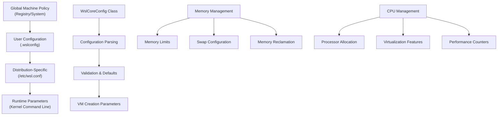
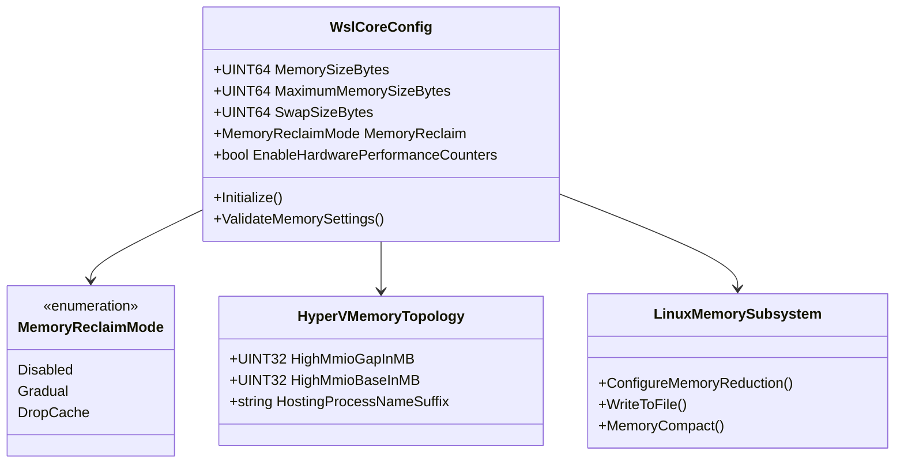
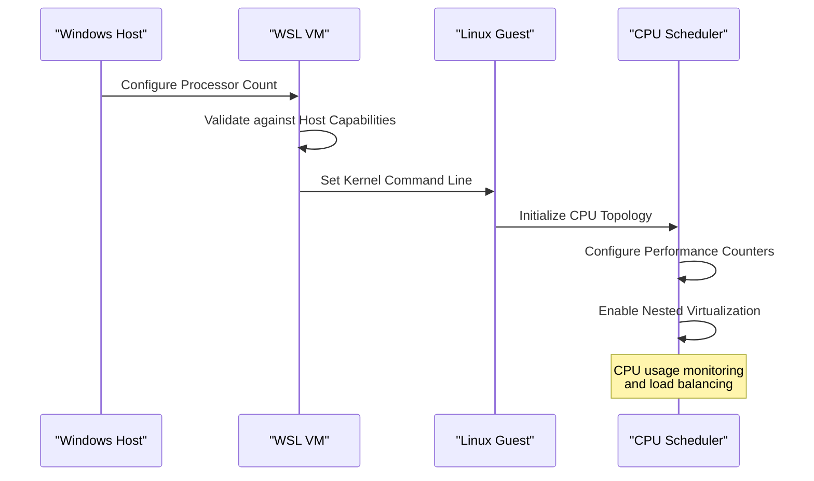
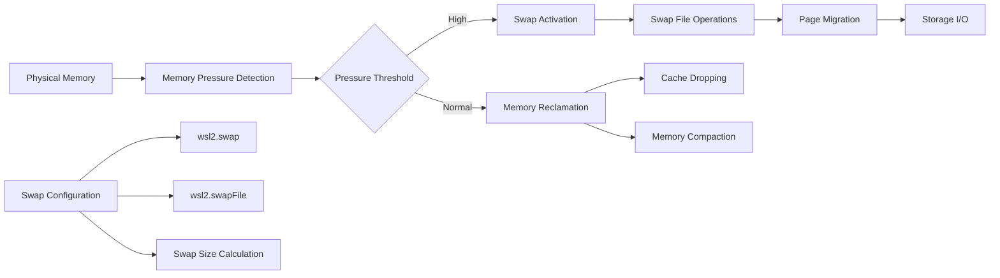
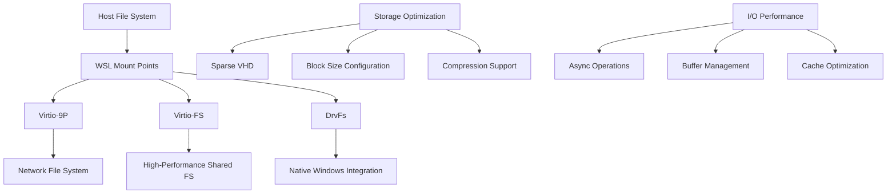
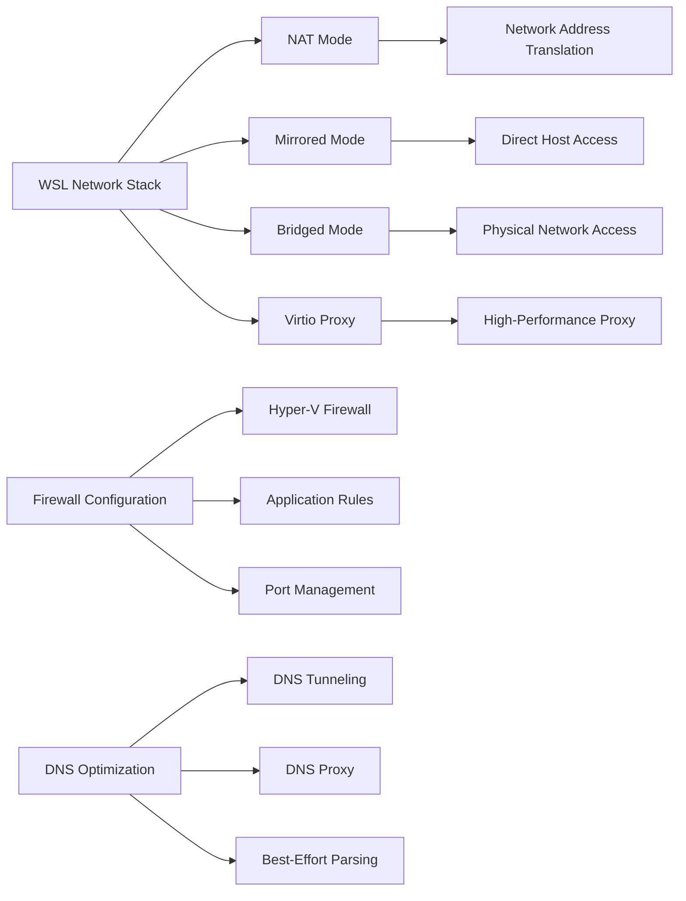
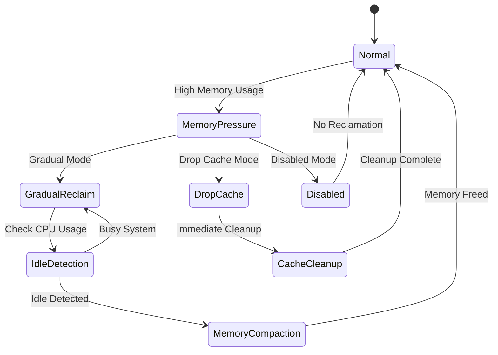
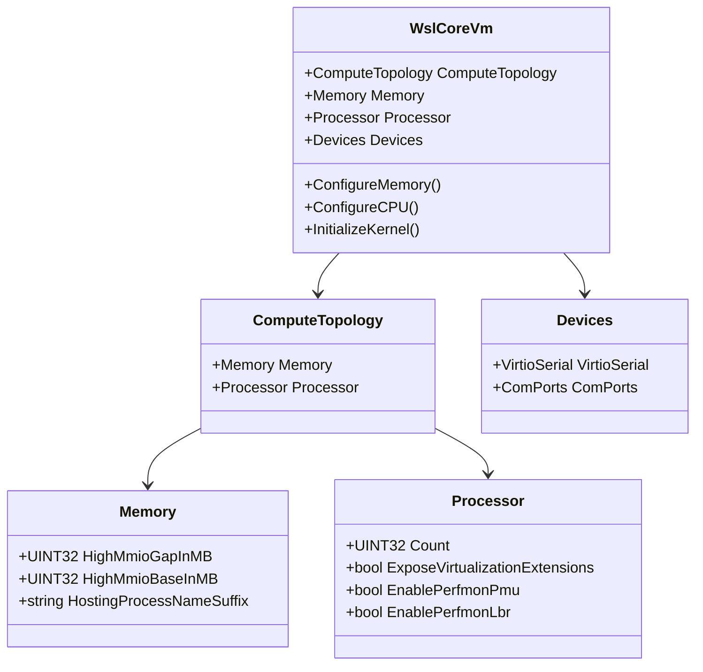
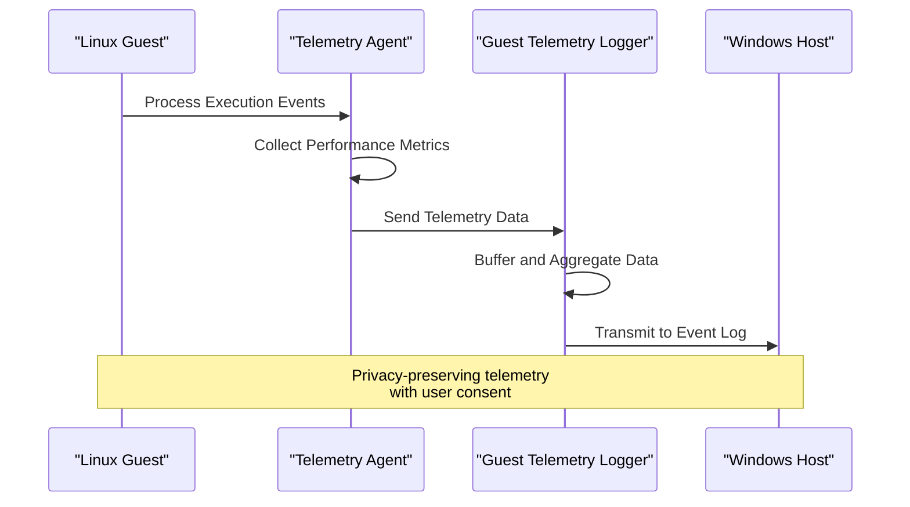

# Performance Tuning

<cite>
**Referenced Files in This Document**
- [WslCoreConfig.cpp](file://src/windows/common/WslCoreConfig.cpp)
- [WslCoreConfig.h](file://src/windows/common/WslCoreConfig.h)
- [config.cpp](file://src/linux/init/config.cpp)
- [config.h](file://src/linux/init/config.h)
- [main.cpp](file://src/linux/init/main.cpp)
- [WslCoreVm.cpp](file://src/windows/service/exe/WslCoreVm.cpp)
- [WslCoreFilesystem.cpp](file://src/windows/service/exe/WslCoreFilesystem.cpp)
- [MemAndProcViewModel.cs](file://src/windows/wslsettings/ViewModels/Settings/MemAndProcViewModel.cs)
- [configfile.cpp](file://src/shared/configfile/configfile.cpp)
- [WslCoreNetworkingSupport.h](file://src/windows/common/WslCoreNetworkingSupport.h)
- [GuestTelemetryLogger.cpp](file://src/windows/service/exe/GuestTelemetryLogger.cpp)
- [telemetry.cpp](file://src/linux/init/telemetry.cpp)
</cite>

## Table of Contents
1. [Introduction](#introduction)
2. [Core Performance Configuration Architecture](#core-performance-configuration-architecture)
3. [Memory Management and Limits](#memory-management-and-limits)
4. [CPU and Processor Optimization](#cpu-and-processor-optimization)
5. [Swap Configuration and Virtual Memory](#swap-configuration-and-virtual-memory)
6. [Storage and I/O Optimization](#storage-and-io-optimization)
7. [Networking Performance Tuning](#networking-performance-tuning)
8. [Resource Reclaim Strategies](#resource-reclaim-strategies)
9. [VM Subsystem Integration](#vm-subsystem-integration)
10. [Performance Monitoring and Telemetry](#performance-monitoring-and-telemetry)
11. [Common Issues and Solutions](#common-issues-and-solutions)
12. [Benchmarking and Optimization Guidelines](#benchmarking-and-optimization-guidelines)

## Introduction

WSL (Windows Subsystem for Linux) performance tuning involves optimizing multiple interconnected systems: the Windows host configuration, the Linux guest environment, and the underlying Hyper-V virtual machine. This comprehensive guide covers implementation details of CPU and memory limits, swap configuration, I/O optimization, and resource reclaim strategies, providing practical examples for development workloads and troubleshooting common performance issues.

The performance tuning system operates through multiple layers:
- **Windows Host Layer**: Configuration management, VM creation, and resource allocation
- **Linux Guest Layer**: Memory management, CPU scheduling, and I/O optimization  
- **Hyper-V Subsystem**: Virtual hardware abstraction and resource virtualization

## Core Performance Configuration Architecture

### Configuration File Structure

WSL uses a hierarchical configuration system with multiple layers of precedence:



**Diagram sources**
- [WslCoreConfig.cpp](file://src/windows/common/WslCoreConfig.cpp#L31-L128)
- [configfile.cpp](file://src/shared/configfile/configfile.cpp#L60-L106)

### Configuration Parameters Overview

The core configuration system manages several critical performance parameters:

| Parameter Category | Key Settings | Purpose |
|-------------------|--------------|---------|
| **Memory** | `wsl2.memory`, `wsl2.swap`, `wsl2.swapFile` | RAM allocation and virtual memory |
| **CPU** | `wsl2.processors`, `wsl2.nestedVirtualization` | Processor allocation and virtualization |
| **Storage** | `wsl2.virtio`, `wsl2.virtiofs`, `wsl2.virtio9p` | File system optimization |
| **Networking** | `wsl2.networkingMode`, `wsl2.firewall` | Network performance and security |
| **I/O** | `wsl2.mountDeviceTimeout`, `wsl2.sparseVhd` | Storage and mount performance |

**Section sources**
- [WslCoreConfig.h](file://src/windows/common/WslCoreConfig.h#L233-L294)
- [WslCoreConfig.cpp](file://src/windows/common/WslCoreConfig.cpp#L72-L127)

## Memory Management and Limits

### Memory Allocation Architecture

WSL implements sophisticated memory management with multiple tiers of control:



**Diagram sources**
- [WslCoreConfig.h](file://src/windows/common/WslCoreConfig.h#L51-L82)
- [WslCoreVm.cpp](file://src/windows/service/exe/WslCoreVm.cpp#L1584-L1590)
- [main.cpp](file://src/linux/init/main.cpp#L267-L311)

### Memory Limit Implementation

The memory configuration system implements intelligent defaults and validation:

#### Automatic Memory Calculation
- **Default Memory**: 50% of host physical memory
- **Minimum Memory**: 256 MB
- **Maximum Memory**: Total system physical memory
- **Swap Calculation**: 25% of memory size, rounded to nearest GB

#### Memory Reclamation Strategies

The system implements three memory reclaim modes:

1. **Disabled**: No automatic memory management
2. **Gradual**: Progressive memory compaction during idle periods
3. **DropCache**: Aggressive cache clearing when memory pressure detected

**Section sources**
- [WslCoreConfig.cpp](file://src/windows/common/WslCoreConfig.cpp#L304-L327)
- [main.cpp](file://src/linux/init/main.cpp#L267-L446)

## CPU and Processor Optimization

### Processor Configuration System

WSL provides fine-grained control over CPU allocation and virtualization features:



**Diagram sources**
- [WslCoreVm.cpp](file://src/windows/service/exe/WslCoreVm.cpp#L1591-L1624)
- [main.cpp](file://src/linux/init/main.cpp#L1642-L1643)

### CPU Performance Features

#### Nested Virtualization Support
- **AMD64 Platforms**: Supported on Windows 11 and newer
- **ARM64 Platforms**: Limited support based on processor capabilities
- **Feature Detection**: Automatic capability detection and fallback

#### Hardware Performance Counters
- **PMU (Performance Monitoring Unit)**: Advanced profiling capabilities
- **Branch Prediction**: Enhanced branch prediction for better performance
- **Instruction-Level Profiling**: Detailed performance analysis

#### CPU Topology Configuration
- **Processor Count**: Dynamic allocation based on host capabilities
- **Core Affinity**: Optimized thread placement for NUMA awareness
- **Frequency Scaling**: Adaptive clock speed management

**Section sources**
- [WslCoreVm.cpp](file://src/windows/service/exe/WslCoreVm.cpp#L1604-L1638)
- [WslCoreConfig.cpp](file://src/windows/common/WslCoreConfig.cpp#L291-L302)

## Swap Configuration and Virtual Memory

### Swap System Architecture

WSL implements a comprehensive virtual memory system with configurable swap behavior:



**Diagram sources**
- [WslCoreConfig.cpp](file://src/windows/common/WslCoreConfig.cpp#L320-L327)
- [WslCoreFilesystem.cpp](file://src/windows/service/exe/WslCoreFilesystem.cpp#L30-L70)

### Swap Configuration Options

#### Automatic Swap Calculation
The system calculates optimal swap sizes based on memory requirements:

```cpp
// Swap calculation formula: (MemorySizeBytes / 4 + 1GB - 1) & ~(1GB - 1)
// Example: 8GB memory → 2GB swap + 1GB = 3GB → rounded to 4GB
```

#### Manual Swap Configuration
Users can specify custom swap settings:
- **Fixed Swap Size**: Exact byte value for swap allocation
- **Swap File Location**: Custom path for swap file placement
- **Swap File Type**: Sparse vs. dense swap files

#### Swap Performance Optimization
- **Sparse VHD**: Reduced disk usage with minimal performance impact
- **Swap File Placement**: Optimal storage location for I/O performance
- **Swap Activation Timing**: Intelligent activation based on memory pressure

**Section sources**
- [WslCoreConfig.cpp](file://src/windows/common/WslCoreConfig.cpp#L158-L161)
- [WslCoreFilesystem.cpp](file://src/windows/service/exe/WslCoreFilesystem.cpp#L30-L70)

## Storage and I/O Optimization

### File System Performance Architecture

WSL provides multiple file system optimization strategies for different workload patterns:



**Diagram sources**
- [WslCoreFilesystem.cpp](file://src/windows/service/exe/WslCoreFilesystem.cpp#L30-L70)
- [WslCoreConfig.cpp](file://src/windows/common/WslCoreConfig.cpp#L245-L246)

### Storage Configuration Options

#### Virtio File System Types
- **Virtio-9P**: Legacy network file system with good compatibility
- **Virtio-FS**: Modern high-performance shared file system
- **DrvFs**: Native Windows file system integration

#### VHD Configuration
- **Block Size**: 1MB blocks for optimal Linux performance
- **Sparse vs Fixed**: Trade-off between disk usage and performance
- **Compression**: Optional compression for storage efficiency

#### Mount Performance Tuning
- **Mount Timeout**: Configurable timeout for mount operations
- **Mount Namespace**: Isolated mount environments
- **Mount Caching**: Intelligent caching for frequently accessed paths

**Section sources**
- [WslCoreFilesystem.cpp](file://src/windows/service/exe/WslCoreFilesystem.cpp#L30-L70)
- [WslCoreConfig.cpp](file://src/windows/common/WslCoreConfig.cpp#L245-L246)

## Networking Performance Tuning

### Network Architecture and Optimization

WSL networking provides multiple modes optimized for different use cases:



**Diagram sources**
- [WslCoreNetworkingSupport.h](file://src/windows/common/WslCoreNetworkingSupport.h#L1-L46)
- [WslCoreConfig.cpp](file://src/windows/common/WslCoreConfig.cpp#L148-L152)

### Network Performance Features

#### Network Modes Comparison

| Mode | Use Case | Performance | Security | Complexity |
|------|----------|-------------|----------|------------|
| **NAT** | General development | Medium | Good | Low |
| **Mirrored** | Production testing | High | Excellent | Medium |
| **Bridged** | Network debugging | High | Variable | High |
| **Virtio Proxy** | High-performance apps | Very High | Good | Medium |

#### Firewall and Security Optimization
- **Hyper-V Firewall**: Integrated Windows Defender integration
- **Port Management**: Configurable port forwarding and blocking
- **Application Rules**: Granular application-level controls

#### DNS Performance Tuning
- **DNS Tunneling**: Direct DNS resolution from Windows
- **Best-Effort Parsing**: Graceful handling of unsupported DNS records
- **DNS Proxy**: Transparent proxy for DNS queries

**Section sources**
- [WslCoreConfig.cpp](file://src/windows/common/WslCoreConfig.cpp#L148-L152)
- [WslCoreNetworkingSupport.h](file://src/windows/common/WslCoreNetworkingSupport.h#L582-L618)

## Resource Reclaim Strategies

### Memory Reclamation System

WSL implements intelligent memory management with multiple reclaim strategies:



**Diagram sources**
- [main.cpp](file://src/linux/init/main.cpp#L267-L446)

### Reclamation Algorithm Details

#### Gradual Reclamation
- **Idle Detection**: Monitors CPU usage over 10-minute windows
- **Memory Targets**: Reduces memory usage to 97% of current level
- **Page Reporting**: Uses configurable page reporting order (0-9)
- **Memory Compact**: Triggers memory compaction during idle periods

#### Drop Cache Strategy
- **Immediate Cleanup**: Forces cache clearing when memory pressure detected
- **System Integration**: Uses `/proc/sys/vm/drop_caches` interface
- **Minimal Overhead**: Quick cleanup with minimal performance impact

#### Performance Thresholds
- **Idle Threshold**: 0.5% CPU usage over 30-second intervals
- **Memory Low**: 1GB minimum memory threshold
- **Memory High**: 1.1GB maximum memory threshold

**Section sources**
- [main.cpp](file://src/linux/init/main.cpp#L267-L446)

## VM Subsystem Integration

### Hyper-V Integration Architecture

WSL integrates deeply with Hyper-V for optimal virtualization performance:



**Diagram sources**
- [WslCoreVm.cpp](file://src/windows/service/exe/WslCoreVm.cpp#L1580-L1779)
- [hcs_schema.h](file://src/windows/common/hcs_schema.h#L318-L332)

### VM Configuration Parameters

#### Memory Topology
- **High MMIO Gap**: Configurable gap for device memory mapping
- **High MMIO Base**: Base address for high memory regions
- **Hosting Process Name**: Process naming for task manager visibility

#### CPU Configuration
- **Processor Count**: Dynamic allocation based on host capabilities
- **Virtualization Extensions**: Nested virtualization support
- **Performance Counters**: Hardware performance monitoring units

#### Device Configuration
- **Virtio Serial**: High-performance serial communication
- **COM Ports**: Legacy serial port support
- **Named Pipes**: Inter-process communication channels

**Section sources**
- [WslCoreVm.cpp](file://src/windows/service/exe/WslCoreVm.cpp#L1580-L1779)

## Performance Monitoring and Telemetry

### Telemetry Collection System

WSL implements comprehensive performance monitoring with minimal privacy impact:



**Diagram sources**
- [telemetry.cpp](file://src/linux/init/telemetry.cpp#L58-L95)
- [GuestTelemetryLogger.cpp](file://src/windows/service/exe/GuestTelemetryLogger.cpp#L80-L96)

### Performance Metrics Collection

#### Process Execution Tracking
- **Binary Names**: Popular executables and commands
- **Execution Frequency**: Usage patterns and frequency
- **Performance Impact**: Resource consumption metrics

#### System Resource Monitoring
- **Memory Usage**: Peak and average memory consumption
- **CPU Utilization**: Processor usage patterns
- **I/O Operations**: Disk and network I/O statistics

#### Telemetry Privacy Features
- **User Consent**: Opt-in/opt-out capabilities
- **Data Minimization**: Only essential metrics collected
- **Local Processing**: Telemetry data processed locally

**Section sources**
- [telemetry.cpp](file://src/linux/init/telemetry.cpp#L58-L95)
- [GuestTelemetryLogger.cpp](file://src/windows/service/exe/GuestTelemetryLogger.cpp#L80-L96)

## Common Issues and Solutions

### Memory-Related Problems

#### Symptoms and Diagnostics
- **Memory Leaks**: Gradual memory usage increase over time
- **Swap Thrashing**: Excessive swap file activity
- **OOM Killers**: Out-of-memory process termination

#### Solutions and Configuration
```bash
# Monitor memory usage
cat /proc/meminfo
cat /proc/vmstat

# Configure memory limits
echo "wsl2.memory=4GB" >> ~/.wslconfig
echo "wsl2.swap=2GB" >> ~/.wslconfig

# Enable memory reclaim
echo "experimental.autoMemoryReclaim=gradual" >> ~/.wslconfig
```

### I/O Performance Issues

#### Slow File Operations
- **Symptoms**: Long delays in file access operations
- **Causes**: Inefficient file system configuration
- **Solutions**: Enable Virtio-FS, optimize mount options

#### Network Latency Problems
- **Symptoms**: High network response times
- **Causes**: Suboptimal network configuration
- **Solutions**: Switch to Mirrored mode, configure firewall rules

### CPU Performance Bottlenecks

#### High CPU Usage
- **Symptoms**: Constant high CPU utilization
- **Causes**: Inefficient virtualization or resource contention
- **Solutions**: Adjust processor allocation, enable nested virtualization

#### Poor Multi-Core Scaling
- **Symptoms**: Limited performance improvement with additional cores
- **Causes**: NUMA topology misalignment
- **Solutions**: Configure processor affinity, optimize workload distribution

**Section sources**
- [main.cpp](file://src/linux/init/main.cpp#L267-L446)
- [WslCoreConfig.cpp](file://src/windows/common/WslCoreConfig.cpp#L447-L493)

## Benchmarking and Optimization Guidelines

### Performance Testing Methodology

#### Baseline Measurement
1. **System Preparation**: Clean installation, minimal background processes
2. **Configuration Standardization**: Consistent WSL settings across tests
3. **Environment Isolation**: Dedicated test environment without interference

#### Benchmark Categories
- **CPU Performance**: Compilation benchmarks, computational workloads
- **Memory Performance**: Memory bandwidth, allocation/deallocation rates
- **I/O Performance**: Disk throughput, file system operations
- **Network Performance**: Network throughput, latency measurements

### Optimization Best Practices

#### Development Workload Optimization
```bash
# Recommended configuration for development
cat > ~/.wslconfig << EOF
[wsl2]
processors=4
memory=8GB
swap=4GB
nestedVirtualization=true
vmSwitch=Default Switch
EOF
```

#### Production Workload Tuning
```bash
# Optimized for production environments
cat > ~/.wslconfig << EOF
[wsl2]
processors=8
memory=16GB
swap=8GB
networkingMode=mirrored
firewall=true
experimental.autoMemoryReclaim=gradual
EOF
```

#### High-Performance Computing
```bash
# Maximum performance configuration
cat > ~/.wslconfig << EOF
[wsl2]
processors=16
memory=32GB
swap=16GB
virtiofs=true
nestedVirtualization=true
hardwarePerformanceCounters=true
experimental.autoMemoryReclaim=disabled
EOF
```

### Performance Monitoring Tools

#### Built-in Monitoring
- **System Resources**: `htop`, `free`, `vmstat`
- **Network Statistics**: `iftop`, `nethogs`
- **Disk I/O**: `iotop`, `dstat`

#### WSL-Specific Tools
- **Telemetry Analysis**: Event viewer logs
- **Performance Counters**: Hardware performance monitoring
- **Resource Usage**: Task manager integration

#### Third-party Tools
- **Profiling**: `perf`, `valgrind`
- **Monitoring**: `collectl`, `sysdig`
- **Benchmarking**: `sysbench`, `stress-ng`

**Section sources**
- [MemAndProcViewModel.cs](file://src/windows/wslsettings/ViewModels/Settings/MemAndProcViewModel.cs#L115-L170)
- [WslCoreConfig.cpp](file://src/windows/common/WslCoreConfig.cpp#L304-L327)