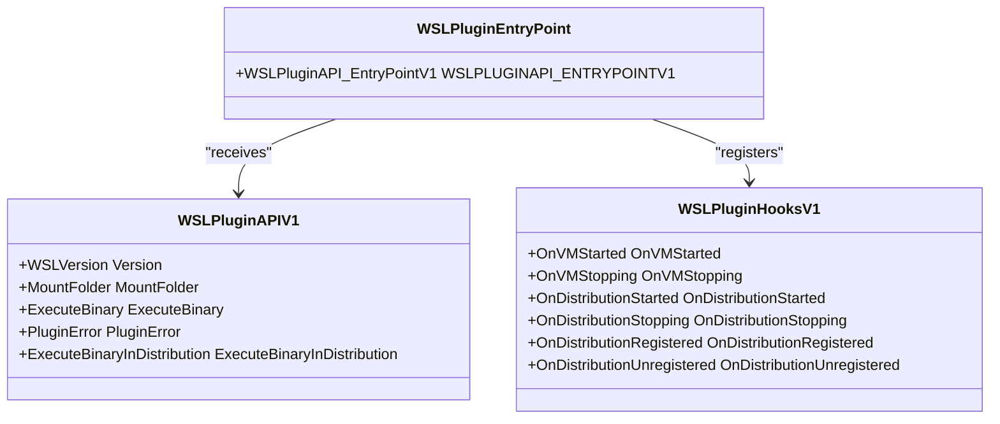
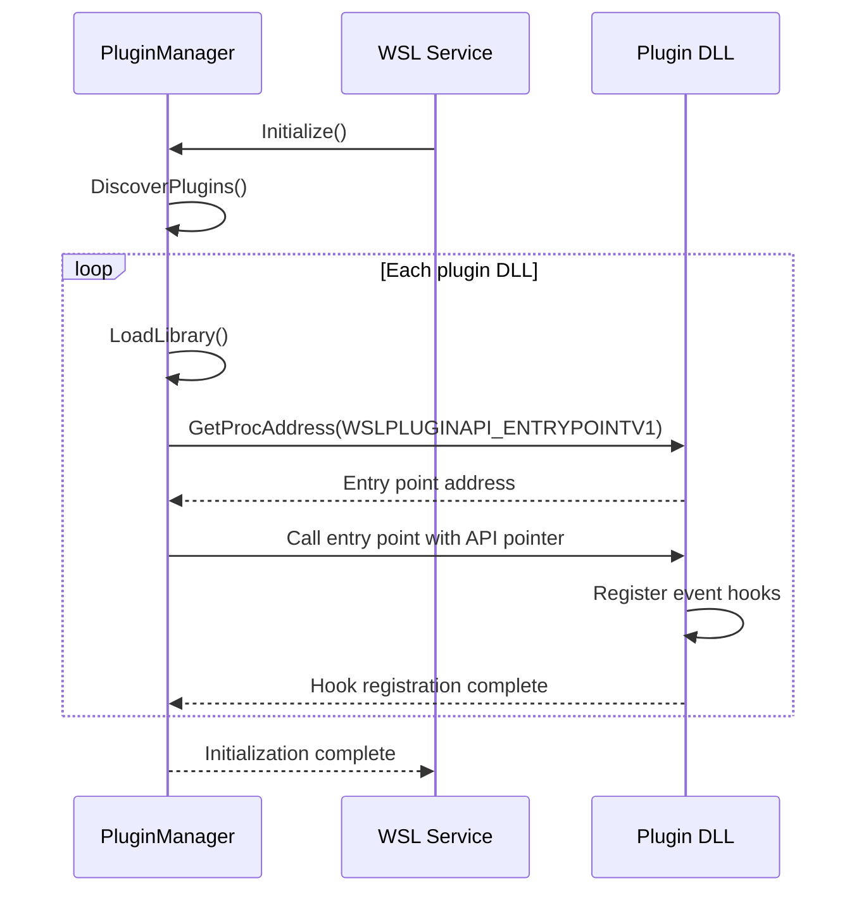
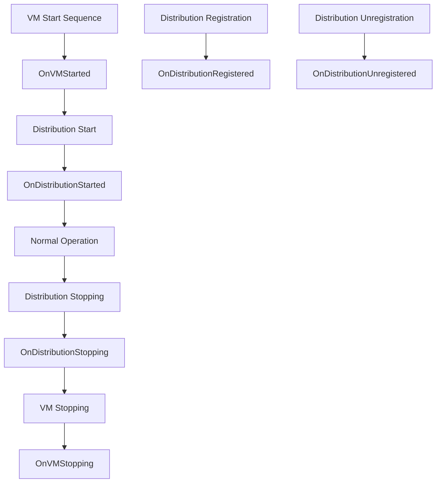
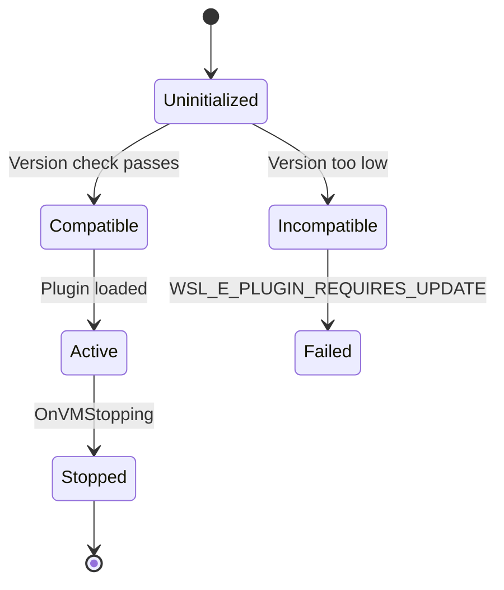

# Plugin System

<cite>
**Referenced Files in This Document**   
- [WslPluginApi.h](file://src/windows/inc/WslPluginApi.h)
- [PluginManager.h](file://src/windows/service/exe/PluginManager.h)
- [PluginManager.cpp](file://src/windows/service/exe/PluginManager.cpp)
- [README.WslPluginApi.MD](file://nuget/README.WslPluginApi.MD)
- [Plugin.cpp](file://test/windows/testplugin/Plugin.cpp)
</cite>

## Table of Contents
1. [Introduction](#introduction)
2. [Plugin API Architecture](#plugin-api-architecture)
3. [Core Components](#core-components)
4. [PluginManager Implementation](#pluginmanager-implementation)
5. [Lifecycle Event Handling](#lifecycle-event-handling)
6. [Client Implementation Guidelines](#client-implementation-guidelines)
7. [Security Considerations](#security-considerations)
8. [Versioning and Compatibility](#versioning-and-compatibility)
9. [Error Handling and Diagnostics](#error-handling-and-diagnostics)
10. [Testing and Debugging](#testing-and-debugging)
11. [Conclusion](#conclusion)

## Introduction

The WSL Plugin System enables external tools to extend Windows Subsystem for Linux functionality through a COM-based extension interface. This documentation provides comprehensive guidance on the plugin architecture, focusing on the WSLPluginHooksV1 interface and PluginManager implementation. The system allows third-party developers to integrate with WSL's lifecycle events, execute binaries within distributions, and mount folders between Windows and Linux environments.

The plugin system follows a versioned API approach with backward compatibility guarantees, allowing plugins to interact safely with WSL components while maintaining stability across updates. Plugins are implemented as DLLs that export specific entry points and register for lifecycle notifications.

**Section sources**
- [WslPluginApi.h](file://src/windows/inc/WslPluginApi.h#L1-L150)
- [README.WslPluginApi.MD](file://nuget/README.WslPluginApi.MD#L1-L100)

## Plugin API Architecture

The WSL Plugin API is designed around a versioned interface system that ensures compatibility between plugins and the WSL host. The architecture consists of two main components: the API functions provided by WSL to plugins, and the hooks that plugins register to receive lifecycle notifications.

**Diagram sources**
- [WslPluginApi.h](file://src/windows/inc/WslPluginApi.h#L137-L146)
- [WslPluginApi.h](file://src/windows/inc/WslPluginApi.h#L127-L135)

The architecture follows a dependency inversion pattern where WSL calls into plugins through well-defined interfaces rather than plugins calling into WSL directly. This design ensures better stability and security by controlling the interaction points between the core system and extensions.

## Core Components

The WSL plugin system consists of several key components that work together to enable extensibility. The core is formed by the WSLPluginAPIV1 structure which provides functions to plugins, and the WSLPluginHooksV1 structure which allows plugins to register for lifecycle events.

Plugins must implement the WSLPLUGINAPI_ENTRYPOINTV1 function which serves as the entry point for the plugin. When WSL loads a plugin, it calls this function and passes a pointer to the WSLPluginAPIV1 structure containing available API functions. The plugin then fills in the WSLPluginHooksV1 structure with function pointers to its event handlers.

The system includes version checking through the WSL_PLUGIN_REQUIRE_VERSION macro, which allows plugins to verify they are running against a compatible version of the WSL API. This prevents compatibility issues when the API evolves over time.

**Section sources**
- [WslPluginApi.h](file://src/windows/inc/WslPluginApi.h#L26-L146)
- [WslPluginApi.h](file://src/windows/inc/WslPluginApi.h#L36-L48)

## PluginManager Implementation

The PluginManager class is responsible for loading, initializing, and managing plugins within the WSL service. It handles the discovery of plugin DLLs, validation of their entry points, and coordination of lifecycle events.

**Diagram sources**
- [PluginManager.cpp](file://src/windows/service/exe/PluginManager.cpp#L50-L200)
- [PluginManager.h](file://src/windows/service/exe/PluginManager.h#L15-L80)

The PluginManager implements robust error handling for plugin loading failures, including cases where DLLs cannot be loaded, entry points are missing, or version requirements are not met. It maintains a collection of loaded plugins and ensures that lifecycle events are delivered to all registered plugins in a controlled manner.

## Lifecycle Event Handling

The plugin system provides several lifecycle events that allow plugins to respond to key moments in the WSL environment. These events are delivered synchronously during critical operations, allowing plugins to perform necessary actions or report errors.

**Diagram sources**
- [WslPluginApi.h](file://src/windows/inc/WslPluginApi.h#L105-L126)
- [PluginManager.cpp](file://src/windows/service/exe/PluginManager.cpp#L150-L300)

Plugins can register handlers for the following events:
- **OnVMStarted**: Called when the WSL virtual machine has started
- **OnVMStopping**: Called when the VM is about to stop
- **OnDistributionStarted**: Called when a distribution has started
- **OnDistributionStopping**: Called when a distribution is about to stop
- **OnDistributionRegistered**: Called when a distribution is registered
- **OnDistributionUnregistered**: Called when a distribution is unregistered

Each event handler receives relevant context information such as session identifiers, distribution details, and user settings, allowing plugins to make informed decisions based on the current state.

**Section sources**
- [WslPluginApi.h](file://src/windows/inc/WslPluginApi.h#L105-L135)
- [PluginManager.cpp](file://src/windows/service/exe/PluginManager.cpp#L200-L400)

## Client Implementation Guidelines

When implementing a WSL plugin, developers should follow these guidelines to ensure compatibility and reliability:

1. **Entry Point Implementation**: Export the WSLPLUGINAPI_ENTRYPOINTV1 function and validate the API version using WSL_PLUGIN_REQUIRE_VERSION
2. **Event Registration**: Register only the event handlers that are needed for your plugin's functionality
3. **Synchronous Processing**: Keep event handlers fast and avoid blocking operations since they run synchronously
4. **Error Reporting**: Use PluginError to report user-facing error messages when initialization fails
5. **Resource Management**: Properly clean up resources in stopping handlers to prevent leaks

Plugins should be implemented as DLLs with proper COM-style interfaces and should not maintain global state that could interfere with multiple WSL instances. The plugin should be reentrant and thread-safe where necessary.

**Section sources**
- [WslPluginApi.h](file://src/windows/inc/WslPluginApi.h#L146-L150)
- [Plugin.cpp](file://test/windows/testplugin/Plugin.cpp#L1-L100)

## Security Considerations

The WSL plugin system incorporates several security measures to protect the integrity of the WSL environment:

- **Sandboxed Execution**: Plugins run in the WSL service context with limited privileges
- **Version Validation**: The version checking mechanism prevents incompatible plugins from loading
- **Error Isolation**: Plugin failures are contained and do not affect the core WSL functionality
- **User Message Filtering**: PluginError messages are validated to prevent injection attacks

Plugins should follow the principle of least privilege and only request the capabilities they need. They should validate all inputs and handle errors gracefully to prevent denial of service conditions. Sensitive operations should be performed with appropriate security checks and auditing.

**Section sources**
- [WslPluginApi.h](file://src/windows/inc/WslPluginApi.h#L27-L34)
- [PluginManager.cpp](file://src/windows/service/exe/PluginManager.cpp#L300-L500)

## Versioning and Compatibility

The WSL plugin system uses a three-part versioning scheme (Major.Minor.Revision) to manage API evolution while maintaining backward compatibility. The WSL_PLUGIN_REQUIRE_VERSION macro allows plugins to specify their minimum required API version.

**Diagram sources**
- [WslPluginApi.h](file://src/windows/inc/WslPluginApi.h#L29-L34)
- [WslPluginApi.h](file://src/windows/inc/WslPluginApi.h#L36-L41)

When new features are added, they are introduced in a backward-compatible manner:
- New functions are added to the API structure without changing existing ones
- New event handlers are added to the hooks structure
- Existing function signatures remain unchanged
- New fields in structures are added at the end

This approach allows older plugins to continue working with newer versions of WSL while enabling new plugins to take advantage of enhanced capabilities.

**Section sources**
- [WslPluginApi.h](file://src/windows/inc/WslPluginApi.h#L29-L34)
- [WslPluginApi.h](file://src/windows/inc/WslPluginApi.h#L143-L144)

## Error Handling and Diagnostics

The plugin system provides comprehensive error handling mechanisms for both the PluginManager and individual plugins. The PluginManager handles various loading and execution errors, while plugins can report user-facing errors through the PluginError function.

Common issues and their diagnostic approaches:

| Issue Type | Symptoms | Diagnostic Approach |
|-----------|---------|-------------------|
| Plugin Loading Failure | Plugin not loaded, no functionality | Check Windows Event Log, verify DLL dependencies |
| Interface Mismatch | Access violations, crashes | Validate API version, check function signatures |
| Event Handler Crashes | WSL instability, crashes | Implement structured exception handling, use logging |
| Version Incompatibility | WSL_E_PLUGIN_REQUIRES_UPDATE | Check version requirements, update plugin |
| Resource Leaks | Memory growth, performance degradation | Monitor resource usage, implement proper cleanup |

Plugins should implement robust error handling and use structured exception handling where appropriate. They should log diagnostic information to aid in troubleshooting while being careful not to log sensitive data.

**Section sources**
- [WslPluginApi.h](file://src/windows/inc/WslPluginApi.h#L27-L28)
- [PluginManager.cpp](file://src/windows/service/exe/PluginManager.cpp#L400-L600)
- [WslPluginApi.h](file://src/windows/inc/WslPluginApi.h#L100-L102)

## Testing and Debugging

The WSL repository includes a test plugin implementation that serves as both a test case and example for developers. This plugin demonstrates proper implementation of the plugin interface and can be used as a starting point for new plugins.

Debugging strategies for plugin developers:
1. Use the test plugin as a reference implementation
2. Enable WSL logging to capture plugin loading and execution events
3. Use Windows debugging tools to attach to the WSL service process
4. Implement comprehensive logging within the plugin
5. Test with different WSL versions to verify compatibility

The PluginTests.cpp file contains unit tests that verify the PluginManager functionality, including plugin loading, event dispatching, and error handling scenarios.

**Section sources**
- [Plugin.cpp](file://test/windows/testplugin/Plugin.cpp#L1-L150)
- [PluginTests.cpp](file://test/windows/PluginTests.cpp#L1-L200)

## Conclusion

The WSL Plugin System provides a robust and secure framework for extending WSL functionality through external plugins. By following the documented API and implementation guidelines, developers can create plugins that integrate seamlessly with the WSL lifecycle while maintaining compatibility across versions.

Key takeaways for plugin developers:
- Implement the required entry point and register only necessary event handlers
- Perform version checking to ensure API compatibility
- Handle errors gracefully and provide meaningful user feedback
- Follow security best practices and principle of least privilege
- Test thoroughly across different WSL versions and configurations

The PluginManager implementation ensures reliable plugin loading and lifecycle management, making the system stable and maintainable. With proper implementation, plugins can enhance the WSL experience without compromising system stability or security.