# WSL Security Model

<cite>
**Referenced Files in This Document**
- [WslSecurity.cpp](file://src/windows/common/WslSecurity.cpp)
- [WslSecurity.h](file://src/windows/common/WslSecurity.h)
- [LxssSecurity.cpp](file://src/windows/service/exe/LxssSecurity.cpp)
- [LxssSecurity.h](file://src/windows/service/exe/LxssSecurity.h)
- [wslpolicies.h](file://src/windows/inc/wslpolicies.h)
- [LxssCreateProcess.cpp](file://src/windows/service/exe/LxssCreateProcess.cpp)
- [LxssCreateProcess.h](file://src/windows/service/exe/LxssCreateProcess.h)
- [WslCoreFirewallSupport.cpp](file://src/windows/common/WslCoreFirewallSupport.cpp)
- [WslCoreFirewallSupport.h](file://src/windows/common/WslCoreFirewallSupport.h)
- [hcs.cpp](file://src/windows/common/hcs.cpp)
- [WslCoreInstance.cpp](file://src/windows/service/exe/WslCoreInstance.cpp)
- [WslCoreVm.cpp](file://src/windows/service/exe/WslCoreVm.cpp)
- [registry.cpp](file://src/windows/common/registry.cpp)
- [PolicyTests.cpp](file://test/windows/PolicyTests.cpp)
</cite>

## Table of Contents
1. [Introduction](#introduction)
2. [Security Architecture Overview](#security-architecture-overview)
3. [User Isolation Mechanisms](#user-isolation-mechanisms)
4. [Firewall Integration](#firewall-integration)
5. [Policy Enforcement System](#policy-enforcement-system)
6. [Process Creation Security](#process-creation-security)
7. [VM-Level Security](#vm-level-security)
8. [Registry-Based Policy Management](#registry-based-policy-management)
9. [Common Security Issues and Mitigations](#common-security-issues-and-mitigations)
10. [Security Best Practices](#security-best-practices)
11. [Troubleshooting Guide](#troubleshooting-guide)
12. [Conclusion](#conclusion)

## Introduction

The Windows Subsystem for Linux (WSL) implements a comprehensive security model designed to protect both the Windows host and Linux guest environments from unauthorized access, privilege escalation, and malicious activities. This security model operates at multiple layers, including user isolation, process security, network protection, and policy enforcement.

The WSL security architecture is built around several core principles:
- **Principle of Least Privilege**: Processes operate with minimal required permissions
- **Defense in Depth**: Multiple security layers provide comprehensive protection
- **Separation of Concerns**: Clear boundaries between Windows and Linux security domains
- **Audit and Monitoring**: Comprehensive logging and telemetry for security events

## Security Architecture Overview

The WSL security model consists of several interconnected components that work together to provide comprehensive protection:

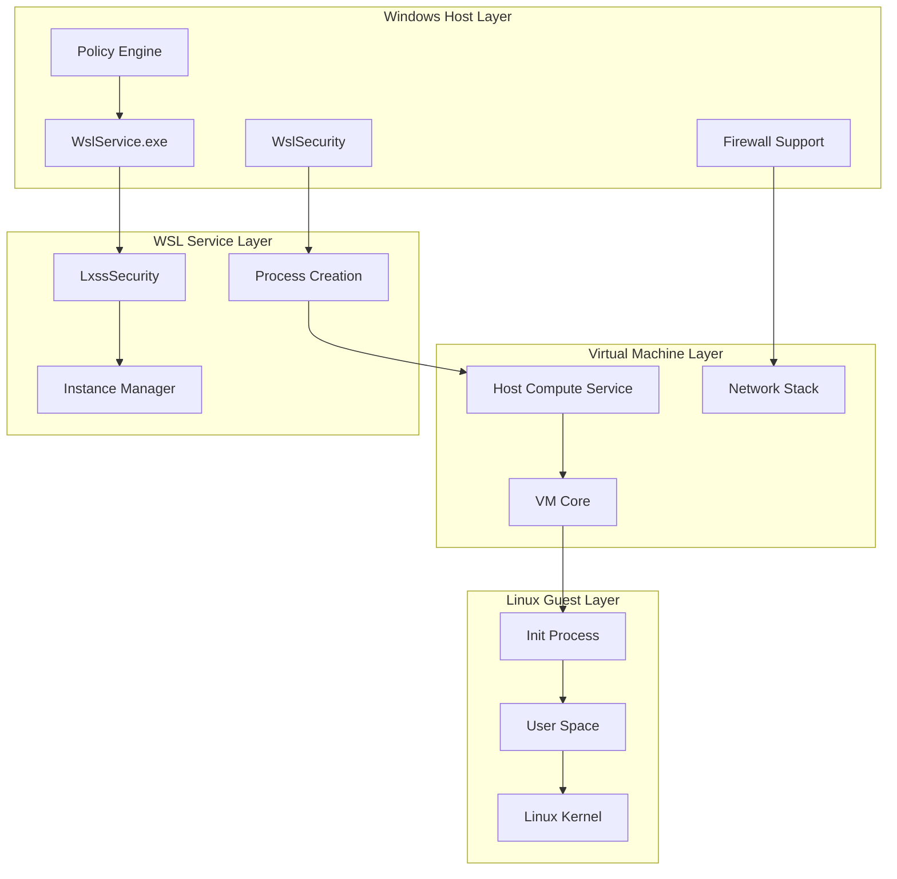

**Diagram sources**
- [WslSecurity.cpp](file://src/windows/common/WslSecurity.cpp#L1-L181)
- [LxssSecurity.cpp](file://src/windows/service/exe/LxssSecurity.cpp#L1-L49)
- [hcs.cpp](file://src/windows/common/hcs.cpp#L1-L284)

**Section sources**
- [WslSecurity.cpp](file://src/windows/common/WslSecurity.cpp#L1-L181)
- [LxssSecurity.cpp](file://src/windows/service/exe/LxssSecurity.cpp#L1-L49)

## User Isolation Mechanisms

WSL implements sophisticated user isolation mechanisms to prevent unauthorized access between different user contexts and to protect against privilege escalation attacks.

### Token-Based Security

The security system uses Windows security tokens to enforce user isolation:

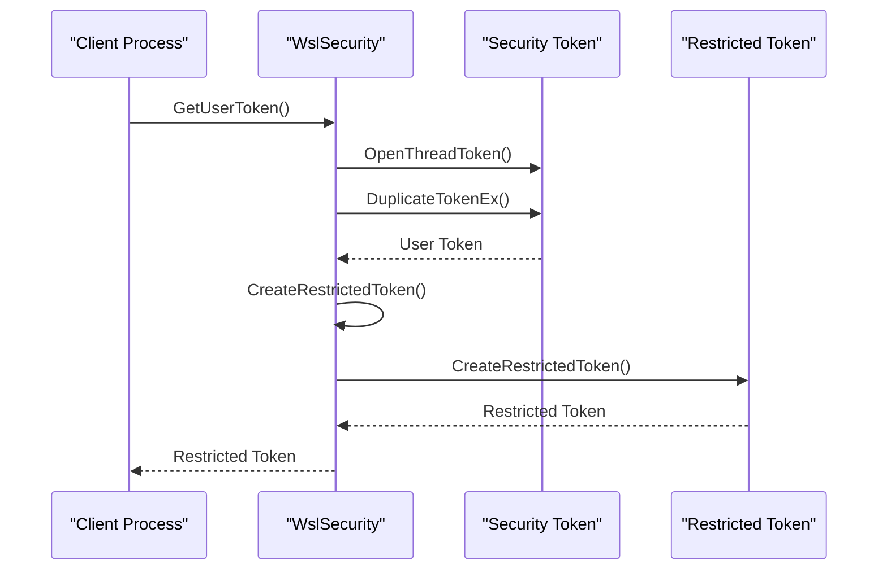

**Diagram sources**
- [WslSecurity.cpp](file://src/windows/common/WslSecurity.cpp#L138-L162)

### Integrity Level Management

WSL implements strict integrity level controls to prevent privilege escalation:

| Integrity Level | Description | Access Rights |
|----------------|-------------|---------------|
| Untrusted | Lowest level, restricted access | Minimal system access, no administrative privileges |
| Low | Standard user level | Limited system access, restricted file operations |
| Medium | Elevated user level | Enhanced system access, controlled administrative operations |
| High | Administrator level | Full system access, unrestricted operations |

### Mount Namespace Isolation

WSL creates separate mount namespaces for elevated and non-elevated processes:

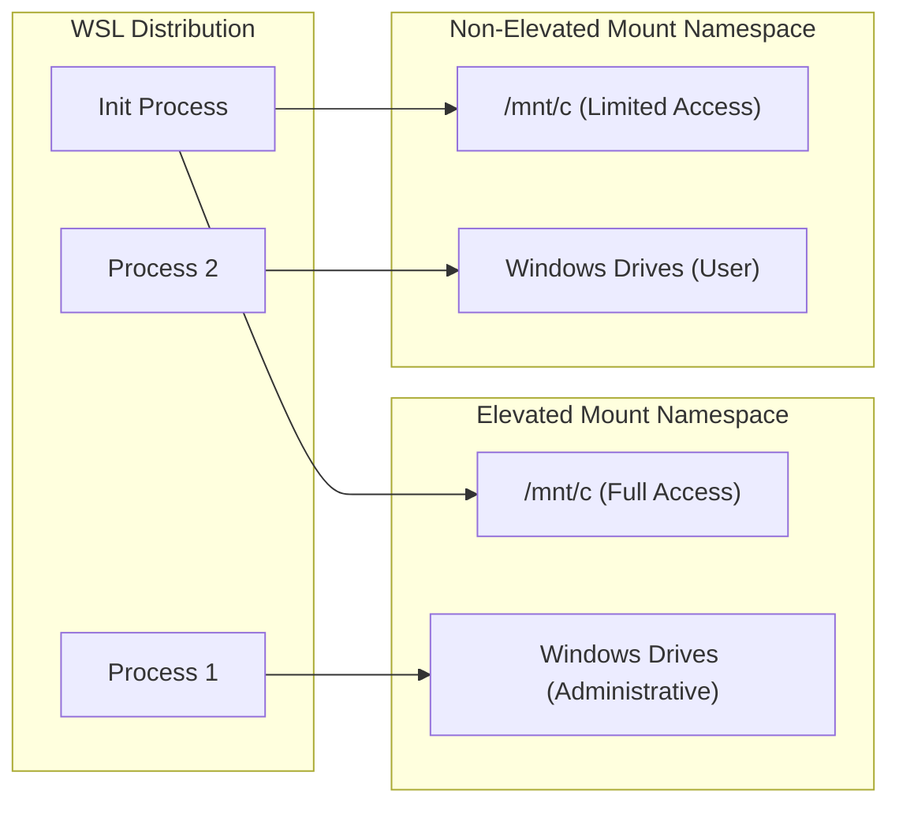

**Diagram sources**
- [WslCoreInstance.cpp](file://src/windows/service/exe/WslCoreInstance.cpp#L159-L200)

**Section sources**
- [WslSecurity.cpp](file://src/windows/common/WslSecurity.cpp#L68-L100)
- [WslCoreInstance.cpp](file://src/windows/service/exe/WslCoreInstance.cpp#L159-L200)

## Firewall Integration

WSL integrates deeply with Windows firewall systems to provide network security controls and prevent unauthorized network access.

### Hyper-V Firewall Support

WSL implements comprehensive firewall support through the Hyper-V firewall subsystem:

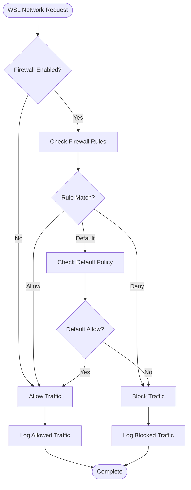

**Diagram sources**
- [WslCoreFirewallSupport.cpp](file://src/windows/common/WslCoreFirewallSupport.cpp#L431-L491)

### Firewall Rule Configuration

WSL supports multiple types of firewall rules for comprehensive network protection:

| Rule Type | Purpose | Scope |
|-----------|---------|-------|
| Loopback Rules | Allow localhost communication | Localhost interface |
| Local Subnet Rules | Enable internal network access | Internal network ranges |
| ICMP Rules | Allow network diagnostics | ICMP protocol support |
| mDNS Rules | Enable service discovery | Multicast DNS support |
| Custom Rules | User-defined policies | Specific port/protocol combinations |

### WMI-Based Firewall Management

WSL uses Windows Management Instrumentation (WMI) for firewall configuration:

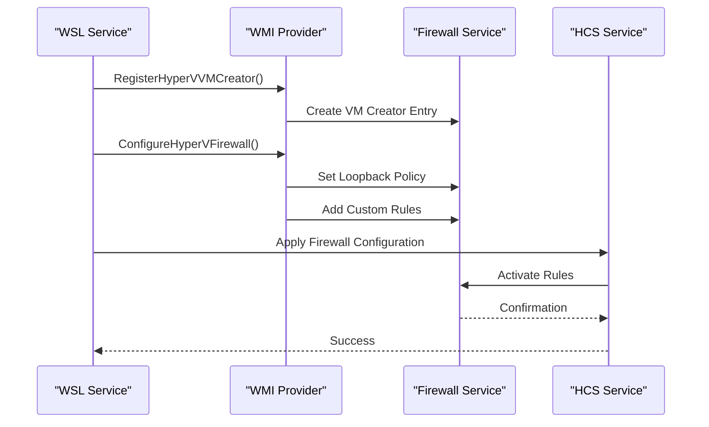

**Diagram sources**
- [WslCoreFirewallSupport.cpp](file://src/windows/common/WslCoreFirewallSupport.cpp#L269-L362)

**Section sources**
- [WslCoreFirewallSupport.cpp](file://src/windows/common/WslCoreFirewallSupport.cpp#L1-L846)
- [WslCoreFirewallSupport.h](file://src/windows/common/WslCoreFirewallSupport.h#L1-L36)

## Policy Enforcement System

WSL implements a comprehensive policy enforcement system that allows administrators to control WSL functionality through registry-based configurations.

### Registry-Based Policy Architecture

The policy system operates through the Windows registry hierarchy:

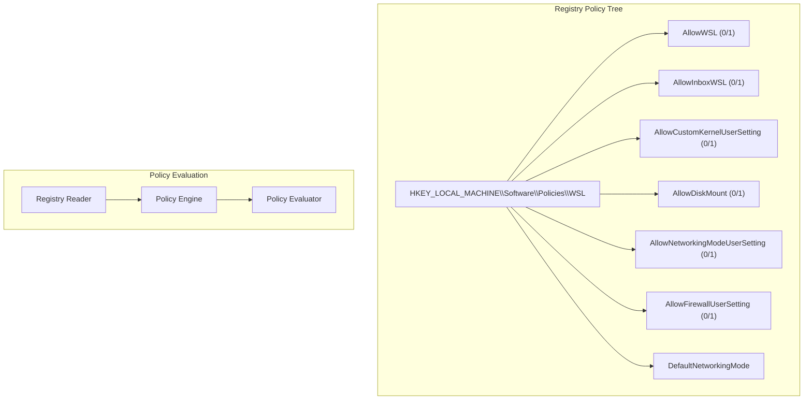

**Diagram sources**
- [wslpolicies.h](file://src/windows/inc/wslpolicies.h#L17-L33)

### Policy Implementation Details

The policy system provides granular control over WSL features:

| Policy Name | Registry Key | Effect |
|-------------|--------------|--------|
| AllowWSL | Software\Policies\WSL\AllowWSL | Completely enables/disables WSL |
| AllowInboxWSL | Software\Policies\WSL\AllowInboxWSL | Controls built-in WSL distributions |
| AllowKernelUserSetting | Software\Policies\WSL\AllowKernelUserSetting | Allows custom kernel configuration |
| AllowDiskMount | Software\Policies\WSL\AllowDiskMount | Controls Windows drive mounting |
| AllowNetworkingModeUserSetting | Software\Policies\WSL\AllowNetworkingModeUserSetting | Allows custom networking configuration |
| AllowFirewallUserSetting | Software\Policies\WSL\AllowFirewallUserSetting | Allows custom firewall configuration |

### Policy Validation and Enforcement

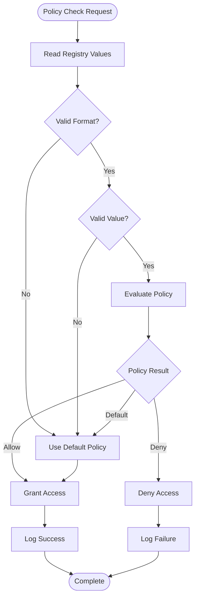

**Diagram sources**
- [wslpolicies.h](file://src/windows/inc/wslpolicies.h#L64-L88)

**Section sources**
- [wslpolicies.h](file://src/windows/inc/wslpolicies.h#L1-L105)
- [PolicyTests.cpp](file://test/windows/PolicyTests.cpp#L1-L398)

## Process Creation Security

WSL implements robust security measures during process creation to prevent privilege escalation and ensure proper isolation.

### Secure Process Creation Pipeline

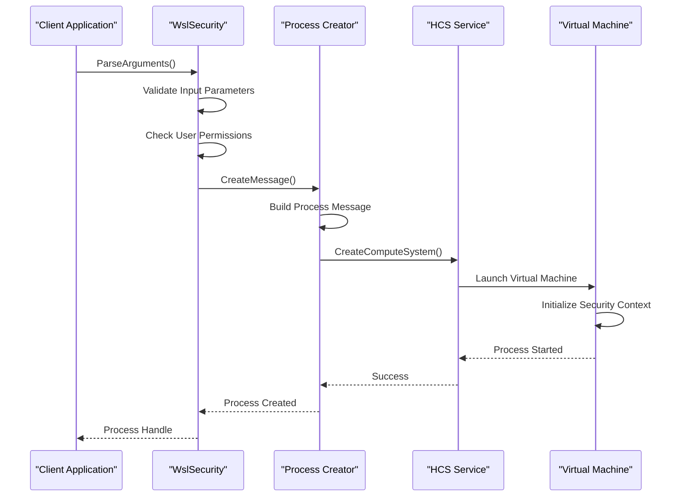

**Diagram sources**
- [LxssCreateProcess.cpp](file://src/windows/service/exe/LxssCreateProcess.cpp#L18-L305)

### Privilege Escalation Prevention

WSL implements multiple layers of protection against privilege escalation:

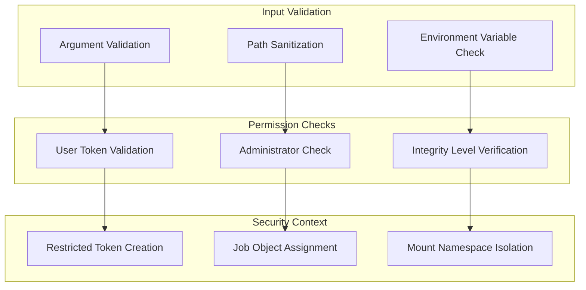

**Diagram sources**
- [LxssCreateProcess.cpp](file://src/windows/service/exe/LxssCreateProcess.cpp#L18-L105)

### Process Isolation Features

| Feature | Purpose | Implementation |
|---------|---------|----------------|
| Job Object Assignment | Resource control and termination | Automatic job object creation with silo isolation |
| Mount Namespace Separation | Drive access isolation | Separate namespaces for elevated/non-elevated processes |
| Token Restriction | Privilege limitation | Restricted tokens with minimal privileges |
| Process Mitigation | Code injection prevention | Dynamic code policy and font disable policy |

**Section sources**
- [LxssCreateProcess.cpp](file://src/windows/service/exe/LxssCreateProcess.cpp#L1-L305)
- [LxssCreateProcess.h](file://src/windows/service/exe/LxssCreateProcess.h#L1-L167)

## VM-Level Security

WSL implements comprehensive security at the virtual machine level through the Host Compute Service (HCS) integration.

### HCS Security Integration

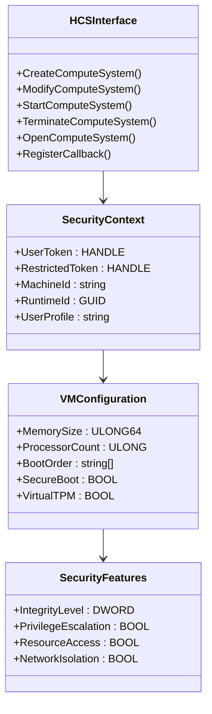

**Diagram sources**
- [hcs.cpp](file://src/windows/common/hcs.cpp#L1-L284)
- [WslCoreVm.cpp](file://src/windows/service/exe/WslCoreVm.cpp#L1-L200)

### VM Security Features

WSL implements several security features at the VM level:

| Feature | Description | Security Benefit |
|---------|-------------|------------------|
| Secure Boot | Cryptographic verification of boot components | Prevents bootkit attacks |
| Virtual TPM | Hardware-backed cryptographic operations | Secure key storage |
| Memory Encryption | Encrypted virtual machine memory | Protects sensitive data |
| Resource Isolation | Controlled access to physical resources | Prevents resource exhaustion attacks |
| Network Isolation | Virtualized network stack | Prevents network-based attacks |

### VM Initialization Security

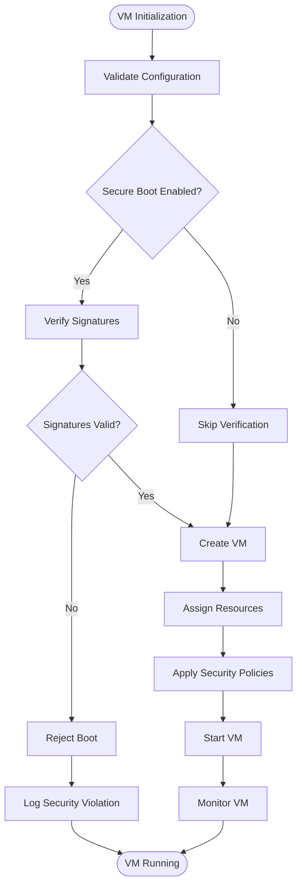

**Diagram sources**
- [WslCoreVm.cpp](file://src/windows/service/exe/WslCoreVm.cpp#L168-L200)

**Section sources**
- [hcs.cpp](file://src/windows/common/hcs.cpp#L1-L284)
- [WslCoreVm.cpp](file://src/windows/service/exe/WslCoreVm.cpp#L1-L200)

## Registry-Based Policy Management

WSL implements comprehensive registry-based policy management for centralized configuration control.

### Registry Access Patterns

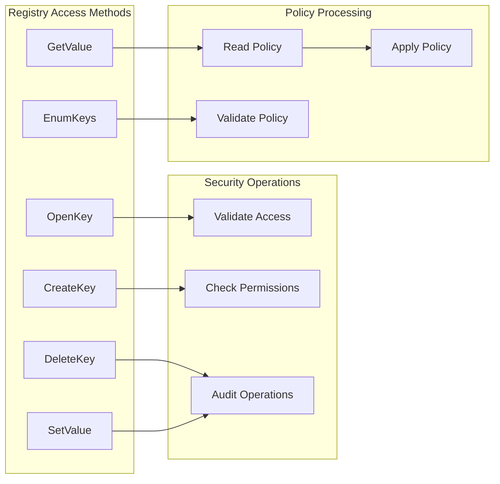

**Diagram sources**
- [registry.cpp](file://src/windows/common/registry.cpp#L1-L200)

### Policy Persistence and Validation

The registry system implements robust persistence and validation mechanisms:

| Operation | Security Measure | Purpose |
|-----------|------------------|---------|
| Key Creation | Access control validation | Prevent unauthorized key creation |
| Value Setting | Type and size validation | Prevent malformed data injection |
| Key Deletion | Recursive permission checking | Ensure complete removal |
| Enumeration | Access filtering | Control visibility of configuration |
| Backup/Restore | Integrity verification | Maintain configuration consistency |

**Section sources**
- [registry.cpp](file://src/windows/common/registry.cpp#L1-L200)

## Common Security Issues and Mitigations

### Permission Misconfigurations

**Issue**: Incorrect file or directory permissions allowing unauthorized access.

**Mitigation**: WSL implements strict permission checking during file operations and enforces Unix-style permissions within the Linux environment while maintaining Windows security boundaries.

### Insecure File Sharing

**Issue**: Excessive access to Windows drives from Linux processes.

**Mitigation**: WSL uses mount namespace separation and restricted tokens to limit access based on process elevation level. Administrators can configure drive mounting policies through registry settings.

### Network Exposure

**Issue**: Unrestricted network access leading to potential attacks.

**Mitigation**: WSL implements comprehensive firewall integration with configurable rulesets. Network isolation can be controlled through policy settings and firewall configurations.

### Privilege Escalation Vectors

**Issue**: Exploitation of process creation vulnerabilities.

**Mitigation**: Multiple security layers including input validation, token restriction, job object isolation, and process mitigation policies prevent unauthorized privilege escalation.

### Attack Surface Reduction Strategies

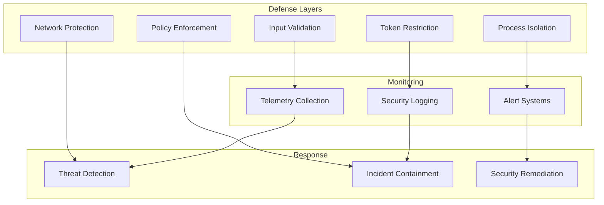

## Security Best Practices

### For Administrators

1. **Implement Least Privilege Principle**
   - Configure WSL policies to restrict unnecessary features
   - Use registry policies to disable custom kernel settings when not required
   - Limit disk mounting capabilities to essential scenarios

2. **Network Security Configuration**
   - Configure appropriate firewall rules for WSL networking
   - Use network isolation modes based on security requirements
   - Monitor network traffic from WSL instances

3. **Regular Security Auditing**
   - Enable telemetry and logging for security events
   - Monitor policy compliance and enforcement
   - Review access patterns and privilege usage

4. **Patch Management**
   - Keep WSL components updated with latest security patches
   - Monitor for security advisories related to WSL
   - Test updates in controlled environments before deployment

### For Developers

1. **Secure Coding Practices**
   - Validate all input parameters before passing to WSL
   - Use appropriate error handling for security operations
   - Implement proper resource cleanup and isolation

2. **Process Security**
   - Create processes with minimal required privileges
   - Use job objects for resource control
   - Implement proper termination handling

3. **Network Security**
   - Validate network configuration parameters
   - Use secure communication protocols
   - Implement proper firewall rule management

### For End Users

1. **Access Control**
   - Use appropriate user accounts for WSL operations
   - Understand the difference between elevated and non-elevated access
   - Report suspicious activities immediately

2. **Configuration Awareness**
   - Understand the security implications of WSL features
   - Review and understand policy configurations
   - Keep personal data separate from WSL environments

## Troubleshooting Guide

### Common Security Issues

**Issue**: WSL processes failing to start with access denied errors.

**Diagnosis Steps**:
1. Check WSL policy settings in the registry
2. Verify user account permissions
3. Review Windows Event logs for security-related events
4. Check integrity level of the user token

**Resolution**:
- Adjust WSL policies through Group Policy or registry
- Verify user account has appropriate privileges
- Reset WSL configuration if corrupted

**Issue**: Network connectivity problems from WSL.

**Diagnosis Steps**:
1. Check firewall rules for WSL
2. Verify network adapter configuration
3. Review network policy settings
4. Test with different networking modes

**Resolution**:
- Configure appropriate firewall rules
- Adjust network settings in WSL configuration
- Use bridged networking for better control

**Issue**: Privilege escalation attempts detected.

**Diagnosis Steps**:
1. Review security logs for suspicious activities
2. Check process creation events
3. Analyze token usage patterns
4. Verify job object assignments

**Resolution**:
- Strengthen policy enforcement
- Review process creation patterns
- Implement additional monitoring

### Diagnostic Tools and Commands

| Tool | Purpose | Usage |
|------|---------|-------|
| `wsl --status` | Check WSL status and configuration | Monitor overall system health |
| `wsl --shutdown` | Terminate all WSL instances | Reset security state |
| `Get-WinEvent` | Query Windows security events | Analyze security audit trails |
| `Get-ItemProperty` | Read registry policies | Verify policy configuration |

**Section sources**
- [WslSecurity.cpp](file://src/windows/common/WslSecurity.cpp#L1-L181)
- [WslCoreFirewallSupport.cpp](file://src/windows/common/WslCoreFirewallSupport.cpp#L1-L846)

## Conclusion

The WSL security model represents a comprehensive approach to securing cross-platform computing environments. Through multiple layers of defense, including user isolation, process security, network protection, and policy enforcement, WSL provides robust protection against a wide range of security threats.

Key strengths of the WSL security model include:

- **Multi-layered Defense**: Security implemented at multiple levels from user space to virtual machine
- **Policy Flexibility**: Granular control through registry-based policies
- **Integration with Windows Security**: Seamless integration with Windows security infrastructure
- **Continuous Monitoring**: Comprehensive logging and telemetry for security events
- **Attack Surface Reduction**: Proactive measures to minimize potential vulnerabilities

The security model continues to evolve with new features and improvements, ensuring that WSL remains a secure platform for development and production workloads. Regular updates, proper configuration, and adherence to security best practices are essential for maintaining the security posture of WSL deployments.

Organizations implementing WSL should establish clear security policies, implement appropriate monitoring and auditing, and maintain awareness of emerging security threats to ensure the continued security of their WSL environments.