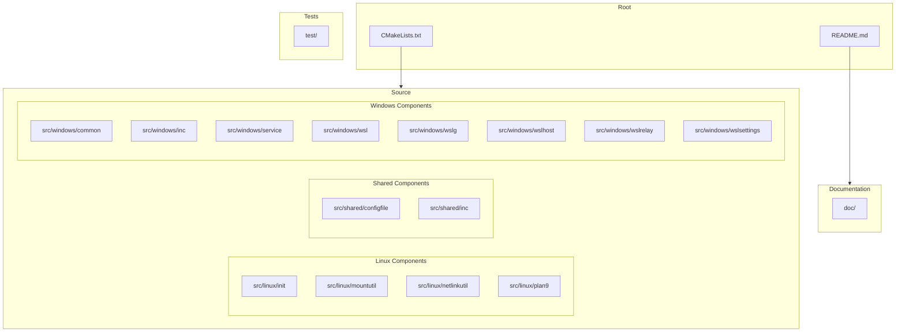
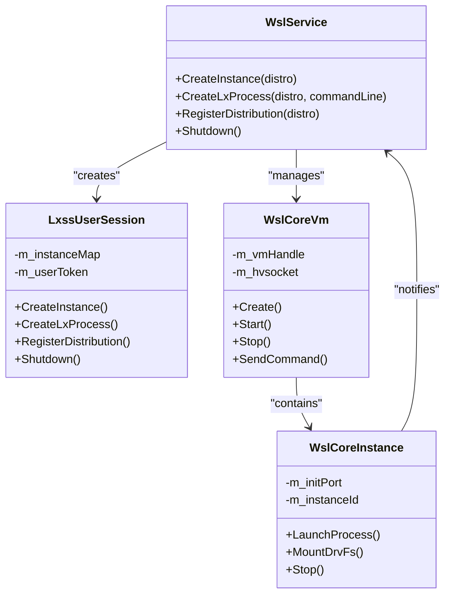
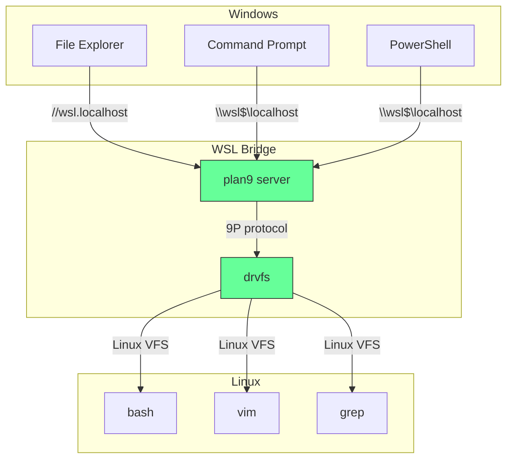
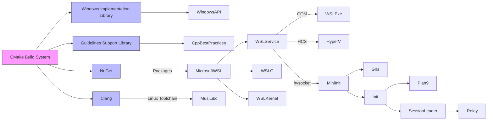

# Architecture and Design

<cite>
**Referenced Files in This Document**   
- [README.md](file://README.md)
- [CMakeLists.txt](file://CMakeLists.txt)
- [LxssInstance.cpp](file://src/windows/service/exe/LxssInstance.cpp)
- [main.cpp](file://src/linux/init/main.cpp)
- [config.cpp](file://src/linux/init/config.cpp)
- [helpers.cpp](file://src/windows/common/helpers.cpp)
- [LxssInstance.h](file://src/windows/service/exe/LxssInstance.h)
- [wsl.exe.md](file://doc/docs/technical-documentation/wsl.exe.md)
- [wslservice.exe.md](file://doc/docs/technical-documentation/wslservice.exe.md)
- [boot-process.md](file://doc/docs/technical-documentation/boot-process.md)
- [index.md](file://doc/docs/technical-documentation/index.md)
</cite>

## Table of Contents
1. [Introduction](#introduction)
2. [Project Structure](#project-structure)
3. [Core Components](#core-components)
4. [Architecture Overview](#architecture-overview)
5. [Detailed Component Analysis](#detailed-component-analysis)
6. [Dependency Analysis](#dependency-analysis)
7. [Performance Considerations](#performance-considerations)
8. [Troubleshooting Guide](#troubleshooting-guide)
9. [Conclusion](#conclusion)

## Introduction
The Windows Subsystem for Linux (WSL) provides a powerful environment for running Linux command-line tools, utilities, and applications directly on Windows without the overhead of a traditional virtual machine or dual boot setup. This document provides comprehensive architectural documentation for the WSL system, detailing its high-level design, component interactions, and technical decisions. The analysis covers the separation between Windows and Linux components, the service-oriented architecture of the WSL daemon, and the event-driven configuration system. It also explains the technical decisions behind WSL1 versus WSL2 architectures, the trade-offs between binary translation and virtualization, and the constraints imposed by the Windows security model.

## Project Structure
The WSL repository follows a well-organized structure that separates components by functionality and technology stack. The project is built using CMake as the build system and incorporates various Microsoft technologies including WIL (Windows Implementation Library), GSL (Guidelines Support Library), and .NET 6 with WinUI 3 for the user interface components. The source code is divided into three main directories: `linux` for Linux-specific components, `shared` for cross-platform utilities, and `windows` for Windows-specific implementations. The documentation is comprehensive, with detailed technical documentation covering boot processes, file system integration, networking, and inter-process communication.



**Diagram sources**
- [CMakeLists.txt](file://CMakeLists.txt#L1-L447)
- [README.md](file://README.md#L1-L49)

**Section sources**
- [CMakeLists.txt](file://CMakeLists.txt#L1-L447)
- [README.md](file://README.md#L1-L49)

## Core Components
The WSL system consists of several core components that work together to provide a seamless Linux experience on Windows. The main entry point is `wsl.exe`, which parses command line arguments and communicates with the WSL service via COM. The `wslservice.exe` runs as a session 0 service with SYSTEM privileges and manages WSL sessions, communicates with the WSL2 virtual machine, and configures WSL distributions. The Linux side is initialized by `mini_init`, which performs user-mode initialization inside the virtual machine, followed by the main `init` process that manages the Linux distribution. The `plan9` component handles file system integration between Windows and Linux, while `wslrelay.exe` and `wslhost.exe` manage input/output relaying and inter-process communication.

**Section sources**
- [wsl.exe.md](file://doc/docs/technical-documentation/wsl.exe.md#L1-L9)
- [wslservice.exe.md](file://doc/docs/technical-documentation/wslservice.exe.md#L1-L33)
- [boot-process.md](file://doc/docs/technical-documentation/boot-process.md#L1-L116)

## Architecture Overview
The WSL architecture is a sophisticated hybrid system that combines Windows and Linux components through a service-oriented architecture. The design separates concerns between the Windows host and Linux guest environments while maintaining seamless integration. The WSL service acts as the central orchestrator, managing the lifecycle of WSL instances and facilitating communication between Windows and Linux processes. For WSL2, a lightweight virtual machine provides full Linux kernel compatibility, while WSL1 uses binary translation for system call compatibility. The architecture employs hyper-V sockets (hvsocket) for efficient communication between components, with a clear separation between management plane operations and data plane operations.

```mermaid
graph TD
subgraph "Windows Host"
WslExe[wsl.exe]
WslService[wslservice.exe]
WslRelay[wslrelay.exe]
WslHost[wslhost.exe]
Hcs[Host Compute System]
end
subgraph "WSL2 Virtual Machine"
MiniInit[mini_init]
Gns[gns]
Init[init]
Plan9[plan9]
Relay[relay]
end
WslExe --> |COM| WslService
WslService --> |HCS API| Hcs
Hcs --> |VM Management| MiniInit
WslService --> |hvsocket| MiniInit
MiniInit --> |fork/exec| Gns
MiniInit --> |fork/exec| Init
Init --> |fork/exec| Plan9
Init --> |fork/exec| SessionLeader[sid: session leader]
SessionLeader --> |fork/exec| Relay
Relay --> |exec| UserCommand["User command (bash, curl)"]
WslService --> |hvsocket| WslRelay
WslService --> |hvsocket| WslHost
WslRelay < --> |I/O Relaying| Relay
WslHost < --> |Interop| Relay
style WslExe fill:#f9f,stroke:#333
style WslService fill:#bbf,stroke:#333
style MiniInit fill:#f96,stroke:#333
style Init fill:#f96,stroke:#333
style Plan9 fill:#6f9,stroke:#333
```

**Diagram sources**
- [index.md](file://doc/docs/technical-documentation/index.md#L7-L46)
- [boot-process.md](file://doc/docs/technical-documentation/boot-process.md#L9-L39)

## Detailed Component Analysis

### WSL Service Architecture
The WSL service (`wslservice.exe`) is implemented as a COM server running in session 0 with SYSTEM privileges. It provides the `ILxssUserSession` interface for clients to interact with WSL functionality. The service manages the WSL2 virtual machine through the Host Compute System (HCS) service, creating and configuring virtual machines as needed. Each running distribution is represented by a `WslCoreInstance` object that maintains an hvsocket connection to the Linux init process for command and control operations.



**Diagram sources**
- [wslservice.exe.md](file://doc/docs/technical-documentation/wslservice.exe.md#L1-L33)
- [LxssInstance.cpp](file://src/windows/service/exe/LxssInstance.cpp#L52-L144)

**Section sources**
- [wslservice.exe.md](file://doc/docs/technical-documentation/wslservice.exe.md#L1-L33)
- [LxssInstance.cpp](file://src/windows/service/exe/LxssInstance.cpp#L52-L144)

### Initialization Process
The WSL initialization process follows a well-defined sequence from user invocation to the execution of the user's requested command. When `wsl.exe` is invoked, it communicates with `wslservice.exe` via COM to create a new instance. For WSL2, this triggers the creation of a virtual machine using the HCS API, which boots into the `mini_init` process. The `mini_init` process performs early configuration, launches the `gns` process for networking, and then starts the main `init` process for the Linux distribution.

```mermaid
sequenceDiagram
participant WslExe as wsl.exe
participant WslService as wslservice.exe
participant MiniInit as mini_init
participant Gns as gns
participant Init as init
participant SessionLeader as session leader
participant Relay as relay
participant UserCommand as User command (bash)
WslExe->>WslService : CreateInstance(<distro>)
WslService->>WslExe : S_OK
WslExe->>WslService : CreateLxProcess(<distro>, <command line>)
WslService->>MiniInit : LxMiniInitMessageEarlyConfig
create participant Gns
MiniInit->>Gns : fork(), exec("/gns")
WslService->>Gns : LxGnsMessageInterfaceConfiguration
Gns->>WslService : LxGnsMessageResult
WslService->>MiniInit : LxMiniInitMessageInitialConfig
WslService->>MiniInit : LxMiniInitMessageLaunchInit
create participant Init
MiniInit->>Init : fork(), exec("/init")
Init->>WslService : LxMiniInitMessageCreateInstanceResult
WslService->>Init : LxInitMessageCreateSession
create participant SessionLeader
Init->>SessionLeader : fork()
SessionLeader->>WslService : LxInitMessageCreateSessionResponse
WslService->>SessionLeader : InitCreateProcessUtilityVm
create participant Relay
SessionLeader->>Relay : fork()
Relay->>WslService : LxMessageResultUint32 (hvsocket connect port)
WslService->>Relay : connect hvsockets for STDIN, STDOUT, STDERR
create participant UserCommand
Relay->>UserCommand : fork(), exec("/bin/bash")
Relay<->>UserCommand : relay STDIN, STDOUT, STDERR
WslService->>WslExe : S_OK + hvsockets for STDIN, STDOUT, STDERR
WslExe<->>Relay : Relay STDIN, STDOUT, STDERR
```

**Diagram sources**
- [boot-process.md](file://doc/docs/technical-documentation/boot-process.md#L9-L39)

**Section sources**
- [boot-process.md](file://doc/docs/technical-documentation/boot-process.md#L1-L116)

### File System Integration
The WSL file system integration is implemented through the Plan 9 protocol, which provides bidirectional file system access between Windows and Linux. The `plan9` component runs as a server in the Linux environment and handles file operations from both Windows and Linux processes. The architecture supports both WSL1 and WSL2 file system access patterns, with different performance characteristics and compatibility trade-offs.



**Diagram sources**
- [index.md](file://doc/docs/technical-documentation/index.md#L7-L46)
- [drvfs.md](file://doc/docs/technical-documentation/drvfs.md)

## Dependency Analysis
The WSL system has a complex dependency graph that spans both Windows and Linux components. The build system is based on CMake, which manages dependencies between various components and external libraries. The Windows components depend on Microsoft technologies including WIL (Windows Implementation Library) for COM and Windows API abstractions, GSL (Guidelines Support Library) for C++ best practices, and .NET 6 with WinUI 3 for the user interface. The Linux components are built using Clang with a musl libc toolchain, targeting a static linking model for portability.



**Diagram sources**
- [CMakeLists.txt](file://CMakeLists.txt#L1-L447)
- [nuget.config](file://nuget.config)

## Performance Considerations
The WSL architecture makes several performance-oriented design decisions to balance compatibility, security, and efficiency. For WSL2, the use of a lightweight virtual machine provides full Linux kernel compatibility while maintaining good performance through hypercall optimizations and efficient memory management. The system implements memory compaction and page reporting to minimize memory footprint when the VM is idle. For file system operations, the Plan 9 protocol is optimized for common access patterns, with caching strategies to reduce latency. Network performance is enhanced through the use of virtio networking drivers and efficient packet processing.

**Section sources**
- [main.cpp](file://src/linux/init/main.cpp#L267-L444)
- [config.cpp](file://src/linux/init/config.cpp#L621-L629)

## Troubleshooting Guide
The WSL system includes comprehensive telemetry and logging capabilities to assist with troubleshooting. The service logs diagnostic data using TraceLogging, with events categorized by severity and component. For network issues, diagnostic scripts are provided to collect tcpdump logs and network configuration information. The system also includes a debug console mode that can be launched to inspect the internal state of the WSL components. Common issues often relate to file system permissions, network configuration, or resource limits, and can typically be resolved by adjusting the WSL configuration or restarting the WSL service.

**Section sources**
- [DATA_AND_PRIVACY.md](file://DATA_AND_PRIVACY.md)
- [collect-networking-logs.ps1](file://diagnostics/collect-networking-logs.ps1)
- [debugging.md](file://doc/docs/debugging.md)

## Conclusion
The WSL system represents a sophisticated architectural solution for running Linux environments on Windows. Its hybrid design effectively balances the need for Linux compatibility with Windows integration requirements. The service-oriented architecture of the WSL daemon provides a robust foundation for managing Linux distributions, while the event-driven configuration system enables dynamic adaptation to user needs. The technical decisions behind WSL1 versus WSL2 architectures reflect careful consideration of the trade-offs between binary translation and virtualization, with WSL2 emerging as the preferred approach for most use cases due to its superior compatibility and performance. The constraints imposed by the Windows security model have been addressed through careful privilege management and isolation mechanisms. The technology stack, built on CMake, WIL, GSL, and .NET 6 with WinUI 3, provides a solid foundation for ongoing development and enhancement of the WSL platform.