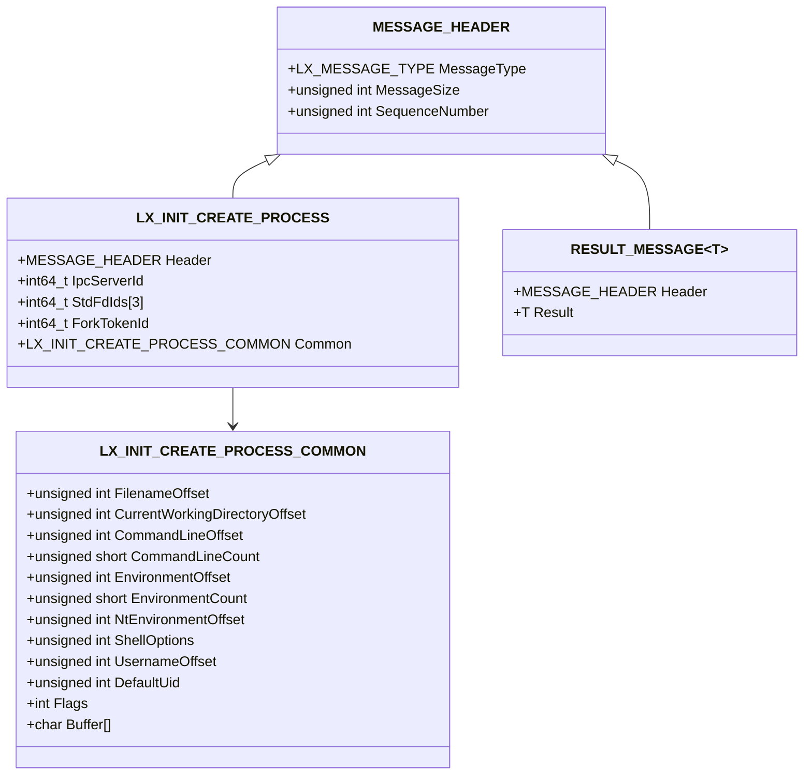
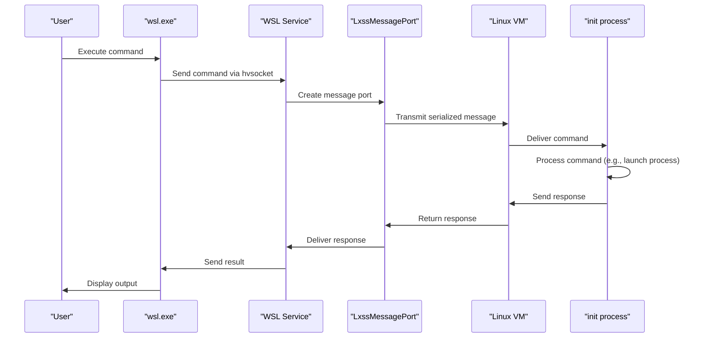
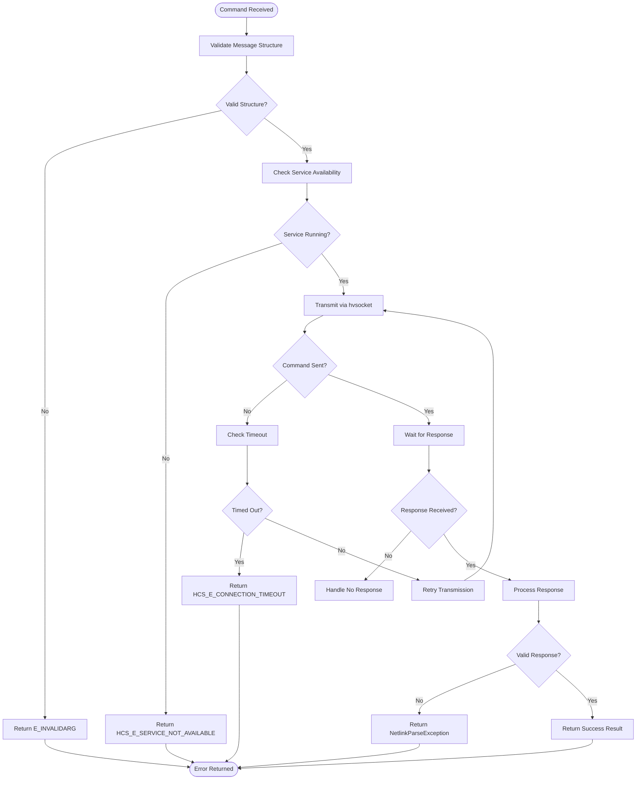

# Command Propagation

<cite>
**Referenced Files in This Document**   
- [ServiceMain.cpp](file://src/windows/service/exe/ServiceMain.cpp)
- [LxssMessagePort.cpp](file://src/windows/common/LxssMessagePort.cpp)
- [LxssMessagePort.h](file://src/windows/common/LxssMessagePort.h)
- [LxssServerPort.cpp](file://src/windows/common/LxssServerPort.cpp)
- [LxssServerPort.h](file://src/windows/common/LxssServerPort.h)
- [message.h](file://src/shared/inc/message.h)
- [lxinitshared.h](file://src/shared/inc/lxinitshared.h)
- [main.cpp](file://src/linux/init/main.cpp)
- [init.cpp](file://src/linux/init/init.cpp)
- [hvsocket.cpp](file://src/windows/common/hvsocket.cpp)
- [interop.cpp](file://src/windows/common/interop.cpp)
- [LxssInstance.cpp](file://src/windows/service/exe/LxssInstance.cpp)
- [LxssCreateProcess.cpp](file://src/windows/service/exe/LxssCreateProcess.cpp)
- [conncheckshared.h](file://src/shared/inc/conncheckshared.h)
- [retryshared.h](file://src/shared/inc/retryshared.h)
</cite>

## Table of Contents
1. [Introduction](#introduction)
2. [Command Lifecycle and Domain Model](#command-lifecycle-and-domain-model)
3. [Message Types and Serialization](#message-types-and-serialization)
4. [Command Propagation Flow](#command-propagation-flow)
5. [Error Handling and Reliability](#error-handling-and-reliability)
6. [Common Issues and Solutions](#common-issues-and-solutions)
7. [Conclusion](#conclusion)

## Introduction
This document provides a comprehensive analysis of the WSL command propagation system, detailing how user commands from wsl.exe are received by the WSL service and propagated to the virtual machine. The analysis focuses on the ServiceMain.cpp implementation, command routing, message serialization via hvsocket channels, and the domain model of command lifecycle including validation, execution, and response return. The documentation is designed to be accessible to beginners while providing technical depth on IPC reliability and message framing for experienced developers.

## Command Lifecycle and Domain Model
The WSL command propagation system follows a well-defined lifecycle from command initiation to execution and response. When a user issues a command through wsl.exe, the request is routed through the WSL service which acts as an intermediary between the Windows host and the Linux VM. The command lifecycle consists of several key phases: reception, validation, serialization, transmission, execution, and response.

The domain model centers around message types defined in lxinitshared.h, with each command represented as a structured message containing a header with metadata and a payload with command-specific data. The MESSAGE_HEADER structure contains essential fields including MessageType, MessageSize, and SequenceNumber, which are critical for proper message routing and processing.

Commands are processed through a server-port model where the WSL service creates server ports to listen for incoming connections and message ports to handle individual command sessions. This architecture enables concurrent processing of multiple commands while maintaining isolation between different distribution instances.

**Section sources**
- [ServiceMain.cpp](file://src/windows/service/exe/ServiceMain.cpp#L1-L322)
- [LxssServerPort.h](file://src/windows/common/LxssServerPort.h#L1-L38)
- [LxssMessagePort.h](file://src/windows/common/LxssMessagePort.h#L1-L45)
- [lxinitshared.h](file://src/shared/inc/lxinitshared.h#L478-L487)

## Message Types and Serialization
The WSL command system utilizes a variety of message types for different operations, each with a specific structure and purpose. Key message types include LxMiniInitMessageLaunchInit for instance creation, LxInitMessageCreateProcess for process launch, and various configuration messages for distribution management.

Message serialization is handled through the MessageWriter template class defined in message.h, which provides a type-safe mechanism for constructing serialized messages. The MessageWriter class calculates buffer offsets and handles padding requirements to ensure proper memory layout. It supports writing strings, spans, and other data types while maintaining the integrity of the message structure.

**Diagram sources **
- [lxinitshared.h](file://src/shared/inc/lxinitshared.h#L478-L639)
- [message.h](file://src/shared/inc/message.h#L26-L186)

**Section sources**
- [lxinitshared.h](file://src/shared/inc/lxinitshared.h#L478-L639)
- [message.h](file://src/shared/inc/message.h#L26-L186)
- [LxssCreateProcess.cpp](file://src/windows/service/exe/LxssCreateProcess.cpp#L121-L160)

## Command Propagation Flow
The command propagation flow begins when wsl.exe sends a command to the WSL service, which receives it through a named pipe or hvsocket connection. The ServiceMain.cpp file contains the entry point for the Lxss Manager service, where the WslService class handles service initialization and message processing.

When a command arrives, the LxssServerPort::WaitForConnection method accepts the connection and creates a LxssMessagePort instance to handle the communication session. The message port provides methods for sending and receiving messages, with proper timeout handling and error checking. The Receive method uses asynchronous I/O operations with timeout support to prevent indefinite blocking.

For process creation commands, the flow involves several steps: the service validates the request, marshals necessary handles (such as console and file descriptors), and sends the serialized command to the VM. In the VM, the init process receives the command and spawns the appropriate child process. The response is then sent back through the message channel to complete the round trip.

**Diagram sources **
- [ServiceMain.cpp](file://src/windows/service/exe/ServiceMain.cpp#L1-L322)
- [LxssMessagePort.cpp](file://src/windows/common/LxssMessagePort.cpp#L1-L291)
- [LxssServerPort.cpp](file://src/windows/common/LxssServerPort.cpp#L1-L65)
- [main.cpp](file://src/linux/init/main.cpp#L3233-L3536)

**Section sources**
- [ServiceMain.cpp](file://src/windows/service/exe/ServiceMain.cpp#L1-L322)
- [LxssMessagePort.cpp](file://src/windows/common/LxssMessagePort.cpp#L1-L291)
- [LxssServerPort.cpp](file://src/windows/common/LxssServerPort.cpp#L1-L65)
- [main.cpp](file://src/linux/init/main.cpp#L3233-L3536)
- [init.cpp](file://src/linux/init/init.cpp#L807-L2891)

## Error Handling and Reliability
The WSL command propagation system implements comprehensive error handling to ensure reliability and provide meaningful feedback to users. Errors are categorized and handled at multiple levels: transport, validation, execution, and response.

Transport errors are handled through timeout mechanisms and connection recovery. The LxssMessagePort::Receive and Send methods include timeout parameters and use Windows overlapped I/O to support asynchronous operations with cancellation. If a timeout occurs, the operation is canceled and an appropriate error is returned.

Validation errors are caught early in the processing pipeline. The CreateProcessParse function in init.cpp validates message structure and content before proceeding with execution. Invalid parameters result in EINVAL errors being returned to the caller.

Execution errors are propagated back through the message channel using standardized response structures. For example, the LX_INIT_CREATE_PROCESS_RESPONSE message includes a Result field that contains the error code if the process creation fails. This allows the client to understand the specific reason for failure.

The system also implements retry mechanisms for transient failures. The retryshared.h header provides a RetryWithTimeout template function that can be used to automatically retry operations with exponential backoff. This is particularly useful for handling temporary service unavailability.

**Diagram sources **
- [LxssMessagePort.cpp](file://src/windows/common/LxssMessagePort.cpp#L135-L290)
- [init.cpp](file://src/linux/init/init.cpp#L807-L2891)
- [conncheckshared.h](file://src/shared/inc/conncheckshared.h#L129-L215)
- [retryshared.h](file://src/shared/inc/retryshared.h#L1-L43)
- [NetlinkParseException.h](file://src/linux/netlinkutil/NetlinkParseException.h#L1-L14)

**Section sources**
- [LxssMessagePort.cpp](file://src/windows/common/LxssMessagePort.cpp#L135-L290)
- [init.cpp](file://src/linux/init/init.cpp#L807-L2891)
- [conncheckshared.h](file://src/shared/inc/conncheckshared.h#L129-L215)
- [retryshared.h](file://src/shared/inc/retryshared.h#L1-L43)
- [wslutil.cpp](file://src/windows/common/wslutil.cpp#L78-L119)

## Common Issues and Solutions
Several common issues can occur during WSL command propagation, each with specific solutions implemented in the system.

**Command timeouts** occur when a command takes longer than expected to complete. The system addresses this through configurable timeouts in the LxssMessagePort operations. The default timeout is 30 seconds, but this can be adjusted based on the operation type. For long-running operations, the system may use asynchronous patterns with progress reporting.

**Invalid parameters** are handled through comprehensive validation at multiple levels. The system checks message structure, parameter types, and value ranges before processing commands. When invalid parameters are detected, the system returns specific error codes like E_INVALIDARG to help users understand and correct the issue.

**Service unavailability** can occur if the WSL service is not running or the VM is not accessible. The system detects this condition and returns appropriate errors like HCS_E_SERVICE_NOT_AVAILABLE. Client applications can use this information to prompt users to start the service or check their configuration.

**Connection failures** between the host and VM are mitigated through the hvsocket implementation in hvsocket.cpp. The Connect function includes timeout handling and error recovery mechanisms. The system also implements retry logic with exponential backoff for transient network issues.

**Resource limitations** such as insufficient memory or file descriptors are handled by checking resource availability before command execution. If resources are insufficient, the system returns appropriate error codes rather than failing unpredictably.

The error handling strategy follows a consistent pattern: detect the error condition, return a specific error code, and provide sufficient context for diagnosis. This approach enables both automated recovery mechanisms and manual troubleshooting by users.

**Section sources**
- [hvsocket.cpp](file://src/windows/common/hvsocket.cpp#L1-L118)
- [WslMirroredNetworking.cpp](file://src/windows/service/exe/WslMirroredNetworking.cpp#L2385-L2444)
- [Lifetime.cpp](file://src/windows/service/exe/Lifetime.cpp#L234-L269)
- [WslCoreNetworkingSupport.h](file://src/windows/common/WslCoreNetworkingSupport.h#L176-L221)

## Conclusion
The WSL command propagation system demonstrates a robust architecture for inter-process communication between Windows and Linux environments. By leveraging hvsocket channels, structured message serialization, and comprehensive error handling, the system provides reliable command execution with clear feedback for both successful operations and failures.

The domain model centered around message types and the command lifecycle ensures consistency across different operation types. The implementation balances performance considerations with reliability requirements, using asynchronous I/O operations and timeout mechanisms to prevent hangs while maintaining responsiveness.

For developers, understanding this system provides insights into building reliable IPC mechanisms and handling the complexities of cross-platform communication. The patterns used in WSL command propagation—such as message framing, error categorization, and retry strategies—can be applied to other distributed systems requiring reliable communication between components.