# Component Interactions

<cite>
**Referenced Files in This Document**
- [main.cpp](file://src/windows/wsl/main.cpp)
- [ServiceMain.cpp](file://src/windows/service/exe/ServiceMain.cpp)
- [WslClient.cpp](file://src/windows/common/WslClient.cpp)
- [svccomm.cpp](file://src/windows/common/svccomm.cpp)
- [main.cpp](file://src/linux/init/main.cpp)
- [WslCoreInstance.cpp](file://src/windows/service/exe/WslCoreInstance.cpp)
- [WslCoreVm.cpp](file://src/windows/service/exe/WslCoreVm.cpp)
- [lxinitshared.h](file://src/shared/inc/lxinitshared.h)
- [SocketChannel.h](file://src/shared/inc/SocketChannel.h)
- [hvsocket.cpp](file://src/windows/common/hvsocket.cpp)
- [socketshared.h](file://src/shared/inc/socketshared.h)
- [LxssCreateProcess.cpp](file://src/windows/service/exe/LxssCreateProcess.cpp)
- [init.cpp](file://src/linux/init/init.cpp)
- [binfmt.cpp](file://src/linux/init/binfmt.cpp)
- [LxssInstance.cpp](file://src/windows/service/exe/LxssInstance.cpp)
- [interop.cpp](file://src/windows/common/interop.cpp)
</cite>

## Table of Contents
1. [Introduction](#introduction)
2. [Architecture Overview](#architecture-overview)
3. [Component Interaction Flow](#component-interaction-flow)
4. [IPC Mechanisms and Message Types](#ipc-mechanisms-and-message-types)
5. [Communication Channels](#communication-channels)
6. [Message Serialization and Reliability](#message-serialization-and-reliability)
7. [State Management](#state-management)
8. [Error Handling and Recovery](#error-handling-and-recovery)
9. [Common Issues and Solutions](#common-issues-and-solutions)
10. [Technical Implementation Details](#technical-implementation-details)
11. [Conclusion](#conclusion)

## Introduction

WSL (Windows Subsystem for Linux) employs a sophisticated multi-component architecture that enables seamless interaction between Windows and Linux environments. The system consists of three primary components: wsl.exe (CLI frontend), wslservice.exe (Windows service), and mini_init (guest-side initialization). These components communicate through Hyper-V sockets (hvsockets) using a structured message-passing protocol defined in lxinitshared.h.

This document provides a comprehensive analysis of how these components interact, the IPC mechanisms they employ, and the message types that facilitate communication. Understanding these interactions is crucial for both beginners seeking to comprehend WSL's architecture and experienced developers working with WSL internals.

## Architecture Overview

The WSL architecture follows a layered approach with clear separation of concerns:

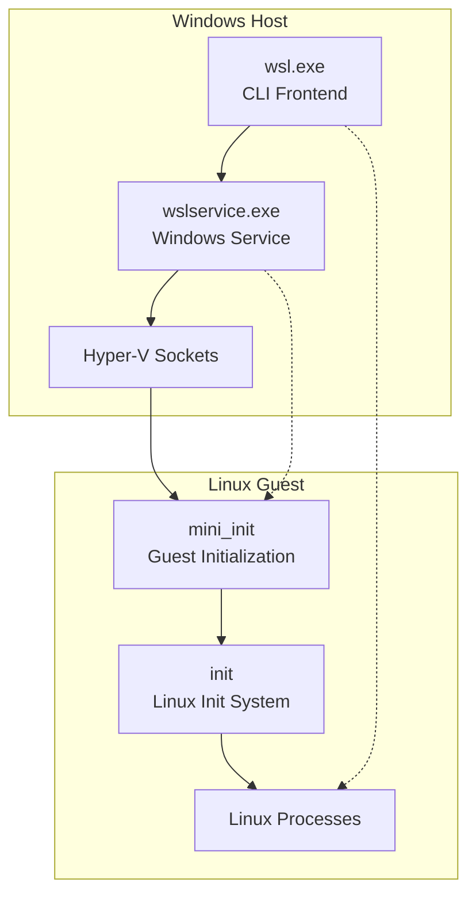

**Diagram sources**
- [main.cpp](file://src/windows/wsl/main.cpp#L17-L20)
- [ServiceMain.cpp](file://src/windows/service/exe/ServiceMain.cpp#L318-L322)
- [main.cpp](file://src/linux/init/main.cpp#L4090-L4140)

**Section sources**
- [main.cpp](file://src/windows/wsl/main.cpp#L17-L20)
- [ServiceMain.cpp](file://src/windows/service/exe/ServiceMain.cpp#L318-L322)
- [main.cpp](file://src/linux/init/main.cpp#L4090-L4140)

## Component Interaction Flow

### Command Execution Flow

The typical WSL command execution follows this sequence:

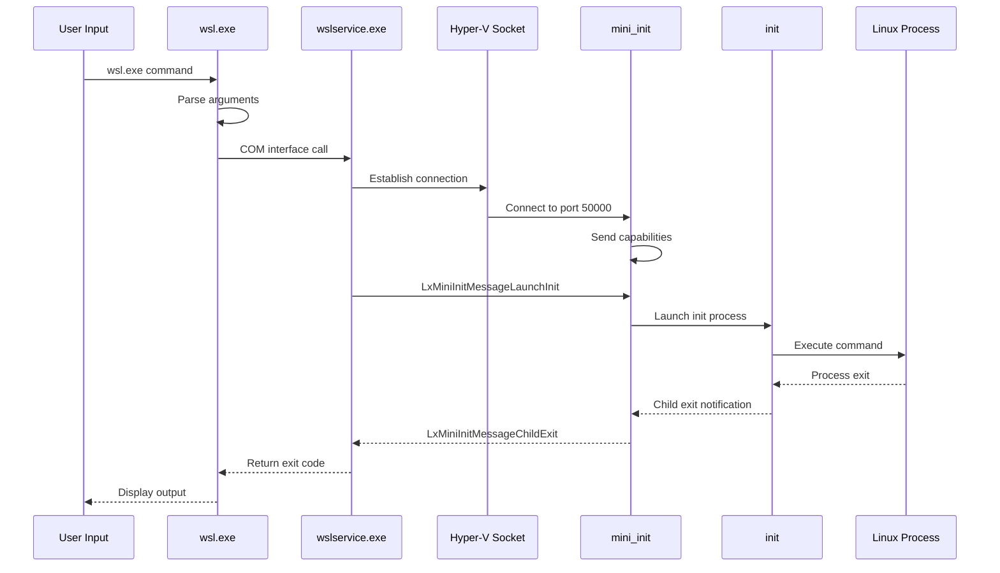

**Diagram sources**
- [main.cpp](file://src/windows/wsl/main.cpp#L17-L20)
- [WslClient.cpp](file://src/windows/common/WslClient.cpp#L654-L693)
- [svccomm.cpp](file://src/windows/common/svccomm.cpp#L646-L776)
- [main.cpp](file://src/linux/init/main.cpp#L4090-L4289)

### Instance Creation Flow

When creating a new WSL instance, the flow involves several coordination steps:

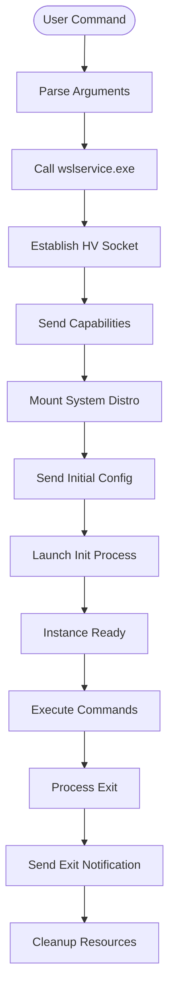

**Diagram sources**
- [WslCoreVm.cpp](file://src/windows/service/exe/WslCoreVm.cpp#L455-L1915)
- [main.cpp](file://src/linux/init/main.cpp#L4090-L4289)

**Section sources**
- [WslClient.cpp](file://src/windows/common/WslClient.cpp#L654-L693)
- [svccomm.cpp](file://src/windows/common/svccomm.cpp#L646-L776)
- [WslCoreVm.cpp](file://src/windows/service/exe/WslCoreVm.cpp#L455-L1915)

## IPC Mechanisms and Message Types

### Hyper-V Socket Communication

WSL uses Hyper-V sockets (hvsockets) for communication between Windows and Linux components. This technology provides reliable, bidirectional communication channels with built-in error detection and recovery mechanisms.

### Core Message Types

The lxinitshared.h header defines numerous message types for different operations:

#### Launch and Process Management Messages

| Message Type | Purpose | Direction |
|--------------|---------|-----------|
| `LxMiniInitMessageLaunchInit` | Launch Linux init process | Windows → Linux |
| `LxMiniInitMessageMount` | Mount filesystems | Windows → Linux |
| `LxMiniInitMessageUnmount` | Unmount filesystems | Windows → Linux |
| `LxInitMessageCreateProcess` | Create new Linux process | Windows → Linux |
| `LxMiniInitMessageChildExit` | Notify process termination | Linux → Windows |

#### Configuration and Status Messages

| Message Type | Purpose | Direction |
|--------------|---------|-----------|
| `LxMiniInitMessageInitialConfig` | Initial system configuration | Windows → Linux |
| `LxMiniInitMessageGuestCapabilities` | Report guest capabilities | Linux → Windows |
| `LxMiniInitMessageMountStatus` | Mount operation status | Linux → Windows |

**Section sources**
- [lxinitshared.h](file://src/shared/inc/lxinitshared.h#L281-L362)
- [main.cpp](file://src/linux/init/main.cpp#L2952-L3536)

### Message Structure

All messages follow a standardized structure defined in lxinitshared.h:

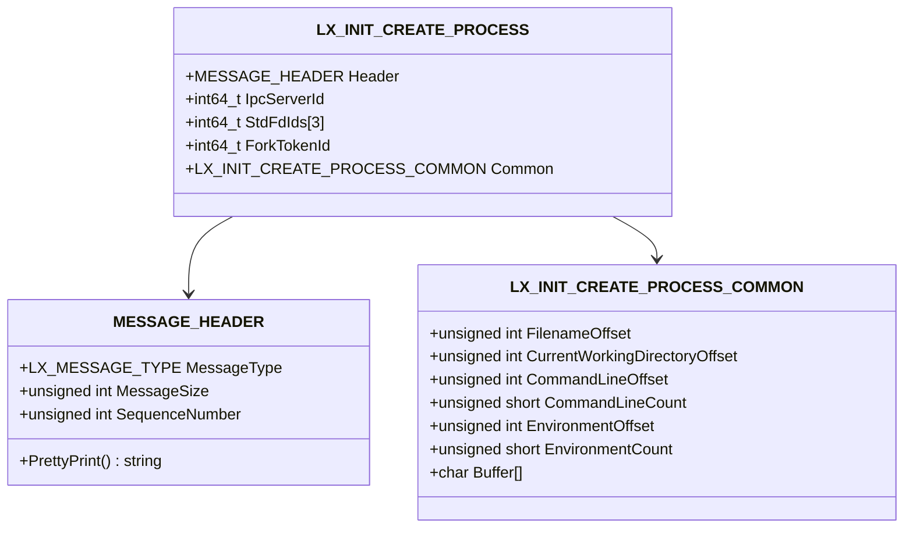

**Diagram sources**
- [lxinitshared.h](file://src/shared/inc/lxinitshared.h#L478-L487)
- [lxinitshared.h](file://src/shared/inc/lxinitshared.h#L608-L620)
- [lxinitshared.h](file://src/shared/inc/lxinitshared.h#L578-L594)

**Section sources**
- [lxinitshared.h](file://src/shared/inc/lxinitshared.h#L478-L620)

## Communication Channels

### SocketChannel Implementation

The SocketChannel class provides a thread-safe abstraction for hvsocket communication:

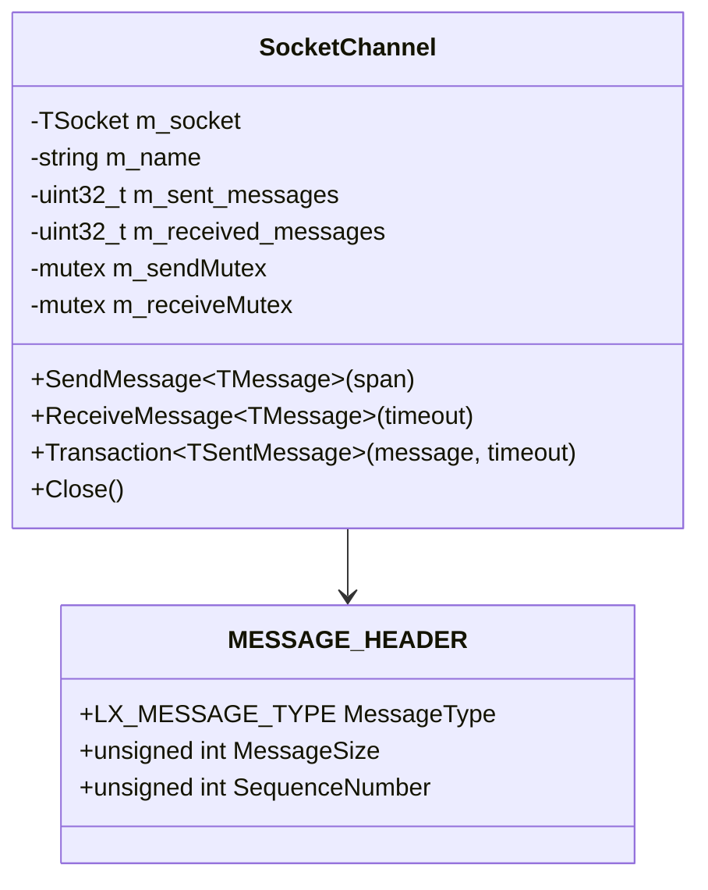

**Diagram sources**
- [SocketChannel.h](file://src/shared/inc/SocketChannel.h#L44-L402)

### Channel Types and Ports

WSL uses specific hvsocket ports for different services:

| Port | Service | Purpose |
|------|---------|---------|
| 50000 | mini_init | Main communication channel |
| 50001 | Plan9 | File system sharing |
| 50002 | DrvFs | Drive mounting |
| 50003 | DrvFs Admin | Administrative drive access |
| 50004 | VirtioFS | Modern file system sharing |
| 50005 | Crash Dump | Debug information |

**Section sources**
- [SocketChannel.h](file://src/shared/inc/SocketChannel.h#L44-L402)
- [lxinitshared.h](file://src/shared/inc/lxinitshared.h#L112-L120)

## Message Serialization and Reliability

### Sequence Numbering

Each message includes a sequence number for ordering and error detection:

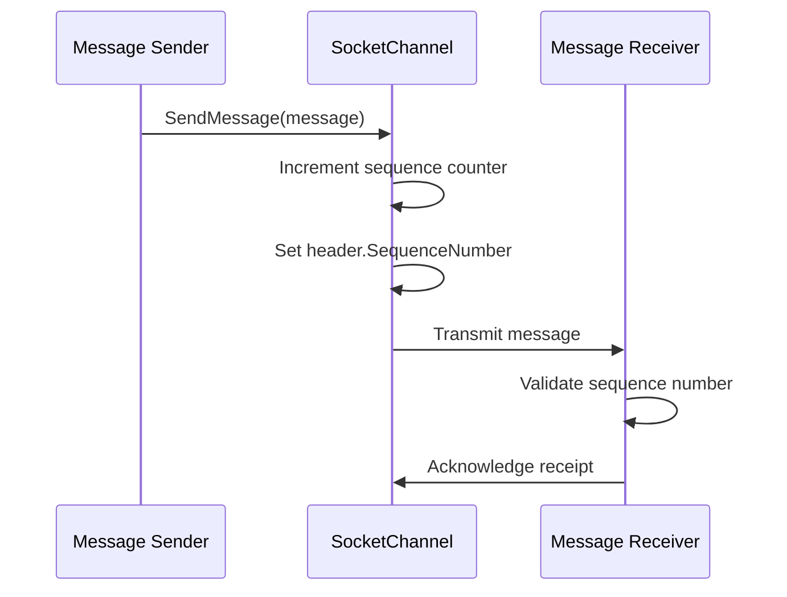

**Diagram sources**
- [SocketChannel.h](file://src/shared/inc/SocketChannel.h#L106-L111)

### Error Detection and Recovery

The SocketChannel implementation includes robust error handling:

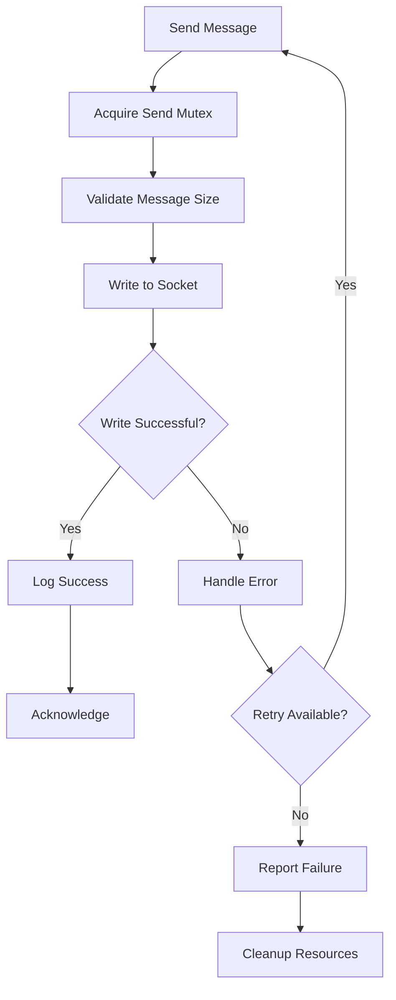

**Diagram sources**
- [SocketChannel.h](file://src/shared/inc/SocketChannel.h#L85-L137)

**Section sources**
- [SocketChannel.h](file://src/shared/inc/SocketChannel.h#L85-L137)
- [socketshared.h](file://src/shared/inc/socketshared.h#L20-L118)

## State Management

### Instance Lifecycle

WSL instances maintain state through several mechanisms:

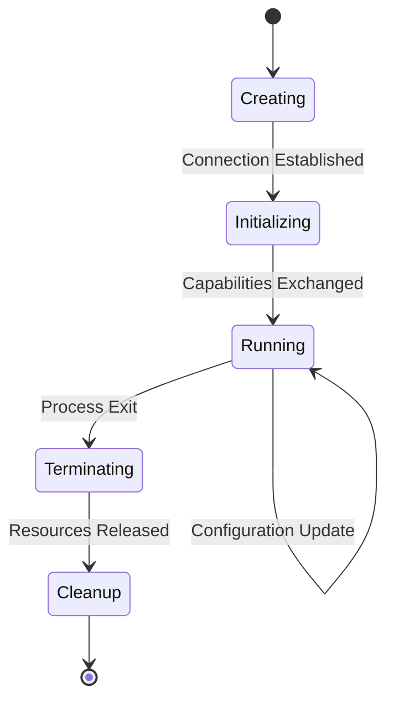

### Process Tracking

The system tracks process lifecycle through message notifications:

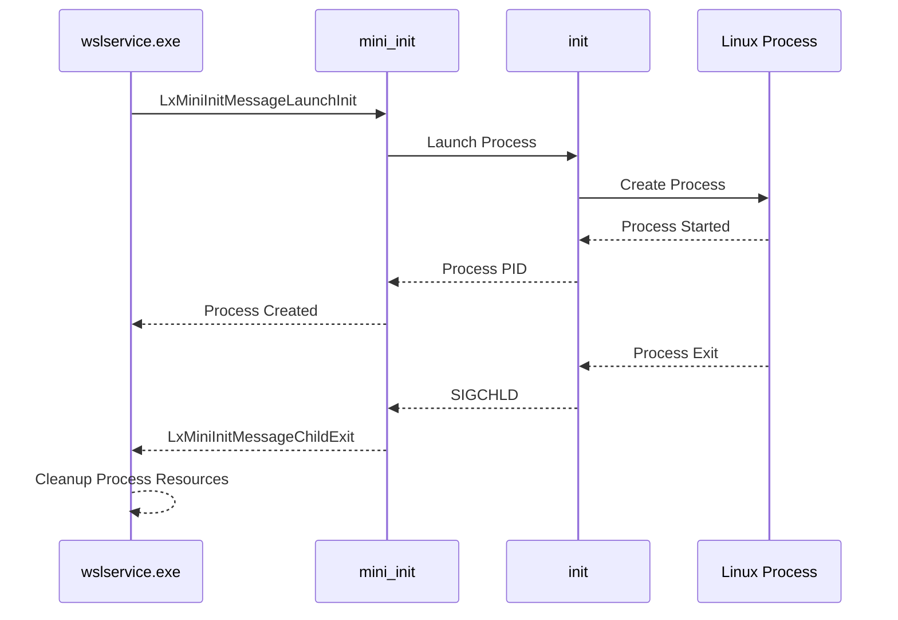

**Diagram sources**
- [main.cpp](file://src/linux/init/main.cpp#L4198-L4289)
- [WslCoreInstance.cpp](file://src/windows/service/exe/WslCoreInstance.cpp#L143-L200)

**Section sources**
- [main.cpp](file://src/linux/init/main.cpp#L4198-L4289)
- [WslCoreInstance.cpp](file://src/windows/service/exe/WslCoreInstance.cpp#L143-L200)

## Error Handling and Recovery

### Communication Timeouts

The system implements timeout mechanisms for various operations:

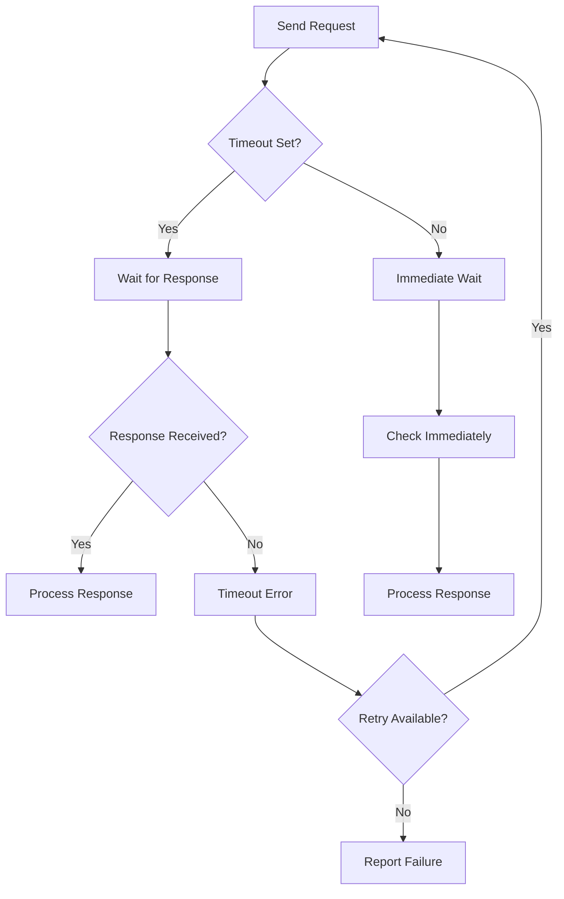

### Error Propagation

Errors are propagated through the system with appropriate context:

| Error Type | Source | Destination | Action |
|------------|--------|-------------|--------|
| Connection Timeout | SocketChannel | Caller | Retry with exponential backoff |
| Message Corruption | SocketChannel | Logger | Log error and continue |
| Process Launch Failure | wslservice.exe | wsl.exe | Return error code to user |
| VM Crash | WslCoreVm | Service | Restart VM with error details |

**Section sources**
- [SocketChannel.h](file://src/shared/inc/SocketChannel.h#L182-L232)
- [WslCoreVm.cpp](file://src/windows/service/exe/WslCoreVm.cpp#L143-L162)

## Common Issues and Solutions

### Communication Timeouts

**Problem**: Messages fail to transmit due to network delays or VM suspension.

**Solution**: Implement exponential backoff and configurable timeout values.

**Code Reference**: [SocketChannel.h](file://src/shared/inc/SocketChannel.h#L182-L232)

### Message Corruption

**Problem**: Data corruption during transmission leading to malformed messages.

**Solution**: Use sequence numbers and checksums for message validation.

**Code Reference**: [SocketChannel.h](file://src/shared/inc/SocketChannel.h#L244-L265)

### Process Exit Notifications

**Problem**: Linux processes exiting without proper notification to Windows.

**Solution**: Monitor SIGCHLD signals and forward exit notifications.

**Code Reference**: [main.cpp](file://src/linux/init/main.cpp#L4220-L4289)

### Resource Cleanup

**Problem**: Unclean shutdown leaving resources in inconsistent state.

**Solution**: Implement proper cleanup in destructors and signal handlers.

**Code Reference**: [WslCoreInstance.cpp](file://src/windows/service/exe/WslCoreInstance.cpp#L134-L141)

## Technical Implementation Details

### Hyper-V Socket Implementation

The hvsocket implementation provides cross-platform socket abstraction:

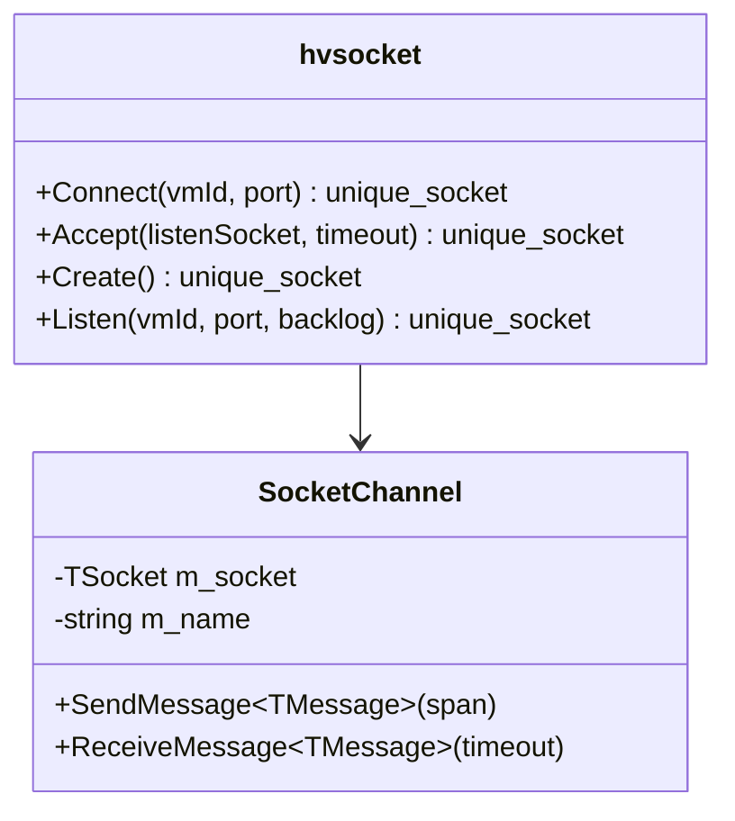

**Diagram sources**
- [hvsocket.cpp](file://src/windows/common/hvsocket.cpp#L42-L118)

### Message Processing Pipeline

The message processing follows a structured pipeline:

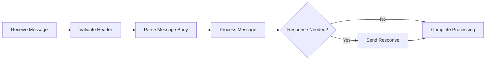

**Diagram sources**
- [SocketChannel.h](file://src/shared/inc/SocketChannel.h#L182-L265)

**Section sources**
- [hvsocket.cpp](file://src/windows/common/hvsocket.cpp#L42-L118)
- [SocketChannel.h](file://src/shared/inc/SocketChannel.h#L182-L265)

## Conclusion

WSL's component interaction architecture demonstrates sophisticated inter-process communication design that enables seamless integration between Windows and Linux environments. The system's use of Hyper-V sockets, structured message types, and robust error handling creates a reliable foundation for cross-platform development.

Key architectural strengths include:

- **Modular Design**: Clear separation between CLI frontend, Windows service, and guest initialization
- **Reliable Communication**: Thread-safe message passing with sequence numbering and error detection
- **Extensible Protocol**: Well-defined message types that support future enhancements
- **Robust Error Handling**: Comprehensive error detection and recovery mechanisms

Understanding these interactions is essential for developing WSL extensions, troubleshooting issues, or contributing to the WSL project. The architecture's design principles of reliability, performance, and maintainability serve as excellent examples for building complex distributed systems.

For developers working with WSL, familiarity with these component interactions enables better debugging, performance optimization, and feature development. The documented protocols and error handling patterns provide a solid foundation for extending WSL's capabilities while maintaining system stability and user experience quality.