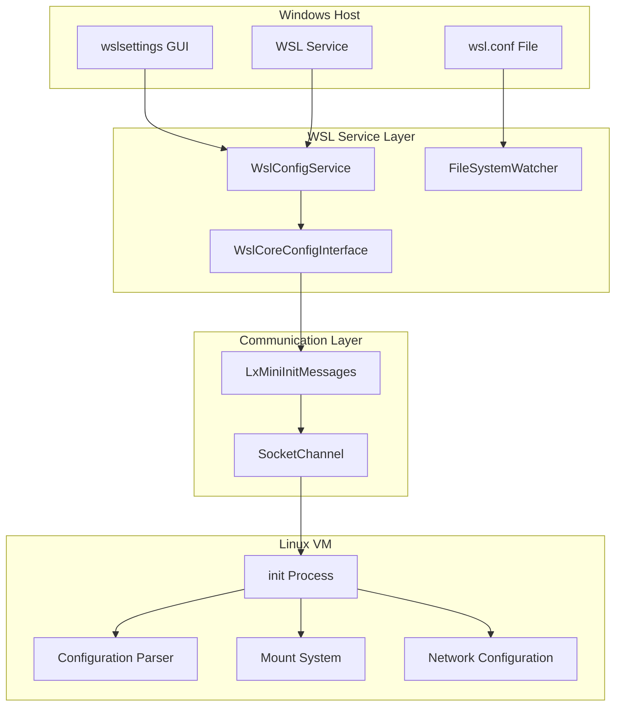
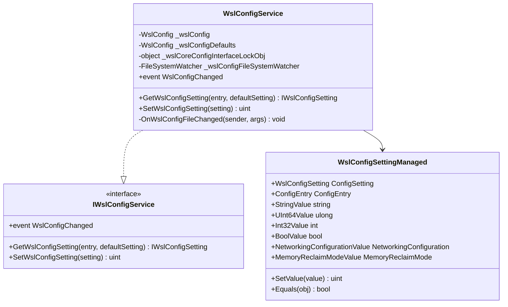
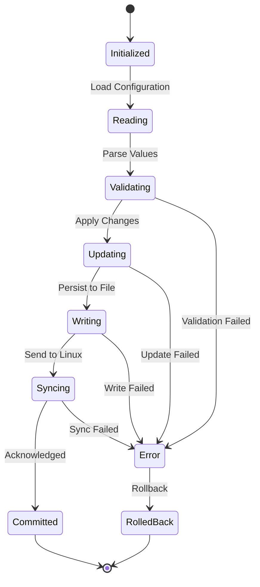
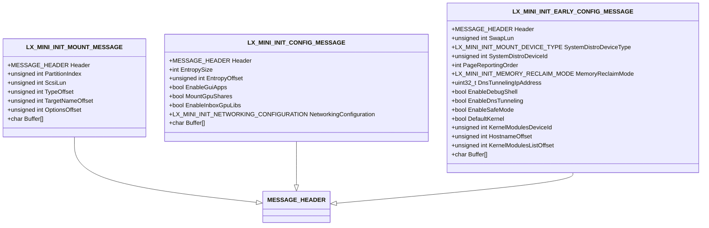
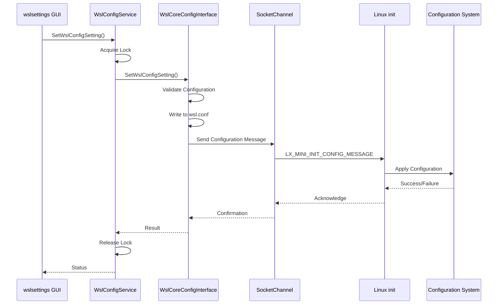
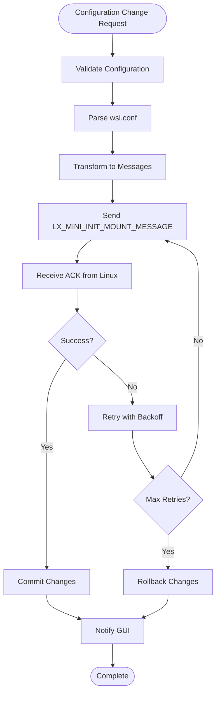
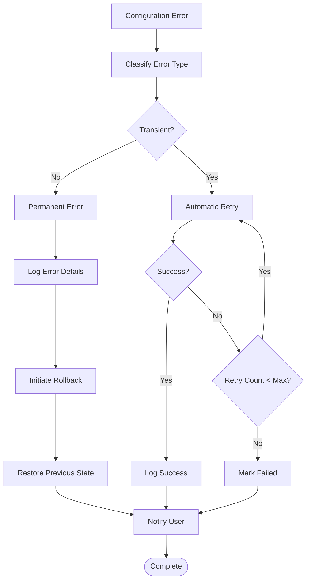

# Configuration Synchronization

<cite>
**Referenced Files in This Document**
- [WslConfigService.cs](file://src/windows/wslsettings/Services/WslConfigService.cs)
- [IWslConfigService.cs](file://src/windows/wslsettings/Contracts/Services/IWslConfigService.cs)
- [WslCoreConfigInterface.cpp](file://src/windows/libwsl/WslCoreConfigInterface.cpp)
- [WslCoreConfigInterface.h](file://src/windows/inc/WslCoreConfigInterface.h)
- [lxinitshared.h](file://src/shared/inc/lxinitshared.h)
- [config.cpp](file://src/linux/init/config.cpp)
- [WslConfigSettingViewModel.cs](file://src/windows/wslsettings/ViewModels/Settings/WslConfigSettingViewModel.cs)
- [WslCoreConfig.cpp](file://src/windows/common/WslCoreConfig.cpp)
- [UnitTests.cpp](file://test/windows/UnitTests.cpp)
</cite>

## Table of Contents
1. [Introduction](#introduction)
2. [System Architecture Overview](#system-architecture-overview)
3. [Core Components](#core-components)
4. [Configuration State Management](#configuration-state-management)
5. [Message Types and Communication](#message-types-and-communication)
6. [Domain Model](#domain-model)
7. [Configuration Synchronization Process](#configuration-synchronization-process)
8. [Error Handling and Rollback](#error-handling-and-rollback)
9. [Practical Examples](#practical-examples)
10. [Common Issues and Solutions](#common-issues-and-solutions)
11. [Advanced Topics](#advanced-topics)
12. [Conclusion](#conclusion)

## Introduction

WSL (Windows Subsystem for Linux) configuration synchronization is a sophisticated system that maintains consistency between Windows service configurations and Linux VM settings. This system ensures that changes made through the wslsettings GUI or wsl.conf files are properly propagated to the Linux environment, maintaining a unified configuration state across both platforms.

The synchronization mechanism operates through multiple layers of abstraction, including a Windows service layer, a native C++ configuration interface, and a Linux initialization system. This architecture enables seamless configuration updates while maintaining transactional integrity and providing robust error handling capabilities.

## System Architecture Overview

The WSL configuration synchronization system follows a layered architecture that separates concerns between the Windows host, the WSL service, and the Linux virtual machine.



**Diagram sources**
- [WslConfigService.cs](file://src/windows/wslsettings/Services/WslConfigService.cs#L8-L30)
- [WslCoreConfigInterface.cpp](file://src/windows/libwsl/WslCoreConfigInterface.cpp#L32-L44)
- [lxinitshared.h](file://src/shared/inc/lxinitshared.h#L1288-L1302)

## Core Components

### WslConfigService

The WslConfigService serves as the primary orchestrator for configuration synchronization, implementing the IWslConfigService interface. It manages the lifecycle of configuration objects and coordinates updates between the Windows service and the Linux VM.



**Diagram sources**
- [WslConfigService.cs](file://src/windows/wslsettings/Services/WslConfigService.cs#L8-L107)
- [IWslConfigService.cs](file://src/windows/wslsettings/Contracts/Services/IWslConfigService.cs#L5-L24)

**Section sources**
- [WslConfigService.cs](file://src/windows/wslsettings/Services/WslConfigService.cs#L8-L107)
- [IWslConfigService.cs](file://src/windows/wslsettings/Contracts/Services/IWslConfigService.cs#L5-L24)

### WslCoreConfigInterface

The WslCoreConfigInterface provides the native C++ bridge between the managed .NET code and the underlying configuration system. It handles low-level configuration file operations and maintains the configuration state.

**Section sources**
- [WslCoreConfigInterface.cpp](file://src/windows/libwsl/WslCoreConfigInterface.cpp#L32-L79)
- [WslCoreConfigInterface.h](file://src/windows/inc/WslCoreConfigInterface.h#L21-L97)

## Configuration State Management

### Versioning and Consistency

The configuration system implements a sophisticated versioning mechanism that tracks changes and ensures consistency across the synchronization boundary. Each configuration change is versioned and validated against the current state.



### Configuration Entry Types

The system supports various configuration entry types, each with specific validation and synchronization rules:

| Configuration Entry | Type | Validation Rules | Synchronization Behavior |
|-------------------|------|------------------|------------------------|
| ProcessorCount | Int32 | Range: 1-MaxCPUs | Immediate propagation |
| MemorySizeBytes | UInt64 | Min: 512MB, Power of 2 | Requires VM restart |
| SwapSizeBytes | UInt64 | Min: 0, Max: MemorySize | Dynamic adjustment |
| Networking | NetworkingConfiguration | Enum validation | Network reconfiguration |
| FirewallEnabled | Bool | True/False only | iptables update |
| IgnoredPorts | String | Comma-separated ports | Port filtering |

**Section sources**
- [WslCoreConfigInterface.cpp](file://src/windows/libwsl/WslCoreConfigInterface.cpp#L68-L332)
- [WslCoreConfigInterface.h](file://src/windows/inc/WslCoreConfigInterface.h#L21-L50)

## Message Types and Communication

### LxMiniInitMessageMount

The LxMiniInitMessageMount is a critical message type used for configuration updates, particularly for mount configurations and network settings. This message carries essential information about device mounting and filesystem configuration.



**Diagram sources**
- [lxinitshared.h](file://src/shared/inc/lxinitshared.h#L1288-L1302)
- [lxinitshared.h](file://src/shared/inc/lxinitshared.h#L1244-L1268)
- [lxinitshared.h](file://src/shared/inc/lxinitshared.h#L1175-L1200)

### Message Flow Architecture

The message communication follows a structured pipeline that ensures reliable delivery and processing of configuration updates.



**Diagram sources**
- [WslConfigService.cs](file://src/windows/wslsettings/Services/WslConfigService.cs#L49-L66)
- [WslCoreConfigInterface.cpp](file://src/windows/libwsl/WslCoreConfigInterface.cpp#L312-L332)

**Section sources**
- [lxinitshared.h](file://src/shared/inc/lxinitshared.h#L1288-L1302)
- [WslConfigService.cs](file://src/windows/wslsettings/Services/WslConfigService.cs#L49-L66)

## Domain Model

### Configuration State Representation

The domain model encapsulates the complete configuration state, including versioning, validation rules, and synchronization metadata.

```mermaid
erDiagram
WslConfig {
path ConfigFilePath
Config Config
string IgnoredPortsStr
}
WslConfigSetting {
WslConfigEntry ConfigEntry
string StringValue
ulong UInt64Value
int Int32Value
bool BoolValue
NetworkingConfiguration NetworkingConfigurationValue
MemoryReclaimMode MemoryReclaimModeValue
}
ConfigEntry {
NoEntry 0
ProcessorCount 1
MemorySizeBytes 2
SwapSizeBytes 3
VhdSizeBytes 4
Networking 5
FirewallEnabled 6
IgnoredPorts 7
}
NetworkingConfiguration {
None 0
Nat 1
Bridged 2
Mirrored 3
VirtioProxy 4
}
WslConfig ||--|| WslConfigSetting : contains
WslConfigSetting ||--|| ConfigEntry : references
WslConfigSetting ||--o| NetworkingConfiguration : uses
```

**Diagram sources**
- [WslCoreConfigInterface.h](file://src/windows/inc/WslCoreConfigInterface.h#L21-L50)
- [WslCoreConfigInterface.h](file://src/windows/inc/WslCoreConfigInterface.h#L52-L66)

### Transactional Updates

The system implements transactional updates to ensure atomicity and consistency during configuration changes. Each update operation is wrapped in a transaction that can be committed or rolled back based on success or failure.

**Section sources**
- [WslCoreConfigInterface.cpp](file://src/windows/libwsl/WslCoreConfigInterface.cpp#L312-L332)
- [WslConfigService.cs](file://src/windows/wslsettings/Services/WslConfigService.cs#L57-L66)

## Configuration Synchronization Process

### Mount Configuration Application

Mount configurations represent a critical aspect of WSL functionality, requiring careful synchronization between Windows and Linux environments. The system handles various mount scenarios including drive mounts, bind mounts, and special filesystem types.



### Network Settings Propagation

Network configuration synchronization involves multiple components including DNS settings, firewall rules, and routing tables. The system ensures that network changes are applied consistently across both environments.

**Section sources**
- [config.cpp](file://src/linux/init/config.cpp#L616-L2675)
- [WslCoreConfigInterface.cpp](file://src/windows/libwsl/WslCoreConfigInterface.cpp#L312-L332)

## Error Handling and Rollback

### Error Detection and Recovery

The configuration synchronization system implements comprehensive error detection and recovery mechanisms to handle failures gracefully and maintain system stability.



### Rollback Mechanisms

The system provides multiple rollback mechanisms to recover from configuration failures:

1. **Atomic Rollback**: Operations are wrapped in atomic transactions that can be rolled back if any step fails
2. **State Restoration**: Previous configuration state is maintained and restored in case of failures
3. **Graceful Degradation**: System continues operating with reduced functionality when non-critical components fail

**Section sources**
- [WslCoreConfigInterface.cpp](file://src/windows/libwsl/WslCoreConfigInterface.cpp#L250-L280)
- [WslConfigService.cs](file://src/windows/wslsettings/Services/WslConfigService.cs#L81-L92)

## Practical Examples

### Example 1: Memory Configuration Update

This example demonstrates how memory configuration changes are synchronized between Windows and Linux environments.

**Windows Side (C#)**:
- User modifies memory settings through wslsettings GUI
- WslConfigService receives the update request
- Configuration validation occurs with bounds checking
- Native interface calls propagate the change

**Linux Side (C++)**:
- LX_MINI_INIT_CONFIG_MESSAGE received by init process
- Memory limits validated against system capabilities
- Virtual memory subsystem notified of changes
- Configuration persisted to appropriate system files

### Example 2: Network Configuration Synchronization

Network configuration updates involve complex coordination between multiple subsystems.

**Configuration Flow**:
1. User sets networking mode to Bridged in wsl.conf
2. WslConfigService validates the configuration
3. Native interface writes to wsl.conf
4. LX_MINI_INIT_CONFIG_MESSAGE sent to Linux
5. Network manager reconfigures interfaces
6. DNS settings updated in resolv.conf
7. Firewall rules adjusted accordingly

**Section sources**
- [WslConfigSettingViewModel.cs](file://src/windows/wslsettings/ViewModels/Settings/WslConfigSettingViewModel.cs#L42-L58)
- [UnitTests.cpp](file://test/windows/UnitTests.cpp#L2970-L3009)

## Common Issues and Solutions

### Configuration Conflicts

**Issue**: Multiple concurrent configuration updates causing conflicts
**Solution**: Implement exclusive locking mechanisms and queue updates

**Issue**: Invalid configuration values causing system instability
**Solution**: Comprehensive validation with graceful degradation

**Issue**: Network configuration changes failing to apply
**Solution**: Implement retry logic with exponential backoff

### Failed Updates

**Issue**: Configuration changes not persisting to wsl.conf
**Solution**: Verify file permissions and disk space availability

**Issue**: Linux VM not receiving configuration messages
**Solution**: Check socket connectivity and message serialization

**Issue**: Partial configuration application leading to inconsistent state
**Solution**: Implement transactional updates with rollback capability

### Performance Considerations

**Issue**: Slow configuration synchronization affecting user experience
**Solution**: Optimize message serialization and implement batch updates

**Issue**: High CPU usage during configuration changes
**Solution**: Implement asynchronous processing and limit concurrent operations

**Section sources**
- [WslConfigService.cs](file://src/windows/wslsettings/Services/WslConfigService.cs#L81-L92)
- [WslCoreConfigInterface.cpp](file://src/windows/libwsl/WslCoreConfigInterface.cpp#L250-L280)

## Advanced Topics

### Custom Configuration Extensions

The system supports extensible configuration through plugin-like architectures that allow third-party components to register custom configuration handlers.

### Security Considerations

Configuration synchronization implements several security measures:
- Input validation and sanitization
- Access control for configuration files
- Secure communication channels
- Audit logging for configuration changes

### Monitoring and Diagnostics

The system provides comprehensive monitoring capabilities:
- Real-time configuration change tracking
- Performance metrics collection
- Error reporting and alerting
- Diagnostic log analysis

**Section sources**
- [WslCoreConfigInterface.cpp](file://src/windows/libwsl/WslCoreConfigInterface.cpp#L283-L292)
- [config.cpp](file://src/linux/init/config.cpp#L616-L640)

## Conclusion

WSL configuration synchronization represents a sophisticated system that bridges the gap between Windows and Linux configuration management. Through its layered architecture, comprehensive error handling, and robust synchronization mechanisms, it provides a reliable foundation for maintaining consistent configuration state across both environments.

The system's design emphasizes reliability, performance, and extensibility, making it suitable for both basic configuration management and advanced customization scenarios. Its transactional update mechanisms, comprehensive validation, and graceful error recovery ensure that configuration changes are applied safely and consistently.

Understanding this system is crucial for developers working with WSL, system administrators managing WSL deployments, and anyone interested in cross-platform configuration management solutions. The modular design and extensive documentation make it accessible to beginners while providing the depth needed for advanced use cases.