# Notification Mechanisms

<cite>
**Referenced Files in This Document**
- [init.cpp](file://src/linux/init/init.cpp)
- [main.cpp](file://src/linux/init/main.cpp)
- [lxinitshared.h](file://src/shared/inc/lxinitshared.h)
- [SocketChannel.h](file://src/shared/inc/SocketChannel.h)
- [LxssMessagePort.cpp](file://src/windows/common/LxssMessagePort.cpp)
- [notifications.cpp](file://src/windows/common/notifications.cpp)
- [message.h](file://src/shared/inc/message.h)
</cite>

## Table of Contents
1. [Introduction](#introduction)
2. [System Architecture Overview](#system-architecture-overview)
3. [Domain Model of Event Notification](#domain-model-of-event-notification)
4. [Process Exit Notification Implementation](#process-exit-notification-implementation)
5. [Message Structure and Delivery Guarantees](#message-structure-and-delivery-guarantees)
6. [Channel Reliability and Error Recovery](#channel-reliability-and-error-recovery)
7. [Event Ordering and Sequence Management](#event-ordering-and-sequence-management)
8. [Common Issues and Solutions](#common-issues-and-solutions)
9. [Practical Examples](#practical-examples)
10. [Best Practices](#best-practices)

## Introduction

WSL (Windows Subsystem for Linux) implements a sophisticated notification mechanism that enables bidirectional communication between the Windows service and the Linux guest environment. This system is crucial for maintaining synchronization between the host and guest operating systems, particularly for process lifecycle management, system state changes, and cross-platform coordination.

The notification system operates through a series of message types defined in the `lxinitshared.h` header file, with the mini_init process serving as the primary sender of notifications to the Windows service. These notifications encompass process exit events, system state changes, and various operational signals that ensure seamless integration between Windows and Linux environments.

## System Architecture Overview

The WSL notification system follows a client-server architecture where the Windows service acts as the server and the Linux guest environment (specifically mini_init) acts as the client. Communication occurs through socket channels that provide reliable message delivery with sequence numbering and error detection.

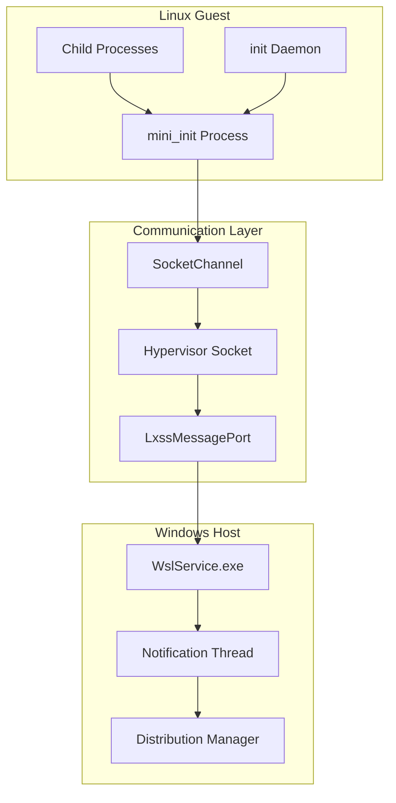

**Diagram sources**
- [SocketChannel.h](file://src/shared/inc/SocketChannel.h#L44-L402)
- [LxssMessagePort.cpp](file://src/windows/common/LxssMessagePort.cpp#L15-L291)

The architecture ensures that notifications flow from the Linux guest to the Windows host through a reliable socket-based communication channel. The system handles various message types including process exit notifications, system state updates, and configuration changes.

**Section sources**
- [SocketChannel.h](file://src/shared/inc/SocketChannel.h#L1-L402)
- [LxssMessagePort.cpp](file://src/windows/common/LxssMessagePort.cpp#L1-L291)

## Domain Model of Event Notification

The WSL notification system defines a comprehensive domain model centered around message types, structures, and delivery semantics. The core components include message headers, payload structures, and sequence management.

### Message Types and Categories

The system defines several categories of notification messages:

| Message Category | Purpose | Key Types |
|------------------|---------|-----------|
| Process Lifecycle | Child process monitoring | `LxInitMessageExitStatus`, `LxMiniInitMessageChildExit` |
| System State | Configuration and status updates | `LxInitMessageInitialize`, `LxInitMessageNetworkInformation` |
| Control Operations | Service requests and responses | `LxInitMessageCreateProcess`, `LxInitMessageTerminateInstance` |
| Debug and Telemetry | Monitoring and diagnostics | `LxProcessCrash`, `LxMiniInitTelemetryMessage` |

### Message Structure Definition

Each notification follows a standardized structure defined in the message header:

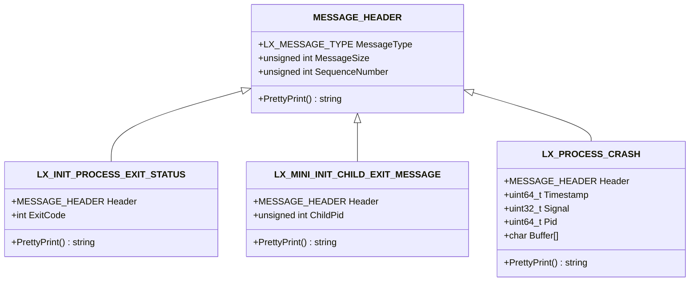

**Diagram sources**
- [lxinitshared.h](file://src/shared/inc/lxinitshared.h#L478-L487)
- [lxinitshared.h](file://src/shared/inc/lxinitshared.h#L989-L997)
- [lxinitshared.h](file://src/shared/inc/lxinitshared.h#L1376-L1384)

### Delivery Guarantees

The notification system provides several delivery guarantees:

- **At-Least-Once Delivery**: Messages are guaranteed to be delivered at least once, with sequence numbers preventing duplicates
- **Ordered Delivery**: Messages are delivered in the order they were sent, with sequence verification
- **Reliable Transmission**: Socket-based communication ensures message persistence during transmission
- **Error Detection**: Comprehensive error checking and logging for failed transmissions

**Section sources**
- [lxinitshared.h](file://src/shared/inc/lxinitshared.h#L478-L487)
- [lxinitshared.h](file://src/shared/inc/lxinitshared.h#L989-L997)
- [lxinitshared.h](file://src/shared/inc/lxinitshared.h#L1376-L1384)

## Process Exit Notification Implementation

The process exit notification mechanism is one of the most critical components of the WSL notification system. It ensures that the Windows service is promptly informed when child processes terminate, enabling proper resource cleanup and state synchronization.

### Implementation in mini_init

The mini_init process implements exit notifications through the `LX_MINI_INIT_CHILD_EXIT_MESSAGE` structure. This implementation occurs in the main event loop where child processes are monitored using `waitpid()`:

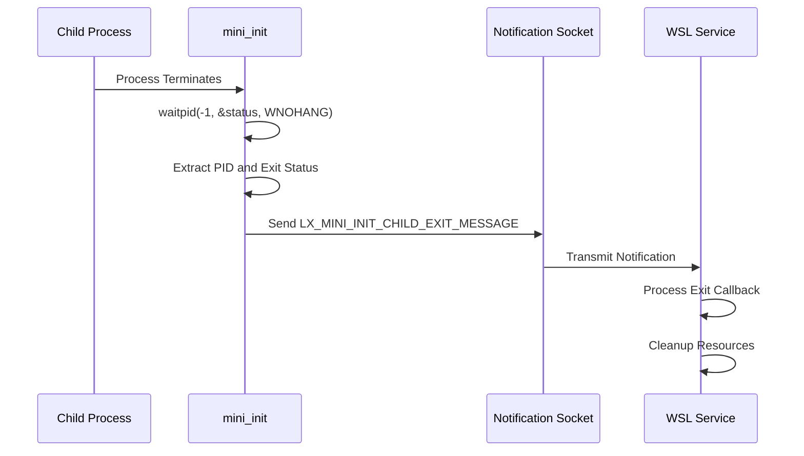

**Diagram sources**
- [main.cpp](file://src/linux/init/main.cpp#L4217-L4259)

The notification process involves several key steps:

1. **Process Reaping**: The system uses `waitpid()` with `WNOHANG` to check for terminated child processes without blocking
2. **Status Extraction**: Exit codes and signal information are extracted from the wait status
3. **Message Construction**: An `LX_MINI_INIT_CHILD_EXIT_MESSAGE` is constructed with the child's PID
4. **Transmission**: The message is written to the notification file descriptor using `UtilWriteBuffer()`

### Implementation in init.cpp

The init daemon also generates exit notifications for specific scenarios, particularly when managing interactive sessions and process hierarchies:

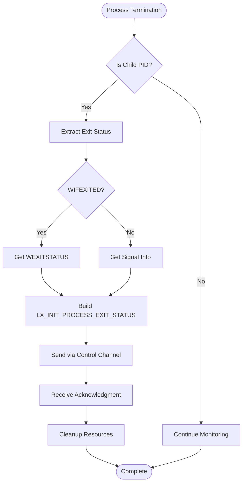

**Diagram sources**
- [init.cpp](file://src/linux/init/init.cpp#L2001-L2042)

**Section sources**
- [main.cpp](file://src/linux/init/main.cpp#L4217-L4259)
- [init.cpp](file://src/linux/init/init.cpp#L2001-L2042)

## Message Structure and Delivery Guarantees

The WSL notification system employs a robust message structure that ensures reliable delivery and proper sequencing of notifications.

### Message Header Structure

Every notification begins with a standardized message header that provides essential metadata:

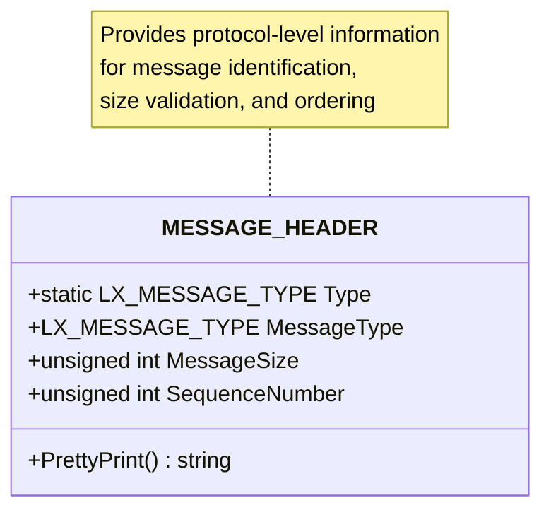

**Diagram sources**
- [lxinitshared.h](file://src/shared/inc/lxinitshared.h#L478-L487)

### Payload Structures

Different notification types utilize specialized payload structures:

| Message Type | Structure | Purpose |
|--------------|-----------|---------|
| `LxInitMessageExitStatus` | `LX_INIT_PROCESS_EXIT_STATUS` | Process termination with exit code |
| `LxMiniInitMessageChildExit` | `LX_MINI_INIT_CHILD_EXIT_MESSAGE` | Child process exit notification |
| `LxProcessCrash` | `LX_PROCESS_CRASH` | Crash dump and signal information |
| `LxInitMessageCreateProcessResponse` | `LX_INIT_CREATE_PROCESS_RESPONSE` | Process creation result |

### Delivery Mechanisms

The system employs multiple delivery mechanisms depending on the context:

1. **Direct Socket Writing**: For immediate notifications like child process exits
2. **Control Channel Messaging**: For coordinated process lifecycle management
3. **Asynchronous Notification Threads**: For background monitoring and notification

**Section sources**
- [lxinitshared.h](file://src/shared/inc/lxinitshared.h#L478-L487)
- [message.h](file://src/shared/inc/message.h#L26-L186)

## Channel Reliability and Error Recovery

The SocketChannel class provides comprehensive reliability features for notification delivery, including error detection, recovery mechanisms, and logging capabilities.

### SocketChannel Architecture

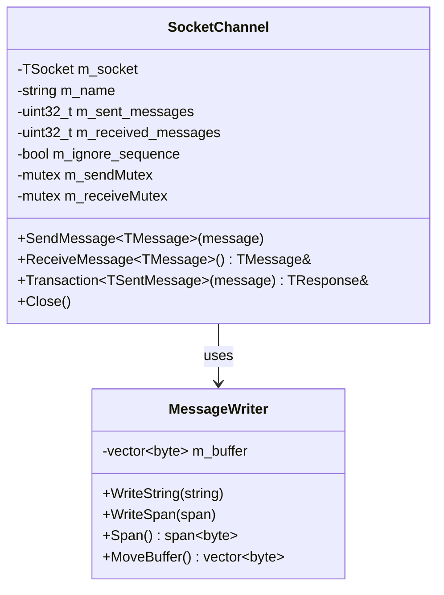

**Diagram sources**
- [SocketChannel.h](file://src/shared/inc/SocketChannel.h#L44-L402)
- [message.h](file://src/shared/inc/message.h#L26-L186)

### Error Handling Mechanisms

The system implements multiple layers of error handling:

1. **Thread Safety**: Mutex protection prevents concurrent access to channels
2. **Sequence Validation**: Automatic sequence number checking prevents message reordering
3. **Timeout Management**: Configurable timeouts prevent indefinite blocking
4. **Graceful Degradation**: Failed notifications trigger appropriate fallback mechanisms

### Recovery Strategies

When notification failures occur, the system employs several recovery strategies:

- **Automatic Retry**: Failed transmissions are retried with exponential backoff
- **State Synchronization**: Lost notifications trigger state reconciliation
- **Resource Cleanup**: Failed channels are properly cleaned up to prevent resource leaks
- **Logging and Monitoring**: Comprehensive logging helps diagnose and resolve issues

**Section sources**
- [SocketChannel.h](file://src/shared/inc/SocketChannel.h#L1-L402)

## Event Ordering and Sequence Management

The WSL notification system maintains strict ordering guarantees through a sophisticated sequence management system that prevents message reordering and ensures reliable delivery.

### Sequence Numbering

Each message includes a sequence number that provides ordering guarantees:

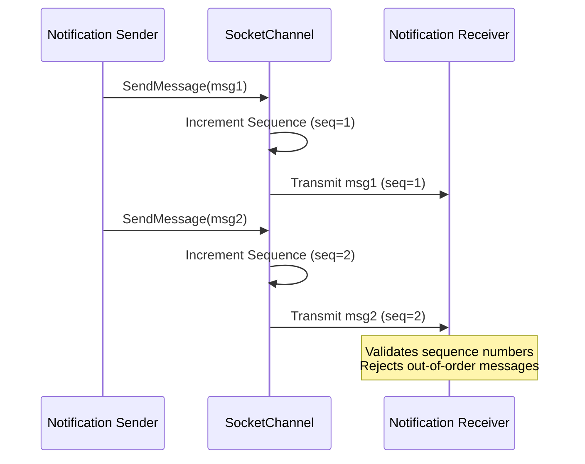

**Diagram sources**
- [SocketChannel.h](file://src/shared/inc/SocketChannel.h#L106-L111)

### Ordering Guarantees

The system provides several ordering guarantees:

1. **Strict Ordering**: Messages are delivered in the exact order they were sent
2. **Atomic Delivery**: Each message is delivered as a complete unit
3. **No Reordering**: Sequence number validation prevents message reordering
4. **Gap Detection**: Missing sequence numbers trigger error conditions

### Sequence Validation

The receiver validates sequence numbers to ensure proper ordering:

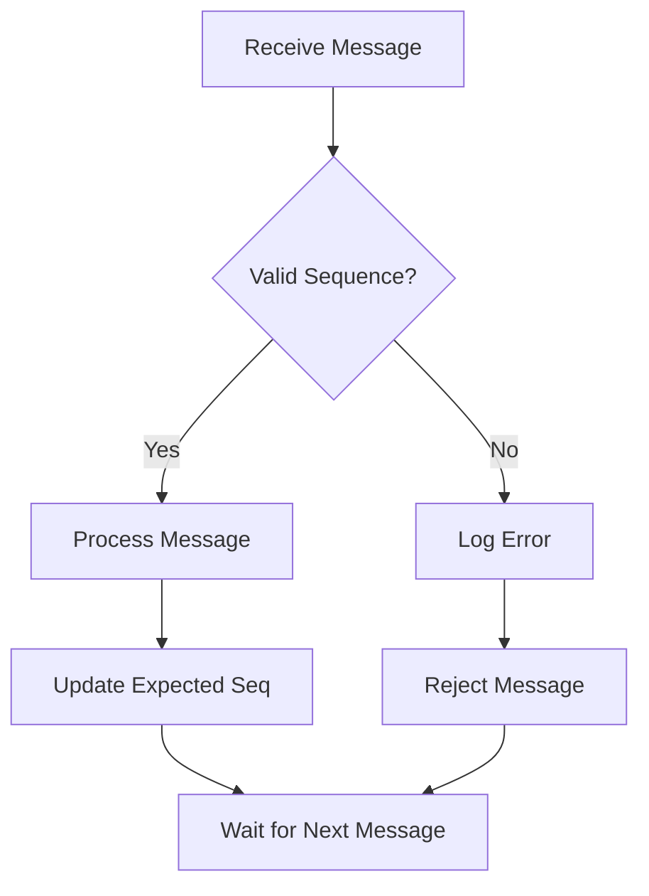

**Diagram sources**
- [SocketChannel.h](file://src/shared/inc/SocketChannel.h#L231-L232)

**Section sources**
- [SocketChannel.h](file://src/shared/inc/SocketChannel.h#L106-L111)
- [SocketChannel.h](file://src/shared/inc/SocketChannel.h#L231-L232)

## Common Issues and Solutions

The WSL notification system can encounter several common issues that affect reliability and performance. Understanding these issues and their solutions is crucial for maintaining system stability.

### Lost Notifications

**Symptoms**: Processes appear to terminate without notification, leading to resource leaks and inconsistent state.

**Causes**:
- Network connectivity issues between host and guest
- Socket buffer overflow
- Process termination during notification transmission
- Sequence number mismatches

**Solutions**:
1. Implement notification queuing to buffer messages during temporary failures
2. Use connection health checks to detect and recover from network issues
3. Employ atomic message transmission to prevent partial delivery
4. Implement state reconciliation mechanisms to recover from lost notifications

### Delayed Delivery

**Symptoms**: Notifications arrive significantly later than expected, causing timing-sensitive operations to fail.

**Causes**:
- High system load affecting socket performance
- Large message sizes causing transmission delays
- Network congestion in virtualized environments
- Insufficient buffer sizes for high-throughput scenarios

**Solutions**:
1. Optimize message sizes to reduce transmission time
2. Implement priority queuing for time-critical notifications
3. Use dedicated communication channels for critical notifications
4. Monitor and tune socket buffer sizes based on workload characteristics

### Duplicate Notifications

**Symptoms**: The same notification appears multiple times, causing redundant processing and potential race conditions.

**Causes**:
- Network retransmission due to packet loss
- Concurrent access to notification channels
- Improper sequence number management
- Race conditions in message construction

**Solutions**:
1. Implement deduplication filters based on message content or sequence numbers
2. Use atomic operations for sequence number incrementation
3. Employ mutex protection for concurrent access scenarios
4. Design idempotent handlers that safely process duplicate messages

### Connection Failures

**Symptoms**: Complete loss of notification capability, requiring system restart to recover.

**Causes**:
- Socket corruption or exhaustion
- Memory allocation failures
- Permission or security policy violations
- Hardware or driver issues

**Solutions**:
1. Implement automatic connection recovery with exponential backoff
2. Use connection pooling to manage socket resources efficiently
3. Monitor system resources and proactively handle exhaustion scenarios
4. Implement graceful degradation when critical connections fail

**Section sources**
- [SocketChannel.h](file://src/shared/inc/SocketChannel.h#L1-L402)

## Practical Examples

This section provides concrete examples of how the WSL notification system operates in real-world scenarios, demonstrating both successful operation and common failure modes.

### Example 1: Normal Process Exit Notification

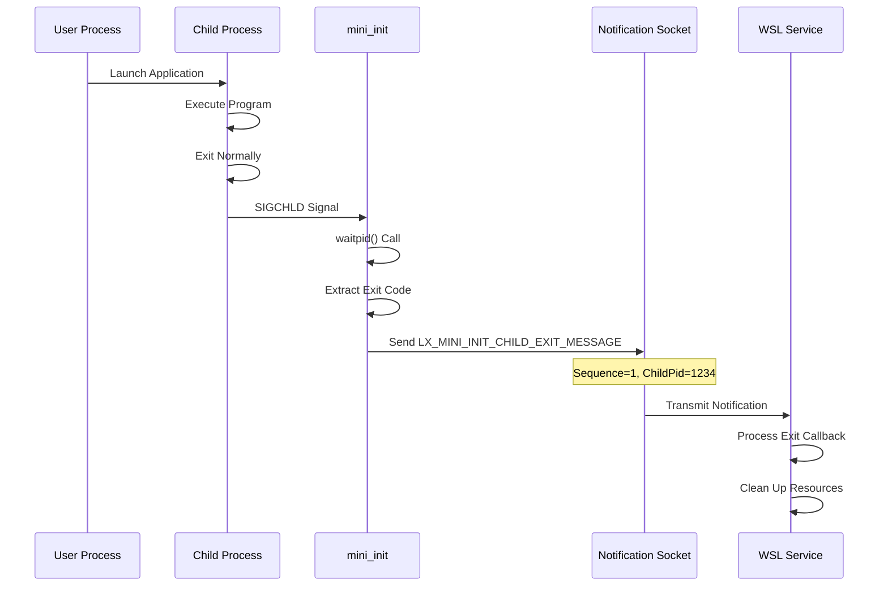

**Example Source**: [main.cpp](file://src/linux/init/main.cpp#L4242-L4246)

### Example 2: Process Termination with Signal

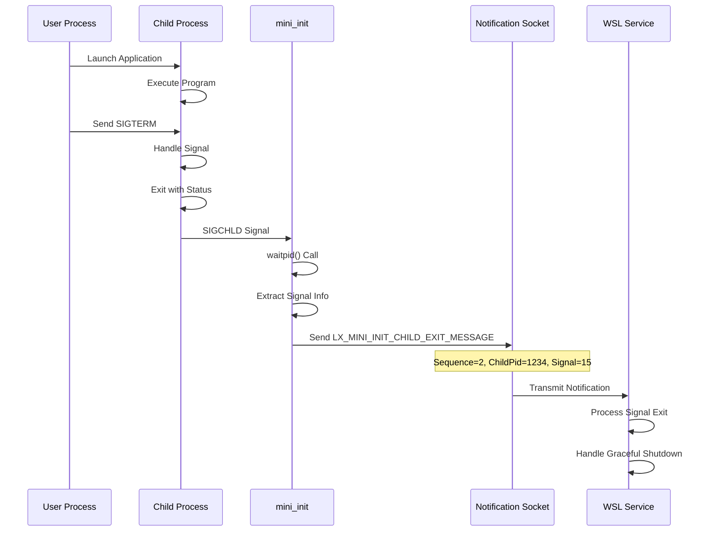

**Example Source**: [init.cpp](file://src/linux/init/init.cpp#L2025-L2028)

### Example 3: Failed Notification Recovery

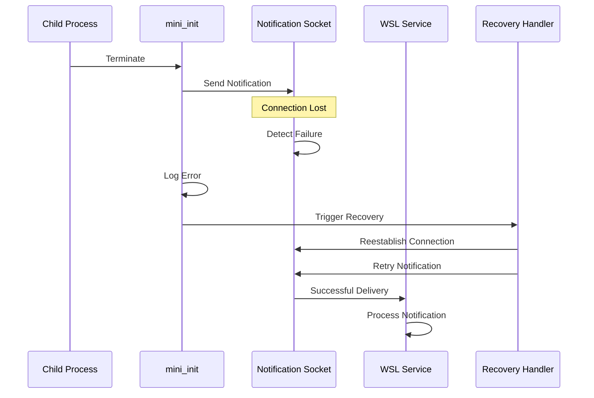

**Example Source**: [SocketChannel.h](file://src/shared/inc/SocketChannel.h#L130-L134)

### Example 4: High-Volume Notification Scenario

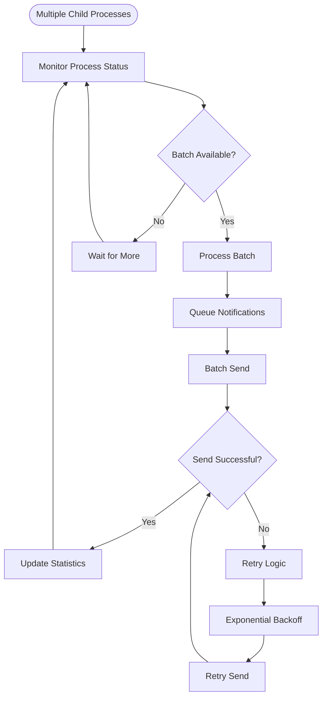

**Example Source**: [SocketChannel.h](file://src/shared/inc/SocketChannel.h#L88-L102)

**Section sources**
- [main.cpp](file://src/linux/init/main.cpp#L4242-L4246)
- [init.cpp](file://src/linux/init/init.cpp#L2025-L2028)
- [SocketChannel.h](file://src/shared/inc/SocketChannel.h#L130-L134)

## Best Practices

Implementing reliable notification mechanisms requires adherence to established best practices that ensure system stability, performance, and maintainability.

### Design Principles

1. **Fail-Safe Design**: Always assume failures will occur and design accordingly
2. **Minimal Dependencies**: Reduce coupling between notification components
3. **Stateless Processing**: Design handlers to be idempotent and stateless
4. **Graceful Degradation**: Maintain basic functionality even when notifications fail

### Implementation Guidelines

1. **Use Atomic Operations**: Ensure sequence numbers and counters are updated atomically
2. **Implement Timeout Handling**: Never block indefinitely on notification delivery
3. **Validate Message Content**: Verify message structure and content before processing
4. **Log Comprehensive Information**: Maintain detailed logs for debugging and monitoring

### Performance Optimization

1. **Batch Notifications**: Group related notifications to reduce overhead
2. **Prioritize Critical Messages**: Use separate channels for time-sensitive notifications
3. **Optimize Message Sizes**: Balance information completeness with transmission efficiency
4. **Monitor Resource Usage**: Track memory and CPU usage of notification components

### Security Considerations

1. **Validate Input Data**: Sanitize all incoming notification data
2. **Implement Access Controls**: Restrict notification access to authorized components
3. **Encrypt Sensitive Data**: Use encryption for confidential notification content
4. **Audit Notification Activity**: Log all notification activity for security monitoring

### Testing and Monitoring

1. **Unit Test Notification Handlers**: Test individual components in isolation
2. **Integration Test Scenarios**: Test complete notification flows
3. **Stress Test Underload**: Test performance under high load conditions
4. **Monitor System Health**: Track notification delivery rates and latency

These best practices ensure that the WSL notification system remains reliable, performant, and maintainable across diverse deployment scenarios and usage patterns.