# Lifecycle Management

<cite>
**Referenced Files in This Document**
- [Lifetime.cpp](file://src/windows/service/exe/Lifetime.cpp)
- [Lifetime.h](file://src/windows/service/exe/Lifetime.h)
- [WslCoreVm.cpp](file://src/windows/service/exe/WslCoreVm.cpp)
- [WslCoreVm.h](file://src/windows/service/exe/WslCoreVm.h)
- [telemetry.cpp](file://src/linux/init/telemetry.cpp)
- [hcs.cpp](file://src/windows/common/hcs.cpp)
- [hcs.hpp](file://src/windows/common/hcs.hpp)
- [collect-wsl-logs.ps1](file://diagnostics/collect-wsl-logs.ps1)
- [GuestTelemetryLogger.cpp](file://src/windows/service/exe/GuestTelemetryLogger.cpp)
- [GuestTelemetryLogger.h](file://src/windows/service/exe/GuestTelemetryLogger.h)
</cite>

## Table of Contents
1. [Introduction](#introduction)
2. [System Architecture Overview](#system-architecture-overview)
3. [VM Lifecycle Management](#vm-lifecycle-management)
4. [Distribution Lifecycle Management](#distribution-lifecycle-management)
5. [Telemetry and Monitoring](#telemetry-and-monitoring)
6. [State Machine Transitions](#state-machine-transitions)
7. [API Interfaces and Programmatic Control](#api-interfaces-and-programmatic-control)
8. [Common Issues and Debugging](#common-issues-and-debugging)
9. [Practical Examples](#practical-examples)
10. [Troubleshooting Guide](#troubleshooting-guide)

## Introduction

WSL (Windows Subsystem for Linux) lifecycle management encompasses the complete management of virtual machines and Linux distributions throughout their operational life. This system handles VM creation, startup, runtime monitoring, suspension, and termination through sophisticated state management and HCS (Host Compute Service) integration.

The lifecycle management system consists of several key components:
- **VM Management**: Core virtual machine lifecycle through WslCoreVm
- **Distribution Management**: Linux distribution lifecycle coordination
- **Lifetime Management**: Process and client lifecycle tracking
- **Telemetry Systems**: Comprehensive monitoring and reporting
- **HCS Integration**: Host compute service communication

## System Architecture Overview

The WSL lifecycle management system follows a layered architecture with clear separation of concerns:

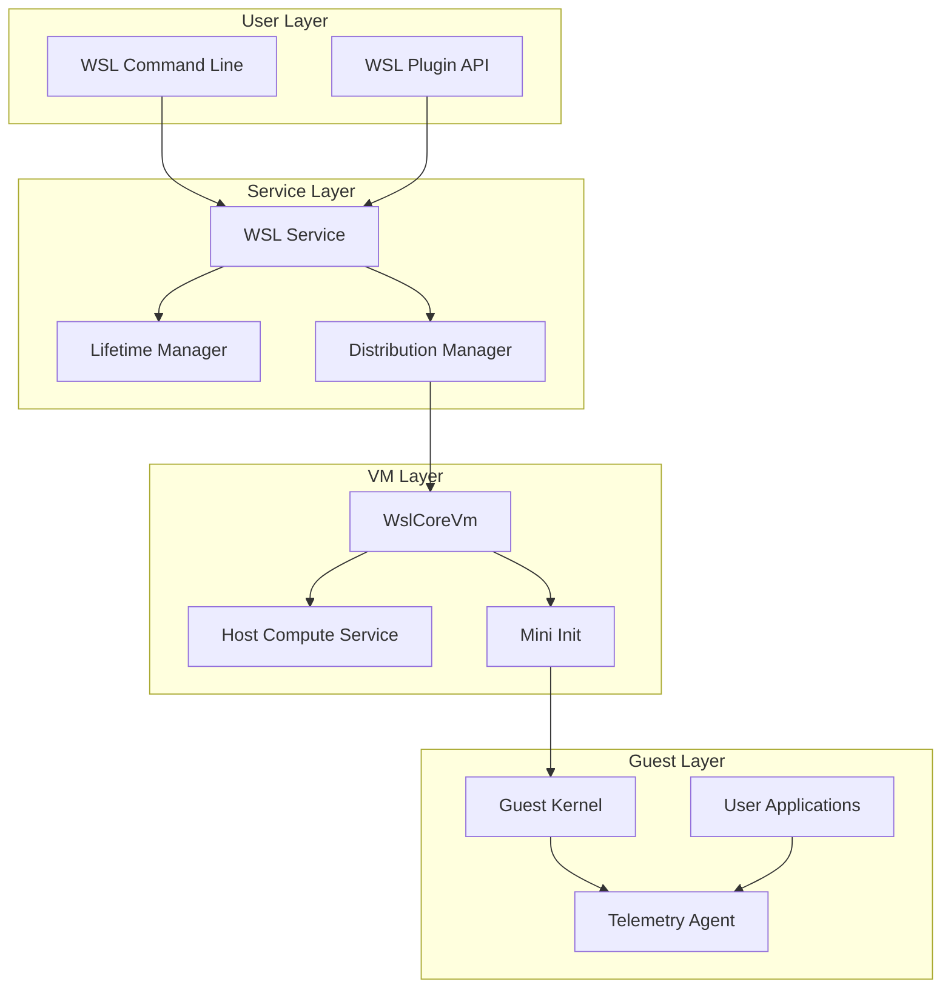

**Diagram sources**
- [WslCoreVm.cpp](file://src/windows/service/exe/WslCoreVm.cpp#L103-L166)
- [Lifetime.cpp](file://src/windows/service/exe/Lifetime.cpp#L32-L42)

**Section sources**
- [WslCoreVm.cpp](file://src/windows/service/exe/WslCoreVm.cpp#L1-L50)
- [Lifetime.cpp](file://src/windows/service/exe/Lifetime.cpp#L1-L30)

## VM Lifecycle Management

### VM Creation and Initialization

VM creation involves multiple phases of initialization through the WslCoreVm class:

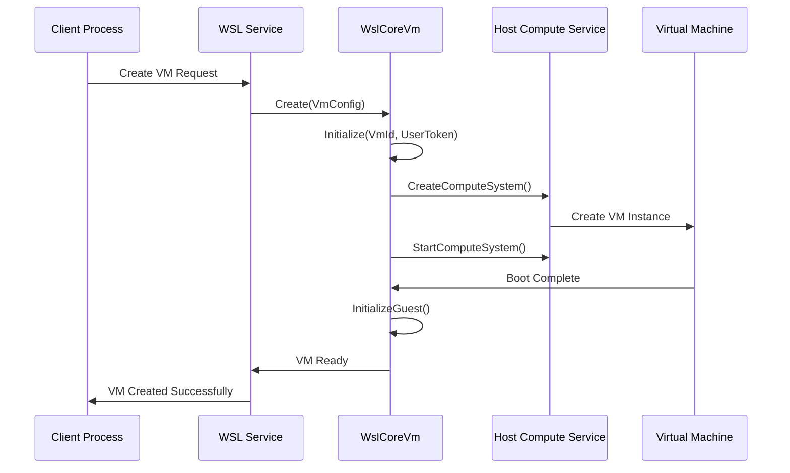

**Diagram sources**
- [WslCoreVm.cpp](file://src/windows/service/exe/WslCoreVm.cpp#L108-L166)
- [hcs.cpp](file://src/windows/common/hcs.cpp#L79-L96)

The VM creation process includes:

1. **Configuration Validation**: Verifies VM configuration parameters
2. **Resource Allocation**: Sets up temporary directories and paths
3. **HCS Integration**: Creates compute system through Host Compute Service
4. **Guest Initialization**: Initializes the Linux guest environment
5. **Network Setup**: Configures networking infrastructure
6. **Telemetry Setup**: Establishes telemetry collection channels

**Section sources**
- [WslCoreVm.cpp](file://src/windows/service/exe/WslCoreVm.cpp#L168-L372)

### VM Startup Process

VM startup follows a structured initialization sequence:

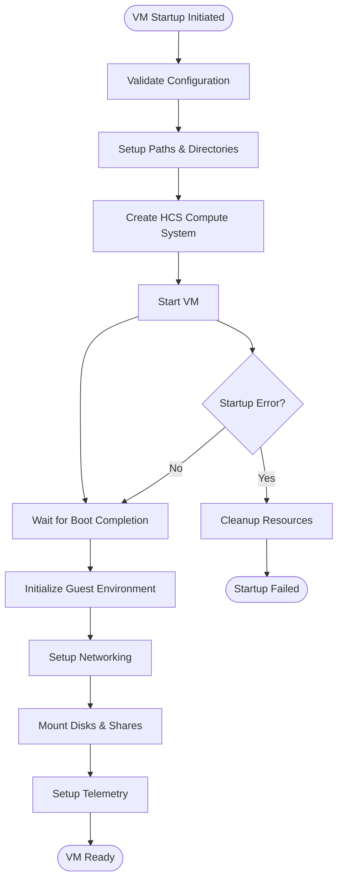

**Diagram sources**
- [WslCoreVm.cpp](file://src/windows/service/exe/WslCoreVm.cpp#L168-L372)

**Section sources**
- [WslCoreVm.cpp](file://src/windows/service/exe/WslCoreVm.cpp#L168-L372)

### VM Termination and Shutdown

VM termination implements graceful shutdown with fallback mechanisms:

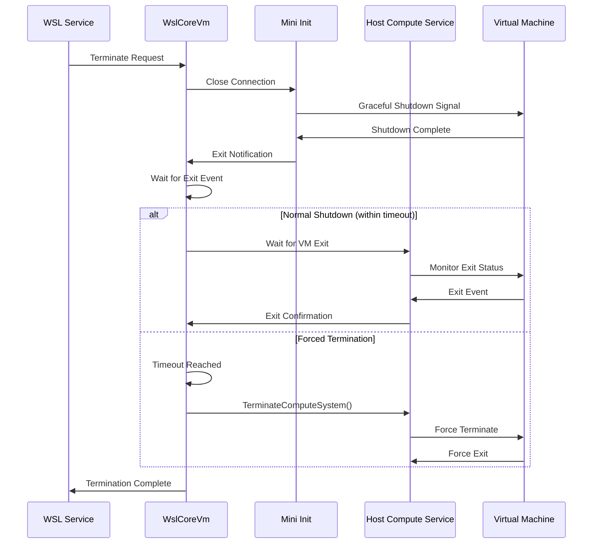

**Diagram sources**
- [WslCoreVm.cpp](file://src/windows/service/exe/WslCoreVm.cpp#L740-L774)

**Section sources**
- [WslCoreVm.cpp](file://src/windows/service/exe/WslCoreVm.cpp#L740-L774)

## Distribution Lifecycle Management

### Distribution Registration and Management

Distributions are managed through a registration system that tracks their lifecycle:

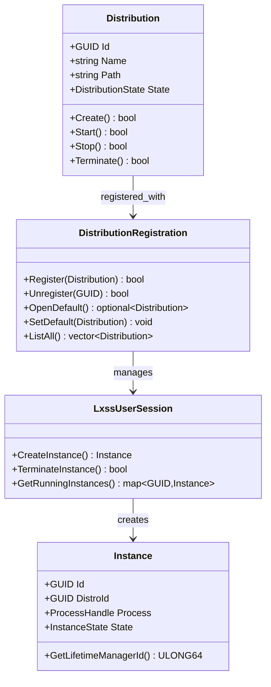

**Diagram sources**
- [WslCoreVm.cpp](file://src/windows/service/exe/WslCoreVm.cpp#L75-L83)
- [Lifetime.cpp](file://src/windows/service/exe/Lifetime.cpp#L19-L30)

**Section sources**
- [WslCoreVm.cpp](file://src/windows/service/exe/WslCoreVm.cpp#L75-L83)

### Distribution State Transitions

Distributions follow specific state transitions during their lifecycle:

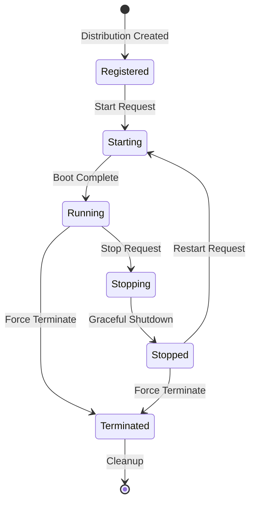

**Section sources**
- [WslCoreVm.cpp](file://src/windows/service/exe/WslCoreVm.cpp#L3535-L3576)

## Telemetry and Monitoring

### Telemetry Collection Architecture

WSL implements comprehensive telemetry collection through multiple channels:

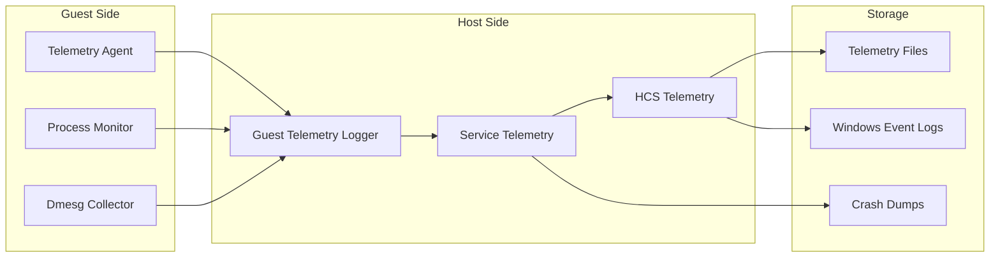

**Diagram sources**
- [telemetry.cpp](file://src/linux/init/telemetry.cpp#L127-L170)
- [GuestTelemetryLogger.cpp](file://src/windows/service/exe/GuestTelemetryLogger.cpp#L44-L84)

**Section sources**
- [telemetry.cpp](file://src/linux/init/telemetry.cpp#L127-L282)
- [GuestTelemetryLogger.cpp](file://src/windows/service/exe/GuestTelemetryLogger.cpp#L1-L96)

### Telemetry Reporting Mechanisms

The telemetry system captures various lifecycle events:

| Event Category | Events Tracked | Data Collected |
|----------------|----------------|----------------|
| VM Lifecycle | CreateVmBegin, CreateVmEnd, FailedToStartVm | VM ID, Time to create, Error codes |
| Distribution Lifecycle | Exec, ExecCritical | Binary names, execution counts |
| Network Events | WslCoreVmInitialize | Networking mode, firewall status |
| Performance Metrics | TerminateVmStart, TerminateVm | Termination timing, success/failure |

**Section sources**
- [WslCoreVm.cpp](file://src/windows/service/exe/WslCoreVm.cpp#L116-L141)
- [telemetry.cpp](file://src/linux/init/telemetry.cpp#L218-L267)

## State Machine Transitions

### VM State Machine

The VM state machine manages transitions through distinct phases:

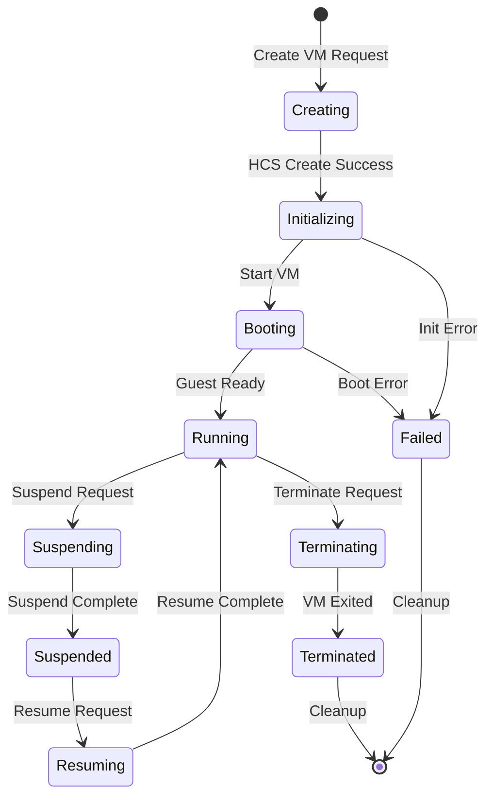

### Distribution State Machine

Distributions manage their own state transitions:

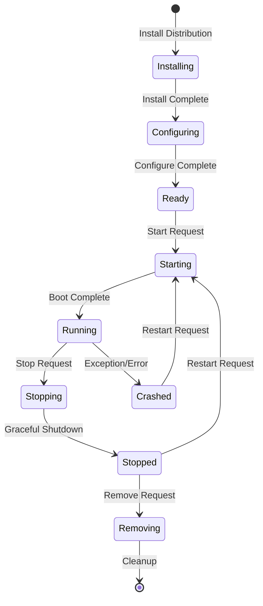

## API Interfaces and Programmatic Control

### Public Interfaces

WSL provides several interfaces for programmatic lifecycle control:

#### WSL Service API

The primary interface for VM and distribution management:

```cpp
// VM Creation
static std::unique_ptr<WslCoreVm> Create(
    _In_ const wil::shared_handle& UserToken, 
    _In_ wsl::core::Config&& VmConfig, 
    _In_ const GUID& VmId);

// Instance Management  
std::shared_ptr<LxssRunningInstance> CreateInstance(
    _In_ const GUID& InstanceId,
    _In_ const LXSS_DISTRO_CONFIGURATION& Configuration,
    _In_ LX_MESSAGE_TYPE MessageType,
    _In_ DWORD ReceiveTimeout = 0);

// Lifecycle Operations
void RegisterCallbacks(
    _In_ const std::function<void(ULONG)>& DistroExitCallback = {},
    _In_ const std::function<void(GUID)>& TerminationCallback = {});
```

#### Lifetime Management API

Process and client lifecycle tracking:

```cpp
// Client Registration
ULONG64 GetRegistrationId();
bool IsAnyProcessRegistered(_In_ ULONG64 ClientKey);
void RegisterCallback(
    _In_ ULONG64 ClientKey, 
    _In_ const std::function<bool(void)>& Callback, 
    _In_opt_ HANDLE ClientProcess, 
    _In_ DWORD TimeoutMs);

// Cleanup Operations
bool RemoveCallback(_In_ ULONG64 ClientKey);
void ClearCallbacks();
```

**Section sources**
- [WslCoreVm.h](file://src/windows/service/exe/WslCoreVm.h#L59-L83)
- [Lifetime.h](file://src/windows/service/exe/Lifetime.h#L28-L38)

### Command-Line Tools

WSL provides comprehensive command-line tools for lifecycle management:

| Command | Purpose | Parameters |
|---------|---------|------------|
| `wsl --shutdown` | Terminate all VMs | None |
| `wsl --terminate <distro>` | Terminate specific distribution | Distribution name or GUID |
| `wsl --suspend` | Suspend VM | None |
| `wsl --list --verbose` | List VMs with details | None |
| `wsl --status` | Show VM status | None |

## Common Issues and Debugging

### Failed VM Startup

Common causes and solutions for VM startup failures:

#### Kernel Panic Detection

The system detects kernel panics through HVSocket errors:

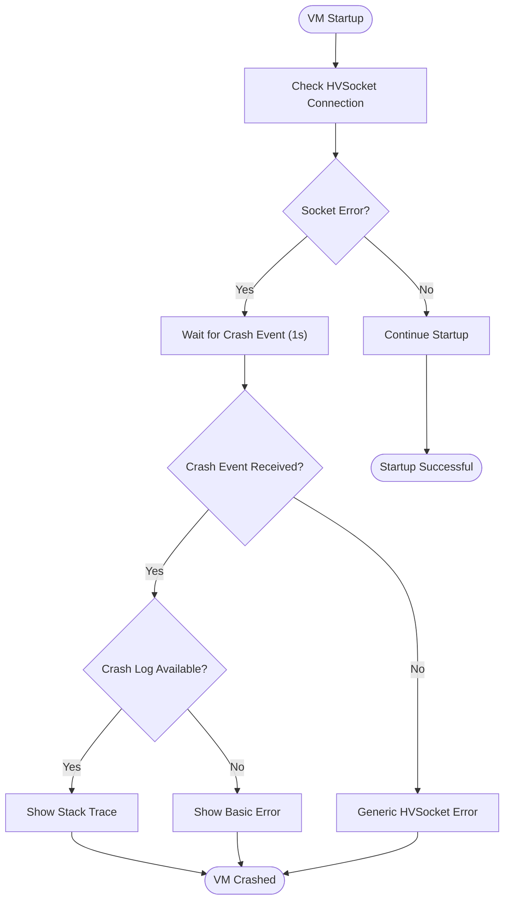

**Diagram sources**
- [WslCoreVm.cpp](file://src/windows/service/exe/WslCoreVm.cpp#L134-L162)

#### Common Startup Issues

| Issue | Symptoms | Solution |
|-------|----------|----------|
| HVSocket Connection Failed | WSASocket error | Check Virtual Machine Platform feature |
| Kernel Panic | HVSocket timeout | Review crash logs using collect-wsl-logs.ps1 |
| Insufficient Memory | VM creation fails | Increase allocated memory in wsl.conf |
| Corrupted VHD | Mount failures | Repair or recreate distribution |

**Section sources**
- [WslCoreVm.cpp](file://src/windows/service/exe/WslCoreVm.cpp#L134-L162)

### Shutdown Hangs and Timeouts

#### Shutdown Behavior Options

The system implements different shutdown behaviors:

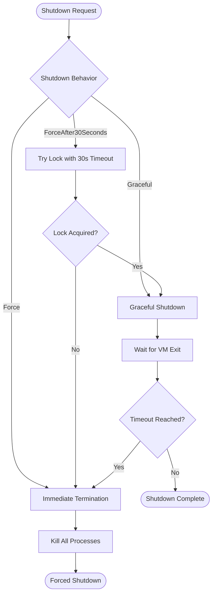

**Diagram sources**
- [LxssUserSession.cpp](file://src/windows/service/exe/LxssUserSession.cpp#L2086-L2125)

#### Common Shutdown Issues

| Issue | Cause | Resolution |
|-------|-------|------------|
| Hanging Shutdown | Long-running processes | Use `--shutdown --force` |
| Timeout Errors | Network delays | Increase timeout values |
| Partial Cleanup | Resource locks | Check for hung processes |

**Section sources**
- [LxssUserSession.cpp](file://src/windows/service/exe/LxssUserSession.cpp#L2086-L2125)

## Practical Examples

### Normal VM Lifecycle Example

```cpp
// VM Creation Example
auto userToken = GetCurrentProcessToken();
wsl::core::Config vmConfig;
vmConfig.MemorySize = 4096; // 4GB RAM
vmConfig.ProcessorCount = 2;

auto vm = WslCoreVm::Create(userToken, std::move(vmConfig), vmGuid);
if (vm) {
    // VM ready for use
    auto instance = vm->CreateInstance(instanceGuid, distroConfig);
    // Use the instance...
}
```

### Graceful Shutdown Example

```cpp
// Graceful shutdown with timeout
auto vm = WslCoreVm::Open(vmGuid);
if (vm) {
    // Register termination callback
    vm->RegisterCallbacks({}, [](GUID runtimeId) {
        // VM terminated
        Log("VM terminated: " + GuidToString(runtimeId));
    });
    
    // Initiate graceful shutdown
    // VM will automatically terminate after timeout
}
```

### Lifetime Management Example

```cpp
// Client registration for cleanup
LifetimeManager lifetimeMgr;
auto clientKey = lifetimeMgr.GetRegistrationId();

lifetimeMgr.RegisterCallback(
    clientKey,
    []() {
        // Cleanup function
        CleanupResources();
        return true; // Success
    },
    GetCurrentProcess(),
    30000 // 30 second timeout
);
```

### Telemetry Collection Example

```cpp
// Telemetry monitoring
auto telemetryLogger = GuestTelemetryLogger::Create(vmId, exitEvent);
auto pipeName = telemetryLogger->GetPipeName();

// Telemetry data flows through named pipe
// Process telemetry events in real-time
```

## Troubleshooting Guide

### Diagnostic Tools

#### collect-wsl-logs.ps1

The primary diagnostic tool for collecting comprehensive WSL logs:

```powershell
# Basic log collection
.\collect-wsl-logs.ps1

# Storage-specific profiling
.\collect-wsl-logs.ps1 -LogProfile storage

# HVSocket debugging
.\collect-wsl-logs.ps1 -LogProfile hvsocket
```

#### Time Travel Debugging

For advanced debugging scenarios:

1. **Enable WPR Profiling**: Use the PowerShell script to enable Windows Performance Recorder
2. **Reproduce Issue**: Perform actions that trigger the problem
3. **Collect Logs**: Stop profiling and extract logs
4. **Analyze ETL Files**: Use Windows Performance Analyzer for timeline analysis

#### Common Debugging Scenarios

| Scenario | Tool | Approach |
|----------|------|----------|
| VM Startup Issues | collect-wsl-logs.ps1 | Check HCS logs and crash dumps |
| Performance Problems | WPA (Windows Performance Analyzer) | Analyze ETL timeline |
| Network Connectivity | Network traces | Enable hvsocket profiling |
| Process Hangs | Process Explorer | Check for hung processes |

### Recovery Procedures

#### VM Recovery

1. **Automatic Recovery**: System attempts automatic recovery for transient failures
2. **Manual Recovery**: Use `wsl --shutdown` followed by restart
3. **Full Reset**: Remove corrupted VM state and recreate

#### Distribution Recovery

1. **Repair Distribution**: Use `wsl --unregister` followed by reinstall
2. **Backup Restoration**: Restore from backup if available
3. **Fresh Installation**: Clean installation as last resort

### Performance Optimization

#### Memory Management

- Monitor VM memory usage through telemetry
- Adjust memory allocation based on workload
- Enable memory reclaim for idle VMs

#### CPU Optimization

- Allocate appropriate processor count
- Monitor CPU utilization patterns
- Consider NUMA topology for multi-core systems

#### Storage Performance

- Use SSD storage for VM disks
- Enable VirtioFS for improved file system performance
- Monitor disk I/O patterns through telemetry

**Section sources**
- [collect-wsl-logs.ps1](file://diagnostics/collect-wsl-logs.ps1#L1-L172)

## Conclusion

WSL lifecycle management provides a robust framework for managing virtual machines and Linux distributions throughout their operational life. The system combines sophisticated state management, comprehensive telemetry, and flexible API interfaces to deliver reliable and performant containerized Linux environments on Windows.

Key strengths of the system include:

- **Robust State Management**: Well-defined state machines for VM and distribution lifecycle
- **Comprehensive Telemetry**: Multi-layered monitoring and reporting capabilities
- **Flexible API Design**: Extensible interfaces for programmatic control
- **Advanced Diagnostics**: Powerful debugging and troubleshooting tools
- **Graceful Error Handling**: Sophisticated error recovery and fallback mechanisms

The lifecycle management system continues to evolve with new features and improvements, maintaining backward compatibility while adding modern capabilities for enterprise and development scenarios.