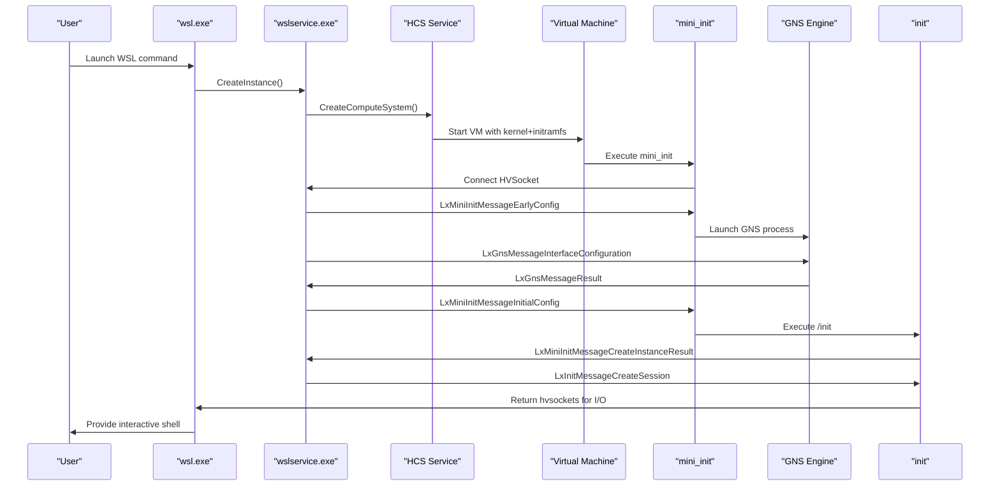
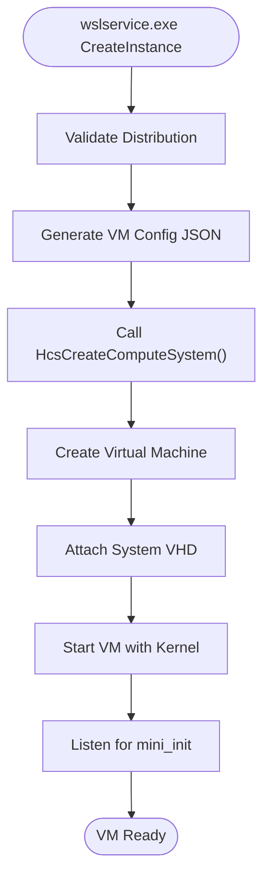
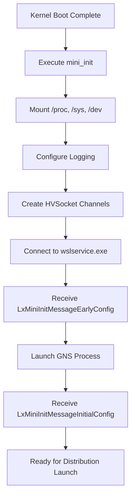
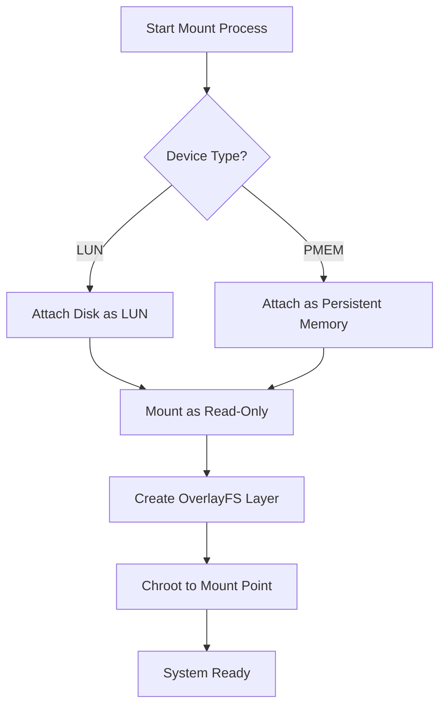
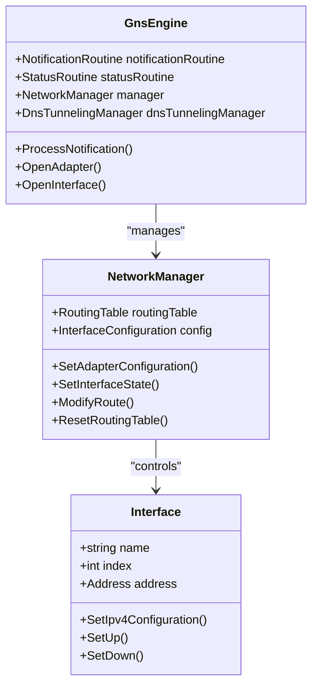
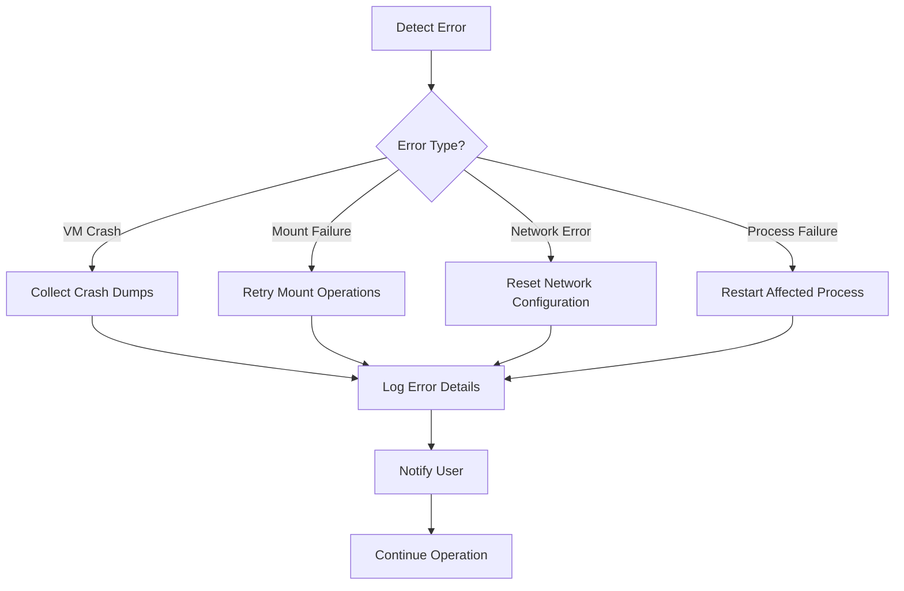
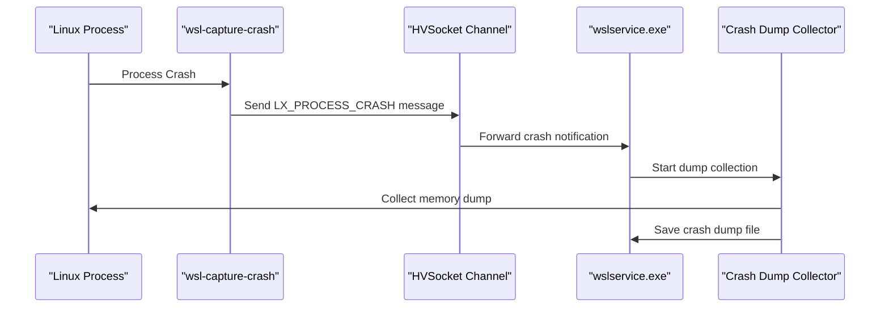

# WSL Boot Process Architecture

<cite>
**Referenced Files in This Document**
- [boot-process.md](file://doc/docs/technical-documentation/boot-process.md)
- [WslCoreVm.cpp](file://src/windows/service/exe/WslCoreVm.cpp)
- [lxinitshared.h](file://src/shared/inc/lxinitshared.h)
- [hcs.hpp](file://src/windows/common/hcs.hpp)
- [hcs_schema.h](file://src/windows/common/hcs_schema.h)
- [main.cpp](file://src/linux/init/main.cpp)
- [init.cpp](file://src/linux/init/init.cpp)
- [NetworkManager.cpp](file://src/linux/init/NetworkManager.cpp)
- [GnsEngine.cpp](file://src/linux/init/GnsEngine.cpp)
- [WslCoreConfig.cpp](file://src/windows/common/WslCoreConfig.cpp)
- [WslCoreVm.cpp](file://src/windows/service/exe/WslCoreVm.cpp)
- [Common.cpp](file://test/windows/Common.cpp)
- [init.cpp](file://src/linux/init/init.cpp)
</cite>

## Table of Contents
1. [Introduction](#introduction)
2. [System Overview](#system-overview)
3. [VM Creation and Initialization](#vm-creation-and-initialization)
4. [HCS Integration and Configuration](#hcs-integration-and-configuration)
5. [mini_init and Early Boot Process](#mini_init-and-early-boot-process)
6. [Message-Based Communication](#message-based-communication)
7. [System VHD Mounting and Distribution Loading](#system-vhd-mounting-and-distribution-loading)
8. [Networking Configuration](#networking-configuration)
9. [Failure Modes and Recovery](#failure-modes-and-recovery)
10. [Crash Dump Collection](#crash-dump-collection)
11. [Performance Considerations](#performance-considerations)
12. [Troubleshooting Guide](#troubleshooting-guide)

## Introduction

The Windows Subsystem for Linux (WSL) boot process represents a sophisticated multi-layered architecture that bridges Windows host systems with Linux virtual machines. This document provides comprehensive coverage of the complete boot sequence from user invocation via `wsl.exe` to the initialization of Linux distributions within the virtual machine environment.

The WSL boot process involves several critical components working in coordination: the Windows service layer (`wslservice.exe`), the Host Compute Service (HCS) for VM management, the Linux initramfs containing `mini_init`, and the guest-side initialization system. Understanding this architecture is essential for developers working with WSL internals, troubleshooting boot issues, or extending WSL functionality.

## System Overview

The WSL boot process follows a well-defined sequence that ensures reliable and efficient initialization of Linux environments within virtual machines. The architecture emphasizes modularity, fault tolerance, and performance optimization.

**Diagram sources**
- [boot-process.md](file://doc/docs/technical-documentation/boot-process.md#L10-L39)
- [WslCoreVm.cpp](file://src/windows/service/exe/WslCoreVm.cpp#L340-L366)

**Section sources**
- [boot-process.md](file://doc/docs/technical-documentation/boot-process.md#L1-L42)

## VM Creation and Initialization

The VM creation process begins when `wslservice.exe` receives a `CreateInstance()` call. This triggers the instantiation of a virtual machine through the Host Compute Service (HCS), which manages the lifecycle of WSL virtual machines.

### HCS Integration

The HCS service serves as the primary interface between Windows and the virtualization infrastructure. It handles VM creation, configuration, and lifecycle management through a standardized JSON schema.

**Diagram sources**
- [WslCoreVm.cpp](file://src/windows/service/exe/WslCoreVm.cpp#L340-L366)
- [hcs.hpp](file://src/windows/common/hcs.hpp#L52-L52)

### VM Configuration Schema

The VM configuration is defined through a comprehensive JSON schema that specifies hardware resources, device attachments, and boot parameters. This schema ensures consistent VM initialization across different WSL deployments.

**Section sources**
- [WslCoreVm.cpp](file://src/windows/service/exe/WslCoreVm.cpp#L1487-L1503)
- [hcs_schema.h](file://src/windows/common/hcs_schema.h#L464-L482)

## HCS Integration and Configuration

The Host Compute Service integration involves several critical steps that ensure proper VM initialization and resource allocation.

### JSON Configuration Generation

The VM configuration is constructed dynamically based on user settings and system capabilities. The configuration includes:

- **Memory Allocation**: Dynamic sizing with overcommit support
- **CPU Configuration**: Processor topology and feature detection
- **Storage Attachments**: System VHD, swap VHD, and kernel modules VHD
- **Network Configuration**: Adapter settings and DHCP parameters
- **GPU Support**: Graphics acceleration configuration

### Device Management

The system supports multiple device attachment types including virtual disks and pass-through devices. Storage devices are managed through logical unit numbers (LUNs) for efficient resource allocation.

**Section sources**
- [WslCoreVm.cpp](file://src/windows/service/exe/WslCoreVm.cpp#L463-L539)
- [hcs_schema.h](file://src/windows/common/hcs_schema.h#L62-L73)

## mini_init and Early Boot Process

The `mini_init` process serves as the first user-space executable within the WSL virtual machine, responsible for early system initialization and establishing communication channels with the Windows host.

### Initialization Sequence

**Diagram sources**
- [main.cpp](file://src/linux/init/main.cpp#L4090-L4135)
- [boot-process.md](file://doc/docs/technical-documentation/boot-process.md#L75-L87)

### Capabilities Exchange

During initialization, `mini_init` establishes communication capabilities with the Windows service, including supported message types and feature flags. This exchange ensures compatibility between host and guest components.

**Section sources**
- [main.cpp](file://src/linux/init/main.cpp#L4090-L4135)
- [lxinitshared.h](file://src/shared/inc/lxinitshared.h#L366-L457)

## Message-Based Communication

The WSL boot process relies heavily on message-based communication between Windows and Linux components, facilitated through HVSocket connections.

### LxMiniInitMessage Types

The communication protocol defines several message types for different phases of the boot process:

| Message Type | Purpose | Direction |
|--------------|---------|-----------|
| `LxMiniInitMessageEarlyConfig` | Initial system configuration | Windows → Linux |
| `LxMiniInitMessageInitialConfig` | Final configuration and entropy | Windows → Linux |
| `LxMiniInitMessageLaunchInit` | Launch distribution init | Windows → Linux |
| `LxMiniInitMessageCreateInstanceResult` | Report instance creation status | Linux → Windows |

### Communication Channels

Two primary HVSocket channels facilitate bidirectional communication:

1. **Init Channel**: Used for service-to-guest messages and process control
2. **Notification Channel**: Used for guest-to-service notifications and process exit events

**Section sources**
- [lxinitshared.h](file://src/shared/inc/lxinitshared.h#L278-L362)
- [main.cpp](file://src/linux/init/main.cpp#L4098-L4115)

## System VHD Mounting and Distribution Loading

The system VHD mounting process involves several stages of device attachment, filesystem mounting, and overlay configuration.

### Device Attachment Process

**Diagram sources**
- [WslCoreVm.cpp](file://src/windows/service/exe/WslCoreVm.cpp#L464-L477)
- [main.cpp](file://src/linux/init/main.cpp#L2222-L2251)

### OverlayFS Configuration

The system employs OverlayFS to provide a writable layer on top of the read-only system VHD, enabling dynamic modifications while preserving the base filesystem integrity.

**Section sources**
- [WslCoreVm.cpp](file://src/windows/service/exe/WslCoreVm.cpp#L464-L539)
- [main.cpp](file://src/linux/init/main.cpp#L2222-L2251)

## Networking Configuration

The networking subsystem in WSL operates through the Guest Network Service (GNS), which manages network adapters, IP configuration, and routing tables.

### GNS Architecture

**Diagram sources**
- [GnsEngine.cpp](file://src/linux/init/GnsEngine.cpp#L27-L34)
- [NetworkManager.cpp](file://src/linux/init/NetworkManager.cpp#L57-L60)

### Network Configuration Flow

The networking configuration process involves several coordinated steps:

1. **Adapter Discovery**: Identification of virtual network adapters
2. **IP Configuration**: Assignment of IP addresses and routing information
3. **DNS Setup**: Configuration of DNS servers and resolution settings
4. **Routing Table**: Establishment of network routing policies

**Section sources**
- [GnsEngine.cpp](file://src/linux/init/GnsEngine.cpp#L1-L200)
- [NetworkManager.cpp](file://src/linux/init/NetworkManager.cpp#L1-L200)

## Failure Modes and Recovery

The WSL boot process implements comprehensive failure detection and recovery mechanisms to ensure system reliability.

### Safe Mode Operation

When the `EnableSafeMode` flag is activated, WSL operates in a reduced-functionality mode that disables non-essential features for troubleshooting purposes. This mode provides diagnostic information while maintaining basic system functionality.

### Error Detection Mechanisms

The system monitors several failure indicators:

- **VM Exit Codes**: Non-zero exit codes from critical processes
- **Communication Timeouts**: Loss of HVSocket connectivity
- **Filesystem Errors**: Mount failures and permission issues
- **Network Connectivity**: Adapter and routing failures

### Recovery Strategies

**Diagram sources**
- [WslCoreVm.cpp](file://src/windows/service/exe/WslCoreVm.cpp#L145-L162)
- [Common.cpp](file://test/windows/Common.cpp#L676-L820)

**Section sources**
- [WslCoreVm.cpp](file://src/windows/service/exe/WslCoreVm.cpp#L145-L162)
- [Common.cpp](file://test/windows/Common.cpp#L676-L820)

## Crash Dump Collection

The crash dump collection system provides comprehensive debugging information when WSL components encounter fatal errors.

### Collection Architecture

**Diagram sources**
- [WslCoreVm.cpp](file://src/windows/service/exe/WslCoreVm.cpp#L1177-L1230)
- [init.cpp](file://src/linux/init/init.cpp#L402-L449)

### Dump Management

The system maintains a configurable limit on crash dump files to prevent storage exhaustion. Old dumps are automatically cleaned up based on filename patterns and file attributes.

**Section sources**
- [WslCoreVm.cpp](file://src/windows/service/exe/WslCoreVm.cpp#L1177-L1230)
- [init.cpp](file://src/linux/init/init.cpp#L402-L449)

## Performance Considerations

Several factors influence WSL boot performance and overall system responsiveness:

### Memory Management

- **Deferred Commit**: Allows VM to allocate more memory than physically available
- **Cold Discard Hints**: Enables efficient memory reclamation
- **Page Reporting**: Optimizes memory usage tracking

### Storage Optimization

- **VHD Compression**: Reduces storage requirements for system images
- **Sparse Files**: Minimizes allocated space for unused portions
- **OverlayFS**: Provides efficient writable layer management

### Network Performance

- **Virtio Networking**: High-performance virtualized networking
- **DNS Tunneling**: Optimized DNS resolution for guest applications
- **Port Forwarding**: Efficient TCP/UDP port redirection

## Troubleshooting Guide

Common boot issues and their resolution strategies:

### VM Creation Failures

**Symptoms**: VM fails to start or crashes immediately
**Causes**: Insufficient resources, corrupted VHD, HCS service issues
**Resolution**: Check system resources, verify VHD integrity, restart HCS service

### Communication Timeouts

**Symptoms**: `mini_init` fails to connect to Windows service
**Causes**: HVSocket configuration issues, firewall blocking
**Resolution**: Verify HVSocket permissions, check firewall settings

### Distribution Launch Issues

**Symptoms**: Cannot start Linux distributions after VM boot
**Causes**: System VHD corruption, overlayFS mounting failure
**Resolution**: Repair system VHD, recreate overlay layers

### Networking Problems

**Symptoms**: No internet connectivity or slow network performance
**Causes**: GNS configuration errors, DNS resolution failures
**Resolution**: Reset network configuration, verify DNS settings

**Section sources**
- [WslCoreVm.cpp](file://src/windows/service/exe/WslCoreVm.cpp#L145-L162)
- [Common.cpp](file://test/windows/Common.cpp#L676-L820)