# Distribution Startup

<cite>
**Referenced Files in This Document**
- [main.cpp](file://src/linux/init/main.cpp)
- [init.cpp](file://src/linux/init/init.cpp)
- [WslDistributionConfig.cpp](file://src/linux/init/WslDistributionConfig.cpp)
- [WslDistributionConfig.h](file://src/linux/init/WslDistributionConfig.h)
- [config.cpp](file://src/linux/init/config.cpp)
- [wslpath.cpp](file://src/linux/init/wslpath.cpp)
- [wslpath.h](file://src/linux/init/wslpath.h)
- [lxinitshared.h](file://src/shared/inc/lxinitshared.h)
- [WslCoreVm.cpp](file://src/windows/service/exe/WslCoreVm.cpp)
- [mountutil.cpp](file://src/linux/mountutil/mountutil.cpp)
- [mountutil.h](file://src/linux/mountutil/mountutil.h)
</cite>

## Table of Contents
1. [Introduction](#introduction)
2. [Architecture Overview](#architecture-overview)
3. [Mini_Init Message Processing](#mini_init-message-processing)
4. [Filesystem Mount Operations](#filesystem-mount-operations)
5. [Chroot and Init Execution](#chroot-and-init-execution)
6. [Configuration Management](#configuration-management)
7. [Session Leadership Establishment](#session-leadership-establishment)
8. [Error Handling and Recovery](#error-handling-and-recovery)
9. [Common Startup Failures](#common-startup-failures)
10. [Debugging Approaches](#debugging-approaches)

## Introduction

The WSL distribution startup process is a sophisticated multi-stage initialization system that transforms a raw Linux Virtual Hard Disk (VHD) into a fully functional Linux distribution. This process involves several critical phases: receiving and processing the LxMiniInitMessageLaunchInit message, mounting the distribution filesystem, configuring the environment, establishing session leadership, and handing off control to the distribution's init system.

The startup process is orchestrated by mini_init, a specialized initialization daemon that handles the complex task of preparing the Linux environment within the WSL virtual machine. This document provides comprehensive coverage of each phase, including error handling mechanisms and common failure scenarios.

## Architecture Overview

The distribution startup follows a layered architecture with distinct responsibilities at each stage:

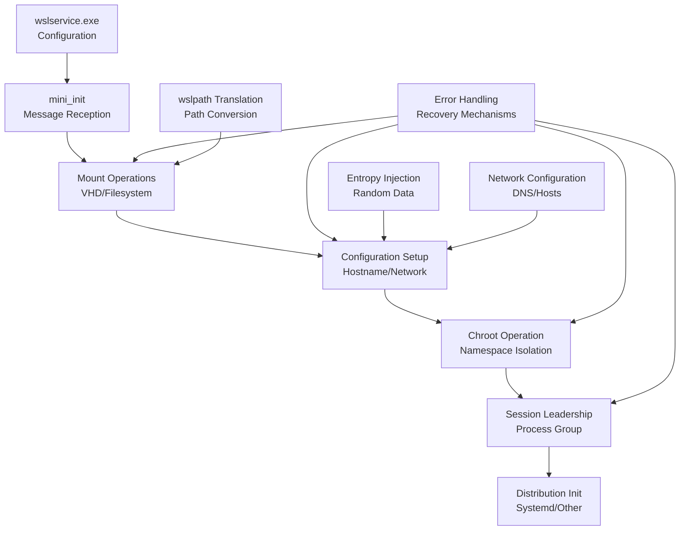

**Diagram sources**
- [main.cpp](file://src/linux/init/main.cpp#L2480-L2620)
- [init.cpp](file://src/linux/init/init.cpp#L1090-L3095)

The architecture ensures proper isolation, security, and functionality through careful orchestration of mount operations, namespace creation, and process initialization.

**Section sources**
- [main.cpp](file://src/linux/init/main.cpp#L2480-L2620)
- [init.cpp](file://src/linux/init/init.cpp#L1090-L3095)

## Mini_Init Message Processing

The startup process begins when mini_init receives the LxMiniInitMessageLaunchInit message from wslservice.exe. This message contains essential configuration data and parameters required for the distribution initialization.

### Message Structure and Content

The LxMiniInitMessageLaunchInit structure encapsulates all necessary information for distribution startup:

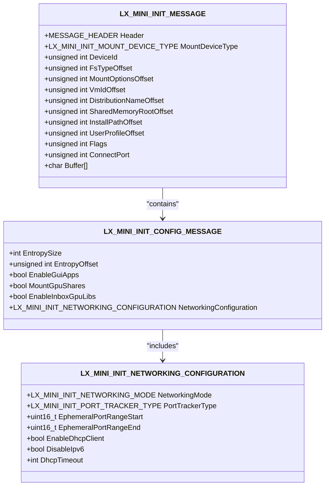

**Diagram sources**
- [lxinitshared.h](file://src/shared/inc/lxinitshared.h#L1131-L1162)
- [lxinitshared.h](file://src/shared/inc/lxinitshared.h#L1243-L1268)

### Message Processing Workflow

The ProcessLaunchInitMessage function orchestrates the message handling and subsequent initialization steps:

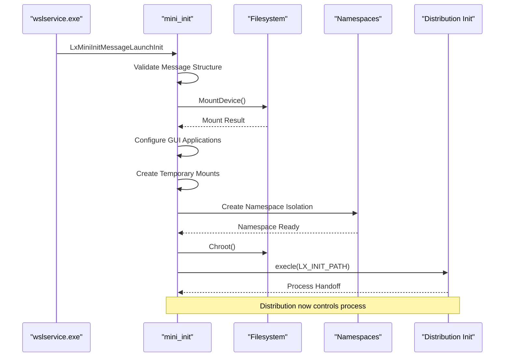

**Diagram sources**
- [main.cpp](file://src/linux/init/main.cpp#L2480-L2620)

**Section sources**
- [main.cpp](file://src/linux/init/main.cpp#L2480-L2620)
- [lxinitshared.h](file://src/shared/inc/lxinitshared.h#L1131-L1162)

## Filesystem Mount Operations

The filesystem mount operations represent the critical foundation of the distribution startup process. This phase involves mounting the distribution VHD, setting up temporary filesystem overlays, and establishing the necessary mount points.

### Primary Mount Operations

The system performs several key mount operations during startup:

1. **Distribution VHD Mount**: The primary Linux filesystem is mounted from the VHD
2. **Temporary Overlay Creation**: Read-write layers are created for mutable filesystem operations
3. **Cross-Distro Sharing**: Mount points for inter-distribution communication
4. **GPU Share Mounts**: Specialized mounts for graphics acceleration support

### Mount Hierarchy Setup

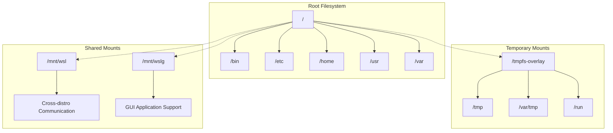

**Diagram sources**
- [main.cpp](file://src/linux/init/main.cpp#L1796-L1822)
- [main.cpp](file://src/linux/init/main.cpp#L1902-L1912)

### Error Handling During Mount Operations

The mount process includes robust error handling for various failure scenarios:

| Error Condition | Recovery Action | Impact |
|----------------|-----------------|---------|
| Read-only VHD | Automatic tmpfs overlay creation | Limited write capability |
| Full filesystem | Emergency tmpfs mount | Reduced performance |
| Missing mount points | Automatic directory creation | Standard operation resumed |
| Permission denied | Alternative mount locations | Functionality preserved |

**Section sources**
- [main.cpp](file://src/linux/init/main.cpp#L1796-L1822)
- [main.cpp](file://src/linux/init/main.cpp#L1902-L1912)

## Chroot and Init Execution

The chroot operation establishes the final filesystem isolation boundary, transitioning from the mini_init environment to the distribution's root filesystem. This phase culminates in the execution of the distribution's init system.

### Chroot Process Implementation

The chroot operation involves several critical steps:

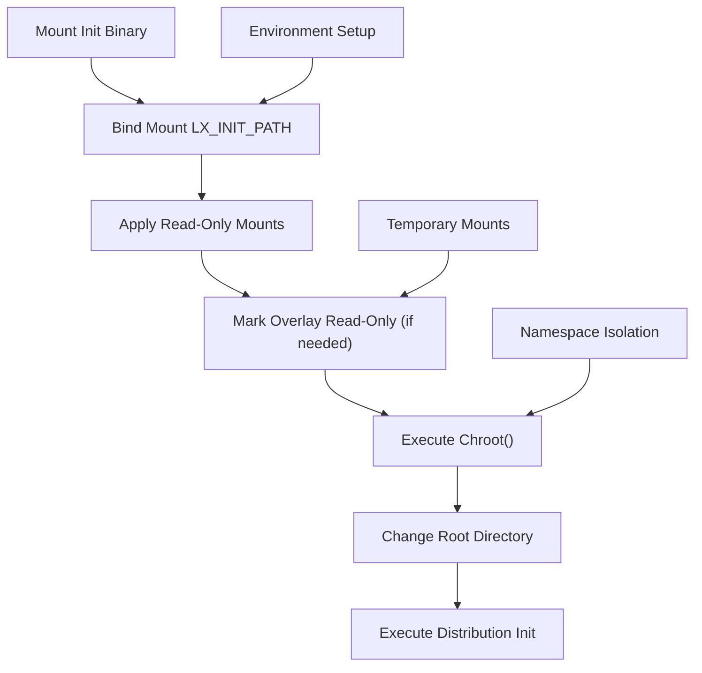

**Diagram sources**
- [main.cpp](file://src/linux/init/main.cpp#L1914-L1936)

### Environment Variable Configuration

During the chroot process, mini_init sets up essential environment variables for the distribution:

| Environment Variable | Purpose | Example Value |
|---------------------|---------|---------------|
| `LX_WSL_PID_ENV` | Process identification | `/proc/1234` |
| `LX_WSL2_VM_ID_ENV` | VM identification | `{uuid}` |
| `LX_WSL2_DISTRO_NAME_ENV` | Distribution name | `Ubuntu` |
| `LX_WSL2_SHARED_MEMORY_OB_DIRECTORY` | Memory sharing | `\Device\HarddiskVolume1` |
| `LX_WSL2_INSTALL_PATH` | Installation location | `C:\Users\User\.wsl` |
| `LX_WSL2_USER_PROFILE` | User profile path | `C:\Users\User` |

### Init System Handoff

The LaunchInit function handles the transition to the distribution's init system:

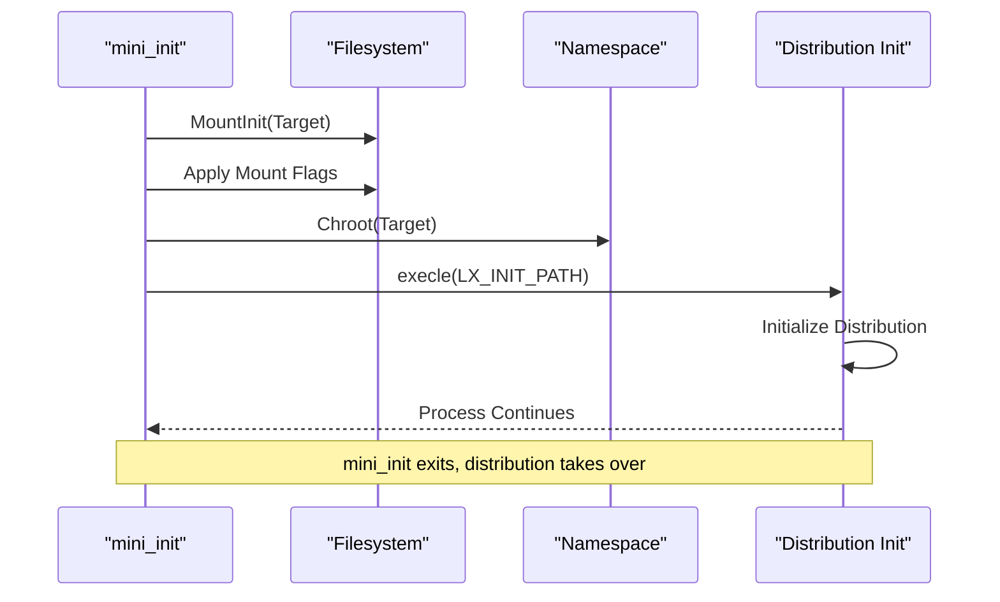

**Diagram sources**
- [main.cpp](file://src/linux/init/main.cpp#L1697-L1942)

**Section sources**
- [main.cpp](file://src/linux/init/main.cpp#L1697-L1942)

## Configuration Management

The configuration management system handles the setup of hostname, networking, entropy injection, and other critical system parameters received from wslservice.exe.

### Hostname Configuration

The system applies hostname configuration through multiple channels:

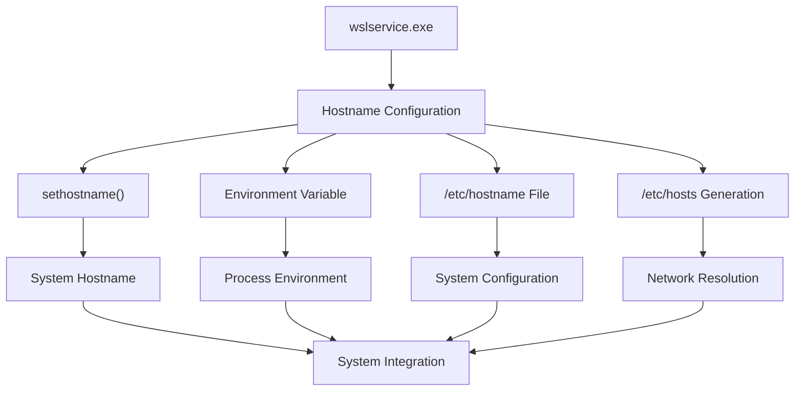

**Diagram sources**
- [config.cpp](file://src/linux/init/config.cpp#L734-L777)

### Network Configuration

Network configuration encompasses DNS resolution, hostname resolution, and network interface setup:

| Configuration Element | Source | Purpose |
|----------------------|--------|---------|
| `/etc/resolv.conf` | wslservice.exe | DNS server configuration |
| `/etc/hosts` | Generated | Local hostname resolution |
| Hostname | wslservice.exe | System identity |
| Domain name | wslservice.exe | Network domain |

### Entropy Injection

The entropy injection mechanism provides cryptographic randomness to the distribution:

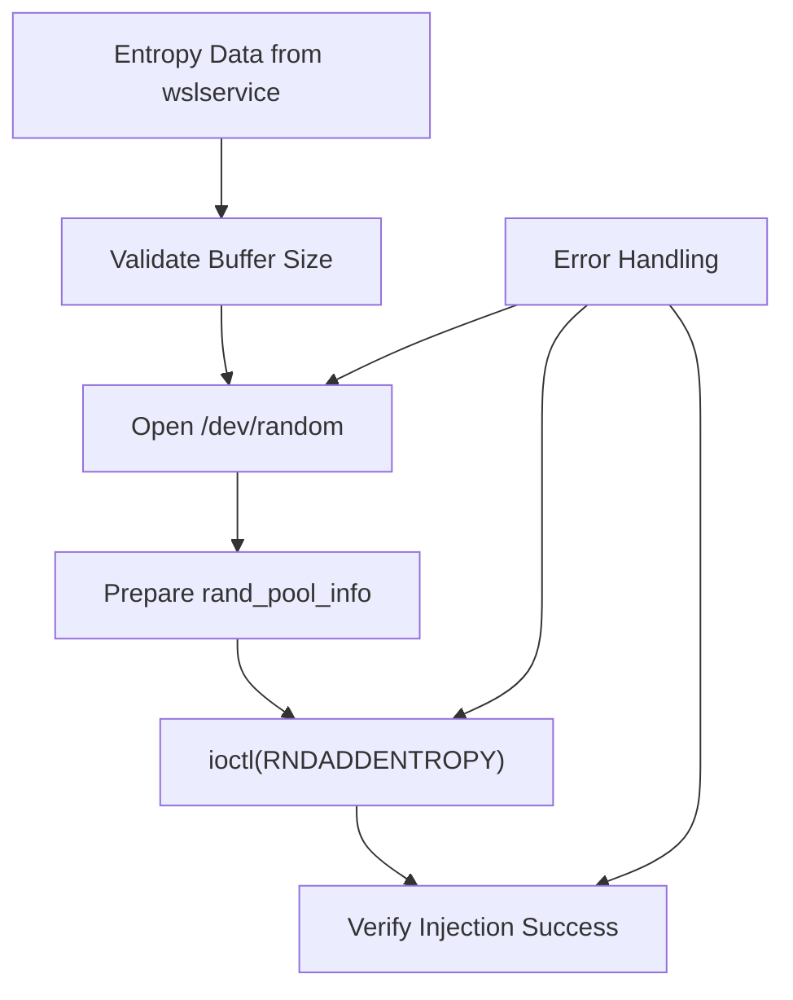

**Diagram sources**
- [main.cpp](file://src/linux/init/main.cpp#L1659-L1696)

**Section sources**
- [config.cpp](file://src/linux/init/config.cpp#L734-L850)
- [main.cpp](file://src/linux/init/main.cpp#L1659-L1696)

## Session Leadership Establishment

Session leadership establishes the process group structure and terminal control for user interaction. This phase creates the foundation for interactive shell sessions and process management.

### Session Leader Creation

The session leader process manages terminal I/O and process groups:

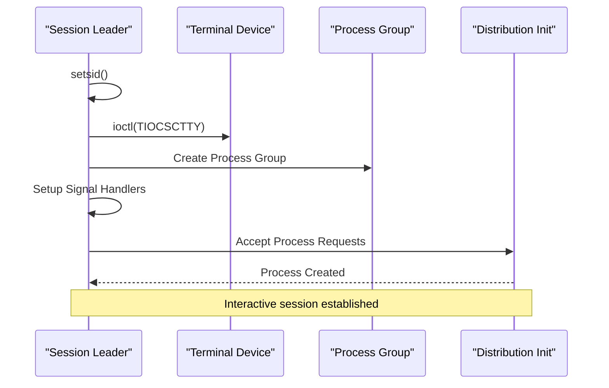

**Diagram sources**
- [init.cpp](file://src/linux/init/init.cpp#L3038-L3095)

### Process Group Management

The session leader maintains process group relationships for proper job control:

| Process Group Operation | Purpose | Implementation |
|------------------------|---------|----------------|
| `setsid()` | Create new session | Establishes session leader |
| `setpgid()` | Assign process group | Manages foreground/background |
| `tcsetpgrp()` | Control terminal | Enables interactive I/O |
| Signal handling | Reap children | Maintains process tree |

### Terminal Control Setup

Terminal control ensures proper I/O redirection and signal handling:

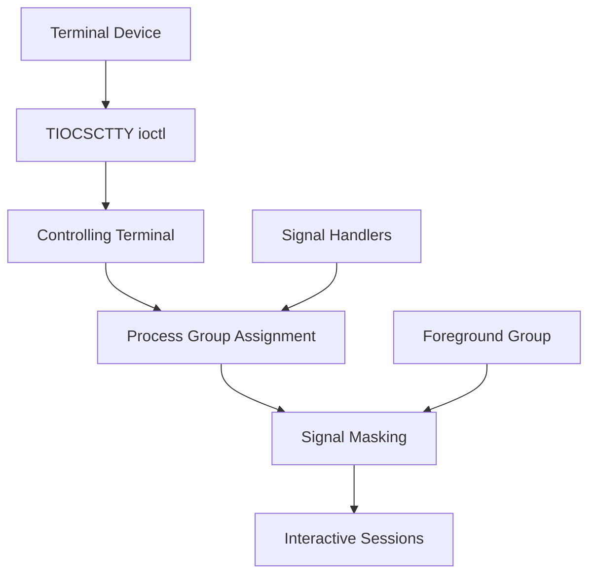

**Diagram sources**
- [init.cpp](file://src/linux/init/init.cpp#L2806-L2920)

**Section sources**
- [init.cpp](file://src/linux/init/init.cpp#L3038-L3095)
- [init.cpp](file://src/linux/init/init.cpp#L2806-L2920)

## Error Handling and Recovery

The startup process implements comprehensive error handling and recovery mechanisms to ensure robust operation under various failure conditions.

### Mount Operation Error Recovery

The mount operation includes sophisticated error recovery:

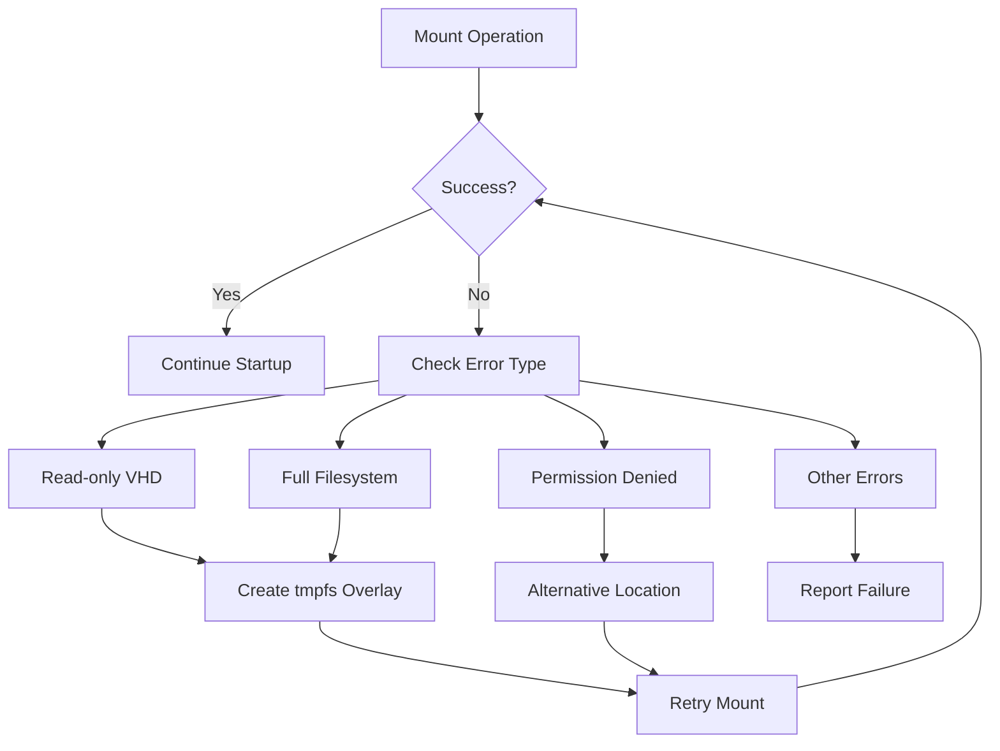

**Diagram sources**
- [main.cpp](file://src/linux/init/main.cpp#L1796-L1822)

### Configuration Error Handling

Configuration errors are handled gracefully with fallback mechanisms:

| Error Type | Detection Method | Recovery Action |
|-----------|------------------|-----------------|
| Invalid hostname | Validation checks | Use default hostname |
| Missing configuration files | File existence checks | Generate defaults |
| Network configuration errors | Connectivity tests | Disable affected features |
| Entropy injection failures | ioctl result checks | Continue without entropy |

### Process Termination Handling

The system implements proper cleanup and termination procedures:

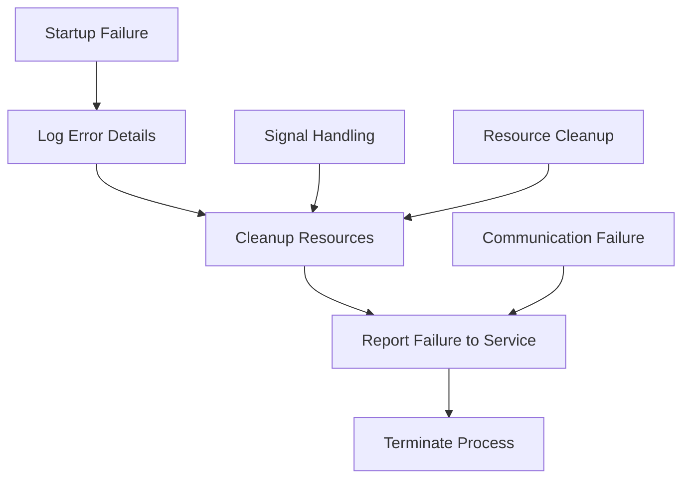

**Section sources**
- [main.cpp](file://src/linux/init/main.cpp#L1796-L1822)
- [main.cpp](file://src/linux/init/main.cpp#L2493-L2503)

## Common Startup Failures

Understanding common failure modes helps in diagnosing and resolving startup issues effectively.

### Mount-Related Failures

| Failure Symptom | Cause | Solution |
|----------------|-------|----------|
| "Mount failed: No such file or directory" | Missing VHD file | Verify VHD path and permissions |
| "Mount failed: Read-only filesystem" | Corrupted VHD | Run fsck or restore from backup |
| "Mount failed: No space left on device" | Full filesystem | Clean up unused files |
| "Permission denied" | Insufficient privileges | Check file permissions |

### Configuration-Related Failures

Common configuration issues and their resolutions:

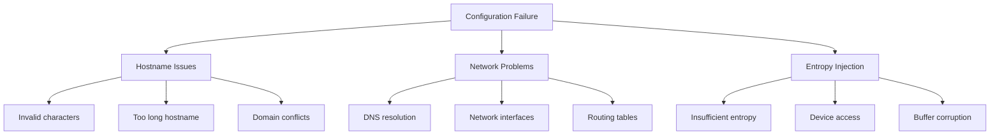

### Process Initialization Failures

Process-related failures during startup:

| Failure Point | Common Causes | Diagnostic Steps |
|--------------|---------------|------------------|
| Chroot operation | Missing directories | Check filesystem integrity |
| Init execution | Corrupted init binary | Verify file checksums |
| Environment setup | Invalid variables | Review environment configuration |
| Namespace creation | Insufficient privileges | Check capability assignments |

**Section sources**
- [main.cpp](file://src/linux/init/main.cpp#L1796-L1822)

## Debugging Approaches

Effective debugging requires understanding the startup sequence and utilizing appropriate diagnostic tools.

### Log Analysis

Key log locations and analysis techniques:

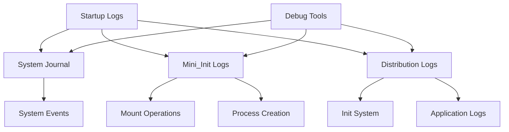

### Diagnostic Commands

Essential commands for diagnosing startup issues:

| Command Category | Specific Commands | Purpose |
|-----------------|-------------------|---------|
| Filesystem | `mount`, `df -h`, `lsblk` | Verify mount points |
| Processes | `ps aux`, `pstree`, `strace` | Monitor process creation |
| Namespaces | `lsns`, `unshare`, `nsenter` | Check namespace isolation |
| Networking | `ip addr`, `route`, `dig` | Validate network configuration |

### Common Debugging Scenarios

Typical debugging approaches for different failure modes:

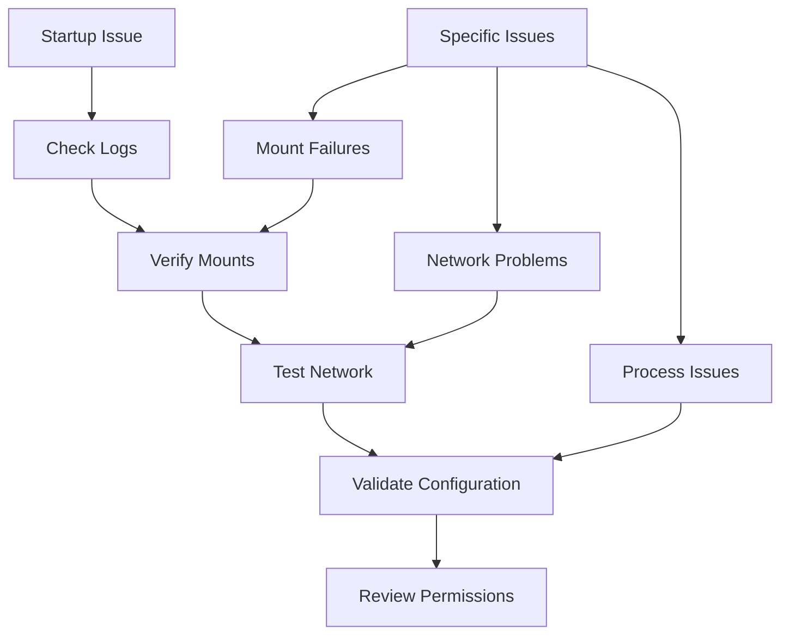

### Performance Monitoring

Monitoring startup performance helps identify bottlenecks:

| Metric | Measurement Tool | Threshold |
|--------|------------------|-----------|
| Mount time | Timing wrapper | < 30 seconds |
| Network setup | Connectivity tests | < 5 seconds |
| Init startup | Process timing | < 60 seconds |
| Total startup | Service logs | < 2 minutes |

This comprehensive documentation provides a detailed understanding of the WSL distribution startup process, enabling effective troubleshooting and optimization of the initialization workflow.