# VM Initialization

<cite>
**Referenced Files in This Document**
- [wslservice.exe.md](file://doc/docs/technical-documentation/wslservice.exe.md)
- [boot-process.md](file://doc/docs/technical-documentation/boot-process.md)
- [mini_init.md](file://doc/docs/technical-documentation/mini_init.md)
- [hcs.hpp](file://src/windows/common/hcs.hpp)
- [hcs.cpp](file://src/windows/common/hcs.cpp)
- [hcs_schema.h](file://src/windows/common/hcs_schema.h)
- [WslCoreVm.cpp](file://src/windows/service/exe/WslCoreVm.cpp)
- [WslCoreConfig.h](file://src/windows/common/WslCoreConfig.h)
- [WslCoreConfig.cpp](file://src/windows/common/WslCoreConfig.cpp)
- [main.cpp](file://src/linux/init/main.cpp)
- [WslSecurity.h](file://src/windows/common/WslSecurity.h)
- [WslSecurity.cpp](file://src/windows/common/WslSecurity.cpp)
- [LxssSecurity.h](file://src/windows/service/exe/LxssSecurity.h)
- [LxssSecurity.cpp](file://src/windows/service/exe/LxssSecurity.cpp)
- [LxssUserSession.cpp](file://src/windows/service/exe/LxssUserSession.cpp)
- [NetworkManager.cpp](file://src/linux/init/NetworkManager.cpp)
- [drvfs.cpp](file://src/linux/init/drvfs.cpp)
- [DeviceHostProxy.cpp](file://src/windows/service/exe/DeviceHostProxy.cpp)
</cite>

## Table of Contents
1. [Introduction](#introduction)
2. [System Architecture Overview](#system-architecture-overview)
3. [VM Creation Process](#vm-creation-process)
4. [HCS Integration and Lifecycle Management](#hcs-integration-and-lifecycle-management)
5. [VM Configuration and Resource Allocation](#vm-configuration-and-resource-allocation)
6. [Kernel and Initramfs Loading](#kernel-and-initramfs-loading)
7. [Security Context and Token Management](#security-context-and-token-management)
8. [VM State Transitions and Monitoring](#vm-state-transitions-and-monitoring)
9. [Failure Handling and Recovery Mechanisms](#failure-handling-and-recovery-mechanisms)
10. [Safe Mode Configuration](#safe-mode-configuration)
11. [Networking and Device Management](#networking-and-device-management)
12. [Performance Considerations](#performance-considerations)
13. [Troubleshooting Guide](#troubleshooting-guide)
14. [Conclusion](#conclusion)

## Introduction

The Windows Subsystem for Linux 2 (WSL2) VM initialization process represents a sophisticated orchestration of Windows and Linux components to create a secure, efficient virtualized environment. This document provides comprehensive coverage of how wslservice.exe creates and manages virtual machines through the Host Compute Service (HCS) API, including the construction of VM configuration schemas, kernel loading mechanisms, and the execution of mini_init from the initramfs.

The VM initialization process involves multiple phases: VM creation through HCS, kernel and initramfs loading, security context establishment, resource allocation, and the handoff to the Linux userland through mini_init. Each phase incorporates robust error handling, recovery mechanisms, and integration with Windows security policies.

## System Architecture Overview

The WSL2 VM initialization system follows a layered architecture that separates concerns between Windows host management and Linux guest execution:

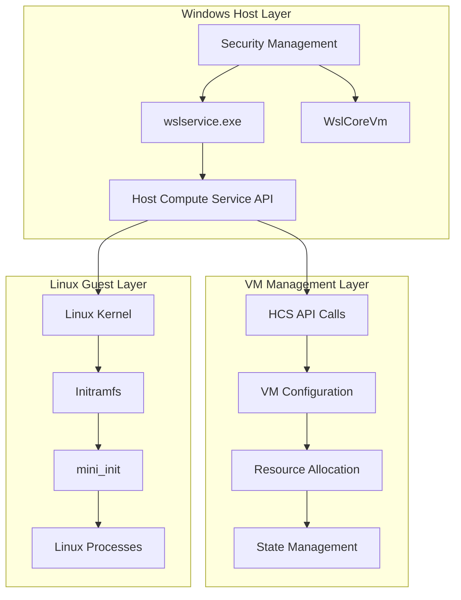
```mermaid
graph TB
subgraph "Windows Host Layer"
WSLS[wslservice.exe]
HCS[Host Compute Service API]
WSC[WslCoreVm]
SEC[Security Management]
end
subgraph "VM Management Layer"
HCS_API[HCS API Calls]
CONFIG[VM Configuration]
RESOURCES[Resource Allocation]
STATE[State Management]
end
subgraph "Linux Guest Layer"
KERNEL[Linux Kernel]
INITRAMFS[Initramfs]
MINI_INIT[mini_init]
GUEST[Linux Processes]
end
WSLS --> HCS
HCS --> HCS_API
HCS_API --> CONFIG
CONFIG --> RESOURCES
RESOURCES --> STATE
HCS --> KERNEL
KERNEL --> INITRAMFS
INITRAMFS --> MINI_INIT
MINI_INIT --> GUEST
SEC --> WSLS
SEC --> WSC
```

**Diagram sources**
- [wslservice.exe.md](file://doc/docs/technical-documentation/wslservice.exe.md#L1-L33)
- [WslCoreVm.cpp](file://src/windows/service/exe/WslCoreVm.cpp#L1-L50)
- [hcs.hpp](file://src/windows/common/hcs.hpp#L71-L85)

The architecture demonstrates clear separation between Windows management components and Linux guest execution, with HCS serving as the central orchestrator for VM lifecycle management.

**Section sources**
- [wslservice.exe.md](file://doc/docs/technical-documentation/wslservice.exe.md#L1-L33)
- [boot-process.md](file://doc/docs/technical-documentation/boot-process.md#L55-L87)

## VM Creation Process

The VM creation process begins when wslservice.exe receives a request to launch a WSL distribution. The process involves several critical steps:

### Phase 1: VM Initialization and Configuration Generation

The WslCoreVm class serves as the primary controller for VM lifecycle management. During initialization, the system establishes security contexts, validates user tokens, and prepares the VM configuration:

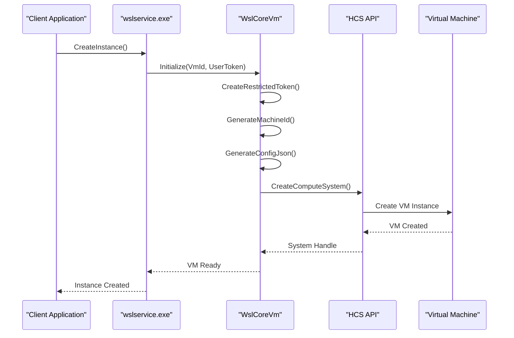
```mermaid
sequenceDiagram
participant Client as "Client Application"
participant WSLS as "wslservice.exe"
participant WSC as "WslCoreVm"
participant HCS as "HCS API"
participant VM as "Virtual Machine"
Client->>WSLS : CreateInstance()
WSLS->>WSC : Initialize(VmId, UserToken)
WSC->>WSC : CreateRestrictedToken()
WSC->>WSC : GenerateMachineId()
WSC->>WSC : GenerateConfigJson()
WSC->>HCS : CreateComputeSystem()
HCS->>VM : Create VM Instance
VM-->>HCS : VM Created
HCS-->>WSC : System Handle
WSC-->>WSLS : VM Ready
WSLS-->>Client : Instance Created
```

**Diagram sources**
- [WslCoreVm.cpp](file://src/windows/service/exe/WslCoreVm.cpp#L168-L194)
- [hcs.cpp](file://src/windows/common/hcs.cpp#L79-L96)

### Phase 2: HCS System Creation

The HCS API handles the actual VM instantiation using a JSON configuration schema. The system generates a comprehensive configuration that defines VM topology, device assignments, and security settings.

**Section sources**
- [WslCoreVm.cpp](file://src/windows/service/exe/WslCoreVm.cpp#L168-L194)
- [hcs.cpp](file://src/windows/common/hcs.cpp#L79-L96)

## HCS Integration and Lifecycle Management

The Host Compute Service (HCS) API provides the foundation for VM lifecycle management in WSL2. The integration encompasses several key operations:

### HCS API Operations

The HCS API exposes several critical functions for VM management:

| Operation | Purpose | Error Handling |
|-----------|---------|----------------|
| `CreateComputeSystem` | Initialize VM instance | Validates JSON schema, handles resource conflicts |
| `StartComputeSystem` | Boot VM with configuration | Monitors boot timeout, handles kernel panics |
| `TerminateComputeSystem` | Graceful VM shutdown | Implements timeout-based termination |
| `OpenComputeSystem` | Access existing VM | Validates permissions and access rights |

### VM Lifecycle States

The VM lifecycle progresses through distinct states with corresponding state transitions:

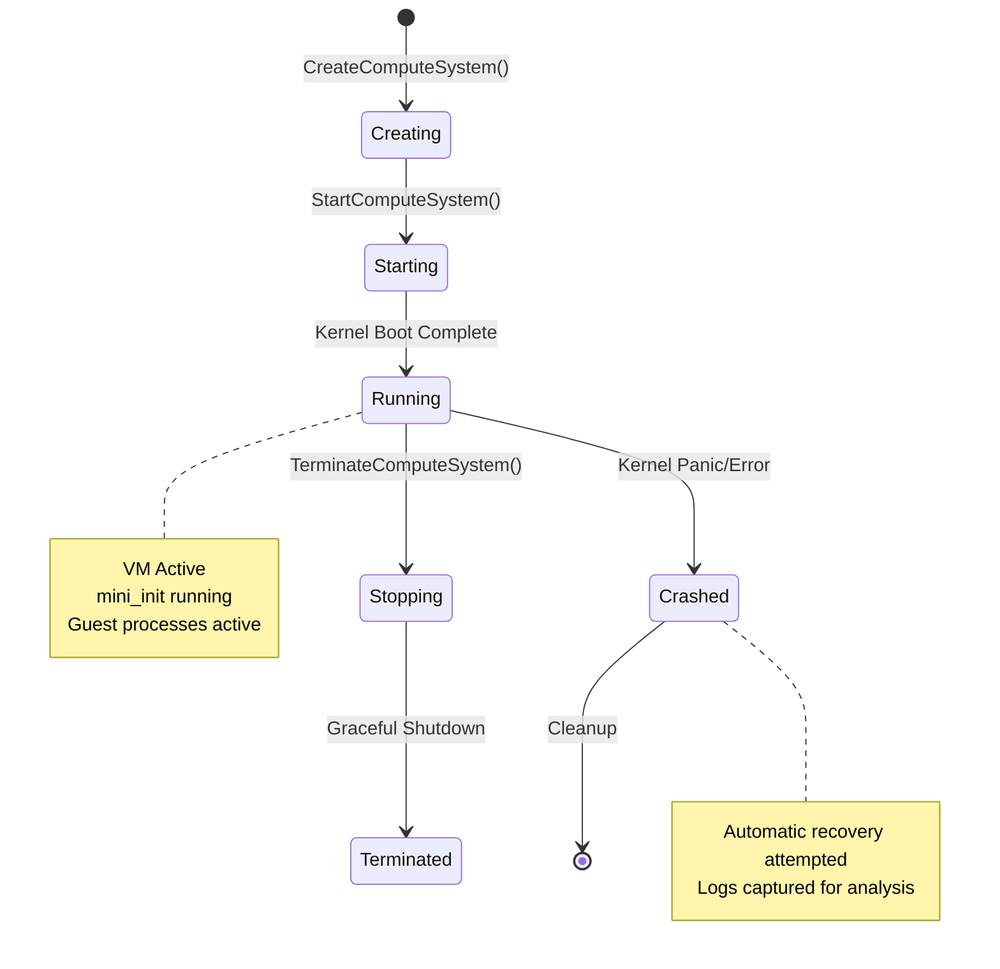
```mermaid
stateDiagram-v2
[*] --> Creating : CreateComputeSystem()
Creating --> Starting : StartComputeSystem()
Starting --> Running : Kernel Boot Complete
Running --> Stopping : TerminateComputeSystem()
Stopping --> Terminated : Graceful Shutdown
Running --> Crashed : Kernel Panic/Error
Crashed --> [*] : Cleanup
note right of Running
VM Active
mini_init running
Guest processes active
end note
note right of Crashed
Automatic recovery attempted
Logs captured for analysis
end note
```

**Diagram sources**
- [hcs.cpp](file://src/windows/common/hcs.cpp#L235-L249)
- [WslCoreVm.cpp](file://src/windows/service/exe/WslCoreVm.cpp#L692-L773)

**Section sources**
- [hcs.hpp](file://src/windows/common/hcs.hpp#L71-L85)
- [hcs.cpp](file://src/windows/common/hcs.cpp#L79-L268)

## VM Configuration and Resource Allocation

The VM configuration process involves meticulous resource allocation and topology specification. The system supports extensive customization through configuration parameters.

### Memory Configuration

Memory allocation follows strict alignment requirements enforced by the HCS:

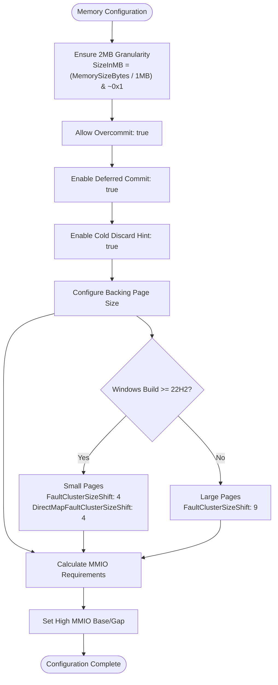
```mermaid
flowchart TD
START([Memory Configuration]) --> ALIGN["Ensure 2MB Granularity<br/>SizeInMB = (MemorySizeBytes / 1MB) & ~0x1"]
ALIGN --> OVERCOMMIT["Allow Overcommit: true"]
OVERCOMMIT --> DEFERRED["Enable Deferred Commit: true"]
DEFERRED --> DISCARD["Enable Cold Discard Hint: true"]
DISCARD --> BACKING["Configure Backing Page Size"]
BACKING --> MMIO["Calculate MMIO Requirements"]
MMIO --> HIGHMMIO["Set High MMIO Base/Gap"]
HIGHMMIO --> COMPLETE([Configuration Complete])
BACKING --> SMALLPAGE{"Windows Build >= 22H2?"}
SMALLPAGE --> |Yes| SMALL["Small Pages<br/>FaultClusterSizeShift: 4<br/>DirectMapFaultClusterSizeShift: 4"]
SMALLPAGE --> |No| LARGE["Large Pages<br/>FaultClusterSizeShift: 9"]
SMALL --> MMIO
LARGE --> MMIO
```

**Diagram sources**
- [WslCoreVm.cpp](file://src/windows/service/exe/WslCoreVm.cpp#L1498-L1522)

### CPU and Processor Configuration

Processor allocation includes support for hardware performance counters and nested virtualization:

| Configuration Parameter | Purpose | Validation |
|------------------------|---------|------------|
| `ProcessorCount` | Number of virtual CPUs | Range validation, platform capability check |
| `EnablePerfmonPmu` | Hardware performance monitoring | CPU feature detection |
| `EnablePerfmonLbr` | Last branch recording | CPU feature availability |
| `ExposeVirtualizationExtensions` | Nested virtualization support | Platform capability verification |

### GPU and Device Configuration

The system supports various GPU configurations with automatic fallback mechanisms:

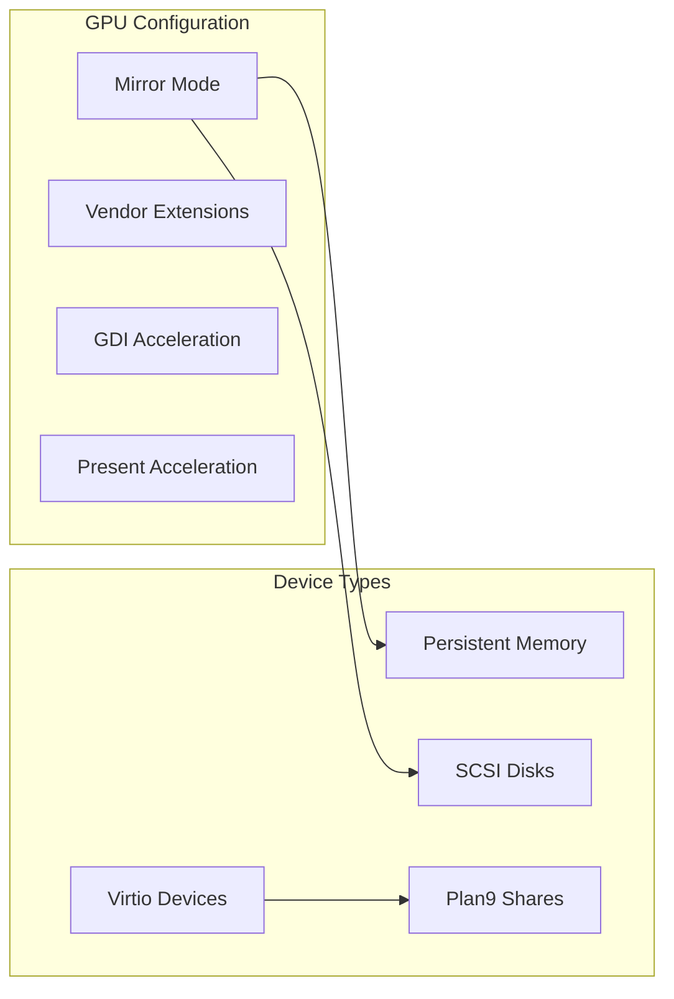
```mermaid
graph LR
subgraph "GPU Configuration"
MODE[Mirror Mode]
EXT[Vendor Extensions]
GDI[GDI Acceleration]
PRES[Present Acceleration]
end
subgraph "Device Types"
PMEM[Persistent Memory]
SCSI[SCSI Disks]
VIRTIO[Virtio Devices]
PLAN9[Plan9 Shares]
end
MODE --> PMEM
MODE --> SCSI
VIRTIO --> PLAN9
```

**Diagram sources**
- [WslCoreVm.cpp](file://src/windows/service/exe/WslCoreVm.cpp#L1487-L1600)
- [hcs_schema.h](file://src/windows/common/hcs_schema.h#L148-L162)

**Section sources**
- [WslCoreVm.cpp](file://src/windows/service/exe/WslCoreVm.cpp#L1487-L1600)
- [hcs_schema.h](file://src/windows/common/hcs_schema.h#L288-L300)

## Kernel and Initramfs Loading

The kernel and initramfs loading process represents a critical phase where the Linux kernel is booted and mini_init is executed.

### Kernel Boot Process

The kernel boot process follows a structured approach:

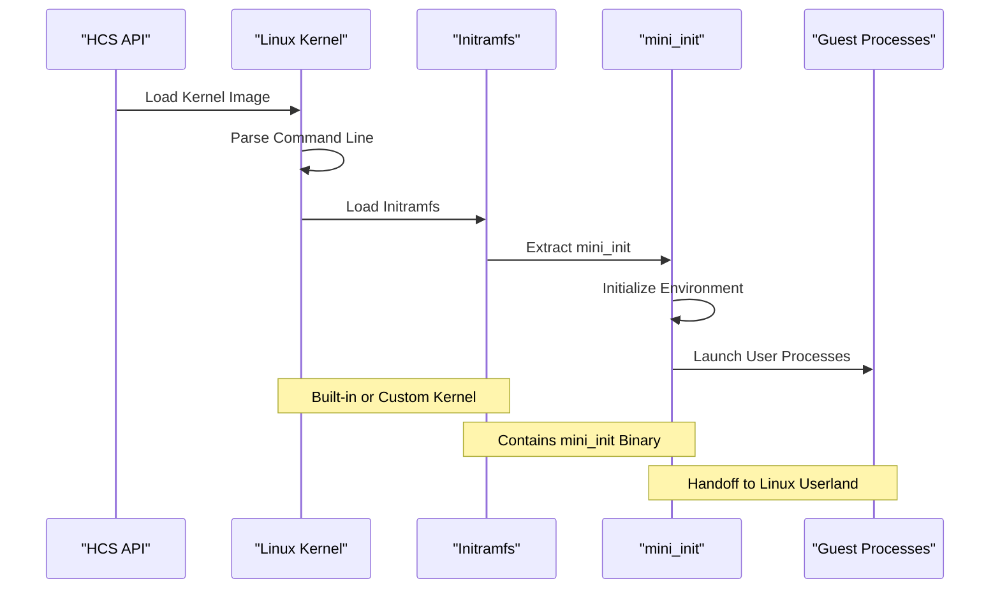
```mermaid
sequenceDiagram
participant HCS as "HCS API"
participant KERNEL as "Linux Kernel"
participant INITRAMFS as "Initramfs"
participant MINI as "mini_init"
participant GUEST as "Guest Processes"
HCS->>KERNEL : Load Kernel Image
KERNEL->>KERNEL : Parse Command Line
KERNEL->>INITRAMFS : Load Initramfs
INITRAMFS->>MINI : Extract mini_init
MINI->>MINI : Initialize Environment
MINI->>GUEST : Launch User Processes
Note over KERNEL,INITRAMFS : Built-in or Custom Kernel
Note over INITRAMFS,MINI : Contains mini_init Binary
Note over MINI,GUEST : Handoff to Linux Userland
```

**Diagram sources**
- [boot-process.md](file://doc/docs/technical-documentation/boot-process.md#L71-L87)
- [WslCoreVm.cpp](file://src/windows/service/exe/WslCoreVm.cpp#L1784-L1804)

### Kernel Command Line Construction

The kernel command line includes essential parameters for proper system initialization:

| Parameter | Purpose | Configuration Source |
|-----------|---------|---------------------|
| `initrd` | Specify initramfs location | Built-in initramfs path |
| `nr_cpus` | CPU count specification | VM configuration |
| `panic=-1` | Disable kernel panic reboot | Safety configuration |
| `swiotlb=force` | Force SWIOTLB for virtio-9p | Performance optimization |
| `console=hvc0` | Primary console device | Virtio serial configuration |

### Initramfs Execution

The initramfs contains the mini_init binary, which performs critical early initialization tasks:

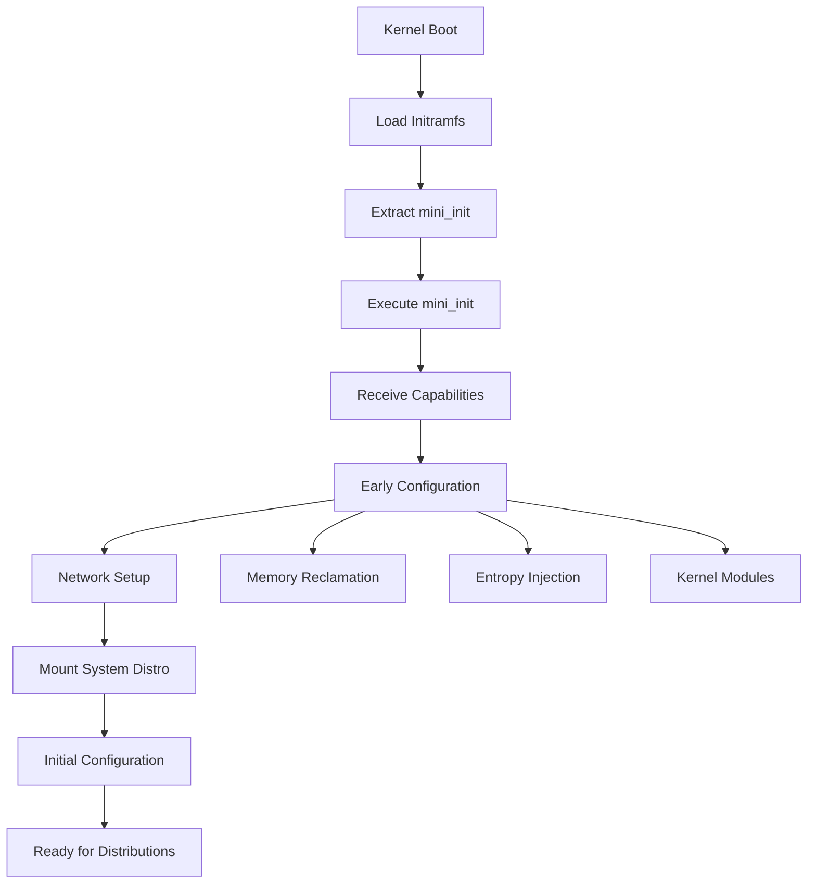
```mermaid
flowchart TD
BOOT[Kernel Boot] --> INITRD[Load Initramfs]
INITRD --> EXTRACT[Extract mini_init]
EXTRACT --> EXECUTE[Execute mini_init]
EXECUTE --> CAPS[Receive Capabilities]
CAPS --> EARLY[Early Configuration]
EARLY --> NETWORK[Network Setup]
NETWORK --> MOUNT[Mount System Distro]
MOUNT --> INITIAL[Initial Configuration]
INITIAL --> READY[Ready for Distributions]
EARLY --> MEMRECLAIM[Memory Reclamation]
EARLY --> ENTROPY[Entropy Injection]
EARLY --> MODULES[Kernel Modules]
```

**Diagram sources**
- [main.cpp](file://src/linux/init/main.cpp#L3297-L3440)
- [boot-process.md](file://doc/docs/technical-documentation/boot-process.md#L71-L87)

**Section sources**
- [WslCoreVm.cpp](file://src/windows/service/exe/WslCoreVm.cpp#L1784-L1804)
- [main.cpp](file://src/linux/init/main.cpp#L3297-L3440)

## Security Context and Token Management

WSL2 implements a comprehensive security model that separates privileges between the Windows host and Linux guest environments.

### Restricted Token Creation

The security system creates restricted tokens to limit guest privileges:

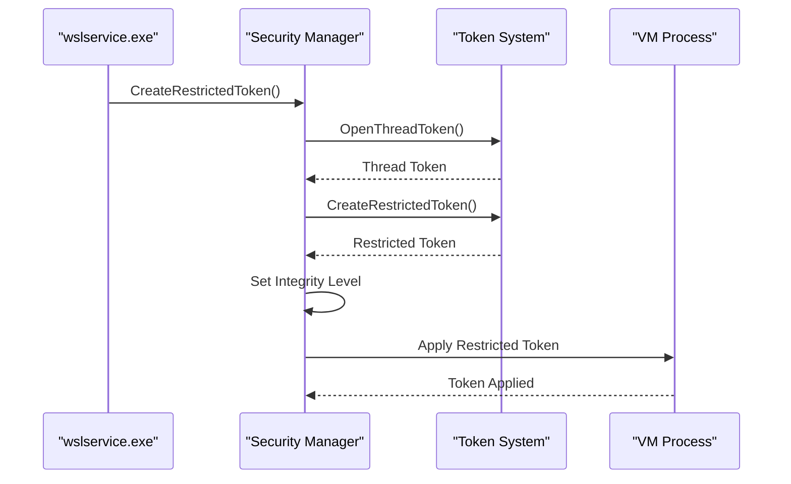
```mermaid
sequenceDiagram
participant WSLS as "wslservice.exe"
participant SEC as "Security Manager"
participant TOKEN as "Token System"
participant VM as "VM Process"
WSLS->>SEC : CreateRestrictedToken()
SEC->>TOKEN : OpenThreadToken()
TOKEN-->>SEC : Thread Token
SEC->>TOKEN : CreateRestrictedToken()
TOKEN-->>SEC : Restricted Token
SEC->>SEC : Set Integrity Level
SEC->>VM : Apply Restricted Token
VM-->>SEC : Token Applied
```

**Diagram sources**
- [WslSecurity.cpp](file://src/windows/common/WslSecurity.cpp#L68-L92)
- [WslCoreVm.cpp](file://src/windows/service/exe/WslCoreVm.cpp#L168-L175)

### Security Descriptor Construction

The system constructs security descriptors that grant appropriate access rights:

| Component | Purpose | Implementation |
|-----------|---------|----------------|
| System Access | Full access for SYSTEM account | `(A;;FA;;;SY)` |
| User Access | Full access for current user | `(A;;FA;;;{SID})` |
| Integrity Level | Medium integrity enforcement | Mandatory label policy |

### Privilege Management

The security system manages privileges through a structured approach:

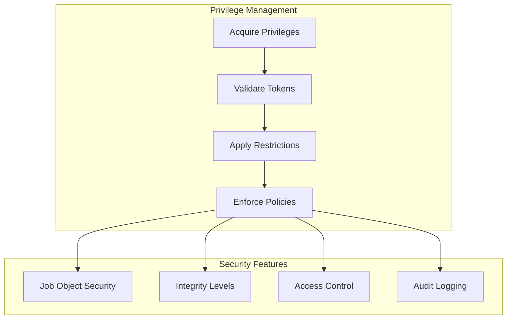
```mermaid
graph TB
subgraph "Privilege Management"
ACQUIRE[Acquire Privileges]
VALIDATE[Validate Tokens]
RESTRICT[Apply Restrictions]
ENFORCE[Enforce Policies]
end
subgraph "Security Features"
JOB[Job Object Security]
INT[Integrity Levels]
ACCESS[Access Control]
AUDIT[Audit Logging]
end
ACQUIRE --> VALIDATE
VALIDATE --> RESTRICT
RESTRICT --> ENFORCE
ENFORCE --> JOB
ENFORCE --> INT
ENFORCE --> ACCESS
ENFORCE --> AUDIT
```

**Diagram sources**
- [WslSecurity.h](file://src/windows/common/WslSecurity.h#L51-L92)
- [LxssSecurity.cpp](file://src/windows/service/exe/LxssSecurity.cpp#L20-L48)

**Section sources**
- [WslSecurity.cpp](file://src/windows/common/WslSecurity.cpp#L68-L180)
- [WslCoreVm.cpp](file://src/windows/service/exe/WslCoreVm.cpp#L168-L194)

## VM State Transitions and Monitoring

The VM state management system provides comprehensive monitoring and control over VM lifecycle events.

### State Transition Management

The system tracks VM states through a structured event-driven architecture:

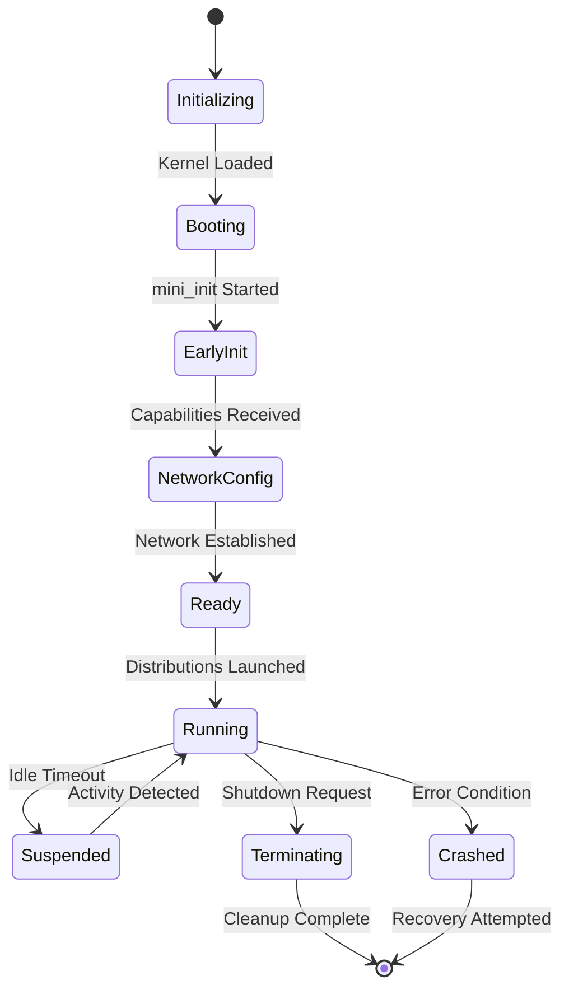
```mermaid
stateDiagram-v2
[*] --> Initializing
Initializing --> Booting : Kernel Loaded
Booting --> EarlyInit : mini_init Started
EarlyInit --> NetworkConfig : Capabilities Received
NetworkConfig --> Ready : Network Established
Ready --> Running : Distributions Launched
Running --> Suspended : Idle Timeout
Suspended --> Running : Activity Detected
Running --> Terminating : Shutdown Request
Terminating --> [*] : Cleanup Complete
Running --> Crashed : Error Condition
Crashed --> [*] : Recovery Attempted
```

**Diagram sources**
- [WslCoreVm.cpp](file://src/windows/service/exe/WslCoreVm.cpp#L2411-L2441)
- [LxssUserSession.cpp](file://src/windows/service/exe/LxssUserSession.cpp#L3831-L3871)

### Event Monitoring and Callbacks

The system implements comprehensive event monitoring:

| Event Type | Handler | Recovery Action |
|------------|---------|-----------------|
| VM Exit | OnExit() | Termination cleanup |
| Distribution Exit | DistroExitCallback | Resource cleanup |
| Network Change | NetworkMonitor | Configuration update |
| Device Access | DeviceHostProxy | Access permission check |

### Idle Timeout Management

The system implements intelligent idle timeout mechanisms:

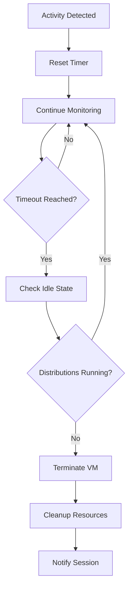
```mermaid
flowchart TD
ACTIVITY[Activity Detected] --> RESET[Reset Timer]
RESET --> MONITOR[Continue Monitoring]
MONITOR --> TIMEOUT{Timeout Reached?}
TIMEOUT --> |No| MONITOR
TIMEOUT --> |Yes| CHECK[Check Idle State]
CHECK --> RUNNING{Distributions Running?}
RUNNING --> |Yes| MONITOR
RUNNING --> |No| TERMINATE[Terminate VM]
TERMINATE --> CLEANUP[Cleanup Resources]
CLEANUP --> NOTIFY[Notify Session]
```

**Diagram sources**
- [LxssUserSession.cpp](file://src/windows/service/exe/LxssUserSession.cpp#L3831-L3871)

**Section sources**
- [WslCoreVm.cpp](file://src/windows/service/exe/WslCoreVm.cpp#L2411-L2441)
- [LxssUserSession.cpp](file://src/windows/service/exe/LxssUserSession.cpp#L2086-L3871)

## Failure Handling and Recovery Mechanisms

WSL2 implements robust failure handling and recovery mechanisms to ensure system stability and data integrity.

### VM Startup Failure Recovery

The system implements multiple layers of failure recovery:

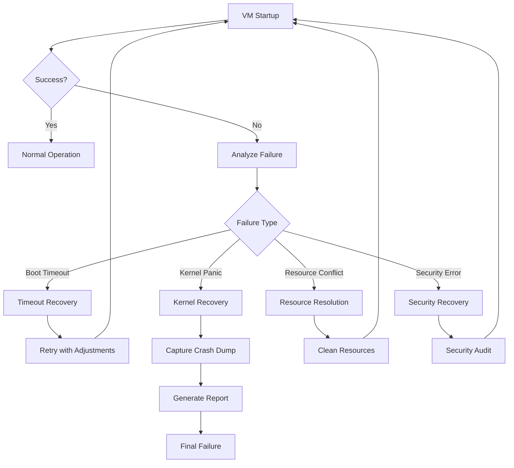
```mermaid
flowchart TD
STARTUP[VM Startup] --> SUCCESS{Success?}
SUCCESS --> |Yes| NORMAL[Normal Operation]
SUCCESS --> |No| ANALYZE[Analyze Failure]
ANALYZE --> TYPE{Failure Type}
TYPE --> |Boot Timeout| TIMEOUT[Timeout Recovery]
TYPE --> |Kernel Panic| PANIC[Kernel Recovery]
TYPE --> |Resource Conflict| RESOURCE[Resource Resolution]
TYPE --> |Security Error| SECURITY[Security Recovery]
TIMEOUT --> RETRY[Retry with Adjustments]
PANIC --> LOG[Capture Crash Dump]
RESOURCE --> CLEANUP[Clean Resources]
SECURITY --> AUDIT[Security Audit]
RETRY --> STARTUP
LOG --> REPORT[Generate Report]
CLEANUP --> STARTUP
AUDIT --> STARTUP
REPORT --> FAIL[Final Failure]
```

**Diagram sources**
- [WslCoreVm.cpp](file://src/windows/service/exe/WslCoreVm.cpp#L692-L773)

### Error Classification and Response

The system categorizes errors and applies appropriate recovery strategies:

| Error Category | Detection Method | Recovery Strategy |
|----------------|------------------|-------------------|
| Boot Failures | Timeout monitoring | Resource adjustment, retry |
| Kernel Panics | Crash dump analysis | Safe mode activation |
| Resource Conflicts | Access violation | Resource cleanup, retry |
| Security Violations | Permission checks | Audit logging, restriction |

### Crash Dump Collection

The system implements comprehensive crash dump collection:

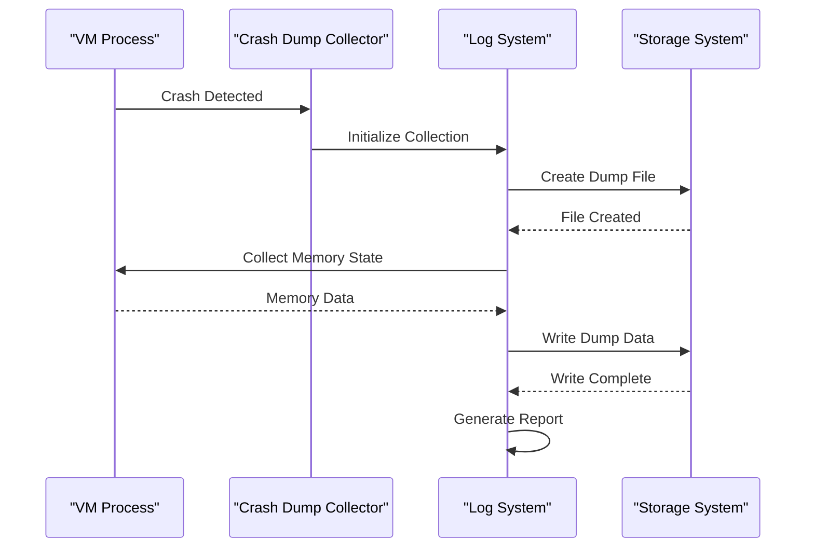
```mermaid
sequenceDiagram
participant VM as "VM Process"
participant DUMP as "Crash Dump Collector"
participant LOG as "Log System"
participant STORAGE as "Storage System"
VM->>DUMP : Crash Detected
DUMP->>LOG : Initialize Collection
LOG->>STORAGE : Create Dump File
STORAGE-->>LOG : File Created
LOG->>VM : Collect Memory State
VM-->>LOG : Memory Data
LOG->>STORAGE : Write Dump Data
STORAGE-->>LOG : Write Complete
LOG->>LOG : Generate Report
```

**Diagram sources**
- [WslCoreVm.cpp](file://src/windows/service/exe/WslCoreVm.cpp#L2403-L2410)

**Section sources**
- [WslCoreVm.cpp](file://src/windows/service/exe/WslCoreVm.cpp#L692-L773)
- [WslCoreVm.cpp](file://src/windows/service/exe/WslCoreVm.cpp#L2403-L2410)

## Safe Mode Configuration

Safe mode provides a minimal configuration environment for troubleshooting and recovery scenarios.

### Safe Mode Activation

Safe mode activation occurs under specific conditions:

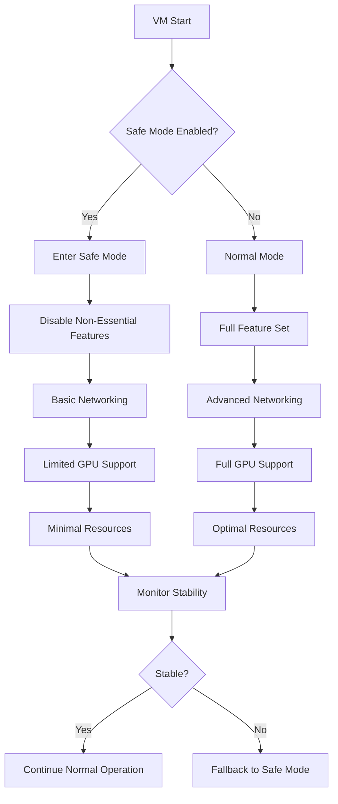
```mermaid
flowchart TD
START[VM Start] --> CHECK{Safe Mode Enabled?}
CHECK --> |Yes| SAFE[Enter Safe Mode]
CHECK --> |No| NORMAL[Normal Mode]
SAFE --> DISABLE[Disable Non-Essential Features]
DISABLE --> BASIC[Basic Networking]
BASIC --> LIMITED[Limited GPU Support]
LIMITED --> MINIMAL[Minimal Resources]
NORMAL --> FULL[Full Feature Set]
FULL --> ADVANCED[Advanced Networking]
ADVANCED --> FULLGPU[Full GPU Support]
FULLGPU --> OPTIMAL[Optimal Resources]
MINIMAL --> MONITOR[Monitor Stability]
OPTIMAL --> MONITOR
MONITOR --> STABLE{Stable?}
STABLE --> |Yes| CONTINUE[Continue Normal Operation]
STABLE --> |No| FALLBACK[Fallback to Safe Mode]
```

**Diagram sources**
- [WslCoreConfig.cpp](file://src/windows/common/WslCoreConfig.cpp#L91-L105)
- [main.cpp](file://src/linux/init/main.cpp#L3297-L3298)

### Safe Mode Configuration Parameters

Safe mode disables non-essential features to ensure basic functionality:

| Feature | Safe Mode Status | Reason |
|---------|------------------|---------|
| GUI Applications | Disabled | Resource optimization |
| Advanced Networking | Limited | Stability focus |
| GPU Acceleration | Minimal | Reduced complexity |
| VirtioFS | Disabled | Reliability priority |
| Hardware Performance Counters | Disabled | Debug focus |

### Recovery Scenarios

Safe mode enables recovery from various failure scenarios:

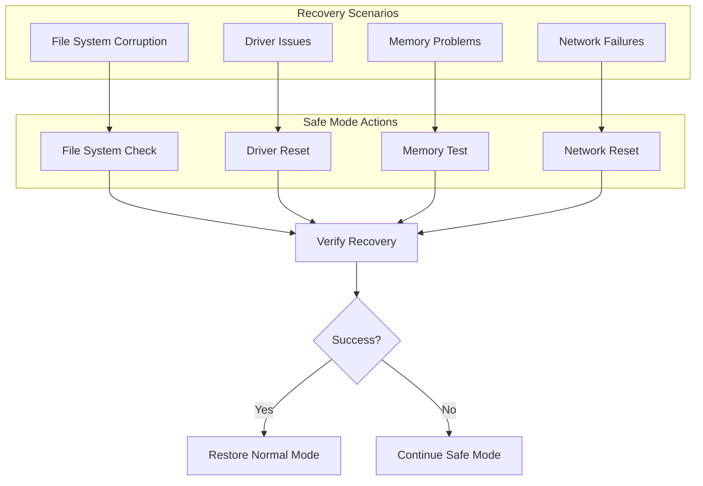
```mermaid
graph TB
subgraph "Recovery Scenarios"
CORRUPTION[File System Corruption]
DRIVER[Driver Issues]
MEMORY[Memory Problems]
NETWORK[Network Failures]
end
subgraph "Safe Mode Actions"
FSCK[File System Check]
DRIVER_RESET[Driver Reset]
MEMORY_TEST[Memory Test]
NET_RESET[Network Reset]
end
CORRUPTION --> FSCK
DRIVER --> DRIVER_RESET
MEMORY --> MEMORY_TEST
NETWORK --> NET_RESET
FSCK --> VERIFY[Verify Recovery]
DRIVER_RESET --> VERIFY
MEMORY_TEST --> VERIFY
NET_RESET --> VERIFY
VERIFY --> SUCCESS{Success?}
SUCCESS --> |Yes| NORMAL[Restore Normal Mode]
SUCCESS --> |No| CONTINUE[Continue Safe Mode]
```

**Diagram sources**
- [WslCoreConfig.cpp](file://src/windows/common/WslCoreConfig.cpp#L91-L105)

**Section sources**
- [WslCoreConfig.cpp](file://src/windows/common/WslCoreConfig.cpp#L91-L105)
- [main.cpp](file://src/linux/init/main.cpp#L3297-L3298)

## Networking and Device Management

WSL2 provides sophisticated networking and device management capabilities that integrate seamlessly with the Windows host environment.

### Networking Modes

The system supports multiple networking modes with automatic selection:

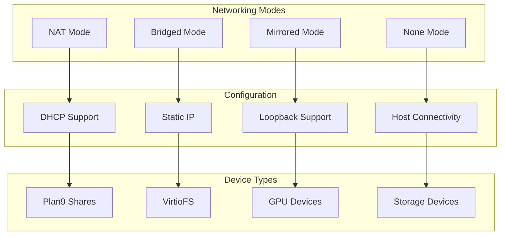
```mermaid
graph TB
subgraph "Networking Modes"
NAT[NAT Mode]
BRIDGED[Bridged Mode]
MIRRORED[Mirrored Mode]
NONE[None Mode]
end
subgraph "Configuration"
DHCP[DHCP Support]
STATIC[Static IP]
LOOPBACK[Loopback Support]
HOST[Host Connectivity]
end
subgraph "Device Types"
PLAN9[Plan9 Shares]
VIRTIOFS[VirtioFS]
GPU[GPU Devices]
STORAGE[Storage Devices]
end
NAT --> DHCP
BRIDGED --> STATIC
MIRRORED --> LOOPBACK
NONE --> HOST
DHCP --> PLAN9
STATIC --> VIRTIOFS
LOOPBACK --> GPU
HOST --> STORAGE
```

**Diagram sources**
- [NetworkManager.cpp](file://src/linux/init/NetworkManager.cpp#L31-L345)
- [WslCoreVm.cpp](file://src/windows/service/exe/WslCoreVm.cpp#L2576-L2578)

### Device Host Proxy

The DeviceHostProxy manages external device access:

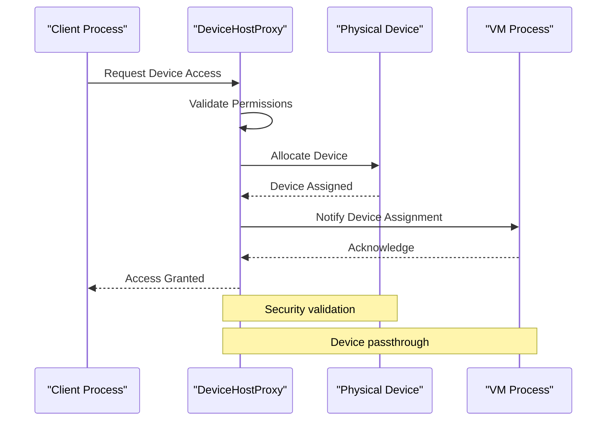
```mermaid
sequenceDiagram
participant CLIENT as "Client Process"
participant PROXY as "DeviceHostProxy"
participant DEVICE as "Physical Device"
participant VM as "VM Process"
CLIENT->>PROXY : Request Device Access
PROXY->>PROXY : Validate Permissions
PROXY->>DEVICE : Allocate Device
DEVICE-->>PROXY : Device Assigned
PROXY->>VM : Notify Device Assignment
VM-->>PROXY : Acknowledge
PROXY-->>CLIENT : Access Granted
Note over PROXY,DEVICE : Security validation
Note over VM,PROXY : Device passthrough
```

**Diagram sources**
- [DeviceHostProxy.cpp](file://src/windows/service/exe/DeviceHostProxy.cpp#L123-L155)

### DrvFs Mount Management

The system provides flexible file system mounting through DrvFs:

| Mount Type | Technology | Use Case |
|------------|------------|----------|
| Plan9 | Legacy Protocol | Compatibility mode |
| Virtio9p | Modern Protocol | Performance mode |
| VirtioFS | High-performance | Production mode |

**Section sources**
- [NetworkManager.cpp](file://src/linux/init/NetworkManager.cpp#L31-L345)
- [DeviceHostProxy.cpp](file://src/windows/service/exe/DeviceHostProxy.cpp#L123-L155)
- [drvfs.cpp](file://src/linux/init/drvfs.cpp#L189-L635)

## Performance Considerations

WSL2 implements numerous performance optimizations to ensure efficient operation across various workloads.

### Memory Management Optimizations

The system employs sophisticated memory management strategies:

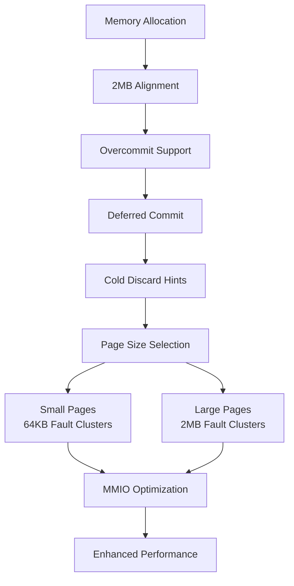
```mermaid
flowchart TD
MEMORY[Memory Allocation] --> GRANULARITY[2MB Alignment]
GRANULARITY --> OVERCOMMIT[Overcommit Support]
OVERCOMMIT --> DEFERRED[Deferred Commit]
DEFERRED --> COLD[Cold Discard Hints]
COLD --> BACKING[Page Size Selection]
BACKING --> SMALL[Small Pages<br/>64KB Fault Clusters]
BACKING --> LARGE[Large Pages<br/>2MB Fault Clusters]
SMALL --> MMIO[MMIO Optimization]
LARGE --> MMIO
MMIO --> PERFORMANCE[Enhanced Performance]
```

**Diagram sources**
- [WslCoreVm.cpp](file://src/windows/service/exe/WslCoreVm.cpp#L1498-L1522)

### I/O Performance Optimizations

The system implements various I/O performance enhancements:

| Optimization | Technology | Benefit |
|--------------|------------|---------|
| SWIOTLB | Software I/O Translation | DMA performance |
| VirtioFS | High-performance file system | I/O throughput |
| Persistent Memory | Direct memory access | Storage speed |
| Batch Operations | Bulk I/O processing | Latency reduction |

### CPU Performance Tuning

CPU performance optimizations include:

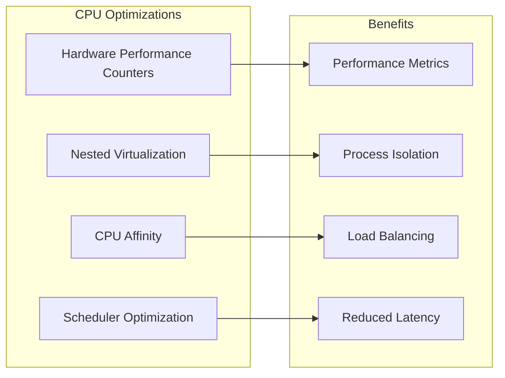
```mermaid
graph LR
subgraph "CPU Optimizations"
PERFMON[Hardware Performance Counters]
NESTED[Nested Virtualization]
AFFINITY[CPU Affinity]
SCHEDULING[Scheduler Optimization]
end
subgraph "Benefits"
METRICS[Performance Metrics]
ISOLATION[Process Isolation]
BALANCE[Load Balancing]
LATENCY[Reduced Latency]
end
PERFMON --> METRICS
NESTED --> ISOLATION
AFFINITY --> BALANCE
SCHEDULING --> LATENCY
```

**Section sources**
- [WslCoreVm.cpp](file://src/windows/service/exe/WslCoreVm.cpp#L1498-L1522)
- [WslCoreVm.cpp](file://src/windows/service/exe/WslCoreVm.cpp#L1600-L1637)

## Troubleshooting Guide

This section provides guidance for diagnosing and resolving common VM initialization issues.

### Common Initialization Problems

| Problem | Symptoms | Diagnosis | Solution |
|---------|----------|-----------|----------|
| Boot Timeout | VM fails to start | Check kernel logs | Increase timeout, verify resources |
| Kernel Panic | System crashes during boot | Analyze crash dumps | Safe mode, driver updates |
| Memory Issues | Out of memory errors | Monitor memory usage | Adjust allocation, optimize usage |
| Network Problems | Connectivity failures | Check network configuration | Verify mode settings, firewall |

### Diagnostic Tools and Techniques

The system provides various diagnostic capabilities:

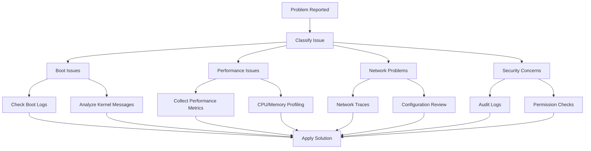
```mermaid
flowchart TD
ISSUE[Problem Reported] --> CLASSIFY[Classify Issue]
CLASSIFY --> BOOT[Boot Issues]
CLASSIFY --> PERFORM[Performance Issues]
CLASSIFY --> NETWORK[Network Problems]
CLASSIFY --> SECURITY[Security Concerns]
BOOT --> LOGS[Check Boot Logs]
BOOT --> KERNEL[Analyze Kernel Messages]
PERFORM --> METRICS[Collect Performance Metrics]
PERFORM --> PROFILING[CPU/Memory Profiling]
NETWORK --> TRACES[Network Traces]
NETWORK --> CONFIG[Configuration Review]
SECURITY --> AUDIT[Audit Logs]
SECURITY --> PERMISSIONS[Permission Checks]
LOGS --> SOLUTION[Apply Solution]
KERNEL --> SOLUTION
METRICS --> SOLUTION
PROFILING --> SOLUTION
TRACES --> SOLUTION
CONFIG --> SOLUTION
AUDIT --> SOLUTION
PERMISSIONS --> SOLUTION
```

### Log Analysis and Monitoring

The system generates comprehensive logs for troubleshooting:

| Log Type | Location | Content | Purpose |
|----------|----------|---------|---------|
| Boot Logs | Early console | Kernel messages | Boot diagnosis |
| System Logs | /var/log | System events | General monitoring |
| Security Logs | Audit subsystem | Security events | Security analysis |
| Performance Logs | Telemetry | Performance metrics | Optimization |

**Section sources**
- [WslCoreVm.cpp](file://src/windows/service/exe/WslCoreVm.cpp#L692-L773)
- [main.cpp](file://src/linux/init/main.cpp#L3297-L3440)

## Conclusion

The WSL2 VM initialization process represents a sophisticated integration of Windows and Linux technologies that provides a robust, secure, and performant virtualized environment. The system's architecture emphasizes modularity, security, and reliability through comprehensive error handling, recovery mechanisms, and performance optimizations.

Key achievements of the VM initialization system include:

- **Secure Isolation**: Comprehensive security model with restricted tokens and access controls
- **Flexible Configuration**: Extensive customization options for various use cases
- **Robust Recovery**: Multi-layered failure handling and automatic recovery mechanisms
- **Performance Optimization**: Sophisticated memory and I/O optimizations
- **Integration Excellence**: Seamless coordination between Windows host and Linux guest

The system continues to evolve with ongoing improvements in security, performance, and usability, ensuring that WSL2 remains a leading solution for Linux development on Windows platforms.

Future enhancements may include expanded GPU support, improved networking capabilities, enhanced security features, and continued performance optimizations. The modular architecture ensures that these improvements can be implemented without disrupting existing functionality.