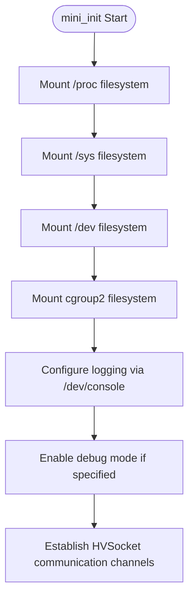
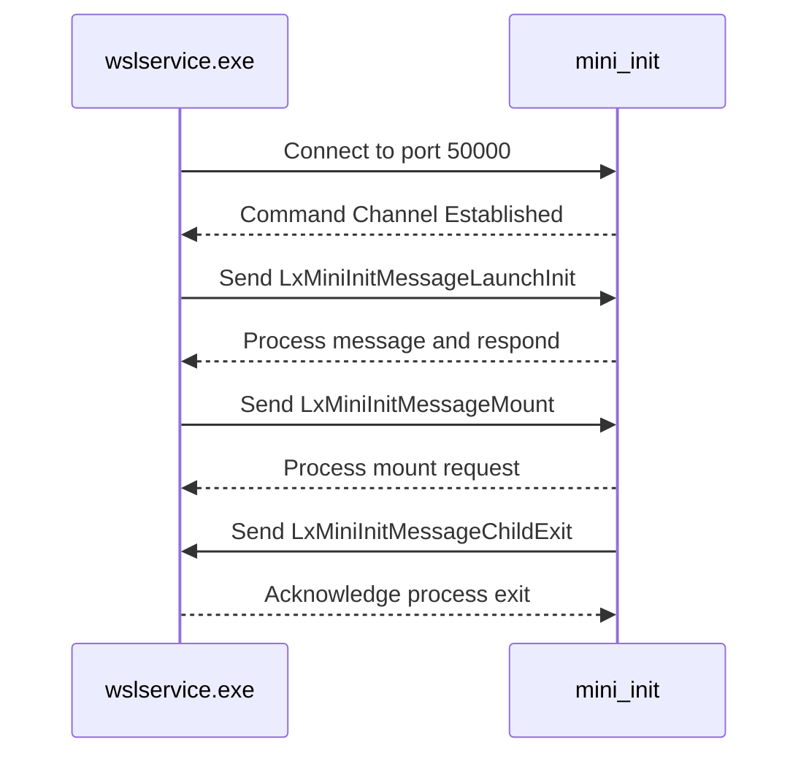
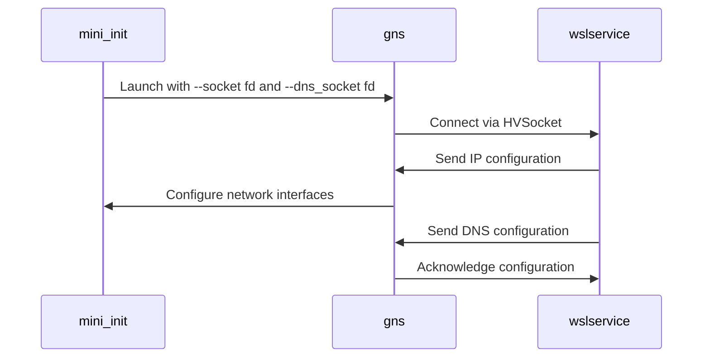
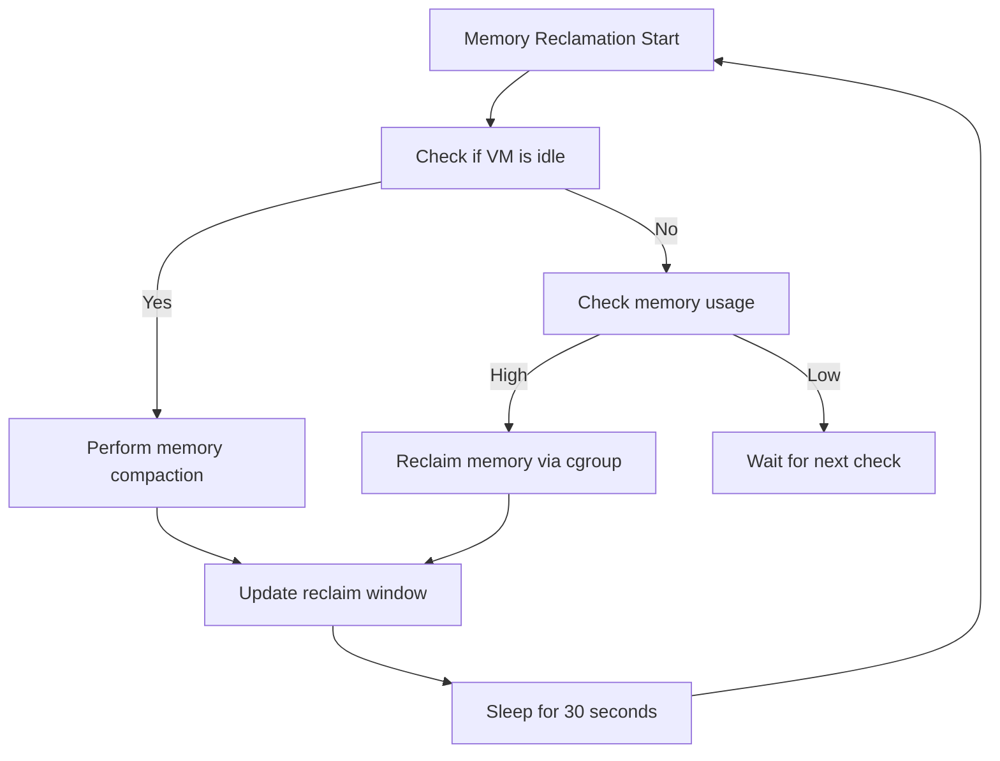
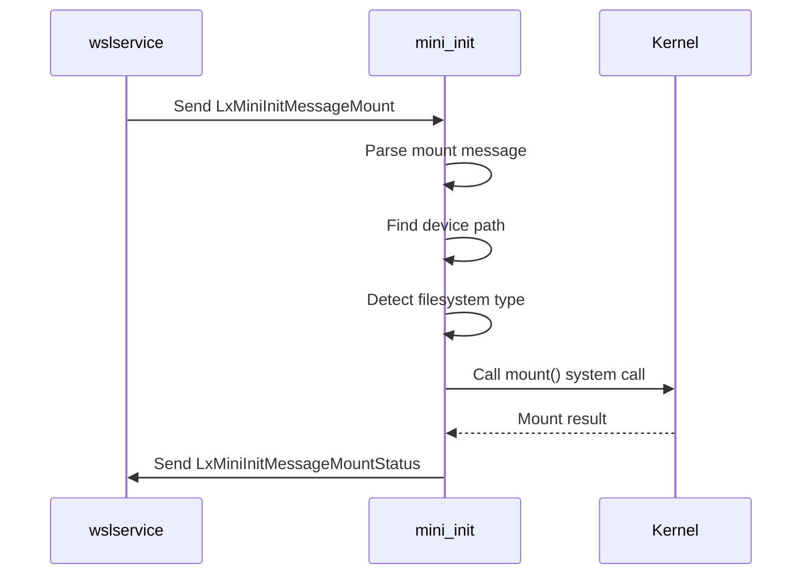
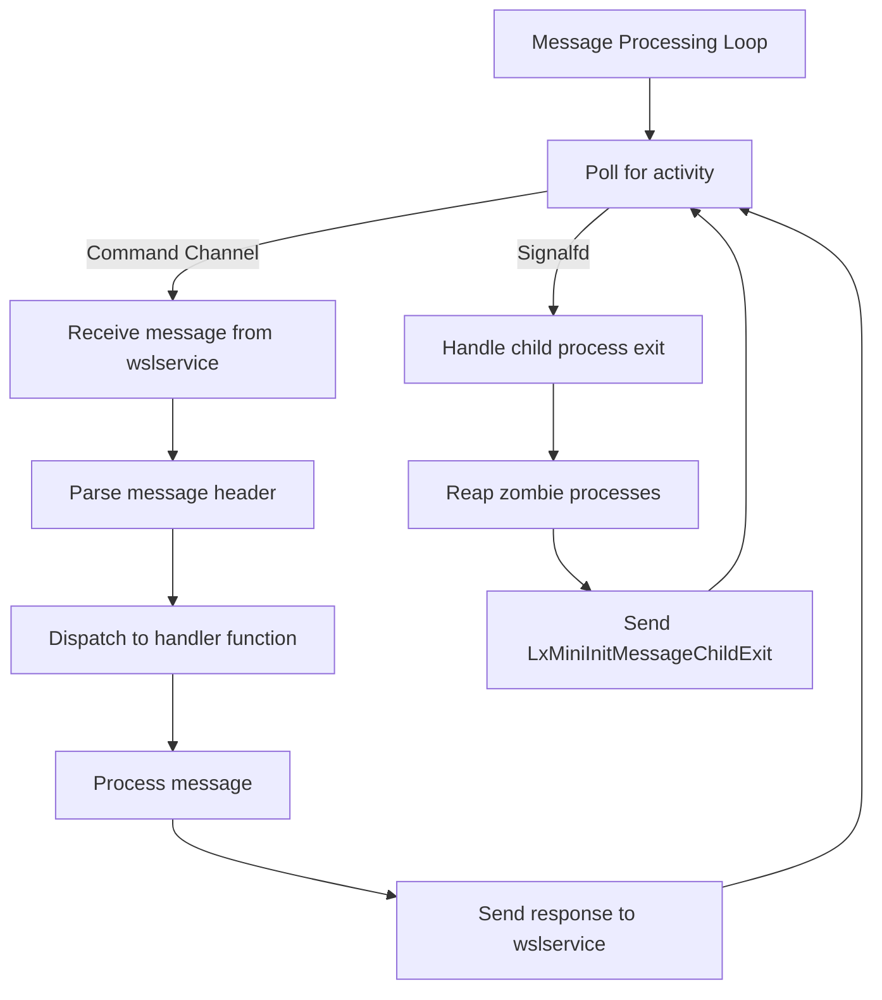
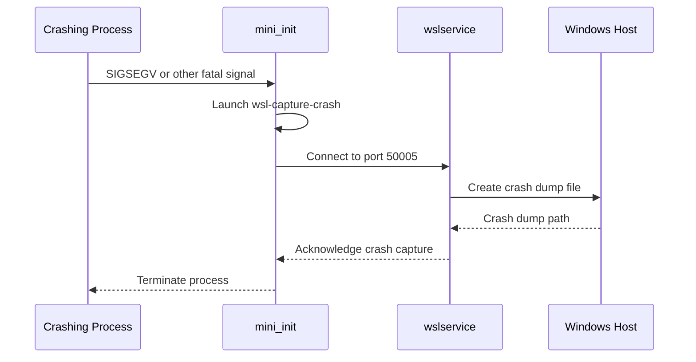

# mini_init Execution

<cite>
**Referenced Files in This Document**   
- [mini_init.md](file://doc/docs/technical-documentation/mini_init.md)
- [main.cpp](file://src/linux/init/main.cpp)
- [init.cpp](file://src/linux/init/init.cpp)
- [lxinitshared.h](file://src/shared/inc/lxinitshared.h)
- [gns.md](file://doc/docs/technical-documentation/gns.md)
- [GnsEngine.cpp](file://src/linux/init/GnsEngine.cpp)
- [GnsChannel.cpp](file://src/windows/service/exe/GnsChannel.cpp)
- [util.cpp](file://src/linux/init/util.cpp)
- [Dmesg.h](file://src/windows/service/exe/Dmesg.h)
- [Dmesg.cpp](file://src/windows/service/exe/Dmesg.cpp)
- [WslCoreVm.cpp](file://src/windows/service/exe/WslCoreVm.cpp)
- [hvsocket.hpp](file://src/windows/common/hvsocket.hpp)
- [hvsocket.cpp](file://src/windows/common/hvsocket.cpp)
</cite>

## Table of Contents
1. [Introduction](#introduction)
2. [Early Initialization and Mounting](#early-initialization-and-mounting)
3. [HVSocket Communication Channels](#hvsocket-communication-channels)
4. [Networking Configuration with GNS](#networking-configuration-with-gns)
5. [Memory Management and Debugging](#memory-management-and-debugging)
6. [Filesystem Operations](#filesystem-operations)
7. [Message Processing and Error Handling](#message-processing-and-error-handling)
8. [Crash Dump Collection and Logging](#crash-dump-collection-and-logging)
9. [Conclusion](#conclusion)

## Introduction

The `mini_init` process serves as the first user-mode executable launched within the WSL2 virtual machine (VM) after kernel boot completion. It performs critical early initialization tasks that establish the foundation for WSL2's functionality, including mounting essential filesystems, establishing communication channels with the Windows host via `wslservice.exe`, and launching auxiliary services like the Guest Network Service (GNS). This document provides a comprehensive analysis of the `mini_init` execution phase, detailing its core responsibilities, communication protocols, error handling mechanisms, and interaction with VM configuration parameters.

**Section sources**
- [mini_init.md](file://doc/docs/technical-documentation/mini_init.md#L1-L37)

## Early Initialization and Mounting

Upon execution, `mini_init` immediately begins by mounting the standard Linux virtual filesystems: `/proc`, `/sys`, and `/dev`. These mounts are essential for providing access to kernel data structures, system information, and device nodes. The process uses the `UtilMount` function to perform these operations, which are critical for the proper functioning of any Linux environment.

**Diagram sources**
- [main.cpp](file://src/linux/init/main.cpp#L4072-L4132)

Following the filesystem mounts, `mini_init` configures logging through `/dev/console` and sets up the thread name to "mini_init" for easier identification in system monitoring tools. If the `WSL_DEBUG` environment variable is present, debug mode is enabled, which increases the verbosity of log output for diagnostic purposes. This early configuration ensures that the system is properly instrumented before more complex operations begin.

**Section sources**
- [main.cpp](file://src/linux/init/main.cpp#L4072-L4135)
- [mini_init.md](file://doc/docs/technical-documentation/mini_init.md#L7-L9)

## HVSocket Communication Channels

`mini_init` establishes two distinct HVSocket communication channels with `wslservice.exe` on the Windows host. The first is a command channel used to receive instructions from the host, while the second is a notification channel used to report events from the VM to the host.

The command channel is established by connecting to the well-known port `LX_INIT_UTILITY_VM_INIT_PORT` (50000). This channel is used to receive various `LxMiniInitMessage` types, including `LaunchInit`, `Mount`, `Import`, `Export`, and `EJECT_VHD_MESSAGE`. These messages instruct `mini_init` to perform specific operations such as launching a new distribution, mounting a virtual disk, or resizing a filesystem.

**Diagram sources**
- [main.cpp](file://src/linux/init/main.cpp#L4098-L4119)
- [lxinitshared.h](file://src/shared/inc/lxinitshared.h#L115)

The notification channel is created by establishing a second connection to the same port. This channel is primarily used to report when Linux processes exit unexpectedly, allowing `wslservice.exe` to track the lifecycle of distributions and take appropriate actions. The use of two separate channels ensures that command and notification traffic do not interfere with each other, maintaining reliable communication between the VM and the host.

**Section sources**
- [main.cpp](file://src/linux/init/main.cpp#L4098-L4119)
- [mini_init.md](file://doc/docs/technical-documentation/mini_init.md#L11-L21)

## Networking Configuration with GNS

As part of the boot process, `mini_init` launches the `gns` (Guest Network Service) binary to manage networking configuration within the VM. The `gns` process is responsible for configuring IP addresses, routing tables, DNS settings, and MTU sizes based on instructions received from `wslservice.exe` via an HVSocket channel.

The `gns` process is started with specific command-line arguments that include the HVSocket file descriptor for communication (`--socket`), an optional file descriptor for DNS tunneling (`--dns_socket`), and the GUID of the network adapter. When DNS tunneling is enabled, `gns` also listens on a specific IP address (10.255.255.254) to intercept and respond to DNS queries from within the VM.

**Diagram sources**
- [main.cpp](file://src/linux/init/main.cpp#L1316-L1332)
- [init.cpp](file://src/linux/init/init.cpp#L3226-L3260)

The `gns` process maintains an ongoing connection with `wslservice.exe`, allowing it to receive dynamic updates to network configuration as the host environment changes. This architecture enables WSL2 to provide seamless network integration with the Windows host, including access to localhost services and proper DNS resolution.

**Section sources**
- [gns.md](file://doc/docs/technical-documentation/gns.md#L1-L16)
- [GnsEngine.cpp](file://src/linux/init/GnsEngine.cpp)
- [GnsChannel.cpp](file://src/windows/service/exe/GnsChannel.cpp)

## Memory Management and Debugging

`mini_init` implements sophisticated memory management strategies to optimize resource usage within the VM. It supports three memory reclaim modes: disabled, gradual, and drop cache. The gradual mode periodically checks if the VM is idle and performs memory compaction to maximize the number of pages that can be discarded to the host. This is particularly important for maintaining good performance when multiple distributions are running.

The memory reclamation process is configured based on the `PageReportingOrder` parameter, which determines the size of memory discard hints sent to the host. For example, a `PageReportingOrder` of 9 results in 2MB discard hints (2^9 * 4096 bytes). The system also monitors memory usage and can trigger gradual memory reclamation when usage exceeds certain thresholds.

**Diagram sources**
- [main.cpp](file://src/linux/init/main.cpp#L267-L444)

Additionally, `mini_init` can launch a debug shell on the `hvc2` terminal device if debug mode is enabled. This provides a valuable troubleshooting tool for developers and system administrators. The debug shell allows direct access to the VM's command line, enabling inspection of system state and execution of diagnostic commands.

**Section sources**
- [main.cpp](file://src/linux/init/main.cpp#L267-L444)
- [mini_init.md](file://doc/docs/technical-documentation/mini_init.md#L32)

## Filesystem Operations

`mini_init` handles various filesystem operations critical to WSL2 functionality, including mounting and unmounting virtual disks, resizing filesystems, and formatting disks. These operations are typically triggered by messages received from `wslservice.exe` over the HVSocket command channel.

For mounting operations, `mini_init` supports both SCSI LUN devices and persistent memory (pmem) devices. When mounting a device, it first detects the filesystem type using the `DetectFilesystem` function, then performs the mount operation with appropriate options. The process can also create overlay filesystems, which allow a read-only base filesystem to be combined with a writable upper layer.

**Diagram sources**
- [main.cpp](file://src/linux/init/main.cpp#L2111-L2422)
- [util.cpp](file://src/linux/init/util.cpp#L2940-L3024)

The filesystem resizing functionality allows users to dynamically adjust the size of their WSL2 distributions using the `wsl --manage <distro> --resize` command. When a resize request is received, `mini_init` processes the `LxMiniInitMessageResizeDistribution` message, which contains the SCSI LUN identifier and the new size. The process then performs the resize operation and reports the result back to `wslservice.exe`.

**Section sources**
- [main.cpp](file://src/linux/init/main.cpp#L3540-L3545)
- [mini_init.md](file://doc/docs/technical-documentation/mini_init.md#L34)

## Message Processing and Error Handling

The core of `mini_init`'s functionality lies in its message processing loop, which continuously polls for incoming messages on the HVSocket command channel. The loop uses the `poll` system call to wait for activity on both the command channel and a signalfd that detects child process exits.

When a message is received, `mini_init` dispatches it to the appropriate handler function based on the message type. For example, `LxMiniInitMessageLaunchInit` messages are handled by `ProcessLaunchInitMessage`, while `LxMiniInitMessageMount` messages are handled by `ProcessMountMessage`. Each handler processes the message and sends an appropriate response back to `wslservice.exe`.

**Diagram sources**
- [main.cpp](file://src/linux/init/main.cpp#L4165-L4267)
- [util.cpp](file://src/linux/init/util.cpp#L3311-L3393)

Error handling is a critical aspect of `mini_init`'s design. The process uses structured exception handling and comprehensive logging to detect and report errors. For example, when processing a `LxInitCreateProcess` message, if the `execv` system call fails, the error is caught, logged, and reported back to `wslservice.exe` through the HVSocket channel. This ensures that failures are properly communicated and can be acted upon by the host system.

**Section sources**
- [main.cpp](file://src/linux/init/main.cpp#L3233-L3536)
- [util.cpp](file://src/linux/init/util.cpp#L3311-L3393)

## Crash Dump Collection and Logging

`mini_init` plays a crucial role in crash dump collection and system logging. When the `WSL_ENABLE_CRASH_DUMP` environment variable is set, `mini_init` enables crash dump collection by calling `EnableCrashDumpCollection`. This allows the system to capture diagnostic information when processes crash, which is invaluable for troubleshooting and debugging.

The crash dump collection process involves launching the `wsl-capture-crash` binary, which connects to a dedicated HVSocket port (50005) to send crash information to `wslservice.exe`. The crash information includes the timestamp, signal number, process ID, and executable name, providing a comprehensive snapshot of the crash event.

**Diagram sources**
- [main.cpp](file://src/linux/init/main.cpp#L4121-L4130)
- [init.cpp](file://src/linux/init/init.cpp#L402-L436)
- [WslCoreVm.cpp](file://src/windows/service/exe/WslCoreVm.cpp#L1202-L1223)

System logging is configured to output to `/dev/console`, ensuring that all log messages are visible in the VM's console output. The `DmesgCollector` class in the Windows host component is responsible for collecting kernel log messages (dmesg) and writing them to a file for analysis. This provides a complete logging solution that captures both user-space and kernel-space events.

**Section sources**
- [main.cpp](file://src/linux/init/main.cpp#L4121-L4130)
- [init.cpp](file://src/linux/init/init.cpp#L402-L436)
- [Dmesg.h](file://src/windows/service/exe/Dmesg.h)
- [Dmesg.cpp](file://src/windows/service/exe/Dmesg.cpp)

## Conclusion

The `mini_init` process is a critical component of the WSL2 architecture, responsible for establishing the foundational environment within the virtual machine. Through its comprehensive initialization routines, dual HVSocket communication channels, and integration with auxiliary services like GNS, `mini_init` enables the seamless integration of Linux and Windows environments. Its robust error handling, memory management, and crash reporting capabilities ensure reliable operation and provide valuable diagnostic information for troubleshooting. Understanding the inner workings of `mini_init` is essential for developers and system administrators working with WSL2, as it provides insight into the underlying mechanisms that make WSL2 a powerful and flexible development platform.