# Configuration Processing Pipeline

<cite>
**Referenced Files in This Document**
- [WslDistributionConfig.cpp](file://src/linux/init/WslDistributionConfig.cpp)
- [WslDistributionConfig.h](file://src/linux/init/WslDistributionConfig.h)
- [config.cpp](file://src/linux/init/config.cpp)
- [config.h](file://src/linux/init/config.h)
- [configfile.cpp](file://src/shared/configfile/configfile.cpp)
- [configfile.h](file://src/shared/configfile/configfile.h)
- [common.h](file://src/linux/init/common.h)
- [main.cpp](file://src/linux/init/main.cpp)
- [WslCoreConfig.cpp](file://src/windows/common/WslCoreConfig.cpp)
- [WslCoreConfigInterface.cpp](file://src/windows/libwsl/WslCoreConfigInterface.cpp)
- [UnitTests.cpp](file://test/windows/UnitTests.cpp)
</cite>

## Table of Contents
1. [Introduction](#introduction)
2. [Configuration Architecture Overview](#configuration-architecture-overview)
3. [WslDistributionConfig Class Implementation](#wsldistributionconfig-class-implementation)
4. [Shared Configuration Module](#shared-configuration-module)
5. [Configuration Processing Pipeline](#configuration-processing-pipeline)
6. [Configuration Hierarchy and Precedence](#configuration-hierarchy-and-precedence)
7. [Windows Registry Integration](#windows-registry-integration)
8. [Validation and Error Handling](#validation-and-error-handling)
9. [Safe Mode Configuration](#safe-mode-configuration)
10. [Troubleshooting Guide](#troubleshooting-guide)
11. [Best Practices](#best-practices)

## Introduction

The WSL (Windows Subsystem for Linux) configuration processing pipeline is a sophisticated system that manages the initialization and runtime configuration of Linux distributions within the WSL environment. This system handles the parsing of `/etc/wsl.conf` files, integration with Windows registry settings, and the application of VM-level configurations during the startup process.

The configuration system operates through multiple layers, including the WslDistributionConfig class for Linux-side processing, a shared configfile module for robust INI file parsing, and Windows-side registry integration for centralized configuration management. This architecture ensures consistent configuration application across both operating systems while providing comprehensive validation and error handling mechanisms.

## Configuration Architecture Overview

The WSL configuration system follows a layered architecture that separates concerns between Windows and Linux environments:

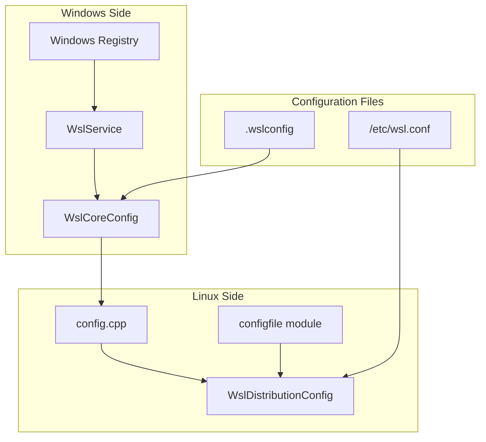

**Diagram sources**
- [config.cpp](file://src/linux/init/config.cpp#L460-L598)
- [WslDistributionConfig.cpp](file://src/linux/init/WslDistributionConfig.cpp#L22-L133)
- [WslCoreConfig.cpp](file://src/windows/common/WslCoreConfig.cpp#L289-L292)

The architecture enables bidirectional synchronization between Windows and Linux configurations, allowing Windows settings to influence Linux behavior and vice versa. This design supports enterprise deployment scenarios where configuration policies are managed centrally through Windows Group Policy or registry settings.

**Section sources**
- [config.cpp](file://src/linux/init/config.cpp#L460-L598)
- [WslDistributionConfig.cpp](file://src/linux/init/WslDistributionConfig.cpp#L22-L133)

## WslDistributionConfig Class Implementation

The WslDistributionConfig class serves as the primary interface for handling distribution-specific configuration settings in the Linux environment. This class encapsulates all configuration-related functionality and provides a clean abstraction for accessing and applying configuration values.

### Class Structure and Key Components

The WslDistributionConfig class defines numerous configuration parameters organized into functional categories:

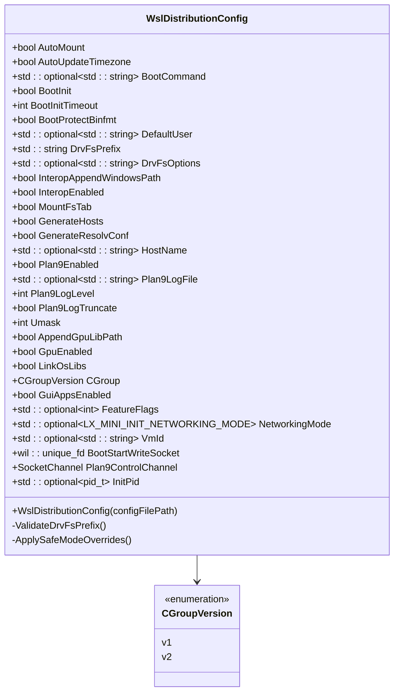

**Diagram sources**
- [WslDistributionConfig.h](file://src/linux/init/WslDistributionConfig.h#L41-L101)

### Configuration Parameter Categories

The class organizes configuration parameters into several key categories:

| Category | Parameters | Purpose |
|----------|------------|---------|
| **Automount Settings** | `AutoMount`, `DrvFsPrefix`, `DrvFsOptions`, `MountFsTab`, `LinkOsLibs` | Control drive mounting behavior and filesystem integration |
| **Network Configuration** | `GenerateHosts`, `GenerateResolvConf`, `HostName` | Manage network resolution and hostname settings |
| **Interoperability** | `InteropEnabled`, `InteropAppendWindowsPath` | Control Windows/Linux integration features |
| **System Services** | `BootCommand`, `BootInit`, `BootInitTimeout`, `BootProtectBinfmt` | Configure system initialization and service management |
| **GPU Support** | `GpuEnabled`, `AppendGpuLibPath` | Manage graphics acceleration and library paths |
| **File Server** | `Plan9Enabled`, `Plan9LogFile`, `Plan9LogLevel`, `Plan9LogTruncate` | Control Plan9 file server functionality |
| **User Management** | `DefaultUser`, `Umask` | Define default user and file permissions |

### Constructor and Initialization Process

The constructor performs comprehensive initialization by parsing the configuration file and applying default values for unspecified parameters:

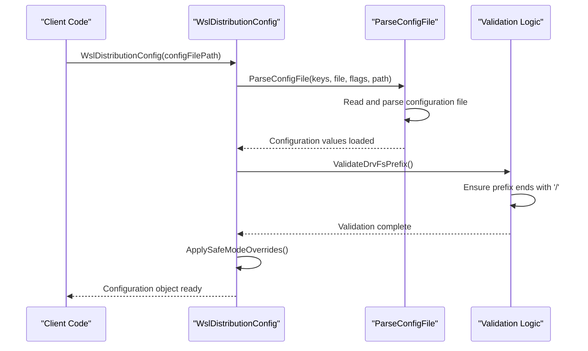

**Diagram sources**
- [WslDistributionConfig.cpp](file://src/linux/init/WslDistributionConfig.cpp#L22-L133)

**Section sources**
- [WslDistributionConfig.cpp](file://src/linux/init/WslDistributionConfig.cpp#L22-L133)
- [WslDistributionConfig.h](file://src/linux/init/WslDistributionConfig.h#L41-L101)

## Shared Configuration Module

The shared configuration module provides robust INI file parsing capabilities that handle various edge cases and provide comprehensive error reporting. This module is essential for parsing both `/etc/wsl.conf` and `.wslconfig` files with consistent behavior.

### ConfigKey Class Design

The ConfigKey class serves as the foundation for type-safe configuration parsing:

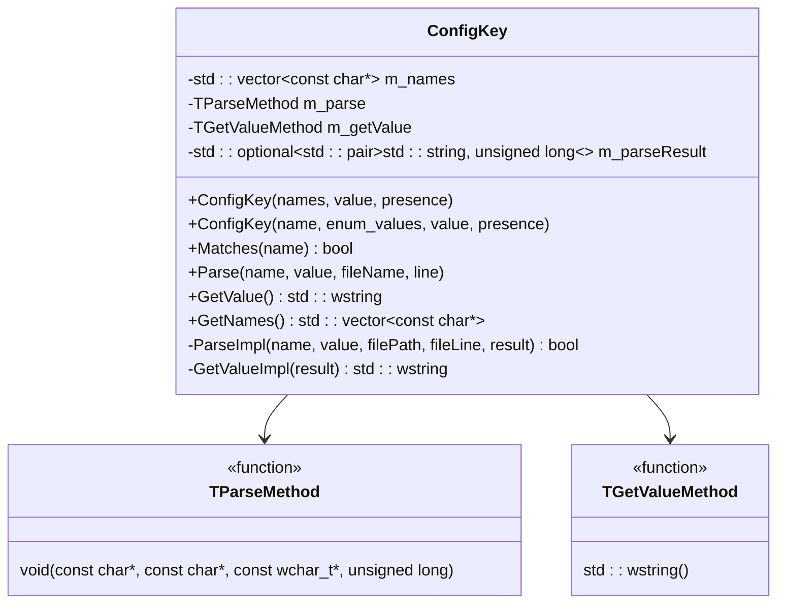

**Diagram sources**
- [configfile.h](file://src/shared/configfile/configfile.h#L40-L207)

### Parsing Capabilities and Features

The configuration parser supports advanced features for robust file processing:

| Feature | Description | Implementation |
|---------|-------------|----------------|
| **Multiple Key Names** | Support for aliases and deprecated key names | Vector of names per ConfigKey |
| **Type Safety** | Automatic type conversion with validation | Template-based parsing methods |
| **Enum Support** | Enumeration value parsing with validation | Case-insensitive string matching |
| **Memory Strings** | Human-readable memory size parsing | Support for GB, MB, KB suffixes |
| **Escaping** | Backslash escaping for special characters | Comprehensive escape sequence support |
| **Line Continuation** | Multi-line value support | Backslash at line end |
| **Comments** | Hash-prefixed comment support | Flexible comment placement |

### Error Handling and Validation

The parser implements comprehensive error handling with detailed diagnostic information:

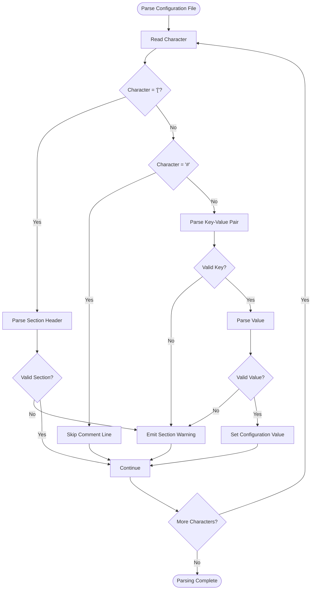

**Diagram sources**
- [configfile.cpp](file://src/shared/configfile/configfile.cpp#L231-L864)

**Section sources**
- [configfile.cpp](file://src/shared/configfile/configfile.cpp#L1-L864)
- [configfile.h](file://src/shared/configfile/configfile.h#L1-L224)

## Configuration Processing Pipeline

The configuration processing pipeline orchestrates the flow of configuration data from Windows registry to Linux environment, ensuring proper initialization and synchronization.

### Initialization Sequence

The main initialization process follows a carefully orchestrated sequence:

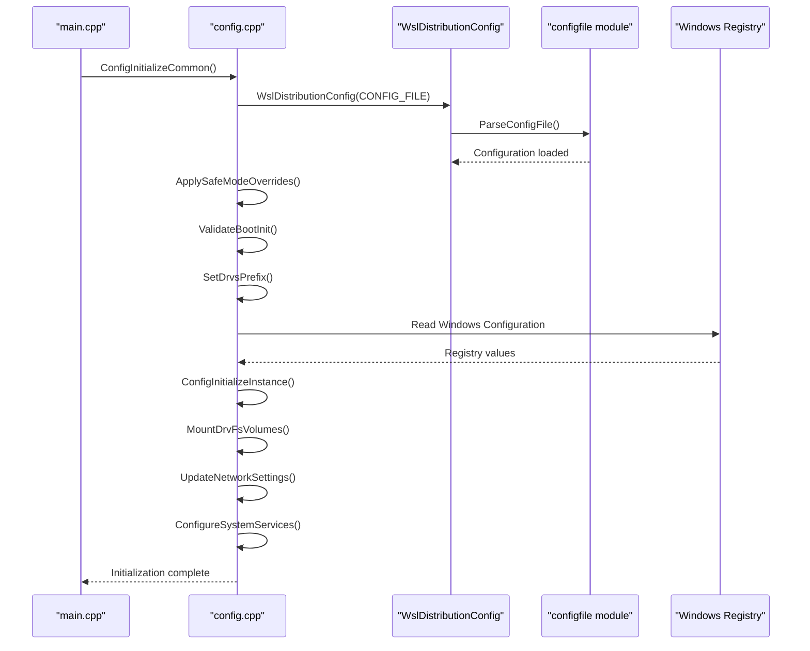

**Diagram sources**
- [config.cpp](file://src/linux/init/config.cpp#L460-L598)
- [main.cpp](file://src/linux/init/main.cpp#L154-L200)

### Configuration Application Phases

The configuration system operates in distinct phases, each with specific responsibilities:

| Phase | Responsibility | Key Functions |
|-------|---------------|---------------|
| **Initialization** | Basic system setup and signal handling | `ConfigInitializeCommon()` |
| **Configuration Loading** | Parse wsl.conf and apply defaults | `WslDistributionConfig` constructor |
| **Safe Mode Processing** | Apply safe mode overrides if enabled | Safe mode detection and override logic |
| **Instance Configuration** | Apply Windows registry settings | `ConfigInitializeInstance()` |
| **Service Configuration** | Mount drives and configure services | Volume mounting and service setup |

### Signal Handling and Cleanup

The initialization process establishes proper signal handling for graceful shutdown:

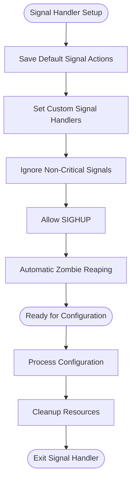

**Diagram sources**
- [config.cpp](file://src/linux/init/config.cpp#L516-L525)

**Section sources**
- [config.cpp](file://src/linux/init/config.cpp#L460-L598)
- [main.cpp](file://src/linux/init/main.cpp#L154-L200)

## Configuration Hierarchy and Precedence

WSL implements a sophisticated configuration hierarchy that determines how settings are resolved when conflicts occur. Understanding this hierarchy is crucial for effective configuration management.

### Precedence Order

Configuration settings follow a specific precedence order, from highest to lowest priority:

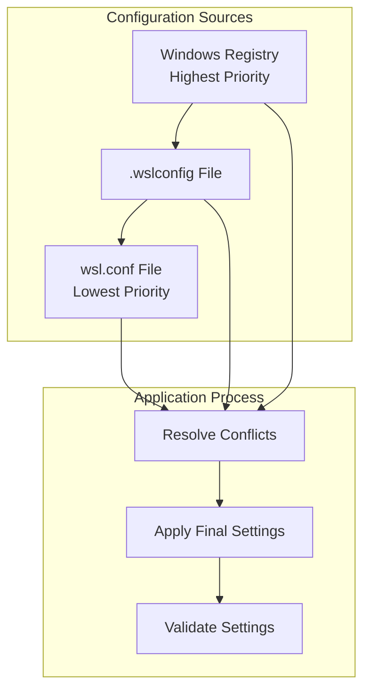

**Diagram sources**
- [WslCoreConfig.cpp](file://src/windows/common/WslCoreConfig.cpp#L250-L292)
- [config.cpp](file://src/linux/init/config.cpp#L621-L799)

### Configuration Categories and Scope

Different configuration categories have varying scopes and precedence rules:

| Category | Scope | Precedence | Example Keys |
|----------|-------|------------|--------------|
| **System-wide** | Applies to all distributions | High | `memory`, `processors`, `swap` |
| **Distribution-specific** | Applies to individual distributions | Medium | `automount.enabled`, `interop.enabled` |
| **Runtime** | Applied during startup | Low | `boot.command`, `network.hostname` |

### Conflict Resolution Strategy

When multiple configuration sources provide conflicting values, the system applies the following resolution strategy:

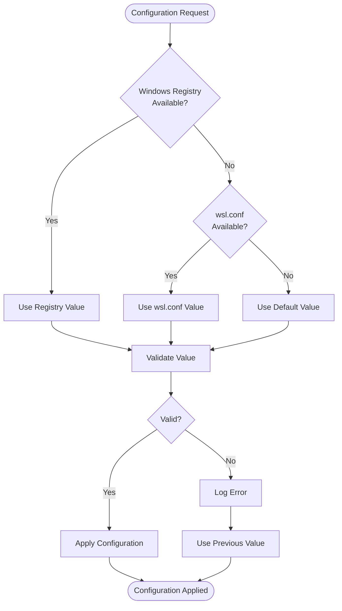

**Diagram sources**
- [config.cpp](file://src/linux/init/config.cpp#L621-L799)

**Section sources**
- [WslCoreConfig.cpp](file://src/windows/common/WslCoreConfig.cpp#L250-L292)
- [config.cpp](file://src/linux/init/config.cpp#L621-L799)

## Windows Registry Integration

The Windows registry integration enables centralized configuration management and enterprise deployment scenarios. This integration allows Windows administrators to control WSL behavior through familiar Windows management tools.

### Registry Structure and Organization

WSL stores configuration data in the Windows registry under specific paths:

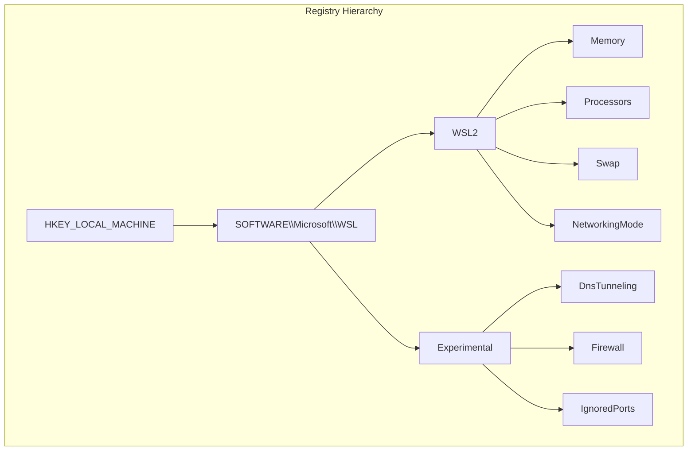

**Diagram sources**
- [WslCoreConfig.cpp](file://src/windows/common/WslCoreConfig.cpp#L289-L292)

### Registry Watcher Implementation

The system implements real-time registry monitoring to detect configuration changes:

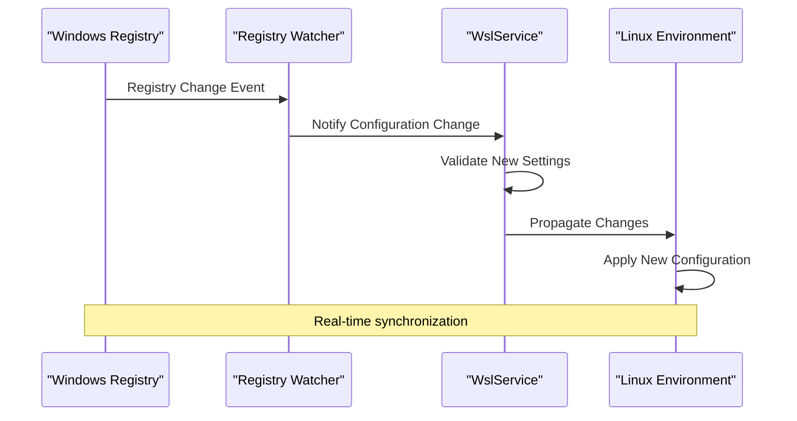

**Diagram sources**
- [WslCoreHostDnsInfo.cpp](file://src/windows/service/exe/WslCoreHostDnsInfo.cpp#L482-L498)

### Configuration Synchronization Process

The synchronization process ensures consistency between Windows and Linux configurations:

| Step | Windows Side | Linux Side | Action |
|------|-------------|------------|--------|
| **Detection** | Registry change detected | Notified via socket | Trigger synchronization |
| **Validation** | Validate new settings | Validate against constraints | Reject invalid configurations |
| **Transformation** | Convert to Linux format | Apply Linux-specific processing | Handle platform differences |
| **Propagation** | Send configuration data | Receive and parse data | Update internal state |
| **Application** | Apply new settings | Apply configuration changes | Restart affected services |

**Section sources**
- [WslCoreConfig.cpp](file://src/windows/common/WslCoreConfig.cpp#L250-L292)
- [WslCoreHostDnsInfo.cpp](file://src/windows/service/exe/WslCoreHostDnsInfo.cpp#L482-L498)

## Validation and Error Handling

The WSL configuration system implements comprehensive validation and error handling mechanisms to ensure system stability and provide meaningful diagnostic information.

### Validation Framework

The validation system operates at multiple levels:

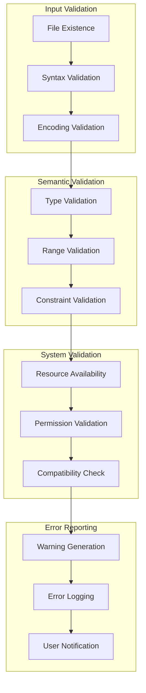

**Diagram sources**
- [configfile.cpp](file://src/shared/configfile/configfile.cpp#L62-L106)
- [UnitTests.cpp](file://test/windows/UnitTests.cpp#L1958-L2149)

### Common Validation Scenarios

The system handles various validation scenarios with specific error messages:

| Validation Type | Error Condition | Example Message |
|----------------|-----------------|-----------------|
| **Boolean Parsing** | Invalid boolean value | `"Invalid boolean value 'NotABoolean' for key 'wsl2.ipv6'"` |
| **Integer Parsing** | Non-numeric value | `"Invalid integer value 'NotANumber' for key 'wsl2.dhcpTimeout'"` |
| **Memory String Parsing** | Invalid memory format | `"Invalid memory string '0foo' for .wslconfig entry 'wsl2.swap'"` |
| **Enum Validation** | Invalid enumeration value | `"Invalid value 'InvalidMode' for config key 'wsl2.networkingMode'"` |
| **Section Validation** | Malformed section header | `"Invalid section name in /etc/wsl.conf:1"` |
| **Key Validation** | Unknown configuration key | `"Unknown key 'foo.a' in /etc/wsl.conf:2"` |

### Error Recovery Mechanisms

The system implements graceful error recovery to maintain system stability:

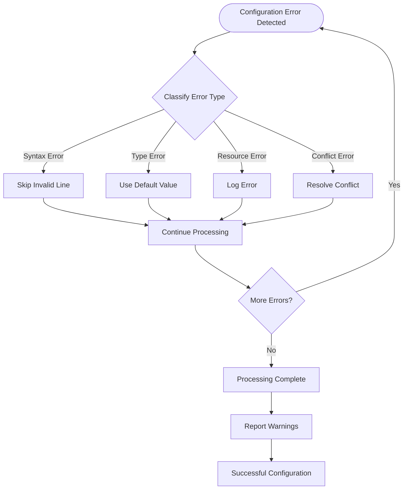

**Diagram sources**
- [configfile.cpp](file://src/shared/configfile/configfile.cpp#L210-L221)

### Warning and Diagnostic System

The diagnostic system provides comprehensive feedback for configuration issues:

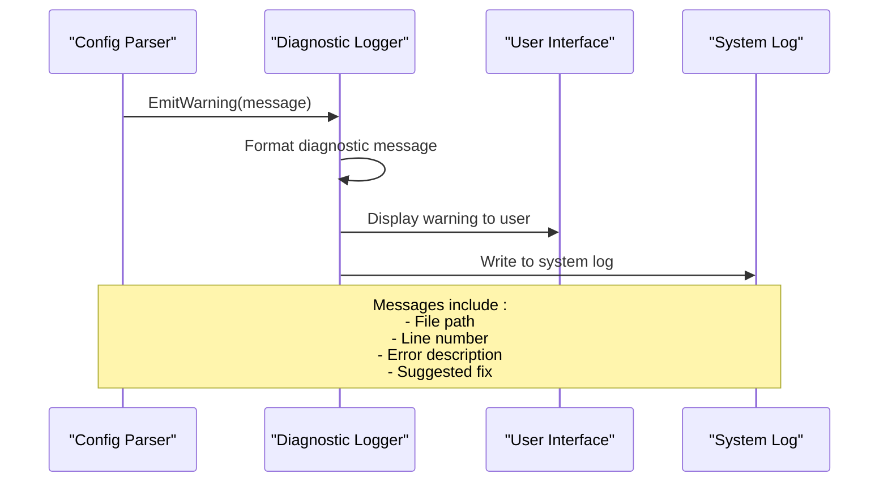

**Diagram sources**
- [configfile.cpp](file://src/shared/configfile/configfile.cpp#L62-L106)

**Section sources**
- [configfile.cpp](file://src/shared/configfile/configfile.cpp#L62-L106)
- [UnitTests.cpp](file://test/windows/UnitTests.cpp#L1958-L2149)

## Safe Mode Configuration

Safe mode provides a fallback mechanism for situations where normal configuration would cause system instability or prevent boot. This feature is automatically activated when specific conditions are met.

### Safe Mode Detection

Safe mode activation occurs when the `LX_WSL2_SAFE_MODE` environment variable is set to "1":

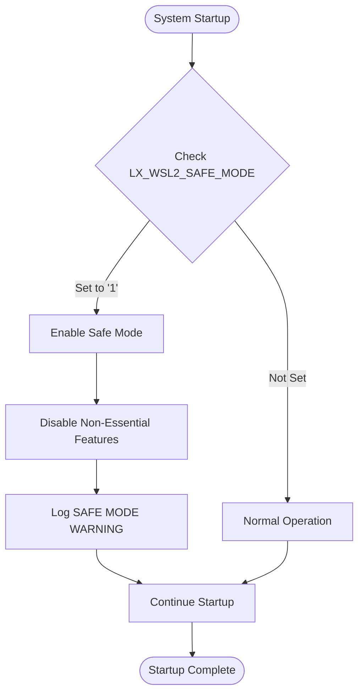

**Diagram sources**
- [WslDistributionConfig.cpp](file://src/linux/init/WslDistributionConfig.cpp#L101-L133)

### Feature Disabling Logic

When safe mode is enabled, the system systematically disables potentially problematic features:

| Feature Category | Disabled Features | Rationale |
|------------------|-------------------|-----------|
| **Mount Operations** | Automount, DrvFs mounting | Prevent drive access issues |
| **System Services** | systemd, boot commands | Reduce startup complexity |
| **Network Features** | Hosts generation, DNS resolution | Simplify network configuration |
| **GUI Applications** | X11 forwarding, GPU support | Reduce graphical dependencies |
| **File Servers** | Plan9 file server | Minimize network services |
| **Interop Features** | Windows path appending | Reduce integration complexity |

### Safe Mode Override Implementation

The override mechanism uses a template function to safely disable configuration options:

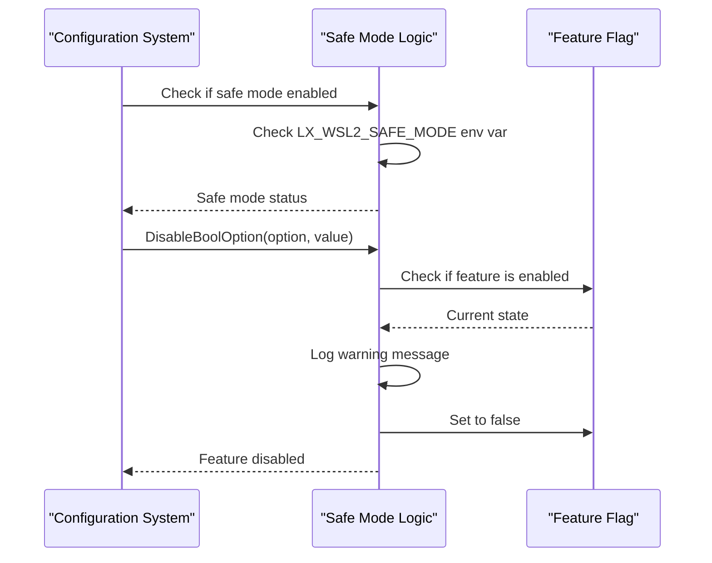

**Diagram sources**
- [WslDistributionConfig.cpp](file://src/linux/init/WslDistributionConfig.cpp#L104-L132)

**Section sources**
- [WslDistributionConfig.cpp](file://src/linux/init/WslDistributionConfig.cpp#L101-L133)

## Troubleshooting Guide

This section provides comprehensive guidance for diagnosing and resolving common configuration issues in WSL.

### Common Configuration Issues

#### Malformed wsl.conf Files

**Problem**: Configuration file syntax errors cause parsing failures.

**Symptoms**:
- Configuration changes not taking effect
- Error messages in system logs
- Default values being used instead of configured values

**Diagnosis Steps**:
1. Check file syntax using validation tools
2. Review system logs for parsing errors
3. Verify file encoding (UTF-8 recommended)
4. Test configuration with minimal valid content

**Resolution**:
```bash
# Test configuration syntax
sudo cat /etc/wsl.conf
# Verify file encoding
file -bi /etc/wsl.conf
# Reset to defaults if corrupted
sudo cp /etc/wsl.conf.bak /etc/wsl.conf 2>/dev/null || echo "Backup not found"
```

#### Conflicting Settings

**Problem**: Multiple configuration sources provide contradictory values.

**Symptoms**:
- Unexpected behavior despite configuration changes
- Settings appearing to be ignored
- Inconsistent behavior across restarts

**Diagnosis**:
1. Check Windows registry settings
2. Verify wsl.conf file location and content
3. Review configuration precedence order
4. Look for duplicate configuration keys

**Resolution**:
```bash
# Check current configuration
wsl --shutdown
wsl --list --verbose
# Reset to known good state
sudo mv /etc/wsl.conf /etc/wsl.conf.backup
sudo touch /etc/wsl.conf
```

#### Permission and Access Issues

**Problem**: Insufficient permissions prevent configuration application.

**Symptoms**:
- Configuration changes not persisting
- Access denied errors in logs
- Configuration files being ignored

**Resolution**:
```bash
# Check file permissions
ls -la /etc/wsl.conf
# Fix permissions if needed
sudo chmod 644 /etc/wsl.conf
sudo chown root:root /etc/wsl.conf
```

### Diagnostic Commands and Tools

#### System Information Collection

```bash
# Gather system information
wsl --status
wsl --list --verbose
uname -a
cat /proc/version
# Check configuration files
ls -la /etc/wsl.conf*
cat /etc/wsl.conf
# Review system logs
journalctl -u wsl
# Check Windows registry
reg query "HKLM\SOFTWARE\Microsoft\WSL"
```

#### Configuration Testing

```bash
# Test configuration without rebooting
wsl --shutdown
# Create minimal test configuration
echo '[wsl2]' | sudo tee /etc/wsl.conf
echo 'memory=2GB' >> /etc/wsl.conf
echo 'processors=2' >> /etc/wsl.conf
# Verify configuration takes effect
wsl --status
```

### Error Message Interpretation

#### Common Error Patterns

| Error Pattern | Meaning | Action Required |
|---------------|---------|-----------------|
| `"Unknown key '` | Invalid configuration key | Check key spelling and supported options |
| `"Invalid boolean "` | Boolean value parsing failed | Use 'true' or 'false' only |
| `"Invalid integer "` | Numeric value parsing failed | Use valid integer format |
| `"Failed to open config file "` | File access issue | Check file permissions and existence |
| `"SAFE MODE ENABLED"` | Safe mode activated | Review configuration for conflicts |

#### Log Analysis

System logs provide valuable diagnostic information:

```bash
# Monitor startup logs
sudo journalctl -u wsl --follow
# Check specific error patterns
sudo journalctl -u wsl | grep -i error
sudo journalctl -u wsl | grep -i config
# Review recent changes
sudo journalctl -u wsl --since "1 hour ago"
```

**Section sources**
- [UnitTests.cpp](file://test/windows/UnitTests.cpp#L1958-L2149)
- [configfile.cpp](file://src/shared/configfile/configfile.cpp#L62-L106)

## Best Practices

### Configuration Management

#### File Organization

- **Separate Concerns**: Use different configuration files for different purposes
- **Version Control**: Track configuration changes in version control systems
- **Documentation**: Comment configuration files with explanations
- **Backup Strategy**: Maintain backups of working configurations

#### Security Considerations

- **Minimal Permissions**: Use least-privilege access controls
- **Secure Defaults**: Start with secure default configurations
- **Audit Trail**: Monitor configuration changes
- **Validation**: Implement input validation for automated configurations

#### Performance Optimization

- **Resource Limits**: Set appropriate memory and CPU limits
- **Mount Optimization**: Configure automount settings for performance
- **Service Management**: Optimize systemd and boot configurations
- **Network Tuning**: Configure network settings for specific use cases

### Deployment Strategies

#### Enterprise Deployment

- **Centralized Management**: Use Windows Group Policy for configuration
- **Template Systems**: Create standardized configuration templates
- **Testing Protocols**: Implement comprehensive testing procedures
- **Rollback Plans**: Maintain ability to revert problematic configurations

#### Development Environments

- **Environment Separation**: Use different configurations for development, staging, production
- **Container Integration**: Coordinate container and WSL configurations
- **CI/CD Integration**: Automate configuration testing in CI/CD pipelines
- **Developer Experience**: Optimize configurations for developer productivity

### Monitoring and Maintenance

#### Configuration Monitoring

- **Change Detection**: Monitor for unauthorized configuration changes
- **Performance Metrics**: Track configuration impact on system performance
- **Compliance Checking**: Verify configurations meet organizational standards
- **Health Checks**: Implement automated health checks for critical configurations

#### Regular Maintenance

- **Review Schedule**: Periodically review and update configurations
- **Documentation Updates**: Keep configuration documentation current
- **Testing Procedures**: Regularly test configuration changes
- **Training Programs**: Ensure team members understand configuration systems