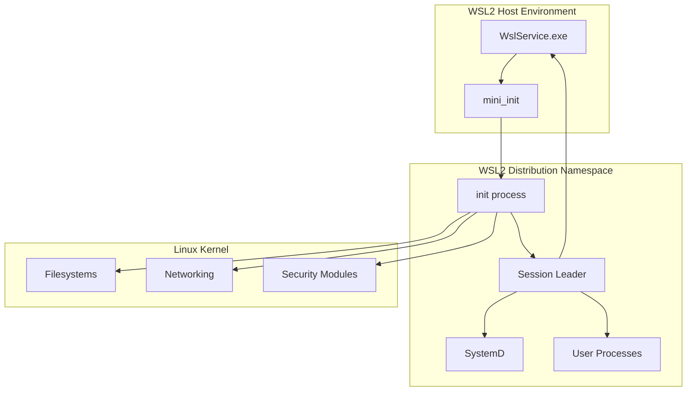
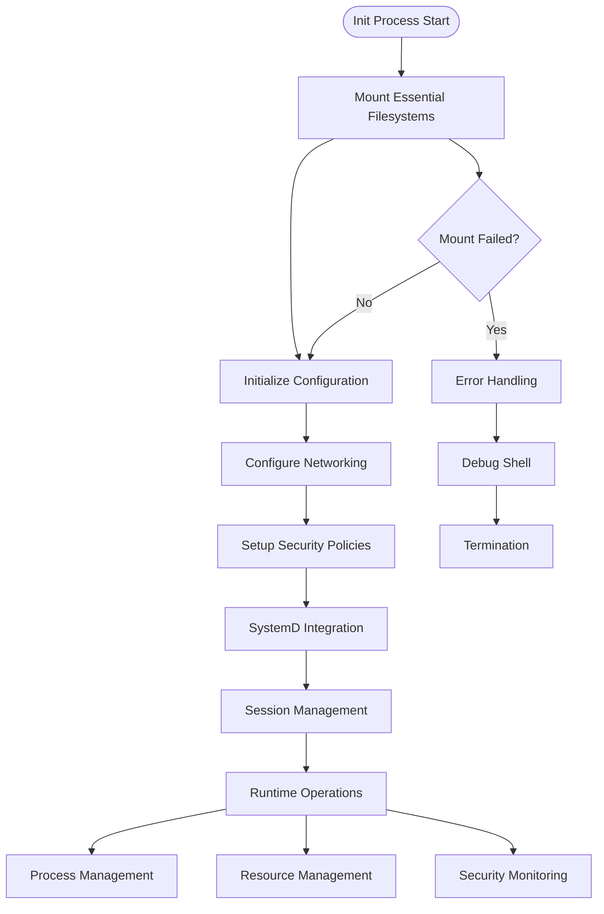
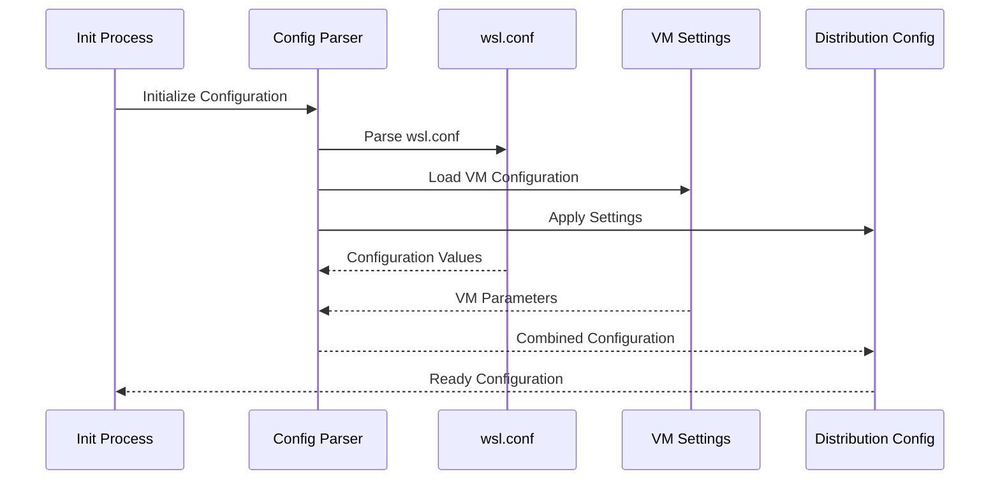
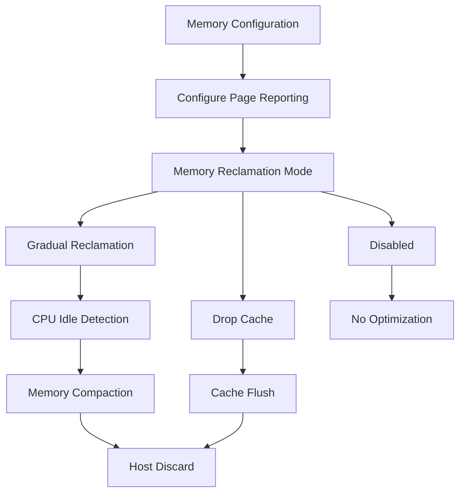
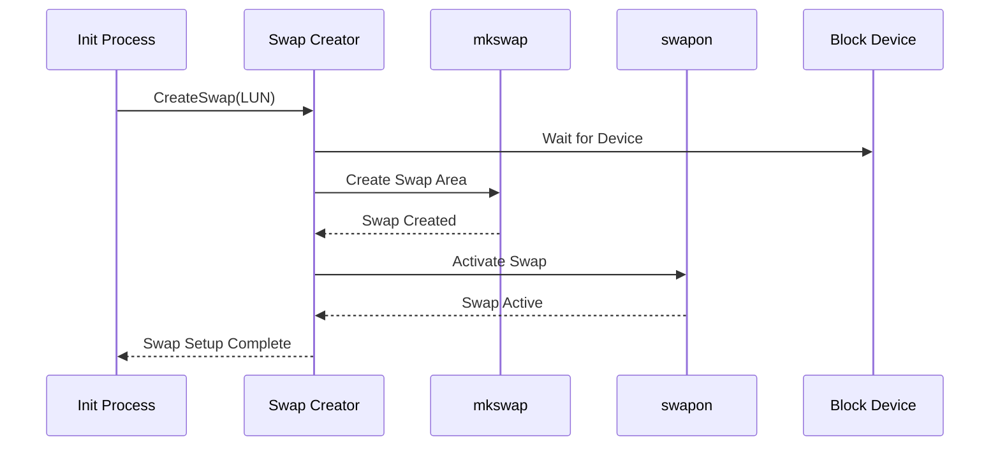
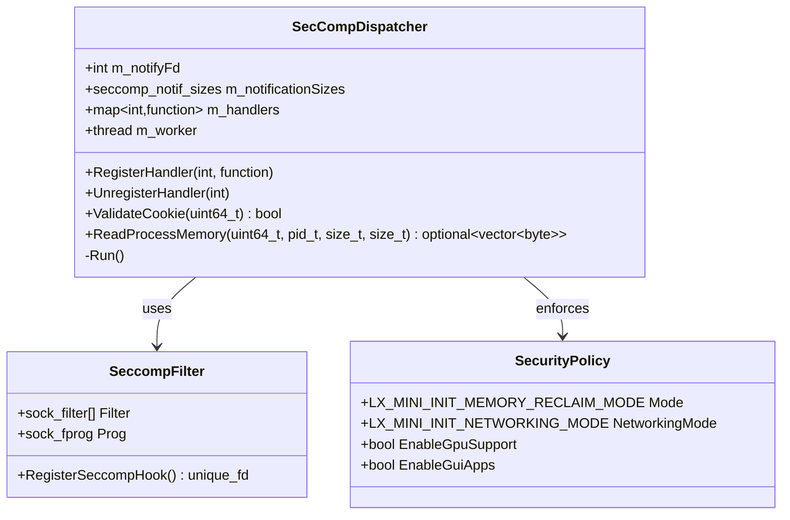
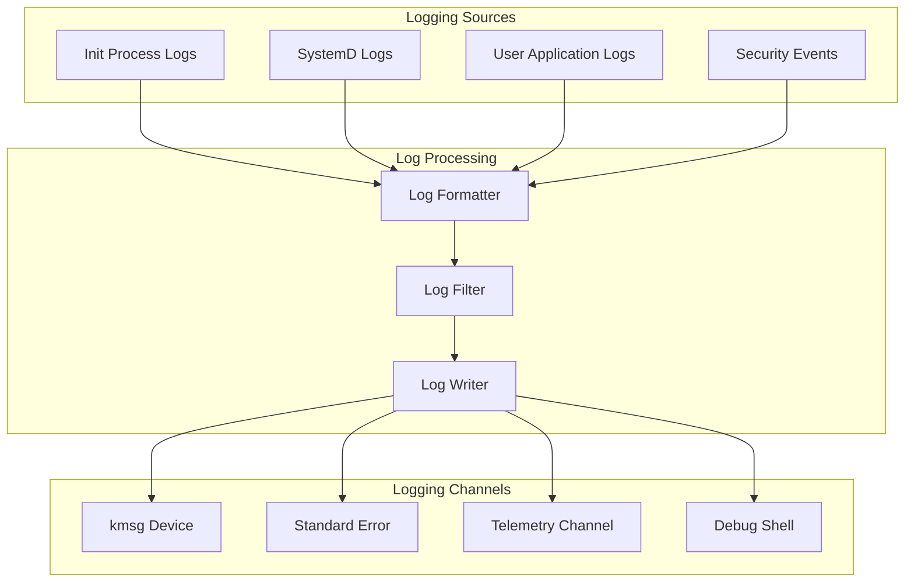
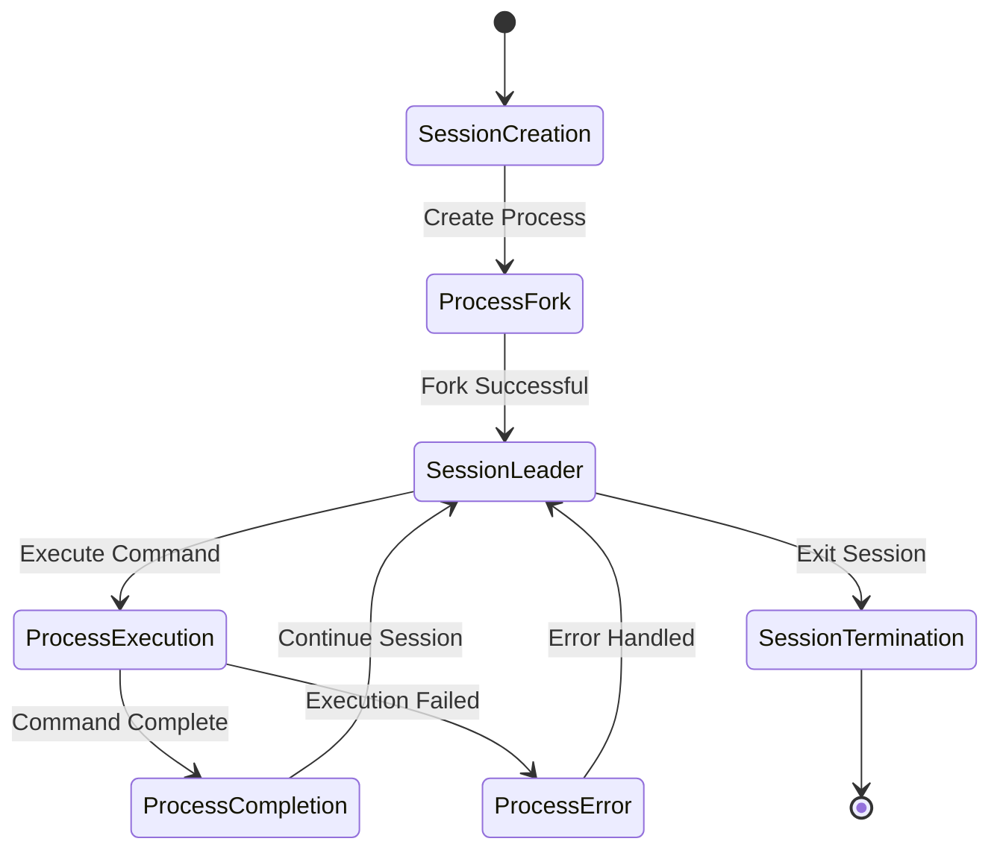
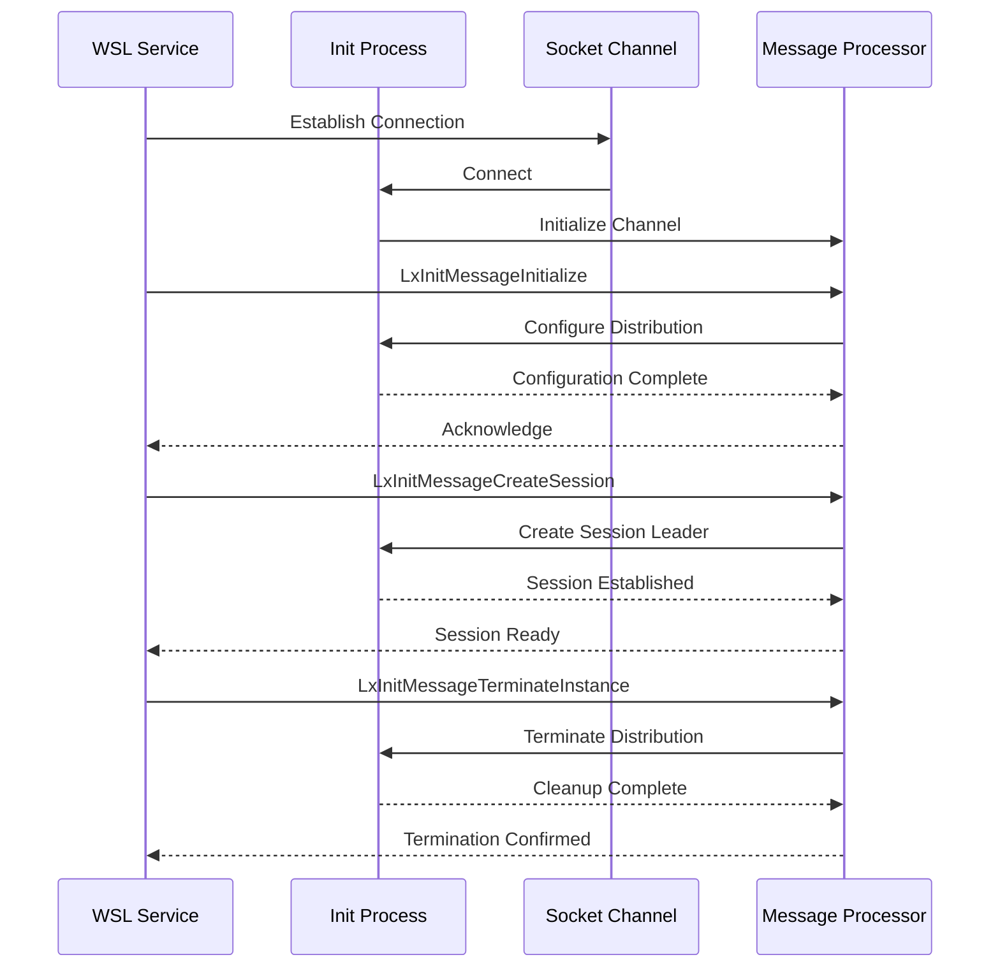
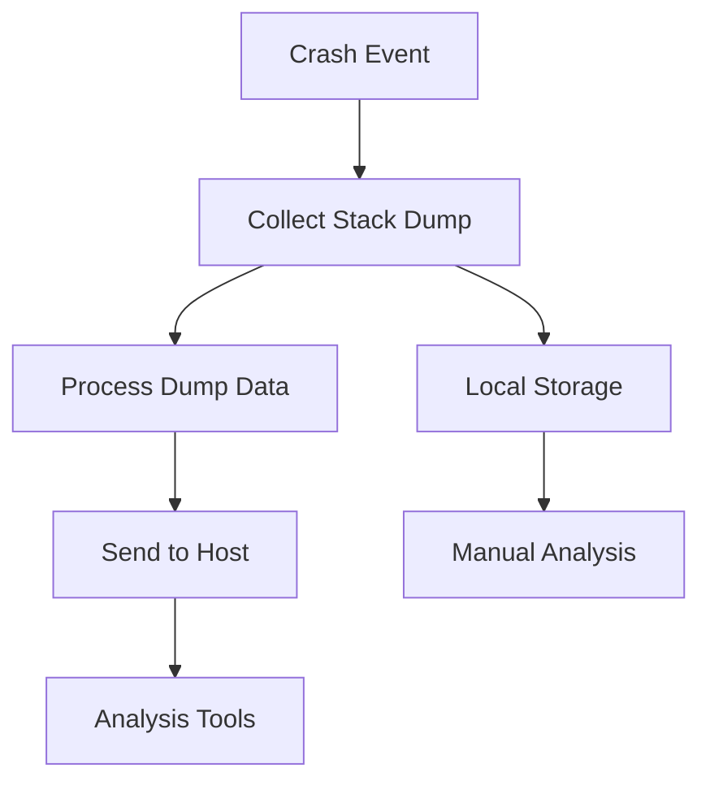

# Initialization Subsystem

<cite>
**Referenced Files in This Document**
- [main.cpp](file://src/linux/init/main.cpp)
- [init.cpp](file://src/linux/init/init.cpp)
- [config.cpp](file://src/linux/init/config.cpp)
- [WslDistributionConfig.cpp](file://src/linux/init/WslDistributionConfig.cpp)
- [common.h](file://src/linux/init/common.h)
- [util.cpp](file://src/linux/init/util.cpp)
- [SecCompDispatcher.cpp](file://src/linux/init/SecCompDispatcher.cpp)
- [SecCompDispatcher.h](file://src/linux/init/SecCompDispatcher.h)
- [message.h](file://src/shared/inc/message.h)
- [SocketChannel.h](file://src/shared/inc/SocketChannel.h)
- [seccomp_defs.h](file://src/linux/inc/seccomp_defs.h)
- [init.md](file://doc/docs/technical-documentation/init.md)
</cite>

## Table of Contents
1. [Introduction](#introduction)
2. [System Architecture Overview](#system-architecture-overview)
3. [Init Process Responsibilities](#init-process-responsibilities)
4. [Configuration Processing Pipeline](#configuration-processing-pipeline)
5. [Critical Initialization Tasks](#critical-initialization-tasks)
6. [Security Hardening and Seccomp Integration](#security-hardening-and-seccomp-integration)
7. [Error Handling and Logging Infrastructure](#error-handling-and-logging-infrastructure)
8. [Distribution Types and Session Management](#distribution-types-and-session-management)
9. [Windows Service Communication](#windows-service-communication)
10. [Debug Shell and Diagnostics](#debug-shell-and-diagnostics)
11. [Troubleshooting Guide](#troubleshooting-guide)
12. [Conclusion](#conclusion)

## Introduction

The WSL2 initialization subsystem serves as the foundational user-space process that orchestrates the boot and runtime environment for Linux distributions within the Windows Subsystem for Linux. As the first process executed in a WSL2 distribution, init plays a critical role in establishing the complete Linux environment, managing system resources, and maintaining secure communication channels with the Windows host.

This subsystem encompasses multiple interconnected components that handle filesystem mounting, network configuration, security enforcement, and distribution lifecycle management. The initialization process is designed to be robust, secure, and efficient, supporting both regular user distributions and system distributions with specialized capabilities.

## System Architecture Overview

The WSL2 initialization subsystem follows a layered architecture that separates concerns between low-level system operations, configuration management, and high-level orchestration.

**Diagram sources**
- [main.cpp](file://src/linux/init/main.cpp#L1-L50)
- [init.cpp](file://src/linux/init/init.cpp#L1-L50)

The architecture implements several key design principles:

- **Namespace Isolation**: Each distribution operates in separate mount, PID, and UTS namespaces
- **Hierarchical Initialization**: Clear separation between early boot tasks and runtime management
- **Secure Communication**: Encrypted channels for host-guest interaction
- **Resource Management**: Centralized control over system resources and security policies

**Section sources**
- [main.cpp](file://src/linux/init/main.cpp#L1-L100)
- [init.md](file://doc/docs/technical-documentation/init.md#L1-L36)

## Init Process Responsibilities

The init process assumes multiple critical responsibilities during the distribution lifecycle, serving as the central coordinator for system initialization and ongoing management.

### Core Responsibilities

**Diagram sources**
- [init.cpp](file://src/linux/init/init.cpp#L100-L200)
- [config.cpp](file://src/linux/init/config.cpp#L1-L100)

### Filesystem Mounting Operations

The initialization process begins with mounting essential Linux filesystems that form the foundation of the distribution environment:

- **/proc**: Virtual filesystem providing process and system information
- **/sys**: System information and device configuration
- **/dev**: Device nodes and special files
- **/run**: Runtime variable data
- **/tmp**: Temporary file storage

These mounts establish the basic Linux environment required for subsequent initialization steps.

### Network Configuration

Network setup involves configuring both the loopback interface and potentially DHCP-enabled interfaces based on distribution configuration. The system supports multiple networking modes including bridged and NAT configurations.

### Security Policy Establishment

Initial security policies are established through seccomp filters, capability restrictions, and namespace isolation settings. These policies form the foundation for the distribution's security posture.

**Section sources**
- [init.cpp](file://src/linux/init/init.cpp#L100-L300)
- [config.cpp](file://src/linux/init/config.cpp#L1-L200)

## Configuration Processing Pipeline

The configuration processing pipeline handles parsing of wsl.conf files and application of VM settings, providing a flexible mechanism for customizing distribution behavior.

### Configuration File Processing

**Diagram sources**
- [WslDistributionConfig.cpp](file://src/linux/init/WslDistributionConfig.cpp#L1-L133)
- [config.cpp](file://src/linux/init/config.cpp#L600-L800)

### Configuration Categories

The configuration system supports multiple categories of settings:

| Category | Purpose | Configuration Options |
|----------|---------|----------------------|
| **Mounting** | Filesystem behavior | automount, automount.root, automount.options |
| **Networking** | Network configuration | network.hostname, network.generateHosts |
| **Interoperability** | Windows integration | interop.enabled, interop.appendWindowsPath |
| **GPU Support** | Graphics acceleration | gpu.enabled, gpu.appendLibPath |
| **GUI Applications** | Desktop environment | guiapps.enabled |
| **System Integration** | SystemD support | boot.systemd, boot.initTimeout |

### Safe Mode Override

The system implements a safe mode override mechanism that disables potentially problematic features when the SAFE_MODE environment variable is set. This provides a fallback mechanism for troubleshooting configuration issues.

**Section sources**
- [WslDistributionConfig.cpp](file://src/linux/init/WslDistributionConfig.cpp#L1-L133)
- [config.cpp](file://src/linux/init/config.cpp#L600-L800)

## Critical Initialization Tasks

The initialization subsystem performs several critical tasks that establish the operational foundation for the distribution.

### Memory Reduction Configuration

Memory reduction is implemented through sophisticated page reporting mechanisms that optimize memory usage between the host and guest systems:

**Diagram sources**
- [main.cpp](file://src/linux/init/main.cpp#L267-L446)

The memory reduction system operates through several modes:

- **Single Page Mode**: Minimal overhead with immediate memory release
- **Gradual Reclamation**: Intelligent memory compaction during idle periods
- **Drop Cache**: Traditional cache flushing approach

### Swap Setup Implementation

Swap space configuration is handled through asynchronous creation processes that utilize the system distribution's utilities:

**Diagram sources**
- [main.cpp](file://src/linux/init/main.cpp#L484-L522)

### Entropy Injection Mechanism

Boot-time entropy injection ensures cryptographic systems have sufficient randomness for secure operations:

The entropy injection process reads entropy data from the Windows host and injects it into the Linux random device, providing immediate cryptographic strength for newly initialized systems.

**Section sources**
- [main.cpp](file://src/linux/init/main.cpp#L267-L522)

## Security Hardening and Seccomp Integration

The initialization subsystem implements comprehensive security measures through seccomp (secure computing) integration and various hardening mechanisms.

### Seccomp Hook Registration

**Diagram sources**
- [SecCompDispatcher.cpp](file://src/linux/init/SecCompDispatcher.cpp#L1-L218)
- [SecCompDispatcher.h](file://src/linux/init/SecCompDispatcher.h#L1-L41)

### Security Features

The seccomp integration provides several security benefits:

- **System Call Filtering**: Restricts access to potentially dangerous system calls
- **Network Interface Control**: Monitors and controls network interface modifications
- **Process Memory Access**: Provides controlled access to process memory for monitoring
- **Architecture-Specific Protection**: Tailored protection for different CPU architectures

### Capability Restrictions

The initialization process implements capability-based security restrictions that limit the privileges available to the distribution:

- **Reduced Capabilities**: Strips unnecessary Linux capabilities
- **Namespace Isolation**: Enforces strict namespace boundaries
- **Resource Limits**: Implements appropriate resource limits
- **Audit Logging**: Comprehensive audit trail for security events

**Section sources**
- [SecCompDispatcher.cpp](file://src/linux/init/SecCompDispatcher.cpp#L1-L218)
- [main.cpp](file://src/linux/init/main.cpp#L3556-L3650)

## Error Handling and Logging Infrastructure

The initialization subsystem implements a comprehensive error handling and logging infrastructure that provides visibility into system operations and facilitates troubleshooting.

### Logging Architecture

**Diagram sources**
- [common.h](file://src/linux/init/common.h#L98-L158)
- [util.cpp](file://src/linux/init/util.cpp#L1-L200)

### Error Handling Patterns

The system implements several error handling patterns:

- **Graceful Degradation**: Non-critical failures don't prevent system operation
- **Fallback Mechanisms**: Alternative approaches when primary methods fail
- **Recovery Procedures**: Automatic recovery from transient failures
- **Diagnostic Information**: Comprehensive error context for troubleshooting

### Log Levels and Categories

The logging system supports multiple log levels and categories:

| Level | Purpose | Usage |
|-------|---------|-------|
| **ERROR** | Critical failures | System unusable conditions |
| **WARNING** | Potentially problematic situations | Non-fatal issues requiring attention |
| **INFO** | General operational information | Normal system operations |
| **DEBUG** | Detailed diagnostic information | Development and troubleshooting |

**Section sources**
- [common.h](file://src/linux/init/common.h#L98-L158)
- [util.cpp](file://src/linux/init/util.cpp#L1-L200)

## Distribution Types and Session Management

The initialization subsystem supports multiple distribution types, each with specialized characteristics and management approaches.

### Regular Distributions

Regular distributions represent standard user installations with typical Linux environments:

- **Standard Filesystem Layout**: Conventional Linux directory structure
- **User Session Management**: Full session leader functionality
- **Application Support**: Complete desktop and application environment
- **Network Integration**: Standard networking capabilities

### System Distributions

System distributions provide enhanced capabilities for system-level operations:

- **Enhanced Privileges**: Extended capabilities for system management
- **Kernel Module Support**: Direct kernel module loading capabilities
- **Advanced Networking**: Specialized networking features
- **Resource Access**: Direct access to system resources

### Session Leader Management

**Diagram sources**
- [init.cpp](file://src/linux/init/init.cpp#L2797-L3095)

The session leader manages process groups, handles signals, and maintains session state. It provides the foundation for interactive shells and long-running applications.

**Section sources**
- [init.cpp](file://src/linux/init/init.cpp#L2797-L3095)
- [main.cpp](file://src/linux/init/main.cpp#L1897-L2611)

## Windows Service Communication

The initialization subsystem maintains bidirectional communication with the Windows service through socket channels, enabling coordinated management of the distribution lifecycle.

### Communication Protocols

**Diagram sources**
- [SocketChannel.h](file://src/shared/inc/SocketChannel.h#L1-L200)
- [message.h](file://src/shared/inc/message.h#L1-L186)

### Message Types

The communication protocol supports various message types for different operational scenarios:

| Message Type | Purpose | Direction |
|--------------|---------|-----------|
| **LxInitMessageInitialize** | Distribution configuration | Windows → Init |
| **LxInitMessageCreateSession** | Session establishment | Windows → Init |
| **LxInitMessageCreateProcess** | Process creation | Windows → Init |
| **LxInitMessageTerminateInstance** | Distribution termination | Windows → Init |
| **LxInitMessageQueryEnvironmentVariable** | Environment queries | Windows → Init |

### Channel Management

The socket channel implementation provides reliable communication with features including:

- **Message Serialization**: Structured message formatting
- **Sequence Numbering**: Message ordering and tracking
- **Error Recovery**: Automatic recovery from communication failures
- **Timeout Handling**: Graceful handling of communication delays

**Section sources**
- [SocketChannel.h](file://src/shared/inc/SocketChannel.h#L1-L200)
- [message.h](file://src/shared/inc/message.h#L1-L186)

## Debug Shell and Diagnostics

The initialization subsystem includes comprehensive debugging and diagnostic capabilities to facilitate troubleshooting and development activities.

### Debug Shell Functionality

The debug shell provides interactive access to the initialization environment:

- **Emergency Access**: Direct access when normal startup fails
- **Configuration Inspection**: Real-time examination of system state
- **Manual Intervention**: Ability to manually execute initialization steps
- **Log Analysis**: Interactive log examination and filtering

### Diagnostic Tools

The system provides various diagnostic tools for troubleshooting:

- **Stack Dump Collection**: Automatic collection of stack traces on crashes
- **Resource Monitoring**: Real-time monitoring of system resources
- **Communication Tracing**: Detailed tracing of host-guest communication
- **Performance Metrics**: Timing and performance data collection

### Crash Dump Collection

**Diagram sources**
- [init.cpp](file://src/linux/init/init.cpp#L402-L451)

The crash dump system captures comprehensive information about system state at the time of failure, enabling effective post-mortem analysis.

**Section sources**
- [init.cpp](file://src/linux/init/init.cpp#L402-L451)
- [main.cpp](file://src/linux/init/main.cpp#L207-L208)

## Troubleshooting Guide

This section provides guidance for diagnosing and resolving common initialization issues.

### Common Issues and Solutions

| Issue | Symptoms | Solution |
|-------|----------|----------|
| **Mount Failures** | Distribution fails to start | Check filesystem permissions and device availability |
| **Network Configuration** | No internet connectivity | Verify network configuration and DHCP settings |
| **Permission Errors** | Access denied messages | Review seccomp filters and capability settings |
| **Configuration Problems** | Unexpected behavior | Validate wsl.conf syntax and settings |
| **Communication Failures** | Service connection issues | Check socket permissions and firewall settings |

### Diagnostic Commands

Essential commands for troubleshooting initialization issues:

- **Check Mount Points**: `cat /proc/mounts` to verify filesystem mounts
- **Inspect Network**: `ip addr show` to check network interface configuration
- **Review Logs**: `journalctl -u wsl` to examine systemd logs
- **Verify Configuration**: `cat /etc/wsl.conf` to review configuration settings
- **Test Communication**: `socat - UNIX-CONNECT:/run/wsl/services.sock` to test service connection

### Performance Optimization

Guidelines for optimizing initialization performance:

- **Reduce Mount Overhead**: Minimize unnecessary filesystem mounts
- **Optimize Network Configuration**: Use appropriate network settings for use case
- **Tune Memory Settings**: Adjust memory reduction parameters based on workload
- **Minimize Debug Logging**: Reduce log verbosity in production environments

## Conclusion

The WSL2 initialization subsystem represents a sophisticated and robust foundation for Linux distribution management within the Windows environment. Through careful orchestration of filesystem mounting, network configuration, security enforcement, and resource management, it provides a reliable platform for diverse Linux workloads.

The modular architecture enables extensibility while maintaining security and stability. The comprehensive error handling and diagnostic capabilities ensure that issues can be effectively identified and resolved. The bidirectional communication with the Windows service facilitates coordinated management of the distribution lifecycle.

Key strengths of the initialization subsystem include:

- **Robust Architecture**: Well-designed separation of concerns and clear responsibility boundaries
- **Security Focus**: Comprehensive security measures including seccomp integration and capability restrictions
- **Flexibility**: Support for multiple distribution types and configuration scenarios
- **Reliability**: Graceful error handling and recovery mechanisms
- **Debuggability**: Extensive logging and diagnostic capabilities

The initialization subsystem continues to evolve to meet the changing needs of Linux developers and system administrators working within the Windows ecosystem. Its design principles and implementation patterns serve as a foundation for future enhancements and extensions.