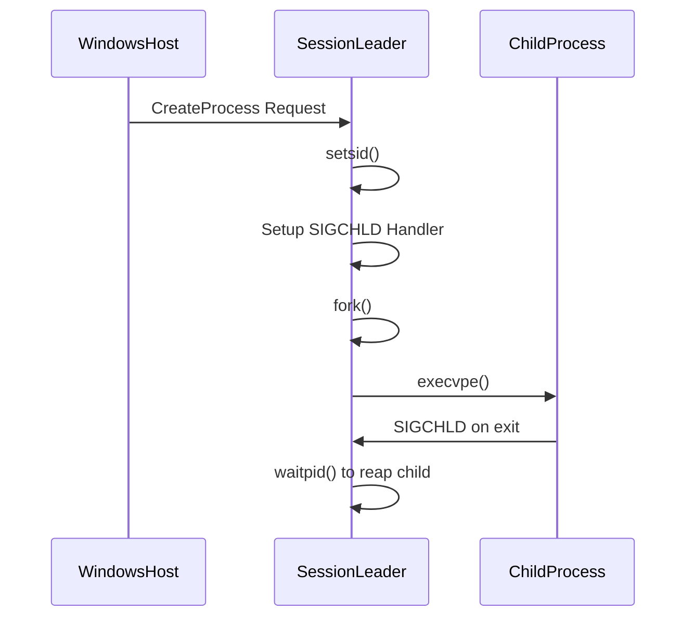
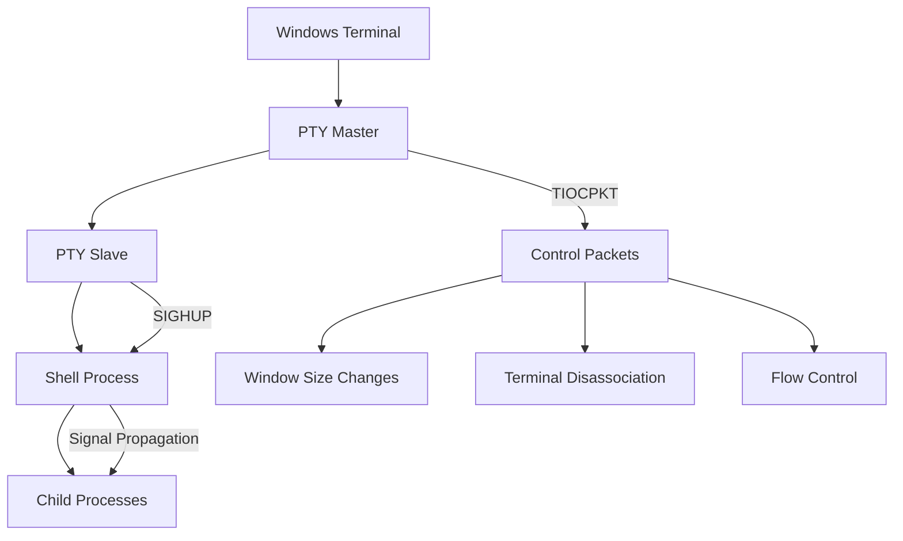
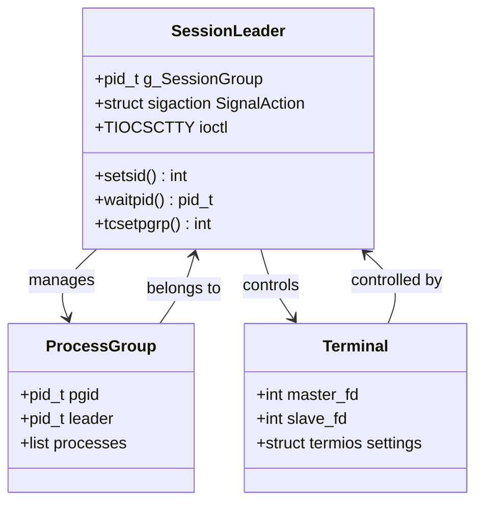
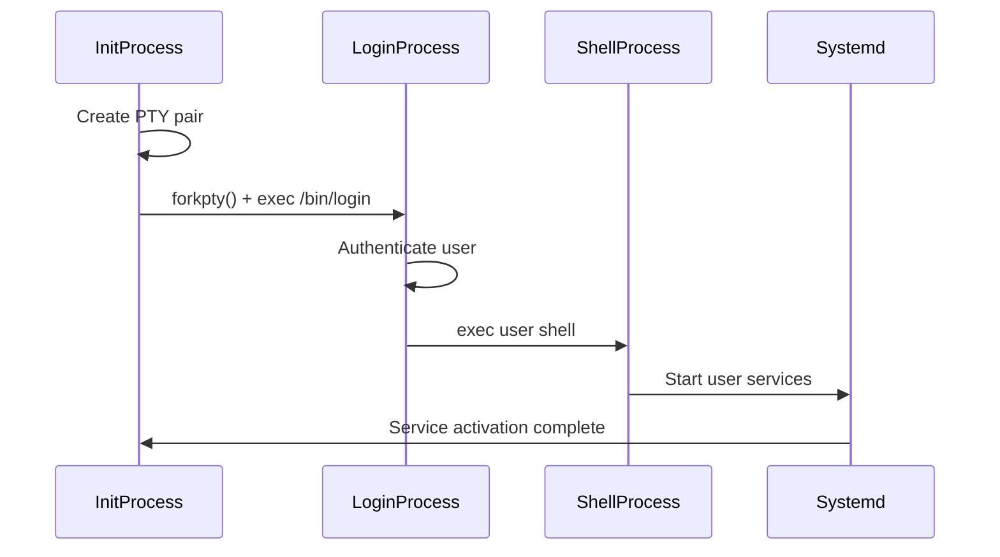
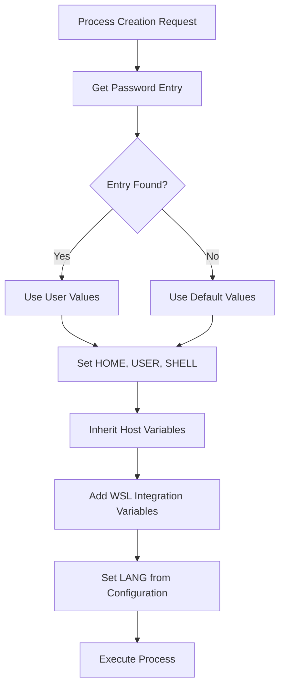
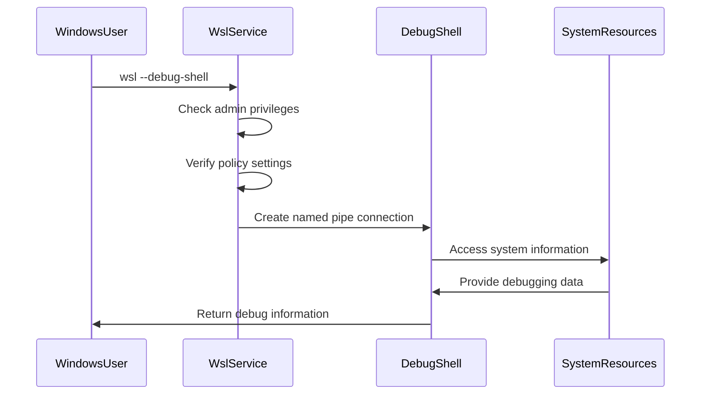

# Process and Session Management

<cite>
**Referenced Files in This Document**   
- [init.cpp](file://src/linux/init/init.cpp)
- [main.cpp](file://src/linux/init/main.cpp)
- [dev_pt.c](file://test/linux/unit_tests/dev_pt.c)
- [dev_pt_2.c](file://test/linux/unit_tests/dev_pt_2.c)
- [config.cpp](file://src/linux/init/config.cpp)
- [util.cpp](file://src/linux/init/util.cpp)
- [common.h](file://src/linux/init/common.h)
</cite>

## Table of Contents
1. [Introduction](#introduction)
2. [Process Launching and Session Leadership](#process-launching-and-session-leadership)
3. [Pseudo-Terminal (PTY) Management](#pseudo-terminal-pty-management)
4. [Session Leader Pattern and Responsibilities](#session-leader-pattern-and-responsibilities)
5. [System Service Initialization](#system-service-initialization)
6. [Environment Variable Setup](#environment-variable-setup)
7. [Signal Handling and Process Group Management](#signal-handling-and-process-group-management)
8. [Debug Shell Launching](#debug-shell-launching)
9. [Common Process Issues and Solutions](#common-process-issues-and-solutions)
10. [Conclusion](#conclusion)

## Introduction
The Windows Subsystem for Linux (WSL) initialization subsystem manages the creation and lifecycle of processes and user sessions within the WSL environment. This document details the process launching mechanism, session management, pseudo-terminal handling, and related components that enable interactive shell sessions and system service initialization. The WSL init process serves as the root process (PID 1) responsible for spawning the session leader, managing PTYs, handling signals, and establishing the user session environment.

**Section sources**
- [init.cpp](file://src/linux/init/init.cpp#L1-L100)
- [main.cpp](file://src/linux/init/main.cpp#L1-L100)

## Process Launching and Session Leadership

The WSL initialization process begins when the init daemon is launched as PID 1. The entry point in `main.cpp` checks if the process is running as init and calls `InitEntry`, which determines whether the system is running in WSL mode or a utility VM and routes accordingly to `InitEntryWsl` or `InitEntryUtilityVm`.

The session leader process is created through the `SessionLeaderEntry` function in `init.cpp`. This function establishes a new session using the `setsid()` system call, which creates a new session and sets the calling process as the session leader. The session leader is responsible for managing the user session, including process lifecycle, signal handling, and terminal control.

When a new session is created, the session leader sets up a signal handler for `SIGCHLD` to monitor child processes. This handler, `SessionLeaderSigchldHandler`, uses `waitpid()` with the `WNOHANG` flag to reap terminated child processes without blocking. The handler specifically tracks when the session group (stored in `g_SessionGroup`) terminates, allowing the session leader to clean up resources appropriately.

The session leader communicates with the Windows host through a message channel, processing requests to create new processes. When a process creation request is received, the session leader spawns the requested process, sets up the appropriate file descriptors, and manages the process lifecycle.



**Diagram sources**
- [init.cpp](file://src/linux/init/init.cpp#L2960-L3159)
- [main.cpp](file://src/linux/init/main.cpp#L2158-L2206)

**Section sources**
- [init.cpp](file://src/linux/init/init.cpp#L2960-L3159)
- [main.cpp](file://src/linux/init/main.cpp#L2158-L2206)

## Pseudo-Terminal (PTY) Management

The WSL initialization subsystem implements comprehensive pseudo-terminal (PTY) management to support interactive shell sessions. PTYs are implemented as master-slave pairs, where the master endpoint is controlled by the terminal emulator (Windows side) and the slave endpoint is used by the shell process (Linux side).

The unit tests in `dev_pt.c` and `dev_pt_2.c` validate the PTY implementation, testing various scenarios including session creation, terminal control, and signal handling. These tests verify that the PTY master and slave endpoints function correctly, including proper handling of control characters, packet mode operations, and terminal disassociation.

Key PTY operations include:
- **Master-Slave Creation**: The `OpenMasterSubordinate` function creates a master-slave PTY pair, with the master endpoint providing control over the terminal and the slave endpoint serving as the TTY for the shell process.
- **Packet Mode**: The master endpoint can be configured in packet mode using `TIOCPKT`, which allows transmission of control information (such as window size changes or terminal disassociation) as special packets.
- **Terminal Control**: The `ioctl` system calls with commands like `TIOCSCTTY` (set controlling terminal) and `TIOCNOTTY` (disassociate from controlling terminal) manage terminal ownership and session relationships.
- **Signal Generation**: Terminal operations can generate signals like `SIGHUP` when the terminal is disconnected, which are delivered to processes in the foreground process group.

The PTY implementation ensures proper isolation between sessions and correct signal delivery to process groups. When a session is terminated, the PTY master sends a hangup signal to the slave, which propagates to all processes in the session.



**Diagram sources**
- [dev_pt.c](file://test/linux/unit_tests/dev_pt.c#L1-L200)
- [dev_pt_2.c](file://test/linux/unit_tests/dev_pt_2.c#L6203-L9011)

**Section sources**
- [dev_pt.c](file://test/linux/unit_tests/dev_pt.c#L1-L200)
- [dev_pt_2.c](file://test/linux/unit_tests/dev_pt_2.c#L6203-L9011)

## Session Leader Pattern and Responsibilities

The session leader in WSL follows the Unix session leader pattern, serving as the root process for a user session with specific responsibilities for process management and resource cleanup. The session leader is created when the init process calls `setsid()`, establishing a new session with the calling process as the session leader.

Key responsibilities of the session leader include:

1. **Process Group Management**: The session leader maintains a reference to the session's process group in the global variable `g_SessionGroup`. This allows tracking of the primary process group for the session, typically the shell and its child processes.

2. **Signal Handling**: The session leader sets up a `SIGCHLD` handler to monitor child processes. This handler uses `waitpid()` with `WNOHANG` to asynchronously reap terminated children without blocking the main event loop.

3. **Terminal Management**: The session leader establishes the controlling terminal for the session using `TIOCSCTTY`. It also manages the foreground process group using `tcsetpgrp()` to ensure proper signal delivery to the active process group.

4. **Resource Cleanup**: When the session leader terminates, it ensures proper cleanup of session resources, including closing file descriptors and terminating child processes.

The session leader pattern ensures proper isolation between different user sessions and provides a clean mechanism for session termination. When the session leader exits, all processes in the session typically receive appropriate signals and terminate, preventing orphaned processes.



**Diagram sources**
- [init.cpp](file://src/linux/init/init.cpp#L2891-L2999)
- [common.h](file://src/linux/init/common.h#L90-L91)

**Section sources**
- [init.cpp](file://src/linux/init/init.cpp#L2891-L2999)
- [common.h](file://src/linux/init/common.h#L90-L91)

## System Service Initialization

The WSL initialization process is responsible for starting essential system services that support the Linux environment. These services include getty, login processes, and other system daemons that provide user authentication and session management.

The `config.cpp` file contains the `CreateLoginSession` function, which is responsible for establishing user login sessions. This function uses `forkpty()` to create a pseudo-terminal and spawn the `/bin/login` process with the `-f` flag for automatic login. The login process authenticates the user and starts the user's shell environment.

System services are initialized in a specific order to ensure proper dependency resolution:
1. **PTY Creation**: A pseudo-terminal is created for the login session
2. **Login Process Spawning**: The `/bin/login` process is spawned on the PTY slave
3. **Session Establishment**: The login process authenticates the user and starts the shell
4. **Environment Setup**: User-specific environment variables and configurations are loaded

The initialization process also handles timeout scenarios, using `RetryWithTimeout` to wait for user services to become active. This ensures that the system doesn't hang indefinitely if a service fails to start properly.



**Diagram sources**
- [config.cpp](file://src/linux/init/config.cpp#L2700-L2780)
- [main.cpp](file://src/linux/init/main.cpp#L4020-L4083)

**Section sources**
- [config.cpp](file://src/linux/init/config.cpp#L2700-L2780)
- [main.cpp](file://src/linux/init/main.cpp#L4020-L4083)

## Environment Variable Setup

The WSL initialization process establishes the environment for user processes by setting up essential environment variables and inheriting appropriate values from the host system. The environment setup occurs in the `CreateProcessCommon` function in `init.cpp`, which is responsible for configuring the execution environment for newly created processes.

Key environment variables established during initialization include:
- **HOME**: Set to the user's home directory from the password entry
- **USER** and **LOGNAME**: Set to the username from the password entry
- **SHELL**: Set to the user's default shell from the password entry
- **PATH**: Configured with standard Linux paths and WSL-specific additions
- **LANG**: Set based on system localization settings
- **WSL-specific variables**: Various WSL environment variables that provide integration with Windows

The environment setup process follows these steps:
1. Retrieve the user's password entry using `getpwuid()`
2. Fall back to default values if the password entry is not found
3. Set standard environment variables from the password entry
4. Inherit select environment variables from the parent process
5. Add WSL-specific environment variables for integration
6. Set the `$LANG` environment variable based on system configuration

The environment block is implemented as a class that manages the collection of environment variables, providing methods to add, retrieve, and convert variables to the format expected by `execvpe()`.



**Diagram sources**
- [init.cpp](file://src/linux/init/init.cpp#L514-L800)
- [config.cpp](file://src/linux/init/config.cpp#L2700-L2780)

**Section sources**
- [init.cpp](file://src/linux/init/init.cpp#L514-L800)
- [config.cpp](file://src/linux/init/config.cpp#L2700-L2780)

## Signal Handling and Process Group Management

The WSL initialization subsystem implements comprehensive signal handling and process group management to ensure proper process lifecycle control and terminal interaction. The system follows Unix process group and session semantics to manage process relationships and signal delivery.

Process groups are managed using the `setpgid()` and `getpgid()` system calls. The session leader maintains a reference to the primary process group in `g_SessionGroup`, allowing it to track the main process group for the session. Process groups enable signal delivery to groups of related processes, such as when a user presses Ctrl+C to interrupt a command pipeline.

Signal handling is implemented through several mechanisms:
- **SIGCHLD Handling**: The session leader sets up a `SIGCHLD` handler to reap terminated child processes. This prevents zombie processes and allows the session leader to track when the main process group terminates.
- **Terminal Signals**: Signals like `SIGHUP`, `SIGINT`, `SIGQUIT`, and `SIGTSTP` are delivered to the foreground process group based on terminal input.
- **Signal Masking**: Critical sections of code may temporarily block signals to prevent interruption during sensitive operations.

The system also handles special cases like job control, where processes can be suspended and resumed using signals. When a process is suspended with `SIGTSTP`, it can be resumed with `SIGCONT`. The session leader ensures proper signal delivery to the correct process groups based on terminal state.

```mermaid
stateDiagram-v2
[*] --> Running
Running --> Suspended : SIGTSTP
Suspended --> Running : SIGCONT
Running --> Terminated : SIGTERM
Running --> Killed : SIGKILL
Running --> CoreDump : SIGQUIT
Suspended --> Terminated : SIGTERM
Suspended --> Killed : SIGKILL
state "Process Group" {
Running : Foreground Process Group
Suspended : Suspended Process Group
}
state "Session State" {
Running : Active Session
Terminated : Session Ended
}
```

**Diagram sources**
- [init.cpp](file://src/linux/init/init.cpp#L2922-L2959)
- [dev_pt.c](file://test/linux/unit_tests/dev_pt.c#L884-L915)

**Section sources**
- [init.cpp](file://src/linux/init/init.cpp#L2922-L2959)
- [dev_pt.c](file://test/linux/unit_tests/dev_pt.c#L884-L915)

## Debug Shell Launching

The WSL initialization subsystem provides a debug shell mechanism for troubleshooting and development purposes. The debug shell allows administrators and developers to access a privileged shell environment for diagnosing issues with the WSL instance.

The debug shell is launched through the `StartDebugShell` function in `main.cpp`, which creates a named pipe for communication between the Windows host and the debug shell process. The debug shell process runs with elevated privileges and provides access to system-level debugging tools.

Key features of the debug shell implementation:
- **Named Pipe Communication**: Uses a named pipe for secure communication between Windows and the debug shell
- **Authentication**: Requires administrator privileges to prevent unauthorized access
- **Policy Control**: Respects system policies that may disable debug shell access
- **Isolation**: Runs in a separate session to prevent interference with regular user sessions

The debug shell can be accessed using the `wsl --debug-shell` command, which connects to the named pipe and provides a shell interface. This shell environment includes debugging tools like `gdb` and system inspection utilities.



**Diagram sources**
- [main.cpp](file://src/linux/init/main.cpp#L3926-L3981)
- [WslClient.cpp](file://src/windows/common/WslClient.cpp#L1459-L1488)

**Section sources**
- [main.cpp](file://src/linux/init/main.cpp#L3926-L3981)
- [WslClient.cpp](file://src/windows/common/WslClient.cpp#L1459-L1488)

## Common Process Issues and Solutions

The WSL initialization subsystem may encounter various process-related issues during operation. Understanding these common issues and their solutions is essential for maintaining system stability and user experience.

### Issue 1: Session Leader Failure to Reap Child Processes
**Symptoms**: Zombie processes accumulate, system resources are consumed
**Cause**: SIGCHLD handler not properly configured or blocked
**Solution**: Ensure the session leader has a proper SIGCHLD handler using SA_SIGINFO flag and regularly calls waitpid() with WNOHANG

### Issue 2: Terminal Disassociation Problems
**Symptoms**: Terminal remains associated after session ends, preventing new sessions
**Cause**: Improper handling of TIOCNOTTY ioctl or process group cleanup
**Solution**: Ensure all processes in the session are terminated before disassociating the terminal, and verify the session leader properly cleans up PTY resources

### Issue 3: Environment Variable Inheritance Issues
**Symptoms**: User processes lack expected environment variables
**Cause**: Environment block not properly constructed or variables not inherited
**Solution**: Verify the CreateProcessCommon function properly populates the environment block and inherits necessary variables from the host

### Issue 4: Process Group ID Conflicts
**Symptoms**: setpgid() fails with EPERM, processes cannot join expected groups
**Cause**: Attempting to change process group of session leader or invalid PGID
**Solution**: Ensure processes are not session leaders when calling setpgid(), and validate PGID values before use

### Issue 5: PTY Master-Slave Synchronization
**Symptoms**: Data corruption, lost input/output, terminal hangs
**Cause**: Race conditions in PTY read/write operations or improper flow control
**Solution**: Implement proper locking around PTY operations and ensure packet mode is correctly handled

The system includes various safeguards to prevent these issues, including comprehensive unit tests in `dev_pt.c` and `dev_pt_2.c` that validate PTY functionality, and robust error handling in the initialization code.

**Section sources**
- [dev_pt.c](file://test/linux/unit_tests/dev_pt.c#L1-L200)
- [dev_pt_2.c](file://test/linux/unit_tests/dev_pt_2.c#L1186-L1390)
- [init.cpp](file://src/linux/init/init.cpp#L2891-L2999)

## Conclusion
The WSL initialization subsystem implements a robust process and session management system that enables seamless integration between Windows and Linux environments. The init process serves as the foundation for user sessions, spawning the session leader, managing pseudo-terminals, and establishing the execution environment for user processes.

Key components of the system include the session leader pattern, which provides structured process lifecycle management; comprehensive PTY implementation for terminal emulation; and proper signal handling for process control. The system also handles essential services like user authentication, environment setup, and debug shell access.

Understanding these mechanisms is crucial for developers and administrators working with WSL, as it provides insight into process behavior, troubleshooting strategies, and optimization opportunities. The modular design and comprehensive testing ensure reliability and maintainability of the initialization subsystem.