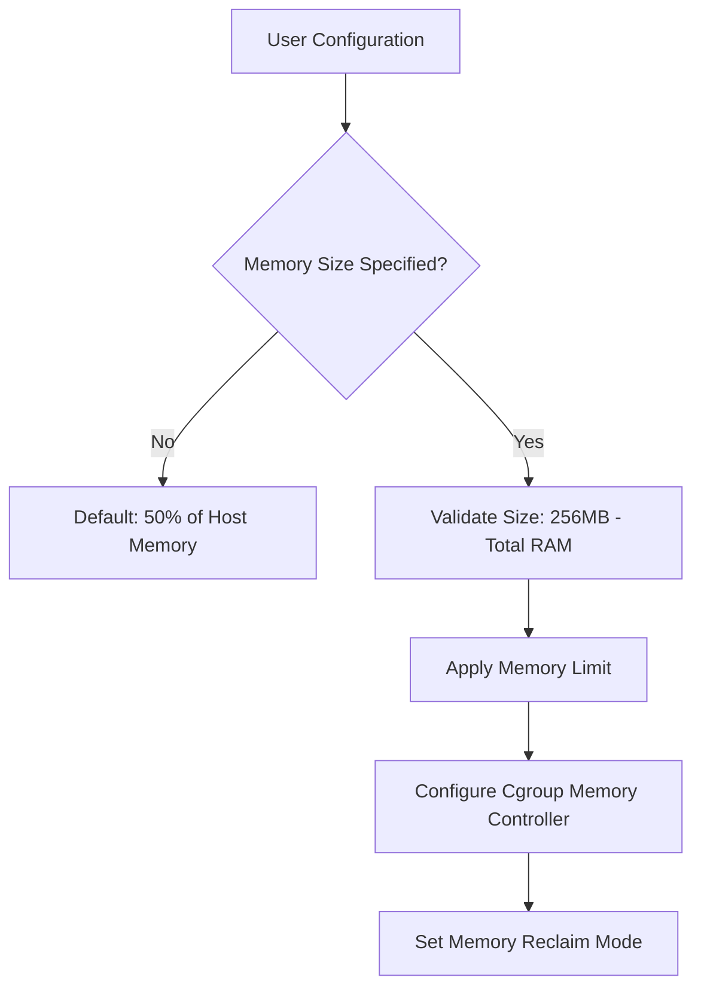
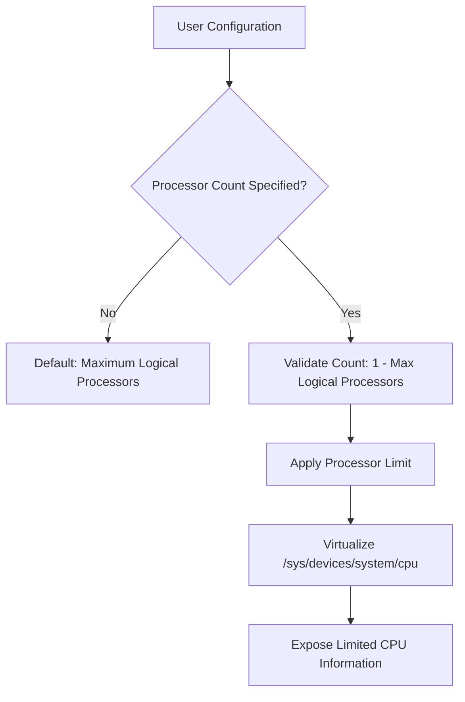
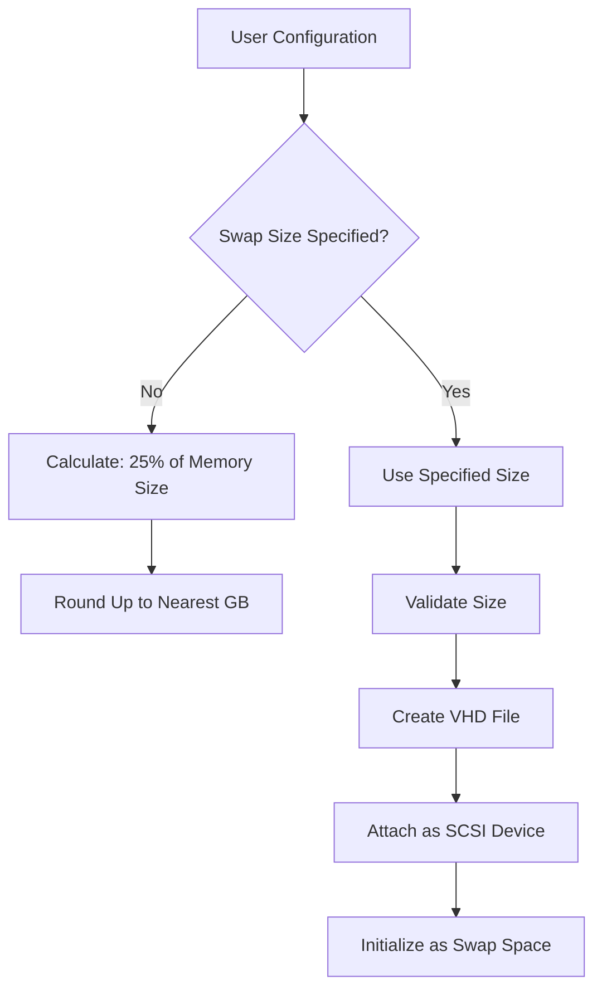
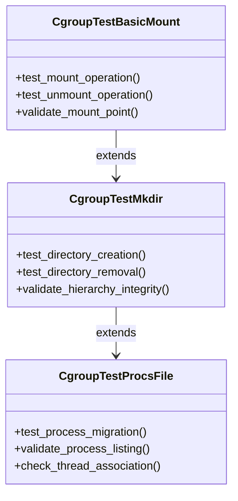
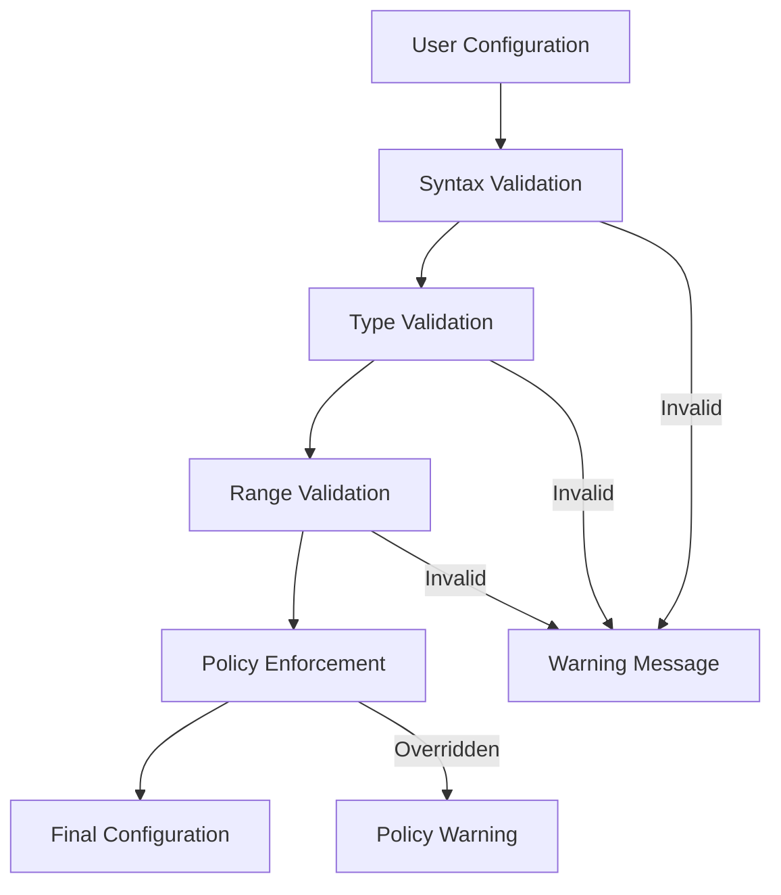

# Resource Configuration

<cite>
**Referenced Files in This Document**   
- [WslCoreConfig.cpp](file://src\windows\common\WslCoreConfig.cpp)
- [WslCoreConfig.h](file://src\windows\common\WslCoreConfig.h)
- [main.cpp](file://src\linux\init\main.cpp)
- [config.cpp](file://src\linux\init\config.cpp)
- [cgroup.c](file://test\linux\unit_tests\cgroup.c)
- [sysfs.c](file://test\linux\unit_tests\sysfs.c)
- [MemAndProcViewModel.cs](file://src\windows\wslsettings\ViewModels\Settings\MemAndProcViewModel.cs)
- [WslCoreVm.cpp](file://src\windows\service\exe\WslCoreVm.cpp)
</cite>

## Table of Contents
1. [Introduction](#introduction)
2. [Resource Configuration Overview](#resource-configuration-overview)
3. [Memory Configuration](#memory-configuration)
4. [CPU Configuration](#cpu-configuration)
5. [Swap Configuration](#swap-configuration)
6. [Cgroup Implementation](#cgroup-implementation)
7. [Sysfs Virtualization](#sysfs-virtualization)
8. [Configuration Validation](#configuration-validation)
9. [Performance Considerations](#performance-considerations)
10. [Best Practices](#best-practices)

## Introduction
This document provides a comprehensive analysis of the resource configuration phase during WSL initialization. It details how the init process establishes memory limits, CPU constraints, and swap space based on wsl.conf and user settings. The implementation covers memory reduction techniques, cgroup setup for resource isolation, processor affinity enforcement through sysfs virtualization, and swap file creation. The document also explains configuration validation and application during VM startup, along with performance implications and best practices.

## Resource Configuration Overview
The WSL resource configuration process begins during VM initialization and involves multiple components working together to establish the appropriate resource constraints. The configuration is driven by user settings from wsl.conf and .wslconfig files, which are validated and applied through a coordinated process between Windows and Linux components.

The configuration flow follows this sequence:
1. User settings are read from configuration files
2. Windows-side validation and policy enforcement
3. VM resource allocation based on validated settings
4. Linux-side initialization of cgroups and sysfs virtualization
5. Application of memory reduction techniques and swap configuration

This process ensures that resource constraints are properly enforced while maintaining compatibility with Linux expectations for system interfaces.

**Section sources**
- [WslCoreConfig.cpp](file://src\windows\common\WslCoreConfig.cpp#L291-L342)
- [main.cpp](file://src\linux\init\main.cpp#L106-L116)

## Memory Configuration
Memory configuration in WSL is implemented through a combination of VM-level allocation and Linux cgroup-based memory management. The process begins with the Windows component determining the appropriate memory allocation based on user settings and system constraints.

When no memory size is specified by the user, WSL defaults to allocating 50% of the host's physical memory. If a specific value is provided, it is validated to ensure it falls within reasonable bounds (minimum 256MB, maximum total system memory):



**Diagram sources**
- [WslCoreConfig.cpp](file://src\windows\common\WslCoreConfig.cpp#L304-L318)

The Linux init process configures memory reduction techniques through the `ConfigureMemoryReduction` function, which accepts a page reporting order and memory reclaim mode. The page reporting order determines the size of cold discard hints using the formula: 2^PageReportingOrder * PAGE_SIZE (e.g., 2^9 * 4096 = 2MB).

Two memory reclaim modes are supported:
- **Gradual**: Periodically checks if the VM is idle and performs memory compaction to maximize pages that can be discarded to the host
- **DropCache**: Falls back to writing to `/proc/sys/vm/drop_caches` when the cgroup path is not available

The memory reduction worker thread runs with idle scheduling priority and checks CPU usage every 30 seconds. Memory compaction occurs when CPU utilization is below the idle threshold (0.5% over 30 seconds).

**Section sources**
- [WslCoreConfig.cpp](file://src\windows\common\WslCoreConfig.cpp#L304-L318)
- [main.cpp](file://src\linux\init\main.cpp#L267-L422)

## CPU Configuration
CPU configuration in WSL involves setting processor count limits and enforcing processor affinity through sysfs virtualization. The Windows component determines the maximum number of processors that can be added to the VM, which is based on the host's logical processor count.

When no processor count is specified by the user, WSL uses the maximum available processors. If a specific value is provided, it is validated to ensure it does not exceed the system's logical processor count:



**Diagram sources**
- [WslCoreConfig.cpp](file://src\windows\common\WslCoreConfig.cpp#L291-L302)

The sysfs virtualization component exposes CPU information through the `/sys/devices/system/cpu` directory. This virtualization presents a filtered view of CPU information that reflects the configured processor limits. The implementation includes:

- `present` file: Indicates which CPUs are available (e.g., "0-11" for 12 processors)
- `possible` file: Lists CPUs that could be available
- Individual CPU directories (cpu0, cpu1, etc.) up to the configured limit
- Topology information for each exposed CPU

This virtualization ensures that Linux applications see a consistent view of available processors that matches the VM's actual resource allocation.

**Section sources**
- [WslCoreConfig.cpp](file://src\windows\common\WslCoreConfig.cpp#L291-L302)
- [sysfs.c](file://test\linux\unit_tests\sysfs.c#L164-L291)

## Swap Configuration
Swap configuration in WSL involves creating and managing a virtual hard disk (VHD) that serves as swap space for the Linux VM. The process begins with the Windows component determining the appropriate swap size based on user settings and system heuristics.

When no swap size is specified by the user, WSL uses a heuristic based on Red Hat and Ubuntu recommendations, setting the swap size to 25% of the allocated memory size, rounded up to the nearest GB:



**Diagram sources**
- [WslCoreConfig.cpp](file://src\windows\common\WslCoreConfig.cpp#L320-L327)
- [WslCoreVm.cpp](file://src\windows\service\exe\WslCoreVm.cpp#L490-L537)

The swap file is created as a VHDX file in the user's temporary directory if no specific path is provided. The file is created with an additional page of overhead to account for swap metadata. If the file already exists, it is resized to match the required size.

Once the VHD is created and attached to the VM, the Linux init process configures it as swap space using the `CreateSwap` function. This process runs asynchronously using the `mkswap` and `swapon` utilities to avoid blocking the initialization process:

```cpp
void CreateSwap(unsigned int Lun)
{
    UtilCreateChildProcess("CreateSwap", [Lun]() {
        std::string DevicePath = GetLunDevicePath(Lun);
        WaitForBlockDevice(DevicePath.c_str());
        std::string CommandLine = std::format("/usr/sbin/mkswap '{}'", DevicePath);
        THROW_LAST_ERROR_IF(UtilExecCommandLine(CommandLine.c_str(), nullptr) < 0);
        CommandLine = std::format("/usr/sbin/swapon '{}'", DevicePath);
        UtilExecCommandLine(CommandLine.c_str(), nullptr);
    });
}
```

**Section sources**
- [WslCoreConfig.cpp](file://src\windows\common\WslCoreConfig.cpp#L320-L327)
- [WslCoreVm.cpp](file://src\windows\service\exe\WslCoreVm.cpp#L490-L537)
- [main.cpp](file://src\linux\init\main.cpp#L484-L521)

## Cgroup Implementation
Cgroup implementation in WSL provides resource isolation and accounting for the Linux VM. The init process configures cgroups based on the kernel's supported features, with support for both cgroup v1 and v2 hierarchies.

The cgroup initialization process begins by checking the kernel command line for cgroup configuration directives. If cgroup v1 is disabled via the `cgroup_no_v1=all` parameter, the system falls back to cgroup v2. Otherwise, specific controllers can be disabled by listing them in the parameter.

For cgroup v1, WSL mounts a tmpfs at the cgroup mount point and sets up the necessary controller hierarchies. The implementation includes comprehensive unit tests that validate:

- Basic mount and unmount operations
- Directory creation and removal within cgroup hierarchies
- Thread behavior with cgroup mounts
- Procfs file behavior (/proc/cgroups, /proc/self/cgroup)
- Cgroup.procs file behavior for process migration
- Mount reuse and subsystem-specific functionality



**Diagram sources**
- [config.cpp](file://src\linux\init\config.cpp#L1813-L1845)
- [cgroup.c](file://test\linux\unit_tests\cgroup.c#L144-L210)

The cgroup implementation supports the devices subsystem, which controls access to device files. The default configuration allows read, write, and mknod operations on all devices (represented by the rule "a *:* rwm"). This provides flexibility while maintaining security boundaries.

**Section sources**
- [config.cpp](file://src\linux\init\config.cpp#L1813-L1845)
- [cgroup.c](file://test\linux\unit_tests\cgroup.c#L84-L1070)

## Sysfs Virtualization
Sysfs virtualization in WSL provides a filtered view of system information that reflects the VM's resource configuration. This virtualization ensures that Linux applications see a consistent view of system resources that matches the VM's actual allocation.

The implementation virtualizes several key sysfs directories:

- `/sys/devices/system/cpu`: CPU information filtered to show only allocated processors
- `/sys/class/net`: Network interface information
- `/sys/devices/virtual/net`: Virtual network device information
- `/sys/kernel/debug`: Kernel debugging interfaces

```mermaid
flowchart TD
A[Physical Host] --> B[Sysfs Virtualization Layer]
B --> C[/sys/devices/system/cpu]
B --> D[/sys/class/net]
B --> E[/sys/devices/virtual/net]
B --> F[/sys/kernel/debug]
C --> G[Exposed CPUs: 0-N]
D --> H[Network Interfaces]
E --> I[Virtual Network Devices]
F --> J[Debugging Interfaces]
```

**Diagram sources**
- [sysfs.c](file://test\linux\unit_tests\sysfs.c#L50-L85)

The CPU virtualization component exposes information about the allocated processors, including topology details such as core ID, physical package ID, and thread siblings. This allows Linux applications to make informed decisions about thread placement and affinity.

The network virtualization component exposes loopback interface information, ensuring that network applications function correctly within the VM environment.

**Section sources**
- [sysfs.c](file://test\linux\unit_tests\sysfs.c#L50-L291)

## Configuration Validation
Configuration validation in WSL occurs at multiple levels, ensuring that user settings are properly formatted, within acceptable ranges, and compliant with system policies.

The validation process includes:

1. **Syntax validation**: Checking for proper INI file format, valid section names, and correct key-value syntax
2. **Type validation**: Ensuring values match expected types (integers, booleans, memory strings)
3. **Range validation**: Verifying values fall within acceptable ranges
4. **Policy enforcement**: Applying machine-wide policies that may override user settings



**Diagram sources**
- [WslCoreConfig.cpp](file://src\windows\common\WslCoreConfig.cpp#L329-L342)
- [UnitTests.cpp](file://test\windows\UnitTests.cpp#L1955-L2144)

The system validates memory strings using standard suffixes (K, M, G, T) and ensures processor counts do not exceed the system's logical processor count. Duplicate configuration keys generate warnings, and invalid values are rejected with descriptive error messages.

Policy enforcement allows administrators to disable specific configuration options through group policy. When a setting is disabled by policy, the system emits a warning message but continues initialization with default values.

**Section sources**
- [WslCoreConfig.cpp](file://src\windows\common\WslCoreConfig.cpp#L329-L342)
- [UnitTests.cpp](file://test\windows\UnitTests.cpp#L1955-L2144)
- [PolicyTests.cpp](file://test\windows\PolicyTests.cpp#L234-L270)

## Performance Considerations
The resource configuration choices in WSL have significant performance implications that should be carefully considered:

**Memory Configuration:**
- Allocating too much memory can impact host system performance
- Insufficient memory may lead to excessive swapping and reduced performance
- The gradual memory reclaim mode provides better performance under load by proactively compacting memory

**CPU Configuration:**
- Allocating more processors than needed wastes resources
- Too few processors can create bottlenecks for CPU-intensive workloads
- The default of using all available processors generally provides the best performance

**Swap Configuration:**
- Larger swap files provide more headroom for memory-intensive applications
- Swap performance depends on the underlying storage medium
- The asynchronous initialization prevents boot delays

The optimal configuration depends on the specific workload. For development environments with multiple services, allocating 50-75% of available memory and most available processors typically provides the best balance of performance and resource utilization.

**Section sources**
- [WslCoreConfig.cpp](file://src\windows\common\WslCoreConfig.cpp#L291-L327)
- [main.cpp](file://src\linux\init\main.cpp#L267-L422)

## Best Practices
Based on the WSL resource configuration implementation, the following best practices are recommended:

1. **Memory Settings:**
   - For development environments: Allocate 50-75% of host memory
   - For lightweight containers: 2-4GB is typically sufficient
   - Monitor memory usage and adjust as needed

2. **CPU Settings:**
   - Generally use the default (all available processors)
   - For specialized workloads, allocate based on actual requirements
   - Avoid over-allocation that could impact host performance

3. **Swap Settings:**
   - Allow the system to calculate swap size automatically (25% of memory)
   - For memory-intensive applications, consider increasing swap size
   - Ensure adequate disk space for swap files

4. **Configuration Management:**
   - Use .wslconfig for global settings
   - Use wsl.conf for distribution-specific settings
   - Test configuration changes thoroughly

5. **Performance Monitoring:**
   - Monitor both WSL and host system performance
   - Adjust resource allocation based on actual usage patterns
   - Consider workload requirements when configuring resources

These practices ensure optimal performance while maintaining system stability and resource efficiency.

**Section sources**
- [WslCoreConfig.cpp](file://src\windows\common\WslCoreConfig.cpp#L291-L342)
- [main.cpp](file://src\linux\init\main.cpp#L267-L422)
- [WslCoreVm.cpp](file://src\windows\service\exe\WslCoreVm.cpp#L490-L537)