# Service Lifecycle Management

<cite>
**Referenced Files in This Document**
- [ServiceMain.cpp](file://src/windows/service/exe/ServiceMain.cpp)
- [LxssUserSessionFactory.cpp](file://src/windows/service/exe/LxssUserSessionFactory.cpp)
- [LxssUserSessionFactory.h](file://src/windows/service/exe/LxssUserSessionFactory.h)
- [LxssUserSession.cpp](file://src/windows/service/exe/LxssUserSession.cpp)
- [LxssUserSession.h](file://src/windows/service/exe/LxssUserSession.h)
- [LxssIpTables.cpp](file://src/windows/service/exe/LxssIpTables.cpp)
- [LxssIpTables.h](file://src/windows/service/exe/LxssIpTables.h)
- [WslCoreInstance.cpp](file://src/windows/service/exe/WslCoreInstance.cpp)
- [WslCoreVm.cpp](file://src/windows/service/exe/WslCoreVm.cpp)
- [WslCoreVm.h](file://src/windows/service/exe/WslCoreVm.h)
- [lxssclient.cpp](file://src/windows/common/lxssclient.cpp)
- [lxssclient.h](file://src/windows/inc/lxssclient.h)
- [WslSecurity.cpp](file://src/windows/common/WslSecurity.cpp)
- [comservicehelper.h](file://src/windows/inc/comservicehelper.h)
- [RegistryWatcher.h](file://src/windows/inc/RegistryWatcher.h)
- [precomp.h](file://src/windows/common/precomp.h)
</cite>

## Table of Contents
1. [Introduction](#introduction)
2. [Service Architecture Overview](#service-architecture-overview)
3. [WslService Class Implementation](#wslservice-class-implementation)
4. [Service Startup and Initialization](#service-startup-and-initialization)
5. [Policy Evaluation and Management](#policy-evaluation-and-management)
6. [COM-Based Activation Model](#com-based-activation-model)
7. [Session Change Handling](#session-change-handling)
8. [Process Mitigation Policies](#process-mitigation-policies)
9. [Registry Watcher Mechanism](#registry-watcher-mechanism)
10. [Update Checking Timer](#update-checking-timer)
11. [User Session and VM Lifetime Management](#user-session-and-vm-lifetime-management)
12. [Resource Cleanup and Teardown](#resource-cleanup-and-teardown)
13. [Crash and Power Loss Handling](#crash-and-power-loss-handling)
14. [Concurrent Access Management](#concurrent-access-management)
15. [Security Considerations](#security-considerations)
16. [Driver Connectivity](#driver-connectivity)
17. [Troubleshooting Guide](#troubleshooting-guide)
18. [Conclusion](#conclusion)

## Introduction

The WSL (Windows Subsystem for Linux) service lifecycle management is a sophisticated system that orchestrates the complete operational lifecycle of WSL instances on Windows. The service manages everything from initial startup and policy evaluation to runtime session management, resource cleanup, and graceful shutdown procedures. This comprehensive system ensures reliable operation across multiple user sessions, handles dynamic policy changes, and maintains system stability during various failure scenarios.

The service operates as a Windows service with COM-based activation, providing a robust foundation for WSL functionality. It implements advanced patterns for managing user sessions, VM instances, networking resources, and system-wide configurations while maintaining security boundaries and handling concurrent access from multiple users.

## Service Architecture Overview

The WSL service follows a layered architecture that separates concerns between service management, session handling, and resource management. The core service architecture is built around the WslService class, which inherits from a templated service framework that provides COM activation capabilities.

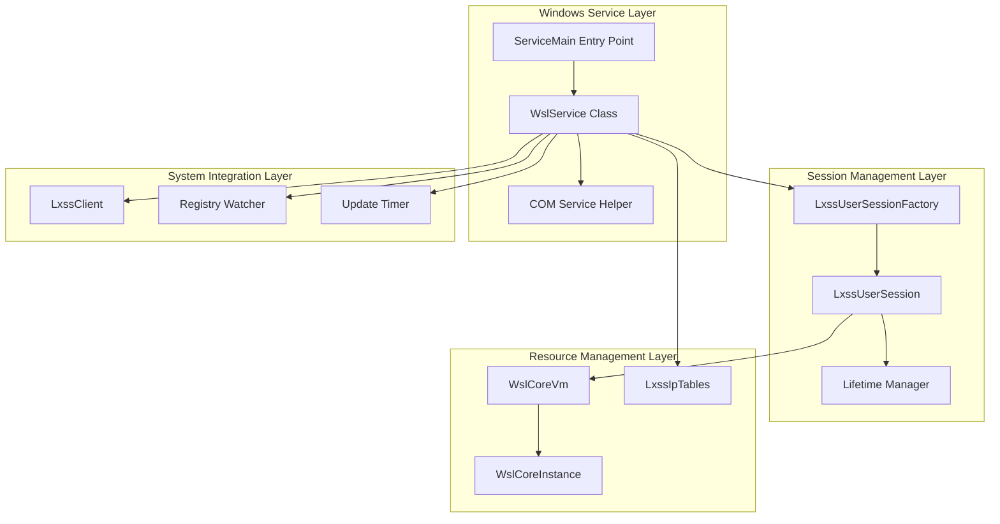

**Diagram sources**
- [ServiceMain.cpp](file://src/windows/service/exe/ServiceMain.cpp#L45-L73)
- [comservicehelper.h](file://src/windows/inc/comservicehelper.h#L340-L357)

The architecture implements several key design patterns:

- **Factory Pattern**: LxssUserSessionFactory manages session creation and lifecycle
- **Singleton Pattern**: WslService ensures single service instance
- **Observer Pattern**: Registry watcher responds to policy changes
- **Template Method Pattern**: Service lifecycle hooks for different behaviors

**Section sources**
- [ServiceMain.cpp](file://src/windows/service/exe/ServiceMain.cpp#L45-L73)
- [LxssUserSessionFactory.h](file://src/windows/service/exe/LxssUserSessionFactory.h#L21-L35)

## WslService Class Implementation

The WslService class serves as the central orchestrator for the WSL service lifecycle. It inherits from a templated service framework that provides COM activation capabilities and implements the Windows service control model.

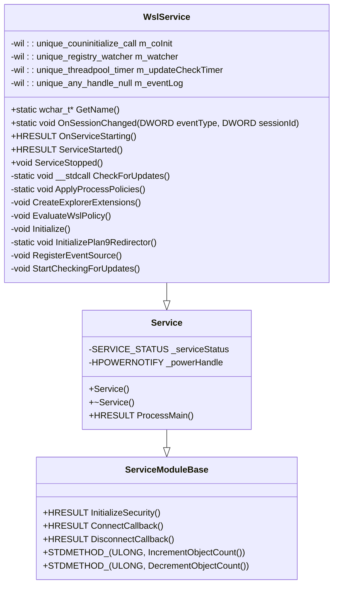

**Diagram sources**
- [ServiceMain.cpp](file://src/windows/service/exe/ServiceMain.cpp#L45-L73)
- [comservicehelper.h](file://src/windows/inc/comservicehelper.h#L340-L357)

The WslService class implements several critical lifecycle methods:

- **GetName()**: Returns the service name for Windows service management
- **OnServiceStarting()**: Performs initialization tasks before service becomes available
- **ServiceStarted()**: Handles post-initialization setup and resource allocation
- **ServiceStopped()**: Manages cleanup and resource deallocation during shutdown

**Section sources**
- [ServiceMain.cpp](file://src/windows/service/exe/ServiceMain.cpp#L45-L73)

## Service Startup and Initialization

The service startup process follows a carefully orchestrated sequence that ensures proper initialization of all subsystems before becoming available to clients.

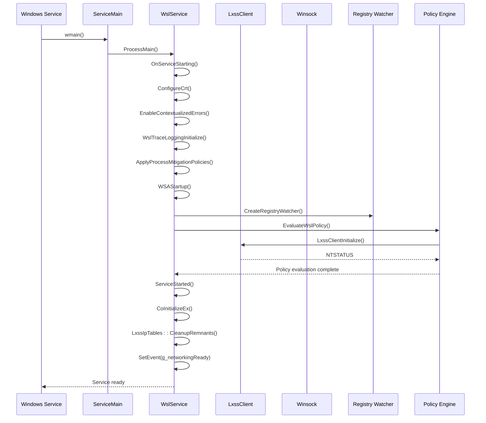

**Diagram sources**
- [ServiceMain.cpp](file://src/windows/service/exe/ServiceMain.cpp#L155-L220)

The initialization sequence includes several critical steps:

1. **CRT Configuration**: Configures the C Runtime environment for WSL operations
2. **Error Contextualization**: Enables detailed error reporting for debugging
3. **Telemetry Initialization**: Sets up logging infrastructure for monitoring
4. **Process Mitigation**: Applies security policies to protect against exploits
5. **Winsock Initialization**: Prepares network stack for WSL operations
6. **Registry Watching**: Establishes policy change monitoring
7. **Driver Connection**: Initializes communication with LxCore driver

**Section sources**
- [ServiceMain.cpp](file://src/windows/service/exe/ServiceMain.cpp#L155-L220)

## Policy Evaluation and Management

The service implements comprehensive policy evaluation to enforce enterprise and user-defined restrictions on WSL functionality. The policy system operates through a hierarchical evaluation process that considers multiple policy sources.

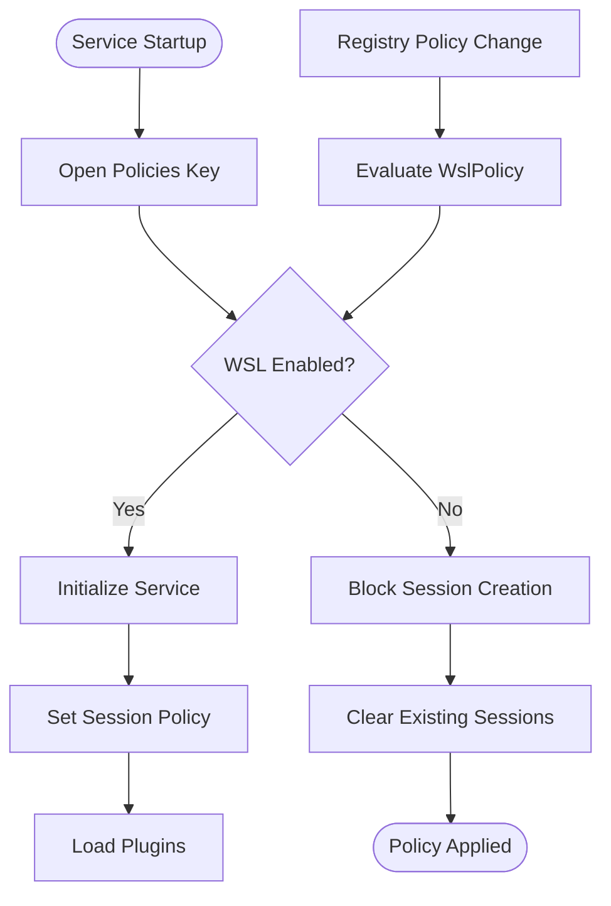

**Diagram sources**
- [ServiceMain.cpp](file://src/windows/service/exe/ServiceMain.cpp#L75-L88)
- [LxssUserSessionFactory.cpp](file://src/windows/service/exe/LxssUserSessionFactory.cpp#L77-L101)

The policy evaluation process considers:

- **Enterprise Policies**: Managed through Group Policy and registry keys
- **User Preferences**: Configurable through WSL configuration files
- **Security Boundaries**: Implemented through access control mechanisms
- **Feature Availability**: Controlled by capability flags and licensing

**Section sources**
- [ServiceMain.cpp](file://src/windows/service/exe/ServiceMain.cpp#L75-L88)
- [LxssUserSessionFactory.cpp](file://src/windows/service/exe/LxssUserSessionFactory.cpp#L77-L101)

## COM-Based Activation Model

The WSL service employs a sophisticated COM-based activation model that provides both local and remote access capabilities while maintaining security boundaries and proper resource management.

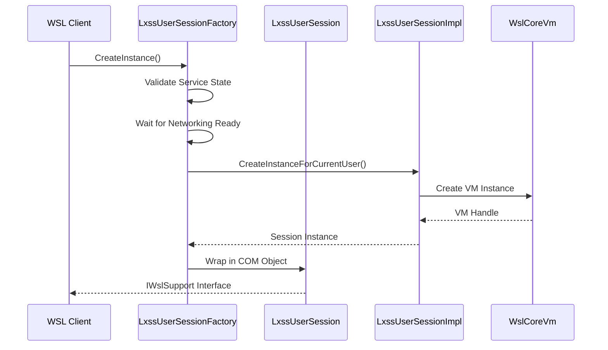

**Diagram sources**
- [LxssUserSessionFactory.cpp](file://src/windows/service/exe/LxssUserSessionFactory.cpp#L160-L189)
- [LxssUserSession.h](file://src/windows/service/exe/LxssUserSession.h#L68-L75)

The COM activation model implements several key features:

- **Factory Pattern**: LxssUserSessionFactory controls session creation
- **Weak References**: Prevents circular dependencies between COM objects
- **Security Boundaries**: Enforces access control through COM security
- **Lifetime Management**: Coordinates object lifecycle with service state

**Section sources**
- [LxssUserSessionFactory.cpp](file://src/windows/service/exe/LxssUserSessionFactory.cpp#L160-L189)
- [LxssUserSession.h](file://src/windows/service/exe/LxssUserSession.h#L68-L75)

## Session Change Handling

The service monitors Windows session changes to properly manage user sessions and ensure clean shutdown of resources when users log off or the system enters different states.

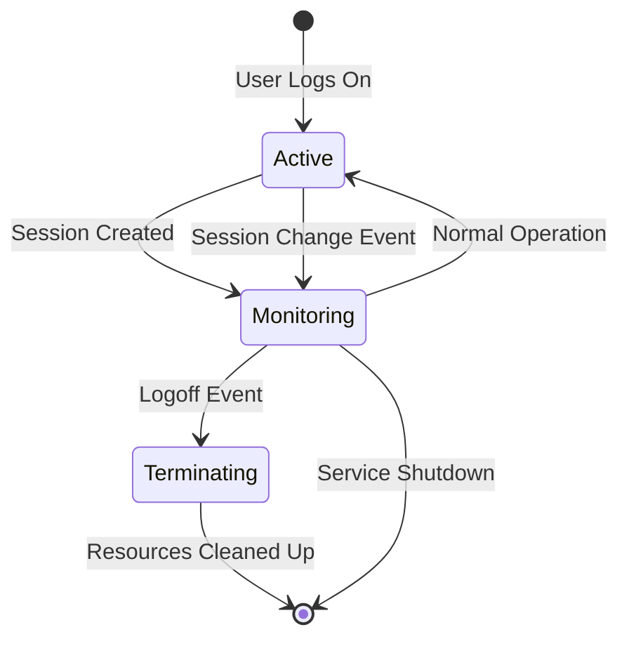

**Diagram sources**
- [ServiceMain.cpp](file://src/windows/service/exe/ServiceMain.cpp#L222-L228)

The session change handling process responds to:

- **Logoff Events**: Gracefully terminates user sessions
- **Session Lock**: Suspends non-critical operations
- **Session Unlock**: Resumes suspended operations
- **System Shutdown**: Initiates coordinated shutdown

**Section sources**
- [ServiceMain.cpp](file://src/windows/service/exe/ServiceMain.cpp#L222-L228)

## Process Mitigation Policies

The service implements comprehensive process mitigation policies to enhance security and protect against various attack vectors commonly targeted at system services.

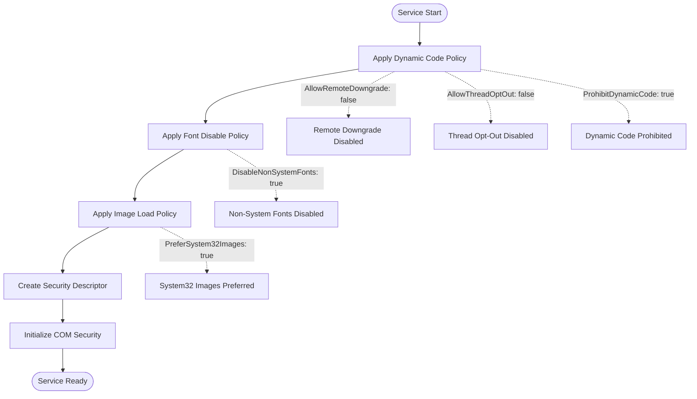

**Diagram sources**
- [WslSecurity.cpp](file://src/windows/common/WslSecurity.cpp#L40-L58)

The mitigation policies include:

- **Dynamic Code Protection**: Prevents runtime code generation attacks
- **Font Security**: Blocks potentially malicious font files
- **Image Loading**: Restricts loading from non-system locations
- **COM Security**: Implements appropriate access controls

**Section sources**
- [WslSecurity.cpp](file://src/windows/common/WslSecurity.cpp#L40-L58)

## Registry Watcher Mechanism

The service implements a sophisticated registry watcher mechanism that monitors policy changes in real-time and applies updates without requiring service restart.

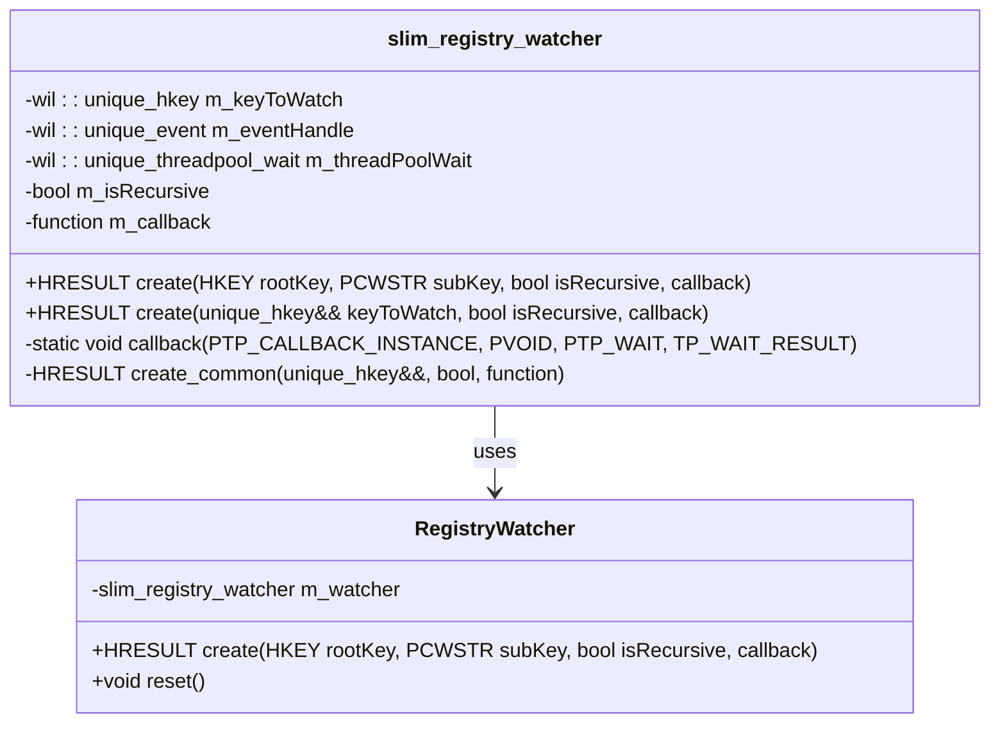

**Diagram sources**
- [RegistryWatcher.h](file://src/windows/inc/RegistryWatcher.h#L15-L100)

The registry watcher provides:

- **Real-Time Monitoring**: Immediate response to policy changes
- **Recursive Watching**: Monitors entire subtrees for changes
- **Thread-Safe Operations**: Uses thread pool for asynchronous callbacks
- **Automatic Cleanup**: Proper resource management during shutdown

**Section sources**
- [RegistryWatcher.h](file://src/windows/inc/RegistryWatcher.h#L15-L100)

## Update Checking Timer

The service implements a periodic update checking mechanism that monitors for new WSL releases and notifies users when updates become available.

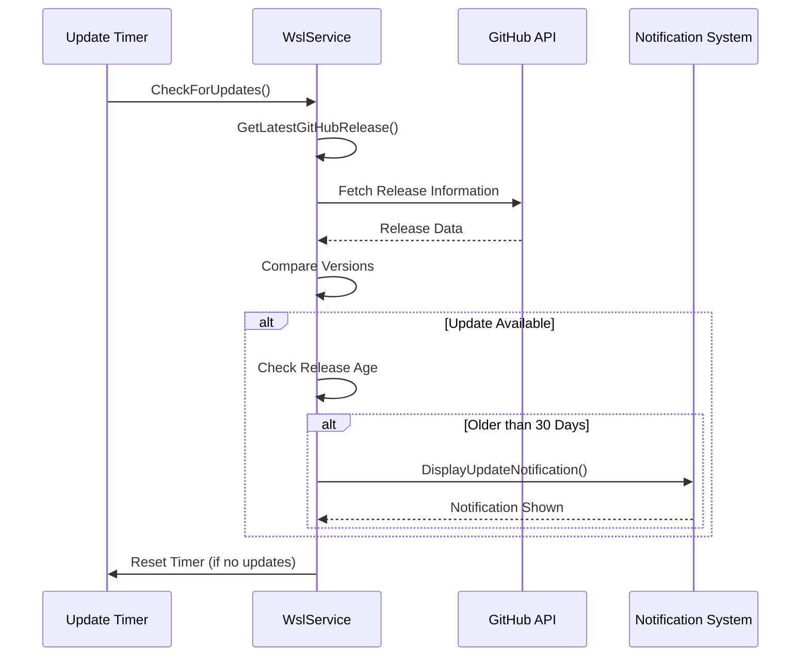

**Diagram sources**
- [ServiceMain.cpp](file://src/windows/service/exe/ServiceMain.cpp#L285-L315)

The update checking system includes:

- **Configurable Intervals**: Adjustable update check periods
- **Version Comparison**: Intelligent comparison of release versions
- **Age-Based Notifications**: Prevents spam for recent releases
- **Graceful Degradation**: Continues operating if update checks fail

**Section sources**
- [ServiceMain.cpp](file://src/windows/service/exe/ServiceMain.cpp#L285-L315)

## User Session and VM Lifetime Management

The service manages user sessions and VM instances through a sophisticated lifetime management system that coordinates resource allocation, monitoring, and cleanup.

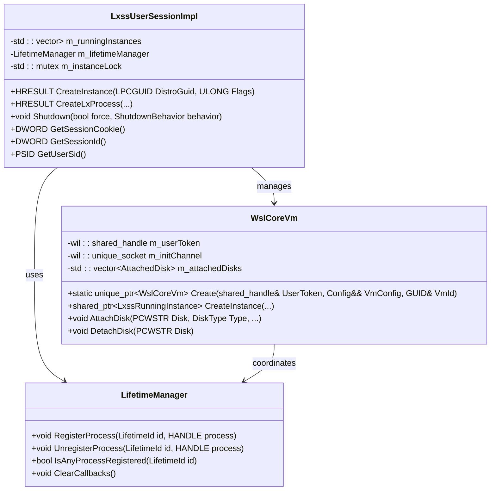

**Diagram sources**
- [LxssUserSession.cpp](file://src/windows/service/exe/LxssUserSession.cpp#L656-L680)
- [WslCoreVm.cpp](file://src/windows/service/exe/WslCoreVm.cpp#L104-L1394)

The lifetime management system provides:

- **Session Tracking**: Monitors active user sessions
- **Instance Coordination**: Manages VM and process lifetimes
- **Resource Monitoring**: Tracks resource usage and availability
- **Graceful Shutdown**: Ensures clean termination of all components

**Section sources**
- [LxssUserSession.cpp](file://src/windows/service/exe/LxssUserSession.cpp#L656-L680)
- [WslCoreVm.cpp](file://src/windows/service/exe/WslCoreVm.cpp#L104-L1394)

## Resource Cleanup and Teardown

The service implements comprehensive cleanup procedures to ensure proper resource deallocation and prevent resource leaks during normal shutdown or emergency situations.

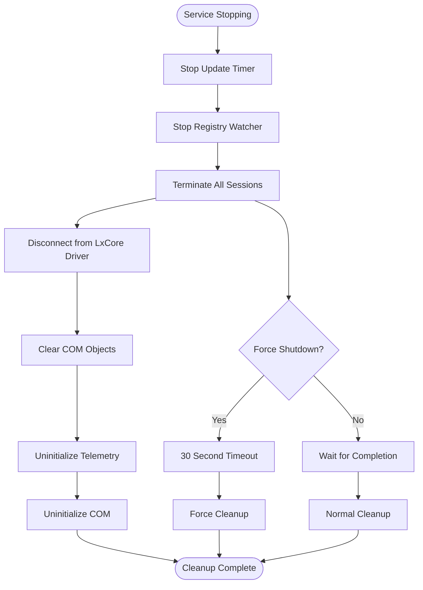

**Diagram sources**
- [ServiceMain.cpp](file://src/windows/service/exe/ServiceMain.cpp#L230-L259)

The cleanup process includes:

- **Timer Management**: Stops all periodic operations
- **Watcher Cleanup**: Disables policy monitoring
- **Session Termination**: Gracefully ends user sessions
- **Driver Disconnection**: Safely disconnects from kernel drivers
- **COM Resource Management**: Ensures proper COM object cleanup

**Section sources**
- [ServiceMain.cpp](file://src/windows/service/exe/ServiceMain.cpp#L230-L259)

## Crash and Power Loss Handling

The service implements robust mechanisms to handle unexpected crashes and power loss scenarios, ensuring system stability and data integrity.

```mermaid
flowchart TD
Crash([System Crash/Power Loss]) --> DetectRemnants[Detect Leftover Resources]
DetectRemnants --> CleanupIPTables[Cleanup IP Tables]
CleanupIPTables --> CleanupFirewall[Cleanup Firewall Rules]
CleanupFirewall --> CleanupNetwork[Cleanup Network Resources]
CleanupNetwork --> ServiceRestart[Service Restart]
ServiceRestart --> ReestablishConnections[Reestablish Driver Connections]
ReestablishConnections --> RestoreSessions[Restore Active Sessions]
RestoreSessions --> VerifyIntegrity[Verify System Integrity]
VerifyIntegrity --> Operational([System Operational])
CleanupIPTables -.->|LxssIpTables::CleanupRemnants()| IP1[Remove NAT Rules]
CleanupIPTables -.->|LxssIpTables::CleanupRemnants()| IP2[Remove Port Forwarding]
CleanupFirewall -.->|LxssNetworkingFirewall::CleanupRemnants()| FW1[Remove Firewall Entries]
CleanupNetwork -.->|LxssNetworkingNat::CleanupRemnants()| NET1[Remove NAT Translations]
```

**Diagram sources**
- [LxssIpTables.cpp](file://src/windows/service/exe/LxssIpTables.cpp#L44-L57)
- [ServiceMain.cpp](file://src/windows/service/exe/ServiceMain.cpp#L210-L212)

The crash recovery system includes:

- **Remnant Detection**: Identifies leftover system resources
- **Network Cleanup**: Removes stale networking configurations
- **Resource Recovery**: Restores system state to known good configuration
- **Session Restoration**: Attempts to recover active user sessions

**Section sources**
- [LxssIpTables.cpp](file://src/windows/service/exe/LxssIpTables.cpp#L44-L57)
- [ServiceMain.cpp](file://src/windows/service/exe/ServiceMain.cpp#L210-L212)

## Concurrent Access Management

The service implements sophisticated concurrency control mechanisms to handle simultaneous access from multiple users and processes while maintaining data consistency and preventing race conditions.

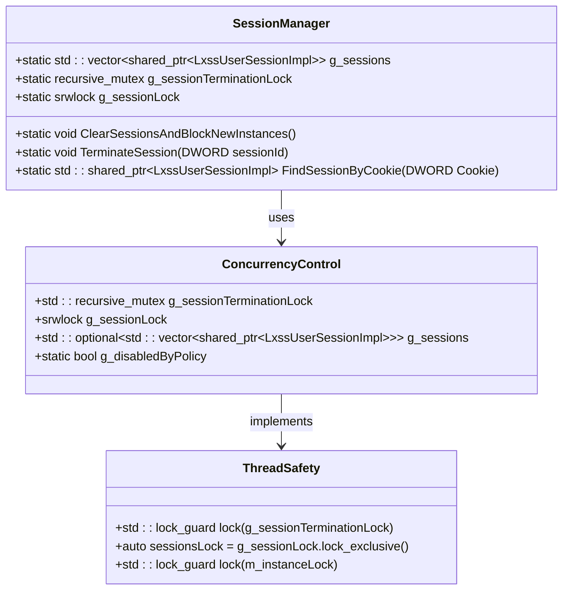

**Diagram sources**
- [LxssUserSessionFactory.cpp](file://src/windows/service/exe/LxssUserSessionFactory.cpp#L26-L36)

The concurrency management system provides:

- **Nested Locking**: Recursive mutexes for complex locking scenarios
- **Reader-Writer Locks**: Optimized for read-heavy access patterns
- **Deadlock Prevention**: Careful lock ordering to prevent deadlocks
- **Atomic Operations**: Thread-safe operations for critical sections

**Section sources**
- [LxssUserSessionFactory.cpp](file://src/windows/service/exe/LxssUserSessionFactory.cpp#L26-L36)

## Security Considerations

The service implements comprehensive security measures to protect against unauthorized access, privilege escalation, and system compromise.

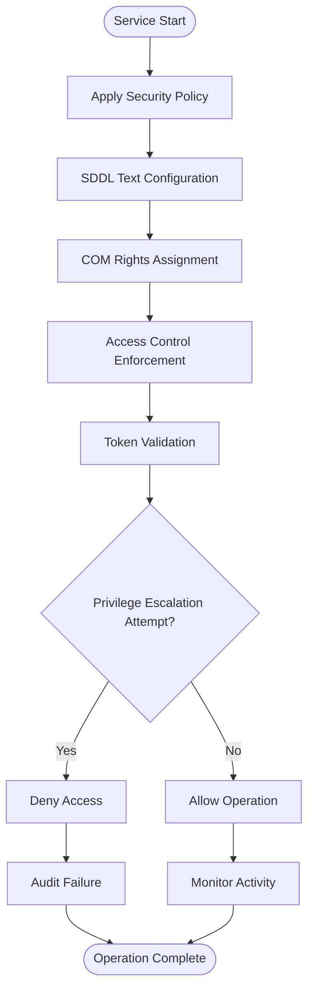

**Diagram sources**
- [ServiceMain.cpp](file://src/windows/service/exe/ServiceMain.cpp#L34-L43)
- [comservicehelper.h](file://src/windows/inc/comservicehelper.h#L202-L220)

The security framework includes:

- **SDDL Configuration**: Defines access control for COM objects
- **Token Validation**: Verifies caller identity and privileges
- **Privilege Management**: Controls access to sensitive operations
- **Audit Logging**: Tracks security-relevant events

**Section sources**
- [ServiceMain.cpp](file://src/windows/service/exe/ServiceMain.cpp#L34-L43)
- [comservicehelper.h](file://src/windows/inc/comservicehelper.h#L202-L220)

## Driver Connectivity

The service establishes and maintains communication with the LxCore driver, which provides the fundamental interface between Windows and Linux subsystem functionality.

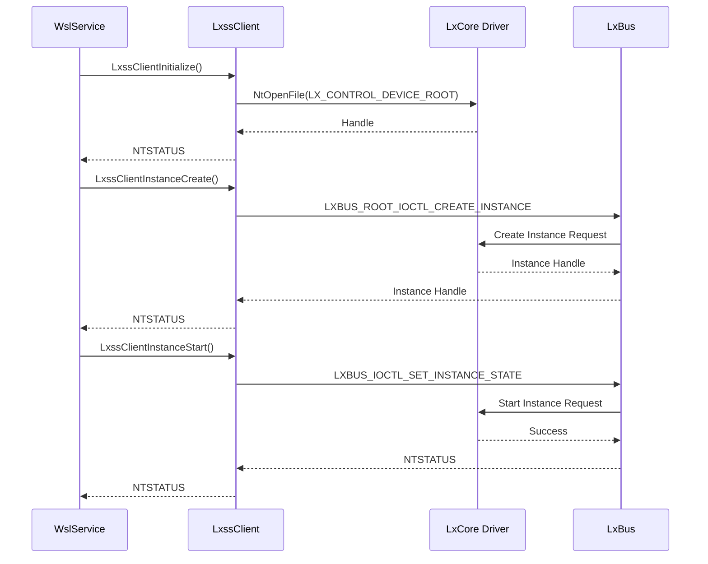

**Diagram sources**
- [lxssclient.cpp](file://src/windows/common/lxssclient.cpp#L21-L69)
- [lxssclient.h](file://src/windows/inc/lxssclient.h#L18-L51)

The driver connectivity system provides:

- **Device Communication**: Low-level driver interface
- **Instance Management**: Creation and control of WSL instances
- **State Synchronization**: Coordinate between user mode and kernel mode
- **Error Handling**: Robust error reporting and recovery

**Section sources**
- [lxssclient.cpp](file://src/windows/common/lxssclient.cpp#L21-L69)
- [lxssclient.h](file://src/windows/inc/lxssclient.h#L18-L51)

## Troubleshooting Guide

### Common Service Issues

**Service Startup Failures**
- Verify LxCore driver installation and accessibility
- Check registry policy settings and permissions
- Review event logs for specific error messages
- Ensure proper COM registration and security descriptors

**Session Creation Problems**
- Validate user token and security context
- Check for conflicting session instances
- Verify network connectivity and resource availability
- Review policy restrictions and entitlements

**Resource Cleanup Issues**
- Monitor for lingering networking resources
- Check for orphaned VM instances
- Verify proper COM object cleanup
- Review timeout settings for graceful shutdown

### Diagnostic Procedures

**Service Health Check**
1. Verify service status and dependencies
2. Check COM object registration and accessibility
3. Validate driver connectivity and communication
4. Monitor resource utilization and leak detection

**Performance Monitoring**
1. Track session creation and termination rates
2. Monitor memory usage and garbage collection
3. Measure network throughput and latency
4. Analyze error rates and failure patterns

**Security Auditing**
1. Review access logs and authentication attempts
2. Validate privilege escalation prevention
3. Check for unauthorized resource access
4. Monitor policy compliance and enforcement

## Conclusion

The WSL service lifecycle management system represents a sophisticated approach to managing complex subsystem interactions in a production environment. Through careful orchestration of initialization, policy evaluation, resource management, and cleanup procedures, the service ensures reliable operation across diverse usage scenarios.

The implementation demonstrates several key architectural principles:

- **Modularity**: Clear separation of concerns between service management, session handling, and resource coordination
- **Robustness**: Comprehensive error handling and recovery mechanisms for various failure scenarios
- **Security**: Multi-layered security approach protecting against various attack vectors
- **Scalability**: Efficient handling of concurrent access from multiple users and processes
- **Maintainability**: Well-structured code with clear interfaces and comprehensive documentation

The service's ability to handle crashes, power loss, and concurrent access while maintaining system stability makes it suitable for enterprise environments where reliability and security are paramount. The comprehensive policy management system ensures that organizations can enforce appropriate restrictions while providing necessary functionality to users.

Future enhancements to the service lifecycle management system could include improved monitoring capabilities, enhanced automation for policy changes, and expanded support for containerized workloads. The modular architecture provides a solid foundation for these extensions while maintaining backward compatibility and system stability.