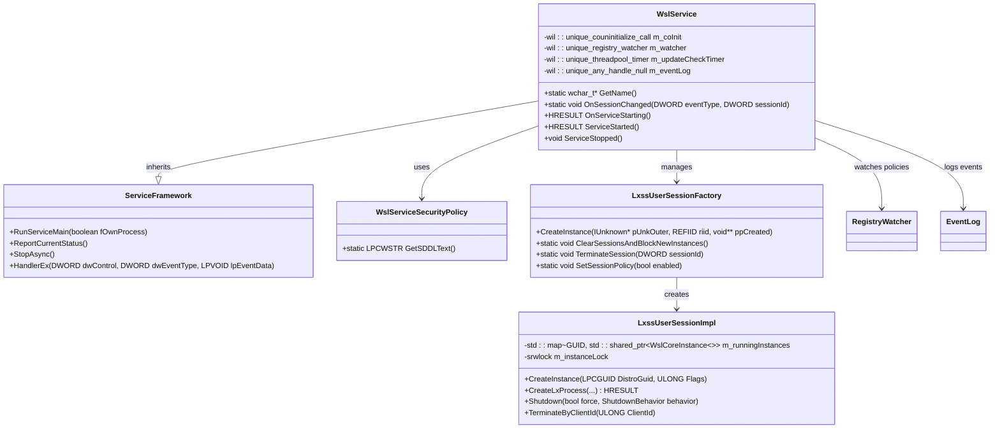
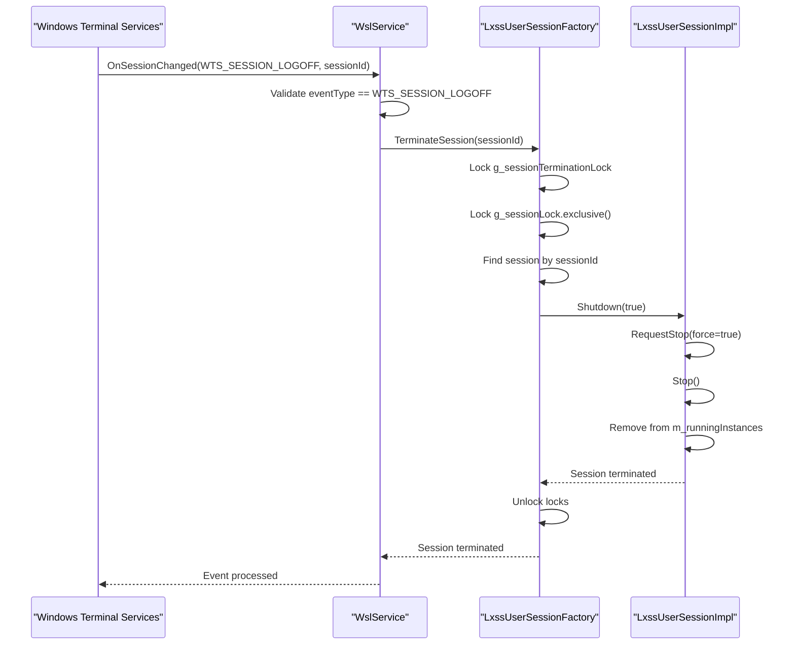
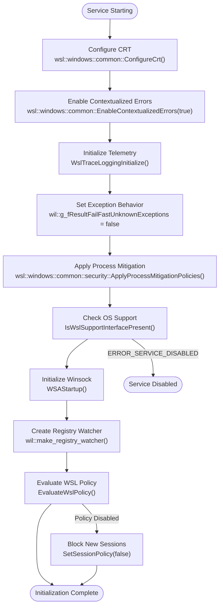
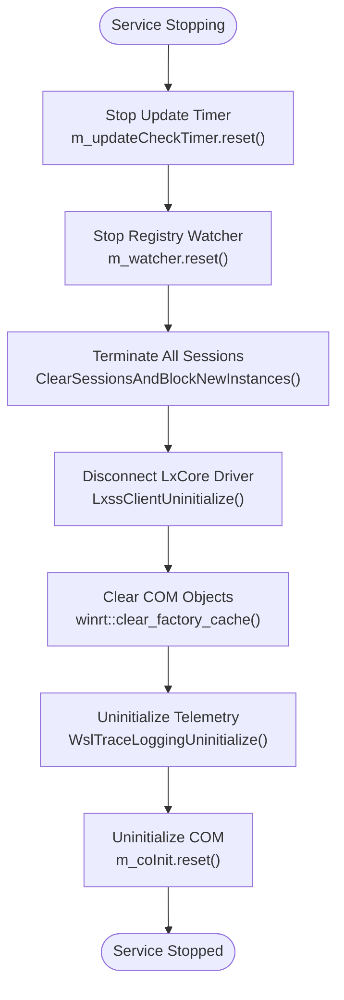
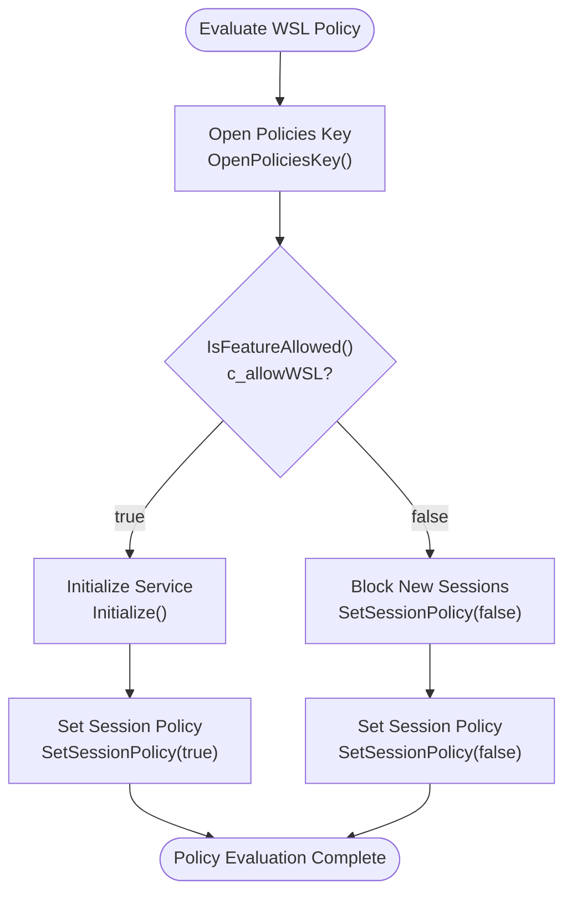
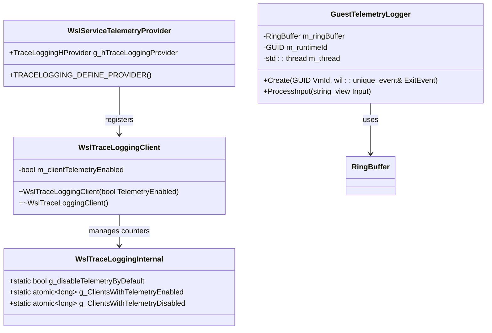
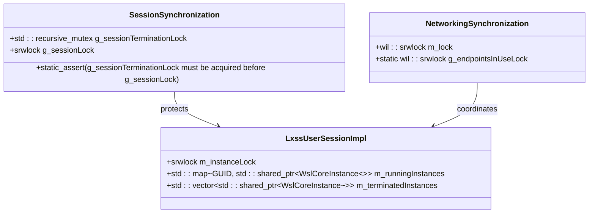
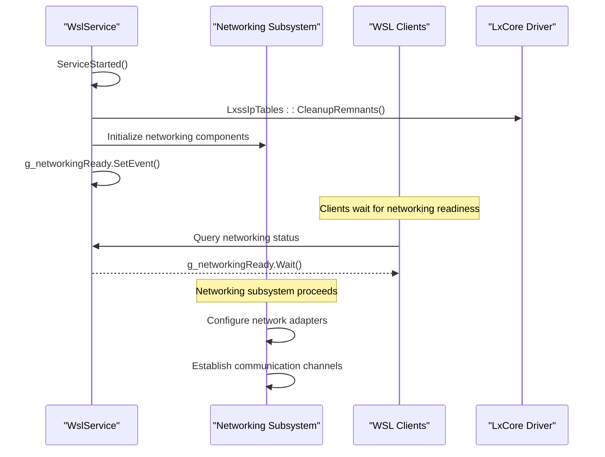
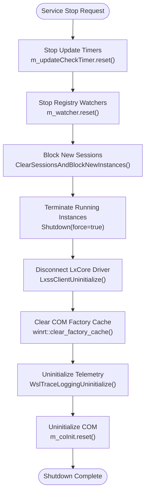

# Event Handling

<cite>
**Referenced Files in This Document**
- [ServiceMain.cpp](file://src/windows/service/exe/ServiceMain.cpp)
- [comservicehelper.h](file://src/windows/inc/comservicehelper.h)
- [LxssUserSessionFactory.cpp](file://src/windows/service/exe/LxssUserSessionFactory.cpp)
- [LxssUserSessionFactory.h](file://src/windows/service/exe/LxssUserSessionFactory.h)
- [LxssUserSession.cpp](file://src/windows/service/exe/LxssUserSession.cpp)
- [wslpolicies.h](file://src/windows/inc/wslpolicies.h)
- [WslTelemetry.cpp](file://src/windows/common/WslTelemetry.cpp)
- [WslTelemetry.h](file://src/windows/common/WslTelemetry.h)
- [GuestTelemetryLogger.cpp](file://src/windows/service/exe/GuestTelemetryLogger.cpp)
- [GuestTelemetryLogger.h](file://src/windows/service/exe/GuestTelemetryLogger.h)
- [PolicyTests.cpp](file://test/windows/PolicyTests.cpp)
</cite>

## Table of Contents
1. [Introduction](#introduction)
2. [Service Architecture Overview](#service-architecture-overview)
3. [Session Change Event Handling](#session-change-event-handling)
4. [Service Lifecycle Management](#service-lifecycle-management)
5. [Policy Evaluation and Registry Integration](#policy-evaluation-and-registry-integration)
6. [Event Source Registration and Telemetry](#event-source-registration-and-telemetry)
7. [Synchronization and Concurrent Access](#synchronization-and-concurrent-access)
8. [Network Initialization and Signaling](#network-initialization-and-signaling)
9. [Graceful Shutdown Procedures](#graceful-shutdown-procedures)
10. [Troubleshooting and Monitoring](#troubleshooting-and-monitoring)

## Introduction

The WSL (Windows Subsystem for Linux) service implements a sophisticated event handling mechanism that manages Windows Terminal Services session events, integrates with the Windows Service Control Manager, and maintains responsive operation across multiple client connections. This system handles session lifecycle events, policy changes, telemetry collection, and graceful service termination while ensuring thread safety and proper resource management.

The service operates as a Windows service running in Session 0 with SYSTEM privileges, managing WSL distributions and maintaining communication channels with both Windows clients and the Linux subsystem. The event handling system is built around several key components: session change notifications, service lifecycle callbacks, policy evaluation, and comprehensive telemetry infrastructure.

## Service Architecture Overview

The WSL service follows a layered architecture that separates concerns between service management, session handling, and client communication. The core service class inherits from a template-based service framework that provides standardized Windows Service Control Manager integration.

**Diagram sources**
- [ServiceMain.cpp](file://src/windows/service/exe/ServiceMain.cpp#L44-L72)
- [comservicehelper.h](file://src/windows/inc/comservicehelper.h#L368-L468)
- [LxssUserSessionFactory.h](file://src/windows/service/exe/LxssUserSessionFactory.h#L26-L65)

**Section sources**
- [ServiceMain.cpp](file://src/windows/service/exe/ServiceMain.cpp#L44-L72)
- [comservicehelper.h](file://src/windows/inc/comservicehelper.h#L368-L468)

## Session Change Event Handling

The WSL service implements comprehensive session change event handling through the `OnSessionChanged()` method, which processes Windows Terminal Services session events and triggers appropriate session termination procedures.

### WTS_SESSION_LOGOFF Event Processing

The primary responsibility of the `OnSessionChanged()` method is handling the `WTS_SESSION_LOGOFF` event type, which occurs when a user session ends. This event triggers the termination of all WSL instances associated with the affected session.

**Diagram sources**
- [ServiceMain.cpp](file://src/windows/service/exe/ServiceMain.cpp#L222-L228)
- [LxssUserSessionFactory.cpp](file://src/windows/service/exe/LxssUserSessionFactory.cpp#L122-L155)

### Session Termination Mechanism

The session termination process involves multiple layers of synchronization and safety checks to ensure proper cleanup of resources and prevention of race conditions.

The termination process follows a specific order to prevent deadlocks:
1. Acquire `g_sessionTerminationLock` (recursive mutex)
2. Acquire `g_sessionLock` (SRW lock exclusive)
3. Locate the target session
4. Call `Shutdown()` on the session object
5. Remove the session from the active sessions list
6. Release locks in reverse order

**Section sources**
- [ServiceMain.cpp](file://src/windows/service/exe/ServiceMain.cpp#L222-L228)
- [LxssUserSessionFactory.cpp](file://src/windows/service/exe/LxssUserSessionFactory.cpp#L122-L155)

## Service Lifecycle Management

The WSL service implements a comprehensive lifecycle management system through the Windows Service Control Manager integration, providing standardized startup, running, and shutdown procedures.

### Service Starting Phase

During the service starting phase, the `OnServiceStarting()` method performs essential initialization tasks including CRT configuration, error contextualization, telemetry setup, and policy evaluation.

**Diagram sources**
- [ServiceMain.cpp](file://src/windows/service/exe/ServiceMain.cpp#L155-L194)

### Service Started Phase

The `ServiceStarted()` method handles post-initialization tasks including COM initialization, cleanup of remnants from previous sessions, and signaling networking readiness.

The networking readiness event (`g_networkingReady`) is crucial for coordinating service startup with dependent components. This manual-reset event ensures that all subsystems can synchronize their initialization phases.

**Section sources**
- [ServiceMain.cpp](file://src/windows/service/exe/ServiceMain.cpp#L155-L194)
- [ServiceMain.cpp](file://src/windows/service/exe/ServiceMain.cpp#L206-L220)

### Service Stopped Phase

The service stopped phase implements a comprehensive cleanup procedure that ensures graceful termination of all resources and subsystems.

**Diagram sources**
- [ServiceMain.cpp](file://src/windows/service/exe/ServiceMain.cpp#L230-L258)

**Section sources**
- [ServiceMain.cpp](file://src/windows/service/exe/ServiceMain.cpp#L230-L258)

## Policy Evaluation and Registry Integration

The WSL service implements dynamic policy evaluation through the `EvaluateWslPolicy()` method, which integrates with Windows registry policies and provides real-time policy change detection.

### Policy Evaluation Process

The policy evaluation process begins by opening the WSL policies registry key and checking the `c_allowWSL` policy value. Based on the policy result, the service either initializes normally or blocks session creation.

**Diagram sources**
- [ServiceMain.cpp](file://src/windows/service/exe/ServiceMain.cpp#L75-L88)
- [wslpolicies.h](file://src/windows/inc/wslpolicies.h#L75-L88)

### Registry Watcher Integration

The service creates a registry watcher that monitors changes to WSL policy keys in real-time. This enables immediate reaction to policy modifications without requiring service restart.

The registry watcher is configured to monitor the `ROOT_POLICIES_KEY` path and triggers the `EvaluateWslPolicy()` method whenever changes occur. This provides seamless policy enforcement and dynamic capability adjustment.

**Section sources**
- [ServiceMain.cpp](file://src/windows/service/exe/ServiceMain.cpp#L75-L88)
- [ServiceMain.cpp](file://src/windows/service/exe/ServiceMain.cpp#L180-L190)
- [wslpolicies.h](file://src/windows/inc/wslpolicies.h#L75-L105)

## Event Source Registration and Telemetry

The WSL service implements comprehensive event logging and telemetry collection through Windows Event Log integration and structured telemetry infrastructure.

### Event Source Registration

The `RegisterEventSource()` method establishes the service's presence in the Windows Event Log system, enabling structured logging of service events and operational information.

The event source registration follows these steps:
1. Call `RegisterEventSource()` with "WSL" as the source name
2. Store the event log handle for subsequent use
3. Set the global event log handle via `wsl::windows::common::SetEventLog()`

### Telemetry Infrastructure

The telemetry system consists of multiple components working together to provide comprehensive monitoring and diagnostic capabilities.

**Diagram sources**
- [WslTelemetry.cpp](file://src/windows/common/WslTelemetry.cpp#L44-L73)
- [WslTelemetry.h](file://src/windows/common/WslTelemetry.h#L48-L76)
- [GuestTelemetryLogger.h](file://src/windows/service/exe/GuestTelemetryLogger.h#L20-L41)

### Telemetry Initialization Process

The telemetry initialization process involves several key steps:
1. Initialize the trace logging provider with Microsoft telemetry options
2. Set up failure logging callbacks for error tracking
3. Configure client counting for telemetry enablement decisions
4. Establish privacy data tagging for compliance

**Section sources**
- [ServiceMain.cpp](file://src/windows/service/exe/ServiceMain.cpp#L196-L204)
- [WslTelemetry.cpp](file://src/windows/common/WslTelemetry.cpp#L76-L190)
- [GuestTelemetryLogger.cpp](file://src/windows/service/exe/GuestTelemetryLogger.cpp#L51-L96)

## Synchronization and Concurrent Access

The WSL service implements sophisticated synchronization mechanisms to handle concurrent access from multiple clients while maintaining thread safety and preventing race conditions.

### Session Management Synchronization

The service uses a combination of recursive mutexes and SRW (Slim Reader/Writer) locks to manage concurrent access to session collections and individual session operations.

**Diagram sources**
- [LxssUserSessionFactory.cpp](file://src/windows/service/exe/LxssUserSessionFactory.cpp#L26-L36)
- [LxssUserSession.cpp](file://src/windows/service/exe/LxssUserSession.cpp#L3535-L3598)

### Deadlock Prevention Strategies

The service implements several strategies to prevent deadlocks during session termination and management:

1. **Lock Ordering**: Always acquire `g_sessionTerminationLock` before `g_sessionLock`
2. **Exclusive Lock Acquisition**: Use SRW locks exclusively for session collection operations
3. **Recursive Mutex Usage**: Allow recursive acquisition of termination lock for nested operations
4. **Timeout Mechanisms**: Implement timeouts for lock acquisition attempts

### Client Access Patterns

The service handles concurrent client access through several patterns:
- **Factory Pattern**: LxssUserSessionFactory manages session creation and lifecycle
- **Weak References**: Use weak pointers to prevent circular dependencies
- **Shared Ownership**: Leverage shared pointers for session lifetime management
- **Atomic Operations**: Use atomic counters for telemetry and statistics

**Section sources**
- [LxssUserSessionFactory.cpp](file://src/windows/service/exe/LxssUserSessionFactory.cpp#L26-L36)
- [LxssUserSessionFactory.cpp](file://src/windows/service/exe/LxssUserSessionFactory.cpp#L38-L47)

## Network Initialization and Signaling

The WSL service implements a sophisticated network initialization system that ensures proper coordination between service startup and networking subsystems.

### Networking Ready Event

The `g_networkingReady` event serves as a critical synchronization point during service startup. This manual-reset event signals that the networking subsystem is ready and all dependent components can proceed with their initialization.

**Diagram sources**
- [ServiceMain.cpp](file://src/windows/service/exe/ServiceMain.cpp#L211-L212)

### Network Subsystem Coordination

The networking subsystem coordination involves several components working together:
- **IP Tables Cleanup**: Removal of remnants from previous sessions
- **Adapter Configuration**: Setup of virtual network adapters
- **Communication Channels**: Establishment of hvsocket connections
- **DNS Resolution**: Configuration of DNS services

**Section sources**
- [ServiceMain.cpp](file://src/windows/service/exe/ServiceMain.cpp#L211-L212)

## Graceful Shutdown Procedures

The WSL service implements comprehensive graceful shutdown procedures that ensure proper cleanup of all resources and subsystems while maintaining data integrity.

### Shutdown Phases

The shutdown process occurs in carefully orchestrated phases to prevent resource leaks and ensure proper cleanup:

**Diagram sources**
- [ServiceMain.cpp](file://src/windows/service/exe/ServiceMain.cpp#L230-L258)

### Session Termination Strategy

The session termination strategy implements a multi-stage approach to ensure all WSL instances are properly cleaned up:

1. **Immediate Termination**: Force termination of all running instances
2. **Resource Cleanup**: Clear attached disk states and registry entries
3. **Plugin Unloading**: Unload any loaded plugins
4. **Collection Reset**: Reset session collections and tracking data

### Timeout and Recovery Mechanisms

The service implements timeout and recovery mechanisms to handle situations where graceful termination may not complete within expected timeframes:

- **Force Termination**: Automatic fallback to force termination after timeout periods
- **Resource Cleanup**: Ensures cleanup even if normal termination fails
- **Deadlock Prevention**: Implements safeguards to prevent shutdown deadlocks

**Section sources**
- [ServiceMain.cpp](file://src/windows/service/exe/ServiceMain.cpp#L230-L258)
- [LxssUserSessionFactory.cpp](file://src/windows/service/exe/LxssUserSessionFactory.cpp#L38-L74)

## Troubleshooting and Monitoring

The WSL service provides comprehensive troubleshooting and monitoring capabilities through event logging, telemetry collection, and diagnostic tools.

### Diagnostic Information Collection

The service generates extensive diagnostic information through multiple channels:
- **Windows Event Log**: Structured event logging for operational monitoring
- **Telemetry Events**: Performance and usage metrics collection
- **Debug Logging**: Conditional debug information for development and troubleshooting
- **Error Tracking**: Comprehensive error reporting and analysis

### Performance Monitoring

The service implements performance monitoring through:
- **Telemetry Counters**: Active client tracking and telemetry enablement
- **Resource Usage**: Memory and CPU utilization monitoring
- **Network Performance**: Network adapter and connection performance tracking
- **Session Metrics**: Session creation and termination timing

### Common Issues and Solutions

The service handles several common issues through its event handling mechanisms:
- **Policy Changes**: Dynamic policy evaluation and immediate effect application
- **Session Conflicts**: Proper session isolation and conflict resolution
- **Resource Leaks**: Comprehensive cleanup procedures and resource tracking
- **Network Connectivity**: Robust network initialization and recovery

**Section sources**
- [WslTelemetry.cpp](file://src/windows/common/WslTelemetry.cpp#L92-L177)
- [PolicyTests.cpp](file://test/windows/PolicyTests.cpp#L1-L398)