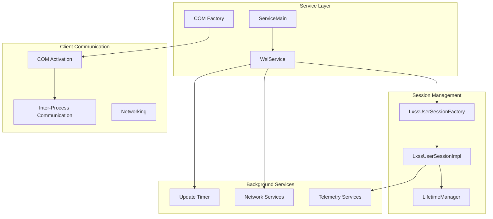
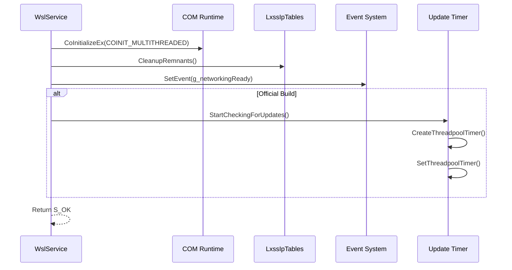
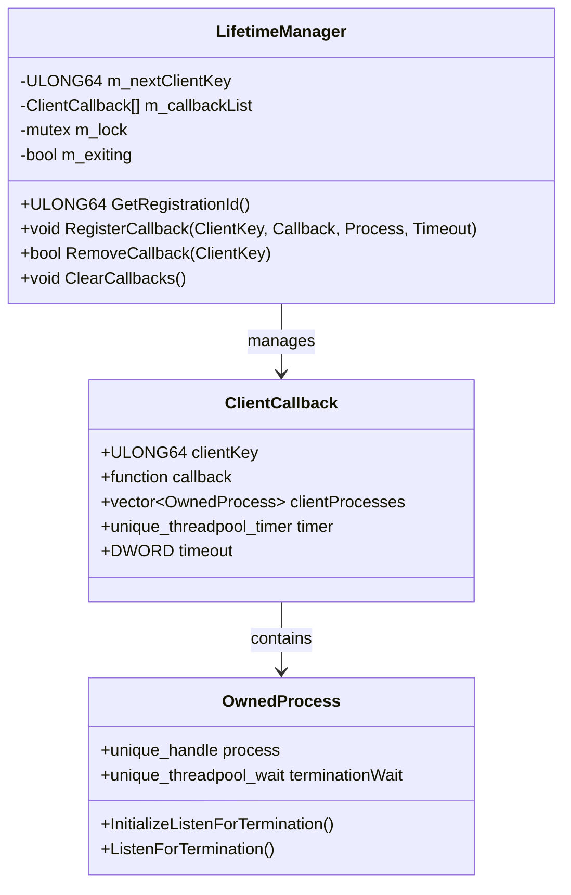
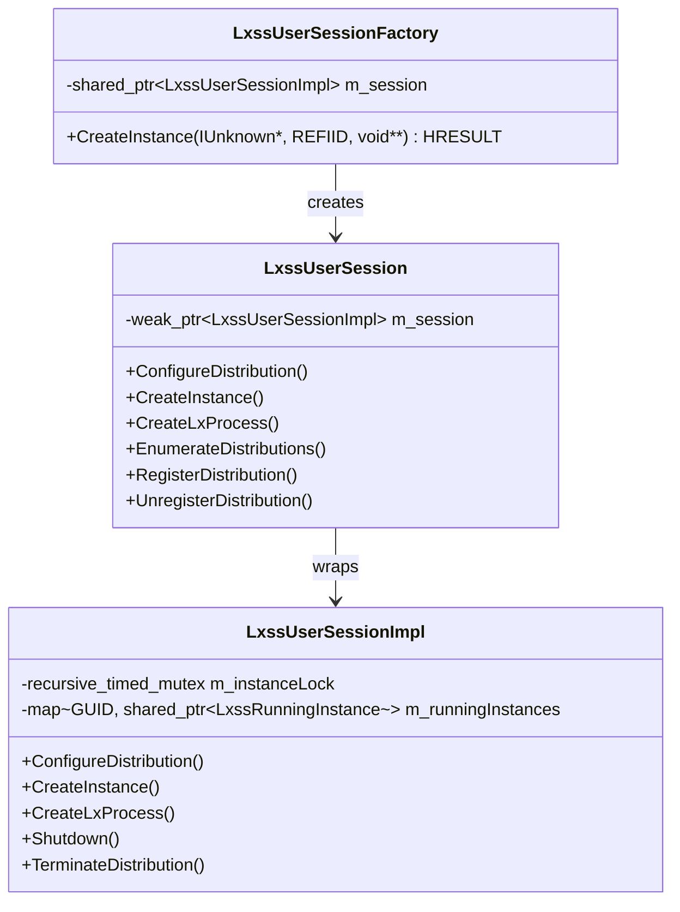
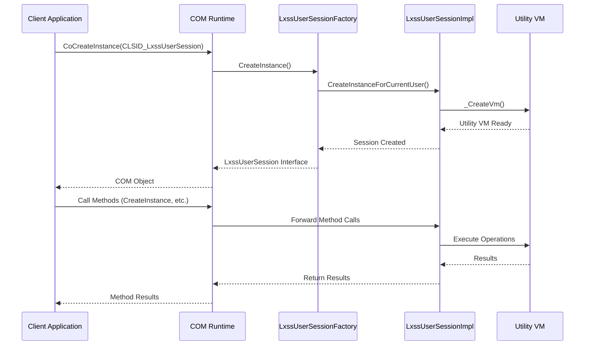
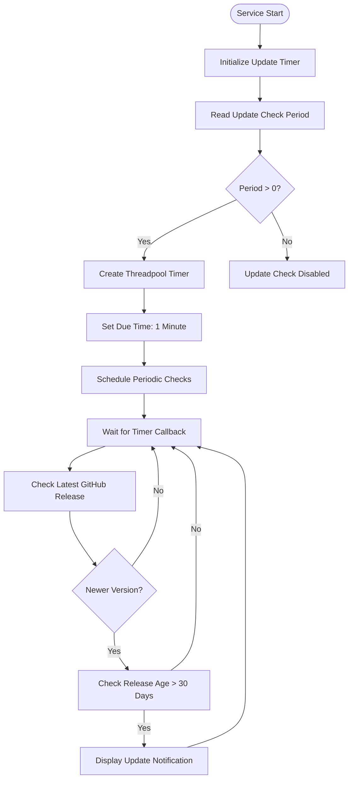
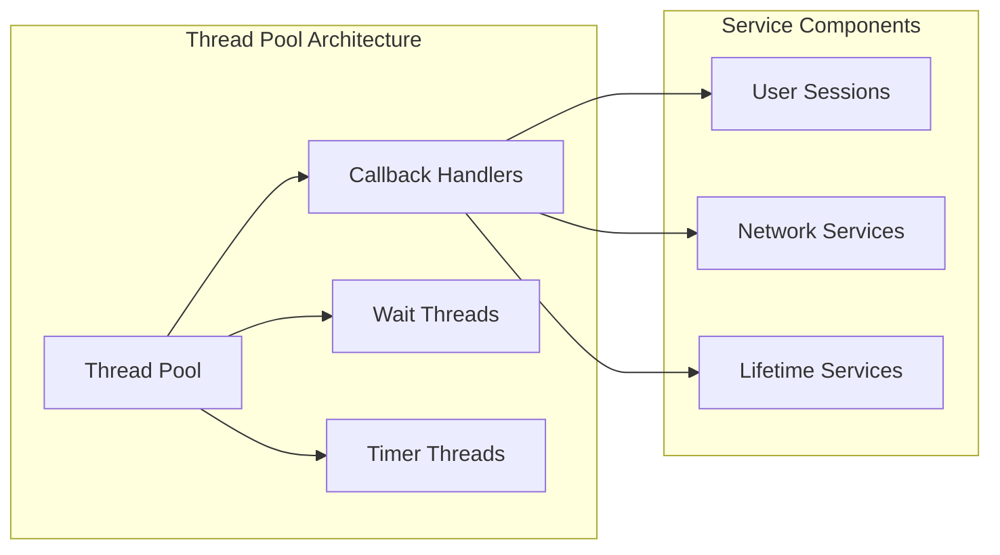
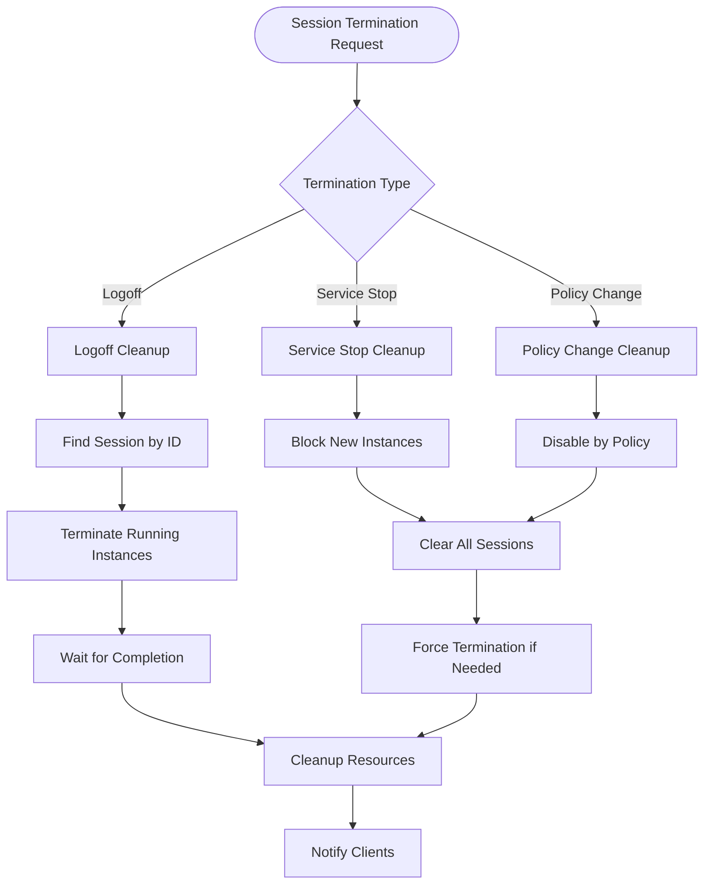
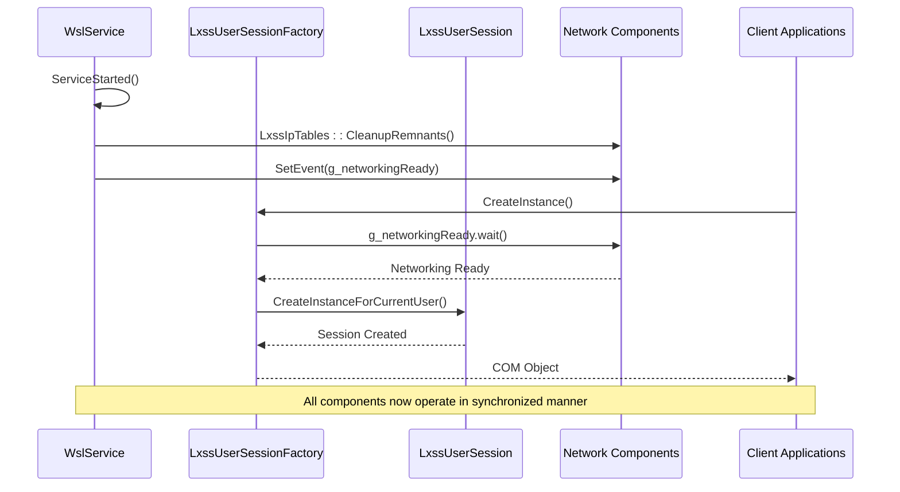
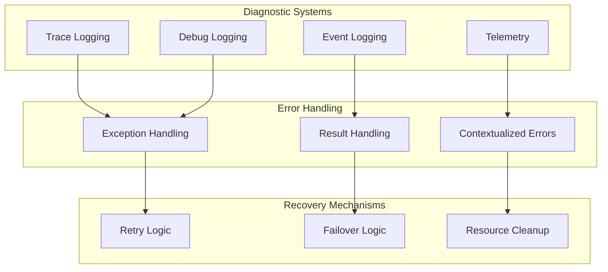

# Service Runtime Operations

<cite>
**Referenced Files in This Document**
- [ServiceMain.cpp](file://src/windows/service/exe/ServiceMain.cpp)
- [Lifetime.cpp](file://src/windows/service/exe/Lifetime.cpp)
- [Lifetime.h](file://src/windows/service/exe/Lifetime.h)
- [LxssUserSession.cpp](file://src/windows/service/exe/LxssUserSession.cpp)
- [LxssUserSession.h](file://src/windows/service/exe/LxssUserSession.h)
- [LxssUserSessionFactory.cpp](file://src/windows/service/exe/LxssUserSessionFactory.cpp)
- [LxssUserSessionFactory.h](file://src/windows/service/exe/LxssUserSessionFactory.h)
- [comservicehelper.h](file://src/windows/inc/comservicehelper.h)
- [NatNetworking.cpp](file://src/windows/service/exe/NatNetworking.cpp)
- [WslMirroredNetworking.cpp](file://src/windows/service/exe/WslMirroredNetworking.cpp)
- [notifications.h](file://src/windows/common/notifications.h)
- [wslutil.cpp](file://src/windows/common/wslutil.cpp)
</cite>

## Table of Contents
1. [Introduction](#introduction)
2. [Service Architecture Overview](#service-architecture-overview)
3. [ServiceStarted Method Implementation](#servicestarted-method-implementation)
4. [Lifetime Management System](#lifetime-management-system)
5. [Session Management and Lifecycle](#session-management-and-lifecycle)
6. [COM-Based Client Activation Model](#com-based-client-activation-model)
7. [Update Checking Timer System](#update-checking-timer-system)
8. [Concurrent Access and Responsiveness](#concurrent-access-and-responsiveness)
9. [Session Cleanup and Termination](#session-cleanup-and-termination)
10. [Networking Readiness Signaling](#networking-readiness-signaling)
11. [Troubleshooting and Error Handling](#troubleshooting-and-error-handling)
12. [Conclusion](#conclusion)

## Introduction

The WSL (Windows Subsystem for Linux) service runtime operates as a sophisticated Windows service that manages Linux distribution instances, user sessions, and system integration. This document provides comprehensive coverage of the service's runtime operations, focusing on the ServiceStarted() method implementation, session lifecycle management, and the underlying infrastructure that ensures reliable and responsive operation across multiple concurrent clients.

The service employs a multi-layered architecture combining COM-based client activation, thread-safe session management, and asynchronous update mechanisms to deliver a robust platform for Linux container operations within Windows environments.

## Service Architecture Overview

The WSL service follows a layered architecture pattern that separates concerns between service lifecycle management, session handling, and client communication:

**Diagram sources**
- [ServiceMain.cpp](file://src/windows/service/exe/ServiceMain.cpp#L45-L73)
- [LxssUserSessionFactory.cpp](file://src/windows/service/exe/LxssUserSessionFactory.cpp#L158-L166)
- [Lifetime.cpp](file://src/windows/service/exe/Lifetime.cpp#L32-L44)

**Section sources**
- [ServiceMain.cpp](file://src/windows/service/exe/ServiceMain.cpp#L45-L73)
- [LxssUserSessionFactory.h](file://src/windows/service/exe/LxssUserSessionFactory.h#L26-L35)

## ServiceStarted Method Implementation

The ServiceStarted() method serves as the primary initialization entry point for the WSL service, orchestrating critical startup operations that establish the service's operational foundation.

### Initialization Sequence

**Diagram sources**
- [ServiceMain.cpp](file://src/windows/service/exe/ServiceMain.cpp#L206-L219)

### Key Initialization Components

The ServiceStarted() method performs several critical initialization tasks:

1. **COM Runtime Initialization**: Establishes multithreaded COM apartment for client communication
2. **Resource Cleanup**: Performs cleanup of remnants from previous service instances
3. **Networking Readiness**: Signals networking subsystem readiness to dependent components
4. **Update Mechanism**: Initializes periodic update checking for official builds

### Implementation Details

The method demonstrates careful resource management and error handling:

- **COM Initialization**: Uses `wil::CoInitializeEx()` for automatic resource cleanup
- **Cleanup Operations**: Calls `LxssIpTables::CleanupRemnants()` to remove stale iptables rules
- **Event Signaling**: Sets `g_networkingReady` event to notify waiting components
- **Conditional Features**: Update checking is only enabled in official builds

**Section sources**
- [ServiceMain.cpp](file://src/windows/service/exe/ServiceMain.cpp#L206-L219)

## Lifetime Management System

The LifetimeManager class implements a sophisticated callback registration system that tracks client process lifetimes and manages automatic cleanup based on process termination detection.

### Architecture and Design

**Diagram sources**
- [Lifetime.cpp](file://src/windows/service/exe/Lifetime.cpp#L32-L315)
- [Lifetime.h](file://src/windows/service/exe/Lifetime.h#L19-L99)

### Callback Registration Process

The lifetime management system operates through a multi-stage registration process:

1. **Client Key Generation**: Unique identifiers are generated for each client registration
2. **Process Monitoring**: Threadpool waits are established for process termination detection
3. **Callback Scheduling**: Automatic callbacks are scheduled with configurable timeouts
4. **Cleanup Coordination**: Graceful cleanup occurs when monitored processes terminate

### Thread Safety and Concurrency

The system implements sophisticated synchronization mechanisms:

- **Lock Ordering**: Consistent lock acquisition order prevents deadlocks
- **Atomic Operations**: Safe concurrent access to shared state
- **Graceful Shutdown**: Proper cleanup during service termination

**Section sources**
- [Lifetime.cpp](file://src/windows/service/exe/Lifetime.cpp#L32-L315)
- [Lifetime.h](file://src/windows/service/exe/Lifetime.h#L19-L99)

## Session Management and Lifecycle

User session management forms the core of the WSL service's multi-user capability, providing isolated environments for each authenticated user with persistent state management.

### Session Factory Pattern

**Diagram sources**
- [LxssUserSessionFactory.cpp](file://src/windows/service/exe/LxssUserSessionFactory.cpp#L158-L166)
- [LxssUserSession.h](file://src/windows/service/exe/LxssUserSession.h#L68-L875)

### Session Lifecycle Operations

The session lifecycle encompasses several distinct phases:

1. **Creation**: New sessions are created per-user with unique identifiers
2. **Initialization**: User-specific configurations and state are loaded
3. **Operation**: Active management of Linux distributions and processes
4. **Cleanup**: Graceful termination with resource cleanup

### Session Termination Handling

The service implements comprehensive session termination logic:

- **Logoff Detection**: Monitors Windows session change events
- **Graceful Shutdown**: Allows processes to terminate naturally
- **Force Termination**: Provides emergency shutdown capabilities
- **Resource Cleanup**: Ensures complete resource deallocation

**Section sources**
- [LxssUserSessionFactory.cpp](file://src/windows/service/exe/LxssUserSessionFactory.cpp#L103-L156)
- [LxssUserSession.cpp](file://src/windows/service/exe/LxssUserSession.cpp#L558-L675)

## COM-Based Client Activation Model

The service employs a sophisticated COM-based activation model that provides transparent client-server communication while maintaining strict isolation between client processes.

### COM Architecture

**Diagram sources**
- [LxssUserSessionFactory.cpp](file://src/windows/service/exe/LxssUserSessionFactory.cpp#L160-L188)
- [comservicehelper.h](file://src/windows/inc/comservicehelper.h#L340-L357)

### Singleton Pattern Implementation

The service implements a singleton pattern for COM objects through custom factory management:

- **Factory Control**: Custom factory prevents multiple simultaneous instances
- **Weak References**: Uses `std::weak_ptr` to avoid circular references
- **Lifetime Tracking**: Monitors client process lifetimes automatically

### Security and Isolation

COM activation provides several security benefits:

- **Process Isolation**: Clients run in separate processes
- **Permission Boundaries**: COM security descriptors enforce access controls
- **Resource Protection**: Automatic cleanup prevents resource leaks

**Section sources**
- [LxssUserSessionFactory.cpp](file://src/windows/service/exe/LxssUserSessionFactory.cpp#L158-L188)
- [LxssUserSessionFactory.h](file://src/windows/service/exe/LxssUserSessionFactory.h#L22-L25)

## Update Checking Timer System

The service implements an asynchronous update checking mechanism that monitors for newer WSL releases and notifies users when updates become available.

### Timer Architecture

**Diagram sources**
- [ServiceMain.cpp](file://src/windows/service/exe/ServiceMain.cpp#L261-L315)

### Update Detection Logic

The update checking system implements sophisticated version comparison and timing logic:

1. **Version Comparison**: Compares current version against latest GitHub release
2. **Age Validation**: Ensures releases are sufficiently old before notification
3. **Notification System**: Displays user notifications for eligible updates
4. **Timer Management**: Automatically disables timer after finding updates

### Configuration and Customization

Update checking behavior can be customized through registry settings:

- **Check Period**: Configurable interval in milliseconds
- **Disable Option**: Registry setting to disable update checking entirely
- **Timing Control**: Initial delay and subsequent periodic checks

**Section sources**
- [ServiceMain.cpp](file://src/windows/service/exe/ServiceMain.cpp#L261-L315)
- [notifications.h](file://src/windows/common/notifications.h#L18-L22)

## Concurrent Access and Responsiveness

The service maintains high responsiveness through careful design of concurrent access patterns and efficient resource utilization.

### Thread Pool Management

### Concurrency Patterns

The service employs several concurrency patterns to maintain responsiveness:

- **Non-blocking Operations**: Long-running operations use thread pools
- **Lock-free Data Structures**: Minimizes contention in hot paths
- **Asynchronous I/O**: Network and file operations are asynchronous
- **Event-driven Architecture**: Components respond to events rather than polling

### Performance Optimizations

Several optimizations ensure optimal performance under load:

- **Lazy Initialization**: Components are initialized only when needed
- **Resource Pooling**: Expensive resources are reused when possible
- **Efficient Synchronization**: Minimal locking in critical paths
- **Memory Management**: RAII patterns prevent memory leaks

**Section sources**
- [ServiceMain.cpp](file://src/windows/service/exe/ServiceMain.cpp#L206-L219)
- [Lifetime.cpp](file://src/windows/service/exe/Lifetime.cpp#L46-L80)

## Session Cleanup and Termination

The service implements comprehensive session cleanup mechanisms that ensure complete resource deallocation and prevent system resource leaks.

### Cleanup Strategies

**Diagram sources**
- [LxssUserSessionFactory.cpp](file://src/windows/service/exe/LxssUserSessionFactory.cpp#L44-L80)
- [ServiceMain.cpp](file://src/windows/service/exe/ServiceMain.cpp#L230-L242)

### Resource Management

The cleanup process ensures thorough resource management:

- **Process Termination**: All child processes are properly terminated
- **Memory Deallocation**: Dynamic memory is freed systematically
- **Handle Closure**: All system handles are closed
- **Registry Cleanup**: Temporary registry entries are removed

### Error Recovery

The system implements robust error recovery mechanisms:

- **Graceful Degradation**: Partial failures don't compromise overall stability
- **Retry Logic**: Transient failures are handled gracefully
- **State Recovery**: System state is restored after cleanup operations

**Section sources**
- [LxssUserSessionFactory.cpp](file://src/windows/service/exe/LxssUserSessionFactory.cpp#L44-L80)
- [ServiceMain.cpp](file://src/windows/service/exe/ServiceMain.cpp#L230-L242)

## Networking Readiness Signaling

The service implements a sophisticated networking readiness signaling system that coordinates startup dependencies between networking components and user sessions.

### Signal Flow

**Diagram sources**
- [ServiceMain.cpp](file://src/windows/service/exe/ServiceMain.cpp#L206-L213)
- [LxssUserSessionFactory.cpp](file://src/windows/service/exe/LxssUserSessionFactory.cpp#L169-L170)

### Synchronization Benefits

The networking readiness system provides several operational benefits:

- **Startup Coordination**: Ensures networking is ready before accepting connections
- **Dependency Management**: Prevents race conditions during service startup
- **Resource Availability**: Guarantees required resources are available
- **Error Prevention**: Avoids operations that depend on unavailable resources

### Implementation Details

The signaling system uses Windows events for cross-component coordination:

- **Event Objects**: Manual-reset events for reliable signaling
- **Wait Operations**: Blocking waits until networking becomes ready
- **Timeout Handling**: Graceful handling of timeout scenarios
- **Cleanup**: Proper event object cleanup during shutdown

**Section sources**
- [ServiceMain.cpp](file://src/windows/service/exe/ServiceMain.cpp#L206-L213)
- [LxssUserSessionFactory.cpp](file://src/windows/service/exe/LxssUserSessionFactory.cpp#L169-L170)

## Troubleshooting and Error Handling

The service implements comprehensive error handling and diagnostic capabilities to facilitate troubleshooting and ensure reliable operation.

### Error Classification

The service categorizes errors into several types:

- **Initialization Errors**: Failures during service startup
- **Runtime Errors**: Issues encountered during normal operation
- **Communication Errors**: Problems with client communication
- **Resource Errors**: Insufficient system resources

### Diagnostic Infrastructure

### Common Issues and Solutions

The service addresses several common operational issues:

- **COM Initialization Failures**: Automatic retry and fallback mechanisms
- **Network Connectivity Issues**: Graceful degradation and retry logic
- **Resource Exhaustion**: Automatic cleanup and resource management
- **Client Communication Failures**: Robust error reporting and recovery

**Section sources**
- [ServiceMain.cpp](file://src/windows/service/exe/ServiceMain.cpp#L155-L195)
- [Lifetime.cpp](file://src/windows/service/exe/Lifetime.cpp#L159-L215)

## Conclusion

The WSL service runtime operations represent a sophisticated system that balances performance, reliability, and usability. Through careful implementation of the ServiceStarted() method, comprehensive lifetime management, robust session handling, and efficient COM-based client activation, the service provides a solid foundation for Linux container operations within Windows environments.

Key achievements of the runtime system include:

- **Scalable Architecture**: Handles multiple concurrent clients efficiently
- **Robust Error Handling**: Comprehensive error detection and recovery
- **Resource Management**: Efficient cleanup and resource utilization
- **User Experience**: Seamless integration with Windows session management
- **Extensibility**: Modular design supports future enhancements

The service's design demonstrates best practices in Windows service development, COM programming, and multi-threaded application architecture, providing a model for similar systems requiring high reliability and performance in enterprise environments.