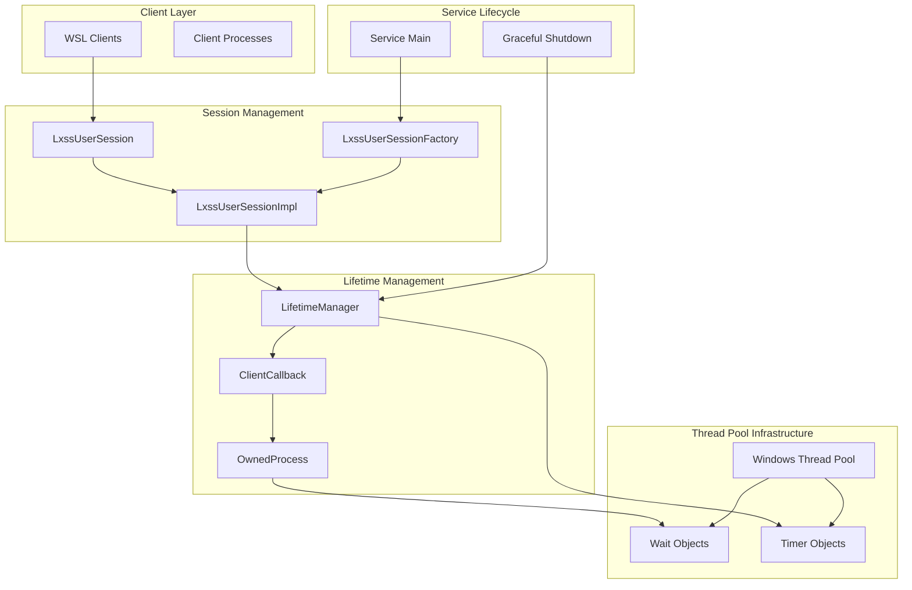
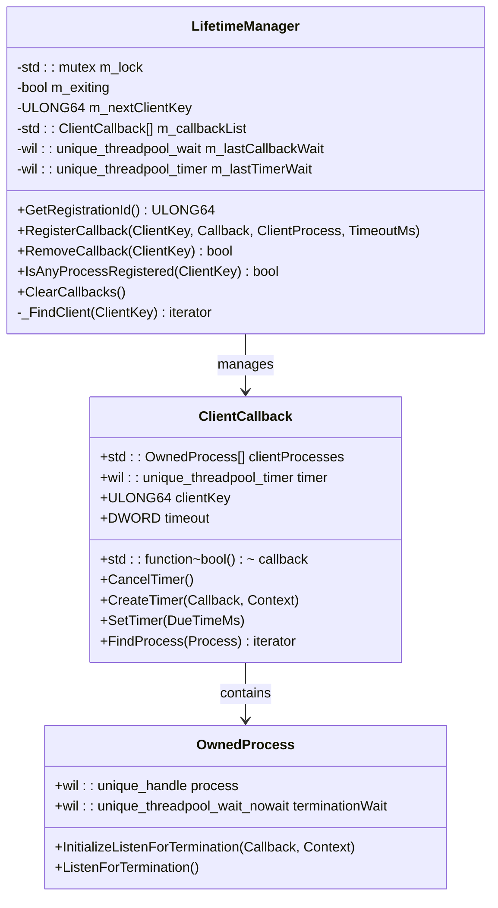
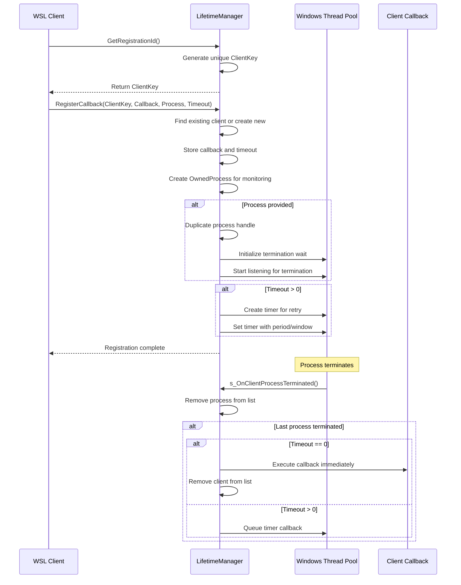
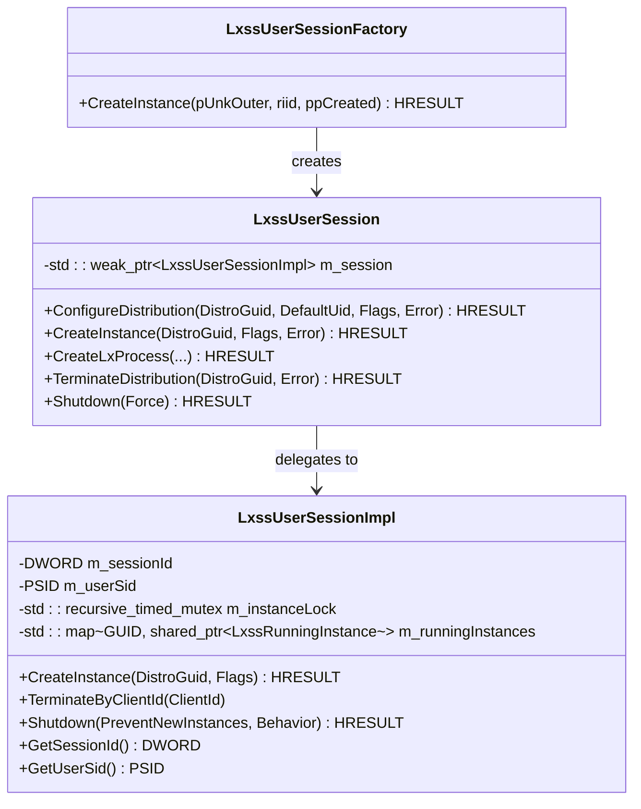
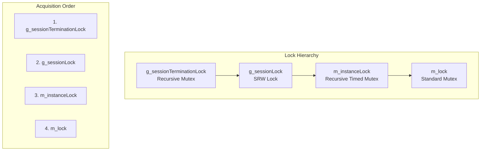
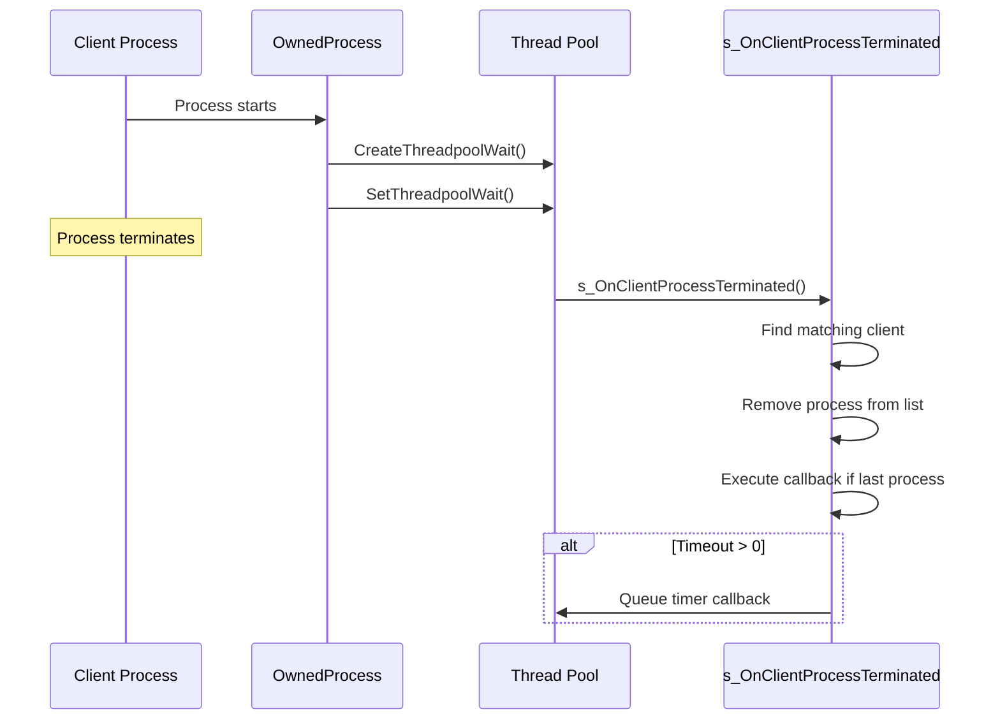
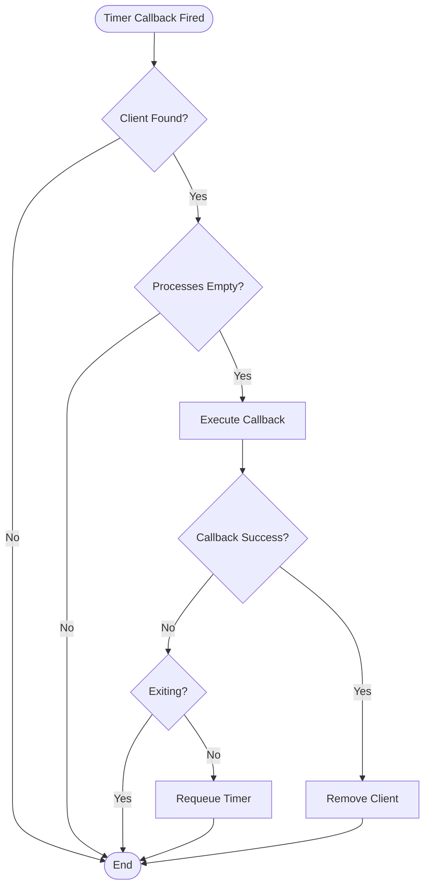
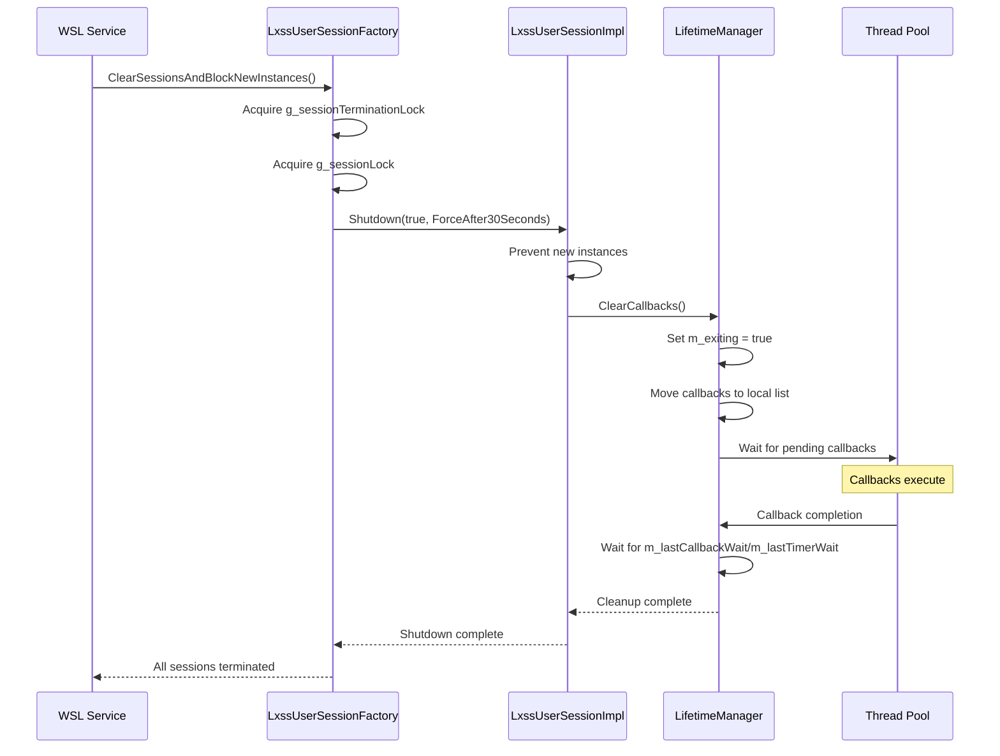

# Session Management

<cite>
**Referenced Files in This Document**
- [Lifetime.cpp](file://src/windows/service/exe/Lifetime.cpp)
- [Lifetime.h](file://src/windows/service/exe/Lifetime.h)
- [LxssUserSession.cpp](file://src/windows/service/exe/LxssUserSession.cpp)
- [LxssUserSession.h](file://src/windows/service/exe/LxssUserSession.h)
- [LxssUserSessionFactory.cpp](file://src/windows/service/exe/LxssUserSessionFactory.cpp)
- [LxssUserSessionFactory.h](file://src/windows/service/exe/LxssUserSessionFactory.h)
- [LxssUserCallback.cpp](file://src/windows/service/exe/LxssUserCallback.cpp)
- [LxssUserCallback.h](file://src/windows/service/exe/LxssUserCallback.h)
- [WslCoreMessageQueue.h](file://src/windows/service/exe/WslCoreMessageQueue.h)
</cite>

## Table of Contents
1. [Introduction](#introduction)
2. [System Architecture Overview](#system-architecture-overview)
3. [LifetimeManager Class Implementation](#lifetimemanager-class-implementation)
4. [Client Callback Registration System](#client-callback-registration-system)
5. [Session Lifecycle Management](#session-lifecycle-management)
6. [Thread Safety and Concurrency Control](#thread-safety-and-concurrency-control)
7. [Windows Thread Pool Integration](#windows-thread-pool-integration)
8. [Service Shutdown and Cleanup](#service-shutdown-and-cleanup)
9. [Best Practices and Common Issues](#best-practices-and-common-issues)
10. [Troubleshooting Guide](#troubleshooting-guide)

## Introduction

The WSL (Windows Subsystem for Linux) service session management system provides a sophisticated framework for managing client lifetimes, process monitoring, and graceful service shutdown. At its core, the system uses the `LifetimeManager` class to track client processes and execute cleanup callbacks when clients terminate or become inactive.

The session management system handles multiple concurrent clients, ensures proper resource cleanup during service shutdown, and maintains responsiveness through asynchronous callback execution using Windows Thread Pool infrastructure. It integrates closely with user session lifecycle events and provides robust mechanisms for handling race conditions and concurrent access scenarios.

## System Architecture Overview

The session management system consists of several interconnected components that work together to provide comprehensive lifetime management:



**Diagram sources**
- [Lifetime.h](file://src/windows/service/exe/Lifetime.h#L19-L99)
- [LxssUserSession.h](file://src/windows/service/exe/LxssUserSession.h#L308-L800)
- [LxssUserSessionFactory.h](file://src/windows/service/exe/LxssUserSessionFactory.h#L26-L65)

## LifetimeManager Class Implementation

The `LifetimeManager` class serves as the central component for managing client lifetimes and callback execution. It provides thread-safe mechanisms for registering, tracking, and cleaning up client processes.

### Core Data Structures

The LifetimeManager uses several key data structures to manage client callbacks:



**Diagram sources**
- [Lifetime.h](file://src/windows/service/exe/Lifetime.h#L39-L99)

### Registration and Management Operations

The LifetimeManager provides comprehensive operations for managing client lifetimes:

| Operation | Purpose | Thread Safety | Timeout Support |
|-----------|---------|---------------|-----------------|
| `GetRegistrationId()` | Generates unique client identifiers | Thread-safe | N/A |
| `RegisterCallback()` | Registers new client with callback | Thread-safe | Yes |
| `RemoveCallback()` | Removes client registration | Thread-safe | N/A |
| `IsAnyProcessRegistered()` | Checks client existence | Thread-safe | N/A |
| `ClearCallbacks()` | Cleans up all callbacks | Thread-safe | N/A |

**Section sources**
- [Lifetime.cpp](file://src/windows/service/exe/Lifetime.cpp#L81-L156)
- [Lifetime.h](file://src/windows/service/exe/Lifetime.h#L29-L37)

## Client Callback Registration System

The client callback registration system enables clients to register for lifetime management with customizable timeout behavior and automatic cleanup mechanisms.

### Registration Process

Client registration involves several steps to establish monitoring and callback mechanisms:



**Diagram sources**
- [Lifetime.cpp](file://src/windows/service/exe/Lifetime.cpp#L96-L141)
- [Lifetime.cpp](file://src/windows/service/exe/Lifetime.cpp#L159-L215)

### Unique Registration IDs

The system generates unique registration IDs using an atomic counter mechanism:

```cpp
ULONG64 LifetimeManager::GetRegistrationId()
{
    std::lock_guard<std::mutex> lock(m_lock);
    THROW_IF_FAILED(ULong64Add(m_nextClientKey, 1, &m_nextClientKey));
    return m_nextClientKey;
}
```

This ensures that each client receives a unique identifier that can be used for subsequent operations like removing callbacks or checking registration status.

**Section sources**
- [Lifetime.cpp](file://src/windows/service/exe/Lifetime.cpp#L81-L87)

## Session Lifecycle Management

The session lifecycle management system handles the complete lifecycle of user sessions, from creation to termination, with proper resource cleanup and integration with Windows session management.

### Session Factory Pattern

The `LxssUserSessionFactory` implements a factory pattern to manage session creation and lifecycle:



**Diagram sources**
- [LxssUserSessionFactory.h](file://src/windows/service/exe/LxssUserSessionFactory.h#L26-L65)
- [LxssUserSession.h](file://src/windows/service/exe/LxssUserSession.h#L68-L307)

### Session Termination and Cleanup

The system provides multiple mechanisms for session termination:

| Termination Method | Trigger | Scope | Cleanup Behavior |
|-------------------|---------|-------|------------------|
| `TerminateByClientId()` | Client process termination | Specific client | Terminate all instances for client |
| `Shutdown()` | Service shutdown | Entire session | Graceful or forced termination |
| `TerminateDistribution()` | Distribution removal | Specific distribution | Stop running instances |
| `UnregisterDistribution()` | Complete removal | Distribution lifecycle | Full cleanup including files |

**Section sources**
- [LxssUserSession.cpp](file://src/windows/service/exe/LxssUserSession.cpp#L2232-L2264)
- [LxssUserSession.cpp](file://src/windows/service/exe/LxssUserSession.cpp#L2266-L2285)

## Thread Safety and Concurrency Control

The session management system implements comprehensive thread safety mechanisms to handle concurrent access from multiple clients while maintaining data consistency.

### Lock Hierarchies

The system uses carefully designed lock hierarchies to prevent deadlocks:



**Diagram sources**
- [LxssUserSessionFactory.cpp](file://src/windows/service/exe/LxssUserSessionFactory.cpp#L26-L28)

### Race Condition Prevention

The system implements several mechanisms to prevent race conditions:

1. **Chain of Waits**: Ensures proper ordering of callback execution
2. **Atomic Operations**: Uses atomic counters for registration IDs
3. **Lock Ordering**: Enforces strict lock acquisition order
4. **Guarded Variables**: Protects critical data with appropriate guards

**Section sources**
- [Lifetime.h](file://src/windows/service/exe/Lifetime.h#L92-L96)
- [Lifetime.cpp](file://src/windows/service/exe/Lifetime.cpp#L46-L79)

## Windows Thread Pool Integration

The session management system extensively uses Windows Thread Pool infrastructure for asynchronous callback execution and process monitoring.

### Thread Pool Wait Objects

Process termination monitoring is implemented using Windows Thread Pool wait objects:



**Diagram sources**
- [Lifetime.cpp](file://src/windows/service/exe/Lifetime.cpp#L297-L306)
- [Lifetime.cpp](file://src/windows/service/exe/Lifetime.cpp#L159-L215)

### Timer-Based Retry Mechanisms

The system implements timer-based retry mechanisms for failed callbacks:



**Diagram sources**
- [Lifetime.cpp](file://src/windows/service/exe/Lifetime.cpp#L217-L268)

**Section sources**
- [Lifetime.cpp](file://src/windows/service/exe/Lifetime.cpp#L159-L268)

## Service Shutdown and Cleanup

The service shutdown process implements a coordinated cleanup mechanism that ensures all resources are properly released and callbacks are executed before service termination.

### Shutdown Coordination

The shutdown process follows a specific sequence to ensure proper cleanup:



**Diagram sources**
- [LxssUserSessionFactory.cpp](file://src/windows/service/exe/LxssUserSessionFactory.cpp#L38-L74)
- [Lifetime.cpp](file://src/windows/service/exe/Lifetime.cpp#L46-L79)

### Resource Cleanup Strategies

The system employs multiple strategies for resource cleanup:

1. **Immediate Cleanup**: For critical resources during normal operation
2. **Deferred Cleanup**: Using thread pool waits to ensure proper ordering
3. **Graceful Degradation**: Allowing partial cleanup during shutdown
4. **Timeout Handling**: Implementing timeouts for cleanup operations

**Section sources**
- [Lifetime.cpp](file://src/windows/service/exe/Lifetime.cpp#L36-L44)
- [LxssUserSession.cpp](file://src/windows/service/exe/LxssUserSession.cpp#L667-L679)

## Best Practices and Common Issues

### Proper Cleanup During Service Shutdown

To ensure proper cleanup during service shutdown:

1. **Always call `ClearCallbacks()`** before service termination
2. **Use the chain of waits mechanism** to coordinate callback execution
3. **Respect the lock hierarchy** to prevent deadlocks
4. **Handle timeout scenarios** gracefully with retry mechanisms

### Avoiding Race Conditions

Common race condition scenarios and solutions:

| Scenario | Problem | Solution |
|----------|---------|----------|
| Callback execution vs. destruction | Access to destroyed objects | Chain of waits mechanism |
| Concurrent modifications | Data corruption | Lock hierarchy enforcement |
| Process termination timing | Missing notifications | Atomic state tracking |
| Shutdown coordination | Partial cleanup | Deferred cleanup with timeouts |

### Memory Management Guidelines

Proper memory management practices:

1. **Use smart pointers** for object ownership
2. **Release handles properly** in destructors
3. **Avoid circular references** in callback chains
4. **Clean up thread pool resources** explicitly

## Troubleshooting Guide

### Common Issues and Solutions

#### Issue: Callbacks Not Executing During Shutdown

**Symptoms**: Resources not cleaned up properly, handles remaining open

**Diagnosis**:
- Check if `m_exiting` flag is set correctly
- Verify thread pool wait object cleanup
- Ensure proper lock ordering

**Solution**:
```cpp
// Ensure proper shutdown sequence
lifetimeManager.ClearCallbacks();
// Wait for all callbacks to complete
// This is handled automatically by the destructor
```

#### Issue: Deadlocks During Concurrent Access

**Symptoms**: Service hangs, timeouts occur

**Diagnosis**:
- Review lock acquisition order
- Check for recursive lock usage
- Verify SRW lock usage patterns

**Solution**:
```cpp
// Correct lock ordering
std::lock_guard lock(g_sessionTerminationLock);
auto sessionsLock = g_sessionLock.lock_exclusive();
```

#### Issue: Process Monitoring Failures

**Symptoms**: Processes not detected as terminated

**Diagnosis**:
- Verify process handle duplication
- Check thread pool wait object initialization
- Ensure proper wait object cleanup

**Solution**:
```cpp
// Proper process monitoring setup
ownedProcess.InitializeListenForTermination(
    s_OnClientProcessTerminated, this);
ownedProcess.ListenForTermination();
```

### Debugging Techniques

1. **Enable tracing** for callback execution
2. **Monitor lock contention** using performance counters
3. **Track thread pool usage** with diagnostic tools
4. **Verify resource cleanup** with handle tracking

**Section sources**
- [Lifetime.cpp](file://src/windows/service/exe/Lifetime.cpp#L46-L79)
- [Lifetime.h](file://src/windows/service/exe/Lifetime.h#L92-L96)