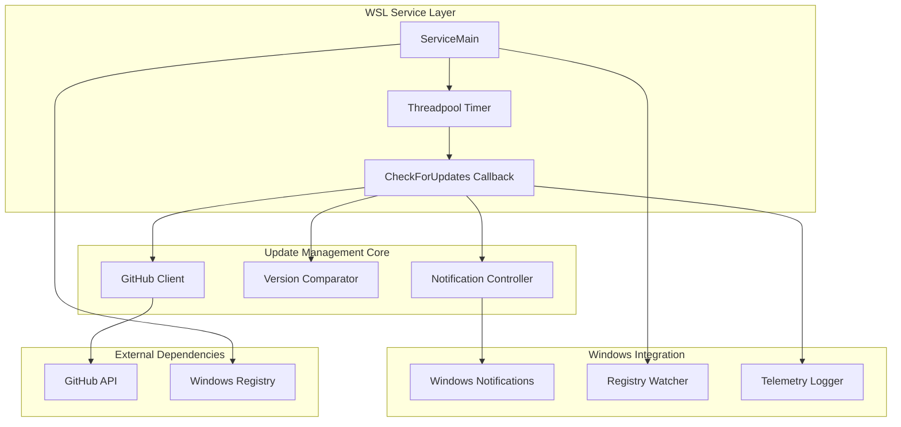
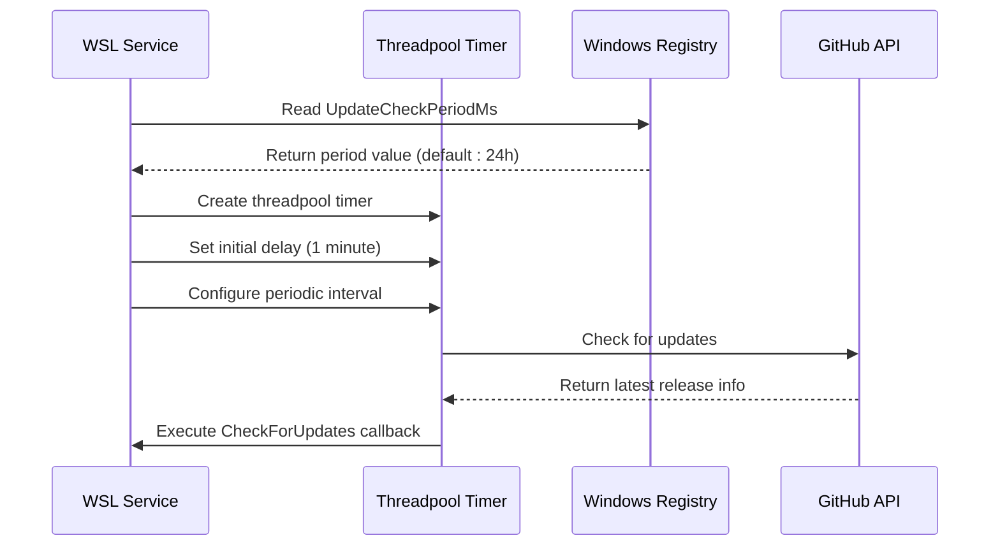
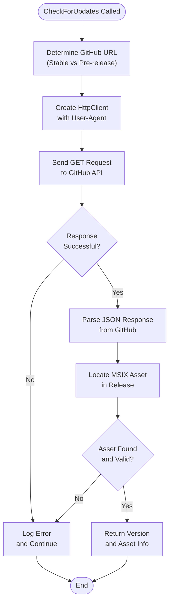
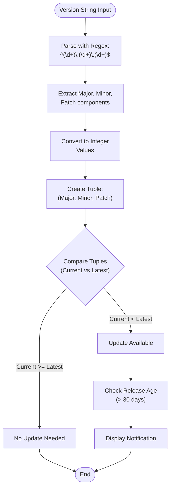
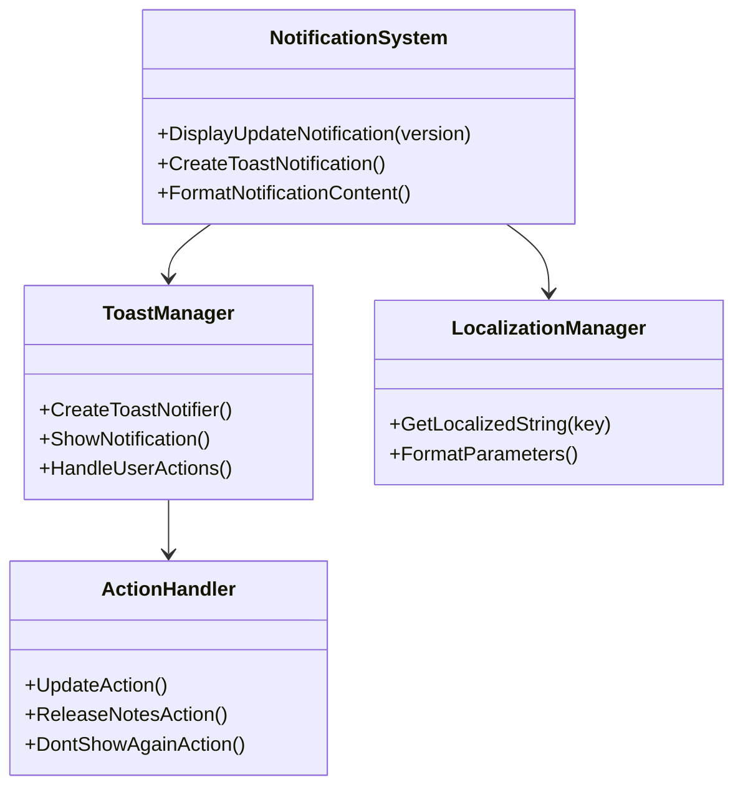
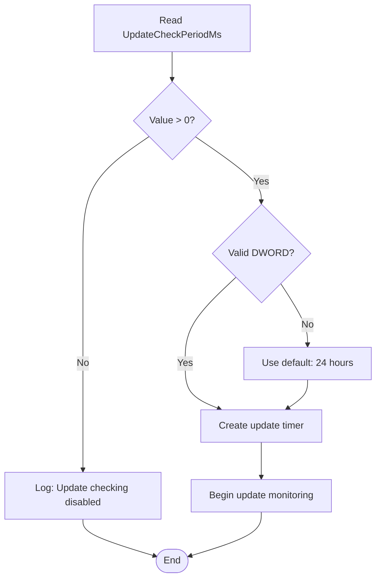
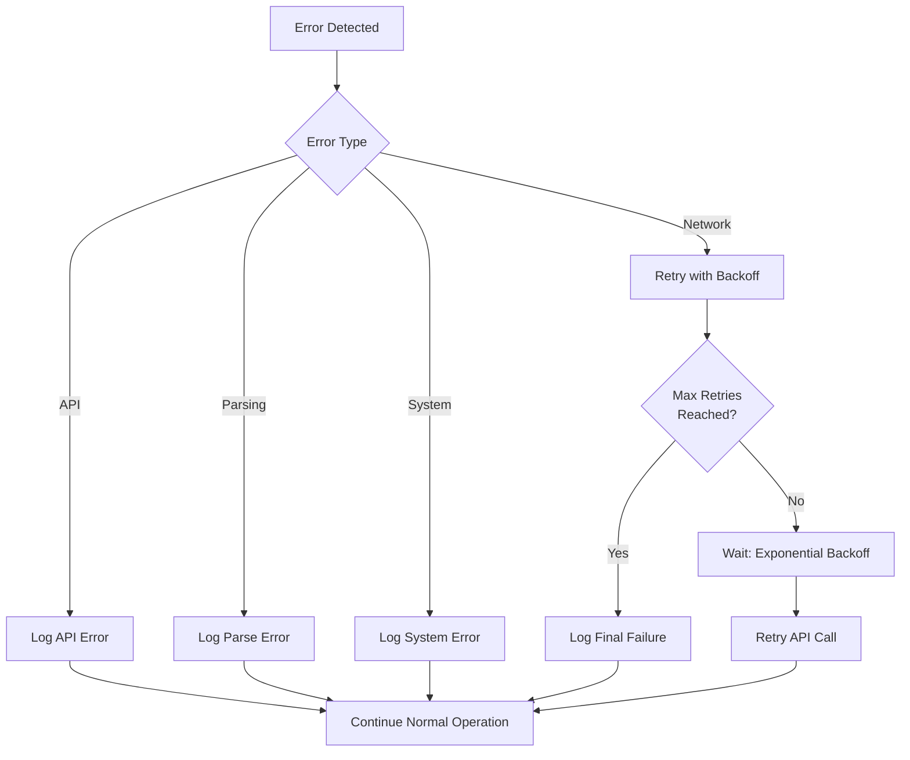
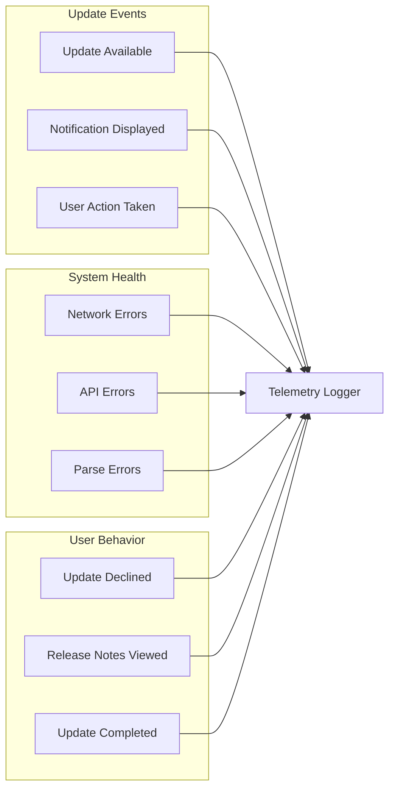

# Update Management

<cite>
**Referenced Files in This Document**
- [ServiceMain.cpp](file://src/windows/service/exe/ServiceMain.cpp)
- [notifications.cpp](file://src/windows/common/notifications.cpp)
- [notifications.h](file://src/windows/common/notifications.h)
- [wslutil.cpp](file://src/windows/common/wslutil.cpp)
- [wslutil.h](file://src/windows/common/wslutil.h)
- [WslTelemetry.cpp](file://src/windows/common/WslTelemetry.cpp)
- [GuestTelemetryLogger.cpp](file://src/windows/service/exe/GuestTelemetryLogger.cpp)
- [wslversioninfo.h](file://src/windows/inc/wslversioninfo.h)
- [defs.h](file://src/shared/inc/defs.h)
</cite>

## Table of Contents
1. [Introduction](#introduction)
2. [System Architecture](#system-architecture)
3. [Update Checking Timer Implementation](#update-checking-timer-implementation)
4. [GitHub API Integration](#github-api-integration)
5. [Version Comparison Logic](#version-comparison-logic)
6. [Notification System Integration](#notification-system-integration)
7. [Configuration Management](#configuration-management)
8. [Error Handling and Logging](#error-handling-and-logging)
9. [Telemetry and Monitoring](#telemetry-and-monitoring)
10. [Troubleshooting Guide](#troubleshooting-guide)
11. [Conclusion](#conclusion)

## Introduction

The WSL (Windows Subsystem for Linux) service update management system is a sophisticated automated mechanism that continuously monitors for new releases of the WSL package. This system operates through a timer-based architecture that periodically checks GitHub releases, compares version numbers against the currently installed version, and notifies users when updates become available after a 30-day grace period.

The update management system is designed to balance user convenience with system reliability, ensuring that users receive timely notifications about available updates while avoiding excessive interruptions. The system integrates seamlessly with Windows notification infrastructure and provides comprehensive telemetry for monitoring update adoption rates.

## System Architecture

The WSL update management system follows a modular architecture with clear separation of concerns:

**Diagram sources**
- [ServiceMain.cpp](file://src/windows/service/exe/ServiceMain.cpp#L261-L315)
- [notifications.cpp](file://src/windows/common/notifications.cpp#L76-L106)

The architecture consists of several key components:

- **Service Layer**: Manages the overall update checking lifecycle through Windows service infrastructure
- **Update Management Core**: Handles GitHub API communication, version comparisons, and notification logic
- **Windows Integration**: Interfaces with Windows notification systems and registry configuration
- **External Dependencies**: Communicates with GitHub APIs and reads configuration from Windows Registry

**Section sources**
- [ServiceMain.cpp](file://src/windows/service/exe/ServiceMain.cpp#L45-L73)
- [notifications.h](file://src/windows/common/notifications.h#L17-L44)

## Update Checking Timer Implementation

The update checking timer is implemented using Windows threadpool timers, providing efficient background processing without blocking the main service thread. The timer initialization occurs during service startup and is configured through registry settings.

### Timer Initialization in ServiceStarted()

The timer setup begins in the [`ServiceStarted()`](file://src/windows/service/exe/ServiceMain.cpp#L206-L219) method, which is called when the WSL service becomes operational:

**Diagram sources**
- [ServiceMain.cpp](file://src/windows/service/exe/ServiceMain.cpp#L261-L282)

The timer initialization process involves several critical steps:

1. **Registry Configuration Reading**: The system reads the `UpdateCheckPeriodMs` registry value from the `HKEY_LOCAL_MACHINE\SOFTWARE\Microsoft\Windows\CurrentVersion\Lxss` key
2. **Default Value Application**: If the registry value is not set or invalid, the system defaults to 24 hours (86,400,000 milliseconds)
3. **Timer Creation**: A threadpool timer is created using `CreateThreadpoolTimer()` with the `CheckForUpdates` callback function
4. **Timing Configuration**: The timer is configured with an initial delay of 1 minute and subsequent intervals based on the registry setting

### Timer Configuration Through Registry

The update check period is controlled through the `UpdateCheckPeriodMs` registry value, allowing administrators to customize the frequency of update checks:

| Configuration Option | Value Range | Default | Description |
|---------------------|-------------|---------|-------------|
| UpdateCheckPeriodMs | 0 or positive integer | 86,400,000 (24 hours) | Interval between update checks in milliseconds |
| Disabled (0) | 0 | N/A | Disables automatic update checking |

When the registry value is set to 0, the update checking mechanism is completely disabled, preventing any network activity or GitHub API calls.

**Section sources**
- [ServiceMain.cpp](file://src/windows/service/exe/ServiceMain.cpp#L261-L282)

## GitHub API Integration

The system communicates with GitHub's REST API to retrieve the latest WSL releases and compare version information. The integration handles both stable and pre-release versions, with appropriate error handling for network connectivity issues.

### GitHub API Communication Flow

**Diagram sources**
- [wslutil.cpp](file://src/windows/common/wslutil.cpp#L940-L954)
- [wslutil.cpp](file://src/windows/common/wslutil.cpp#L956-L985)

### API Endpoint Configuration

The system uses different GitHub API endpoints based on the update type:

- **Stable Releases**: `https://api.github.com/repos/microsoft/WSL/releases/latest`
- **Pre-releases**: `https://api.github.com/repos/microsoft/WSL/releases`
- **Specific Tag**: `https://api.github.com/repos/microsoft/WSL/releases/tags/{tag}`

Each endpoint is accessed with appropriate HTTP headers, including a custom User-Agent string for API identification and rate limiting compliance.

### Error Handling During API Calls

The GitHub API integration includes comprehensive error handling for various failure scenarios:

| Error Type | Handling Strategy | Recovery Action |
|------------|------------------|-----------------|
| Network Timeout | Automatic retry with exponential backoff | Continue with next scheduled check |
| HTTP 4xx/5xx | Log error and skip update check | Maintain current timer schedule |
| JSON Parsing Failure | Throw structured exception | Disable update checking temporarily |
| Missing Assets | Skip release and continue search | Check next available release |

**Section sources**
- [wslutil.cpp](file://src/windows/common/wslutil.cpp#L940-L999)

## Version Comparison Logic

The version comparison system uses semantic versioning principles to determine whether an update is available. The comparison logic handles the `WSL_PACKAGE_VERSION` macro and parses version strings into comparable tuples.

### Version Parsing and Comparison

**Diagram sources**
- [wslutil.cpp](file://src/windows/common/wslutil.cpp#L1283-L1297)

### Version Comparison Algorithm

The version comparison process follows these steps:

1. **Regex Pattern Matching**: Version strings are parsed using the pattern `^(\d+)\.(\d+)\.(\d+)$` to extract major, minor, and patch components
2. **Integer Conversion**: Each component is converted to unsigned integers for numerical comparison
3. **Tuple Creation**: Versions are represented as `(major, minor, patch)` tuples for lexicographical comparison
4. **Comparison Logic**: The system compares tuples element-wise, prioritizing major version changes over minor and patch updates

### Release Age Threshold Logic

The system implements a 30-day grace period before displaying update notifications:

- **Release Date Calculation**: The creation date of the current WSL installation is retrieved from the GitHub API
- **Age Comparison**: The system calculates the difference between the current date and the release date
- **Threshold Enforcement**: Notifications are only displayed if the release is older than 30 days
- **Timer Reset**: Once an update is detected, the timer is canceled to prevent repeated notifications

**Section sources**
- [ServiceMain.cpp](file://src/windows/service/exe/ServiceMain.cpp#L288-L313)
- [wslutil.cpp](file://src/windows/common/wslutil.cpp#L1283-L1297)

## Notification System Integration

The update notification system integrates with Windows Toast notifications to provide user-friendly update alerts. The system generates rich notification content with actionable buttons for immediate updates or release notes review.

### Notification Display Architecture

**Diagram sources**
- [notifications.cpp](file://src/windows/common/notifications.cpp#L76-L106)
- [notifications.h](file://src/windows/common/notifications.h#L17-L23)

### Notification Content Generation

The notification system creates rich XML content for Windows Toast notifications:

| Element | Purpose | Content |
|---------|---------|---------|
| Title | Update announcement | "New WSL Version Available" |
| Body | Version information | "Update to version X.Y.Z" |
| Primary Action | Immediate update | "--update" command |
| Secondary Action | Release notes | "--release-notes" command |

### User Interaction Handling

The notification system supports multiple user actions:

- **Immediate Update**: Executes `wsl --update` to install the latest version
- **Release Notes**: Opens browser to GitHub release page for detailed changelog
- **Dismissal**: Allows users to hide future notifications permanently

**Section sources**
- [notifications.cpp](file://src/windows/common/notifications.cpp#L76-L106)

## Configuration Management

The update management system provides flexible configuration options through Windows Registry settings, allowing administrators to control update checking behavior and customize the update experience.

### Registry Configuration Options

| Registry Key | Value Type | Default | Description |
|--------------|------------|---------|-------------|
| `UpdateCheckPeriodMs` | DWORD | 86,400,000 | Update check interval in milliseconds |
| `GitHubUrlOverride` | REG_SZ | Official GitHub | Override GitHub API endpoint |
| `DisableUpdateChecks` | REG_DWORD | 0 | Completely disable update checking |

### Configuration Validation

The system performs comprehensive validation of registry settings:

**Diagram sources**
- [ServiceMain.cpp](file://src/windows/service/exe/ServiceMain.cpp#L264-L274)

### Administrative Control

Administrators can control update behavior through Group Policy and registry modifications:

- **Enterprise Deployment**: Disable updates entirely for controlled environments
- **Custom Intervals**: Adjust update check frequency based on organizational needs
- **Alternative Endpoints**: Use internal GitHub Enterprise instances for security compliance

**Section sources**
- [ServiceMain.cpp](file://src/windows/service/exe/ServiceMain.cpp#L264-L274)

## Error Handling and Logging

The update management system implements comprehensive error handling and logging to ensure reliable operation and facilitate troubleshooting. The system uses Windows Error Reporting (WER) and structured logging for error capture and analysis.

### Error Handling Strategy

**Diagram sources**
- [ServiceMain.cpp](file://src/windows/service/exe/ServiceMain.cpp#L285-L315)
- [WslTelemetry.cpp](file://src/windows/common/WslTelemetry.cpp#L81-L117)

### Logging Infrastructure

The system employs multiple logging mechanisms:

| Logging Level | Purpose | Implementation |
|---------------|---------|----------------|
| Information | Successful operations | `WSL_LOG()` macro with `WINEVENT_LEVEL_INFO` |
| Warning | Recoverable errors | Structured warning messages |
| Error | Critical failures | Comprehensive error reporting with stack traces |
| Telemetry | Usage analytics | Structured event logging for monitoring |

### Exception Handling Patterns

The system uses consistent exception handling patterns across all components:

- **CATCH_LOG()**: Standard error logging wrapper for catch blocks
- **THROW_HR_IF()**: Conditional exception throwing with HRESULT codes
- **LOG_CAUGHT_EXCEPTION()**: Explicit logging of caught exceptions
- **ExecutionContext**: Context-aware error tracking for debugging

**Section sources**
- [ServiceMain.cpp](file://src/windows/service/exe/ServiceMain.cpp#L285-L315)
- [WslTelemetry.cpp](file://src/windows/common/WslTelemetry.cpp#L81-L117)

## Telemetry and Monitoring

The update management system includes comprehensive telemetry capabilities to monitor update adoption rates, system health, and user engagement with update notifications.

### Telemetry Data Collection

**Diagram sources**
- [GuestTelemetryLogger.cpp](file://src/windows/service/exe/GuestTelemetryLogger.cpp#L80-L96)

### Telemetry Categories

The system tracks several categories of telemetry data:

| Category | Events Tracked | Privacy Considerations |
|----------|----------------|----------------------|
| Update Availability | Release detection, version comparison | Public GitHub data |
| Notification Engagement | Display count, action clicks | User interaction only |
| System Performance | API response times, error rates | Network metrics only |
| User Preferences | Notification opt-out, action preferences | User choices only |

### Monitoring Dashboard

The telemetry system enables real-time monitoring of update management effectiveness:

- **Update Adoption Rate**: Percentage of users receiving and acting on update notifications
- **API Reliability**: Success/failure rates for GitHub API calls
- **System Health**: Error rates and performance metrics
- **User Engagement**: Notification click-through rates and action completion

**Section sources**
- [GuestTelemetryLogger.cpp](file://src/windows/service/exe/GuestTelemetryLogger.cpp#L80-L96)

## Troubleshooting Guide

This section provides guidance for diagnosing and resolving common issues with the WSL update management system.

### Common Issues and Solutions

| Issue | Symptoms | Diagnosis | Resolution |
|-------|----------|-----------|------------|
| Updates Not Detected | No update notifications | Check registry configuration | Verify `UpdateCheckPeriodMs` setting |
| Network Connectivity | API timeouts | Monitor network logs | Check firewall and proxy settings |
| Version Comparison Failures | Incorrect update prompts | Review version parsing | Validate version string format |
| Notification Delivery | Notifications not appearing | Check notification settings | Verify Windows notification preferences |

### Diagnostic Commands

The system provides several diagnostic capabilities:

- **Version Information**: `wsl --version` displays current WSL version and update status
- **Update History**: Review recent update attempts and outcomes
- **Configuration Validation**: Verify registry settings and network connectivity
- **Telemetry Analysis**: Examine update-related telemetry events

### Performance Optimization

For systems experiencing performance issues with update checking:

1. **Increase Check Interval**: Set `UpdateCheckPeriodMs` to longer intervals (e.g., 7 days)
2. **Disable Updates**: Set to 0 for environments requiring minimal network activity
3. **Network Optimization**: Configure proxy settings for corporate networks
4. **Registry Cleanup**: Remove obsolete registry entries from previous installations

**Section sources**
- [ServiceMain.cpp](file://src/windows/service/exe/ServiceMain.cpp#L264-L274)

## Conclusion

The WSL update management system represents a sophisticated approach to maintaining software quality while respecting user preferences and system resources. Through its timer-based architecture, comprehensive error handling, and seamless Windows integration, the system ensures that users receive timely updates without compromising system performance or user experience.

Key strengths of the system include:

- **Reliable Background Operation**: Threadpool timers ensure updates are checked without impacting service responsiveness
- **Flexible Configuration**: Registry-based settings allow administrators to customize update behavior
- **Robust Error Handling**: Comprehensive error recovery prevents update checking from disrupting service operation
- **User-Centric Design**: Notifications provide clear, actionable information with user choice controls
- **Transparent Monitoring**: Extensive telemetry enables continuous improvement and system health monitoring

The system's design demonstrates best practices for modern Windows service development, incorporating enterprise-grade reliability features while maintaining simplicity for end-user benefit. Future enhancements could include machine learning-based update scheduling and enhanced privacy controls for telemetry collection.