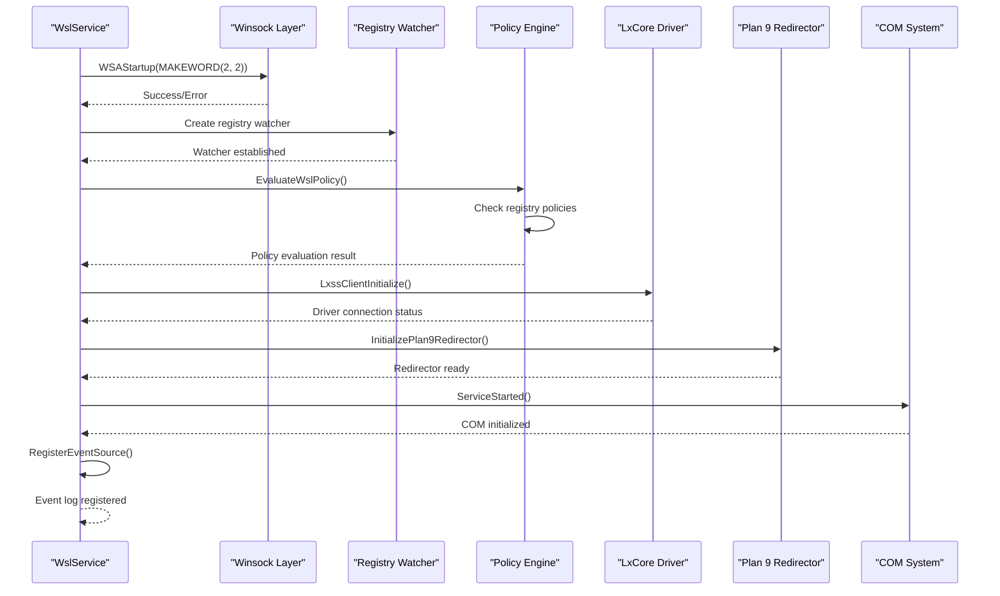
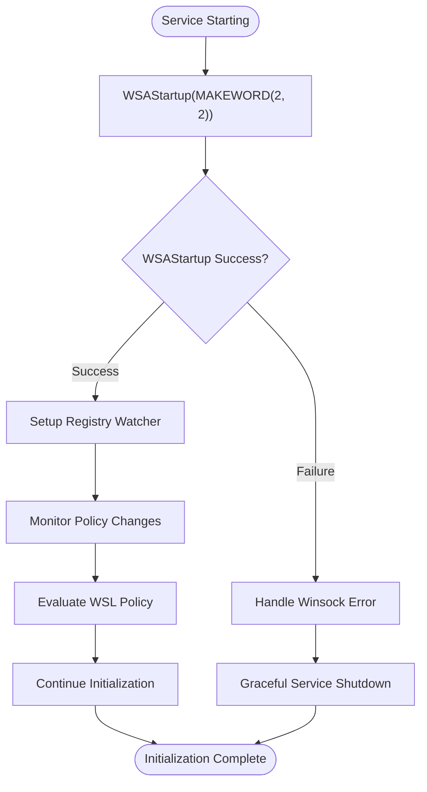
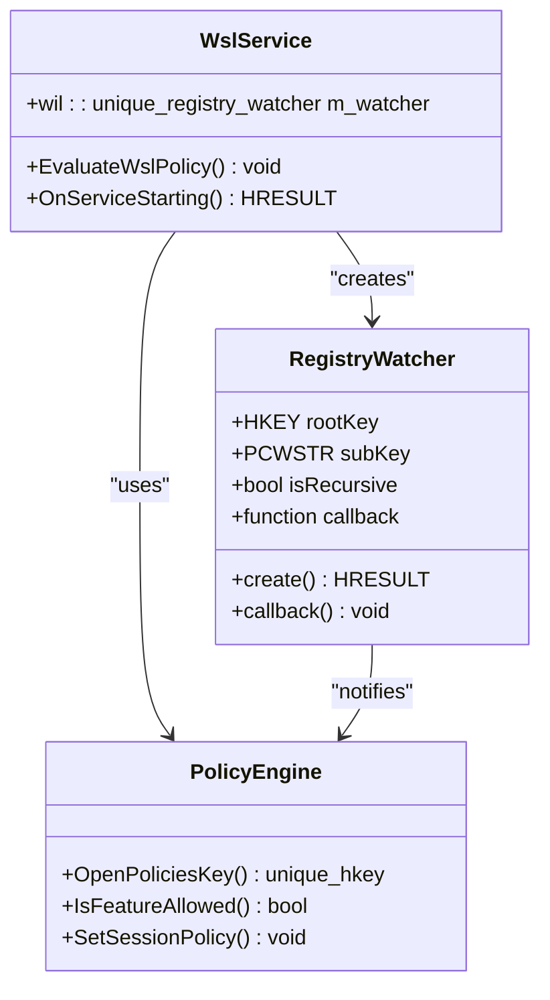
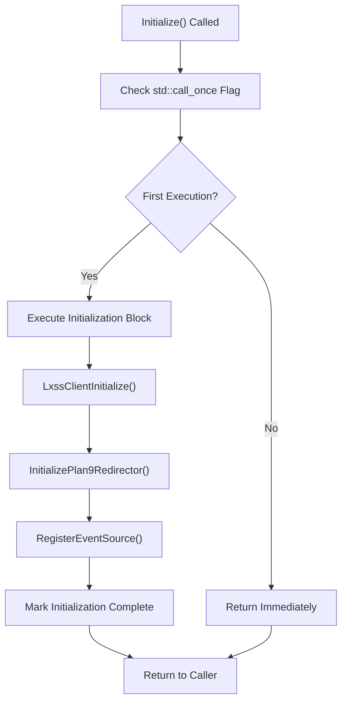
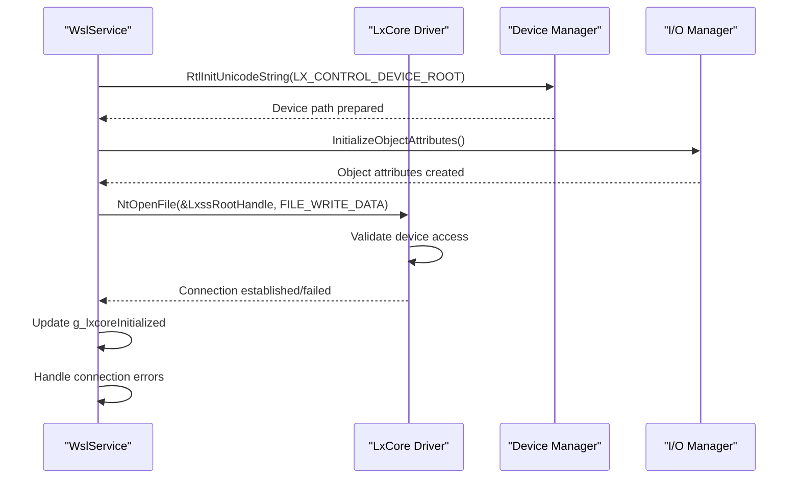
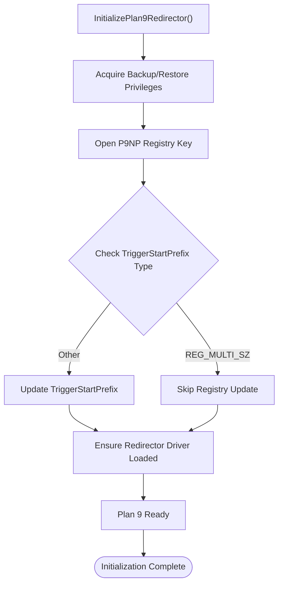
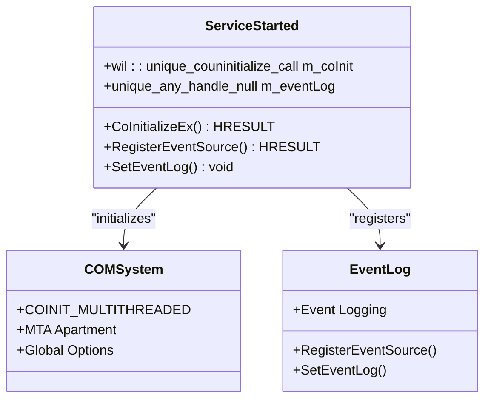
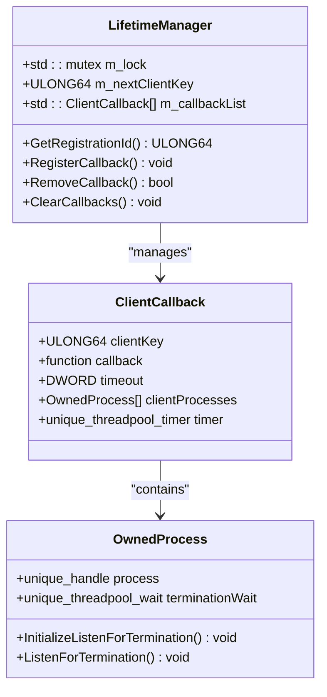
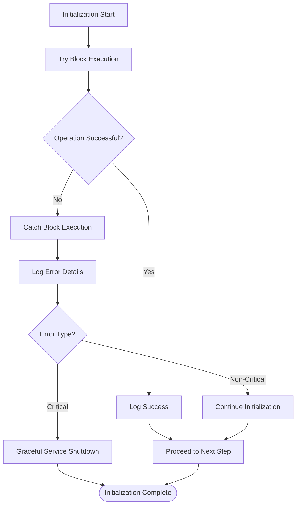
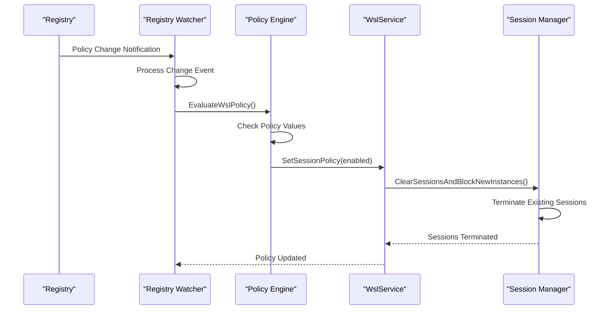

# Core Initialization Phase

<cite>
**Referenced Files in This Document**
- [ServiceMain.cpp](file://src/windows/service/exe/ServiceMain.cpp)
- [Lifetime.cpp](file://src/windows/service/exe/Lifetime.cpp)
- [Lifetime.h](file://src/windows/service/exe/Lifetime.h)
- [LxssInstance.cpp](file://src/windows/service/exe/LxssInstance.cpp)
- [LxssUserSessionFactory.cpp](file://src/windows/service/exe/LxssUserSessionFactory.cpp)
- [LxssUserSessionFactory.h](file://src/windows/service/exe/LxssUserSessionFactory.h)
- [LxssUserSession.cpp](file://src/windows/service/exe/LxssUserSession.cpp)
- [lxssclient.cpp](file://src/windows/common/lxssclient.cpp)
- [RegistryWatcher.h](file://src/windows/inc/RegistryWatcher.h)
- [wslpolicies.h](file://src/windows/inc/wslpolicies.h)
- [PolicyTests.cpp](file://test/windows/PolicyTests.cpp)
- [comservicehelper.h](file://src/windows/inc/comservicehelper.h)
</cite>

## Table of Contents
1. [Introduction](#introduction)
2. [Service Startup Sequence](#service-startup-sequence)
3. [Winsock Initialization](#winsock-initialization)
4. [Registry Policy Monitoring](#registry-policy-monitoring)
5. [Lazy Initialization Pattern](#lazy-initialization-pattern)
6. [LxCore Driver Connectivity](#lxcore-driver-connectivity)
7. [Plan 9 Redirector Setup](#plan-9-redirector-setup)
8. [COM and Event Log Initialization](#com-and-event-log-initialization)
9. [Lifetime Manager and Session Tracking](#lifetime-manager-and-session-tracking)
10. [Error Handling and Resilience](#error-handling-and-resilience)
11. [Registry Policy Change Handling](#registry-policy-change-handling)
12. [Conclusion](#conclusion)

## Introduction

The Windows Subsystem for Linux (WSL) service initialization phase represents a sophisticated multi-stage bootstrap process that establishes the foundation for WSL functionality. This comprehensive initialization sequence begins with low-level system component setup and progresses through policy evaluation, driver connectivity establishment, and runtime infrastructure creation. The initialization process is designed with resilience, policy compliance, and lazy loading principles to ensure optimal performance and reliability.

The core initialization phase encompasses several critical subsystems including Winsock initialization for network connectivity, registry watcher creation for dynamic policy monitoring, the EvaluateWslPolicy mechanism that controls service enablement, and the lazy initialization pattern that optimizes resource utilization. This document provides detailed coverage of each initialization stage, explaining the architectural decisions, error handling strategies, and interdependencies between components.

## Service Startup Sequence

The WSL service follows a carefully orchestrated startup sequence that ensures proper initialization order and dependency resolution. The service startup begins with the `OnServiceStarting()` method, which serves as the primary entry point for initialization activities.

**Diagram sources**
- [ServiceMain.cpp](file://src/windows/service/exe/ServiceMain.cpp#L155-L194)
- [ServiceMain.cpp](file://src/windows/service/exe/ServiceMain.cpp#L206-L220)

The initialization sequence demonstrates a clear separation of concerns with each stage building upon the successful completion of previous stages. The service employs defensive programming techniques, including comprehensive error checking and graceful degradation capabilities.

**Section sources**
- [ServiceMain.cpp](file://src/windows/service/exe/ServiceMain.cpp#L155-L194)
- [ServiceMain.cpp](file://src/windows/service/exe/ServiceMain.cpp#L206-L220)

## Winsock Initialization

The Winsock initialization phase represents the foundational network infrastructure setup that enables subsequent network-dependent operations. The service initializes Winsock version 2.2 using the `WSAStartup()` function, establishing the necessary network programming interface for all network-related operations.

The Winsock initialization occurs early in the startup sequence to ensure that network functionality is available for all subsequent initialization stages. This timing is crucial because several components depend on network connectivity for their operation, including the registry watcher for policy monitoring and various network services.

**Diagram sources**
- [ServiceMain.cpp](file://src/windows/service/exe/ServiceMain.cpp#L176-L178)

The Winsock initialization process includes comprehensive error handling and logging to ensure that any network-related issues are properly captured and reported. The service maintains strict error checking throughout the initialization process to prevent partial initialization scenarios.

**Section sources**
- [ServiceMain.cpp](file://src/windows/service/exe/ServiceMain.cpp#L176-L178)

## Registry Policy Monitoring

The registry policy monitoring system represents a critical component of the WSL service initialization that ensures compliance with enterprise policies and security configurations. The service creates a registry watcher that monitors changes to WSL-related policy keys in real-time, enabling dynamic policy enforcement without requiring service restarts.

The registry watcher is established before policy evaluation to ensure that no policy changes are missed during the initialization process. This design choice prevents race conditions where policy changes could occur between policy evaluation and watcher establishment.

**Diagram sources**
- [ServiceMain.cpp](file://src/windows/service/exe/ServiceMain.cpp#L180-L191)
- [RegistryWatcher.h](file://src/windows/inc/RegistryWatcher.h#L15-L100)
- [wslpolicies.h](file://src/windows/inc/wslpolicies.h#L90-L105)

The registry watcher implementation utilizes the Windows Thread Pool infrastructure for efficient asynchronous notification handling. The watcher supports recursive monitoring and provides comprehensive error handling for various registry access scenarios.

**Section sources**
- [ServiceMain.cpp](file://src/windows/service/exe/ServiceMain.cpp#L180-L191)
- [RegistryWatcher.h](file://src/windows/inc/RegistryWatcher.h#L15-L100)

## Lazy Initialization Pattern

The lazy initialization pattern implemented in the WSL service ensures optimal resource utilization by deferring expensive initialization operations until they are actually required. The `Initialize()` method employs the `std::call_once` mechanism to guarantee single execution of initialization code while maintaining thread safety.

**Diagram sources**
- [ServiceMain.cpp](file://src/windows/service/exe/ServiceMain.cpp#L90-L111)

The lazy initialization approach provides several benefits including reduced startup time, improved memory efficiency, and enhanced fault tolerance. The initialization block contains critical subsystem setup operations that are deferred until the first service request requires them.

The `std::call_once` implementation ensures that the initialization code executes exactly once, even in multithreaded scenarios where multiple threads might simultaneously call the initialization method. This thread-safe approach eliminates the need for additional synchronization mechanisms during initialization.

**Section sources**
- [ServiceMain.cpp](file://src/windows/service/exe/ServiceMain.cpp#L90-L111)

## LxCore Driver Connectivity

The LxCore driver connectivity establishment represents a fundamental aspect of the WSL service initialization that enables communication with the underlying Linux subsystem driver. The `LxssClientInitialize()` function establishes the connection to the LXSS driver, providing the foundation for all Linux subsystem operations.

**Diagram sources**
- [lxssclient.cpp](file://src/windows/common/lxssclient.cpp#L20-L68)

The LxCore driver initialization process involves several critical steps including device path preparation, object attribute creation, and the actual connection establishment. The function implements comprehensive error handling to manage various failure scenarios gracefully.

The connection status is tracked through the global `g_lxcoreInitialized` flag, which influences subsequent initialization decisions and service behavior. This flag ensures that dependent components can make informed decisions about their operational state based on driver availability.

**Section sources**
- [lxssclient.cpp](file://src/windows/common/lxssclient.cpp#L20-L68)
- [ServiceMain.cpp](file://src/windows/service/exe/ServiceMain.cpp#L96-L98)

## Plan 9 Redirector Setup

The Plan 9 redirector setup represents a specialized initialization component that enables Unix-style filesystem sharing between Windows and Linux environments. The `InitializePlan9Redirector()` function performs several critical operations to ensure proper Plan 9 redirector functionality.

**Diagram sources**
- [ServiceMain.cpp](file://src/windows/service/exe/ServiceMain.cpp#L113-L153)

The Plan 9 redirector initialization includes privilege acquisition for registry modifications, registry key validation and update, and driver loading verification. The function implements fallback mechanisms to handle different Windows versions and build configurations.

The registry update process specifically addresses compatibility issues with older Windows 10 builds that may not support the newer Plan 9 redirector features. The function includes version detection logic to ensure appropriate compatibility measures are applied.

**Section sources**
- [ServiceMain.cpp](file://src/windows/service/exe/ServiceMain.cpp#L113-L153)

## COM and Event Log Initialization

The COM and event log initialization establishes the foundation for component object model functionality and system event logging capabilities. The `ServiceStarted()` method orchestrates these initialization activities, ensuring proper COM apartment threading and event log source registration.

**Diagram sources**
- [ServiceMain.cpp](file://src/windows/service/exe/ServiceMain.cpp#L206-L220)
- [comservicehelper.h](file://src/windows/inc/comservicehelper.h#L49-L104)

The COM initialization process configures the service for multithreaded apartment (MTA) operation, enabling concurrent access to COM objects from multiple threads. The initialization includes comprehensive error handling and cleanup procedures to ensure proper resource management.

The event log registration establishes the service's ability to log events to the Windows Event Log system, providing essential diagnostic and operational information for system administrators and support personnel.

**Section sources**
- [ServiceMain.cpp](file://src/windows/service/exe/ServiceMain.cpp#L206-L220)
- [comservicehelper.h](file://src/windows/inc/comservicehelper.h#L49-L104)

## Lifetime Manager and Session Tracking

The lifetime manager and session tracking system represents a sophisticated component that monitors client process lifetimes and manages session lifecycle operations. The `LifetimeManager` class provides comprehensive process monitoring capabilities with configurable timeout and retry mechanisms.

**Diagram sources**
- [Lifetime.cpp](file://src/windows/service/exe/Lifetime.cpp#L1-L352)
- [Lifetime.h](file://src/windows/service/exe/Lifetime.h#L1-L85)

The lifetime management system implements sophisticated process monitoring using Windows Thread Pool infrastructure for efficient asynchronous operation. Each monitored process is associated with a termination wait callback that triggers cleanup operations when the process terminates.

The session tracking system maintains separate session instances for different user contexts and session IDs, enabling proper isolation and resource management. The system supports dynamic session creation and termination based on user activity and policy changes.

**Section sources**
- [Lifetime.cpp](file://src/windows/service/exe/Lifetime.cpp#L1-L352)
- [Lifetime.h](file://src/windows/service/exe/Lifetime.h#L1-L85)

## Error Handling and Resilience

The WSL service initialization incorporates comprehensive error handling and resilience mechanisms to ensure reliable operation under various failure conditions. The initialization process implements multiple layers of error detection, reporting, and recovery strategies.

The error handling strategy distinguishes between critical and non-critical errors, allowing the service to continue operation when non-critical components fail. Critical errors trigger graceful service shutdown to prevent operating in an unstable state.

The initialization process includes extensive logging and diagnostic capabilities to facilitate troubleshooting and support activities. Error messages include detailed context information and stack traces when available.

**Section sources**
- [ServiceMain.cpp](file://src/windows/service/exe/ServiceMain.cpp#L100-L107)
- [ServiceMain.cpp](file://src/windows/service/exe/ServiceMain.cpp#L195-L195)

## Registry Policy Change Handling

The registry policy change handling system enables dynamic policy enforcement without requiring service restarts. The registry watcher continuously monitors policy changes and triggers immediate policy evaluation when modifications occur.

**Diagram sources**
- [ServiceMain.cpp](file://src/windows/service/exe/ServiceMain.cpp#L183-L188)
- [LxssUserSessionFactory.cpp](file://src/windows/service/exe/LxssUserSessionFactory.cpp#L38-L101)

The policy change handling system implements atomic policy updates to prevent inconsistent states during policy transitions. The system ensures that all affected components are properly notified and updated when policy changes occur.

The registry watcher provides comprehensive change detection capabilities, including support for recursive monitoring and various change notification types. The watcher automatically handles error conditions and maintains continuous monitoring capability.

**Section sources**
- [ServiceMain.cpp](file://src/windows/service/exe/ServiceMain.cpp#L183-L188)
- [LxssUserSessionFactory.cpp](file://src/windows/service/exe/LxssUserSessionFactory.cpp#L38-L101)

## Conclusion

The WSL service core initialization phase represents a sophisticated and resilient bootstrap process that establishes the foundation for WSL functionality. The initialization sequence demonstrates careful attention to dependency management, error handling, and performance optimization.

The implementation showcases several key architectural principles including lazy initialization for resource optimization, registry policy monitoring for dynamic compliance, and comprehensive error handling for system reliability. The modular design enables individual components to operate independently while maintaining coordination through well-defined interfaces.

The initialization process successfully balances functionality requirements with performance considerations, ensuring that the service becomes available quickly while deferring expensive operations until they are actually needed. The robust error handling and recovery mechanisms provide confidence in the service's reliability under various failure conditions.

Future enhancements to the initialization process may include additional monitoring capabilities, expanded policy support, and improved diagnostic information for troubleshooting complex deployment scenarios. The current implementation provides a solid foundation for these potential improvements while maintaining backward compatibility and operational stability.