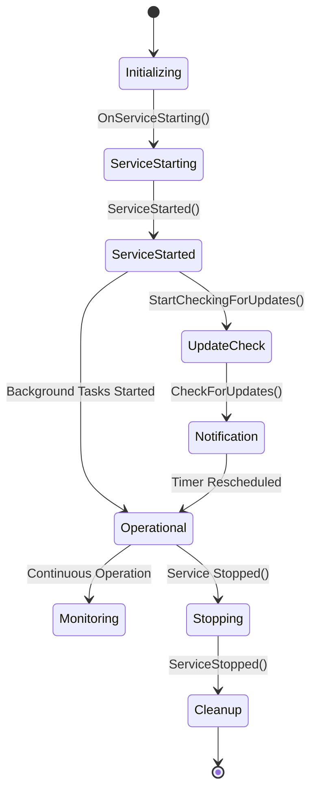
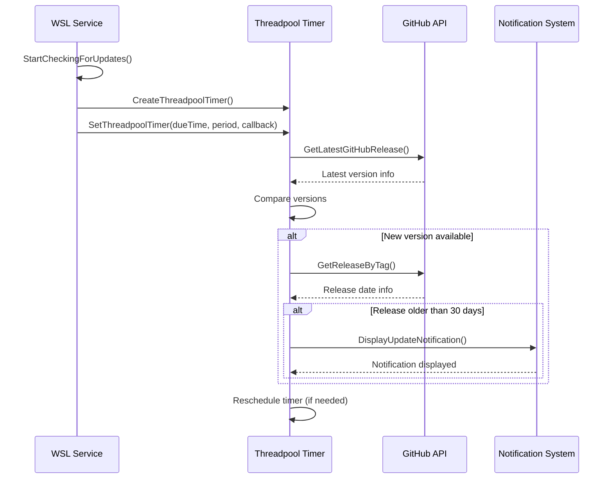
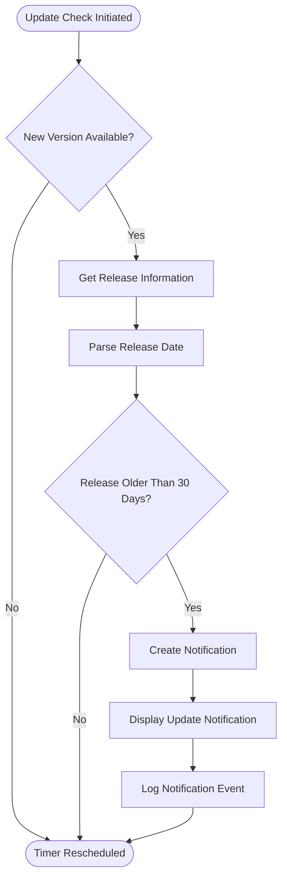
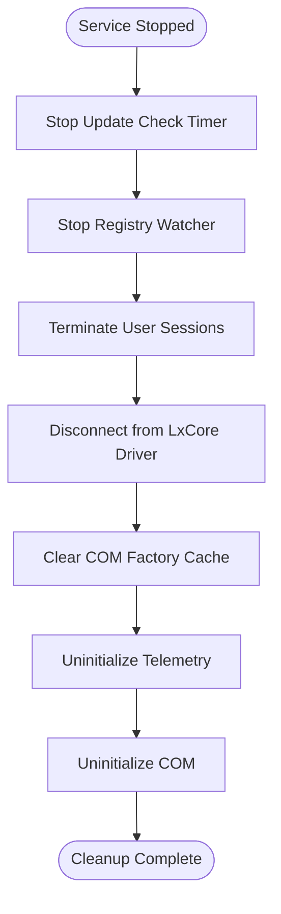
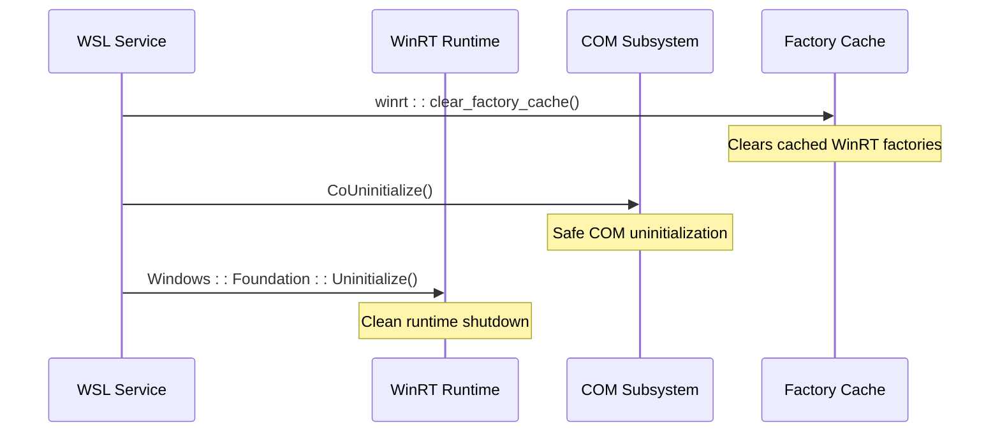

# Post-Initialization Phase

<cite>
**Referenced Files in This Document**
- [ServiceMain.cpp](file://src/windows/service/exe/ServiceMain.cpp)
- [LxssUserSession.cpp](file://src/windows/service/exe/LxssUserSession.cpp)
- [LxssUserSessionFactory.cpp](file://src/windows/service/exe/LxssUserSessionFactory.cpp)
- [notifications.cpp](file://src/windows/common/notifications.cpp)
- [notifications.h](file://src/windows/common/notifications.h)
- [WslTelemetry.cpp](file://src/windows/common/WslTelemetry.cpp)
- [WslTelemetry.h](file://src/windows/common/WslTelemetry.h)
- [lxssclient.cpp](file://src/windows/common/lxssclient.cpp)
- [comservicehelper.h](file://src/windows/inc/comservicehelper.h)
- [WmiService.h](file://src/windows/inc/WmiService.h)
- [WslCoreNetworkingSupport.h](file://src/windows/common/WslCoreNetworkingSupport.h)
- [precomp.h](file://src/windows/common/precomp.h)
</cite>

## Table of Contents
1. [Introduction](#introduction)
2. [Service Lifecycle Overview](#service-lifecycle-overview)
3. [Update Checking Mechanism](#update-checking-mechanism)
4. [Notification System](#notification-system)
5. [Background Tasks and Thread Management](#background-tasks-and-thread-management)
6. [Cleanup Operations](#cleanup-operations)
7. [Error Handling During Shutdown](#error-handling-during-shutdown)
8. [Real-World Scenarios](#real-world-scenarios)
9. [Performance Considerations](#performance-considerations)
10. [Troubleshooting Guide](#troubleshooting-guide)

## Introduction

The post-initialization phase of the WSL (Windows Subsystem for Linux) service startup encompasses all activities that occur after the service becomes fully operational. This critical phase establishes background monitoring systems, initiates periodic maintenance tasks, and prepares the service for long-term operation. The primary focus areas include automated update checking, user notification systems, and comprehensive cleanup mechanisms that ensure proper resource management during shutdown.

During this phase, the service transitions from basic initialization to active monitoring and maintenance mode, establishing persistent connections, timers, and notification channels that enable continuous operation and user communication.

## Service Lifecycle Overview

The WSL service follows a structured lifecycle that defines distinct phases from startup to shutdown. Understanding this lifecycle is crucial for comprehending the post-initialization activities.

**Diagram sources**
- [ServiceMain.cpp](file://src/windows/service/exe/ServiceMain.cpp#L155-L220)

The post-initialization phase begins when the `ServiceStarted()` method completes successfully, marking the transition from initialization to operational mode. At this point, the service has established all essential connections and is ready to begin its core responsibilities.

**Section sources**
- [ServiceMain.cpp](file://src/windows/service/exe/ServiceMain.cpp#L155-L220)

## Update Checking Mechanism

The update checking mechanism represents one of the most critical post-initialization activities, ensuring users receive timely notifications about available WSL updates. This system operates through a sophisticated timer-based architecture that balances user convenience with system performance.

### Timer Configuration and Initialization

The update checking system initializes through the `StartCheckingForUpdates()` method, which establishes a threadpool timer that periodically monitors for new releases.

**Diagram sources**
- [ServiceMain.cpp](file://src/windows/service/exe/ServiceMain.cpp#L261-L315)

### Configuration and Periodicity

The update checking system uses configurable timing parameters that can be adjusted through registry settings. The default configuration schedules checks every 24 hours, starting one minute after service initialization.

| Configuration Parameter | Default Value | Description |
|------------------------|---------------|-------------|
| UpdateCheckPeriodMs | 24 hours (86400000 ms) | Interval between update checks |
| Initial Delay | 1 minute (60000 ms) | Delay before first update check |
| Callback Interval | 60 seconds (60000 ms) | Timer callback frequency |

### Version Comparison Logic

The update checking mechanism implements sophisticated version comparison logic that accurately determines when newer releases are available. The system compares version strings using standardized parsing algorithms that handle various version formats commonly used in WSL releases.

**Section sources**
- [ServiceMain.cpp](file://src/windows/service/exe/ServiceMain.cpp#L261-L315)

## Notification System

The notification system serves as the primary communication channel between the WSL service and end users, delivering important information about updates, performance issues, and system status changes.

### Update Notification Implementation

The update notification system operates based on a 30-day threshold logic that ensures users receive timely reminders about outdated installations. This approach balances user convenience with the need for prompt updates.

**Diagram sources**
- [ServiceMain.cpp](file://src/windows/service/exe/ServiceMain.cpp#L285-L315)
- [notifications.cpp](file://src/windows/common/notifications.cpp#L76-L191)

### Notification Types and Content

The WSL service supports multiple notification types, each serving specific purposes in user communication:

| Notification Type | Purpose | Trigger Conditions |
|------------------|---------|-------------------|
| Update Notifications | Inform users about new WSL versions | New version available, release > 30 days old |
| Filesystem Notifications | Warn about DrvFs performance issues | Poor performance detected during file operations |
| Proxy Change Notifications | Alert about network configuration changes | Proxy settings modified |
| Warning Notifications | Display launch-time warnings | Issues detected during distribution startup |
| Optional Components | Request installation of required components | Missing optional features |

### Toast Notification Architecture

The notification system leverages Windows Toast notifications through the Windows Runtime (WinRT) API, providing native integration with the Windows notification center.

**Section sources**
- [notifications.cpp](file://src/windows/common/notifications.cpp#L76-L191)
- [notifications.h](file://src/windows/common/notifications.h#L18-L44)

## Background Tasks and Thread Management

The post-initialization phase establishes several background tasks that operate continuously throughout the service lifecycle. These tasks manage various aspects of WSL operation, from network monitoring to telemetry collection.

### Threadpool Timer Architecture

The service utilizes Windows threadpool timers for efficient background task execution. This architecture provides several advantages over traditional threading approaches:

- **Resource Efficiency**: Threadpool reuse reduces memory overhead
- **Scalability**: Automatic thread management handles varying load
- **Priority Management**: Built-in priority scheduling for critical tasks
- **Graceful Shutdown**: Proper cleanup mechanisms for ongoing operations

### Session Management Tasks

The service maintains multiple background threads for session management, including:

- **Telemetry Worker**: Collects and processes usage telemetry data
- **Network Monitoring**: Tracks network connectivity changes
- **Instance Lifecycle**: Manages distribution instance creation and termination
- **VM Management**: Handles virtual machine lifecycle operations

**Section sources**
- [LxssUserSession.cpp](file://src/windows/service/exe/LxssUserSession.cpp#L2175-L2230)

## Cleanup Operations

Proper cleanup during service shutdown is critical for maintaining system stability and preventing resource leaks. The `ServiceStopped()` method orchestrates comprehensive cleanup operations across all subsystems.

### Resource Disposal Hierarchy

The cleanup process follows a carefully orchestrated sequence to ensure proper resource disposal:

**Diagram sources**
- [ServiceMain.cpp](file://src/windows/service/exe/ServiceMain.cpp#L230-L258)

### Session Termination Process

The session termination process involves multiple coordinated steps to ensure graceful shutdown of all active user sessions:

1. **Timer Suspension**: Immediate cessation of update checking operations
2. **Registry Watcher Cleanup**: Removal of policy change monitoring
3. **Session Shutdown**: Graceful termination of all user sessions
4. **Resource Cleanup**: Release of associated system resources

### LxCore Driver Disconnection

The LxCore driver disconnection process ensures proper cleanup of kernel-mode resources and prevents potential system instability.

**Section sources**
- [ServiceMain.cpp](file://src/windows/service/exe/ServiceMain.cpp#L230-L258)
- [LxssUserSessionFactory.cpp](file://src/windows/service/exe/LxssUserSessionFactory.cpp#L38-L74)

## Error Handling During Shutdown

Robust error handling during shutdown prevents cascading failures and ensures system stability. The service implements comprehensive error detection and recovery mechanisms.

### Deadlock Prevention Strategies

The service employs several strategies to prevent deadlocks during shutdown, particularly around COM object cleanup:

#### WinRT Factory Cache Clearing

The most critical deadlock prevention mechanism involves clearing the WinRT factory cache before COM uninitialization. This approach resolves potential synchronization issues between the Windows Runtime and COM subsystems.

**Diagram sources**
- [ServiceMain.cpp](file://src/windows/service/exe/ServiceMain.cpp#L249-L258)

#### Thread Safety Measures

The shutdown process implements comprehensive thread safety measures to prevent race conditions and ensure atomic resource cleanup.

### Error Recovery Mechanisms

The service includes several error recovery mechanisms that activate during shutdown to handle unexpected failures gracefully:

- **Graceful Degradation**: Continued operation despite individual component failures
- **Resource Cleanup**: Automatic cleanup of partially initialized resources
- **Logging and Diagnostics**: Comprehensive logging of shutdown activities
- **Fallback Procedures**: Alternative cleanup procedures for critical failures

**Section sources**
- [ServiceMain.cpp](file://src/windows/service/exe/ServiceMain.cpp#L249-L258)

## Real-World Scenarios

Understanding the post-initialization processes helps explain various real-world scenarios that users encounter with WSL.

### Scenario 1: Update Notification Timing

**Problem**: Users receive update notifications immediately after installing WSL, despite having a fresh installation.

**Explanation**: The update checker initiates its first check one minute after service startup, potentially coinciding with user installation activities. The 30-day threshold applies regardless of installation date, ensuring consistent update reminders.

**Solution**: Users can adjust the update check interval through registry modifications or disable automatic updates entirely.

### Scenario 2: Background Task Performance Impact

**Problem**: Users notice increased system resource usage shortly after WSL service startup.

**Explanation**: The post-initialization phase activates multiple background tasks, including update checking, telemetry collection, and session monitoring. These operations consume system resources temporarily as they establish their operational state.

**Mitigation**: Resource usage typically stabilizes within a few minutes as background tasks reach their steady-state operation patterns.

### Scenario 3: Shutdown Delays

**Problem**: WSL service shutdown takes longer than expected, causing delays in system shutdown.

**Explanation**: The comprehensive cleanup process ensures proper resource disposal, which can take time depending on the number of active sessions and background tasks.

**Optimization**: Modern Windows versions include improvements to service shutdown coordination that reduce typical shutdown times.

## Performance Considerations

The post-initialization phase introduces several performance considerations that impact system resource utilization and user experience.

### Memory Usage Patterns

During the post-initialization phase, memory usage exhibits characteristic patterns:

- **Initial Spike**: Brief increase as background tasks initialize
- **Stabilization**: Gradual reduction as tasks reach steady state
- **Peak Usage**: Temporary increase during concurrent task execution

### CPU Utilization

CPU utilization during this phase follows predictable patterns:

- **Startup Burst**: Higher CPU usage during initial task establishment
- **Periodic Checks**: Regular CPU usage during scheduled update checks
- **Idle Maintenance**: Minimal CPU usage during periods between checks

### Network Resource Impact

The update checking mechanism introduces network activity that may impact bandwidth-constrained environments:

- **Initial Request**: Single outbound request to GitHub API
- **Periodic Checks**: Scheduled network requests based on configuration
- **Rate Limiting**: Built-in rate limiting to prevent abuse

## Troubleshooting Guide

Common issues during the post-initialization phase and their resolution strategies.

### Update Checking Issues

**Symptom**: Update notifications not appearing despite available updates.

**Diagnosis Steps**:
1. Verify update check timer is active
2. Check registry configuration for update intervals
3. Validate network connectivity to GitHub
4. Review service logs for error messages

**Resolution**:
- Restart WSL service to reinitialize update checking
- Adjust registry settings for update intervals
- Verify firewall/proxy configurations allow GitHub access

### Notification Delivery Problems

**Symptom**: Notifications not appearing or appearing late.

**Possible Causes**:
- Windows notification system issues
- Service startup timing conflicts
- User notification preferences

**Troubleshooting**:
- Verify Windows notification settings
- Check notification history for blocked messages
- Restart Windows notification service if necessary

### Shutdown Cleanup Issues

**Symptom**: Service fails to shut down cleanly, requiring forced termination.

**Diagnostic Approach**:
1. Monitor service shutdown logs
2. Check for hanging background tasks
3. Verify COM object cleanup completion
4. Examine resource leak indicators

**Prevention Strategies**:
- Implement proper timeout mechanisms
- Add additional logging for cleanup operations
- Enhance error handling in cleanup paths

**Section sources**
- [ServiceMain.cpp](file://src/windows/service/exe/ServiceMain.cpp#L230-L258)