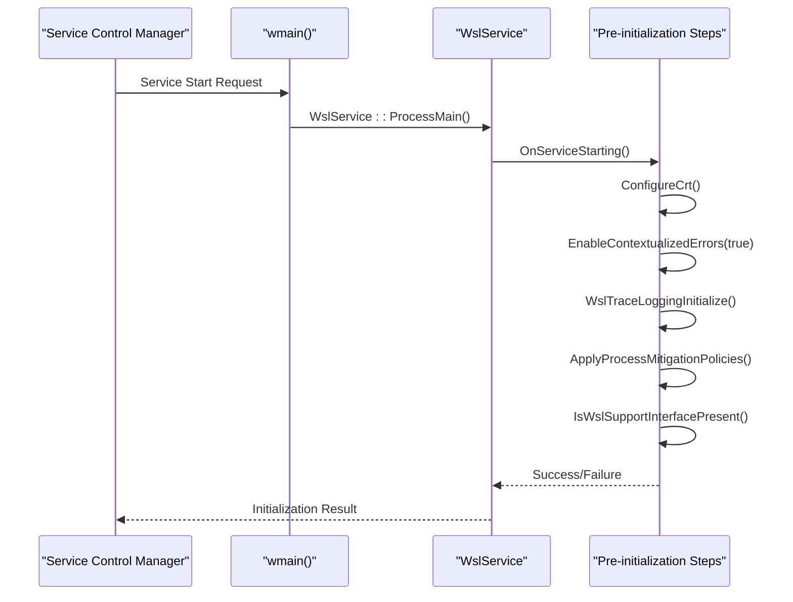
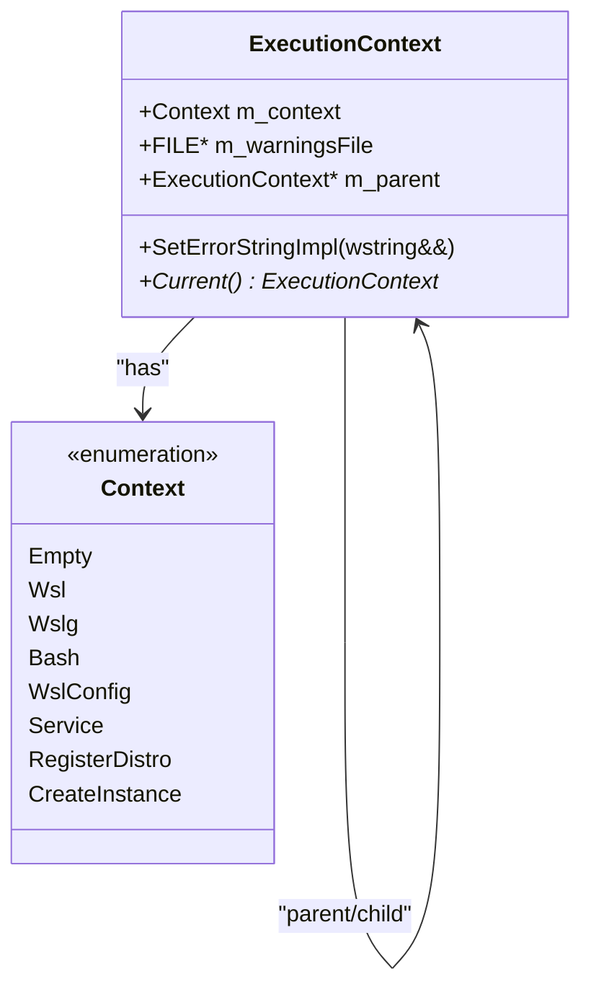
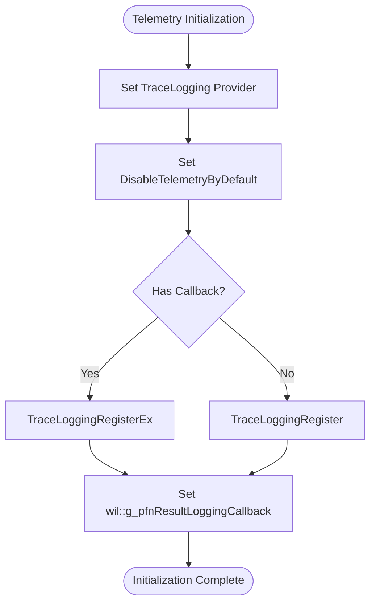
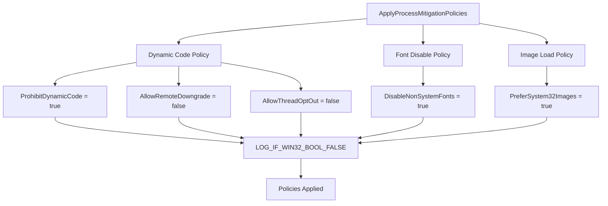
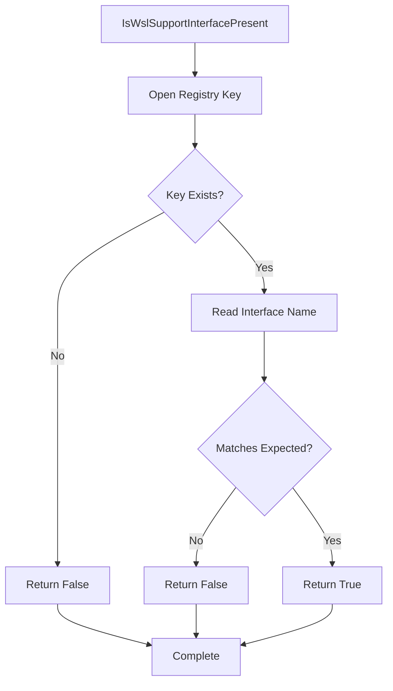
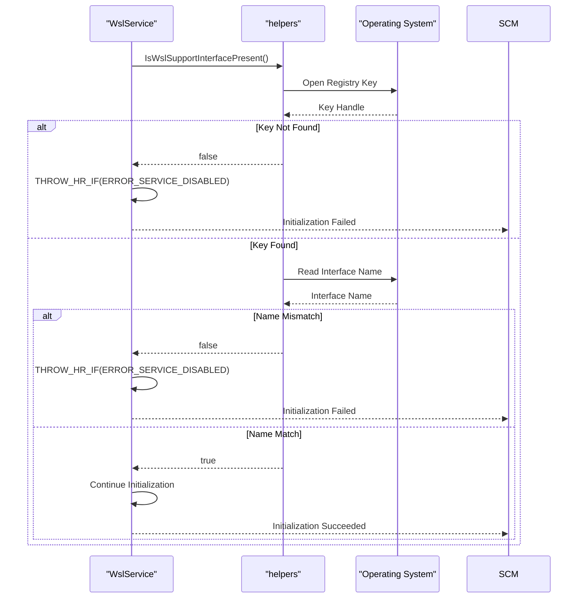

# Pre-Initialization Phase

<cite>
**Referenced Files in This Document**   
- [ServiceMain.cpp](file://src/windows/service/exe/ServiceMain.cpp)
- [WslSecurity.cpp](file://src/windows/common/WslSecurity.cpp)
- [WslTelemetry.cpp](file://src/windows/common/WslTelemetry.cpp)
- [helpers.cpp](file://src/windows/common/helpers.cpp)
- [ExecutionContext.cpp](file://src/windows/common/ExecutionContext.cpp)
- [wslutil.h](file://src/windows/common/wslutil.h)
- [WslSecurity.h](file://src/windows/common/WslSecurity.h)
</cite>

## Table of Contents
1. [Introduction](#introduction)
2. [Execution Flow from wmain() to ProcessMain()](#execution-flow-from-wmain-to-processmain)
3. [C Runtime Configuration](#c-runtime-configuration)
4. [Contextualized Error Handling](#contextualized-error-handling)
5. [Telemetry Initialization](#telemetry-initialization)
6. [Process Mitigation Policies](#process-mitigation-policies)
7. [WSL Support Interface Validation](#wsl-support-interface-validation)
8. [Early Failure Handling](#early-failure-handling)
9. [Conclusion](#conclusion)

## Introduction
The pre-initialization phase of the WSL service startup establishes the foundational security and stability requirements before core service operations begin. This document details the execution flow starting from the `wmain()` entry point through the invocation of `WslService::ProcessMain()`, covering critical initialization steps including C runtime configuration, error handling setup, telemetry initialization, security policy application, and system compatibility validation. These steps ensure the WSL service operates in a secure, stable, and observable environment from the earliest stages of execution.

## Execution Flow from wmain() to ProcessMain()
The WSL service startup begins with the `wmain()` function in the service executable, which serves as the entry point for the Windows Service Control Manager (SCM). This function immediately delegates control to `WslService::ProcessMain()`, initiating the service's initialization sequence. The `OnServiceStarting()` method within the `WslService` class orchestrates the pre-initialization phase, systematically executing a series of critical setup operations before the service becomes fully operational.

**Diagram sources**
- [ServiceMain.cpp](file://src/windows/service/exe/ServiceMain.cpp#L317-L321)
- [ServiceMain.cpp](file://src/windows/service/exe/ServiceMain.cpp#L155-L193)

**Section sources**
- [ServiceMain.cpp](file://src/windows/service/exe/ServiceMain.cpp#L317-L321)
- [ServiceMain.cpp](file://src/windows/service/exe/ServiceMain.cpp#L155-L193)

## C Runtime Configuration
The `ConfigureCrt()` function initializes the C runtime environment to ensure consistent and predictable behavior across different execution contexts. This configuration step is critical for maintaining compatibility with Windows service requirements and ensuring proper handling of standard input/output streams. The function sets up the runtime to properly interface with the Windows console subsystem while operating as a background service.

**Section sources**
- [wslutil.h](file://src/windows/common/wslutil.h#L78)

## Contextualized Error Handling
The pre-initialization phase enables contextualized error reporting through the `EnableContextualizedErrors(true)` call. This functionality enhances error diagnostics by capturing execution context information, allowing for more detailed error reporting and troubleshooting. The context tracking system maintains a thread-local stack of execution contexts, enabling precise error attribution to specific operations within the service.

**Diagram sources**
- [ExecutionContext.cpp](file://src/windows/common/ExecutionContext.cpp#L18-L23)
- [wslutil.cpp](file://src/windows/common/wslutil.cpp#L143-L185)

**Section sources**
- [ExecutionContext.cpp](file://src/windows/common/ExecutionContext.cpp#L18-L23)

## Telemetry Initialization
Telemetry is initialized through the `WslTraceLoggingInitialize()` function, which sets up the service's diagnostic and monitoring capabilities. This initialization connects the service to the Windows Event Tracing (ETW) system, enabling structured logging and performance monitoring. The telemetry system is configured based on the build type, with official builds having telemetry enabled by default unless explicitly disabled.

**Diagram sources**
- [WslTelemetry.cpp](file://src/windows/common/WslTelemetry.cpp#L76-L90)
- [WslTelemetry.cpp](file://src/windows/common/WslTelemetry.cpp#L92-L177)

**Section sources**
- [WslTelemetry.cpp](file://src/windows/common/WslTelemetry.cpp#L76-L190)
- [ServiceMain.cpp](file://src/windows/service/exe/ServiceMain.cpp#L164)

## Process Mitigation Policies
Security is enhanced through the application of process mitigation policies via `wsl::windows::common::security::ApplyProcessMitigationPolicies()`. This function configures several Windows security mitigations to protect against common attack vectors. The applied policies include dynamic code execution prevention, font loading restrictions, and image load preferences, collectively reducing the service's attack surface.

**Diagram sources**
- [WslSecurity.cpp](file://src/windows/common/WslSecurity.cpp#L40-L57)
- [WslSecurity.h](file://src/windows/common/WslSecurity.h#L66)

**Section sources**
- [WslSecurity.cpp](file://src/windows/common/WslSecurity.cpp#L40-L57)

## WSL Support Interface Validation
The service validates the presence of required WSL support interfaces through `wsl::windows::common::helpers::IsWslSupportInterfacePresent()`. This check verifies that the host system has the necessary Windows components and interfaces to support WSL functionality. The validation examines the Windows registry for the presence of the IWslSupport interface registration, ensuring the system meets the minimum requirements for WSL operation.

**Diagram sources**
- [helpers.cpp](file://src/windows/common/helpers.cpp#L486-L498)
- [helpers.cpp](file://src/windows/common/helpers.cpp#L493-L494)

**Section sources**
- [helpers.cpp](file://src/windows/common/helpers.cpp#L486-L498)

## Early Failure Handling
The pre-initialization phase includes comprehensive error handling to gracefully manage unsupported configurations. If the WSL support interface is not present, the service throws an exception with `HRESULT_FROM_WIN32(ERROR_SERVICE_DISABLED)`, preventing further initialization. This early validation ensures that the service fails fast when running on incompatible systems, providing clear error feedback to the service manager and administrators.

**Diagram sources**
- [ServiceMain.cpp](file://src/windows/service/exe/ServiceMain.cpp#L174)
- [helpers.cpp](file://src/windows/common/helpers.cpp#L486-L498)

**Section sources**
- [ServiceMain.cpp](file://src/windows/service/exe/ServiceMain.cpp#L174)
- [helpers.cpp](file://src/windows/common/helpers.cpp#L486-L498)

## Conclusion
The pre-initialization phase of the WSL service startup establishes a secure and stable foundation through a systematic sequence of critical setup operations. By configuring the C runtime, enabling contextualized error handling, initializing telemetry, applying security mitigations, and validating system compatibility, the service ensures it operates in a controlled environment from the earliest stages of execution. These steps collectively provide robust error handling, enhanced security, and comprehensive monitoring capabilities, setting the stage for reliable and secure WSL service operations. The careful orchestration of these initialization steps demonstrates a security-first approach to service design, ensuring that the WSL infrastructure is properly prepared before handling any user requests or system operations.