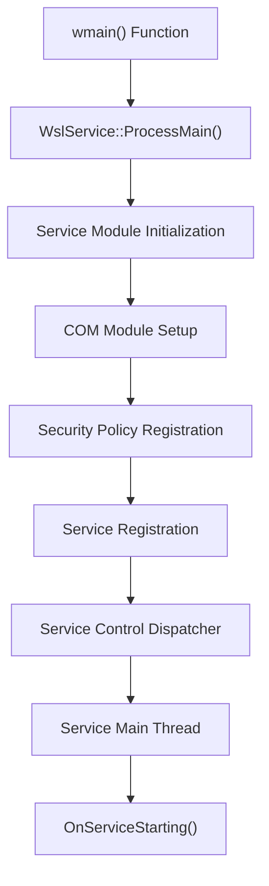
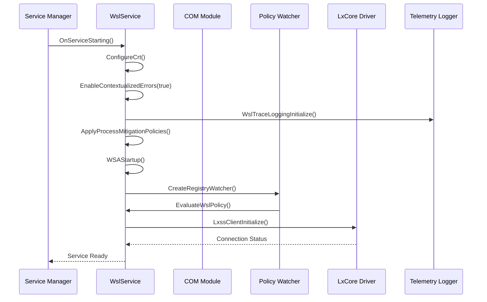
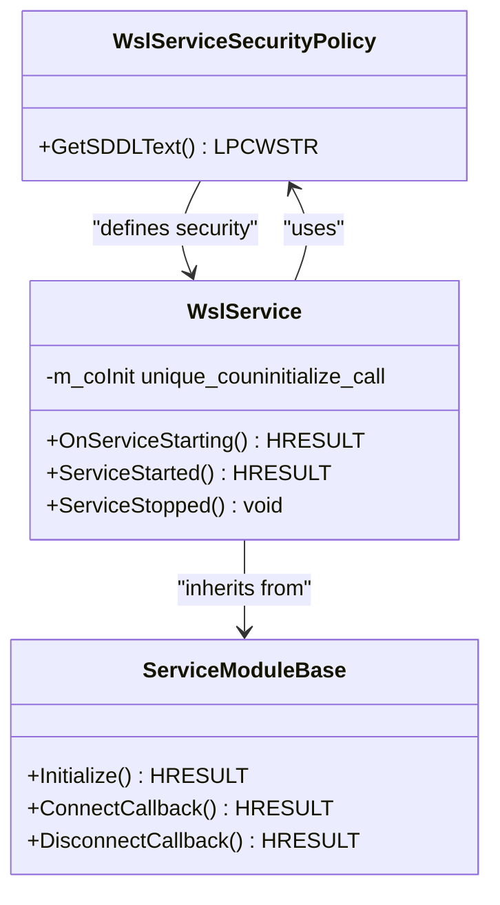
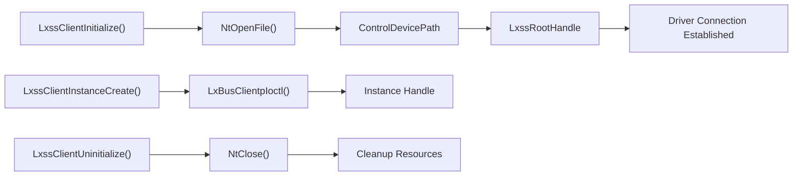
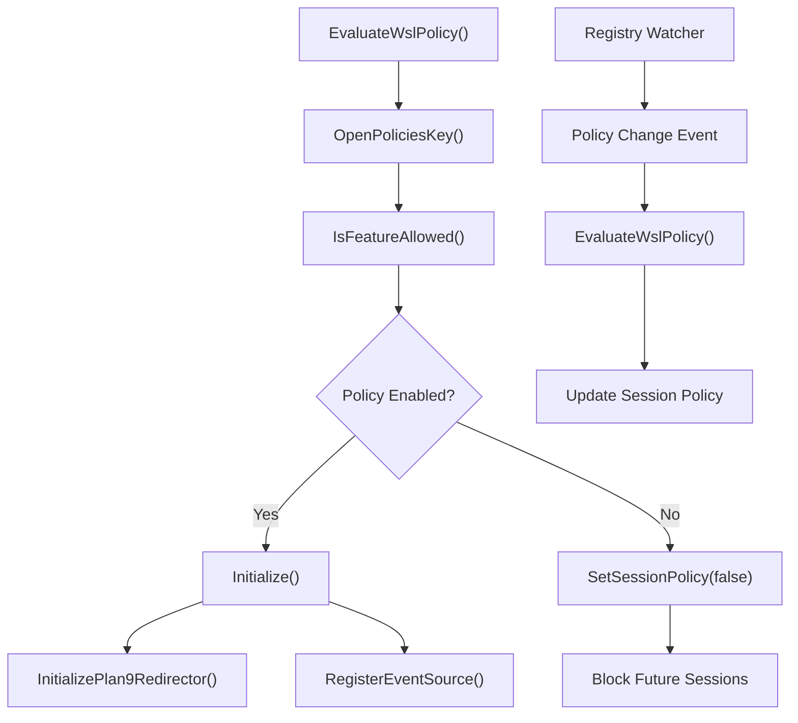
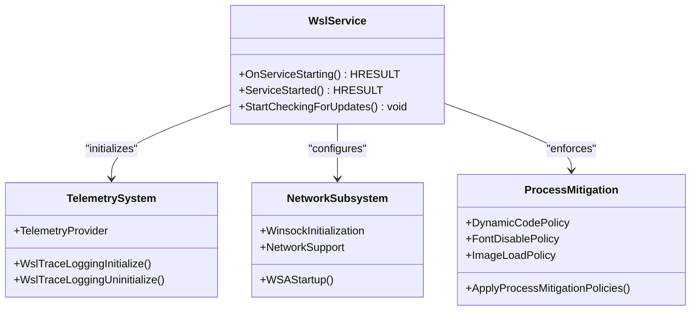
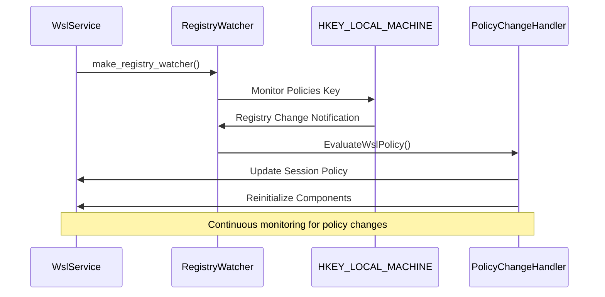
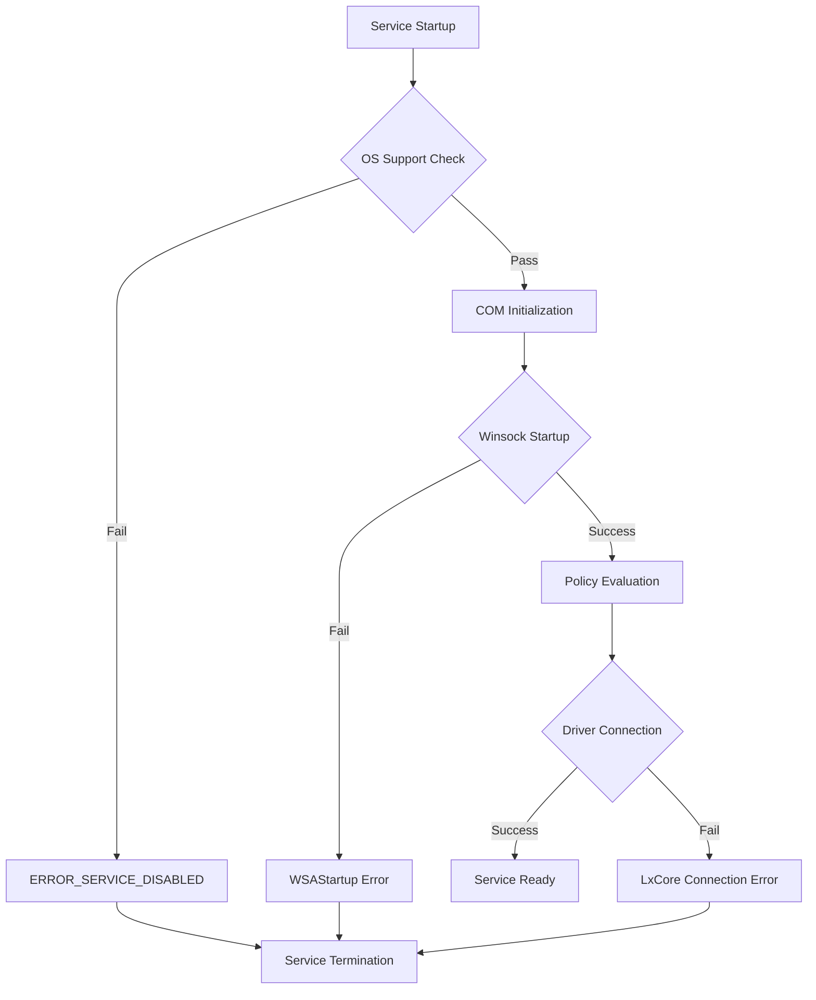
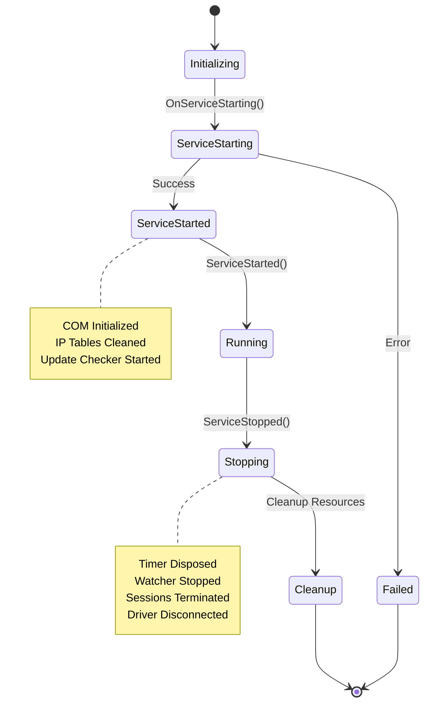

# Service Startup

<cite>
**Referenced Files in This Document**
- [ServiceMain.cpp](file://src/windows/service/exe/ServiceMain.cpp)
- [comservicehelper.h](file://src/windows/inc/comservicehelper.h)
- [lxssclient.cpp](file://src/windows/common/lxssclient.cpp)
- [lxssclient.h](file://src/windows/inc/lxssclient.h)
- [WslSecurity.cpp](file://src/windows/common/WslSecurity.cpp)
- [wslpolicies.h](file://src/windows/inc/wslpolicies.h)
- [wslutil.cpp](file://src/windows/common/wslutil.cpp)
- [PolicyTests.cpp](file://test/windows/PolicyTests.cpp)
</cite>

## Table of Contents
1. [Introduction](#introduction)
2. [Service Entry Point](#service-entry-point)
3. [Service Initialization Sequence](#service-initialization-sequence)
4. [COM Initialization and Security](#com-initialization-and-security)
5. [Driver Connectivity Setup](#driver-connectivity-setup)
6. [Policy Evaluation System](#policy-evaluation-system)
7. [Telemetry and Network Configuration](#telemetry-and-network-configuration)
8. [Registry Watcher Implementation](#registry-watcher-implementation)
9. [Error Handling and Failure Conditions](#error-handling-and-failure-conditions)
10. [Service Lifecycle Management](#service-lifecycle-management)

## Introduction

The WSL (Windows Subsystem for Linux) service startup sequence represents a sophisticated initialization process that establishes the foundation for WSL functionality. This service operates as a Session 0 service running under the SYSTEM account, managing WSL sessions, communicating with the WSL2 virtual machine, and configuring WSL distributions. The startup process involves multiple critical phases including COM initialization, policy evaluation, driver connectivity establishment, and security policy enforcement.

## Service Entry Point

The WSL service begins its execution through the `wmain()` function, which serves as the primary entry point for the service application.

**Diagram sources**
- [ServiceMain.cpp](file://src/windows/service/exe/ServiceMain.cpp#L317-L321)

The `wmain()` function delegates to `WslService::ProcessMain()`, which orchestrates the entire service initialization process. This function sets up the service control dispatcher table and registers the service with the Windows Service Control Manager.

**Section sources**
- [ServiceMain.cpp](file://src/windows/service/exe/ServiceMain.cpp#L317-L321)

## Service Initialization Sequence

The service initialization follows a carefully orchestrated sequence defined in the `OnServiceStarting()` method of the `WslService` class.

**Diagram sources**
- [ServiceMain.cpp](file://src/windows/service/exe/ServiceMain.cpp#L155-L194)

The initialization sequence begins with basic runtime configuration, followed by security policy enforcement, network initialization, and finally driver connectivity establishment.

**Section sources**
- [ServiceMain.cpp](file://src/windows/service/exe/ServiceMain.cpp#L155-L194)

## COM Initialization and Security

The service establishes COM (Component Object Model) infrastructure to support client communication through the ILxssUserSession interface.

**Diagram sources**
- [ServiceMain.cpp](file://src/windows/service/exe/ServiceMain.cpp#L34-L43)
- [comservicehelper.h](file://src/windows/inc/comservicehelper.h#L39-L357)

The security policy defines access permissions using SDDL (Security Descriptor Definition Language), granting COM access and launch permissions to authenticated users, principal self, and system accounts. The service initializes COM through `wil::CoInitializeEx(COINIT_MULTITHREADED)` during the `ServiceStarted()` phase.

**Section sources**
- [ServiceMain.cpp](file://src/windows/service/exe/ServiceMain.cpp#L208)
- [comservicehelper.h](file://src/windows/inc/comservicehelper.h#L39-L357)

## Driver Connectivity Setup

The service establishes connectivity with the LxCore driver through the `LxssClientInitialize()` function, which creates the fundamental connection to the LXSS (Linux Subsystem) driver.

**Diagram sources**
- [lxssclient.cpp](file://src/windows/common/lxssclient.cpp#L20-L68)

The driver initialization process involves creating a device string for the LXSS control device and establishing a file handle connection. This connection enables subsequent operations such as instance creation, destruction, and state management.

**Section sources**
- [lxssclient.cpp](file://src/windows/common/lxssclient.cpp#L20-L68)
- [ServiceMain.cpp](file://src/windows/service/exe/ServiceMain.cpp#L98)

## Policy Evaluation System

The service implements a comprehensive policy evaluation system to enforce organizational restrictions and feature controls.

**Diagram sources**
- [ServiceMain.cpp](file://src/windows/service/exe/ServiceMain.cpp#L75-L88)
- [wslpolicies.h](file://src/windows/inc/wslpolicies.h#L33-L85)

The policy evaluation system reads from the registry location `HKEY_LOCAL_MACHINE\Software\Policies\WSL` and evaluates individual policy settings. The system supports granular controls including WSL enablement, WSL1 vs WSL2 restrictions, custom kernel settings, and networking configurations.

**Section sources**
- [ServiceMain.cpp](file://src/windows/service/exe/ServiceMain.cpp#L75-L88)
- [wslpolicies.h](file://src/windows/inc/wslpolicies.h#L33-L85)

## Telemetry and Network Configuration

The service establishes telemetry infrastructure and network subsystems essential for monitoring and communication capabilities.

**Diagram sources**
- [ServiceMain.cpp](file://src/windows/service/exe/ServiceMain.cpp#L163-L179)
- [WslSecurity.cpp](file://src/windows/common/WslSecurity.cpp#L40-L58)

The telemetry system initializes with provider registration and logging infrastructure setup. Network configuration includes Winsock initialization and process mitigation policies that enhance security posture while maintaining functionality.

**Section sources**
- [ServiceMain.cpp](file://src/windows/service/exe/ServiceMain.cpp#L163-L179)
- [WslSecurity.cpp](file://src/windows/common/WslSecurity.cpp#L40-L58)

## Registry Watcher Implementation

The service implements a robust registry watcher system to monitor policy changes in real-time and adjust service behavior accordingly.

**Diagram sources**
- [ServiceMain.cpp](file://src/windows/service/exe/ServiceMain.cpp#L183-L189)

The registry watcher is established before policy evaluation to ensure no change notifications are missed during the initial startup phase. This asynchronous monitoring enables dynamic policy adaptation without requiring service restarts.

**Section sources**
- [ServiceMain.cpp](file://src/windows/service/exe/ServiceMain.cpp#L183-L189)

## Error Handling and Failure Conditions

The service implements comprehensive error handling throughout the startup sequence to ensure graceful degradation and informative error reporting.

**Diagram sources**
- [ServiceMain.cpp](file://src/windows/service/exe/ServiceMain.cpp#L173-L174)
- [wslutil.cpp](file://src/windows/common/wslutil.cpp#L42-L140)

The service handles various failure conditions including unsupported operating systems, COM initialization failures, Winsock startup problems, and driver connectivity issues. Each failure condition triggers appropriate error codes and logging mechanisms.

**Section sources**
- [ServiceMain.cpp](file://src/windows/service/exe/ServiceMain.cpp#L173-L174)
- [wslutil.cpp](file://src/windows/common/wslutil.cpp#L42-L140)

## Service Lifecycle Management

The service manages its complete lifecycle through well-defined phases and cleanup procedures.

**Diagram sources**
- [ServiceMain.cpp](file://src/windows/service/exe/ServiceMain.cpp#L206-L259)

The service lifecycle encompasses initialization, operational phases, and cleanup procedures. During shutdown, the service ensures proper resource cleanup, including COM uninitialization, driver disconnection, and temporary data removal.

**Section sources**
- [ServiceMain.cpp](file://src/windows/service/exe/ServiceMain.cpp#L206-L259)