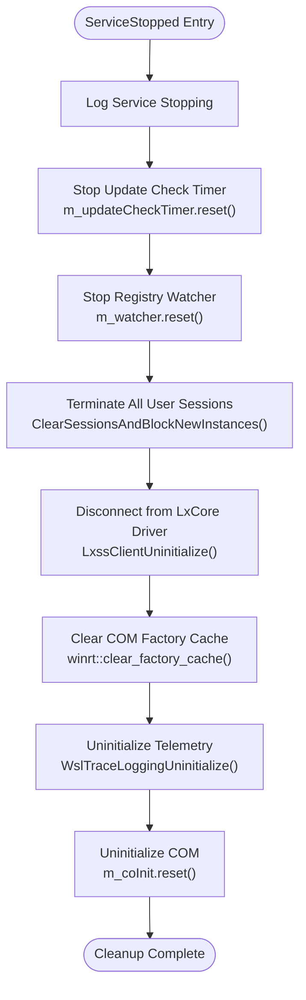
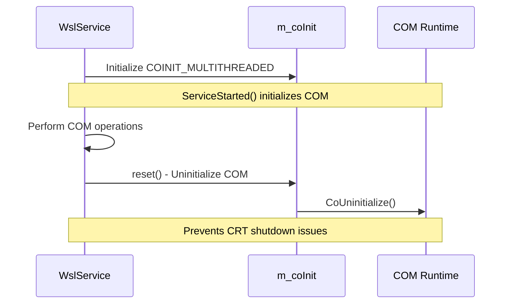
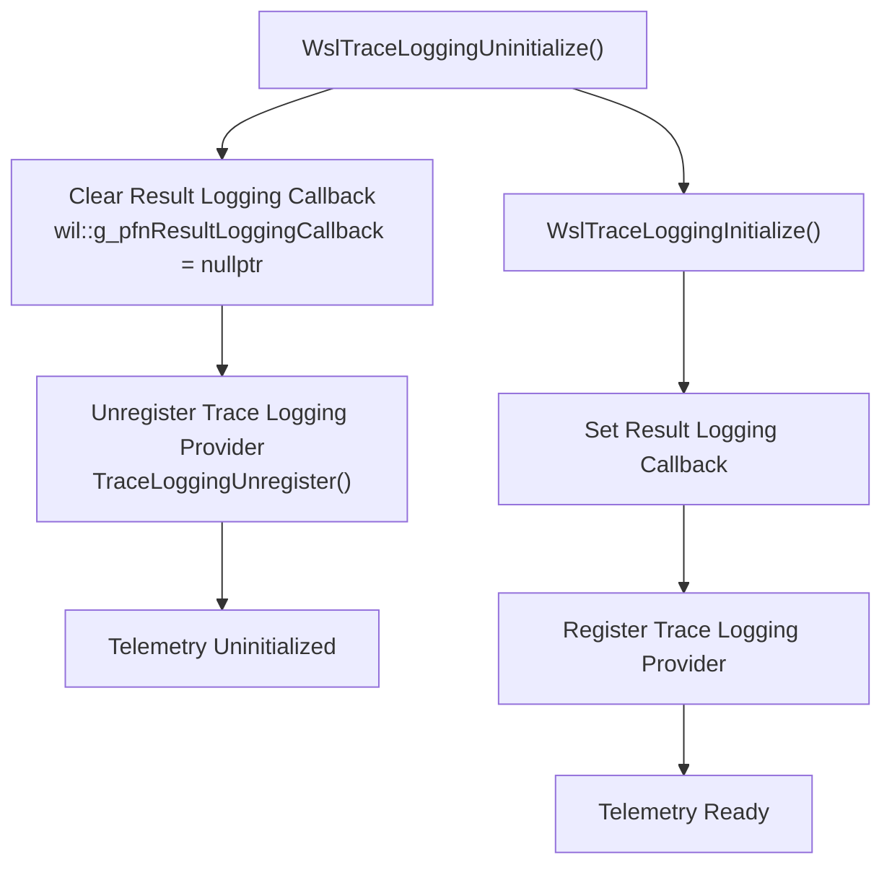
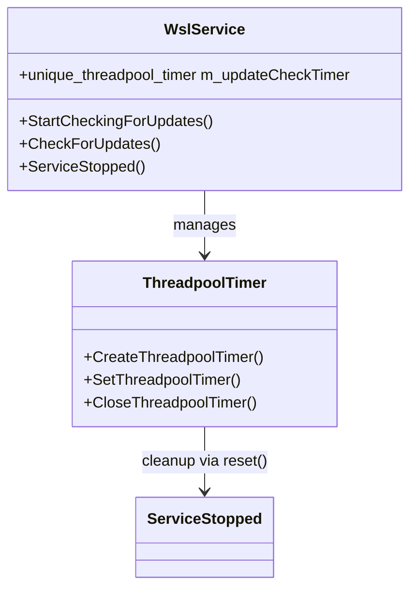
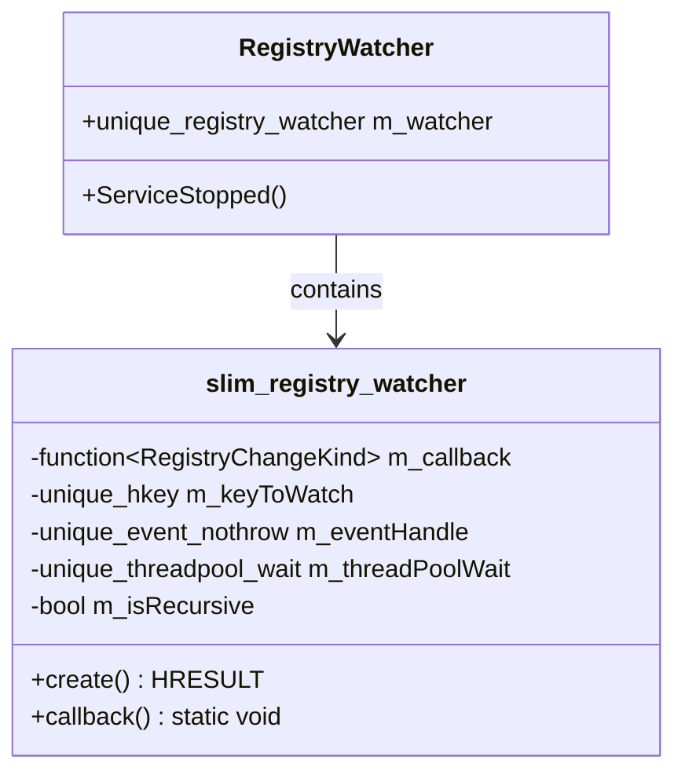
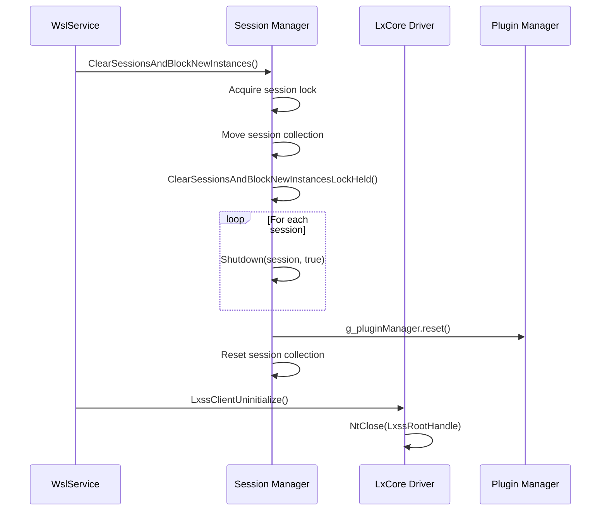

# Resource Cleanup During WSL Service Termination

<cite>
**Referenced Files in This Document**
- [ServiceMain.cpp](file://src/windows/service/exe/ServiceMain.cpp)
- [WslTelemetry.cpp](file://src/windows/common/WslTelemetry.cpp)
- [WslTelemetry.h](file://src/windows/common/WslTelemetry.h)
- [RegistryWatcher.h](file://src/windows/inc/RegistryWatcher.h)
- [Lifetime.cpp](file://src/windows/service/exe/Lifetime.cpp)
- [LxssUserSessionFactory.cpp](file://src/windows/service/exe/LxssUserSessionFactory.cpp)
- [lxssclient.cpp](file://src/windows/common/lxssclient.cpp)
- [comservicehelper.h](file://src/windows/inc/comservicehelper.h)
</cite>

## Table of Contents
1. [Introduction](#introduction)
2. [ServiceStopped Method Overview](#servicestopped-method-overview)
3. [Resource Cleanup Sequence](#resource-cleanup-sequence)
4. [COM Object Management](#com-object-management)
5. [Telemetry Component Cleanup](#telemetry-component-cleanup)
6. [Threadpool Timer Management](#threadpool-timer-management)
7. [Registry Watcher Cleanup](#registry-watcher-cleanup)
8. [Session and Driver Cleanup](#session-and-driver-cleanup)
9. [Order of Operations and Deadlock Prevention](#order-of-operations-and-deadlock-prevention)
10. [Best Practices and Guidelines](#best-practices-and-guidelines)

## Introduction

The Windows Subsystem for Linux (WSL) service implements a comprehensive resource cleanup mechanism during termination to ensure proper system stability and prevent resource leaks. The cleanup process is orchestrated through the `ServiceStopped()` method, which systematically disposes of various system resources including COM objects, telemetry components, threadpool timers, registry watchers, and user sessions.

This documentation provides detailed insights into the resource cleanup phase, explaining the critical sequence of operations and the rationale behind the ordering decisions that prevent deadlocks and ensure graceful service termination.

## ServiceStopped Method Overview

The `ServiceStopped()` method serves as the central coordinator for all resource cleanup operations. It follows a carefully orchestrated sequence that ensures dependencies are properly managed and resources are released in the correct order.

**Diagram sources**
- [ServiceMain.cpp](file://src/windows/service/exe/ServiceMain.cpp#L230-L258)

**Section sources**
- [ServiceMain.cpp](file://src/windows/service/exe/ServiceMain.cpp#L230-L258)

## Resource Cleanup Sequence

The resource cleanup follows a specific chronological order that addresses dependencies between different subsystems:

### Phase 1: Immediate Resource Disposal
- **Update Check Timer**: Stops the periodic update checking mechanism
- **Registry Watcher**: Terminates monitoring of WSL policy registry keys
- **User Sessions**: Initiates termination of all active user sessions

### Phase 2: System-Level Cleanup
- **LxCore Driver**: Disconnects from the Linux subsystem core driver
- **COM Factory Cache**: Clears WinRT factory cache to prevent memory leaks
- **Telemetry System**: Finalizes telemetry collection and logging

### Phase 3: COM Environment Cleanup
- **COM Initialization**: Resets COM initialization state
- **Resource Validation**: Ensures all resources are properly released

**Section sources**
- [ServiceMain.cpp](file://src/windows/service/exe/ServiceMain.cpp#L230-L258)

## COM Object Management

### WinRT Factory Cache Cleanup

The `winrt::clear_factory_cache()` function performs a critical role in preventing COM-related deadlocks during service termination. This function clears the WinRT factory cache, which contains cached instances of COM objects that might be holding onto resources.

**Implementation Details:**
- Prevents potential deadlocks caused by LanguageChangeNotifyThread initialization
- Works around issues where CoUninitialize() might be called before thread completion
- Ensures proper cleanup of WinRT-managed COM objects

### COM Initialization Management

The `m_coInit` member variable manages COM initialization state through RAII (Resource Acquisition Is Initialization) pattern:

**Diagram sources**
- [ServiceMain.cpp](file://src/windows/service/exe/ServiceMain.cpp#L208-L258)
- [comservicehelper.h](file://src/windows/inc/comservicehelper.h#L93-L134)

**Section sources**
- [ServiceMain.cpp](file://src/windows/service/exe/ServiceMain.cpp#L251-L258)
- [comservicehelper.h](file://src/windows/inc/comservicehelper.h#L93-L134)

## Telemetry Component Cleanup

### WslTraceLoggingUninitialize() Function

The telemetry cleanup process involves several critical steps managed by the `WslTraceLoggingUninitialize()` function:

**Diagram sources**
- [WslTelemetry.cpp](file://src/windows/common/WslTelemetry.cpp#L180-L184)

### Telemetry Client Management

The `WslTraceLoggingClient` class maintains telemetry state counters that are properly decremented during cleanup:

- **Active Clients Counter**: Tracks clients with telemetry enabled
- **Disabled Clients Counter**: Tracks clients with telemetry disabled  
- **Atomic Operations**: Ensures thread-safe counter management

**Section sources**
- [WslTelemetry.cpp](file://src/windows/common/WslTelemetry.cpp#L180-L184)
- [WslTelemetry.h](file://src/windows/common/WslTelemetry.h#L48-L76)

## Threadpool Timer Management

### Update Check Timer Cleanup

The update check timer is managed through the `m_updateCheckTimer` member variable, which utilizes Windows threadpool infrastructure:

**Diagram sources**
- [ServiceMain.cpp](file://src/windows/service/exe/ServiceMain.cpp#L69-L71)
- [ServiceMain.cpp](file://src/windows/service/exe/ServiceMain.cpp#L276-L281)

### Timer Lifecycle Management

The timer lifecycle follows these patterns:
- **Creation**: `CreateThreadpoolTimer()` creates the timer object
- **Scheduling**: `SetThreadpoolTimer()` schedules periodic execution
- **Cleanup**: `reset()` releases the timer resource

**Section sources**
- [ServiceMain.cpp](file://src/windows/service/exe/ServiceMain.cpp#L235-L235)
- [ServiceMain.cpp](file://src/windows/service/exe/ServiceMain.cpp#L276-L281)

## Registry Watcher Cleanup

### Slim Registry Watcher Implementation

The registry watcher system utilizes the `slim_registry_watcher` class for efficient registry monitoring:

**Diagram sources**
- [RegistryWatcher.h](file://src/windows/inc/RegistryWatcher.h#L15-L100)

### Watcher Cleanup Process

Registry watchers are cleaned up through automatic resource management:
- **Automatic Cleanup**: Destructor handles resource deallocation
- **Threadpool Integration**: Uses threadpool wait objects for asynchronous monitoring
- **Event Handling**: Properly terminates event notification loops

**Section sources**
- [ServiceMain.cpp](file://src/windows/service/exe/ServiceMain.cpp#L183-L189)
- [ServiceMain.cpp](file://src/windows/service/exe/ServiceMain.cpp#L238-L238)
- [RegistryWatcher.h](file://src/windows/inc/RegistryWatcher.h#L15-L100)

## Session and Driver Cleanup

### User Session Termination

The session cleanup process involves multiple layers of coordination:

**Diagram sources**
- [LxssUserSessionFactory.cpp](file://src/windows/service/exe/LxssUserSessionFactory.cpp#L62-L74)
- [lxssclient.cpp](file://src/windows/common/lxssclient.cpp#L246-L270)

### LxCore Driver Disconnection

The LxCore driver connection is managed through a global handle that is properly closed during cleanup:

- **Global Handle Management**: `LxssRootHandle` tracks the driver connection
- **Graceful Disconnection**: `NtClose()` ensures proper resource cleanup
- **State Validation**: Checks indicate proper driver initialization state

**Section sources**
- [ServiceMain.cpp](file://src/windows/service/exe/ServiceMain.cpp#L243-L247)
- [LxssUserSessionFactory.cpp](file://src/windows/service/exe/LxssUserSessionFactory.cpp#L62-L74)
- [lxssclient.cpp](file://src/windows/common/lxssclient.cpp#L246-L270)

## Order of Operations and Deadlock Prevention

### Critical Ordering Principles

The cleanup sequence follows strict ordering principles to prevent deadlocks and ensure proper resource management:

1. **Immediate Resource Disposal First**: Timers and watchers are stopped immediately
2. **System-Level Cleanup Next**: Driver connections and COM objects are handled
3. **Environment Cleanup Last**: COM initialization is reset after all operations

### Deadlock Prevention Strategies

Several mechanisms prevent potential deadlocks during cleanup:

#### COM Initialization Timing
- **Factory Cache Clearing**: `winrt::clear_factory_cache()` prevents thread-related deadlocks
- **Proper COM Uninitialization**: `m_coInit.reset()` occurs after all COM operations complete

#### Session Termination Coordination
- **Lock Ordering**: Session termination locks are acquired before driver disconnection
- **Graceful Shutdown**: Sessions are terminated with timeout mechanisms

#### Resource Dependency Management
- **Hierarchical Cleanup**: Resources are released in dependency order
- **RAII Pattern**: Automatic resource management through smart pointers

**Section sources**
- [ServiceMain.cpp](file://src/windows/service/exe/ServiceMain.cpp#L249-L258)

## Best Practices and Guidelines

### Resource Management Patterns

The WSL service demonstrates several best practices for resource cleanup:

#### RAII (Resource Acquisition Is Initialization)
- **Smart Pointers**: Use `wil::unique_*` types for automatic resource management
- **Scope Guards**: Employ `wil::scope_exit` for guaranteed cleanup
- **Destructor Responsibility**: Classes handle their own cleanup

#### Exception Safety
- **Try-Catch Blocks**: Wrap cleanup operations in exception handlers
- **Partial Cleanup**: Continue cleanup even if individual operations fail
- **Logging**: Log cleanup progress for debugging and monitoring

#### Thread Safety
- **Lock Ordering**: Establish consistent lock acquisition order
- **Atomic Operations**: Use atomic types for shared state
- **Synchronization**: Coordinate between threads during cleanup

### Monitoring and Debugging

Effective cleanup monitoring includes:

- **Logging**: Comprehensive logging of cleanup operations
- **Metrics**: Track cleanup timing and resource usage
- **Validation**: Verify all resources are properly released

### Error Handling Strategies

Robust error handling during cleanup:

- **Graceful Degradation**: Continue cleanup even if some operations fail
- **Resource Validation**: Verify resources are properly released
- **Fallback Mechanisms**: Provide alternative cleanup paths

**Section sources**
- [ServiceMain.cpp](file://src/windows/service/exe/ServiceMain.cpp#L230-L258)
- [WslTelemetry.cpp](file://src/windows/common/WslTelemetry.cpp#L180-L184)