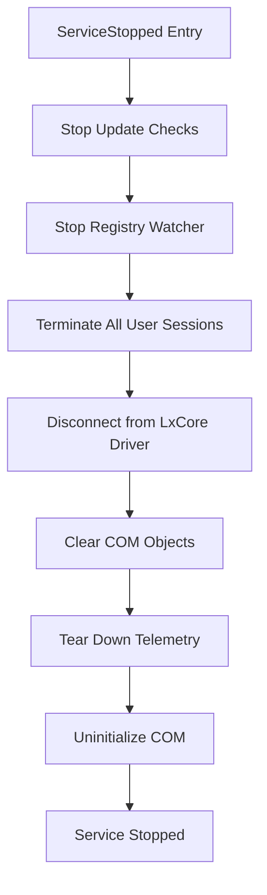
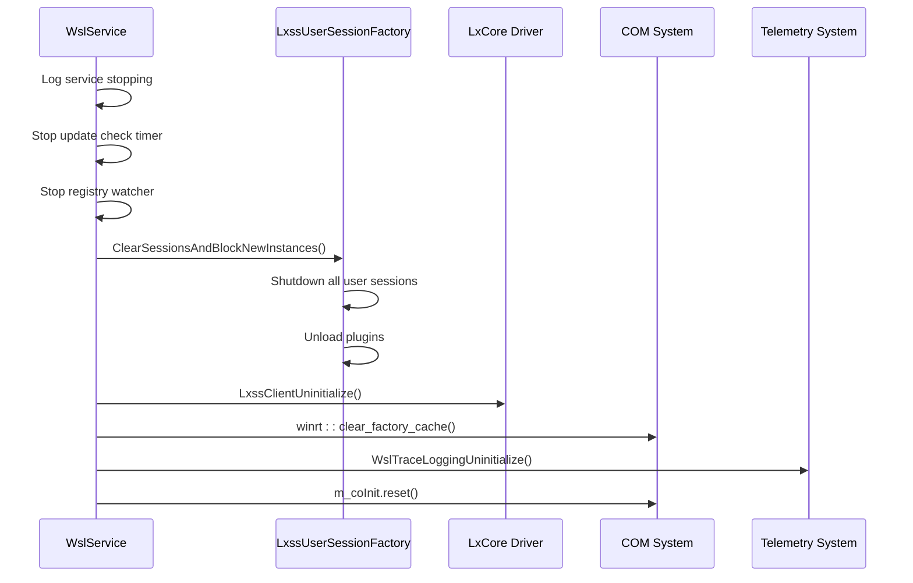
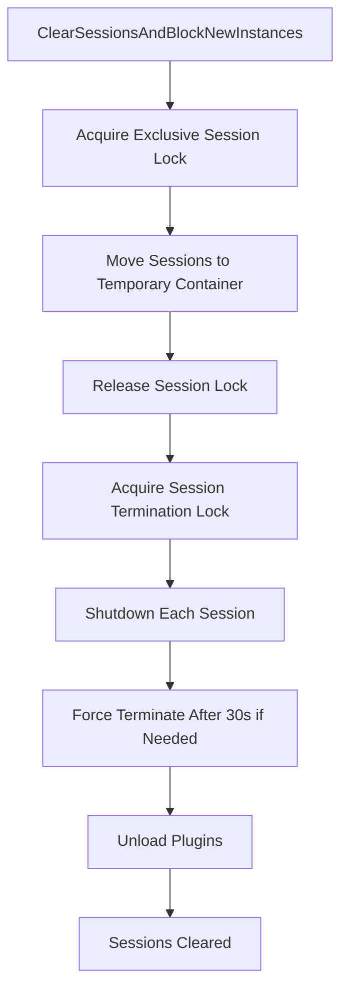
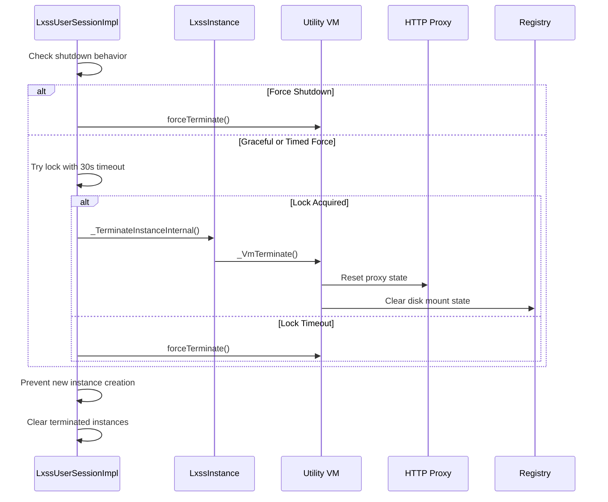
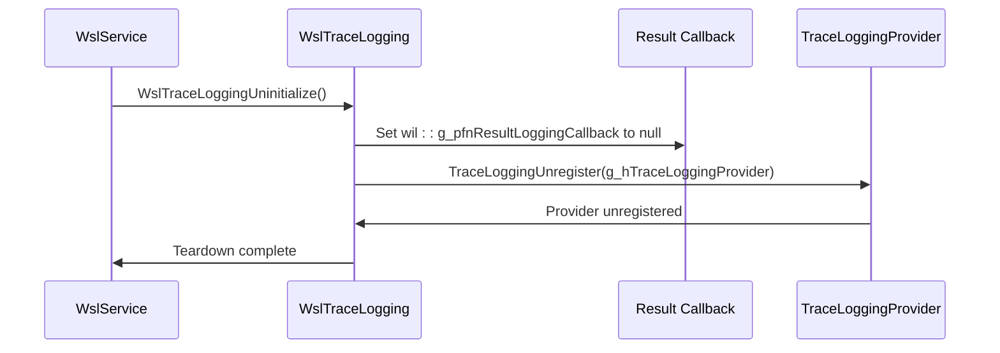
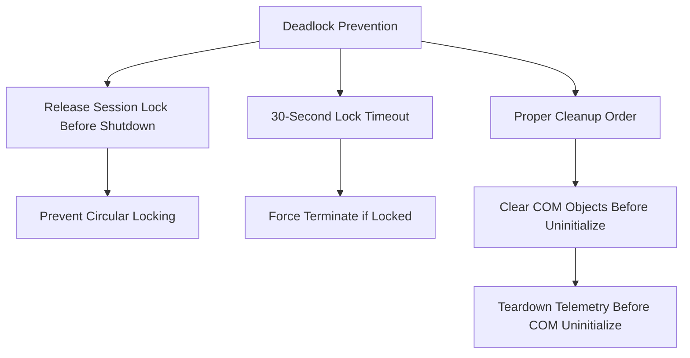

# Service Termination

<cite>
**Referenced Files in This Document**   
- [ServiceMain.cpp](file://src/windows/service/exe/ServiceMain.cpp)
- [LxssUserSessionFactory.cpp](file://src/windows/service/exe/LxssUserSessionFactory.cpp)
- [LxssUserSession.cpp](file://src/windows/service/exe/LxssUserSession.cpp)
- [WslTelemetry.cpp](file://src/windows/common/WslTelemetry.cpp)
- [WslTelemetry.h](file://src/windows/common/WslTelemetry.h)
- [comservicehelper.h](file://src/windows/inc/comservicehelper.h)
- [LxssInstance.cpp](file://src/windows/service/exe/LxssInstance.cpp)
- [WslCoreInstance.cpp](file://src/windows/service/exe/WslCoreInstance.cpp)
</cite>

## Table of Contents
1. [Introduction](#introduction)
2. [ServiceStopped Method Implementation](#servicestopped-method-implementation)
3. [Shutdown Sequence](#shutdown-sequence)
4. [Session and Instance Termination](#session-and-instance-termination)
5. [COM Object Cleanup](#com-object-cleanup)
6. [Telemetry and Event Logging Teardown](#telemetry-and-event-logging-teardown)
7. [Threadpool Timers and Registry Watchers](#threadpool-timers-and-registry-watchers)
8. [Deadlock Prevention](#deadlock-prevention)
9. [Conclusion](#conclusion)

## Introduction
The Windows Subsystem for Linux (WSL) service termination procedures ensure an orderly shutdown of all components when the service is stopped. This document details the implementation of the ServiceStopped() method and the comprehensive shutdown sequence that terminates user sessions, disconnects from the LxCore driver, cleans up COM objects, and properly uninitializes telemetry and event logging components. The shutdown process is designed to handle all running distributions and VM instances gracefully while preventing potential deadlocks and ensuring proper resource cleanup.

## ServiceStopped Method Implementation

The ServiceStopped() method is the primary entry point for the WSL service termination process. Implemented in the WslService class, this method orchestrates the orderly shutdown of all service components in a specific sequence to ensure proper cleanup and resource release.



**Diagram sources**
- [ServiceMain.cpp](file://src/windows/service/exe/ServiceMain.cpp#L230-L259)

**Section sources**
- [ServiceMain.cpp](file://src/windows/service/exe/ServiceMain.cpp#L230-L259)

## Shutdown Sequence

The shutdown sequence in the WSL service follows a strict order to ensure proper cleanup and prevent resource leaks. The sequence begins with stopping background operations and progresses through session termination, driver disconnection, and final cleanup operations.

The shutdown process starts with logging the service stopping event, followed by stopping update checks and registry watchers. This is followed by terminating all user sessions and disconnecting from the LxCore driver. The final steps involve cleaning up COM objects, tearing down telemetry, and uninitializing COM.



**Diagram sources**
- [ServiceMain.cpp](file://src/windows/service/exe/ServiceMain.cpp#L230-L259)
- [LxssUserSessionFactory.cpp](file://src/windows/service/exe/LxssUserSessionFactory.cpp#L61-L75)

**Section sources**
- [ServiceMain.cpp](file://src/windows/service/exe/ServiceMain.cpp#L230-L259)

## Session and Instance Termination

The termination of user sessions and instances is a critical part of the WSL service shutdown process. The ClearSessionsAndBlockNewInstances() function is responsible for terminating all active user sessions and preventing new sessions from being created.

The process begins by acquiring exclusive access to the session list and moving all active sessions to a temporary container. This allows the session lock to be released before calling Shutdown() on each session, preventing potential deadlocks. Each session is then shut down with a force behavior after 30 seconds if necessary.



**Diagram sources**
- [LxssUserSessionFactory.cpp](file://src/windows/service/exe/LxssUserSessionFactory.cpp#L61-L75)
- [LxssUserSessionFactory.cpp](file://src/windows/service/exe/LxssUserSessionFactory.cpp#L38-L59)

**Section sources**
- [LxssUserSessionFactory.cpp](file://src/windows/service/exe/LxssUserSessionFactory.cpp#L61-L75)

The LxssUserSessionImpl::Shutdown() method handles the termination of individual user sessions. It first attempts to gracefully terminate the utility VM and all running instances. If a forced shutdown is required, it will forcefully terminate the VM after attempting a graceful shutdown for 30 seconds.



**Diagram sources**
- [LxssUserSession.cpp](file://src/windows/service/exe/LxssUserSession.cpp#L2084-L2173)

**Section sources**
- [LxssUserSession.cpp](file://src/windows/service/exe/LxssUserSession.cpp#L2084-L2173)

## COM Object Cleanup

Proper cleanup of COM objects is essential to prevent memory leaks and ensure a clean shutdown. The WSL service uses the Windows Implementation Library (WIL) to manage COM initialization and cleanup through the wil::CoInitializeEx class.

A potential deadlock can occur if CoUninitialize() is called before the LanguageChangeNotifyThread completes initialization. To prevent this, the service clears COM factories using winrt::clear_factory_cache() before uninitializing COM. This ensures that all COM objects are properly released before the COM library is uninitialized.

The m_coInit member variable, which is a wil::unique_couninitialize_call object, is reset at the end of the ServiceStopped() method. This calls CoUninitialize() and properly cleans up the COM apartment.

```mermaid
flowchart TD
A[COM Cleanup Start] --> B[Clear COM Factories]
B --> C[winrt::clear_factory_cache()]
C --> D[Tear Down Telemetry]
D --> E[Uninitialize COM]
E --> F[m_coInit.reset()]
F --> G[COM Cleanup Complete]
```

**Diagram sources**
- [ServiceMain.cpp](file://src/windows/service/exe/ServiceMain.cpp#L249-L258)

**Section sources**
- [ServiceMain.cpp](file://src/windows/service/exe/ServiceMain.cpp#L249-L258)

## Telemetry and Event Logging Teardown

The teardown of telemetry and event logging components is a critical part of the service shutdown process. The WSL service uses TraceLogging for telemetry and event logging, which must be properly uninitialized to ensure all events are flushed and resources are released.

The WslTraceLoggingUninitialize() function is called to unregister the trace logging provider and clean up associated resources. This function sets the global result logging callback to null and calls TraceLoggingUnregister() to unregister the provider.

The order of operations is important: telemetry must be torn down after session termination but before COM uninitialization, as the telemetry system may use COM components.



**Diagram sources**
- [WslTelemetry.cpp](file://src/windows/common/WslTelemetry.cpp#L180-L184)
- [ServiceMain.cpp](file://src/windows/service/exe/ServiceMain.cpp#L253-L255)

**Section sources**
- [WslTelemetry.cpp](file://src/windows/common/WslTelemetry.cpp#L180-L184)

## Threadpool Timers and Registry Watchers

The proper disposal of threadpool timers and registry watchers is essential for a clean service shutdown. The WSL service uses these mechanisms for periodic operations and monitoring configuration changes.

The m_updateCheckTimer is a threadpool timer used to periodically check for WSL updates. During shutdown, this timer is reset, which cancels any pending callbacks and releases the timer resources. Similarly, the m_watcher object, which is a wil::unique_registry_watcher, is reset to stop monitoring registry changes and release associated resources.

These cleanup operations must occur early in the shutdown sequence to prevent any background operations from interfering with the termination of user sessions and other components.

```mermaid
flowchart TD
A[Timer and Watcher Cleanup] --> B[Reset Update Check Timer]
B --> C[m_updateCheckTimer.reset()]
C --> D[Cancel Pending Callbacks]
D --> E[Reset Registry Watcher]
E --> F[m_watcher.reset()]
F --> G[Stop Registry Monitoring]
G --> H[Resources Released]
```

**Diagram sources**
- [ServiceMain.cpp](file://src/windows/service/exe/ServiceMain.cpp#L234-L238)

**Section sources**
- [ServiceMain.cpp](file://src/windows/service/exe/ServiceMain.cpp#L234-L238)

## Deadlock Prevention

The WSL service shutdown process includes several mechanisms to prevent deadlocks, which could otherwise prevent the service from terminating properly.

The primary deadlock prevention mechanism is in the ClearSessionsAndBlockNewInstancesLockHeld() function, which releases the session lock before calling Shutdown() on each session. This prevents a potential deadlock that could occur if FindSessionByCookie() was called during shutdown, as it would try to acquire the session lock while holding the session inner lock.

Another deadlock prevention measure is the 30-second timeout when attempting to acquire the instance lock during forced shutdown. If the lock cannot be acquired within 30 seconds, the service will force-terminate the VM, preventing an indefinite hang.

The order of cleanup operations is also designed to prevent deadlocks. COM objects are cleared before COM is uninitialized, and telemetry is torn down before COM uninitialization, as these systems may depend on COM components.



**Diagram sources**
- [LxssUserSessionFactory.cpp](file://src/windows/service/exe/LxssUserSessionFactory.cpp#L47-L52)
- [LxssUserSession.cpp](file://src/windows/service/exe/LxssUserSession.cpp#L2119-L2129)

**Section sources**
- [LxssUserSessionFactory.cpp](file://src/windows/service/exe/LxssUserSessionFactory.cpp#L47-L52)

## Conclusion
The WSL service termination procedures implement a comprehensive and orderly shutdown sequence that ensures all components are properly cleaned up and resources are released. The ServiceStopped() method orchestrates this process by stopping update checks, terminating user sessions, disconnecting from the LxCore driver, cleaning up COM objects, and properly uninitializing telemetry and event logging components.

The shutdown sequence is carefully designed to prevent deadlocks and ensure that all running distributions and VM instances are terminated gracefully. The use of proper locking mechanisms, timeout handling, and cleanup ordering ensures that the service can terminate reliably under various conditions.

Key aspects of the termination process include the ClearSessionsAndBlockNewInstances() function for session management, proper COM cleanup using winrt::clear_factory_cache() and m_coInit.reset(), and the teardown of telemetry components through WslTraceLoggingUninitialize(). The disposal of threadpool timers and registry watchers ensures that no background operations interfere with the shutdown process.

This robust termination implementation ensures that the WSL service can be stopped cleanly, preventing resource leaks and maintaining system stability.