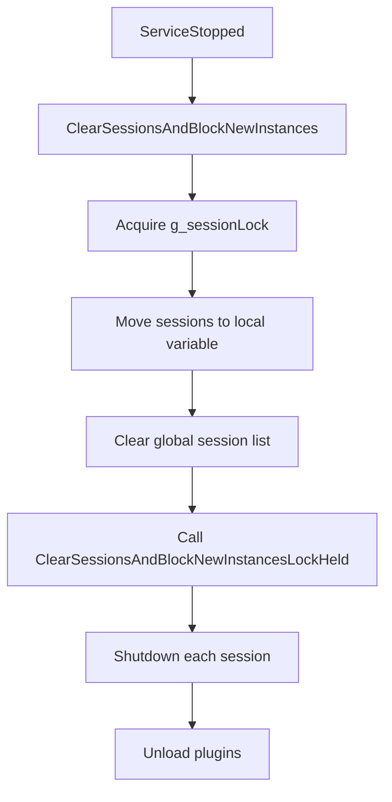
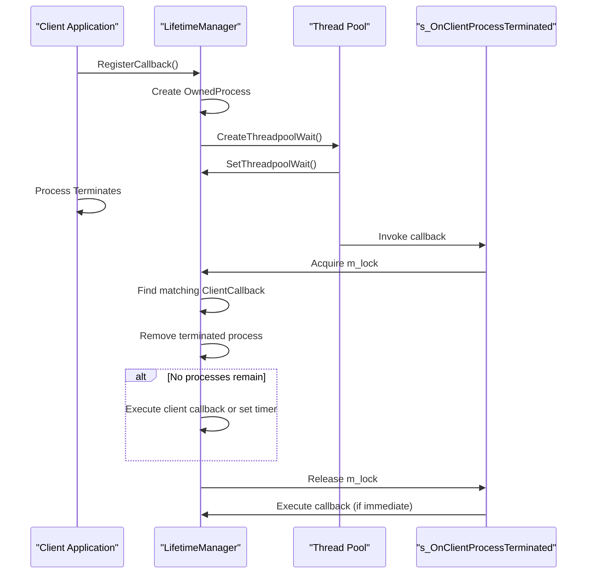
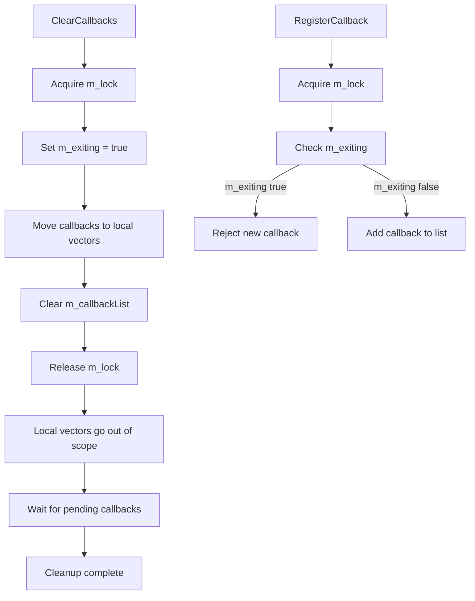
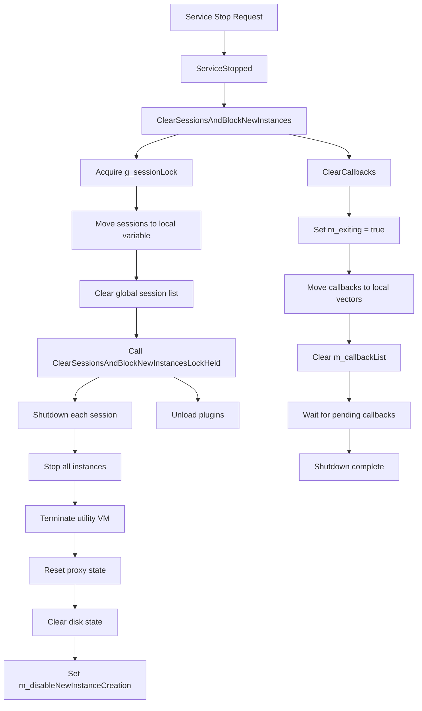

# Session Termination

<cite>
**Referenced Files in This Document**   
- [Lifetime.cpp](file://src/windows/service/exe/Lifetime.cpp)
- [Lifetime.h](file://src/windows/service/exe/Lifetime.h)
- [LxssUserSessionFactory.cpp](file://src/windows/service/exe/LxssUserSessionFactory.cpp)
- [LxssUserSessionFactory.h](file://src/windows/service/exe/LxssUserSessionFactory.h)
- [LxssUserSession.cpp](file://src/windows/service/exe/LxssUserSession.cpp)
- [LxssUserSession.h](file://src/windows/service/exe/LxssUserSession.h)
- [ServiceMain.cpp](file://src/windows/service/exe/ServiceMain.cpp)
</cite>

## Table of Contents
1. [Introduction](#introduction)
2. [ClearSessionsAndBlockNewInstances Function](#clearsessionsandblocknewinstances-function)
3. [LifetimeManager Class Implementation](#lifetimemanager-class-implementation)
4. [Client Process Termination Callbacks](#client-process-termination-callbacks)
5. [Synchronization Mechanisms](#synchronization-mechanisms)
6. [Session Termination Flow](#session-termination-flow)
7. [Conclusion](#conclusion)

## Introduction
This document provides a comprehensive analysis of the session termination procedures during WSL service shutdown. It details the implementation of the `ClearSessionsAndBlockNewInstances()` function, the `LifetimeManager` class, and the associated mechanisms for managing client process termination callbacks. The documentation focuses on how active user sessions are properly terminated, how client process lifecycle events are handled through threadpool waits, and the synchronization strategies employed to prevent deadlocks during session cleanup operations.

**Section sources**
- [Lifetime.cpp](file://src/windows/service/exe/Lifetime.cpp#L1-L352)
- [LxssUserSessionFactory.cpp](file://src/windows/service/exe/LxssUserSessionFactory.cpp#L1-L247)
- [ServiceMain.cpp](file://src/windows/service/exe/ServiceMain.cpp#L189-L248)

## ClearSessionsAndBlockNewInstances Function
The `ClearSessionsAndBlockNewInstances()` function is responsible for terminating all active user sessions and preventing the creation of new sessions during WSL service shutdown. This function serves as the primary entry point for session cleanup operations and is called from the service's `ServiceStopped()` method.

The function operates in two phases: first, it acquires exclusive access to the global session list by locking the `g_sessionLock`, then it moves all active sessions to a local variable and clears the global list. This approach ensures that no new sessions can be created while termination is in progress. The actual shutdown of sessions is delegated to the `ClearSessionsAndBlockNewInstancesLockHeld()` helper function, which iterates through each session and calls its `Shutdown()` method with the `ForceAfter30Seconds` behavior.

This function also handles plugin unloading by resetting the global `g_pluginManager`, ensuring proper cleanup of all plugin resources. The design prevents race conditions by using a two-lock hierarchy where `g_sessionTerminationLock` must always be acquired before `g_sessionLock`, eliminating the possibility of deadlock between session creation and termination threads.



**Diagram sources**
- [LxssUserSessionFactory.cpp](file://src/windows/service/exe/LxssUserSessionFactory.cpp#L61-L75)
- [ServiceMain.cpp](file://src/windows/service/exe/ServiceMain.cpp#L240)

**Section sources**
- [LxssUserSessionFactory.cpp](file://src/windows/service/exe/LxssUserSessionFactory.cpp#L61-L75)
- [LxssUserSessionFactory.h](file://src/windows/service/exe/LxssUserSessionFactory.h#L38-L40)

## LifetimeManager Class Implementation
The `LifetimeManager` class is a central component in managing the lifecycle of client processes associated with WSL sessions. Implemented in `Lifetime.cpp` and declared in `Lifetime.h`, this class provides mechanisms for registering callbacks that are invoked when client processes terminate or when specified timeouts expire.

The class maintains a list of `ClientCallback` objects, each representing a registered client with its associated callback function, timeout value, and collection of monitored processes. Each client is identified by a unique `ClientKey` generated through the `GetRegistrationId()` method. The implementation uses a `std::mutex` (`m_lock`) to protect access to the callback list, ensuring thread-safe operations across multiple threads.

Key methods include `RegisterCallback()` for adding new client registrations, `RemoveCallback()` for unregistering clients, and `ClearCallbacks()` for cleaning up all registered callbacks during service shutdown. The class also manages threadpool timers and waits through the Windows Thread Pool API, allowing efficient monitoring of process lifetimes without dedicated threads.

```mermaid
classDiagram
class LifetimeManager {
+m_lock : std : : mutex
+m_exiting : bool
+m_nextClientKey : ULONG64
+m_callbackList : std : : ClientCallback[]
+m_lastCallbackWait : wil : : unique_threadpool_wait
+m_lastTimerWait : wil : : unique_threadpool_timer
+GetRegistrationId() : ULONG64
+IsAnyProcessRegistered(ClientKey) : bool
+RegisterCallback(ClientKey, Callback, ClientProcess, TimeoutMs) : void
+RemoveCallback(ClientKey) : bool
+ClearCallbacks() : void
+_FindClient(ClientKey) : iterator
+s_OnClientProcessTerminated() : VOID CALLBACK
+s_OnTimeout() : VOID CALLBACK
}
class ClientCallback {
+clientKey : ULONG64
+callback : std : : function~bool(void)~
+timeout : DWORD
+clientProcesses : std : : OwnedProcess[]
+timer : wil : : unique_threadpool_timer_nowait
+CancelTimer() : void
+CreateTimer(Callback, Context) : void
+FindProcess(Process) : iterator
+SetTimer(DueTimeMs) : void
}
class OwnedProcess {
+process : wil : : unique_handle
+terminationWait : wil : : unique_threadpool_wait_nowait
+InitializeListenForTermination(Callback, Context) : void
+ListenForTermination() : void
}
LifetimeManager --> ClientCallback : "contains"
ClientCallback --> OwnedProcess : "contains"
LifetimeManager --> "PTP_WAIT_CALLBACK" : "s_OnClientProcessTerminated"
LifetimeManager --> "PTP_TIMER_CALLBACK" : "s_OnTimeout"
```

**Diagram sources**
- [Lifetime.cpp](file://src/windows/service/exe/Lifetime.cpp#L32-L352)
- [Lifetime.h](file://src/windows/service/exe/Lifetime.h#L19-L85)

**Section sources**
- [Lifetime.cpp](file://src/windows/service/exe/Lifetime.cpp#L32-L352)
- [Lifetime.h](file://src/windows/service/exe/Lifetime.h#L19-L85)

## Client Process Termination Callbacks
The client process termination mechanism in WSL is implemented through the `s_OnClientProcessTerminated` callback function, which is registered with the Windows Thread Pool API to monitor the lifetime of client processes. This callback is invoked automatically by the operating system when a monitored process terminates.

When a client registers a callback through `RegisterCallback()`, the `LifetimeManager` creates an `OwnedProcess` object that wraps the client's process handle and sets up a threadpool wait via `CreateThreadpoolWait()`. The `s_OnClientProcessTerminated` function searches for the matching `ClientCallback` and `OwnedProcess` in the callback list, removes the terminated process from the client's process collection, and if no processes remain for that client, either executes the client's callback immediately (if timeout is zero) or sets a timer to invoke the callback after the specified timeout period.

This mechanism allows WSL to gracefully terminate sessions when associated client applications exit, while providing a configurable timeout to allow for process restart scenarios. The callback execution is deferred until after releasing the mutex to prevent potential deadlocks, and the implementation carefully manages the lifetime of threadpool objects to avoid use-after-free conditions.



**Diagram sources**
- [Lifetime.cpp](file://src/windows/service/exe/Lifetime.cpp#L159-L215)
- [Lifetime.h](file://src/windows/service/exe/Lifetime.h#L80)

**Section sources**
- [Lifetime.cpp](file://src/windows/service/exe/Lifetime.cpp#L159-L215)

## Synchronization Mechanisms
The WSL session termination system employs several synchronization mechanisms to prevent deadlocks and ensure thread-safe operations during shutdown. The primary synchronization primitive is the `std::mutex` (`m_lock`) within the `LifetimeManager` class, which protects access to the callback list and ensures atomic modifications.

For the session management system, a two-lock hierarchy is implemented using `g_sessionTerminationLock` (a recursive mutex) and `g_sessionLock` (a slim reader-writer lock). The design rule requires that `g_sessionTerminationLock` must always be acquired before `g_sessionLock`, preventing circular wait conditions that could lead to deadlock. This is particularly important because the `Shutdown()` method acquires the session's inner lock, and calling it while holding `g_sessionLock` could create a deadlock if `FindSessionByCookie` is called concurrently.

The `ClearCallbacks()` method in `LifetimeManager` implements a sophisticated strategy to avoid deadlocks during cleanup: it first acquires the mutex, moves all callbacks to local vectors, releases the mutex, and then allows the local vectors to go out of scope, which automatically waits for any pending callbacks to complete. This approach separates the critical section (modifying the callback list) from the potentially blocking operation (waiting for callbacks).

Additionally, the `m_exiting` flag serves as a synchronization mechanism to prevent new callbacks from being scheduled during the shutdown process, ensuring a clean termination state.



**Diagram sources**
- [Lifetime.cpp](file://src/windows/service/exe/Lifetime.cpp#L46-L79)
- [LxssUserSessionFactory.cpp](file://src/windows/service/exe/LxssUserSessionFactory.cpp#L26-L28)

**Section sources**
- [Lifetime.cpp](file://src/windows/service/exe/Lifetime.cpp#L46-L79)
- [LxssUserSessionFactory.cpp](file://src/windows/service/exe/LxssUserSessionFactory.cpp#L26-L28)

## Session Termination Flow
The complete session termination flow during WSL service shutdown follows a well-defined sequence of operations that ensures all active sessions are properly cleaned up while preventing new sessions from being created. The process begins when the service receives a stop notification, triggering the `ServiceStopped()` method in `ServiceMain.cpp`.

This method calls `ClearSessionsAndBlockNewInstances()`, which initiates the session cleanup process by acquiring the necessary locks and moving all active sessions to a local variable. Each session is then shut down through its `Shutdown()` method with the `ForceAfter30Seconds` behavior, which attempts graceful termination first and forces termination if the 30-second timeout is exceeded.

During session shutdown, all running instances are stopped, the utility VM is terminated, proxy state is reset, and any attached disk state is cleared from the registry. The `m_disableNewInstanceCreation` flag is set to prevent new instance creation during the cleanup process. Concurrently, the `LifetimeManager`'s `ClearCallbacks()` method is invoked, which systematically removes all registered callbacks and waits for any pending termination notifications to complete.

The flow ensures that all resources are properly released and that the service reaches a clean shutdown state, ready for subsequent startup.



**Diagram sources**
- [ServiceMain.cpp](file://src/windows/service/exe/ServiceMain.cpp#L230-L247)
- [LxssUserSessionFactory.cpp](file://src/windows/service/exe/LxssUserSessionFactory.cpp#L38-L75)
- [LxssUserSession.cpp](file://src/windows/service/exe/LxssUserSession.cpp#L2122-L2159)

**Section sources**
- [ServiceMain.cpp](file://src/windows/service/exe/ServiceMain.cpp#L230-L247)
- [LxssUserSessionFactory.cpp](file://src/windows/service/exe/LxssUserSessionFactory.cpp#L38-L75)
- [LxssUserSession.cpp](file://src/windows/service/exe/LxssUserSession.cpp#L2122-L2159)

## Conclusion
The WSL session termination system demonstrates a robust and well-designed approach to managing service shutdown and session cleanup. The `ClearSessionsAndBlockNewInstances()` function serves as the central coordination point for terminating all active sessions, while the `LifetimeManager` class provides a sophisticated mechanism for tracking client process lifetimes through threadpool callbacks.

The implementation effectively addresses potential concurrency issues through careful lock management and a well-defined lock hierarchy that prevents deadlocks. The use of the `m_exiting` flag and the two-phase cleanup strategy in `ClearCallbacks()` ensures that the system reaches a consistent shutdown state without race conditions.

The client process termination callback mechanism allows WSL to respond appropriately to client application lifecycle events, providing both immediate cleanup and timeout-based graceful termination options. This design supports the Windows service model while maintaining the reliability and stability required for a system-level component.

Overall, the session termination procedures in WSL represent a mature implementation that balances responsiveness, reliability, and resource management during the critical service shutdown phase.

**Section sources**
- [Lifetime.cpp](file://src/windows/service/exe/Lifetime.cpp#L1-L352)
- [LxssUserSessionFactory.cpp](file://src/windows/service/exe/LxssUserSessionFactory.cpp#L1-L247)
- [ServiceMain.cpp](file://src/windows/service/exe/ServiceMain.cpp#L189-L248)