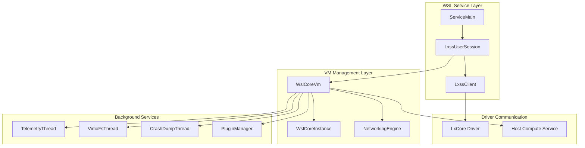
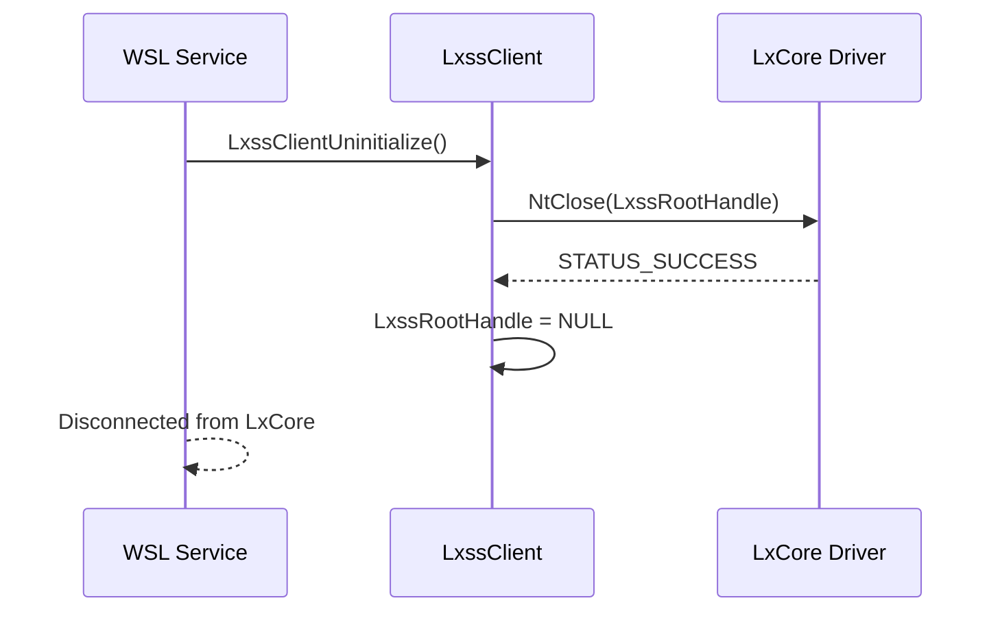
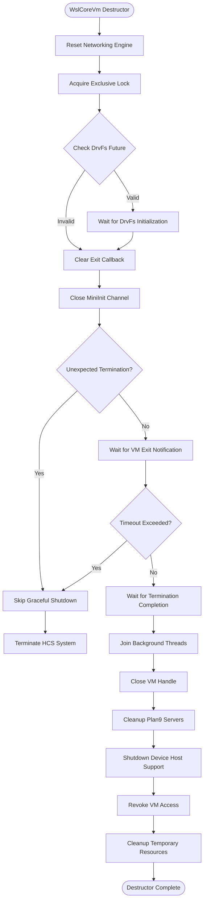
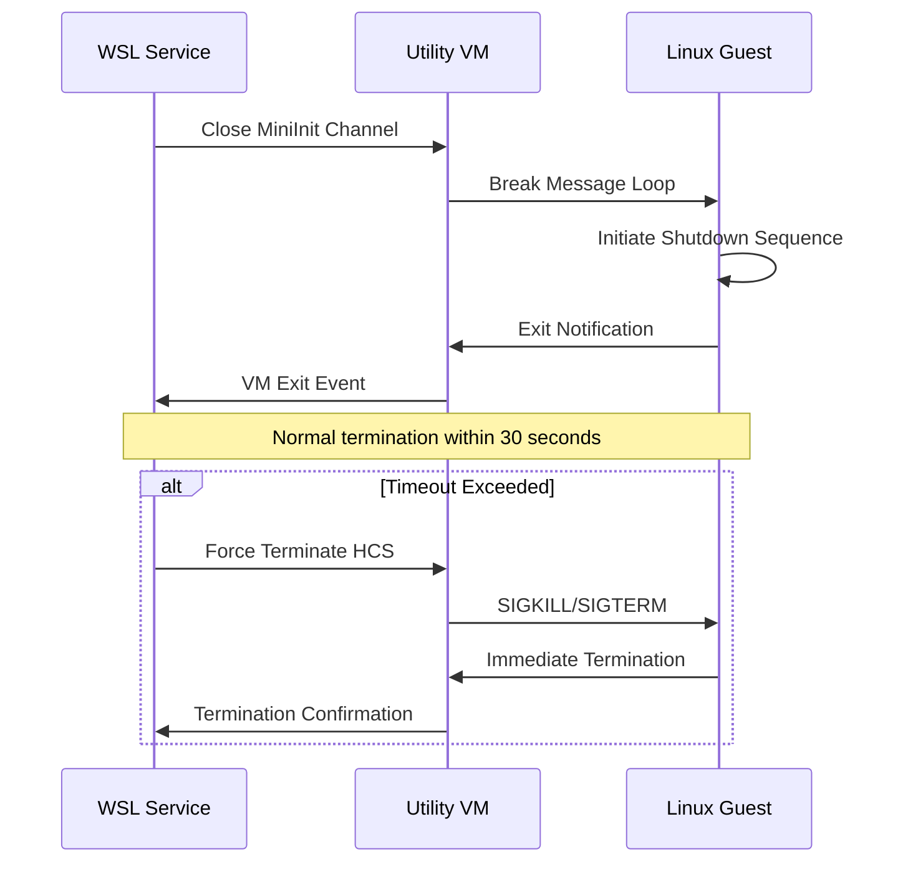
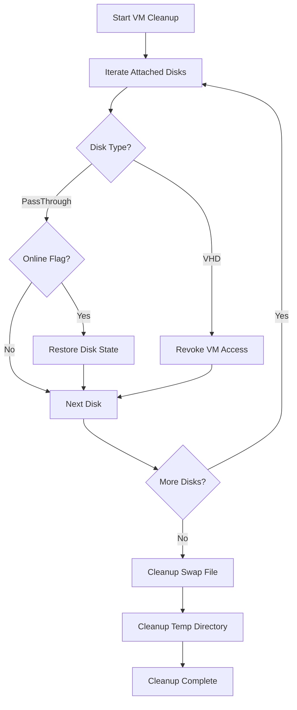
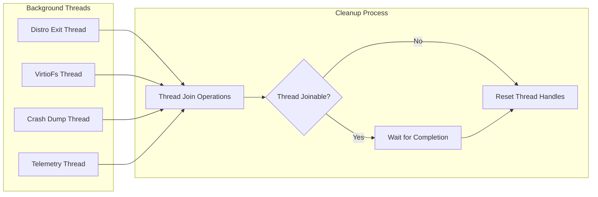
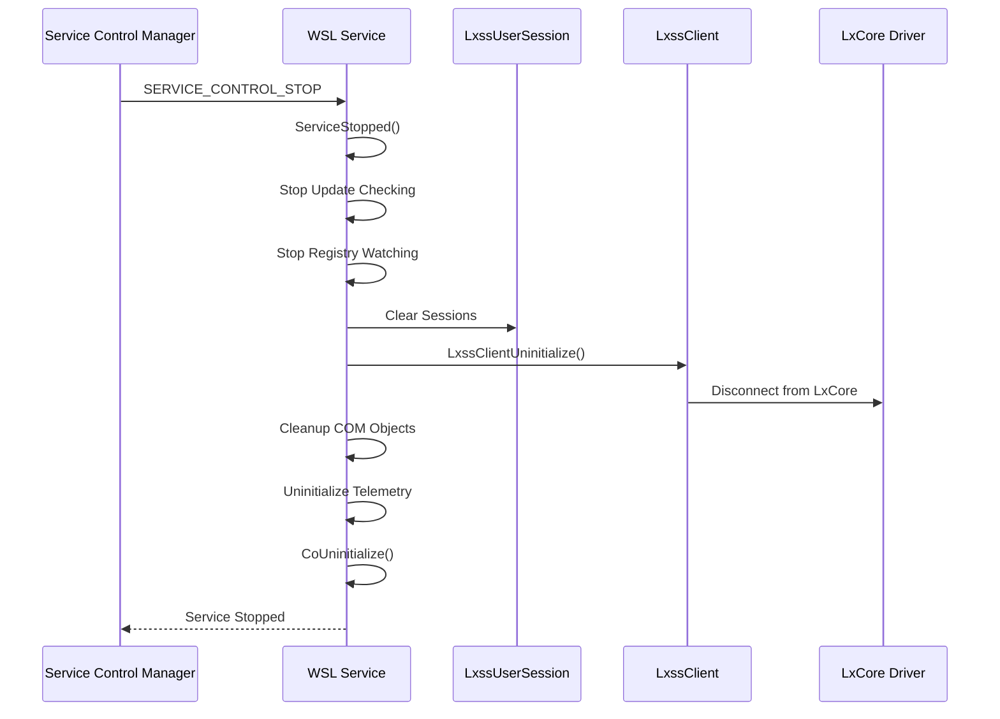
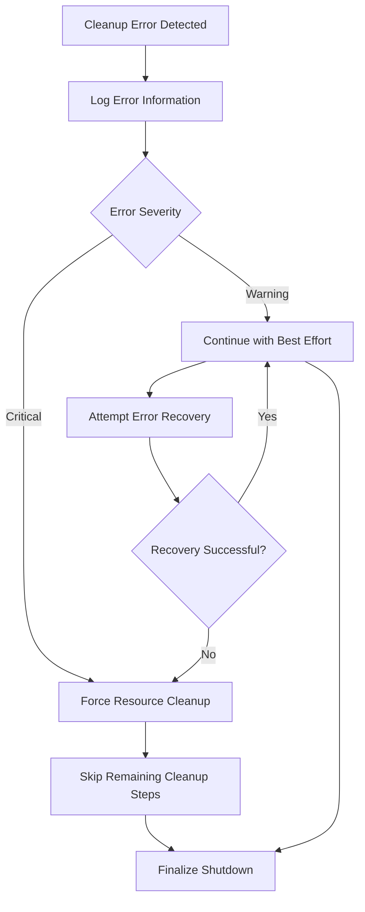

# System Uninitialization

<cite>
**Referenced Files in This Document**
- [lxssclient.cpp](file://src/windows/common/lxssclient.cpp)
- [WslCoreVm.cpp](file://src/windows/service/exe/WslCoreVm.cpp)
- [WslCoreVm.h](file://src/windows/service/exe/WslCoreVm.h)
- [LxssUserSession.cpp](file://src/windows/service/exe/LxssUserSession.cpp)
- [LxssUserSession.h](file://src/windows/service/exe/LxssUserSession.h)
- [ServiceMain.cpp](file://src/windows/service/exe/ServiceMain.cpp)
- [WslCoreInstance.cpp](file://src/windows/service/exe/WslCoreInstance.cpp)
- [WslClient.cpp](file://src/windows/common/WslClient.cpp)
- [init.cpp](file://src/linux/init/init.cpp)
- [Common.cpp](file://test/windows/Common.cpp)
</cite>

## Table of Contents
1. [Introduction](#introduction)
2. [System Architecture Overview](#system-architecture-overview)
3. [LxCore Driver Disconnection](#lxcore-driver-disconnection)
4. [VM Instance Teardown](#vm-instance-teardown)
5. [Graceful vs Forced Termination](#graceful-vs-forced-termination)
6. [Utility VM Resource Cleanup](#utility-vm-resource-cleanup)
7. [Background Thread Management](#background-thread-management)
8. [Service Lifecycle Termination](#service-lifecycle-termination)
9. [Troubleshooting and Error Handling](#troubleshooting-and-error-handling)
10. [Best Practices](#best-practices)

## Introduction

The WSL (Windows Subsystem for Linux) system uninitialization process represents the final phase of service termination, ensuring clean shutdown of all subsystem components including VM instances, distributions, networking infrastructure, and background services. This comprehensive process involves coordinated teardown sequences across multiple layers of the WSL architecture, from the LxCore driver connection down to individual distribution instances.

The uninitialization process follows a carefully orchestrated sequence designed to preserve data integrity while efficiently releasing system resources. It encompasses graceful shutdown procedures for responsive components and forced termination mechanisms for unresponsive or stuck processes, ensuring reliable system cleanup regardless of the termination scenario.

## System Architecture Overview

The WSL uninitialization architecture operates through several interconnected layers, each responsible for specific aspects of the shutdown process:

**Diagram sources**
- [ServiceMain.cpp](file://src/windows/service/exe/ServiceMain.cpp#L45-L73)
- [LxssUserSession.cpp](file://src/windows/service/exe/LxssUserSession.cpp#L2086-L2159)
- [WslCoreVm.cpp](file://src/windows/service/exe/WslCoreVm.cpp#L702-L899)

## LxCore Driver Disconnection

### LxssClientUninitialize() Function

The disconnection from the LxCore driver represents the foundational step in the WSL uninitialization process. The [`LxssClientUninitialize()`](file://src/windows/common/lxssclient.cpp#L246-L269) function serves as the primary interface for terminating connections to the underlying LXSS (Linux Subsystem) driver.

**Diagram sources**
- [lxssclient.cpp](file://src/windows/common/lxssclient.cpp#L246-L269)

### Connection State Management

The LxCore driver connection state is managed through a global handle variable that tracks the active connection status. The uninitialization process ensures proper cleanup of this connection state, preventing resource leaks and maintaining system stability.

**Section sources**
- [lxssclient.cpp](file://src/windows/common/lxssclient.cpp#L18-L269)

## VM Instance Teardown

### WslCoreVm Destructor Sequence

The [`WslCoreVm`](file://src/windows/service/exe/WslCoreVm.h#L53-L379) destructor orchestrates the comprehensive teardown of virtual machine instances and associated resources. This process involves multiple phases executed in strict chronological order to ensure proper resource cleanup.

**Diagram sources**
- [WslCoreVm.cpp](file://src/windows/service/exe/WslCoreVm.cpp#L702-L899)

### Networking Component Shutdown

The networking engine teardown occurs early in the process to prevent new connections while allowing existing traffic to complete. This ensures data integrity during the shutdown sequence.

**Section sources**
- [WslCoreVm.cpp](file://src/windows/service/exe/WslCoreVm.cpp#L702-L899)

## Graceful vs Forced Termination

### Timeout-Based Termination Strategy

WSL implements a sophisticated timeout-based termination strategy that balances responsiveness with reliability. The system employs two distinct timeout values to manage the termination process effectively.

| Timeout Type | Duration | Purpose |
|--------------|----------|---------|
| UTILITY_VM_SHUTDOWN_TIMEOUT | 30 seconds | Maximum time for graceful VM shutdown |
| UTILITY_VM_TERMINATE_TIMEOUT | 30 seconds | Maximum time for VM termination completion |

### Graceful Shutdown Process

The graceful shutdown process initiates with the closure of the mini_init communication channel, triggering the Linux guest to enter its shutdown sequence. The system monitors for exit notifications while allowing up to 30 seconds for normal termination.

**Diagram sources**
- [WslCoreVm.cpp](file://src/windows/service/exe/WslCoreVm.cpp#L740-L773)

### Forced Termination Mechanisms

When graceful shutdown fails to complete within the timeout period, WSL escalates to forced termination using the Host Compute Service (HCS) termination APIs. This ensures system cleanup even when guest processes become unresponsive.

**Section sources**
- [WslCoreVm.cpp](file://src/windows/service/exe/WslCoreVm.cpp#L740-L773)

## Utility VM Resource Cleanup

### Disk Attachment Management

The utility VM cleanup process includes comprehensive disk attachment management to prevent resource leaks and maintain system integrity. This involves both user-mounted disks and system-managed resources.

**Diagram sources**
- [WslCoreVm.cpp](file://src/windows/service/exe/WslCoreVm.cpp#L807-L822)

### Temporary Resource Management

The utility VM cleanup process also manages temporary resources including swap files, temporary directories, and registry entries. These resources are automatically cleaned up to prevent accumulation and maintain system performance.

**Section sources**
- [WslCoreVm.cpp](file://src/windows/service/exe/WslCoreVm.cpp#L825-L860)

## Background Thread Management

### Thread Synchronization Strategy

WSL implements a comprehensive thread synchronization strategy during shutdown to ensure all background activities complete properly before final cleanup. This prevents race conditions and ensures data integrity.

**Diagram sources**
- [WslCoreVm.cpp](file://src/windows/service/exe/WslCoreVm.cpp#L775-L814)

### Thread Termination Order

The background thread termination follows a specific order to ensure proper resource cleanup and prevent deadlocks:

1. **Distro Exit Thread**: Monitors distribution exit callbacks
2. **VirtioFs Thread**: Manages filesystem sharing operations  
3. **Crash Dump Collection Thread**: Handles crash dump processing
4. **Telemetry Thread**: Processes usage telemetry data

**Section sources**
- [WslCoreVm.cpp](file://src/windows/service/exe/WslCoreVm.cpp#L775-L814)

## Service Lifecycle Termination

### ServiceMain Termination Sequence

The [`ServiceMain`](file://src/windows/service/exe/ServiceMain.cpp#L230-L258) class implements the complete service lifecycle termination, coordinating between different subsystems and ensuring proper cleanup of all service resources.

**Diagram sources**
- [ServiceMain.cpp](file://src/windows/service/exe/ServiceMain.cpp#L230-L258)

### Session Management During Termination

The [`LxssUserSession::Shutdown()`](file://src/windows/service/exe/LxssUserSession.cpp#L2086-L2159) method coordinates the termination of all user sessions, ensuring that all instances and VMs are properly shut down before service completion.

**Section sources**
- [ServiceMain.cpp](file://src/windows/service/exe/ServiceMain.cpp#L230-L258)
- [LxssUserSession.cpp](file://src/windows/service/exe/LxssUserSession.cpp#L2086-L2159)

## Troubleshooting and Error Handling

### Common Termination Issues

Several scenarios can complicate the WSL uninitialization process:

| Issue | Symptoms | Resolution |
|-------|----------|------------|
| Hanging Instances | Long shutdown times | Force termination after timeout |
| Network Connectivity Loss | Failed cleanup operations | Retry with exponential backoff |
| Resource Lock Contention | Deadlock during cleanup | Implement timeout-based locking |
| Driver Communication Failure | Unable to disconnect from LxCore | Fallback to direct driver termination |

### Error Recovery Mechanisms

The WSL uninitialization process includes robust error recovery mechanisms to handle various failure scenarios gracefully:

**Section sources**
- [WslCoreVm.cpp](file://src/windows/service/exe/WslCoreVm.cpp#L752-L756)
- [LxssUserSession.cpp](file://src/windows/service/exe/LxssUserSession.cpp#L2089-L2101)

## Best Practices

### Proper Shutdown Procedures

For optimal system stability and data integrity, WSL implements several best practices during the uninitialization process:

1. **Ordered Resource Cleanup**: Resources are released in reverse dependency order
2. **Timeout Management**: Graceful timeouts prevent indefinite blocking
3. **Error Logging**: Comprehensive logging aids in troubleshooting
4. **Fallback Mechanisms**: Alternative cleanup methods ensure progress
5. **Resource Validation**: Pre-cleanup validation prevents invalid operations

### Monitoring and Diagnostics

The WSL uninitialization process includes extensive telemetry and monitoring capabilities:

- **Termination Events**: Track successful vs forced terminations
- **Resource Usage**: Monitor cleanup duration and resource consumption
- **Error Patterns**: Identify recurring failure scenarios
- **Performance Metrics**: Measure shutdown performance characteristics

These diagnostic capabilities enable system administrators and developers to optimize the uninitialization process and quickly identify potential issues in production environments.