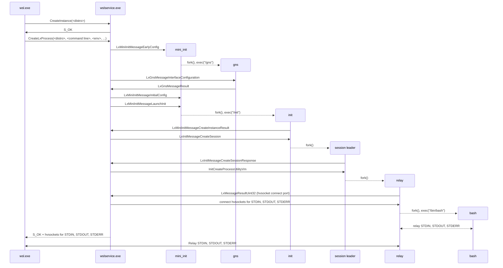
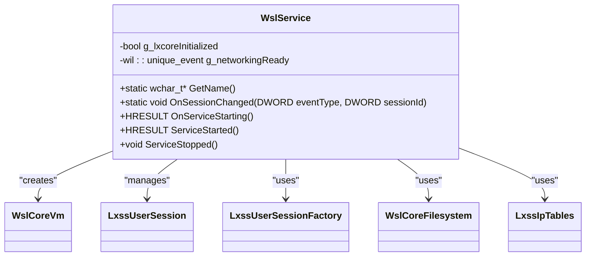
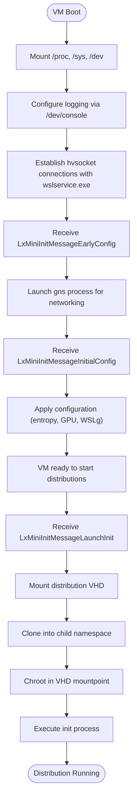
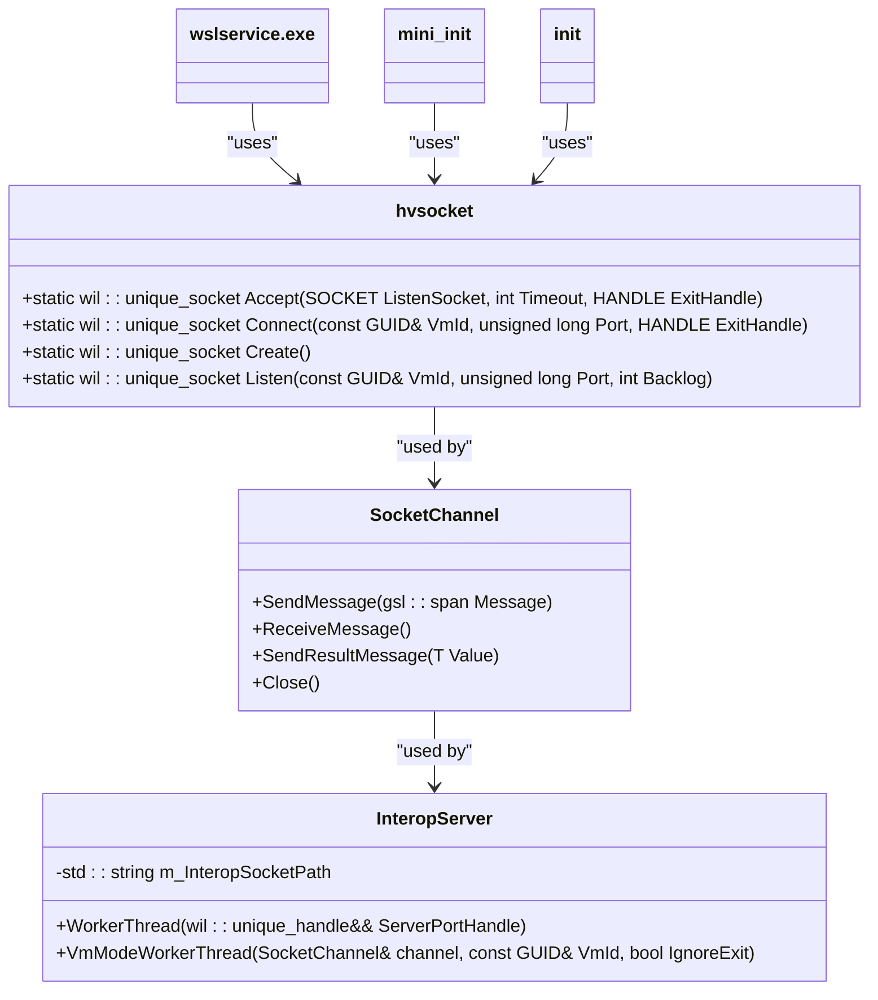
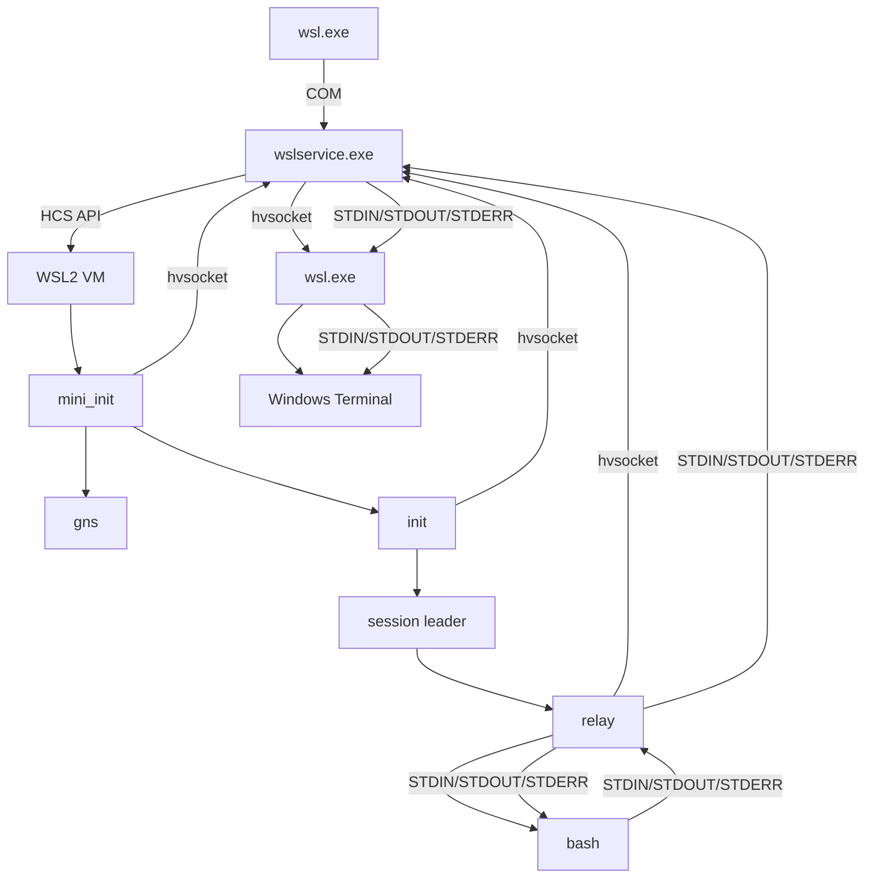

# System Architecture

<cite>
**Referenced Files in This Document**   
- [ServiceMain.cpp](file://src/windows/service/exe/ServiceMain.cpp)
- [WslCoreVm.cpp](file://src/windows/service/exe/WslCoreVm.cpp)
- [main.cpp](file://src/linux/init/main.cpp)
- [config.cpp](file://src/linux/init/config.cpp)
- [hvsocket.cpp](file://src/windows/common/hvsocket.cpp)
- [boot-process.md](file://doc/docs/technical-documentation/boot-process.md)
- [init.md](file://doc/docs/technical-documentation/init.md)
- [mini_init.md](file://doc/docs/technical-documentation/mini_init.md)
- [index.md](file://doc/docs/technical-documentation/index.md)
</cite>

## Table of Contents
1. [Introduction](#introduction)
2. [System Context and Component Overview](#system-context-and-component-overview)
3. [Boot Sequence and Initialization Process](#boot-sequence-and-initialization-process)
4. [Windows Service Architecture](#windows-service-architecture)
5. [Linux Initialization and VM Subsystem](#linux-initialization-and-vm-subsystem)
6. [Inter-Process Communication and Networking](#inter-process-communication-and-networking)
7. [Component Interaction and Data Flow](#component-interaction-and-data-flow)
8. [Security, Isolation, and Resource Management](#security-isolation-and-resource-management)
9. [Deployment and Infrastructure Considerations](#deployment-and-infrastructure-considerations)

## Introduction
The Windows Subsystem for Linux (WSL) architecture implements a sophisticated hybrid system that seamlessly integrates Windows and Linux components through a service-oriented design. This document provides a comprehensive analysis of the WSL system architecture, focusing on the separation between Windows and Linux components, the role of the Windows Service (wslservice.exe), the Linux init process, and the VM subsystem. The architecture enables users to run Linux command-line tools, utilities, and applications directly on Windows without the overhead of traditional virtual machines or dual-boot setups. The system leverages the Host Compute System (HCS) service to create and manage virtual machines for WSL2 distributions, while maintaining backward compatibility with WSL1's direct kernel integration approach. This documentation covers the complete boot sequence from user command invocation through VM initialization, the service-oriented architecture of the WSL daemon, and the event-driven configuration model that enables dynamic system management.

## System Context and Component Overview
The WSL architecture comprises a collection of executables, APIs, and protocols that work together to provide a seamless Linux experience on Windows. The system is divided into Windows-side components and Linux-side components, connected through various communication channels. The primary entry point is wsl.exe, which serves as the command-line interface for users to interact with WSL. This component communicates with the core Windows service (wslservice.exe) via COM (Component Object Model) to orchestrate the creation and management of Linux distributions. The wslservice.exe process acts as the central daemon that manages the lifecycle of WSL instances, handling requests to create, configure, and terminate distributions. On the Linux side, the architecture employs different initialization processes depending on the WSL version: WSL1 uses a direct integration approach with the Windows kernel, while WSL2 leverages a lightweight virtual machine running a custom Linux kernel. The system supports both modes through a unified interface, allowing users to choose between performance characteristics and compatibility requirements. Key components include the mini_init process for VM initialization, the init process for distribution management, and various helper processes like gns for networking configuration and relay for I/O handling.

**Section sources**
- [index.md](file://doc/docs/technical-documentation/index.md#L1-L46)
- [boot-process.md](file://doc/docs/technical-documentation/boot-process.md#L1-L116)

## Boot Sequence and Initialization Process
The WSL2 boot process begins when a user invokes wsl.exe from the command line, initiating a sequence of events that culminates in the execution of a Linux shell within a WSL2 distribution. The process starts with wsl.exe parsing command-line arguments and establishing a COM connection with wslservice.exe to request the creation of a new instance. The wslservice.exe process then identifies the target distribution by looking up the DistributionRegistration in the Windows registry, either matching on a specific distribution ID or using the default distribution if none is provided. Based on the distribution type (WSL1 or WSL2), the service either creates a WSL1 instance or initiates the startup of a WSL2 virtual machine. For WSL2 distributions, if the virtual machine is not already running, it is created as part of the CreateInstance() call through the Host Compute System (HCS) service. The wslservice.exe process generates a JSON configuration describing the virtual machine's specifications, including the kernel path, initramfs location, and resource allocations for CPU, RAM, and GPU. This configuration is passed to HcsCreateComputeSystem() to create the virtual machine. The initramfs contains only the mini_init binary, which becomes the first user-mode process executed when the VM boots into the provided kernel. Once mini_init is running, it establishes communication channels with wslservice.exe via hvsockets to receive configuration information and coordinate the initialization process.

**Diagram sources**
- [boot-process.md](file://doc/docs/technical-documentation/boot-process.md#L10-L38)

**Section sources**
- [boot-process.md](file://doc/docs/technical-documentation/boot-process.md#L1-L116)
- [WslCoreVm.cpp](file://src/windows/service/exe/WslCoreVm.cpp#L108-L166)

## Windows Service Architecture
The Windows service architecture of WSL centers around wslservice.exe, which implements a service-oriented design with a lifecycle managed through ServiceMain.cpp. This component serves as the central daemon responsible for managing all WSL instances on the system. The service follows a well-defined lifecycle with distinct phases: OnServiceStarting() handles initial setup including telemetry initialization and Winsock initialization; ServiceStarted() performs post-start operations like cleaning up remnants from previous sessions; and ServiceStopped() handles graceful shutdown by terminating all user sessions and disconnecting from the LxCore driver. The service implements an event-driven configuration model that responds to system events such as user logoff (WTS_SESSION_LOGOFF) by terminating associated sessions. Security is enforced through a defined security policy that restricts COM access and launch permissions to authenticated users, principal self, and system accounts. The service also monitors WSL policy registry keys through a registry watcher, allowing it to dynamically respond to policy changes without requiring a restart. When WSL is disabled via policy, the service terminates existing sessions and blocks new ones from being created, providing a proper error response to users. The architecture supports both WSL1 and WSL2 modes through conditional logic that checks the distribution configuration flags, enabling the service to create either a direct kernel integration instance or a virtual machine based on the requested distribution type.

**Diagram sources**
- [ServiceMain.cpp](file://src/windows/service/exe/ServiceMain.cpp#L45-L322)

**Section sources**
- [ServiceMain.cpp](file://src/windows/service/exe/ServiceMain.cpp#L45-L322)
- [WslCoreVm.cpp](file://src/windows/service/exe/WslCoreVm.cpp#L103-L105)

## Linux Initialization and VM Subsystem
The Linux initialization process in WSL2 is orchestrated through the VM subsystem, with mini_init serving as the first executable launched when the WSL2 virtual machine starts. This process performs critical user-mode initialization tasks within the virtual machine environment. After mounting standard filesystems like /proc, /sys, and /dev, mini_init establishes two hvsocket connections with wslservice.exe: one for receiving configuration messages and another for sending notifications. The configuration channel handles messages such as LxMiniInitMessageLaunchInit (to mount a virtual disk and start a new distribution), LxMiniInitMessageMount (to mount a disk in /mnt/wsl), and various import/export operations. The notification channel is primarily used to report when Linux processes exit, which wslservice.exe uses to determine when distributions are terminated. As part of the boot process, mini_init also launches the gns binary responsible for networking configuration. The VM subsystem is created and managed through the Host Compute System (HCS) service, with wslservice.exe generating a JSON configuration that specifies the kernel, initramfs, and resource allocations. When the VM starts, it boots into the provided kernel and executes mini_init, which then coordinates the mounting of distribution VHDs and the launching of the init process for each distribution. Each WSL2 distribution runs in separate mount, PID, and UTS namespaces, allowing multiple distributions to run in parallel without interfering with each other, while sharing the /mnt/wsl mountpoint for cross-distribution access.

**Diagram sources**
- [mini_init.md](file://doc/docs/technical-documentation/mini_init.md#L1-L37)
- [init.md](file://doc/docs/technical-documentation/init.md#L1-L36)

**Section sources**
- [main.cpp](file://src/linux/init/main.cpp#L1-L800)
- [mini_init.md](file://doc/docs/technical-documentation/mini_init.md#L1-L37)
- [WslCoreVm.cpp](file://src/windows/service/exe/WslCoreVm.cpp#L168-L700)

## Inter-Process Communication and Networking
Inter-process communication in WSL is primarily facilitated through hvsockets, a high-performance communication mechanism that enables efficient data exchange between host and guest processes. The hvsocket implementation in WSL provides a comprehensive set of functions for creating, connecting, accepting, and listening on hvsocket endpoints. The hvsocket::Connect function establishes a connection to a specific VM ID and port, while hvsocket::Listen creates a listening socket for incoming connections. These functions leverage Windows Sockets extensions like ConnectEx to enable overlapped I/O operations, ensuring non-blocking communication. The communication architecture supports multiple channels for different purposes: a control channel for managing terminal changes, an interop channel for creating Windows processes from Linux, and standard I/O channels for relaying input and output between the Linux process and the Windows terminal. For WSL2 distributions, the networking model is more sophisticated, with wslservice.exe creating a utility VM that hosts various networking services. The system supports multiple networking modes including NAT, bridged, and mirrored networking, with configuration handled through the Host Network Service (HNS). The GuestNetworkService component manages port allocation requests from the guest, using flow steering to efficiently route network traffic between host and guest. DNS resolution is handled through a combination of host DNS configuration and guest-side resolv.conf management, with special handling for loopback addresses to enable seamless host-guest communication.

**Diagram sources**
- [hvsocket.cpp](file://src/windows/common/hvsocket.cpp#L42-L117)
- [hvsocket.hpp](file://src/windows/common/hvsocket.hpp#L22-L38)

**Section sources**
- [hvsocket.cpp](file://src/windows/common/hvsocket.cpp#L1-L118)
- [WslCoreGuestNetworkService.cpp](file://src/windows/service/exe/WslCoreGuestNetworkService.cpp#L27-L328)
- [config.cpp](file://src/linux/init/config.cpp#L621-L645)

## Component Interaction and Data Flow
The component interaction in WSL follows a well-defined data flow pattern that begins with user command invocation and ends with the execution of Linux processes. When a user runs a command through wsl.exe, the CLI parses the arguments and establishes a COM connection with wslservice.exe to request the creation of a new instance. The service then determines whether to create a WSL1 instance or initialize a WSL2 virtual machine based on the distribution configuration. For WSL2, the service creates a utility VM through the HCS API, which boots the custom Linux kernel and executes the mini_init process. Communication between wslservice.exe and mini_init occurs over hvsockets, with the service sending configuration messages like LxMiniInitMessageEarlyConfig and LxMiniInitMessageInitialConfig. Once the VM is configured, mini_init mounts the distribution VHD and launches the init process, which establishes its own hvsocket connection to wslservice.exe for receiving commands like LxInitMessageCreateSession. When a user requests to run a command, the session leader process forks and executes the relay process, which in turn forks and executes the user's command (e.g., bash). The relay process maintains hvsocket connections to wslservice.exe for STDIN, STDOUT, and STDERR, enabling bidirectional communication between the Windows terminal and the Linux process. The control channel notifies the Linux process of terminal changes like window resizing, while the interop channel enables Windows process creation from Linux and exit status reporting.

**Diagram sources**
- [boot-process.md](file://doc/docs/technical-documentation/boot-process.md#L10-L38)
- [index.md](file://doc/docs/technical-documentation/index.md#L1-L46)

**Section sources**
- [boot-process.md](file://doc/docs/technical-documentation/boot-process.md#L95-L114)
- [config.cpp](file://src/linux/init/config.cpp#L621-L645)
- [WslCoreVm.cpp](file://src/windows/service/exe/WslCoreVm.cpp#L347-L355)

## Security, Isolation, and Resource Management
The WSL architecture implements multiple layers of security, isolation, and resource management to ensure system stability and protect both Windows and Linux environments. Process isolation is achieved through different mechanisms depending on the WSL version: WSL1 uses the lxcore driver for direct kernel integration with process isolation at the pico process level, while WSL2 leverages full virtualization with hardware-enforced isolation between the host and guest VM. The wslservice.exe process runs with restricted token privileges, limiting its access to only necessary system resources. User processes are launched with appropriately restricted tokens to prevent privilege escalation. Security boundaries are enforced through integrity level checks that ensure processes run at compatible integrity levels, preventing lower-integrity processes from accessing higher-integrity resources. Resource virtualization is implemented through the HCS configuration, which specifies CPU, memory, and GPU allocations for each VM. Memory management includes features like cold discard hints and page reporting to optimize memory usage, with configurable memory reclaim modes (disabled, drop cache, or gradual). The system also implements security policies through registry-based configuration that can disable WSL entirely or restrict specific features. Network isolation is maintained through the networking mode configuration, with NAT mode providing the strongest isolation by routing all traffic through a virtual switch, while bridged and mirrored modes offer different trade-offs between performance and isolation.

**Section sources**
- [ServiceMain.cpp](file://src/windows/service/exe/ServiceMain.cpp#L34-L43)
- [WslCoreVm.cpp](file://src/windows/service/exe/WslCoreVm.cpp#L294-L296)
- [main.cpp](file://src/linux/init/main.cpp#L267-L445)
- [LxssInstance.cpp](file://src/windows/service/exe/LxssInstance.cpp#L97-L114)

## Deployment and Infrastructure Considerations
The deployment and infrastructure of WSL supports both WSL1 and WSL2 modes with distinct requirements and topology considerations. WSL1 requires the lxcore driver to be present in the Windows kernel, making it dependent on specific Windows versions and updates. In contrast, WSL2 relies on the Host Compute System (HCS) service and virtualization capabilities, requiring Windows 10 version 2004 or later, or Windows 11. The infrastructure for WSL2 includes a custom Linux kernel provided by Microsoft, which is typically installed in C:/Program Files/WSL/tools/kernel, though users can specify custom kernels through .wslconfig. The system uses an initramfs containing only the mini_init binary, stored in C:\Program Files\WSL\tools\initrd.img. Storage for distributions is managed through VHD (Virtual Hard Disk) files, with support for both fixed and dynamic disks. The architecture is designed to be scalable, allowing multiple distributions to run simultaneously with isolated filesystems but shared access to Windows drives through the /mnt/wsl mountpoint. Deployment topology considerations include network configuration options: NAT mode (default) provides internet access through a virtual switch, bridged mode connects directly to physical networks, and mirrored mode synchronizes network configuration with the host. The system also supports GPU passthrough for graphics-intensive applications and WSLg for running Linux GUI applications. Scalability is enhanced through features like automatic memory management, background VM termination when idle, and support for large numbers of concurrent distributions limited primarily by system resources.

**Section sources**
- [boot-process.md](file://doc/docs/technical-documentation/boot-process.md#L67-L69)
- [WslCoreVm.cpp](file://src/windows/service/exe/WslCoreVm.cpp#L206-L219)
- [ServiceMain.cpp](file://src/windows/service/exe/ServiceMain.cpp#L261-L282)