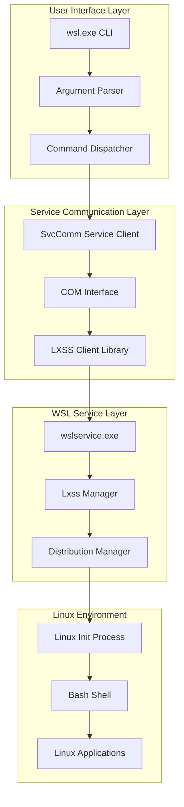
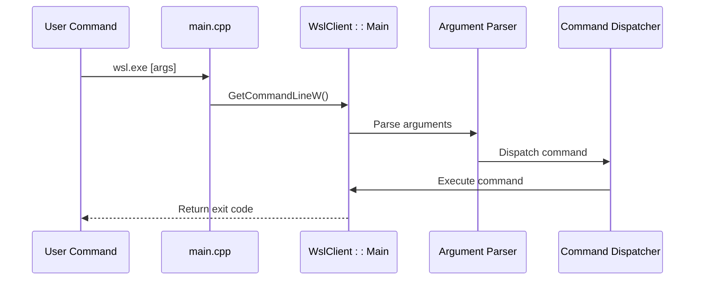
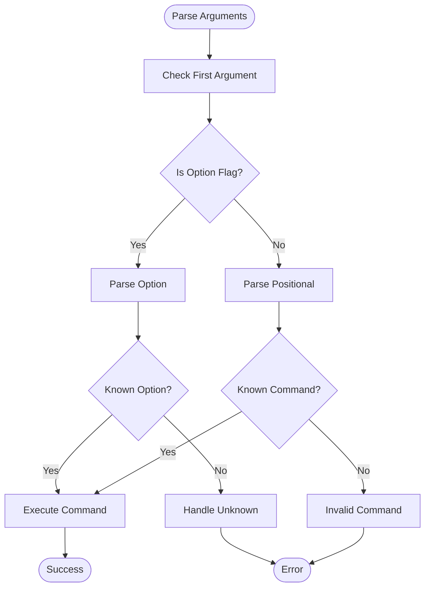
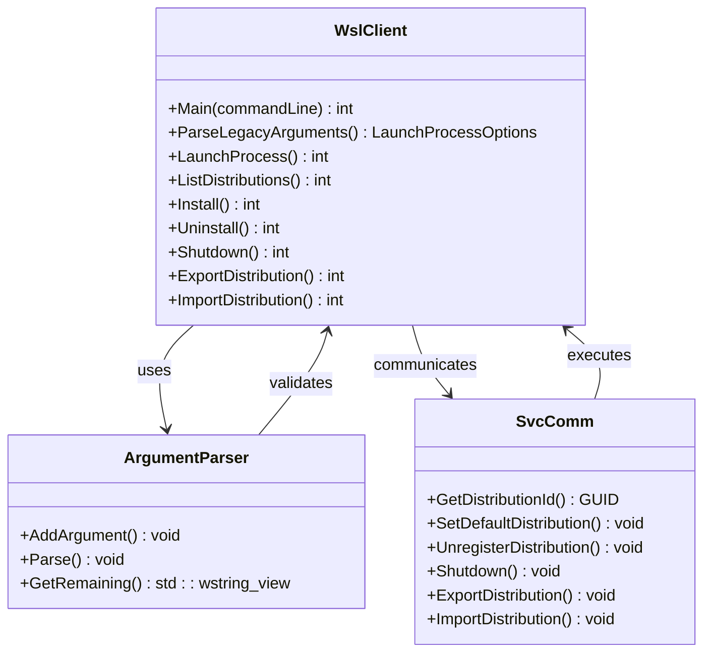
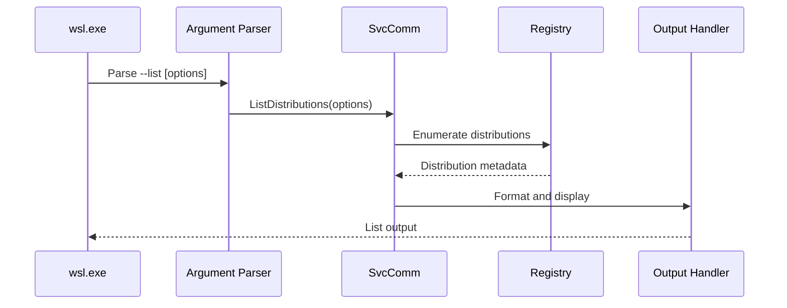
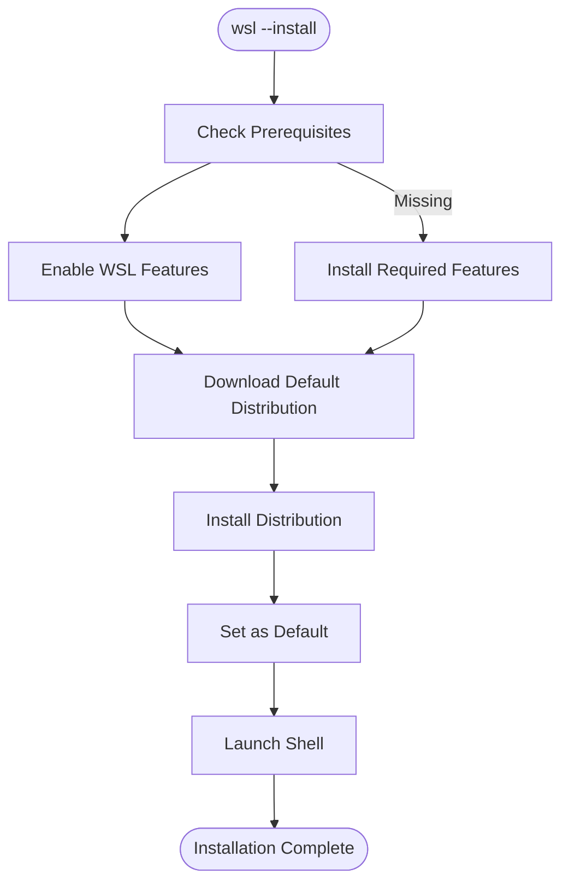
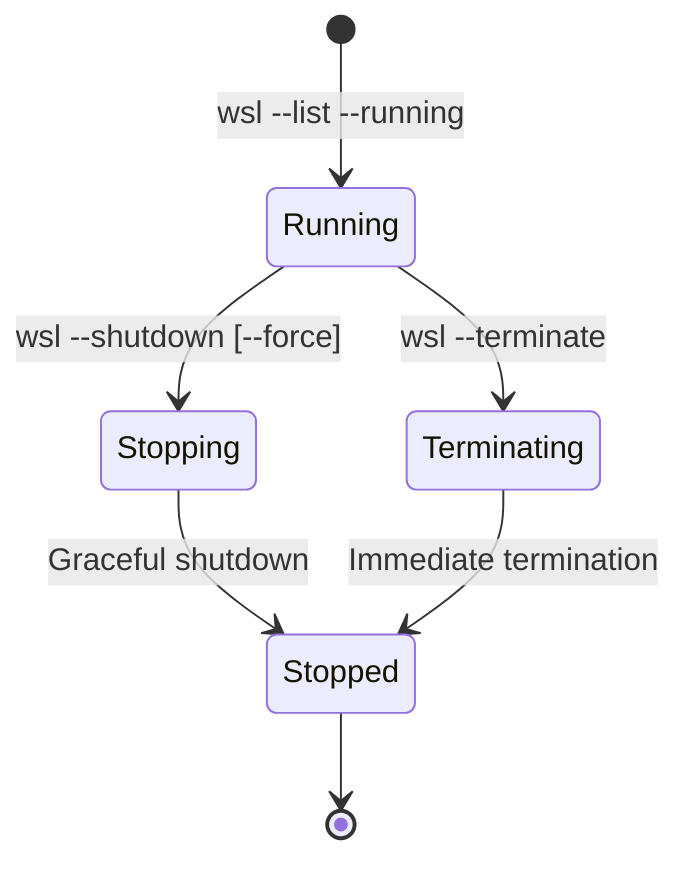
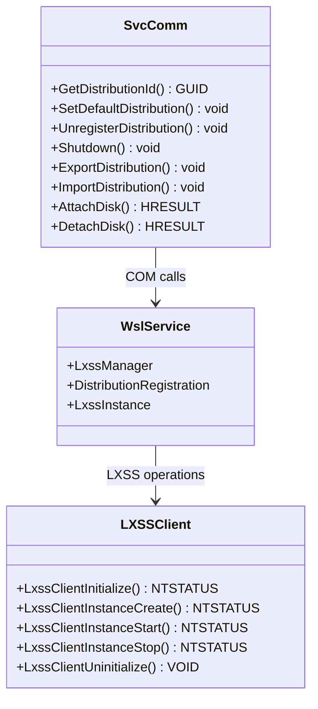
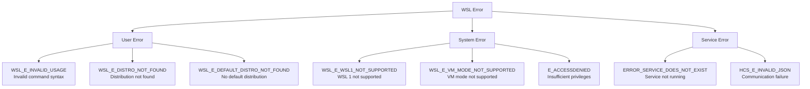

# Command-Line Interface

<cite>
**Referenced Files in This Document**
- [main.cpp](file://src/windows/wsl/main.cpp)
- [WslClient.cpp](file://src/windows/common/WslClient.cpp)
- [wsl.h](file://src/windows/inc/wsl.h)
- [SvcComm.cpp](file://src/windows/common/SvcComm.cpp)
- [lxssclient.h](file://src/windows/inc/lxssclient.h)
- [Distribution.cpp](file://src/windows/common/Distribution.cpp)
- [wslutil.cpp](file://src/windows/common/wslutil.cpp)
- [LxssInstance.cpp](file://src/windows/service/exe/LxssInstance.cpp)
- [ServiceMain.cpp](file://src/windows/service/exe/ServiceMain.cpp)
- [wsl.exe.md](file://doc/docs/technical-documentation/wsl.exe.md)
</cite>

## Table of Contents
1. [Introduction](#introduction)
2. [Architecture Overview](#architecture-overview)
3. [Entry Point and Initialization](#entry-point-and-initialization)
4. [Command Line Argument Parsing](#command-line-argument-parsing)
5. [Command Dispatching System](#command-dispatching-system)
6. [Core Commands Implementation](#core-commands-implementation)
7. [Service Communication Layer](#service-communication-layer)
8. [Error Handling and Exit Codes](#error-handling-and-exit-codes)
9. [Distribution Management](#distribution-management)
10. [Troubleshooting Guide](#troubleshooting-guide)
11. [Advanced Usage Patterns](#advanced-usage-patterns)
12. [Conclusion](#conclusion)

## Introduction

The Windows Subsystem for Linux (WSL) command-line interface (`wsl.exe`) serves as the primary entry point for interacting with WSL functionality. This comprehensive system handles command parsing, dispatches operations to the WSL service, manages distribution lifecycle, and provides robust error handling with detailed diagnostic output.

The CLI architecture follows a layered approach where `wsl.exe` acts as the client interface, communicating with the WSL service (`wslservice.exe`) through COM (Component Object Model) for all WSL operations. This design ensures proper isolation between the user interface and the core WSL functionality while maintaining security and stability.

## Architecture Overview

The WSL command-line interface implements a sophisticated architecture that separates concerns between user interaction, command processing, and service communication:



**Diagram sources**
- [main.cpp](file://src/windows/wsl/main.cpp#L17-L20)
- [WslClient.cpp](file://src/windows/common/WslClient.cpp#L1-L50)
- [SvcComm.cpp](file://src/windows/common/SvcComm.cpp#L1-L50)

**Section sources**
- [main.cpp](file://src/windows/wsl/main.cpp#L1-L21)
- [wsl.exe.md](file://doc/docs/technical-documentation/wsl.exe.md#L1-L9)

## Entry Point and Initialization

The WSL command-line interface begins execution through a minimal entry point that delegates to the main WSL client implementation:



**Diagram sources**
- [main.cpp](file://src/windows/wsl/main.cpp#L17-L20)
- [WslClient.cpp](file://src/windows/common/WslClient.cpp#L154-L200)

The entry point implementation maintains simplicity by relying on the centralized WSL client logic, ensuring consistent behavior across different invocation contexts including MSIX packaging scenarios.

**Section sources**
- [main.cpp](file://src/windows/wsl/main.cpp#L17-L20)

## Command Line Argument Parsing

The WSL CLI implements a comprehensive argument parsing system that supports both short and long-form options, positional parameters, and complex command combinations:

### Argument Categories

The CLI organizes commands into several functional categories:

| Category | Commands | Purpose |
|----------|----------|---------|
| **Distribution Management** | `--list`, `--install`, `--uninstall`, `--export`, `--import` | Create, configure, and manage Linux distributions |
| **Instance Control** | `--shutdown`, `--terminate`, `--status` | Control running WSL instances |
| **Configuration** | `--set-default`, `--set-version`, `--set-default-version` | Configure WSL defaults and behavior |
| **File Operations** | `--mount`, `--unmount`, `--manage` | Manage disk mounts and storage |
| **Utility Functions** | `--help`, `--version`, `--update` | Provide information and maintenance |

### Parsing Logic Flow



**Diagram sources**
- [WslClient.cpp](file://src/windows/common/WslClient.cpp#L1396-L1769)

**Section sources**
- [wsl.h](file://src/windows/inc/wsl.h#L1-L119)
- [WslClient.cpp](file://src/windows/common/WslClient.cpp#L1396-L1769)

## Command Dispatching System

The command dispatching system provides a centralized mechanism for routing CLI commands to their respective handlers:

### Dispatch Architecture



**Diagram sources**
- [WslClient.cpp](file://src/windows/common/WslClient.cpp#L154-L200)
- [SvcComm.cpp](file://src/windows/common/SvcComm.cpp#L1-L100)

### Command Execution Pipeline

Each command follows a standardized execution pipeline that ensures consistent error handling and progress reporting:

1. **Validation Phase**: Arguments are validated and parsed
2. **Service Communication**: Commands are dispatched to the WSL service
3. **Progress Reporting**: Long-running operations provide feedback
4. **Result Processing**: Success or failure is determined
5. **Cleanup**: Resources are released and temporary files cleaned

**Section sources**
- [WslClient.cpp](file://src/windows/common/WslClient.cpp#L1082-L1769)

## Core Commands Implementation

### Distribution Listing (`--list`)

The `--list` command provides comprehensive information about installed WSL distributions:



**Diagram sources**
- [WslClient.cpp](file://src/windows/common/WslClient.cpp#L130-L131)

**Command Options:**
- `--all`: Show all distributions (including disabled)
- `--running`: Show only running distributions
- `--quiet`: Minimal output format
- `--verbose`: Detailed information
- `--online`: Show available online distributions

### Installation (`--install`)

The installation command automates the setup of WSL with intelligent defaults:



**Diagram sources**
- [Distribution.cpp](file://src/windows/common/Distribution.cpp#L1-L100)

**Installation Options:**
- `--distribution`: Specify distribution name
- `--location`: Custom installation location
- `--no-launch`: Skip launching after installation
- `--legacy`: Use WSL 1 instead of WSL 2
- `--web-download`: Force web download

### Version Management (`--set-version`, `--set-default-version`)

These commands control WSL version preferences and defaults:

| Command | Purpose | Example |
|---------|---------|---------|
| `--set-version` | Set specific distribution to WSL version | `wsl --set-version Ubuntu 2` |
| `--set-default-version` | Set global default WSL version | `wsl --set-default-version 2` |
| `--set-default` | Set default distribution | `wsl --set-default Ubuntu` |

### Shutdown and Termination (`--shutdown`, `--terminate`)

Control over WSL instance lifecycle:



**Diagram sources**
- [WslClient.cpp](file://src/windows/common/WslClient.cpp#L1116-L1128)

**Section sources**
- [WslClient.cpp](file://src/windows/common/WslClient.cpp#L1082-L1128)
- [Distribution.cpp](file://src/windows/common/Distribution.cpp#L1-L200)

## Service Communication Layer

The service communication layer establishes secure, reliable communication between the CLI and the WSL service:

### COM Interface Architecture



**Diagram sources**
- [SvcComm.cpp](file://src/windows/common/SvcComm.cpp#L1-L200)
- [lxssclient.h](file://src/windows/inc/lxssclient.h#L1-L52)

### Communication Protocols

The CLI uses multiple communication mechanisms depending on the operation:

1. **COM Interface**: Primary method for most WSL operations
2. **LXSS Client Library**: Low-level Linux subsystem communication
3. **Named Pipes**: Inter-process communication for I/O redirection
4. **Registry Access**: Configuration and state management

**Section sources**
- [SvcComm.cpp](file://src/windows/common/SvcComm.cpp#L1-L200)
- [lxssclient.h](file://src/windows/inc/lxssclient.h#L1-L52)

## Error Handling and Exit Codes

The WSL CLI implements comprehensive error handling with detailed diagnostic information:

### Error Classification System



**Diagram sources**
- [wslutil.cpp](file://src/windows/common/wslutil.cpp#L43-L167)

### Exit Code Standards

| Exit Code Range | Category | Description |
|----------------|----------|-------------|
| 0 | Success | Command executed successfully |
| 1-125 | User Error | Invalid usage or user-related failures |
| 126-128 | System Error | System-level failures |
| 129-255 | Signal | Process terminated by signal |

### Diagnostic Output

The CLI provides structured diagnostic information including:

- **Error Messages**: Human-readable descriptions of problems
- **Error Codes**: Machine-readable error identifiers
- **Context Information**: Additional details about the failure
- **Resolution Guidance**: Suggestions for fixing issues

**Section sources**
- [wslutil.cpp](file://src/windows/common/wslutil.cpp#L43-L842)
- [WslClient.cpp](file://src/windows/common/WslClient.cpp#L1904-L1963)

## Distribution Management

### Distribution Lifecycle

WSL distributions follow a comprehensive lifecycle managed through the CLI:

```mermaid
stateDiagram-v2
[*] --> Registered : wsl --import
Registered --> Configured : Initial setup
Configured --> Running : wsl [command]
Running --> Configured : Process exit
Configured --> Exported : wsl --export
Exported --> Registered : wsl --import
Configured --> Unregistered : wsl --unregister
Unregistered --> [*]
note right of Configured
Distribution ready for use
Can be started with wsl
end note
note right of Running
Active Linux process
Can run commands and apps
end note
```



### Storage Management

The CLI provides sophisticated storage management capabilities:

| Operation | Command | Purpose |
|-----------|---------|---------|
| **Mount** | `wsl --mount` | Attach external disks or partitions |
| **Unmount** | `wsl --unmount` | Detach mounted storage |
| **Resize** | `wsl --manage --resize` | Modify disk size |
| **Convert** | `wsl --manage --set-sparse` | Optimize storage format |

**Section sources**
- [Distribution.cpp](file://src/windows/common/Distribution.cpp#L1-L200)
- [WslClient.cpp](file://src/windows/common/WslClient.cpp#L1243-L1251)

## Troubleshooting Guide

### Common Issues and Solutions

#### Installation Problems

**Problem**: `wsl --install` fails with feature requirements
- **Cause**: Windows features not enabled
- **Solution**: Run `dism.exe /online /enable-feature /featurename:Microsoft-Windows-Subsystem-Linux /all /norestart`
- **Prevention**: Use `wsl --install --web-download` for automated feature installation

**Problem**: Download failures during installation
- **Cause**: Network connectivity or firewall restrictions
- **Solution**: Use `wsl --install --legacy` or manual distribution installation
- **Alternative**: Download distribution manually and use `wsl --import`

#### Distribution Management Issues

**Problem**: Distribution not found errors
- **Cause**: Distribution unregistered or corrupted
- **Solution**: Use `wsl --list --all` to verify existence, reinstall if necessary
- **Prevention**: Regular backup of exported distributions

**Problem**: Permission denied during operations
- **Cause**: Insufficient privileges or security restrictions
- **Solution**: Run as administrator or adjust security policies
- **Alternative**: Use `--user` option to specify user context

#### Service Communication Problems

**Problem**: Service unavailable errors
- **Cause**: WSL service not running or crashed
- **Solution**: Restart WSL service or reboot system
- **Prevention**: Monitor service health and restart automatically

**Problem**: Communication timeouts
- **Cause**: System overload or network issues
- **Solution**: Retry operation or increase timeout values
- **Alternative**: Use offline operations when possible

### Diagnostic Commands

| Command | Purpose | Usage |
|---------|---------|-------|
| `wsl --status` | Check service status | Quick health check |
| `wsl --list --verbose` | Detailed distribution info | Troubleshoot configuration |
| `wsl --shutdown --force` | Force service restart | Recovery operation |
| `wsl --uninstall --purge` | Complete cleanup | Fresh installation |

**Section sources**
- [wslutil.cpp](file://src/windows/common/wslutil.cpp#L43-L842)

## Advanced Usage Patterns

### Scripting and Automation

The WSL CLI supports extensive scripting capabilities for automation:

```bash
# Batch distribution operations
for distro in $(wsl --list --quiet); do
    echo "Checking $distro..."
    wsl -d "$distro" -- uname -a
done

# Automated backup and restore
wsl --export Ubuntu ubuntu-backup.tar
# Later...
wsl --import UbuntuNew ./UbuntuNew ubuntu-backup.tar
```

### Integration Patterns

#### PowerShell Integration
```powershell
# Get all running distributions
$running = wsl --list --running --quiet

# Start monitoring
while ($true) {
    foreach ($distro in $running) {
        Write-Host "Monitoring $distro..." -ForegroundColor Green
        # Perform monitoring tasks
    }
    Start-Sleep -Seconds 60
}
```

#### CI/CD Pipeline Integration
```yaml
# Azure DevOps pipeline example
steps:
- script: wsl --install --no-launch
  displayName: 'Install WSL'
  
- script: wsl -d Ubuntu -- apt-get update
  displayName: 'Update package lists'
  
- script: wsl -d Ubuntu -- apt-get install -y build-essential
  displayName: 'Install dependencies'
```

### Performance Optimization

#### Memory and CPU Management
```bash
# Configure WSL resources
echo '[wsl2]' > ~/.wslconfig
echo 'memory=4GB' >> ~/.wslconfig
echo 'processors=2' >> ~/.wslconfig
```

#### Network Optimization
```bash
# Configure network settings for better performance
wsl --shutdown
# Edit /etc/wsl.conf to optimize network settings
```

**Section sources**
- [WslClient.cpp](file://src/windows/common/WslClient.cpp#L154-L200)

## Conclusion

The WSL command-line interface represents a sophisticated and well-engineered system that provides comprehensive access to Linux subsystem functionality from Windows. Through its layered architecture, robust error handling, and extensive command coverage, it enables both casual users and power users to effectively manage and utilize WSL environments.

The CLI's design emphasizes reliability, security, and usability while maintaining the flexibility needed for advanced scenarios. Its integration with the WSL service layer ensures consistent behavior across different Windows versions and configurations.

Key strengths of the implementation include:

- **Comprehensive Command Coverage**: Supports all major WSL operations from basic shell access to advanced distribution management
- **Robust Error Handling**: Provides detailed diagnostic information and recovery guidance
- **Secure Architecture**: Proper isolation between user interface and system services
- **Extensible Design**: Modular structure allows for easy addition of new commands and features
- **Cross-Platform Compatibility**: Consistent behavior across different Windows environments

Future enhancements could include expanded scripting capabilities, improved integration with Windows development tools, and enhanced automation features for enterprise deployments.