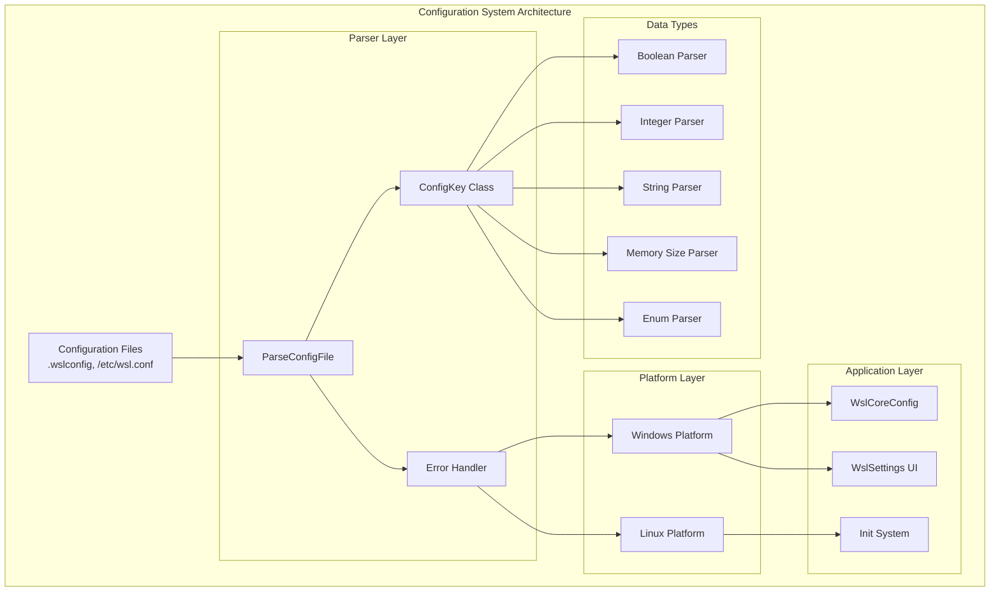
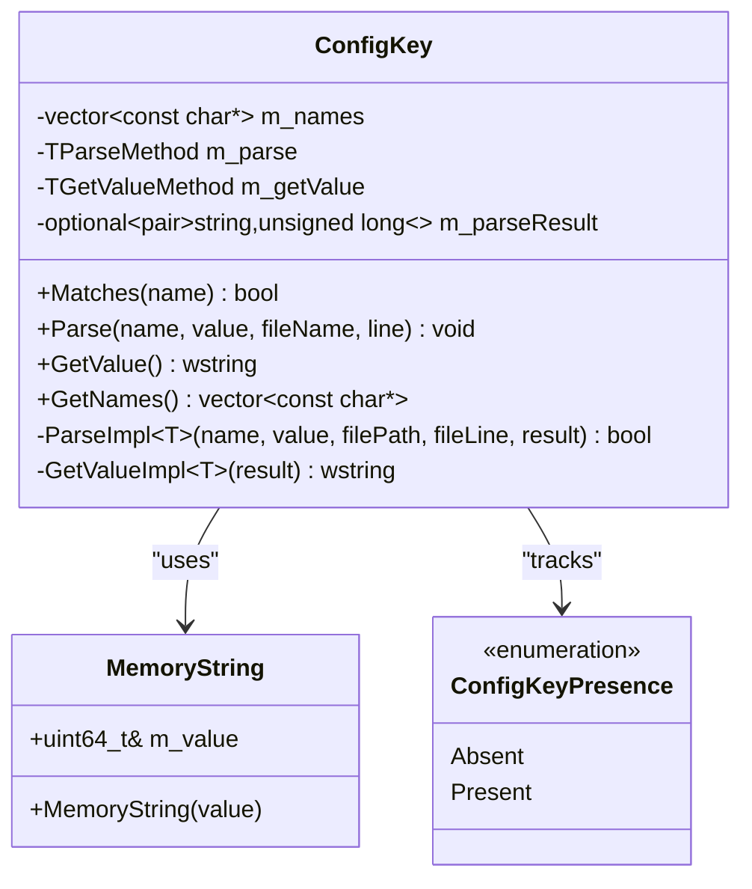
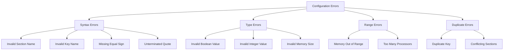

# Configuration Files

<cite>
**Referenced Files in This Document**
- [configfile.cpp](file://src/shared/configfile/configfile.cpp)
- [configfile.h](file://src/shared/configfile/configfile.h)
- [WslCoreConfig.cpp](file://src/windows/common/WslCoreConfig.cpp)
- [WslCoreConfigInterface.cpp](file://src/windows/libwsl/WslCoreConfigInterface.cpp)
- [MemAndProcViewModel.cs](file://src/windows/wslsettings/ViewModels/Settings/MemAndProcViewModel.cs)
- [IWslConfigService.cs](file://src/windows/wslsettings/Contracts\Services\IWslConfigService.cs)
- [UnitTests.cpp](file://test/windows\UnitTests.cpp)
- [config.cpp](file://src/linux/init/config.cpp)
</cite>

## Table of Contents
1. [Introduction](#introduction)
2. [Architecture Overview](#architecture-overview)
3. [Core Components](#core-components)
4. [Configuration File Structure](#configuration-file-structure)
5. [Data Type Parsing](#data-type-parsing)
6. [Error Handling and Validation](#error-handling-and-validation)
7. [Practical Examples](#practical-examples)
8. [Best Practices](#best-practices)
9. [Troubleshooting Guide](#troubleshooting-guide)
10. [Conclusion](#conclusion)

## Introduction

The WSL configuration system provides a robust framework for parsing `.gitconfig`-style configuration files across both Linux and Windows components. This system enables flexible configuration management for WSL distributions, virtual machines, and various runtime settings. The configuration files support key-value pairs organized into sections, with comprehensive error handling and validation mechanisms.

The configuration system is built around the `configfile` module, which provides cross-platform parsing capabilities for configuration files such as `/etc/wsl.conf` and `.wslconfig`. These files control WSL behavior including memory allocation, processor settings, networking configurations, and experimental features.

## Architecture Overview

The WSL configuration system follows a modular architecture with clear separation between parsing logic, data type handling, and platform-specific implementations.



**Diagram sources**
- [configfile.cpp](file://src/shared/configfile/configfile.cpp#L230-L864)
- [configfile.h](file://src/shared/configfile/configfile.h#L40-L224)

**Section sources**
- [configfile.cpp](file://src/shared/configfile/configfile.cpp#L1-L50)
- [configfile.h](file://src/shared/configfile/configfile.h#L1-L30)

## Core Components

### ConfigKey Class

The `ConfigKey` class serves as the fundamental building block for configuration parsing, providing type-safe parsing and validation mechanisms.



**Diagram sources**
- [configfile.h](file://src/shared/configfile/configfile.h#L40-L207)

### ParseConfigFile Function

The main parsing function handles the complete configuration file processing pipeline, including section parsing, key-value extraction, and error reporting.

```mermaid
flowchart TD
Start([ParseConfigFile Entry]) --> CheckFile{"File Exists?"}
CheckFile --> |No| SetDefaults[Set Default Values]
CheckFile --> |Yes| ParseLoop[Parse Loop]
ParseLoop --> ReadChar[Read Character]
ReadChar --> CheckChar{Character Type}
CheckChar --> |'#'| ParseComment[Parse Comment]
CheckChar --> |'['| ParseSection[Parse Section]
CheckChar --> |Letter| ParseKey[Parse Key]
CheckChar --> |EOF| Complete[Complete Parsing]
ParseSection --> ValidateSection{Valid Section?}
ValidateSection --> |No| EmitWarning[Emit Warning]
ValidateSection --> |Yes| SetSection[Set Current Section]
ParseKey --> ValidateKey{Valid Key?}
ValidateKey --> |No| EmitWarning
ValidateKey --> |Yes| ParseValue[Parse Value]
ParseValue --> ValidateValue{Valid Value?}
ValidateValue --> |No| EmitWarning
ValidateValue --> |Yes| StoreConfig[Store Configuration]
ParseComment --> ContinueLoop[Continue Loop]
StoreConfig --> ContinueLoop
EmitWarning --> CheckFlags{Skip Invalid Lines?}
CheckFlags --> |Yes| ContinueLoop
CheckFlags --> |No| Error[Return Error]
SetDefaults --> Complete
Complete --> End([Return Success])
Error --> End
```

**Diagram sources**
- [configfile.cpp](file://src/shared/configfile/configfile.cpp#L237-L864)

**Section sources**
- [configfile.cpp](file://src/shared/configfile/configfile.cpp#L230-L250)
- [configfile.h](file://src/shared/configfile/configfile.h#L40-L120)

## Configuration File Structure

WSL configuration files follow a `.gitconfig`-style format with support for sections, key-value pairs, comments, and line continuations.

### Basic Syntax

| Element | Syntax | Description | Example |
|---------|--------|-------------|---------|
| Section | `[section_name]` | Groups related configuration keys | `[wsl2]` |
| Key-Value Pair | `key = value` | Configuration setting | `memory = 4GB` |
| Comments | `# comment` | Single-line comments | `# Memory limit` |
| Line Continuation | `\` | Escapes newline for continuation | `path = C:\folder\` |
| Quoted Values | `"value"` | Preserves spaces and special chars | `"C:\Program Files"` |

### Supported Sections

| Section | Purpose | Common Keys |
|---------|---------|-------------|
| `[wsl2]` | WSL 2 core settings | `memory`, `processors`, `swap` |
| `[network]` | Networking configuration | `hostname`, `generateHosts` |
| `[interop]` | Windows/Linux integration | `enabled`, `appendWindowsPath` |
| `[automount]` | File system mounting | `root`, `options` |
| `[boot]` | Boot-time settings | `command`, `timed` |
| `[experimental]` | Experimental features | Various experimental settings |

**Section sources**
- [configfile.cpp](file://src/shared/configfile/configfile.cpp#L8-L28)

## Data Type Parsing

The configuration system supports multiple data types with automatic conversion and validation.

### Boolean Values

Boolean parsing accepts various case-insensitive values:

| Accepted Values | Result | Notes |
|----------------|--------|-------|
| `true`, `yes`, `on`, `1` | `true` | Positive values |
| `false`, `no`, `off`, `0` | `false` | Negative values |
| Invalid values | Error | Triggers warning |

### Integer Values

Integer parsing supports decimal, hexadecimal, and octal formats:

| Format | Example | Value |
|--------|---------|-------|
| Decimal | `4` | 4 |
| Hexadecimal | `0x10` | 16 |
| Octal | `0644` | 420 |

### Memory Size Values

Memory size parsing supports human-readable formats:

| Format | Example | Bytes |
|--------|---------|-------|
| Bytes | `1024` | 1024 |
| Kilobytes | `2KB`, `2k` | 2048 |
| Megabytes | `100MB`, `100m` | 104857600 |
| Gigabytes | `4GB`, `4g` | 4294967296 |

### String and Path Values

String and path values are parsed with quote handling and escape sequence support:

| Escape Sequence | Result | Description |
|----------------|--------|-------------|
| `\\` | `\` | Backslash |
| `\"` | `"` | Double quote |
| `\n` | Newline | Line break |
| `\t` | Tab | Horizontal tab |
| `\b` | Backspace | Backspace character |

**Section sources**
- [configfile.cpp](file://src/shared/configfile/configfile.cpp#L62-L136)
- [configfile.cpp](file://src/shared/configfile/configfile.cpp#L75-L99)

## Error Handling and Validation

The configuration system implements comprehensive error handling with user-friendly warning messages.

### Error Categories



### Error Reporting Mechanisms

| Error Type | Warning Message Format | Example |
|------------|----------------------|---------|
| Invalid Boolean | `Invalid boolean value '{value}' for key '{key}'` | `Invalid boolean value 'maybe' for key 'wsl2.guiApplications'` |
| Invalid Integer | `Invalid integer value '{value}' for key '{key}'` | `Invalid integer value 'abc' for key 'wsl2.processors'` |
| Invalid Memory | `Invalid memory string '{value}' for {context}` | `Invalid memory string 'invalid' for .wslconfig entry 'wsl2.memory'` |
| Unknown Key | `Unknown key '{section}.{key}'` | `Unknown key 'wsl2.invalidKey'` |
| Duplicate Key | `Duplicated config key '{key}'` | `Duplicated config key 'wsl2.memory'` |

### Error Handling Flags

| Flag | Constant | Behavior |
|------|----------|----------|
| Skip Invalid Lines | `CFG_SKIP_INVALID_LINES` | Continue parsing despite syntax errors |
| Skip Unknown Values | `CFG_SKIP_UNKNOWN_VALUES` | Ignore unrecognized configuration keys |
| Debug Mode | `CFG_DEBUG` | Enable verbose debugging output |

**Section sources**
- [configfile.cpp](file://src/shared/configfile/configfile.cpp#L62-L99)
- [configfile.cpp](file://src/shared/configfile/configfile.cpp#L210-L215)
- [UnitTests.cpp](file://test/windows\UnitTests.cpp#L1955-L2073)

## Practical Examples

### WSL 2 Memory and Processor Configuration

```ini
[wsl2]
# Memory allocation in gigabytes
memory=4GB

# Number of virtual processors
processors=4

# Swap file size
swap=2GB

# Virtual hard disk size
defaultVhdSize=64GB
```

### Networking Configuration

```ini
[network]
# Hostname for the WSL distribution
hostname=wsl-machine

# Generate /etc/hosts entries automatically
generateHosts=true

# Enable IPv6 support
ipv6=true
```

### Interoperability Settings

```ini
[interop]
# Enable Windows/Linux integration
enabled=true

# Append Windows PATH to Linux PATH
appendWindowsPath=true

# Mount Windows drives automatically
mountFsTab=true
```

### Experimental Features

```ini
[experimental]
# Enable DNS tunneling
dnsTunneling=true

# Set ignored ports
ignoredPorts=22,80,443

# Enable sparse VHD
sparseVhd=true

# Host address loopback
hostAddressLoopback=false
```

**Section sources**
- [WslCoreConfig.cpp](file://src/windows/common/WslCoreConfig.cpp#L71-L127)
- [UnitTests.cpp](file://test/windows\UnitTests.cpp#L3461-L3489)

## Best Practices

### Configuration File Organization

1. **Use Descriptive Sections**: Group related settings under meaningful section names
2. **Maintain Consistent Formatting**: Use consistent indentation and spacing
3. **Add Comments**: Document complex or non-obvious configuration choices
4. **Order by Importance**: Place frequently modified settings near the top

### Value Validation

1. **Range Checking**: Validate numeric values against reasonable bounds
2. **Type Safety**: Use appropriate data types for each setting
3. **Default Values**: Provide sensible defaults for optional settings
4. **Cross-Validation**: Ensure related settings are compatible

### Error Handling

1. **Graceful Degradation**: Use `CFG_SKIP_INVALID_LINES` for production environments
2. **User Feedback**: Provide clear error messages for configuration issues
3. **Backup Configuration**: Maintain working configuration backups
4. **Testing**: Validate configuration changes in development environments first

### Security Considerations

1. **File Permissions**: Restrict configuration file access appropriately
2. **Path Validation**: Sanitize file paths to prevent injection attacks
3. **Resource Limits**: Set reasonable limits for memory and CPU usage
4. **Network Security**: Configure network settings securely

**Section sources**
- [WslCoreConfig.cpp](file://src/windows/common/WslCoreConfig.cpp#L145-L147)
- [MemAndProcViewModel.cs](file://src/windows/wslsettings/ViewModels/Settings/MemAndProcViewModel.cs#L1-L73)

## Troubleshooting Guide

### Common Configuration Issues

#### Invalid Memory Size
**Problem**: Configuration fails to parse memory settings
**Solution**: Use valid memory size formats (e.g., `4GB`, `2048MB`)
**Example**: `memory=invalid` → `memory=4GB`

#### Processor Count Exceeded
**Problem**: Requested processor count exceeds system capabilities
**Solution**: Reduce processor count to match available cores
**Example**: `processors=16` on 8-core system → `processors=8`

#### Unknown Configuration Keys
**Problem**: Using unsupported configuration options
**Solution**: Check documentation for supported keys
**Example**: `wsl2.nonexistent=true` → Remove unsupported key

#### Duplicate Configuration Entries
**Problem**: Same configuration key appears multiple times
**Solution**: Remove duplicate entries or use the last occurrence
**Example**: Multiple `memory=` lines → Keep the last one

### Debugging Configuration Problems

1. **Enable Debug Mode**: Use `CFG_DEBUG` flag for detailed parsing information
2. **Check File Encoding**: Ensure configuration files use UTF-8 encoding
3. **Validate Syntax**: Use a text editor with syntax highlighting
4. **Test Incrementally**: Add settings one at a time to isolate issues

### Recovery Procedures

1. **Reset to Defaults**: Remove problematic configuration files
2. **Restore Backup**: Use known-good configuration backup
3. **Minimal Configuration**: Start with essential settings only
4. **Incremental Addition**: Gradually add complex settings back

**Section sources**
- [configfile.cpp](file://src/shared/configfile/configfile.cpp#L804-L825)
- [UnitTests.cpp](file://test/windows\UnitTests.cpp#L2025-L2073)

## Conclusion

The WSL configuration system provides a powerful and flexible framework for managing WSL behavior through configuration files. Its cross-platform design, comprehensive error handling, and support for multiple data types make it suitable for both simple and complex configuration scenarios.

Key strengths of the system include:

- **Cross-Platform Compatibility**: Unified parsing logic for Windows and Linux
- **Type Safety**: Automatic conversion and validation of configuration values
- **Extensible Design**: Easy addition of new configuration options
- **Robust Error Handling**: Comprehensive error detection and user-friendly warnings
- **Flexible Syntax**: Support for various value formats and commenting styles

The configuration system continues to evolve with new features and improvements, maintaining backward compatibility while adding support for emerging WSL capabilities. Understanding its architecture and best practices ensures optimal configuration management for WSL deployments.