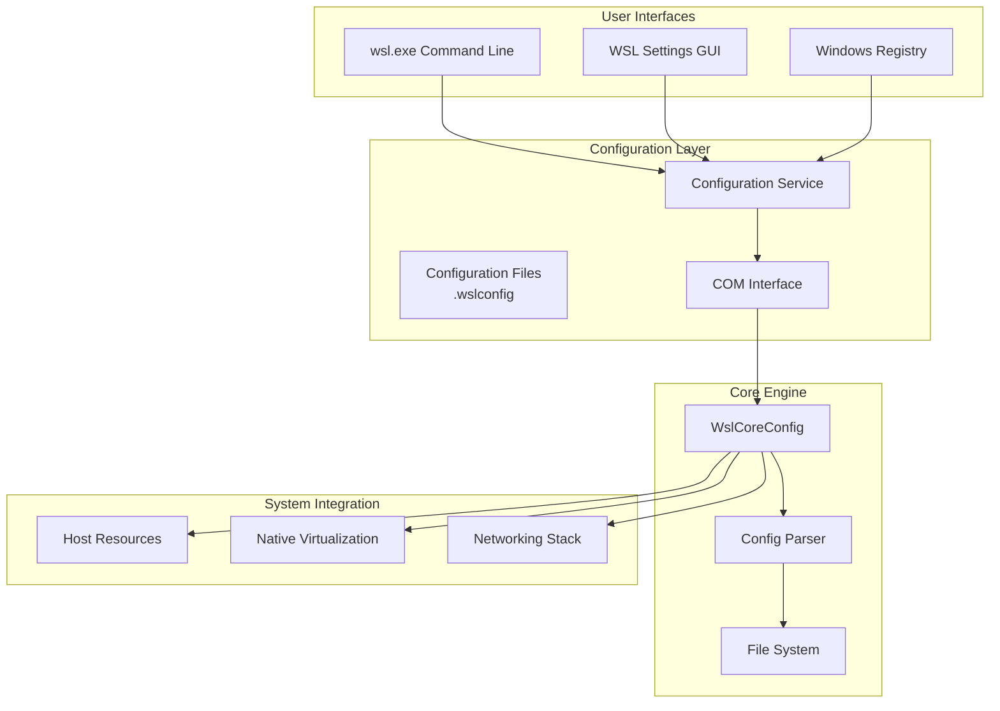
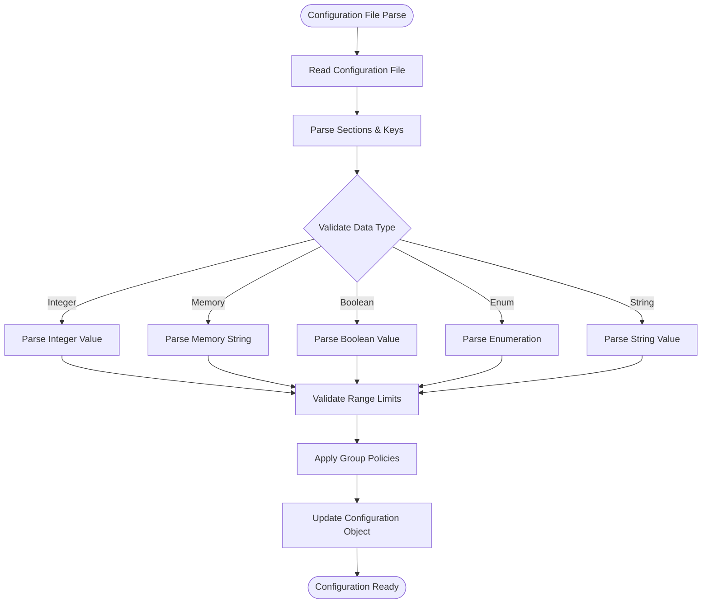
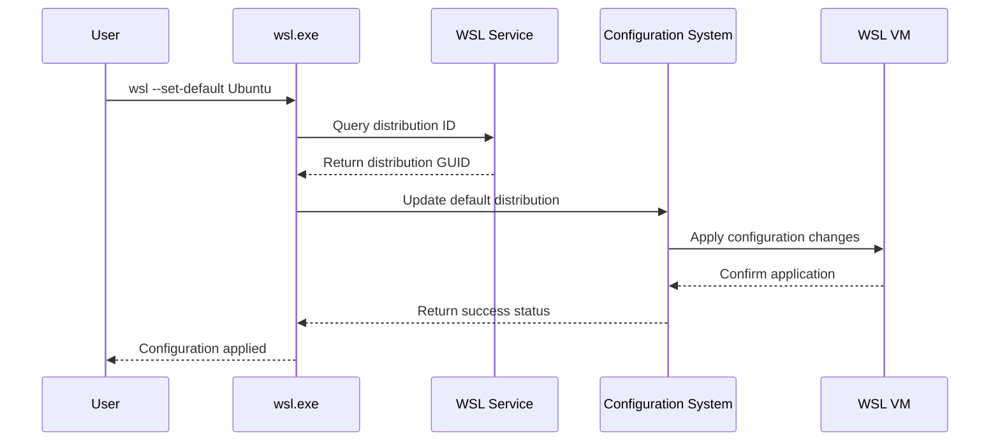
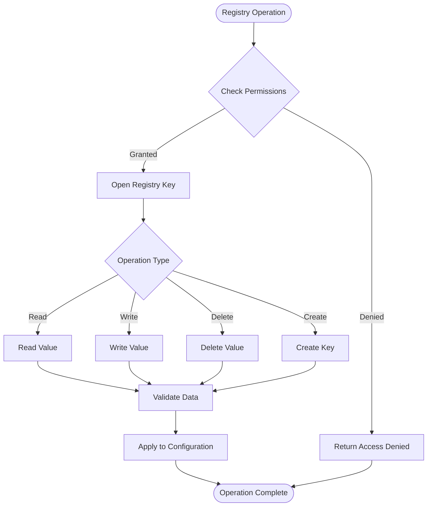
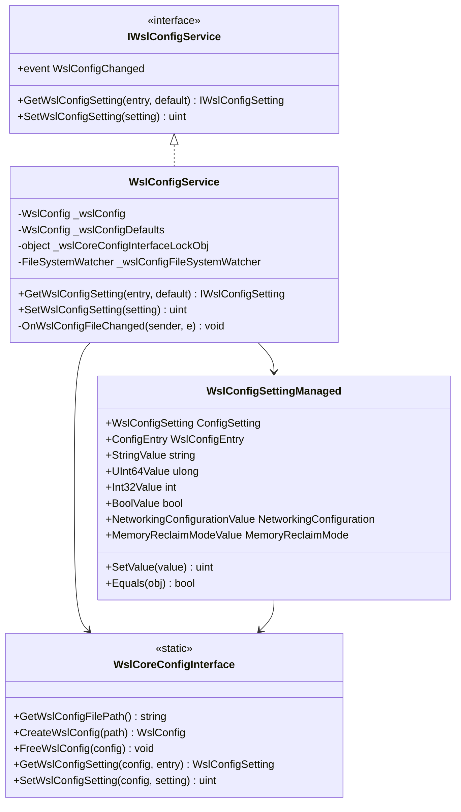
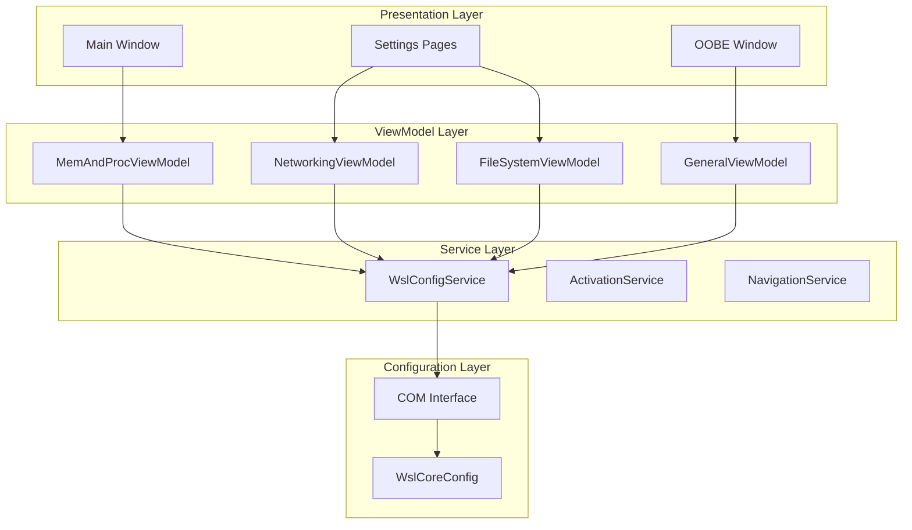
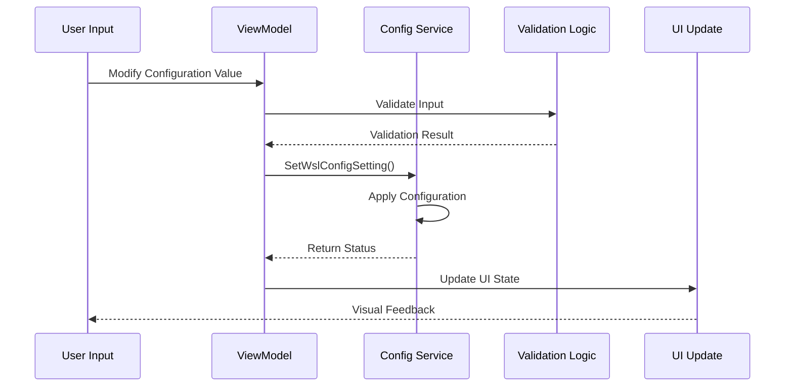
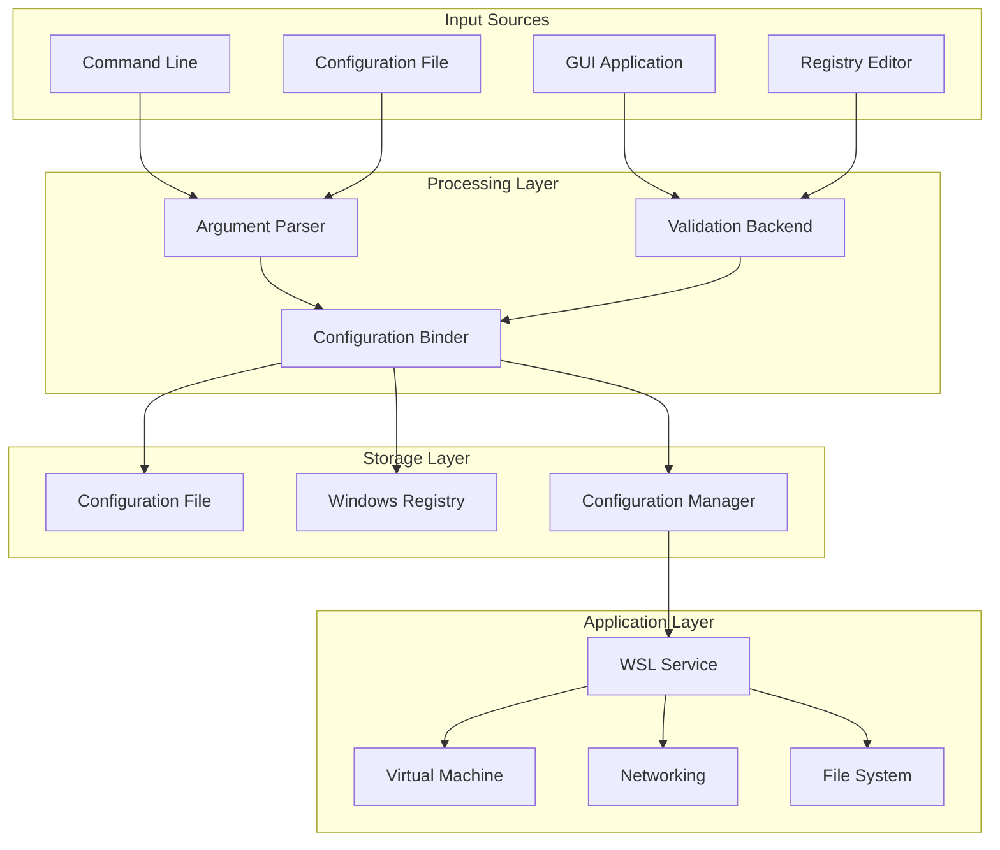
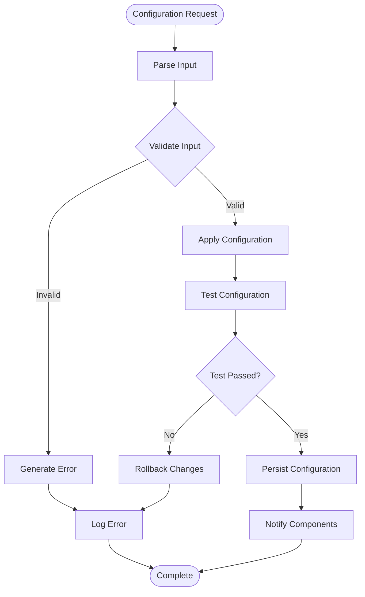

# Configuration and Management

<cite>
**Referenced Files in This Document**
- [App.xaml.cs](file://src/windows/wslsettings/App.xaml.cs)
- [WslConfigService.cs](file://src/windows/wslsettings/Services/WslConfigService.cs)
- [LibWsl.cs](file://src/windows/wslsettings/LibWsl.cs)
- [WslCoreConfigInterface.cpp](file://src/windows/libwsl/WslCoreConfigInterface.cpp)
- [WslCoreConfigInterface.h](file://src/windows/inc/WslCoreConfigInterface.h)
- [WslCoreConfig.cpp](file://src/windows/common/WslCoreConfig.cpp)
- [configfile.cpp](file://src/shared/configfile/configfile.cpp)
- [IWslConfigService.cs](file://src/windows/wslsettings\Contracts\Services\IWslConfigService.cs)
- [MemAndProcViewModel.cs](file://src/windows/wslsettings\ViewModels\Settings\MemAndProcViewModel.cs)
- [main.cpp](file://src/windows\wsl\main.cpp)
- [wsl.h](file://src/windows\inc\wsl.h)
- [wslconfig.h](file://src/windows\inc\wslconfig.h)
- [registry.cpp](file://src/windows\common\registry.cpp)
- [helpers.hpp](file://src/windows\common\helpers.hpp)
</cite>

## Table of Contents
1. [Introduction](#introduction)
2. [Configuration System Architecture](#configuration-system-architecture)
3. [WSL Configuration Files](#wsl-configuration-files)
4. [Command-Line Interface](#command-line-interface)
5. [Windows Registry Integration](#windows-registry-integration)
6. [Configuration Service Implementation](#configuration-service-implementation)
7. [GUI Bridge Layer](#gui-bridge-layer)
8. [Configuration Data Flow](#configuration-data-flow)
9. [Practical Examples](#practical-examples)
10. [Troubleshooting and Best Practices](#troubleshooting-and-best-practices)

## Introduction

The Windows Subsystem for Linux (WSL) configuration and management system provides a comprehensive framework for controlling WSL behavior through multiple interfaces. This system encompasses configuration files (.wslconfig), command-line tools (wsl.exe), graphical user interfaces (WSL Settings), and Windows registry integration. The architecture follows a layered approach where user inputs are processed through various interfaces and ultimately translated into system-level configurations.

The configuration system supports both declarative settings (via configuration files) and programmatic control (via APIs), enabling administrators and users to customize WSL behavior according to their specific requirements. From basic memory allocation to advanced networking configurations, the system provides fine-grained control over WSL virtual machines and distributions.

## Configuration System Architecture

The WSL configuration system employs a multi-layered architecture that separates concerns between user interfaces, configuration parsing, and system application. This design enables consistent behavior across different interaction methods while maintaining flexibility for various use cases.



**Diagram sources**
- [WslCoreConfigInterface.cpp](file://src/windows/libwsl/WslCoreConfigInterface.cpp#L31-L79)
- [WslCoreConfig.cpp](file://src/windows/common/WslCoreConfig.cpp#L25-L30)
- [WslConfigService.cs](file://src/windows/wslsettings/Services/WslConfigService.cs#L8-L30)

The architecture consists of four primary layers:

**User Interface Layer**: Provides multiple ways for users to interact with WSL configuration, including command-line tools, graphical interfaces, and registry modifications.

**Configuration Layer**: Handles the translation between user inputs and internal configuration structures, managing both persistent storage and runtime state.

**Core Engine**: Implements the fundamental configuration parsing and validation logic, ensuring consistency and correctness across all configuration operations.

**System Integration**: Bridges the configuration system with Windows subsystems, applying settings to virtual machines, networking, and resource allocation.

**Section sources**
- [WslCoreConfigInterface.cpp](file://src/windows/libwsl/WslCoreConfigInterface.cpp#L31-L79)
- [WslCoreConfig.cpp](file://src/windows/common/WslCoreConfig.cpp#L25-L30)

## WSL Configuration Files

WSL uses a hierarchical configuration system where settings can be applied globally, per-distribution, or through command-line arguments. The primary configuration file is `.wslconfig`, located in the user's profile directory.

### Configuration File Structure

The `.wslconfig` file follows a property-based format similar to Git configuration files, with sections and key-value pairs:

```ini
# Global WSL configuration settings
[wsl2]
processors = 4
memory = 8GB
swap = 2GB
swapFile = C:\\Users\\username\\swapfile.vhdx
vhdSize = 64GB
localhostForwarding = true
nestedVirtualization = true
guiApplications = true

[networking]
mode = nat
firewall = true
dnsProxy = true
dnsTunneling = true

[experimental]
autoMemoryReclaim = gradual
sparseVHD = true
ignoredPorts = 80,443,8080
```

### Configuration Entries

The system supports numerous configuration entries organized into functional categories:

| Category | Configuration Entry | Type | Description |
|----------|-------------------|------|-------------|
| **Resource Management** | `processors` | Integer | Number of CPU cores allocated to WSL |
| | `memory` | Memory String | RAM allocation for WSL virtual machine |
| | `swap` | Memory String | Swap space size |
| | `swapFile` | String | Custom swap file location |
| | `vhdSize` | Memory String | Default VHD size for new distributions |
| **Networking** | `localhostForwarding` | Boolean | Enable localhost forwarding |
| | `firewall` | Boolean | Enable Hyper-V firewall integration |
| | `dnsProxy` | Boolean | Enable DNS proxy service |
| | `dnsTunneling` | Boolean | Enable DNS tunneling |
| **Advanced Features** | `nestedVirtualization` | Boolean | Enable nested virtualization |
| | `guiApplications` | Boolean | Enable GUI application support |
| | `autoMemoryReclaim` | Enum | Memory reclaim strategy |
| | `sparseVHD` | Boolean | Use sparse VHD format |

### Configuration Parsing Logic

The configuration parsing system handles various data types and validation scenarios:



**Diagram sources**
- [configfile.cpp](file://src/shared/configfile/configfile.cpp#L60-L106)
- [WslCoreConfig.cpp](file://src/windows/common/WslCoreConfig.cpp#L31-L127)

**Section sources**
- [configfile.cpp](file://src/shared/configfile/configfile.cpp#L1-L800)
- [WslCoreConfig.cpp](file://src/windows/common/WslCoreConfig.cpp#L31-L127)

## Command-Line Interface

The WSL command-line interface provides powerful tools for managing distributions, configuring WSL, and controlling virtual machines. The primary executable, `wsl.exe`, serves as the main entry point for all WSL operations.

### Core Commands

The `wsl.exe` command supports numerous operations for distribution management and system configuration:

| Command Category | Command | Purpose |
|-----------------|---------|---------|
| **Distribution Management** | `--list` | List all installed distributions |
| | `--install` | Install a new WSL distribution |
| | `--unregister` | Unregister a distribution |
| | `--export` | Export a distribution to a tar file |
| | `--import` | Import a distribution from a tar file |
| **Runtime Control** | `--set-default` | Set default distribution |
| | `--terminate` | Terminate a running distribution |
| | `--shutdown` | Shut down all WSL instances |
| **Configuration** | `--set-version` | Change distribution version |
| | `--update` | Update WSL system components |

### Advanced Configuration Commands

The system provides specialized commands for advanced configuration scenarios:



**Diagram sources**
- [main.cpp](file://src/windows\wsl\main.cpp#L17-L20)
- [wsl.h](file://src/windows\inc\wsl.h#L17-L119)

### Command-Line Argument Processing

The argument parsing system handles complex command-line scenarios with support for positional arguments, flags, and subcommands:

**Section sources**
- [main.cpp](file://src/windows\wsl\main.cpp#L17-L20)
- [wsl.h](file://src/windows\inc\wsl.h#L17-L119)
- [wslconfig.h](file://src/windows\inc\wslconfig.h#L17-L26)

## Windows Registry Integration

WSL integrates deeply with the Windows registry to persist configuration settings and manage system-level policies. The registry structure provides a centralized location for both user preferences and administrative controls.

### Registry Structure

The WSL registry keys are organized under the Windows Subsystem for Linux (LXSS) hive:

```
HKEY_LOCAL_MACHINE\SOFTWARE\Microsoft\Windows\CurrentVersion\Lxss
├── {Distribution-GUID-1}
│   ├── BasePath
│   ├── Flags
│   ├── Version
│   └── ...
├── {Distribution-GUID-2}
│   ├── BasePath
│   ├── Flags
│   ├── Version
│   └── ...
└── DefaultDistribution
```

### Configuration Storage Patterns

The registry stores various types of configuration data using appropriate data types:

| Registry Type | Usage | Example |
|--------------|-------|---------|
| **REG_SZ** | String values | Distribution paths, names |
| **REG_DWORD** | Numeric values | Processor counts, timeouts |
| **REG_QWORD** | Large numeric values | Memory sizes, timestamps |
| **REG_MULTI_SZ** | String arrays | Ignored ports, kernel modules |

### Registry Operations

The system performs various registry operations to manage WSL state:



**Diagram sources**
- [registry.cpp](file://src/windows\common\registry.cpp#L95-L462)

**Section sources**
- [registry.cpp](file://src/windows\common\registry.cpp#L95-L462)

## Configuration Service Implementation

The configuration service provides a unified interface for accessing and modifying WSL configuration settings. Built on top of the core configuration engine, it offers both programmatic access and automatic synchronization capabilities.

### Service Architecture

The configuration service implements a layered approach with clear separation of concerns:



**Diagram sources**
- [IWslConfigService.cs](file://src/windows/wslsettings\Contracts\Services\IWslConfigService.cs#L5-L24)
- [WslConfigService.cs](file://src/windows/wslsettings\Services\WslConfigService.cs#L8-L205)
- [LibWsl.cs](file://src/windows/wslsettings\LibWsl.cs#L16-L400)

### Configuration Entry Types

The service supports multiple configuration entry types, each mapped to appropriate data structures:

| Entry Type | Managed Type | Data Representation |
|------------|-------------|-------------------|
| **ProcessorCount** | `Int32Value` | Integer processor count |
| **MemorySizeBytes** | `UInt64Value` | Unsigned 64-bit memory size |
| **SwapSizeBytes** | `UInt64Value` | Unsigned 64-bit swap size |
| **SwapFilePath** | `StringValue` | String path to swap file |
| **VhdSizeBytes** | `UInt64Value` | Unsigned 64-bit VHD size |
| **Networking** | `NetworkingConfigurationValue` | Enumeration for networking modes |
| **FirewallEnabled** | `BoolValue` | Boolean firewall state |
| **IgnoredPorts** | `StringValue` | Comma-separated port list |
| **AutoMemoryReclaim** | `MemoryReclaimModeValue` | Enumeration for memory reclaim modes |

### Thread Safety and Synchronization

The configuration service implements robust thread safety mechanisms to handle concurrent access:

**Section sources**
- [WslConfigService.cs](file://src/windows/wslsettings\Services\WslConfigService.cs#L8-L205)
- [IWslConfigService.cs](file://src/windows/wslsettings\Contracts\Services\IWslConfigService.cs#L5-L24)
- [LibWsl.cs](file://src/windows/wslsettings\LibWsl.cs#L16-L400)

## GUI Bridge Layer

The WSL Settings application provides a modern Windows UI for configuration management, built on the Windows App SDK (WinUI 3) framework. This layer translates user interface interactions into configuration service calls.

### Application Architecture

The GUI application follows the MVVM (Model-View-ViewModel) pattern with clear separation between presentation and business logic:



**Diagram sources**
- [App.xaml.cs](file://src/windows/wslsettings\App.xaml.cs#L47-L106)
- [MemAndProcViewModel.cs](file://src/windows/wslsettings\ViewModels\Settings\MemAndProcViewModel.cs#L10-L170)

### Configuration Binding and Validation

The GUI layer implements sophisticated data binding and validation mechanisms:



**Diagram sources**
- [MemAndProcViewModel.cs](file://src/windows/wslsettings\ViewModels\Settings\MemAndProcViewModel.cs#L45-L170)

### Real-Time Configuration Monitoring

The GUI application monitors configuration changes and updates the interface accordingly:

**Section sources**
- [App.xaml.cs](file://src/windows/wslsettings\App.xaml.cs#L47-L106)
- [MemAndProcViewModel.cs](file://src/windows/wslsettings\ViewModels\Settings\MemAndProcViewModel.cs#L10-L170)

## Configuration Data Flow

Understanding the complete data flow through the configuration system helps in troubleshooting and optimizing WSL performance. The flow involves multiple stages from user input to system application.

### Complete Data Flow Architecture



**Diagram sources**
- [WslCoreConfigInterface.cpp](file://src/windows/libwsl/WslCoreConfigInterface.cpp#L68-L276)
- [WslCoreConfig.cpp](file://src/windows/common/WslCoreConfig.cpp#L289-L531)

### Configuration Resolution Order

WSL follows a specific precedence order when resolving configuration values:

1. **Command-line arguments** (highest priority)
2. **Distribution-specific settings**
3. **Global .wslconfig settings**
4. **Default values** (lowest priority)

### Error Handling and Recovery

The configuration system implements comprehensive error handling and recovery mechanisms:



**Diagram sources**
- [WslCoreConfig.cpp](file://src/windows/common/WslCoreConfig.cpp#L289-L531)

**Section sources**
- [WslCoreConfigInterface.cpp](file://src/windows/libwsl/WslCoreConfigInterface.cpp#L68-L276)
- [WslCoreConfig.cpp](file://src/windows/common/WslCoreConfig.cpp#L289-L531)

## Practical Examples

This section demonstrates common configuration scenarios and their implementation approaches.

### Basic Memory and Processor Configuration

Setting up optimal resource allocation for development environments:

```powershell
# Set memory to 8GB and processors to 4
wsl --set-default-memory 8GB
wsl --set-default-processor-count 4

# Alternative: Edit .wslconfig file
# [wsl2]
# processors = 4
# memory = 8GB
```

### Networking Configuration

Configuring advanced networking features for development scenarios:

```powershell
# Enable localhost forwarding and custom DNS proxy
wsl --set-config networking.mode nat
wsl --set-config networking.firewall true
wsl --set-config networking.dnsProxy true
wsl --set-config networking.dnsTunneling true
```

### GUI Application Support

Enabling graphical applications in WSL:

```powershell
# Enable GUI applications
wsl --set-config guiApplications true

# Configure X11 forwarding
wsl --set-config networking.localhostForwarding true
```

### Advanced Memory Management

Setting up automatic memory reclaim strategies:

```powershell
# Configure gradual memory reclaim
wsl --set-config experimental.autoMemoryReclaim gradual

# Set up ignored ports for specific applications
wsl --set-config experimental.ignoredPorts "80,443,8080,3000"
```

### Distribution-Specific Configuration

Creating optimized configurations for different use cases:

```ini
# Development environment configuration
[wsl2]
processors = 6
memory = 12GB
swap = 4GB
localhostForwarding = true
nestedVirtualization = true
guiApplications = true

[networking]
mode = nat
firewall = true
dnsProxy = true

[experimental]
autoMemoryReclaim = gradual
ignoredPorts = 80,443,8080,3000,5000,8000
```

**Section sources**
- [MemAndProcViewModel.cs](file://src/windows/wslsettings\ViewModels\Settings\MemAndProcViewModel.cs#L45-L170)

## Troubleshooting and Best Practices

### Common Configuration Issues

**Memory Allocation Conflicts**
- Symptoms: WSL fails to start or crashes during startup
- Solution: Ensure sufficient physical memory is available
- Prevention: Monitor system memory usage and allocate resources conservatively

**Networking Port Conflicts**
- Symptoms: Applications fail to bind to specific ports
- Solution: Configure ignored ports in the WSL configuration
- Prevention: Use port ranges that don't conflict with system services

**Registry Permission Issues**
- Symptoms: Configuration changes don't persist
- Solution: Run WSL commands with appropriate permissions
- Prevention: Use administrator privileges for system-wide changes

### Performance Optimization Guidelines

**Resource Allocation Best Practices**
- Allocate memory based on actual workload requirements
- Use swap sparingly; optimize application memory usage instead
- Limit processor allocation to prevent system overload

**Networking Optimization**
- Enable localhost forwarding only when needed
- Use appropriate firewall settings for security
- Configure DNS proxy for improved resolution performance

**Storage Configuration**
- Use SSD storage for WSL distributions
- Enable sparse VHD format for efficient storage
- Regular maintenance of swap files and temporary data

### Security Considerations

**Network Security**
- Enable firewall integration for production environments
- Use bridged networking cautiously in secure networks
- Monitor ignored ports for potential security risks

**File System Access**
- Restrict host file system access when not needed
- Use appropriate mount options for security
- Regular audit of mounted file systems

**Section sources**
- [WslCoreConfig.cpp](file://src/windows/common/WslCoreConfig.cpp#L447-L493)
- [registry.cpp](file://src/windows\common\registry.cpp#L95-L462)