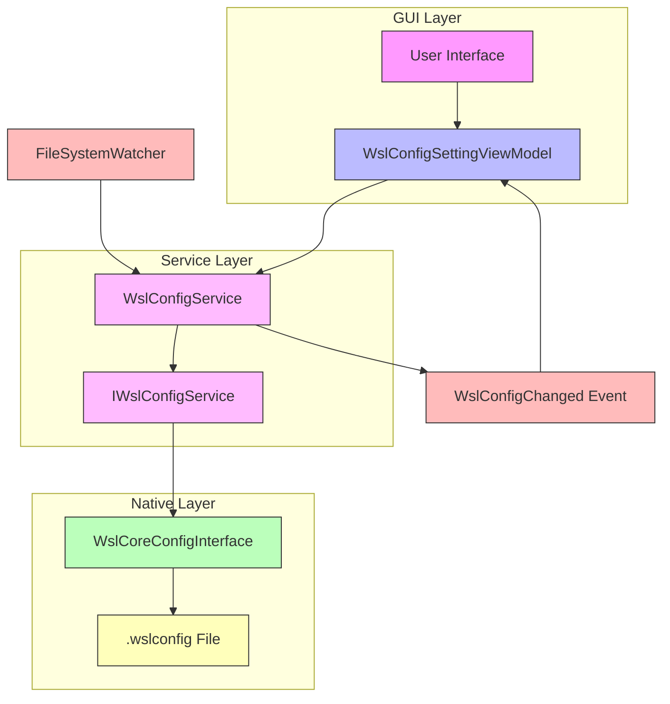
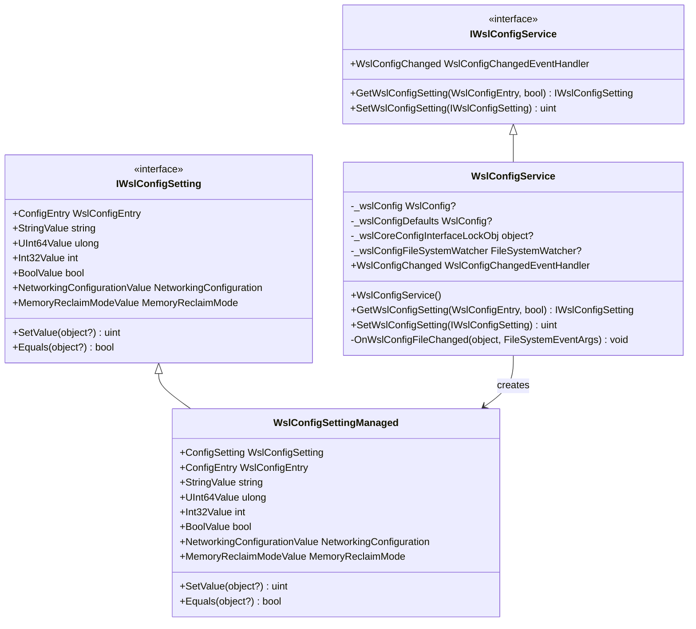
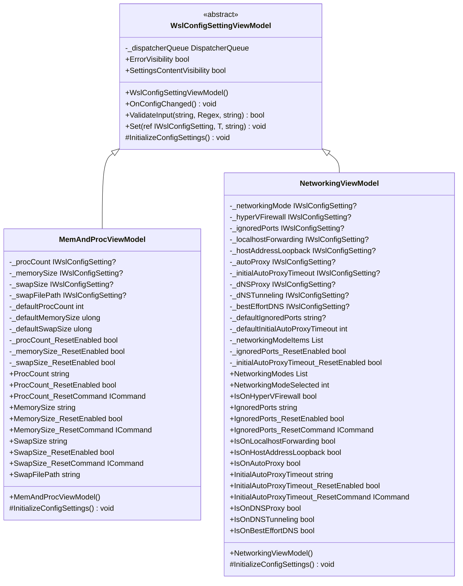
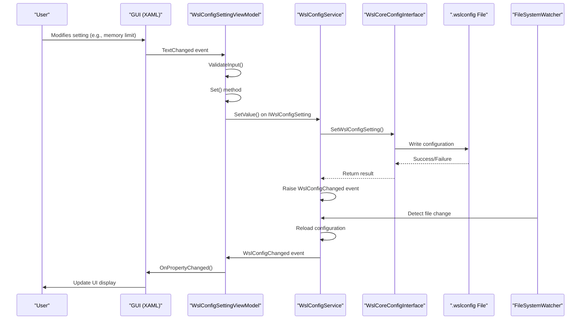
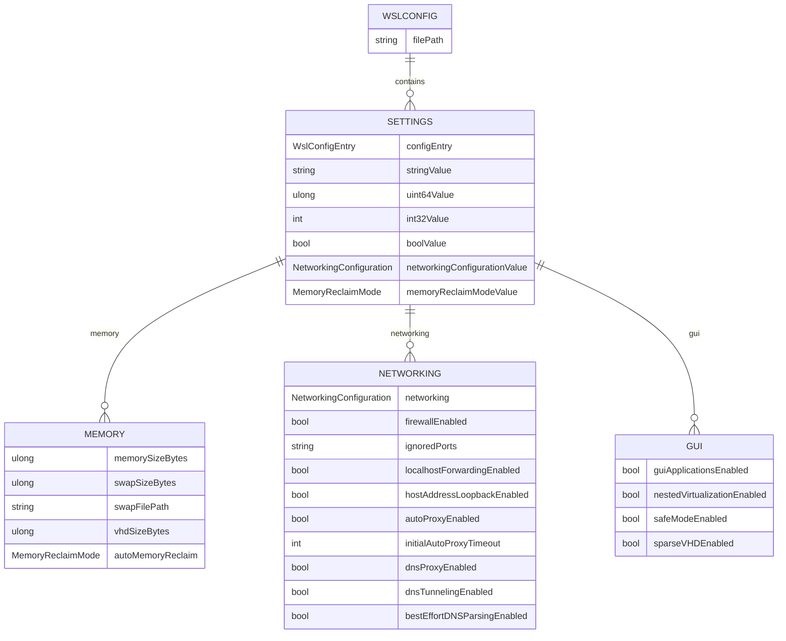
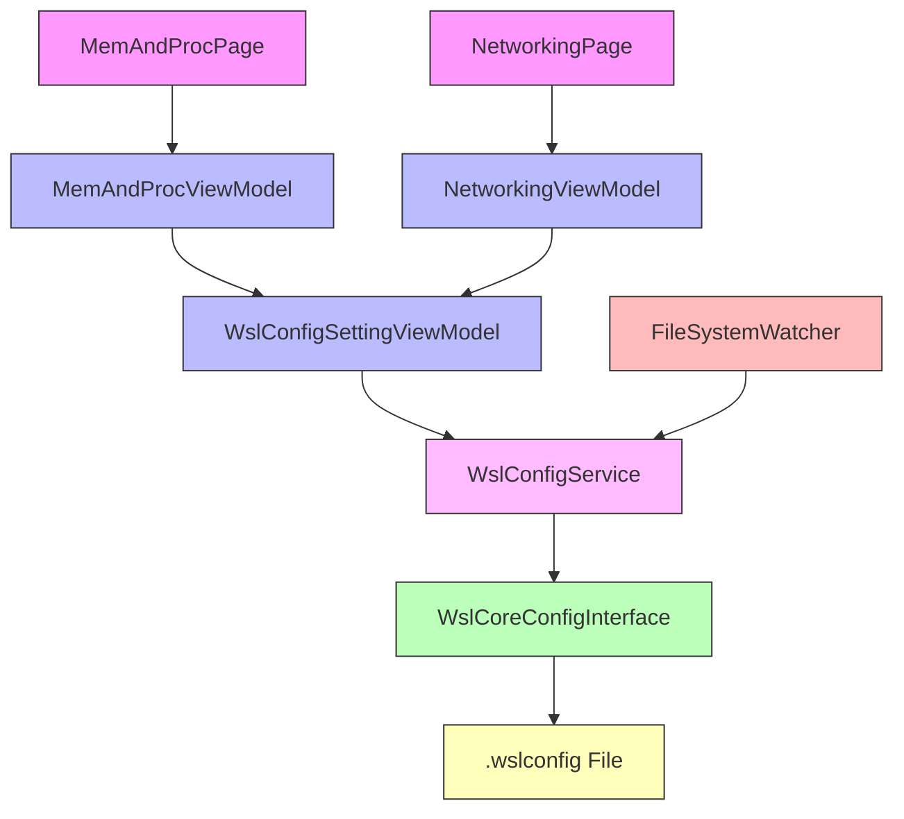

# GUI Configuration

<cite>
**Referenced Files in This Document**   
- [IWslConfigService.cs](file://src/windows/wslsettings/Contracts/Services/IWslConfigService.cs)
- [WslConfigService.cs](file://src/windows/wslsettings/Services/WslConfigService.cs)
- [WslConfigSettingViewModel.cs](file://src/windows/wslsettings/ViewModels/Settings/WslConfigSettingViewModel.cs)
- [MemAndProcViewModel.cs](file://src/windows/wslsettings/ViewModels/Settings/MemAndProcViewModel.cs)
- [NetworkingViewModel.cs](file://src/windows/wslsettings/ViewModels/Settings/NetworkingViewModel.cs)
- [MemAndProcPage.xaml.cs](file://src/windows/wslsettings/Views/Settings/MemAndProcPage.xaml.cs)
- [NetworkingPage.xaml.cs](file://src/windows/wslsettings/Views/Settings/NetworkingPage.xaml.cs)
- [WslCoreConfigInterface.h](file://src/windows/inc/WslCoreConfigInterface.h)
- [WslCoreConfigInterface.cpp](file://src/windows/libwsl/WslCoreConfigInterface.cpp)
- [Constants.cs](file://src/windows/wslsettings/Constants.cs)
- [GUIAppsViewModel.cs](file://src/windows/wslsettings/ViewModels/OOBE/GUIAppsViewModel.cs)
- [LibWsl.cs](file://src/windows/wslsettings/LibWsl.cs)
</cite>

## Table of Contents
1. [Introduction](#introduction)
2. [Architecture Overview](#architecture-overview)
3. [Core Components](#core-components)
4. [Detailed Component Analysis](#detailed-component-analysis)
5. [Dependency Analysis](#dependency-analysis)
6. [Performance Considerations](#performance-considerations)
7. [Troubleshooting Guide](#troubleshooting-guide)
8. [Conclusion](#conclusion)

## Introduction
The WSL GUI configuration system provides a user-friendly interface for managing WSL (Windows Subsystem for Linux) settings through the wslsettings application. This document explains the architecture and implementation of the configuration system, focusing on how user interface inputs are bridged with underlying WSL configuration through the IWslConfigService interface. The system uses the MVVM (Model-View-ViewModel) pattern to separate concerns and enable data binding between the UI and configuration logic. The service interacts with a file system watcher to detect changes to the .wslconfig file and propagate updates through events, ensuring the UI remains synchronized with the actual configuration state.

## Architecture Overview
The WSL GUI configuration system follows a layered architecture that separates the user interface from the underlying configuration management. At the core is the WslConfigService which implements the IWslConfigService interface, acting as a bridge between the GUI and the WSL configuration system. The service communicates with the native WSL Core Config Interface through P/Invoke calls, allowing managed code to interact with the underlying C++ implementation that reads and writes the .wslconfig file.

**Diagram sources**
- [WslConfigService.cs](file://src/windows/wslsettings/Services/WslConfigService.cs#L8-L93)
- [IWslConfigService.cs](file://src/windows/wslsettings/Contracts/Services/IWslConfigService.cs#L5-L24)
- [WslCoreConfigInterface.h](file://src/windows/inc/WslCoreConfigInterface.h#L15-L97)

## Core Components
The WSL GUI configuration system consists of several key components that work together to provide a seamless user experience. The IWslConfigService interface defines the contract for configuration operations, including retrieving and setting configuration values and subscribing to configuration change events. The WslConfigService class implements this interface, providing the concrete implementation that interacts with the underlying WSL configuration system. The WslConfigSettingViewModel serves as the base class for all configuration view models, implementing the MVVM pattern with property binding, change notification, and error handling. Specific view models like MemAndProcViewModel and NetworkingViewModel inherit from this base class to provide configuration for specific aspects of WSL.

**Section sources**
- [IWslConfigService.cs](file://src/windows/wslsettings/Contracts/Services/IWslConfigService.cs#L5-L24)
- [WslConfigService.cs](file://src/windows/wslsettings/Services/WslConfigService.cs#L8-L93)
- [WslConfigSettingViewModel.cs](file://src/windows/wslsettings/ViewModels/Settings/WslConfigSettingViewModel.cs#L11-L75)

## Detailed Component Analysis

### WslConfigService Analysis
The WslConfigService is the central component that bridges the GUI with the underlying WSL configuration system. It implements the IWslConfigService interface, providing methods to get and set configuration values and exposing a WslConfigChanged event that notifies subscribers when the configuration changes. The service uses a FileSystemWatcher to monitor the .wslconfig file for changes, automatically reloading the configuration when changes are detected and raising the WslConfigChanged event to notify all subscribers.

**Diagram sources**
- [WslConfigService.cs](file://src/windows/wslsettings/Services/WslConfigService.cs#L8-L93)
- [IWslConfigService.cs](file://src/windows/wslsettings/Contracts/Services/IWslConfigService.cs#L5-L24)

### WslConfigSettingViewModel Analysis
The WslConfigSettingViewModel implements the MVVM pattern for WSL configuration, providing property binding, change notification, and error handling. It serves as the base class for all configuration view models, handling common functionality such as subscribing to configuration changes and managing error states. The view model uses the CommunityToolkit.Mvvm library to implement the ObservableRecipient pattern, enabling automatic UI updates when properties change.

**Diagram sources**
- [WslConfigSettingViewModel.cs](file://src/windows/wslsettings/ViewModels/Settings/WslConfigSettingViewModel.cs#L11-L75)
- [MemAndProcViewModel.cs](file://src/windows/wslsettings/ViewModels/Settings/MemAndProcViewModel.cs#L10-L170)
- [NetworkingViewModel.cs](file://src/windows/wslsettings/ViewModels/Settings/NetworkingViewModel.cs#L12-L186)

### Configuration Flow Analysis
The configuration system follows a clear flow from user interaction to file system changes. When a user modifies a setting in the GUI, the change is processed through the MVVM pattern, with the view model validating input and updating the underlying configuration through the WslConfigService. The service then writes the changes to the .wslconfig file and raises the WslConfigChanged event, which propagates the update to all subscribed components.

**Diagram sources**
- [WslConfigService.cs](file://src/windows/wslsettings/Services/WslConfigService.cs#L49-L66)
- [WslConfigSettingViewModel.cs](file://src/windows/wslsettings/ViewModels/Settings/WslConfigSettingViewModel.cs#L43-L58)
- [WslCoreConfigInterface.cpp](file://src/windows/libwsl/WslCoreConfigInterface.cpp#L277-L304)

### Configuration Settings Analysis
The WSL configuration system supports a wide range of settings that control various aspects of WSL behavior. These settings are defined in the WslConfigEntry enum and include memory limits, processor count, networking configuration, and GUI application support. Each setting has a specific data type and validation requirements, ensuring that only valid values are written to the configuration file.

**Diagram sources**
- [WslCoreConfigInterface.h](file://src/windows/inc/WslCoreConfigInterface.h#L21-L50)
- [WslConfigService.cs](file://src/windows/wslsettings/Services/WslConfigService.cs#L40-L47)
- [MemAndProcViewModel.cs](file://src/windows/wslsettings/ViewModels/Settings/MemAndProcViewModel.cs#L34-L38)

## Dependency Analysis
The WSL GUI configuration system has a well-defined dependency structure that separates concerns and enables testability. The GUI components depend on the view models, which in turn depend on the WslConfigService. The service depends on the native WslCoreConfigInterface, which provides the low-level configuration operations. This layered dependency structure ensures that changes to one layer do not directly impact other layers, making the system more maintainable and testable.

**Diagram sources**
- [WslConfigService.cs](file://src/windows/wslsettings/Services/WslConfigService.cs#L8-L93)
- [WslConfigSettingViewModel.cs](file://src/windows/wslsettings/ViewModels/Settings/WslConfigSettingViewModel.cs#L11-L75)
- [MemAndProcPage.xaml.cs](file://src/windows/wslsettings/Views/Settings/MemAndProcPage.xaml.cs#L12-L100)
- [NetworkingPage.xaml.cs](file://src/windows/wslsettings/Views/Settings/NetworkingPage.xaml.cs#L11-L65)

## Performance Considerations
The WSL GUI configuration system is designed with performance in mind, particularly in how it handles configuration changes and UI updates. The use of a file system watcher to detect changes to the .wslconfig file ensures that the UI remains synchronized with the actual configuration state without requiring periodic polling. The service uses a lock object to ensure thread safety when accessing the underlying configuration, preventing race conditions when multiple components attempt to read or write configuration values simultaneously. The MVVM pattern enables efficient UI updates by only refreshing the specific properties that have changed, rather than rebuilding the entire UI.

**Section sources**
- [WslConfigService.cs](file://src/windows/wslsettings/Services/WslConfigService.cs#L10-L14)
- [WslConfigSettingViewModel.cs](file://src/windows/wslsettings/ViewModels/Settings/WslConfigSettingViewModel.cs#L13-L14)

## Troubleshooting Guide
When troubleshooting issues with the WSL GUI configuration system, it's important to understand the flow of configuration changes and the error handling mechanisms in place. If a configuration change fails to persist, check the return value of the SetWslConfigSetting method, which returns a Windows error code indicating the nature of the failure. The view models expose ErrorVisibility and SettingsContentVisibility properties that can be used to determine if an error occurred during a configuration update. When debugging configuration issues, verify that the .wslconfig file is being written to the correct location (typically %USERPROFILE%\.wslconfig) and that the file has the expected permissions.

**Section sources**
- [WslConfigService.cs](file://src/windows/wslsettings/Services/WslConfigService.cs#L50-L66)
- [WslConfigSettingViewModel.cs](file://src/windows/wslsettings/ViewModels/Settings/WslConfigSettingViewModel.cs#L50-L55)
- [Constants.cs](file://src/windows/wslsettings/Constants.cs#L10-L12)

## Conclusion
The WSL GUI configuration system provides a robust and user-friendly interface for managing WSL settings. By implementing the MVVM pattern and using a service-oriented architecture, the system effectively separates concerns and enables maintainable, testable code. The WslConfigService acts as a bridge between the GUI and the underlying WSL configuration system, providing a clean interface for getting and setting configuration values and notifying subscribers of changes. The use of a file system watcher ensures that the UI remains synchronized with the actual configuration state, even when changes are made outside the GUI. This architecture provides a solid foundation for extending the configuration interface with new settings and improving the user experience.