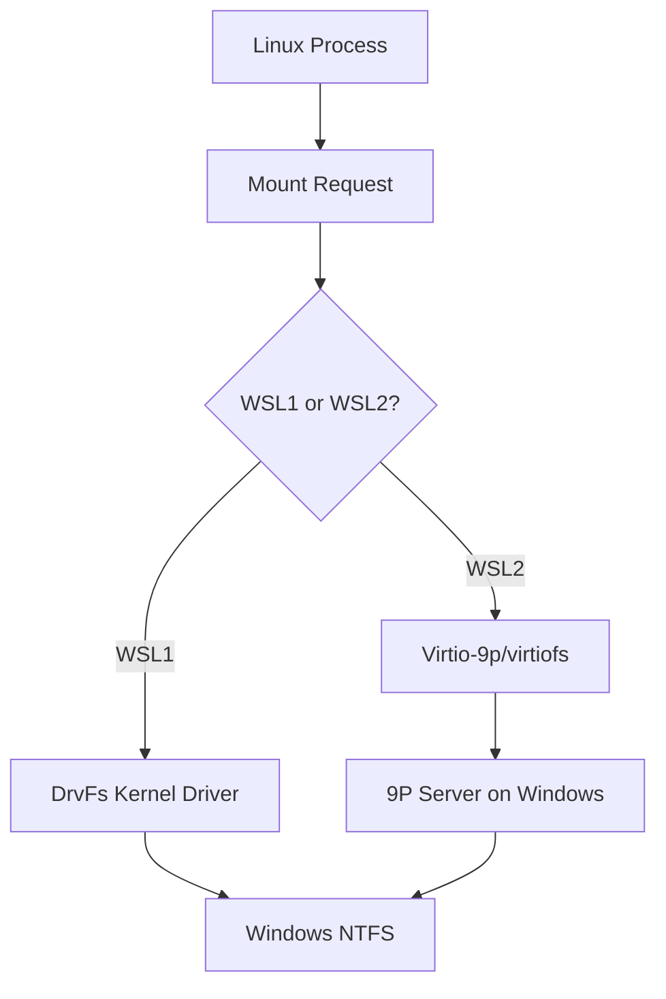
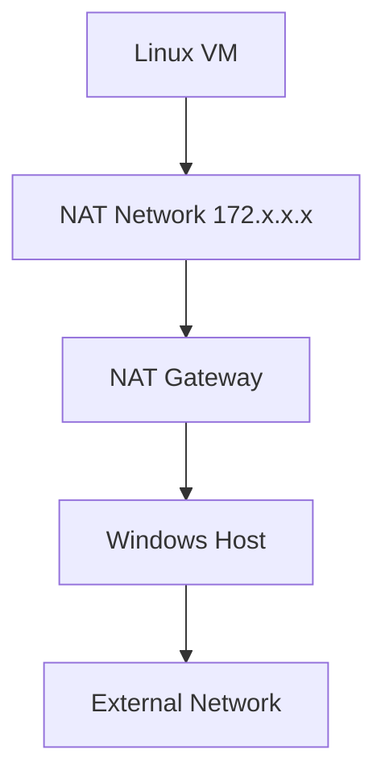
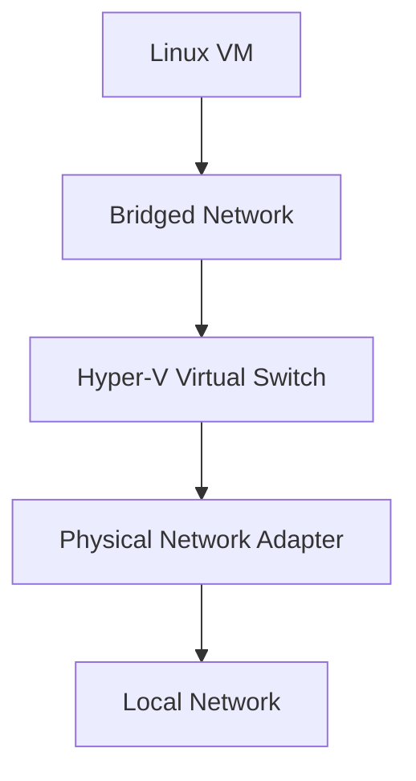
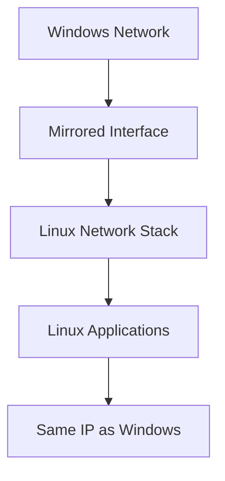
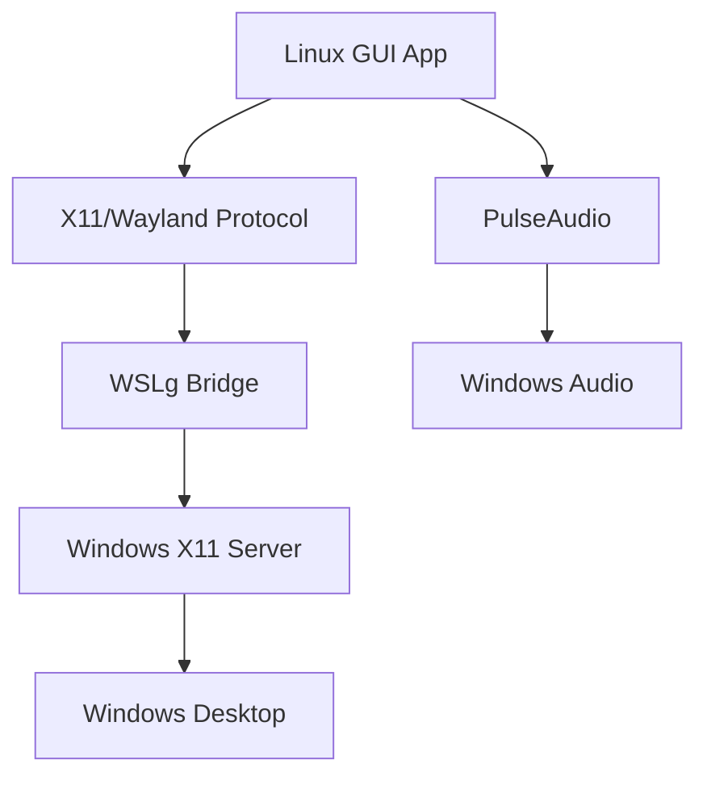

# Core Features

<cite>
**Referenced Files in This Document**   
- [drvfs.cpp](file://src/linux/init/drvfs.cpp)
- [GnsEngine.cpp](file://src/linux/init/GnsEngine.cpp)
- [plan9.cpp](file://src/linux/init/plan9.cpp)
- [config.cpp](file://src/linux/init/config.cpp)
- [NetworkManager.cpp](file://src/linux/init/NetworkManager.cpp)
- [NatNetworking.cpp](file://src/windows/service/exe/NatNetworking.cpp)
- [BridgedNetworking.cpp](file://src/windows/service/exe/BridgedNetworking.cpp)
- [MirroredNetworking.cpp](file://src/windows/service/exe/MirroredNetworking.cpp)
- [WslCoreVm.cpp](file://src/windows/service/exe/WslCoreVm.cpp)
- [wsl.conf](file://etc/wsl.conf)
- [registry](file://HKEY_LOCAL_MACHINE\SOFTWARE\Microsoft\Windows\CurrentVersion\Lxss)
</cite>

## Table of Contents
1. [WSL Execution Models](#wsl-execution-models)
2. [File System Integration](#file-system-integration)
3. [Networking Modes](#networking-modes)
4. [GUI Application Support](#gui-application-support)
5. [Configuration Options](#configuration-options)
6. [Feature Relationships](#feature-relationships)
7. [Common Issues and Solutions](#common-issues-and-solutions)

## WSL Execution Models

Windows Subsystem for Linux (WSL) provides two distinct execution models: WSL1 and WSL2. These models represent fundamentally different approaches to running Linux binaries on Windows, each with its own architecture, performance characteristics, and use cases.

### WSL1 Architecture

WSL1 implements a compatibility layer that translates Linux system calls into Windows NT kernel system calls in real-time. This translation layer, known as lxss.sys, intercepts Linux system calls from user processes and maps them to equivalent Windows NT kernel operations. The architecture eliminates the need for a full Linux kernel while maintaining binary compatibility with Linux applications.

The translation process involves sophisticated mapping of Linux-specific concepts to Windows equivalents. For example, Linux file permissions are mapped to Windows Access Control Lists (ACLs), and Linux process management is translated to Windows job objects and processes. This approach allows WSL1 to achieve excellent performance for file system operations on Windows drives, as there is no virtualization overhead when accessing Windows files.

### WSL2 Architecture

WSL2 represents a significant architectural shift from WSL1, moving from a translation layer to a lightweight virtual machine model. WSL2 runs a real Linux kernel inside a managed virtual machine, providing full system call compatibility and enabling features that were impossible in WSL1, such as running systemd, using Linux-specific kernel modules, and supporting a wider range of file systems.

The WSL2 architecture consists of several key components:
- A minimal Linux kernel built and maintained by Microsoft
- A Hyper-V based virtualization layer
- Inter-process communication mechanisms between Windows and Linux
- Virtualized hardware devices (network, storage, etc.)

This virtual machine approach provides near-native Linux performance and complete system call compatibility, making WSL2 the preferred choice for most development scenarios. The virtual machine is optimized for fast startup times and low resource consumption, with features like dynamic memory management that allow the VM to release unused memory back to Windows.

**Section sources**
- [WslCoreVm.cpp](file://src/windows/service/exe/WslCoreVm.cpp#L103-L800)

## File System Integration

WSL provides bidirectional file system integration between Windows and Linux environments through two complementary mechanisms: DrvFs for accessing Windows files from Linux, and Plan9 for accessing Linux files from Windows.

### DrvFs Implementation

DrvFs is the file system driver that enables Linux processes to access Windows drives. In WSL2, DrvFs operates as a 9P file server running on the Windows host, with the Linux VM connecting to it via virtio-9p or virtiofs. The implementation in `drvfs.cpp` handles the translation between Linux file system operations and Windows file system operations.

The DrvFs implementation includes several key features:
- **Metadata support**: When enabled, DrvFs preserves Linux file permissions, ownership, and extended attributes by storing them in Windows Alternate Data Streams (ADS)
- **Case sensitivity**: Configurable case handling for file names, with options for directory-based, forced, or off
- **Symbolic links**: Support for Windows-style symbolic links with configurable root path

The mount process involves several steps:
1. The Linux init process determines whether to use elevated or non-elevated access based on the user context
2. Connection parameters are translated from DrvFs options to 9P mount options
3. The appropriate virtio-9p or virtiofs device is mounted with the translated options



**Diagram sources**
- [drvfs.cpp](file://src/linux/init/drvfs.cpp#L1-L636)

**Section sources**
- [drvfs.cpp](file://src/linux/init/drvfs.cpp#L1-L636)

### Plan9 File Sharing

Plan9 provides the mechanism for accessing Linux files from Windows, enabling the familiar `\\wsl$` and `\\wsl.localhost` network paths. The implementation in `plan9.cpp` creates a 9P file server within the Linux VM that Windows can connect to via the p9rdr.sys driver.

The Plan9 server initialization process:
1. Creates a Unix domain socket or vsock endpoint for client connections
2. Sets up logging and error handling
3. Spawns a child process to run the actual file server
4. Establishes a control channel for server management

Key aspects of the Plan9 implementation:
- **Security**: The server runs with reduced privileges and uses file descriptor passing for secure client connections
- **Performance**: Large message sizes (262144 bytes) are used to optimize throughput
- **Reliability**: Retry mechanisms handle transient failures during mount operations

The file server translates 9P protocol messages to Linux system calls, providing a standards-based interface that can be used by any 9P client, not just the Windows p9rdr.sys driver.

```mermaid
graph TD
A[Windows Explorer] --> B[\\wsl.localhost\distro]
B --> C[p9rdr.sys Driver]
C --> D[wslservice.exe]
D --> E[HVSocket Connection]
E --> F[Plan9 Server]
F --> G[Linux File System]
```

**Diagram sources**
- [plan9.cpp](file://src/linux/init/plan9.cpp#L1-L324)

**Section sources**
- [plan9.cpp](file://src/linux/init/plan9.cpp#L1-L324)

## Networking Modes

WSL2 provides several networking modes that determine how the Linux VM connects to the network and interacts with Windows networking components. These modes offer different trade-offs between isolation, performance, and integration with the host network.

### NAT Mode

NAT (Network Address Translation) mode is the default networking configuration for WSL2. In this mode, the Linux VM receives an IP address from a private network range and uses NAT to access external networks through the Windows host.

Key characteristics of NAT mode:
- The Linux VM gets an IP address in the 172.x.x.x range
- Port forwarding is required to access services running in WSL from Windows or external networks
- DNS resolution uses the Windows host's DNS settings
- The VM is isolated from the local network

The NAT implementation in `NatNetworking.cpp` uses Host Compute Network (HCN) to create a virtual network with Internet Connection Sharing (ICS). The networking stack handles:
- IP address assignment and DHCP configuration
- Default route configuration
- DNS server propagation from Windows to Linux
- MTU (Maximum Transmission Unit) synchronization



**Diagram sources**
- [NatNetworking.cpp](file://src/windows/service/exe/NatNetworking.cpp#L1-L800)

### Bridged Mode

Bridged networking connects the WSL2 VM directly to a specified Hyper-V virtual switch, giving it an IP address on the same subnet as the host. This mode provides better network performance and allows the VM to be discovered by other devices on the local network.

Implementation details:
- Requires a pre-configured Hyper-V virtual switch
- The VM receives an IP address via DHCP from the local network
- No NAT is performed, reducing network overhead
- The VM appears as a separate device on the network

The bridged networking implementation in `BridgedNetworking.cpp` handles:
- Virtual switch discovery and validation
- Network endpoint creation on the specified switch
- MAC address assignment
- Initial network configuration



**Diagram sources**
- [BridgedNetworking.cpp](file://src/windows/service/exe/BridgedNetworking.cpp#L1-L87)

### Mirrored Mode

Mirrored networking is an advanced mode that creates a virtual network interface in Linux for each active network interface on the Windows host. This provides seamless integration between Windows and Linux networking, allowing services to bind to the same IP addresses on both systems.

Key features of mirrored mode:
- Automatic mirroring of host network interfaces
- Shared IP addresses between Windows and Linux
- Direct access to services without port forwarding
- Support for localhost communication between Windows and Linux

The mirrored networking implementation in `MirroredNetworking.cpp` and `NetworkManager.cpp` handles:
- Host network interface monitoring
- Dynamic creation and removal of mirrored interfaces
- Policy-based routing configuration
- Port allocation coordination through Flow Steering



**Diagram sources**
- [MirroredNetworking.cpp](file://src/windows/service/exe/MirroredNetworking.cpp#L1-L756)
- [NetworkManager.cpp](file://src/linux/init/NetworkManager.cpp#L1-L538)

**Section sources**
- [NatNetworking.cpp](file://src/windows/service/exe/NatNetworking.cpp#L1-L800)
- [BridgedNetworking.cpp](file://src/windows/service/exe/BridgedNetworking.cpp#L1-L87)
- [MirroredNetworking.cpp](file://src/windows/service/exe/MirroredNetworking.cpp#L1-L756)
- [NetworkManager.cpp](file://src/linux/init/NetworkManager.cpp#L1-L538)

## GUI Application Support

WSLg (Windows Subsystem for Linux GUI) enables running Linux graphical applications on Windows with full integration into the Windows desktop environment. This feature builds on the core WSL infrastructure to provide seamless GUI application support.

### WSLg Architecture

The WSLg architecture consists of several components that work together to provide GUI support:
- **X11 server**: Runs on Windows and handles X11 protocol from Linux applications
- **PulseAudio server**: Provides audio output for Linux applications
- **Wayland compositor**: Supports modern Wayland-based applications
- **OpenGL/Vulkan support**: Hardware-accelerated graphics through DirectX translation

The implementation integrates with the WSL startup process to automatically configure environment variables and mount necessary resources. When GUI support is enabled, the system automatically:
- Mounts the WSLg shared directory
- Sets DISPLAY environment variable
- Configures audio routing
- Enables hardware acceleration



**Section sources**
- [config.cpp](file://src/linux/init/config.cpp#L601-L619)

## Configuration Options

WSL provides extensive configuration options through both the `wsl.conf` file and Windows registry settings, allowing fine-grained control over the WSL environment.

### wsl.conf Configuration

The `/etc/wsl.conf` file provides distribution-specific configuration options. Key configuration sections include:

**Automount settings:**
```ini
[automount]
enabled = true
root = /mnt/
options = "metadata,uid=1000,gid=1000,umask=022"
mountFsTab = true
```

**Network settings:**
```ini
[network]
generateHosts = true
generateResolvConf = true
hostname = my-wsl-instance
```

**Interop settings:**
```ini
[interop]
enabled = true
appendWindowsPath = true
```

**Boot settings:**
```ini
[boot]
command = /bin/systemctl start ssh
systemd = true
```

### Registry Configuration

Windows registry settings under `HKEY_LOCAL_MACHINE\SOFTWARE\Microsoft\Windows\CurrentVersion\Lxss` provide system-wide WSL configuration. Key registry values include:

- **DefaultDistribution**: GUID of the default WSL distribution
- **DefaultVersion**: Default WSL version (1 or 2)
- **EnableVirtualMachines**: Global toggle for WSL2 virtualization
- **NetworkingMode**: Default networking mode for new distributions

**Section sources**
- [config.cpp](file://src/linux/init/config.cpp#L1-L800)
- [wsl.conf](file://etc/wsl.conf)
- [registry](file://HKEY_LOCAL_MACHINE\SOFTWARE\Microsoft\Windows\CurrentVersion\Lxss)

## Feature Relationships

The various WSL features are interconnected, with configuration choices in one area affecting behavior in others. Understanding these relationships is crucial for optimal WSL configuration.

### Networking and DNS Interactions

The networking mode directly affects DNS resolution behavior:
- In NAT mode, DNS settings are synchronized from Windows to Linux via the GNS (Guest Network Service) channel
- In mirrored mode, DNS resolution is more tightly integrated, with shared network interfaces
- DNS tunneling can be enabled to improve reliability in certain network environments

The GNS engine in `GnsEngine.cpp` coordinates these interactions by:
- Receiving network configuration updates from Windows
- Applying changes to the Linux network stack
- Managing DNS server configuration in `/etc/resolv.conf`
- Handling route and IP address changes

```mermaid
graph TD
A[Windows Network] --> B[GNS Channel]
B --> C[Linux Network Stack]
C --> D[DNS Resolution]
D --> E[/etc/resolv.conf]
E --> F[Application Requests]
```

**Diagram sources**
- [GnsEngine.cpp](file://src/linux/init/GnsEngine.cpp#L1-L752)

### File System and Performance Considerations

The choice of file system access method significantly impacts performance:
- DrvFs with metadata enabled provides full Linux file semantics but with some performance overhead
- Virtiofs offers better performance for Linux file operations but requires kernel support
- The automount configuration affects startup time and resource usage

Performance can be optimized by:
- Using virtiofs for Linux file operations
- Disabling metadata for Windows file access when Linux permissions are not needed
- Configuring appropriate mount options for specific workloads

**Section sources**
- [GnsEngine.cpp](file://src/linux/init/GnsEngine.cpp#L1-L752)

## Common Issues and Solutions

### File Permission Problems

**Issue**: Files created in Windows appear with incorrect permissions in Linux.

**Solution**: Enable metadata support in `/etc/wsl.conf`:
```ini
[automount]
options = "metadata"
```

This stores Linux permissions in Windows Alternate Data Streams, preserving file ownership and permissions across sessions.

### Network Connectivity Failures

**Issue**: WSL2 VM cannot access external networks.

**Solution**: Reset the virtual network:
```powershell
wsl --shutdown
```

This command terminates all WSL instances and resets the virtual network, often resolving connectivity issues.

### Performance Bottlenecks

**Issue**: Slow file system performance, particularly when accessing Windows files from Linux.

**Solutions**:
1. Use virtiofs instead of DrvFs when possible:
```ini
[wsl2]
filesystem = virtiofs
```

2. Disable metadata if Linux file permissions are not needed:
```ini
[automount]
options = "noatime"
```

3. Use the Linux file system for development files and only access Windows files when necessary.

**Section sources**
- [drvfs.cpp](file://src/linux/init/drvfs.cpp#L1-L636)
- [GnsEngine.cpp](file://src/linux/init/GnsEngine.cpp#L1-L752)