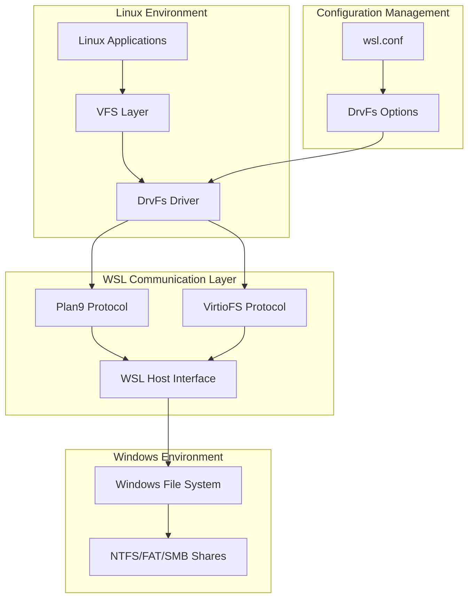
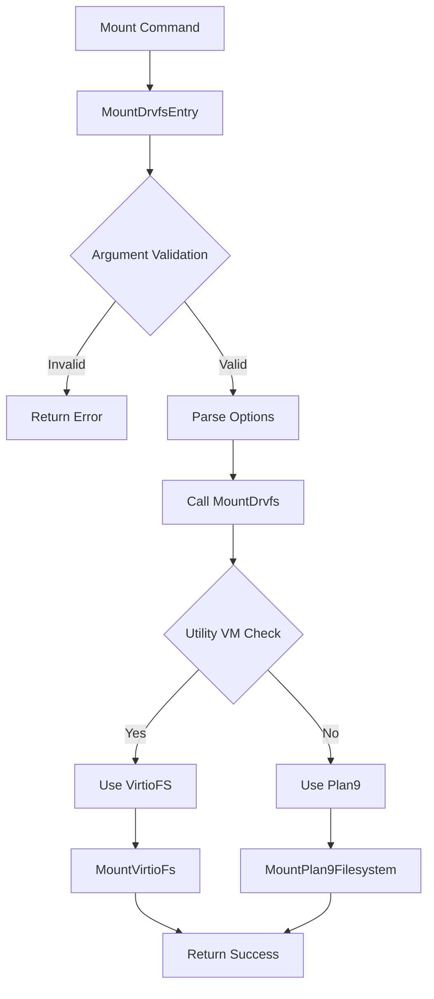
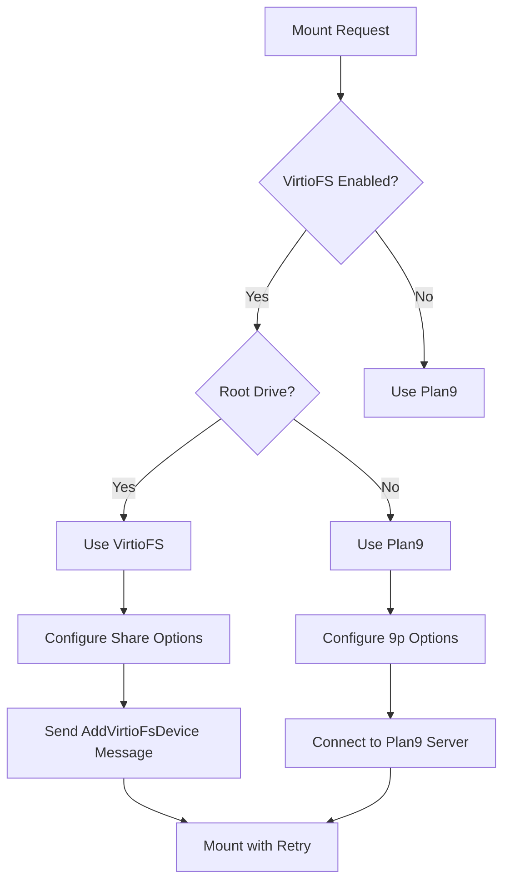
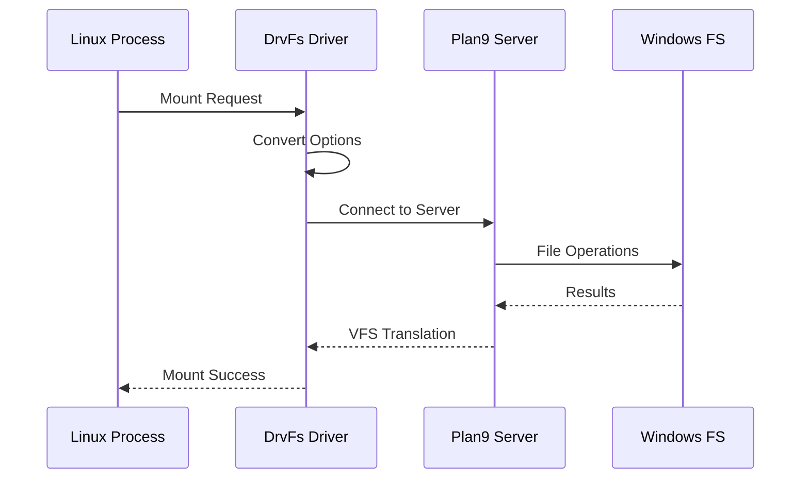
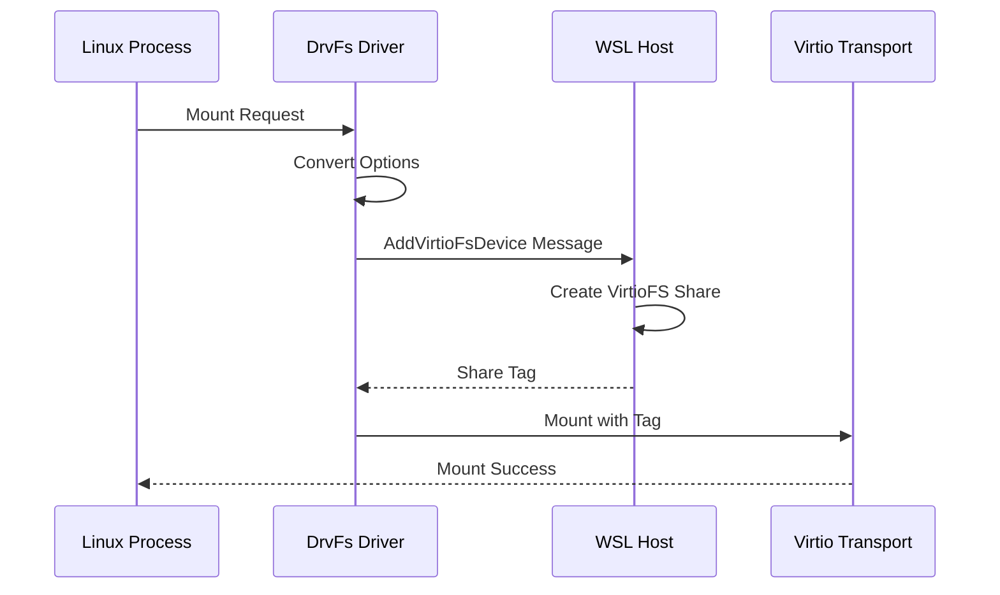
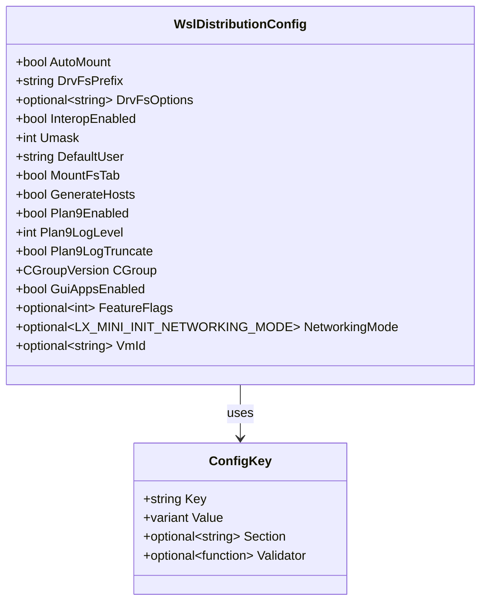
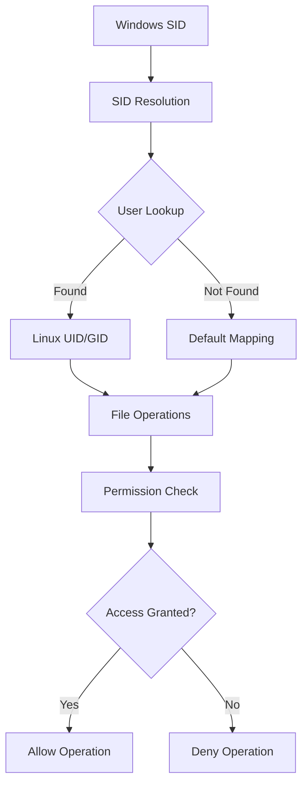
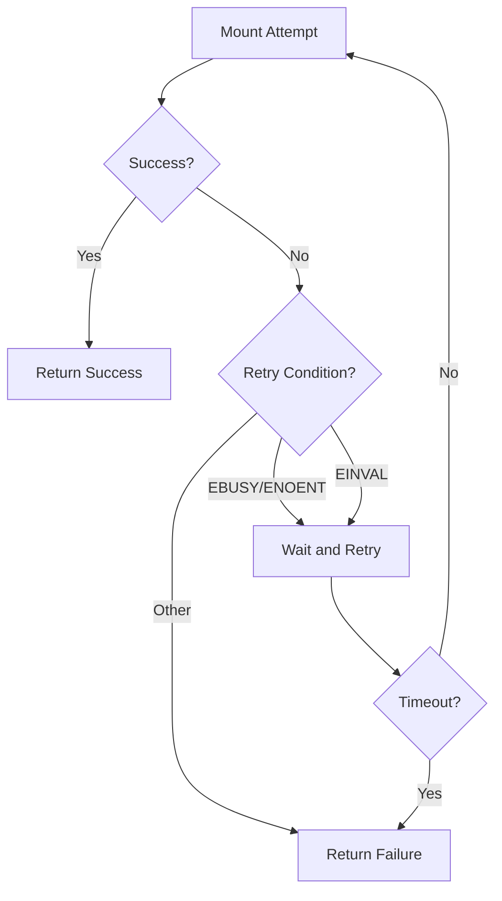
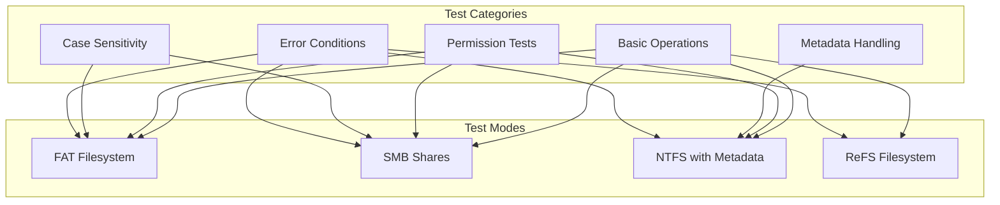
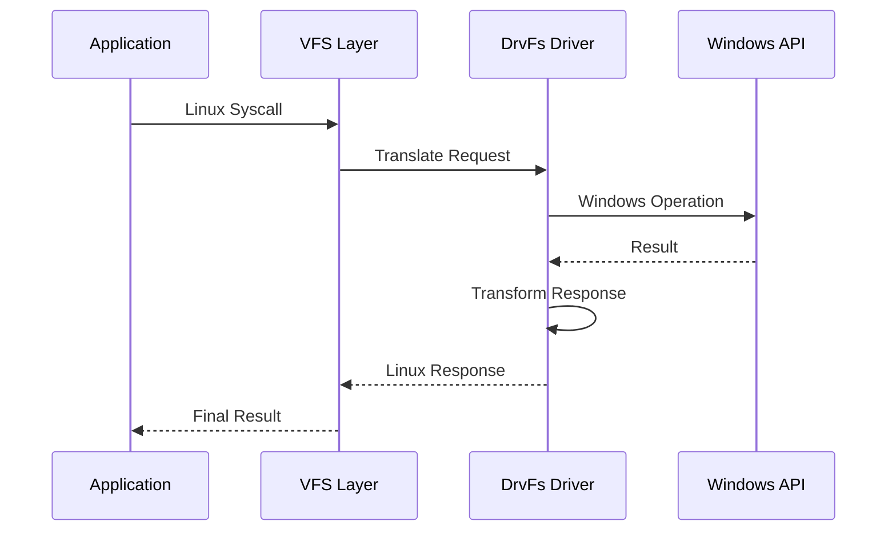

# DrvFs Implementation in WSL

<cite>
**Referenced Files in This Document**
- [drvfs.cpp](file://src/linux/init/drvfs.cpp)
- [drvfs.h](file://src/linux/init/drvfs.h)
- [drvfs.c](file://test/linux/unit_tests/drvfs.c)
- [config.h](file://src/linux/init/config.h)
- [config.cpp](file://src/linux/init/config.cpp)
- [WslDistributionConfig.h](file://src/linux/init/WslDistributionConfig.h)
- [WslDistributionConfig.cpp](file://src/linux/init/WslDistributionConfig.cpp)
- [mountutil.h](file://src/linux/mountutil/mountutil.h)
- [mountutil.c](file://src/linux/mountutil/mountutil.c)
- [mountflags.cpp](file://src/linux/mountutil/mountflags.cpp)
- [drvfs.md](file://doc/docs/technical-documentation/drvfs.md)
</cite>

## Table of Contents
1. [Introduction](#introduction)
2. [Architecture Overview](#architecture-overview)
3. [Core Components](#core-components)
4. [Mount Process and File System Types](#mount-process-and-file-system-types)
5. [Configuration System](#configuration-system)
6. [Permission Mapping and Security Model](#permission-mapping-and-security-model)
7. [Performance Optimization Strategies](#performance-optimization-strategies)
8. [Testing Framework](#testing-framework)
9. [Common Issues and Solutions](#common-issues-and-solutions)
10. [Advanced Topics](#advanced-topics)
11. [Conclusion](#conclusion)

## Introduction

DrvFs (Drive File System) is WSL's paravirtualized file system implementation that enables seamless access to Windows drives from Linux environments. It serves as a bridge between the Linux Virtual File System (VFS) layer and Windows file operations, translating Linux file system calls into equivalent Windows operations through the WSL host interface.

The primary purpose of DrvFs is to provide transparent access to Windows file systems while maintaining compatibility with Linux file system semantics. This includes handling permission mapping between Windows Security Identifiers (SIDs) and Linux User IDs (UIDs)/Group IDs (GIDs), managing case sensitivity differences, and optimizing performance for various file system types.

## Architecture Overview

DrvFs implements a layered architecture that sits between the Linux VFS and Windows file operations:



**Diagram sources**
- [drvfs.cpp](file://src/linux/init/drvfs.cpp#L306-L402)
- [config.h](file://src/linux/init/config.h#L26-L27)

The architecture supports multiple backend protocols:
- **Plan9 Protocol**: Traditional 9p implementation for compatibility
- **VirtioFS Protocol**: Modern virtio-based file system for improved performance
- **Virtio-9P**: Hybrid approach combining virtio transport with 9p protocol

**Section sources**
- [drvfs.cpp](file://src/linux/init/drvfs.cpp#L332-L402)
- [drvfs.md](file://doc/docs/technical-documentation/drvfs.md#L1-L35)

## Core Components

### Mount Entry Point

The DrvFs mount process begins with the `MountDrvfsEntry` function, which serves as the entry point for the mount.drvfs utility:



**Diagram sources**
- [drvfs.cpp](file://src/linux/init/drvfs.cpp#L405-L445)

### Mount Option Processing

The `ConvertDrvfsMountOptionsToPlan9` function handles the conversion of DrvFs-specific mount options to Plan9-compatible options:

| DrvFs Option | Plan9 Equivalent | Description |
|--------------|------------------|-------------|
| `metadata` | Included in options | Enables extended attribute support |
| `uid=<value>` | `uid=<value>` | Sets user ID override |
| `gid=<value>` | `gid=<value>` | Sets group ID override |
| `umask=<value>` | `umask=<value>` | Sets file mode creation mask |
| `case=dir` | `case=dir` | Enables case-sensitive directory operations |
| `case=off` | `case=off` | Disables case sensitivity |
| `symlinkroot=` | `symlinkroot=` | Specifies symlink root prefix |

**Section sources**
- [drvfs.cpp](file://src/linux/init/drvfs.cpp#L44-L98)

### File System Type Selection

The mount process automatically selects the appropriate file system type based on configuration and capabilities:



**Diagram sources**
- [drvfs.cpp](file://src/linux/init/drvfs.cpp#L332-L402)

**Section sources**
- [drvfs.cpp](file://src/linux/init/drvfs.cpp#L332-L402)

## Mount Process and File System Types

### Plan9 File System Implementation

Plan9 serves as the traditional backend for DrvFs, providing compatibility with older WSL configurations:



**Diagram sources**
- [drvfs.cpp](file://src/linux/init/drvfs.cpp#L447-L494)

### VirtioFS Implementation

VirtioFS provides enhanced performance through direct virtio transport:



**Diagram sources**
- [drvfs.cpp](file://src/linux/init/drvfs.cpp#L496-L581)

**Section sources**
- [drvfs.cpp](file://src/linux/init/drvfs.cpp#L447-L581)

## Configuration System

### WSL Configuration Structure

The configuration system manages DrvFs behavior through the `WslDistributionConfig` class:



**Diagram sources**
- [WslDistributionConfig.h](file://src/linux/init/WslDistributionConfig.h#L41-L101)
- [WslDistributionConfig.cpp](file://src/linux/init/WslDistributionConfig.cpp#L22-L43)

### Configuration File Processing

The configuration system processes `/etc/wsl.conf` to customize DrvFs behavior:

| Configuration Option | Type | Default | Description |
|---------------------|------|---------|-------------|
| `automount.enabled` | boolean | true | Enable automatic mounting of drives |
| `automount.root` | string | "/mnt" | Root directory for mount points |
| `automount.options` | string | null | Default mount options |
| `automount.mountfstab` | boolean | true | Process /etc/fstab entries |
| `filesystem.umask` | integer | 0022 | Default file creation mask |
| `interop.enabled` | boolean | true | Enable Windows/Linux interoperability |
| `interop.appendWindowsPath` | boolean | true | Append Windows PATH to Linux PATH |

**Section sources**
- [WslDistributionConfig.cpp](file://src/linux/init/WslDistributionConfig.cpp#L25-L43)
- [config.cpp](file://src/linux/init/config.cpp#L687-L741)

## Permission Mapping and Security Model

### User ID and Group ID Mapping

DrvFs implements sophisticated permission mapping between Windows SIDs and Linux UIDs/GIDs:



**Diagram sources**
- [config.cpp](file://src/linux/init/config.cpp#L687-L706)

### Case Sensitivity Handling

DrvFs supports multiple case sensitivity modes to handle differences between Windows and Linux file systems:

| Case Mode | Windows Behavior | Linux Behavior | DrvFs Handling |
|-----------|------------------|----------------|----------------|
| `case=off` | Case-insensitive | Case-sensitive | Normalize to lowercase |
| `case=dir` | Case-insensitive | Case-sensitive | Preserve original case |
| `case=force` | Case-insensitive | Case-sensitive | Force lowercase (deprecated) |

**Section sources**
- [drvfs.cpp](file://src/linux/init/drvfs.cpp#L66-L98)

## Performance Optimization Strategies

### Mount Retry Mechanism

DrvFs implements robust retry mechanisms for handling transient failures:



**Diagram sources**
- [drvfs.cpp](file://src/linux/init/drvfs.cpp#L247-L295)

### Caching Strategies

The system employs several caching mechanisms to improve performance:

- **Metadata Caching**: Extended attributes are cached to reduce Windows API calls
- **Path Resolution**: Frequently accessed paths are cached to avoid repeated lookups
- **Connection Pooling**: Persistent connections to Plan9 servers reduce overhead

**Section sources**
- [drvfs.cpp](file://src/linux/init/drvfs.cpp#L247-L295)

## Testing Framework

### Unit Test Structure

The DrvFs testing framework provides comprehensive coverage of functionality:



**Diagram sources**
- [drvfs.c](file://test/linux/unit_tests/drvfs.c#L225-L285)

### Key Test Scenarios

The test suite covers essential scenarios including:

- **File Access Control**: Testing read, write, and execute permissions
- **Metadata Preservation**: Verifying extended attribute handling
- **Case Sensitivity**: Validating case handling across different file systems
- **Error Recovery**: Testing graceful handling of failures
- **Performance**: Measuring mount and operation latencies

**Section sources**
- [drvfs.c](file://test/linux/unit_tests/drvfs.c#L225-L351)

## Common Issues and Solutions

### Performance Bottlenecks

**Issue**: Slow file operations on large files or directories
**Solution**: Disable metadata support for performance-critical operations
```bash
mount -t drvfs C: /mnt/c -o metadata=off
```

**Issue**: Antivirus interference causing delays
**Solution**: Configure antivirus exclusions for WSL mount points

### Permission Conflicts

**Issue**: Unexpected permission denials
**Solution**: Verify user mapping and adjust mount options:
```bash
mount -t drvfs C: /mnt/c -o uid=1000,gid=1000
```

**Issue**: Case sensitivity problems
**Solution**: Explicitly set case sensitivity mode:
```bash
mount -t drvfs C: /mnt/c -o case=dir
```

### Configuration Problems

**Issue**: Mount points not appearing automatically
**Solution**: Check `/etc/wsl.conf` configuration:
```ini
[automount]
enabled = true
root = /mnt/
options = "metadata"
```

**Section sources**
- [drvfs.c](file://test/linux/unit_tests/drvfs.c#L2691-L3789)

## Advanced Topics

### Syscall Translation Layer

DrvFs implements a sophisticated syscall translation layer that handles the differences between Linux and Windows file system APIs:



**Diagram sources**
- [mountutil.h](file://src/linux/mountutil/mountutil.h#L8-L19)

### Mount Information Parsing

The system includes sophisticated mount information parsing for debugging and monitoring:

| Field | Description | Example |
|-------|-------------|---------|
| Id | Unique mount identifier | 123 |
| ParentId | Parent mount identifier | 1 |
| Device | Device identifier | 0:3 |
| Root | Mount root path | / |
| MountPoint | Mount point path | /mnt/c |
| MountOptions | Mount options | rw,relatime,metadata |
| FileSystemType | File system type | drvfs |
| Source | Source identifier | C:\ |

**Section sources**
- [mountutil.c](file://src/linux/mountutil/mountutil.c#L173-L225)
- [mountflags.cpp](file://src/linux/mountutil/mountflags.cpp#L51-L82)

## Conclusion

DrvFs represents a sophisticated implementation of a paravirtualized file system that successfully bridges the gap between Windows and Linux file systems. Its layered architecture, comprehensive configuration options, and robust error handling make it suitable for production use across diverse scenarios.

Key strengths of the DrvFs implementation include:

- **Flexibility**: Support for multiple backend protocols (Plan9, VirtioFS)
- **Performance**: Optimized caching and retry mechanisms
- **Compatibility**: Comprehensive handling of Windows/Linux differences
- **Reliability**: Robust error handling and recovery mechanisms
- **Extensibility**: Modular design allowing for future enhancements

The implementation demonstrates advanced knowledge of both Linux VFS internals and Windows file system architecture, resulting in a solution that provides seamless integration between the two platforms while maintaining performance and reliability standards.

Future enhancements could include expanded caching strategies, additional protocol support, and enhanced monitoring capabilities to further improve the user experience in WSL environments.