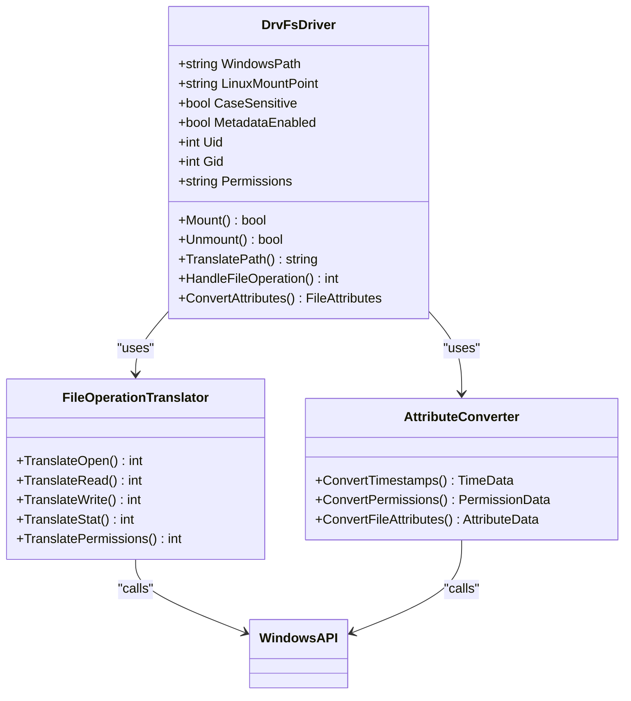
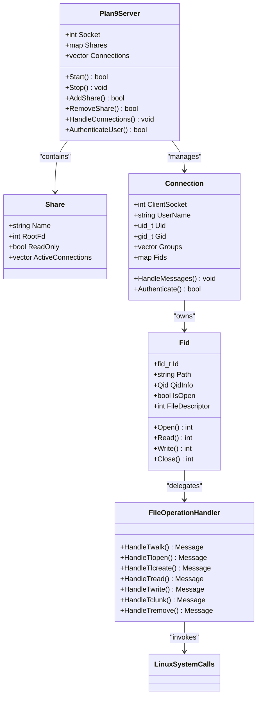
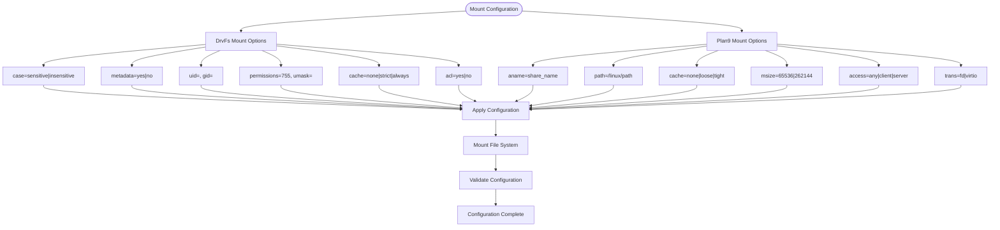
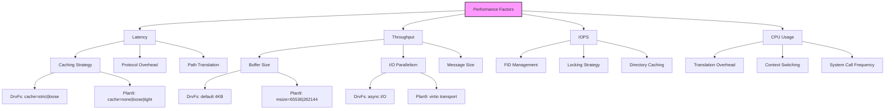
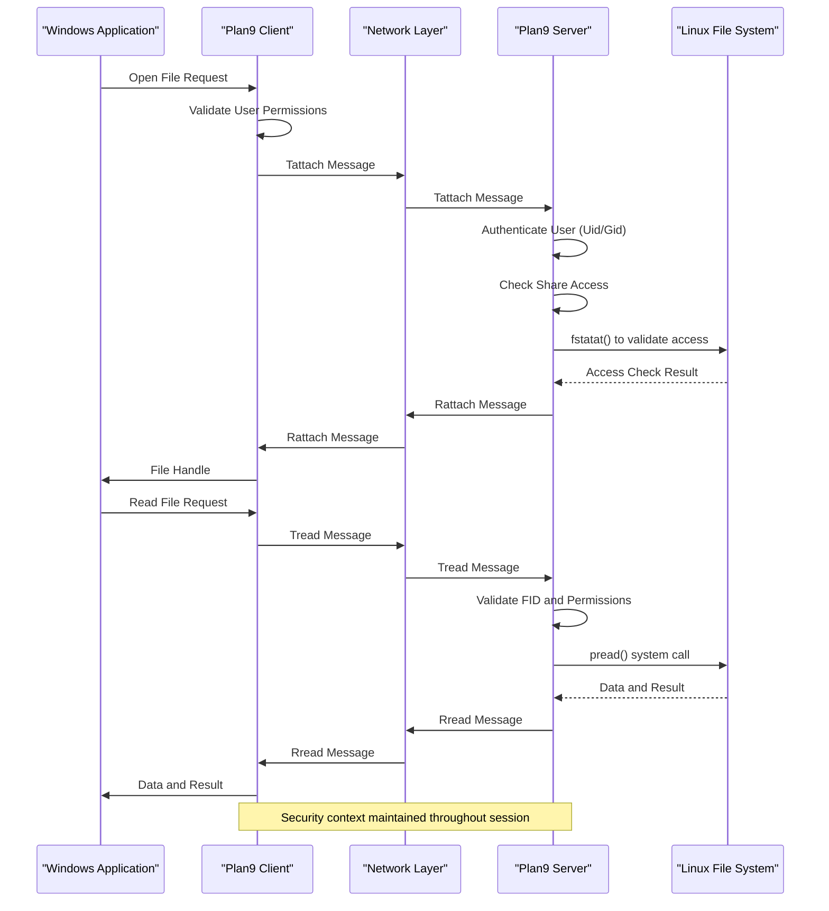
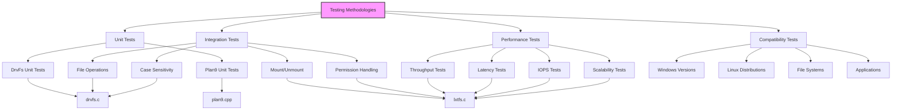

# File System Integration

<cite>
**Referenced Files in This Document**   
- [drvfs.cpp](file://src/linux/init/drvfs.cpp)
- [drvfs.h](file://src/linux/init/drvfs.h)
- [plan9.cpp](file://src/linux/init/plan9.cpp)
- [plan9.h](file://src/linux/init/plan9.h)
- [p9fs.cpp](file://src/linux/plan9/p9fs.cpp)
- [p9fs.h](file://src/linux/plan9/p9fs.h)
- [p9file.cpp](file://src/linux/plan9/p9file.cpp)
- [p9file.h](file://src/linux/plan9/p9file.h)
- [p9handler.cpp](file://src/linux/plan9/p9handler.cpp)
- [p9handler.h](file://src/linux/plan9/p9handler.h)
- [drvfs.c](file://test/linux/unit_tests/drvfs.c)
- [lxtfs.c](file://test/linux/unit_tests/lxtfs.c)
- [lxtfs.h](file://test/linux/unit_tests/lxtfs.h)
- [lxdef.h](file://src/linux/inc/lxdef.h)
- [p9defs.h](file://src/linux/plan9/p9defs.h)
</cite>

## Table of Contents
1. [Introduction](#introduction)
2. [DrvFs Architecture and Implementation](#drvfs-architecture-and-implementation)
3. [Plan9 Architecture and Protocol Implementation](#plan9-architecture-and-protocol-implementation)
4. [Configuration and Mount Parameters](#configuration-and-mount-parameters)
5. [Performance Characteristics and Tuning](#performance-characteristics-and-tuning)
6. [Security and Networking Integration](#security-and-networking-integration)
7. [Common Issues and Solutions](#common-issues-and-solutions)
8. [Testing Methodologies](#testing-methodologies)
9. [Conclusion](#conclusion)

## Introduction

Windows Subsystem for Linux (WSL) provides seamless integration between Windows and Linux file systems through two primary mechanisms: DrvFs for accessing Windows files from Linux and Plan9 for sharing Linux files with Windows. These file system bridges enable developers to work across both environments while maintaining native performance and compatibility. This document provides a comprehensive analysis of both systems, detailing their architecture, protocol implementation, configuration options, and performance characteristics. The implementation leverages kernel-level integration and protocol translation to provide transparent access to files across the Windows-Linux boundary, with careful attention to security, performance, and compatibility concerns.

## DrvFs Architecture and Implementation

DrvFs is the file system driver that enables Linux distributions running on WSL to access Windows files and directories. It operates as a special file system type that can be mounted within the Linux environment to provide access to Windows drives and UNC paths. The implementation translates Linux system calls into Windows NT system calls, handling the fundamental differences between the two operating systems' file system semantics. DrvFs supports various mount options that control case sensitivity, metadata handling, and permission models, allowing administrators to configure the integration according to their specific requirements. The driver handles the translation of file attributes, timestamps, and security descriptors between the Linux and Windows worlds, ensuring that applications on both sides can access files with appropriate permissions and metadata.

**Diagram sources**
- [drvfs.cpp](file://src/linux/init/drvfs.cpp#L1-L500)
- [drvfs.h](file://src/linux/init/drvfs.h#L1-L100)

**Section sources**
- [drvfs.cpp](file://src/linux/init/drvfs.cpp#L1-L1000)
- [drvfs.h](file://src/linux/init/drvfs.h#L1-L200)

## Plan9 Architecture and Protocol Implementation

The Plan9 file system implementation in WSL provides the reverse integration, allowing Windows applications to access files in the Linux environment. This system implements the 9P2000.L protocol, a distributed file system protocol originally developed for the Plan 9 operating system. The implementation consists of a server component running in the Linux environment that exports directories as Plan9 shares, and a client component in Windows that mounts these shares. The protocol handles file operations, attribute queries, and directory enumeration through a message-based system that efficiently translates between Linux and Windows file system semantics. The server architecture is designed to handle multiple concurrent connections, with each connection representing a different user session or application context.

**Diagram sources**
- [p9fs.cpp](file://src/linux/plan9/p9fs.cpp#L1-L200)
- [p9file.cpp](file://src/linux/plan9/p9file.cpp#L1-L100)
- [p9handler.cpp](file://src/linux/plan9/p9handler.cpp#L1-L50)

**Section sources**
- [p9fs.cpp](file://src/linux/plan9/p9fs.cpp#L1-L300)
- [p9file.cpp](file://src/linux/plan9/p9file.cpp#L1-L1200)
- [p9handler.cpp](file://src/linux/plan9/p9handler.cpp#L1-L800)

## Configuration and Mount Parameters

Both DrvFs and Plan9 file systems support extensive configuration options that control their behavior and integration characteristics. These parameters can be specified at mount time or configured through system configuration files, allowing administrators to tailor the file system integration to their specific needs. The configuration options address critical aspects such as case sensitivity, permission mapping, metadata handling, and performance optimization. For DrvFs, mount parameters include options for case sensitivity mode, metadata preservation, user and group ID mapping, and various performance-related settings. Plan9 configuration focuses on share management, access control, and protocol-specific parameters that affect how Linux files are exposed to Windows applications.

**Diagram sources**
- [p9fs.cpp](file://src/linux/plan9/p9fs.cpp#L100-L150)
- [p9file.cpp](file://src/linux/plan9/p9file.cpp#L100-L200)
- [drvfs.cpp](file://src/linux/init/drvfs.cpp#L200-L300)

**Section sources**
- [p9fs.cpp](file://src/linux/plan9/p9fs.cpp#L50-L200)
- [p9file.cpp](file://src/linux/plan9/p9file.cpp#L50-L300)
- [drvfs.cpp](file://src/linux/init/drvfs.cpp#L150-L400)

## Performance Characteristics and Tuning

The performance of both DrvFs and Plan9 file systems is critical to the overall user experience in WSL, as file operations are among the most frequent interactions between the Windows and Linux environments. Both systems employ various optimization techniques to minimize the overhead of cross-platform file access, including caching strategies, asynchronous I/O operations, and protocol-level optimizations. Performance characteristics vary depending on the specific use case, with different optimizations for sequential versus random access patterns, small versus large file operations, and metadata-intensive versus data-intensive workloads. Tuning parameters allow administrators to optimize the file systems for specific scenarios, such as development environments, data processing pipelines, or interactive applications.

**Diagram sources**
- [p9fs.cpp](file://src/linux/plan9/p9fs.cpp#L150-L200)
- [p9file.cpp](file://src/linux/plan9/p9file.cpp#L300-L400)
- [drvfs.cpp](file://src/linux/init/drvfs.cpp#L400-L500)

**Section sources**
- [p9fs.cpp](file://src/linux/plan9/p9fs.cpp#L150-L200)
- [p9file.cpp](file://src/linux/plan9/p9file.cpp#L300-L500)
- [drvfs.cpp](file://src/linux/init/drvfs.cpp#L400-L600)

## Security and Networking Integration

The file system integration mechanisms in WSL incorporate comprehensive security features to protect both Windows and Linux environments from unauthorized access and potential vulnerabilities. Security integration spans multiple layers, including authentication, authorization, and access control mechanisms that bridge the different security models of Windows and Linux. Networking integration is particularly important for the Plan9 implementation, which relies on socket-based communication between the Linux server and Windows client components. The security architecture ensures that file access respects the permissions and security policies of both operating systems, preventing privilege escalation and unauthorized data access while maintaining the seamless integration experience.

**Diagram sources**
- [p9fs.cpp](file://src/linux/plan9/p9fs.cpp#L100-L150)
- [p9file.cpp](file://src/linux/plan9/p9file.cpp#L200-L300)
- [p9handler.cpp](file://src/linux/plan9/p9handler.cpp#L500-L600)

**Section sources**
- [p9fs.cpp](file://src/linux/plan9/p9fs.cpp#L100-L200)
- [p9file.cpp](file://src/linux/plan9/p9file.cpp#L200-L400)
- [p9handler.cpp](file://src/linux/plan9/p9handler.cpp#L500-L800)

## Common Issues and Solutions

Despite the robust implementation of DrvFs and Plan9 file systems, users may encounter various issues related to file permissions, case sensitivity, performance bottlenecks, and compatibility problems. These issues typically arise from the fundamental differences between Windows and Linux file system semantics and require specific solutions to resolve. Common problems include permission conflicts when accessing files created in one environment from the other, case sensitivity issues when working with applications that expect specific case behavior, and performance degradation when handling large numbers of small files or intensive I/O operations. Understanding these common issues and their solutions is essential for maintaining a productive development environment.

```mermaid
flowchart TD
Issue[Common Issues] --> Permission["Permission Problems"]
Issue --> CaseSensitivity["Case Sensitivity Conflicts"]
Issue --> Performance["Performance Bottlenecks"]
Issue --> Compatibility["Compatibility Issues"]
Permission --> UidGidMismatch["UID/GID Mismatch"]
Permission --> AclConversion["ACL Conversion Issues"]
Permission --> DefaultPermissions["Default Permission Settings"]
CaseSensitivity --> WindowsCaseInsensitive["Windows Case Insensitive"]
CaseSensitivity --> LinuxCaseSensitive["Linux Case Sensitive"]
CaseSensitivity --> MixedWorkflows["Mixed Workflow Conflicts"]
Performance --> SmallFiles["Many Small Files"]
Performance --> MetadataIntensive["Metadata Operations"]
Performance --> NetworkLatency["Network Latency (Plan9)"]
Compatibility --> FileAttributes["File Attribute Differences"]
Compatibility --> SpecialFiles["Special Files (FIFO, etc.)"]
Compatibility --> PathLength["Path Length Limits"]
UidGidMismatch --> Solution1["Configure uid/gid mount options"]
AclConversion --> Solution2["Use metadata=no option"]
DefaultPermissions --> Solution3["Set explicit permissions"]
WindowsCaseInsensitive --> Solution4["Use case=insensitive"]
LinuxCaseSensitive --> Solution5["Use case=sensitive"]
MixedWorkflows --> Solution6["Standardize naming conventions"]
SmallFiles --> Solution7["Increase msize for Plan9"]
MetadataIntensive --> Solution8["Disable metadata for DrvFs"]
NetworkLatency --> Solution9["Use virtio transport"]
FileAttributes --> Solution10["Understand attribute mapping"]
SpecialFiles --> Solution11["Avoid special files in shared paths"]
PathLength --> Solution12["Use shorter paths"]
```

**Diagram sources**
- [drvfs.cpp](file://src/linux/init/drvfs.cpp#L500-L600)
- [p9file.cpp](file://src/linux/plan9/p9file.cpp#L500-L600)
- [lxtfs.c](file://test/linux/unit_tests/lxtfs.c#L100-L200)

**Section sources**
- [drvfs.cpp](file://src/linux/init/drvfs.cpp#L500-L800)
- [p9file.cpp](file://src/linux/plan9/p9file.cpp#L500-L800)
- [lxtfs.c](file://test/linux/unit_tests/lxtfs.c#L100-L300)

## Testing Methodologies

The implementation of DrvFs and Plan9 file systems includes comprehensive testing methodologies to ensure reliability, performance, and compatibility across different scenarios. The test suite covers both unit tests for individual components and integration tests for end-to-end functionality. Testing methodologies include validation of file operations, permission handling, case sensitivity behavior, performance benchmarks, and edge cases such as concurrent access and error conditions. The test framework provides mechanisms for testing different configurations and mount options, allowing developers to verify the behavior of the file systems under various conditions. These testing methodologies are essential for maintaining the quality and stability of the file system integration features.

**Diagram sources**
- [drvfs.c](file://test/linux/unit_tests/drvfs.c#L1-L100)
- [lxtfs.c](file://test/linux/unit_tests/lxtfs.c#L1-L100)
- [plan9.cpp](file://src/linux/init/plan9.cpp#L1-L50)

**Section sources**
- [drvfs.c](file://test/linux/unit_tests/drvfs.c#L1-L1000)
- [lxtfs.c](file://test/linux/unit_tests/lxtfs.c#L1-L1000)

## Conclusion

The file system integration mechanisms in WSL, comprising DrvFs for Windows file access and Plan9 for Linux file sharing, represent a sophisticated solution for bridging the gap between Windows and Linux environments. These systems provide seamless, high-performance access to files across the operating system boundary while maintaining appropriate security and compatibility. The architectural design carefully balances transparency with control, allowing users to work naturally in either environment while providing configuration options to address specific requirements. Understanding the implementation details, configuration parameters, and performance characteristics of these systems enables developers and administrators to optimize their workflows and troubleshoot issues effectively. As WSL continues to evolve, these file system integration mechanisms will remain a critical component of the cross-platform development experience.