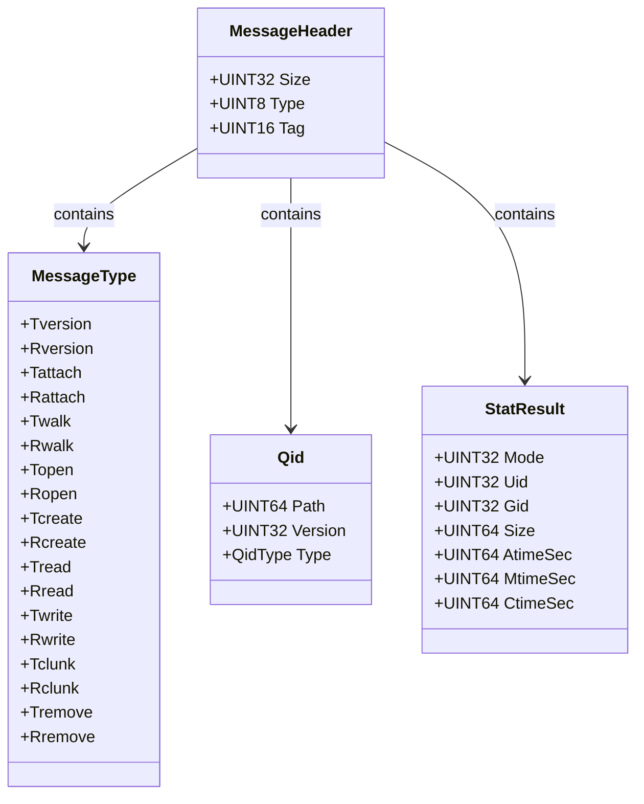
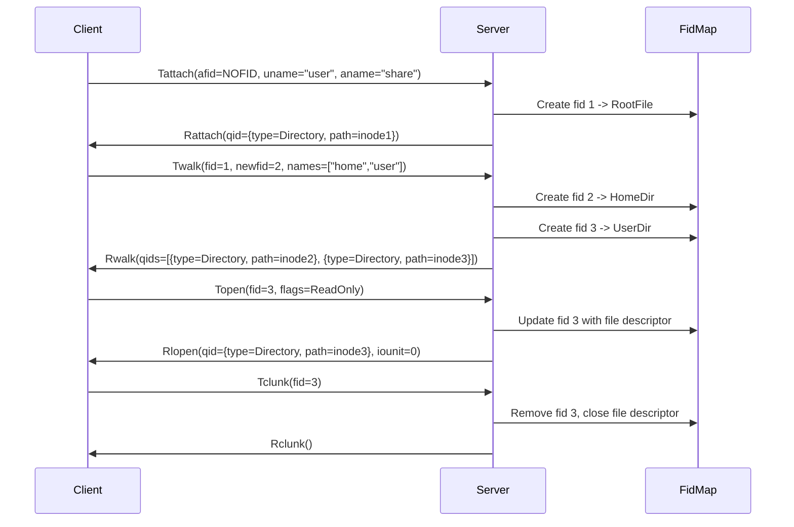
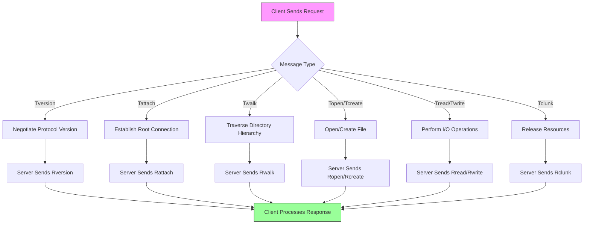
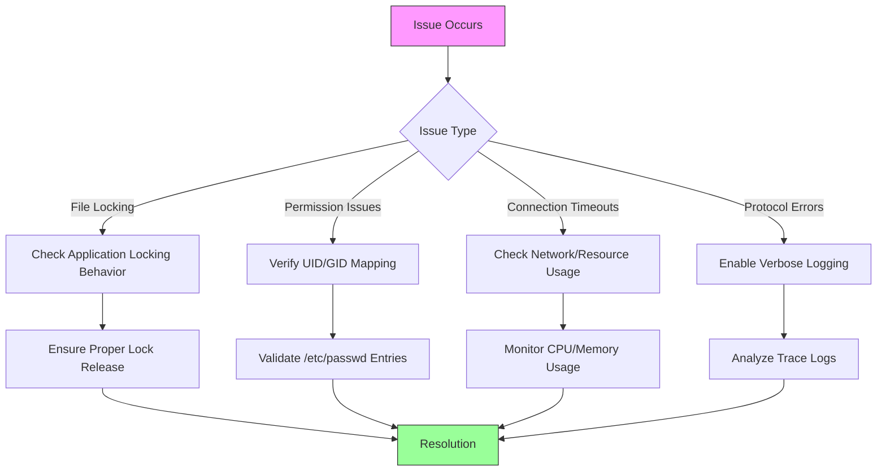

# Plan9 (9P) File Sharing

<cite>
**Referenced Files in This Document**   
- [p9fs.cpp](file://src/linux/plan9/p9fs.cpp)
- [p9handler.cpp](file://src/linux/plan9/p9handler.cpp)
- [p9io.cpp](file://src/linux/plan9/p9io.cpp)
- [p9defs.h](file://src/linux/plan9/p9defs.h)
- [p9fid.cpp](file://src/linux/plan9/p9fid.cpp)
- [p9file.cpp](file://src/linux/plan9/p9file.cpp)
- [p9util.cpp](file://src/linux/plan9/p9util.cpp)
- [p9tracelogging.cpp](file://src/linux/plan9/p9tracelogging.cpp)
- [lxtfs.c](file://test/linux/unit_tests/lxtfs.c)
- [plan9.cpp](file://src/linux/init/plan9.cpp)
</cite>

## Table of Contents
1. [Introduction](#introduction)
2. [Architecture Overview](#architecture-overview)
3. [9P2000.L Protocol Implementation](#9p2000l-protocol-implementation)
4. [Fid Management](#fid-management)
5. [Request-Response Flow](#request-response-flow)
6. [Configuration and Usage](#configuration-and-usage)
7. [Integration with Systemd and WSL Init](#integration-with-systemd-and-wsl-init)
8. [Performance Considerations](#performance-considerations)
9. [Common Issues and Debugging](#common-issues-and-debugging)
10. [Unit Testing and Expected Behavior](#unit-testing-and-expected-behavior)
11. [Conclusion](#conclusion)

## Introduction

The Plan9 (9P) file sharing system in Windows Subsystem for Linux (WSL) enables seamless access to Linux-hosted directories from Windows. This document provides a comprehensive analysis of the 9P2000.L protocol implementation that powers this functionality, detailing the architecture, protocol mechanics, and integration points between the Linux server and Windows client. The system allows users to access WSL filesystems through familiar Windows interfaces like Explorer via the \\wsl$ and \\wsl.localhost paths.

The implementation consists of a Linux-side server process that exposes filesystems using the 9P protocol, which is then accessed by a Windows kernel driver (p9rdr.sys) that translates Windows filesystem operations into 9P messages. This bidirectional communication enables cross-platform file access while maintaining appropriate permission models and file semantics. The documentation covers both beginner-friendly explanations of the client-server model and advanced technical details of the protocol implementation, including message serialization, fid management, and request-response flows.

**Section sources**
- [plan9.md](file://doc/docs/technical-documentation/plan9.md#L1-L19)

## Architecture Overview

The WSL 9P file sharing architecture follows a client-server model where the Linux distribution hosts a 9P server that exposes its filesystem to Windows clients. The architecture differs slightly between WSL1 and WSL2: in WSL1, the server communicates through a Unix socket, while in WSL2, it uses an hvsocket for communication between the Linux VM and Windows host. The Windows side employs a redirector driver (p9rdr.sys) that intercepts requests to \\wsl$ and \\wsl.localhost paths, forwarding them to the appropriate WSL distribution's 9P server.

The core components of the architecture include the 9P server implementation in the Linux distribution, which handles incoming requests and performs filesystem operations, and the Windows client components that translate Windows filesystem operations into 9P protocol messages. When a user accesses a WSL distribution through Windows Explorer, p9rdr.sys communicates with wslservice.exe via COM to start the distribution if necessary and establish a connection to its 9P server. This connection enables bidirectional file access, allowing Windows applications to read and write files in the Linux filesystem while respecting Linux permissions and file attributes.

```mermaid
graph TB
subgraph "Windows Host"
A[p9rdr.sys] --> B[wslservice.exe]
B --> C[Windows Explorer]
end
subgraph "WSL Distribution"
D[9P Server]
E[Linux Filesystem]
D --> E
end
A < --> |9P Protocol| D
B < --> |COM Interface| D
style A fill:#f9f,stroke:#333
style B fill:#bbf,stroke:#333
style C fill:#9f9,stroke:#333
style D fill:#f96,stroke:#333
style E fill:#99f,stroke:#333
```

**Diagram sources**
- [plan9.md](file://doc/docs/technical-documentation/plan9.md#L1-L19)
- [plan9.cpp](file://src/linux/init/plan9.cpp)

## 9P2000.L Protocol Implementation

The 9P2000.L protocol implementation in WSL provides a standardized interface for file operations between Windows and Linux systems. The protocol defines a set of message types for various filesystem operations, with request messages prefixed with 'T' and response messages prefixed with 'R'. Key message types include Tversion/Rversion for protocol negotiation, Tattach/Rattach for establishing connections, Twalk/Rwalk for directory traversal, and Tread/Rread and Twrite/Rwrite for file I/O operations. The implementation supports both the standard 9P2000.L protocol and Microsoft's 9P2000.W extension, which includes additional messages like Taccess and Twreaddir for improved functionality.

Message serialization follows the 9P protocol specification, with each message beginning with a 4-byte length field, followed by a 1-byte message type, and a 2-byte tag. The tag serves as a sequence number that allows the client and server to correlate requests with their corresponding responses. The server implementation in p9handler.cpp processes incoming messages by parsing the header, validating the message structure, and dispatching to the appropriate handler function based on the message type. Response messages are constructed with the same header format, ensuring proper correlation with the original request through the tag field.

The protocol implementation includes support for file attributes through the getattr/setattr messages, which use a bitmask to specify which attributes are being requested or modified. This allows efficient transmission of only the relevant metadata. The implementation also handles file locking through Tlock/Rlock and Tgetlock/Rgetlock messages, enabling coordination between processes accessing the same files from different operating systems. The server validates all incoming messages for proper formatting and enforces appropriate error handling, returning standardized error codes as defined in the 9P specification.



**Diagram sources**
- [p9defs.h](file://src/linux/plan9/p9defs.h#L12-L91)
- [p9handler.cpp](file://src/linux/plan9/p9handler.cpp#L23-L800)

## Fid Management

File identifier (fid) management is a critical component of the 9P protocol implementation, serving as the mechanism for tracking open files and directories between the client and server. In WSL's implementation, fids are represented as 32-bit unsigned integers that map to server-side file objects, allowing the client to reference files without knowing their underlying Linux paths. The fid lifecycle begins with the Tattach message, which establishes the initial connection and returns a fid representing the root directory, and continues through Twalk operations that traverse the directory hierarchy, creating new fids for each directory component.

The server maintains a mapping between fids and file objects using a thread-safe hash map protected by a shared mutex, as implemented in the Handler class in p9handler.cpp. Each fid is associated with a Fid object that encapsulates the current file state, including the file path relative to the share root, file descriptor (when opened), and Qid information. When a file is opened with Tlopen or Twopen, the corresponding Fid object is updated to include an open file descriptor and I/O issuer for asynchronous operations. The implementation ensures proper resource cleanup through the Tclunk message, which removes the fid from the mapping and closes any associated file descriptors.

Fid operations include cloning, which creates a new fid that references the same file object, and walking, which creates a new fid for a child directory or file. The walking operation performs security checks to prevent traversal into restricted filesystems like drvfs or other 9P mounts, ensuring isolation between different filesystem types. The implementation also handles fid reuse and validation, returning appropriate errors for invalid fids or operations on closed files. This fid-based approach enables stateful file operations while maintaining compatibility with the stateless nature of many Windows applications.



**Diagram sources**
- [p9handler.cpp](file://src/linux/plan9/p9handler.cpp#L342-L452)
- [p9fid.cpp](file://src/linux/plan9/p9fid.cpp#L1-L155)

## Request-Response Flow

The request-response flow in WSL's 9P implementation follows a structured pattern that ensures reliable communication between the Windows client and Linux server. The flow begins with connection establishment through the Tversion/Rversion exchange, where the client proposes a protocol version (9P2000.L or 9P2000.W) and message size, and the server responds with the negotiated values. This is followed by authentication (though currently not supported in WSL) and attachment via Tattach/Rattach, which establishes the initial file context with a fid representing the share root.

Subsequent operations follow a consistent pattern: the client sends a request message with a unique tag, the server processes the request and sends a response with the same tag, allowing the client to correlate responses with their corresponding requests. For file operations, this typically involves a sequence of Twalk messages to navigate to the target file or directory, followed by Topen/Tcreate to obtain a file handle, and then Tread/Twrite operations for data transfer. The server processes these messages asynchronously using a coroutine-based model, allowing it to handle multiple concurrent operations efficiently.

The implementation uses a message dispatcher in p9handler.cpp that routes incoming messages to specialized handler functions based on the message type. These handlers perform the appropriate filesystem operations, often using helper classes like CoroutineIoIssuer for asynchronous I/O and EpollWatcher for event notification. Error handling is consistent across operations, with the server returning standardized Linux error codes that are translated to appropriate Windows error codes by the client-side driver. The flow concludes with resource cleanup through Tclunk messages, which release server-side resources associated with fids.



**Diagram sources**
- [p9handler.cpp](file://src/linux/plan9/p9handler.cpp#L181-L290)
- [p9io.cpp](file://src/linux/plan9/p9io.cpp#L222-L262)

## Configuration and Usage

Configuring and using the 9P file sharing system in WSL involves setting up shared folders that can be accessed from Windows Explorer through the \\wsl$ or \\wsl.localhost paths. The system automatically exposes the entire Linux filesystem when a distribution is running, with no additional configuration required for basic access. Users can navigate to \\wsl.localhost\<distribution-name> in Windows Explorer to browse and manipulate files in the Linux environment, with full support for standard file operations like copy, move, delete, and edit.

For programmatic access, the 9P server is automatically started by the WSL init process when a distribution is launched, binding to either a Unix socket (WSL1) or hvsocket (WSL2). The server listens for incoming connections and handles authentication and attachment requests from the Windows client. Shared folders are managed through the /run/WSL directory in the Linux distribution, which serves as the mount point for WSL-specific filesystem operations. The implementation supports multiple concurrent connections, with a maximum connection count of 4096 as defined in the ShareList::MaximumConnectionCount method.

Access patterns follow standard filesystem semantics, with the 9P server translating Windows file operations into appropriate Linux system calls. File permissions are mapped between Windows and Linux models, with the server running as root to enable appropriate UID/GID switching for different users. The implementation supports symbolic links, hard links, and special files like FIFOs and device nodes, though some advanced filesystem features may have limitations due to the translation layer. Users can also access WSL files from command-line tools and scripts, enabling integration with Windows development workflows and automation.

**Section sources**
- [p9fs.cpp](file://src/linux/plan9/p9fs.cpp#L67-L72)
- [plan9.md](file://doc/docs/technical-documentation/plan9.md#L13-L19)

## Integration with Systemd and WSL Init

The 9P file sharing system integrates with systemd and the WSL init process to ensure automatic service startup and proper lifecycle management. In distributions that use systemd, the 9P server is launched as part of the init process, which is responsible for starting essential system services. The init process, implemented in plan9.cpp, creates and configures the 9P server socket, binds it to the appropriate address (Unix socket for WSL1, hvsocket for WSL2), and starts listening for incoming connections from Windows clients.

The integration with systemd follows standard service management patterns, with the 9P server registered as a system service that starts during the boot process. The server implementation includes proper signal handling and graceful shutdown procedures, allowing it to respond to systemd stop commands and clean up resources before termination. When a distribution is shut down, either through systemd shutdown or WSL termination, the 9P server is stopped and its socket is closed, ensuring clean state transitions.

The init process also handles configuration and parameter passing to the 9P server, including the socket path, maximum message size, and share configuration. It monitors the server's health and can restart it if necessary, though the current implementation focuses on single-instance operation. The integration ensures that the 9P server is available whenever the distribution is running, providing seamless file access without requiring manual service management by the user.

**Section sources**
- [plan9.cpp](file://src/linux/init/plan9.cpp)
- [plan9.md](file://doc/docs/technical-documentation/plan9.md#L3-L12)

## Performance Considerations

The performance of the 9P file sharing system in WSL involves several factors related to cross-OS communication, protocol translation, and I/O operations. The implementation includes various optimizations to minimize latency and maximize throughput, particularly for common file operations. One key consideration is the use of asynchronous I/O operations through the CoroutineIoIssuer class, which leverages Linux's AIO (asynchronous I/O) subsystem to perform non-blocking file operations. This allows the server to handle multiple concurrent requests efficiently without blocking threads on I/O operations.

Buffering strategies are employed to optimize data transfer, with the server using a stack-allocated response buffer of 256 bytes for small messages and dynamically allocating larger buffers when needed. The maximum message size is negotiated during the Tversion exchange, allowing clients and servers to optimize for their specific use cases. For large file transfers, the implementation uses direct I/O operations with appropriate buffer sizing to minimize system call overhead and maximize throughput.

CPU overhead is minimized through efficient message parsing and handling, with the server using span-based readers and writers to avoid unnecessary data copying. The use of coroutines and async/await patterns enables efficient concurrency without the overhead of thread creation and context switching. However, there are inherent performance costs associated with cross-OS calls, including context switching between the Linux VM and Windows host (in WSL2), protocol serialization/deserialization, and permission mapping between Windows and Linux security models.

Latency can be affected by several factors, including network stack overhead (for hvsocket communication in WSL2), filesystem type (ext4 vs. NTFS), and the complexity of permission checks. The implementation includes optimizations like caching group ID lookups and minimizing system calls for common operations. For high-performance scenarios, users are advised to minimize cross-filesystem operations and use appropriate file buffering strategies in their applications.

**Section sources**
- [p9handler.cpp](file://src/linux/plan9/p9handler.cpp#L18-L19)
- [p9io.cpp](file://src/linux/plan9/p9io.cpp#L264-L294)
- [p9util.cpp](file://src/linux/plan9/p9util.cpp#L151-L185)

## Common Issues and Debugging

Common issues with the WSL 9P file sharing system include file locking conflicts, permission mapping discrepancies, and connection timeouts. File locking conflicts can occur when applications on both Windows and Linux attempt to access the same file simultaneously, particularly with exclusive locks. The implementation supports the 9P lock protocol, but applications must be designed to handle cross-platform locking semantics appropriately. Permission mapping issues arise from differences between Windows ACLs and Linux POSIX permissions, with the server using UID/GID switching to map Windows users to appropriate Linux identities.

Connection timeouts may occur due to network issues in WSL2 (hvsocket communication) or resource constraints on either the client or server side. The server includes connection tracking through the WaitGroup class, which monitors active connections and ensures proper cleanup when connections are terminated. Debugging these issues is facilitated by comprehensive trace logging implemented in p9tracelogging.cpp, which provides detailed information about server operations, connection events, and error conditions.

The trace logging system supports multiple verbosity levels, from critical errors to detailed verbose output, allowing administrators to diagnose issues without overwhelming log output. Key diagnostic events include connection acceptance and disconnection, protocol errors, and performance metrics. The logging provider can be configured to write to a specified file descriptor, enabling integration with system monitoring tools. For troubleshooting, users can enable verbose logging to capture detailed information about specific operations, then analyze the logs to identify patterns or errors.



**Diagram sources**
- [p9tracelogging.cpp](file://src/linux/plan9/p9tracelogging.cpp#L143-L209)
- [p9handler.cpp](file://src/linux/plan9/p9handler.cpp#L297-L339)

## Unit Testing and Expected Behavior

The 9P file sharing implementation includes comprehensive unit testing to verify expected behavior for file operations, directory traversal, and error handling. The test suite, implemented in lxtfs.c, covers a wide range of scenarios including file creation, deletion, renaming, and attribute modification. Tests validate both positive cases, where operations should succeed, and negative cases, where appropriate error codes should be returned for invalid operations.

Key test areas include directory operations such as creating and removing directories, traversing directory hierarchies, and handling special directory entries like "." and "..". File operations are tested for proper handling of read/write operations at various offsets, file truncation, and sparse file creation. The test suite also verifies correct behavior for edge cases like attempting to remove a directory with "." or "..", handling deleted files and directories, and managing file descriptors for deleted files.

The implementation demonstrates expected behavior for timestamp operations, with tests verifying that access, modification, and change times are updated correctly according to POSIX semantics. File locking behavior is tested to ensure proper coordination between processes, and permission checks are validated to confirm appropriate access control. The test suite also includes validation of protocol-specific behavior, such as proper fid management, message serialization, and error handling for malformed requests.

These tests serve as both verification of current functionality and documentation of expected behavior, helping to ensure the stability and reliability of the 9P file sharing system across different WSL versions and configurations.

**Section sources**
- [lxtfs.c](file://test/linux/unit_tests/lxtfs.c#L1-L800)
- [p9file.cpp](file://src/linux/plan9/p9file.cpp#L126-L474)

## Conclusion

The Plan9 (9P) file sharing system in WSL provides a robust and efficient mechanism for accessing Linux-hosted directories from Windows. Through the implementation of the 9P2000.L protocol, the system enables seamless integration between the two operating systems, allowing users to leverage the strengths of both environments in their workflows. The architecture, combining a Linux-side server with a Windows kernel driver, creates a transparent bridge that handles the complexities of cross-platform file access while presenting a familiar interface to users.

The implementation demonstrates careful attention to performance, security, and reliability, with optimizations for asynchronous I/O, comprehensive error handling, and proper resource management. The integration with systemd and the WSL init process ensures automatic service startup and proper lifecycle management, while the comprehensive testing suite validates expected behavior across a wide range of scenarios. Despite inherent challenges in translating between different filesystem models and permission systems, the 9P implementation provides a stable and efficient solution for cross-platform file sharing.

Future enhancements could include improved performance for high-throughput scenarios, expanded support for advanced filesystem features, and enhanced debugging tools. However, the current implementation already provides a solid foundation for development workflows that span Windows and Linux environments, enabling users to work seamlessly across both platforms without compromising on functionality or performance.