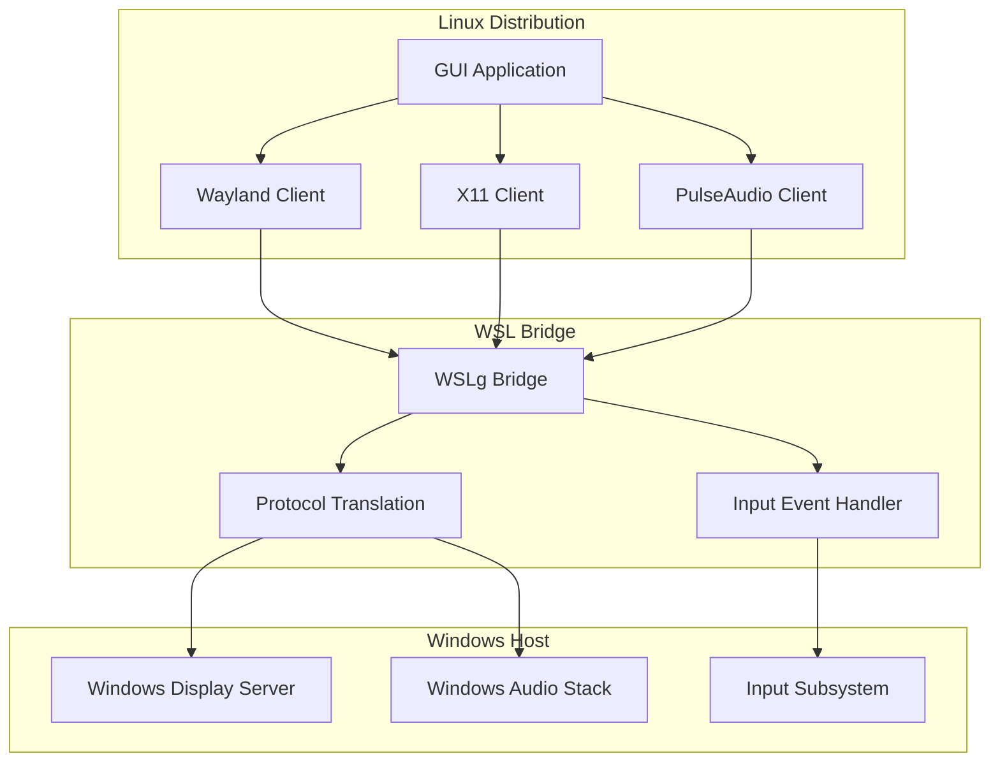
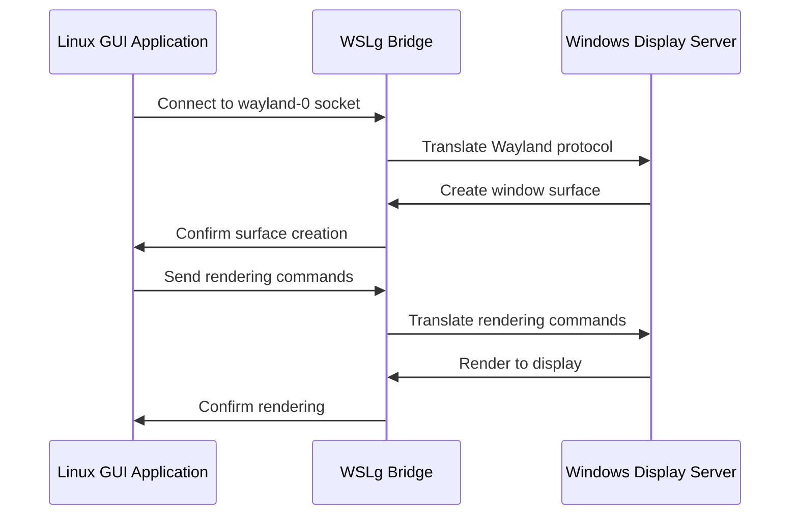
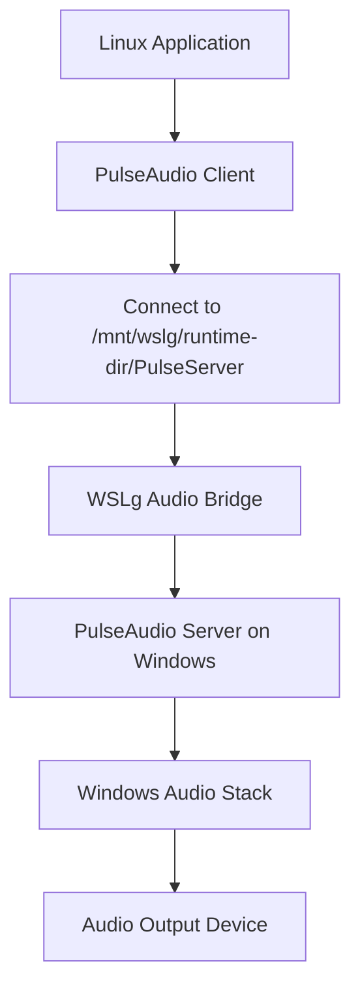

# GUI Applications

<cite>
**Referenced Files in This Document**   
- [main.cpp](file://src/windows/wslg/main.cpp)
- [config.cpp](file://src/linux/init/config.cpp)
- [init.cpp](file://src/linux/init/init.cpp)
- [lxinitshared.h](file://src/shared/inc/lxinitshared.h)
- [wslg.exe.md](file://doc/docs/technical-documentation/wslg.exe.md)
- [UnitTests.cpp](file://test/windows/UnitTests.cpp)
- [OptionalFeaturesViewModel.cs](file://src/windows/wslsettings/ViewModels/Settings/OptionalFeaturesViewModel.cs)
- [OOBEWindow.xaml.cs](file://src/windows/wslsettings/Windows/OOBEWindow.xaml.cs)
</cite>

## Table of Contents
1. [Introduction](#introduction)
2. [Architecture Overview](#architecture-overview)
3. [Core Components](#core-components)
4. [Wayland and X11 Protocol Support](#wayland-and-x11-protocol-support)
5. [Audio Forwarding Implementation](#audio-forwarding-implementation)
6. [Input Event Handling](#input-event-handling)
7. [Configuration Options and Environment Variables](#configuration-options-and-environment-variables)
8. [Integration with Windows Display and Audio Subsystems](#integration-with-windows-display-and-audio-subsystems)
9. [Common Issues and Solutions](#common-issues-and-solutions)
10. [Troubleshooting Guide](#troubleshooting-guide)

## Introduction
WSLg (Windows Subsystem for Linux GUI) enables Linux GUI applications to run seamlessly on Windows desktop environments. This document provides a comprehensive technical analysis of the WSLg architecture, focusing on the implementation details that enable graphics protocol translation, audio forwarding, and input event handling between Linux applications and the Windows host system. The documentation is designed to be accessible to beginners while providing sufficient technical depth for experienced developers regarding the underlying mechanisms of graphics protocol translation and multimedia streaming.

## Architecture Overview
The WSLg architecture consists of multiple components working together to enable Linux GUI applications on Windows. At its core, WSLg uses a combination of Wayland and X11 protocols to translate Linux graphical operations into Windows-compatible formats. The system creates a shared folder at `/mnt/wslg` that serves as a communication channel between the Linux distribution and Windows host. This shared folder contains runtime directories for Wayland and PulseAudio sockets, enabling seamless integration of graphical and audio components.

The architecture follows a client-server model where Linux GUI applications act as clients connecting to display servers running on the Windows side. The wslg.exe component acts as a bridge, managing the communication between Linux applications and Windows display subsystems. When a Linux GUI application is launched, the system automatically configures the necessary environment variables and establishes connections to the appropriate display and audio servers.

**Diagram sources**
- [main.cpp](file://src/windows/wslg/main.cpp)
- [config.cpp](file://src/linux/init/config.cpp)

**Section sources**
- [main.cpp](file://src/windows/wslg/main.cpp)
- [config.cpp](file://src/linux/init/config.cpp)

## Core Components
The WSLg system comprises several key components that work together to enable GUI application support. The wslg.exe executable serves as the entry point for GUI applications, functioning as a Win32 application that can start without creating a console window. This allows graphical applications to launch directly with proper window management integration.

The configuration system initializes GUI support by setting up environment variables and creating necessary directory structures. When WSL starts, it checks for GUI application support configuration in `/etc/wsl.conf` and sets up the appropriate environment. The system creates a tmpfs mount at `/mnt/wslg` to facilitate shared access between user and system distributions.

The environment variable configuration is critical to the operation of WSLg, as it directs Linux applications to the appropriate display and audio servers. These variables include DISPLAY for X11 applications, WAYLAND_DISPLAY for Wayland clients, and PULSE_SERVER for audio output. The configuration also sets XDG_RUNTIME_DIR to point to the shared runtime directory where socket files are created.

**Section sources**
- [main.cpp](file://src/windows/wslg/main.cpp#L15-L21)
- [config.cpp](file://src/linux/init/config.cpp#L1779-L1788)
- [init.cpp](file://src/linux/init/init.cpp#L279-L284)

## Wayland and X11 Protocol Support
WSLg provides comprehensive support for both Wayland and X11 protocols, allowing Linux GUI applications to use their preferred display server protocol. The system implements protocol translation by creating socket files in the shared `/mnt/wslg` directory that are accessible from both Linux and Windows sides.

For Wayland applications, the system sets the WAYLAND_DISPLAY environment variable to "wayland-0" and creates the corresponding socket file at `/mnt/wslg/runtime-dir/wayland-0`. This socket is then made available to Linux applications through a bind mount to `$XDG_RUNTIME_DIR/wayland-0`. The Wayland protocol translation handles surface creation, input events, and buffer management, converting Wayland protocol messages to Windows-compatible operations.

X11 support is implemented through a similar mechanism, with the DISPLAY environment variable set to ":0" and an X11 socket created at `/tmp/.X11-unix/X0`. This socket is mounted from the shared WSLg folder, allowing X11 applications to connect to the display server running on Windows. The X11 protocol translation handles window management, graphics rendering commands, and event processing, ensuring compatibility with traditional X11 applications.

**Diagram sources**
- [config.cpp](file://src/linux/init/config.cpp#L1783-L1785)
- [init.cpp](file://src/linux/init/init.cpp#L281-L282)

**Section sources**
- [config.cpp](file://src/linux/init/config.cpp#L601-L617)
- [init.cpp](file://src/linux/init/init.cpp#L279-L284)

## Audio Forwarding Implementation
Audio forwarding in WSLg is implemented using PulseAudio, with the system configuring the PULSE_SERVER environment variable to point to a Unix socket in the shared WSLg directory. The PulseAudio server runs on the Windows side, receiving audio streams from Linux applications and routing them through the Windows audio stack.

The audio forwarding mechanism creates a socket file at `/mnt/wslg/runtime-dir/PulseServer` which is then made available to Linux applications through a symbolic link at `$XDG_RUNTIME_DIR/pulse/native`. This allows PulseAudio clients in the Linux distribution to connect to the server running on Windows, enabling seamless audio playback from Linux applications.

The implementation handles audio format conversion, sample rate matching, and latency optimization to provide high-quality audio output. The system also manages audio device enumeration, allowing Linux applications to discover available audio output devices on the Windows host. Volume control and audio stream management are handled through the standard PulseAudio interface, providing a familiar experience for Linux users.

**Diagram sources**
- [config.cpp](file://src/linux/init/config.cpp#L1786)
- [init.cpp](file://src/linux/init/init.cpp#L283)

**Section sources**
- [config.cpp](file://src/linux/init/config.cpp#L1779-L1787)
- [init.cpp](file://src/linux/init/init.cpp#L279-L284)

## Input Event Handling
Input event handling in WSLg is implemented through a bidirectional communication channel that translates Windows input events into Linux-compatible formats and vice versa. The system captures mouse movements, keyboard input, and other user interactions from the Windows input subsystem and forwards them to the appropriate Linux GUI application.

The input event handler processes Windows messages such as WM_MOUSEMOVE, WM_LBUTTONDOWN, and WM_KEYDOWN, translating them into corresponding X11 or Wayland protocol messages. For Wayland clients, these are translated into wl_pointer and wl_keyboard events, while X11 clients receive standard X11 input events. The system maintains proper focus management, ensuring that input events are delivered to the currently active Linux application window.

The implementation also handles more complex input scenarios such as drag-and-drop operations, clipboard sharing, and touch input (where supported). The input event handler manages coordinate translation, accounting for display scaling and multiple monitor configurations to ensure accurate pointer positioning.

**Section sources**
- [OOBEWindow.xaml.cs](file://src/windows/wslsettings/Windows/OOBEWindow.xaml.cs#L91-L99)
- [config.cpp](file://src/linux/init/config.cpp)

## Configuration Options and Environment Variables
WSLg functionality can be controlled through various configuration options and environment variables. The primary configuration is managed through `/etc/wsl.conf` in the Linux distribution, where the `guiApplications` option can be set to enable or disable GUI support.

Key environment variables configured by WSLg include:
- **DISPLAY**: Set to ":0" for X11 applications
- **WAYLAND_DISPLAY**: Set to "wayland-0" for Wayland clients
- **XDG_RUNTIME_DIR**: Points to the shared runtime directory
- **PULSE_SERVER**: Specifies the PulseAudio server socket
- **WSL_INTEROP**: Contains inter-process communication information

The system also supports configuration through the Windows `.wslconfig` file, where the `GUIApplicationsEnabled` setting can control GUI support at the distribution level. These configuration options allow users to customize the behavior of WSLg according to their specific requirements.

**Section sources**
- [config.cpp](file://src/linux/init/config.cpp#L1783-L1787)
- [OptionalFeaturesViewModel.cs](file://src/windows/wslsettings/ViewModels/Settings/OptionalFeaturesViewModel.cs#L51-L55)
- [UnitTests.cpp](file://test/windows/UnitTests.cpp#L2208-L2222)

## Integration with Windows Display and Audio Subsystems
WSLg integrates deeply with Windows display and audio subsystems to provide a seamless user experience. The display integration leverages the Windows Display Driver Model (WDDM) to render Linux application windows alongside native Windows applications. Each Linux GUI application window is managed by the Windows window manager, supporting standard window operations like resizing, minimizing, and maximizing.

The audio integration connects to the Windows Audio Session API (WASAPI), allowing Linux application audio to be managed through the standard Windows volume mixer. This enables per-application volume control and audio routing options familiar to Windows users. The integration also supports modern audio features like spatial sound and audio enhancements when available.

The system handles display scaling and DPI awareness, ensuring that Linux application windows appear correctly on high-DPI displays. When display scaling changes, the system adjusts window sizes and font rendering accordingly. This integration provides a consistent user experience across different display configurations.

**Section sources**
- [OOBEWindow.xaml.cs](file://src/windows/wslsettings/Windows/OOBEWindow.xaml.cs#L110-L124)
- [config.cpp](file://src/linux/init/config.cpp)

## Common Issues and Solutions
Several common issues may arise when using WSLg for GUI applications, along with their corresponding solutions:

**Display Scaling Problems**: On high-DPI displays, Linux applications may appear too small or too large. This can be addressed by ensuring proper DPI detection and scaling configuration. The system automatically handles DPI changes, but applications should be designed to respond appropriately to scaling events.

**Audio Latency**: Some users may experience audio latency or stuttering. This can be mitigated by adjusting PulseAudio buffer sizes and ensuring the Windows audio service is properly configured. Using the default audio endpoint and avoiding unnecessary audio processing can also improve performance.

**Input Focus Issues**: Occasionally, input focus may not properly transfer between Windows and Linux applications. This is typically resolved by ensuring the input event handler is correctly managing focus state and properly forwarding activation messages between the systems.

**Missing GUI Support**: If GUI applications fail to start, verify that GUI support is enabled in both `/etc/wsl.conf` and the Windows `.wslconfig` file. The error message "GUI application support is disabled" indicates that one of these configuration files has disabled GUI applications.

**Section sources**
- [UnitTests.cpp](file://test/windows/UnitTests.cpp#L2227-L2230)
- [OOBEWindow.xaml.cs](file://src/windows/wslsettings/Windows/OOBEWindow.xaml.cs#L80-L88)

## Troubleshooting Guide
When encountering issues with WSLg GUI applications, follow these troubleshooting steps:

1. **Verify GUI Support is Enabled**: Check that GUI applications are enabled in both `/etc/wsl.conf` and the Windows `.wslconfig` file. The absence of DISPLAY and WAYLAND_DISPLAY environment variables indicates disabled GUI support.

2. **Check Environment Variables**: Use the `env | grep DISPLAY` and `env | grep WAYLAND_DISPLAY` commands to verify that the necessary environment variables are set correctly.

3. **Validate Socket Files**: Ensure that the X11 and Wayland socket files exist in the expected locations (`/tmp/.X11-unix/X0` and `$XDG_RUNTIME_DIR/wayland-0`).

4. **Test Audio Configuration**: Verify that the PULSE_SERVER environment variable is set and that the PulseAudio socket is accessible.

5. **Review System Logs**: Check WSL logs for any error messages related to GUI application initialization or display server connection issues.

**Section sources**
- [UnitTests.cpp](file://test/windows/UnitTests.cpp#L2186-L2198)
- [config.cpp](file://src/linux/init/config.cpp#L1077-L1085)