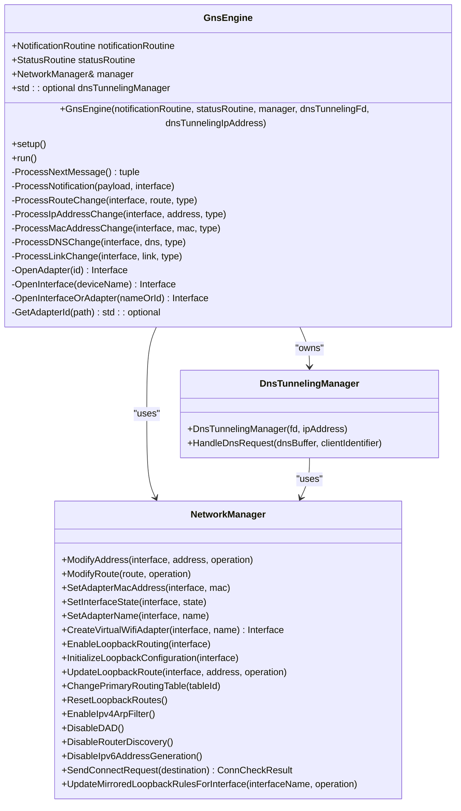
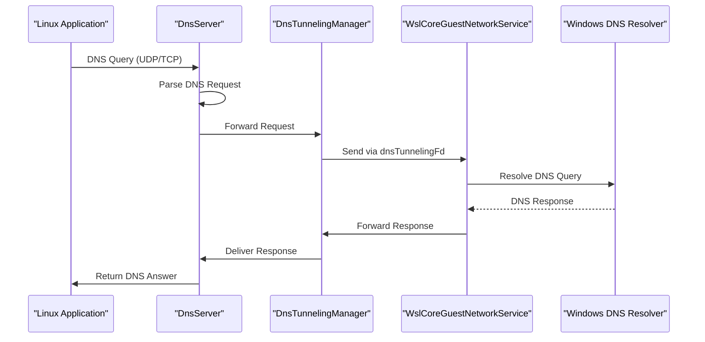
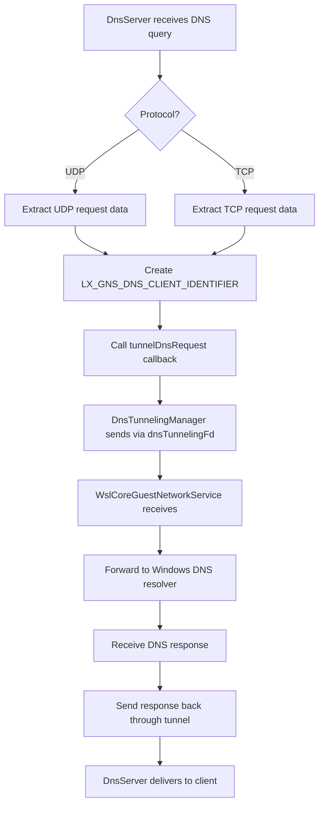
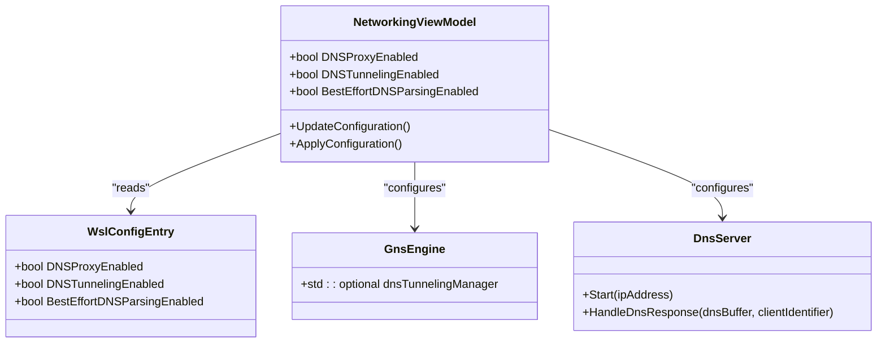
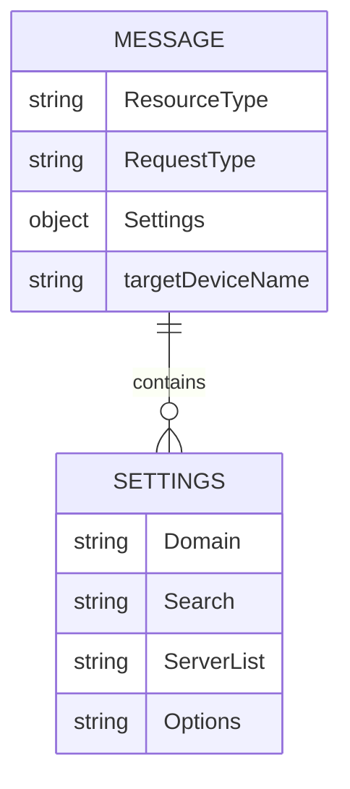
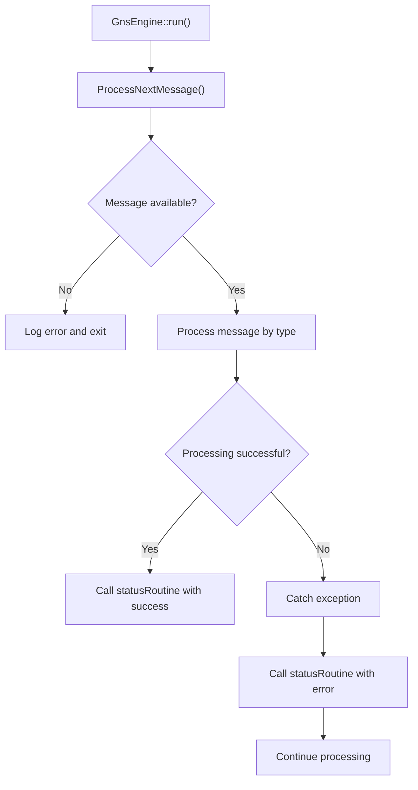

# DNS Proxy and Resolution

<cite>
**Referenced Files in This Document**   
- [GnsEngine.cpp](file://src\linux\init\GnsEngine.cpp)
- [GnsEngine.h](file://src\linux\init\GnsEngine.h)
- [DnsServer.cpp](file://src\linux\init\DnsServer.cpp)
- [DnsServer.h](file://src\linux\init\DnsServer.h)
- [DnsTunnelingManager.cpp](file://src\linux\init\DnsTunnelingManager.cpp)
- [DnsTunnelingManager.h](file://src\linux\init\DnsTunnelingManager.h)
- [hns_schema.h](file://src\shared\inc\hns_schema.h)
- [NetworkManager.cpp](file://src\linux\init\NetworkManager.cpp)
- [NetworkManager.h](file://src\linux\init\NetworkManager.h)
- [WslCoreGuestNetworkService.cpp](file://src\windows\service\exe\WslCoreGuestNetworkService.cpp)
- [WslCoreGuestNetworkService.h](file://src\windows\service\exe\WslCoreGuestNetworkService.h)
</cite>

## Table of Contents
1. [Introduction](#introduction)
2. [GNS Engine Architecture](#gns-engine-architecture)
3. [DNS Resolution Workflow](#dns-resolution-workflow)
4. [DNS Tunneling Mechanism](#dns-tunneling-mechanism)
5. [Configuration Options](#configuration-options)
6. [JSON Message Format](#json-message-format)
7. [Error Handling and Status Reporting](#error-handling-and-status-reporting)
8. [Troubleshooting Guide](#troubleshooting-guide)
9. [Conclusion](#conclusion)

## Introduction

The Windows Subsystem for Linux (WSL) DNS resolution system utilizes the Guest Name Service (GNS) to provide seamless DNS resolution between Windows and Linux environments. This document details the implementation of the GnsEngine, which serves as the core component for managing DNS resolution, network configuration, and communication between WSL and Windows networking components. The system enables WSL distributions to leverage Windows DNS infrastructure while maintaining Linux network stack compatibility.

The GNS architecture integrates with Windows Host Network Service (HNS) through the hns_schema.h definitions, allowing for coordinated network management between the host and guest operating systems. Key components include the GnsEngine for message processing, DnsServer for handling DNS requests, and DnsTunnelingManager for forwarding DNS queries to Windows.

**Section sources**
- [GnsEngine.cpp](file://src\linux\init\GnsEngine.cpp#L1-L50)
- [hns_schema.h](file://src\shared\inc\hns_schema.h#L1-L50)

## GNS Engine Architecture

The GnsEngine class serves as the central message processing component for WSL's networking system. It implements a message-driven architecture that processes notifications from Windows and applies corresponding network configuration changes in the Linux environment.



**Diagram sources**
- [GnsEngine.h](file://src\linux\init\GnsEngine.h#L14-L78)
- [NetworkManager.h](file://src\linux\init\NetworkManager.h#L1-L100)
- [DnsTunnelingManager.h](file://src\linux\init\DnsTunnelingManager.h#L1-L50)

The GnsEngine constructor initializes the component with essential parameters including notification and status routines, a reference to the NetworkManager, and optional DNS tunneling parameters. When DNS tunneling is enabled, the constructor adds the specified IP address to the loopback interface and creates a DnsTunnelingManager instance to handle DNS forwarding.

The engine's message processing loop, implemented in the `run()` method, continuously processes incoming messages through the notification routine. Each message is parsed and dispatched to the appropriate handler based on its type, enabling the engine to respond to various network configuration changes, DNS updates, and system events.

**Section sources**
- [GnsEngine.cpp](file://src\linux\init\GnsEngine.cpp#L27-L45)
- [GnsEngine.cpp](file://src\linux\init\GnsEngine.cpp#L724-L752)

## DNS Resolution Workflow

The DNS resolution workflow in WSL's GNS system follows a coordinated process between the Linux distribution and Windows host. When a DNS query is initiated within WSL, it is intercepted by the DnsServer component and forwarded to Windows for resolution through the DNS tunneling mechanism.



**Diagram sources**
- [DnsServer.cpp](file://src\linux\init\DnsServer.cpp#L1-L427)
- [DnsTunnelingManager.cpp](file://src\linux\init\DnsTunnelingManager.cpp#L1-L200)
- [WslCoreGuestNetworkService.cpp](file://src\windows\service\exe\WslCoreGuestNetworkService.cpp#L1-L150)

The DnsServer component listens on port 53 for both UDP and TCP DNS requests. It uses an epoll-based event loop to efficiently handle multiple concurrent connections. For UDP requests, the server tracks each request with a unique identifier and the client's socket address. For TCP connections, it maintains connection context including the file descriptor and current request state.

When a DNS request is received, the DnsServer extracts the query data and forwards it to the DnsTunnelingManager, which transmits the request through the dnsTunnelingFd file descriptor to the Windows host. The Windows DNS resolver processes the query and returns the response, which follows the reverse path back to the original Linux application.

**Section sources**
- [DnsServer.cpp](file://src\linux\init\DnsServer.cpp#L30-L50)
- [DnsServer.cpp](file://src\linux\init\DnsServer.cpp#L302-L349)

## DNS Tunneling Mechanism

The DNS tunneling mechanism enables WSL to leverage Windows' DNS resolution capabilities by forwarding DNS queries from the Linux environment to Windows. This is achieved through the dnsTunnelingFd file descriptor and dnsTunnelingIpAddress parameters that are passed to the GnsEngine during initialization.



**Diagram sources**
- [GnsEngine.cpp](file://src\linux\init\GnsEngine.cpp#L35-L44)
- [DnsServer.cpp](file://src\linux\init\DnsServer.cpp#L21-L22)
- [DnsTunnelingManager.cpp](file://src\linux\init\DnsTunnelingManager.cpp#L1-L100)

The dnsTunnelingFd parameter is a file descriptor that represents a communication channel between WSL and the Windows host. When the GnsEngine is initialized with a valid dnsTunnelingFd, it creates a DnsTunnelingManager instance that uses this file descriptor to send DNS requests to Windows. The dnsTunnelingIpAddress parameter specifies the IP address that should be configured on the loopback interface to receive DNS responses.

During initialization, the GnsEngine adds the dnsTunnelingIpAddress to the loopback interface (lo), allowing the DnsServer to bind to this address and receive DNS responses from Windows. This setup enables bidirectional DNS communication: queries are sent from Linux to Windows through the tunnel, and responses are returned to Linux via the loopback interface.

The tunneling process preserves the original DNS protocol (UDP or TCP) and includes a unique client identifier to correlate requests with responses. This ensures that DNS queries from multiple applications or concurrent connections are properly handled and responses are delivered to the correct client.

**Section sources**
- [GnsEngine.cpp](file://src\linux\init\GnsEngine.cpp#L35-L44)
- [DnsServer.h](file://src\linux\init\DnsServer.h#L9-L13)
- [DnsTunnelingManager.h](file://src\linux\init\DnsTunnelingManager.h#L1-L20)

## Configuration Options

WSL's DNS resolution system provides several configuration options that control the behavior of the DNS proxy and tunneling features. These options are exposed through the NetworkingViewModel and can be controlled via WSL configuration settings.

### DNS Proxy Configuration

The DNS proxy functionality is controlled by the `WslConfigEntry.DNSProxyEnabled` setting. When enabled, WSL intercepts DNS queries from the Linux distribution and forwards them to Windows for resolution. This allows WSL to leverage Windows' DNS infrastructure, including enterprise DNS configurations, DNS over HTTPS, and other Windows-specific DNS features.

### DNS Tunneling Configuration

The `DNSTunnelingEnabled` configuration option determines whether DNS tunneling is active. When enabled, DNS queries are forwarded from WSL to Windows through the dnsTunnelingFd channel. This setting works in conjunction with DNSProxyEnabled to provide a complete DNS resolution solution.

### Best Effort DNS Parsing

The `BestEffortDNSParsingEnabled` option controls the behavior of DNS message parsing. When enabled, the system attempts to parse and process DNS messages even if they contain non-standard or malformed data. This provides greater compatibility with various DNS clients and servers but may introduce security considerations.



**Diagram sources**
- [GnsEngine.h](file://src\linux\init\GnsEngine.h#L31-L32)
- [NetworkingViewModel.cs](file://src\wslsettings\ViewModels\Settings\NetworkingViewModel.cs#L1-L50)
- [WslConfigEntry.h](file://src\shared\configfile\configfile.h#L1-L20)

These configuration options can be set globally for all WSL distributions or on a per-distribution basis, providing flexibility in managing DNS resolution behavior across different Linux environments.

**Section sources**
- [GnsEngine.h](file://src\linux\init\GnsEngine.h#L31-L32)
- [NetworkingViewModel.cs](file://src\wslsettings\ViewModels\Settings\NetworkingViewModel.cs#L1-L100)

## JSON Message Format

The GNS system uses a standardized JSON message format for communication between WSL components and the Windows host. This format is defined in the hns_schema.h header file and follows a consistent structure for different types of network configuration messages.

```json
{
  "ResourceType": "DNS",
  "RequestType": "Add",
  "Settings": {
    "Domain": "contoso.com",
    "Search": "corp.contoso.com,int.contoso.com",
    "ServerList": "10.0.0.1,10.0.0.2",
    "Options": "# Managed by WSL\n"
  },
  "targetDeviceName": "eth0"
}
```

The JSON message structure includes several key fields:

- **ResourceType**: Specifies the type of network resource being modified (DNS, Route, IPAddress, MacAddress, Interface)
- **RequestType**: Indicates the operation to perform (Add, Remove, Update, Refresh, Reset)
- **Settings**: Contains the specific configuration data for the resource
- **targetDeviceName**: Optional field specifying the network interface to which the change applies

For DNS messages, the Settings object includes:
- **Domain**: The default domain name for DNS resolution
- **Search**: A comma-separated list of search domains
- **ServerList**: A comma-separated list of DNS server IP addresses
- **Options**: Additional configuration options, often used for file headers

The message format is designed to be extensible, allowing for new resource types and settings to be added without breaking existing implementations. The use of JSON provides a human-readable, structured format that is easy to parse and validate.



**Diagram sources**
- [hns_schema.h](file://src\shared\inc\hns_schema.h#L209-L217)
- [GnsEngine.cpp](file://src\linux\init\GnsEngine.cpp#L294-L338)

The JSON messages are processed by the GnsEngine's ProcessNotification method, which dispatches them to the appropriate handler based on the ResourceType field. This modular design allows for easy extension of the system to support new network configuration types.

**Section sources**
- [hns_schema.h](file://src\shared\inc\hns_schema.h#L209-L217)
- [GnsEngine.cpp](file://src\linux\init\GnsEngine.cpp#L147-L188)

## Error Handling and Status Reporting

The GNS system implements comprehensive error handling and status reporting mechanisms to ensure reliable operation and provide diagnostic information when issues occur.

### Notification Routine

The NotificationRoutine is a callback function that provides incoming messages to the GnsEngine. It returns an optional Message structure containing the message type, JSON payload, and adapter identifier. When no message is available, it returns an empty optional, which causes the GnsEngine to terminate gracefully.



**Diagram sources**
- [GnsEngine.cpp](file://src\linux\init\GnsEngine.cpp#L724-L752)
- [GnsEngine.h](file://src\linux\init\GnsEngine.h#L24-L25)

### Status Routine

The StatusRoutine is a callback function used for reporting the outcome of message processing. It accepts an integer return value and a string message. The return value typically indicates success (0) or failure (-1), while the message provides additional context about the operation.

When a message is processed successfully, the status routine is called with a return value of 0 and an empty message. If an error occurs during processing, the routine is called with a return value of -1 and a descriptive error message. This allows the calling system to monitor the health of the GNS engine and take appropriate action when errors occur.

### Exception Handling

The GnsEngine implements robust exception handling around its message processing loop. All message processing occurs within a try-catch block that captures any exceptions thrown during processing. When an exception is caught, it is logged with detailed information, and the status routine is called to report the error.

This approach ensures that transient errors do not cause the GNS engine to terminate unexpectedly, while still providing visibility into issues that require attention. The engine continues processing subsequent messages even after encountering errors, maintaining overall system stability.

**Section sources**
- [GnsEngine.cpp](file://src\linux\init\GnsEngine.cpp#L724-L752)
- [GnsEngine.h](file://src\linux\init\GnsEngine.h#L25-L30)

## Troubleshooting Guide

This section addresses common issues with WSL's DNS resolution system and provides guidance for diagnosis and resolution.

### DNS Resolution Failures

When DNS resolution fails in WSL, follow these steps to diagnose the issue:

1. **Verify DNS proxy configuration**: Check that `DNSProxyEnabled` is set to true in the WSL configuration.
2. **Check network connectivity**: Ensure that the WSL distribution can reach the Windows host.
3. **Verify DNS server configuration**: Confirm that `/etc/resolv.conf` contains the expected DNS server addresses.
4. **Test DNS resolution**: Use tools like `nslookup` or `dig` to test DNS resolution from within WSL.

Common causes of DNS resolution failures include:
- Misconfigured WSL network settings
- Firewall rules blocking DNS traffic
- Issues with the DNS tunneling channel
- Problems with Windows DNS resolution

### Timeout Handling

The GnsEngine implements timeout handling for interface lookups through the `c_interfaceLookupTimeout` constant, which is set to 30 seconds. If an interface cannot be found within this timeframe, a timeout exception is thrown.

To address timeout issues:
1. **Verify interface availability**: Ensure that the expected network interfaces are present in the WSL distribution.
2. **Check interface naming**: Confirm that interface names match between Windows and Linux.
3. **Review adapter GUIDs**: Verify that the adapter GUIDs used for interface lookup are correct.

### Diagnostic Commands

Use the following commands to diagnose DNS resolution issues:

```bash
# Check current DNS configuration
cat /etc/resolv.conf

# Test DNS resolution
nslookup google.com

# Check network interfaces
ip addr show

# Test connectivity to Windows host
ping host.docker.internal
```

### Log Analysis

The GNS system generates detailed logs that can be used to diagnose issues. Look for log entries with "GNS_LOG_ERROR" or "GNS_LOG_INFO" prefixes to identify the source of problems. Key log messages include:
- "Received empty message, exiting" - Indicates a communication failure
- "Couldn't find an adapter for id" - Suggests interface mapping issues
- "Unexpected LX_MESSAGE_TYPE" - Indicates protocol version mismatch
- "Failed to open interface" - Points to interface availability problems

**Section sources**
- [GnsEngine.cpp](file://src\linux\init\GnsEngine.cpp#L377-L378)
- [GnsEngine.cpp](file://src\linux\init\GnsEngine.cpp#L744-L745)
- [DnsServer.cpp](file://src\linux\init\DnsServer.cpp#L117-L118)

## Conclusion

The WSL DNS resolution system using Guest Name Service (GNS) provides a robust mechanism for integrating Linux and Windows networking. The GnsEngine serves as the central component, processing network configuration messages and coordinating DNS resolution between the two environments.

Key aspects of the system include:
- A message-driven architecture that enables responsive network configuration
- DNS tunneling that allows WSL to leverage Windows DNS infrastructure
- Comprehensive error handling and status reporting
- Flexible configuration options for different deployment scenarios

The integration with Windows Host Network Service (HNS) through the hns_schema.h definitions ensures consistent network management across the host and guest operating systems. The JSON-based message format provides a structured, extensible way to communicate network configuration changes.

For optimal performance and reliability, ensure that DNS proxy and tunneling features are properly configured, and monitor system logs for any error conditions. The troubleshooting guidance provided can help resolve common issues and maintain smooth operation of the DNS resolution system.

[No sources needed since this section summarizes without analyzing specific files]