# Network Configuration Management

<cite>
**Referenced Files in This Document**
- [NetworkManager.cpp](file://src/linux/init/NetworkManager.cpp)
- [NetworkManager.h](file://src/linux/init/NetworkManager.h)
- [RoutingTable.cpp](file://src/linux/netlinkutil/RoutingTable.cpp)
- [IpRuleManager.cpp](file://src/linux/netlinkutil/IpRuleManager.cpp)
- [IpNeighborManager.cpp](file://src/linux/netlinkutil/IpNeighborManager.cpp)
- [Interface.cpp](file://src/linux/netlinkutil/Interface.cpp)
- [NetlinkChannel.h](file://src/linux/netlinkutil/NetlinkChannel.h)
- [hns_schema.h](file://src/shared/inc/hns_schema.h)
- [NetlinkMessage.h](file://src/linux/netlinkutil/NetlinkMessage.h)
- [NetlinkTransaction.h](file://src/linux/netlinkutil/NetlinkTransaction.h)
- [Route.cpp](file://src/linux/netlinkutil/Route.cpp)
- [Address.cpp](file://src/linux/netlinkutil/Address.cpp)
</cite>

## Table of Contents
1. [Introduction](#introduction)
2. [System Architecture Overview](#system-architecture-overview)
3. [NetworkManager Class Architecture](#networkmanager-class-architecture)
4. [Core Components and Responsibilities](#core-components-and-responsibilities)
5. [Netlink Communication Layer](#netlink-communication-layer)
6. [Virtual Adapter Management](#virtual-adapter-management)
7. [Routing Table Operations](#routing-table-operations)
8. [Policy-Based Routing](#policy-based-routing)
9. [Neighbor Discovery and ARP Management](#neighbor-discovery-and-arp-management)
10. [Windows HNS Integration](#windows-hns-integration)
11. [BPF Program Installation](#bpf-program-installation)
12. [Common Issues and Solutions](#common-issues-and-solutions)
13. [Performance Considerations](#performance-considerations)
14. [Troubleshooting Guide](#troubleshooting-guide)
15. [Conclusion](#conclusion)

## Introduction

The WSL (Windows Subsystem for Linux) network configuration management system provides sophisticated network virtualization capabilities that enable seamless communication between Windows host and Linux guest environments. This system manages network interfaces, routing tables, IP address assignments, and policy-based routing rules through a comprehensive architecture built around the NetworkManager class and supporting components.

The network configuration system handles multiple networking modes including NAT (Network Address Translation), bridged networking, and mirrored networking. In mirrored networking mode, the system creates bidirectional connectivity where network traffic can flow between Windows and Linux environments transparently.

## System Architecture Overview

The WSL network configuration system follows a layered architecture with clear separation of concerns:

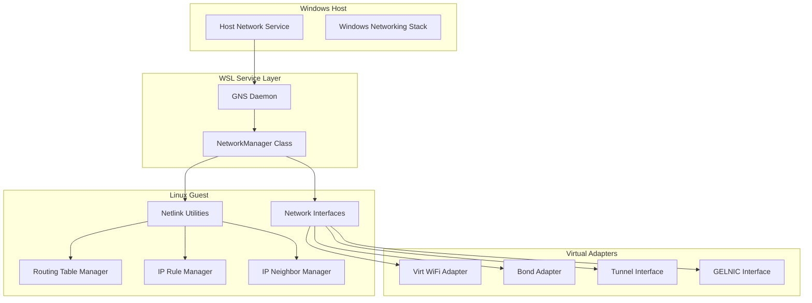
```mermaid
graph TB
subgraph "Windows Host"
HNS[Host Network Service]
WinNet[Windows Networking Stack]
end
subgraph "WSL Service Layer"
GNS[GNS Daemon]
NetworkManager[NetworkManager Class]
end
subgraph "Linux Guest"
NetlinkUtil[Netlink Utilities]
RoutingTable[Routing Table Manager]
IpRuleMgr[IP Rule Manager]
IpNeighborMgr[IP Neighbor Manager]
Interfaces[Network Interfaces]
end
subgraph "Virtual Adapters"
VWifi[Virt WiFi Adapter]
Bond[Bond Adapter]
Tunnel[Tunnel Interface]
GELNIC[GELNIC Interface]
end
HNS --> GNS
GNS --> NetworkManager
NetworkManager --> NetlinkUtil
NetlinkUtil --> RoutingTable
NetlinkUtil --> IpRuleMgr
NetlinkUtil --> IpNeighborMgr
NetworkManager --> Interfaces
Interfaces --> VWifi
Interfaces --> Bond
Interfaces --> Tunnel
Interfaces --> GELNIC
```

**Diagram sources**
- [NetworkManager.cpp](file://src/linux/init/NetworkManager.cpp#L1-L538)
- [NetlinkChannel.h](file://src/linux/netlinkutil/NetlinkChannel.h#L1-L55)

**Section sources**
- [NetworkManager.h](file://src/linux/init/NetworkManager.h#L1-L95)
- [hns_schema.h](file://src/shared/inc/hns_schema.h#L1-L545)

## NetworkManager Class Architecture

The NetworkManager class serves as the central orchestrator for all network configuration operations within the WSL environment. It provides a high-level interface for managing network interfaces, routing tables, and IP address configurations.

### Core Class Structure

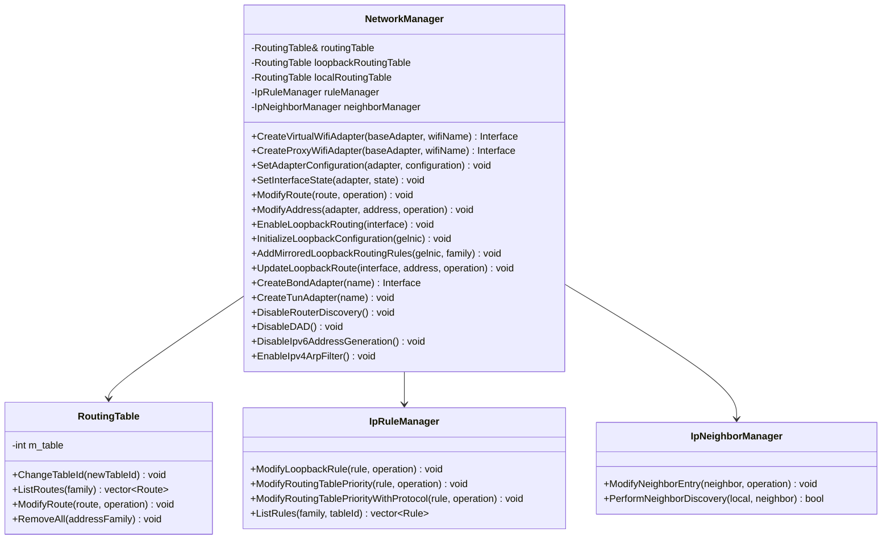
```mermaid
classDiagram
class NetworkManager {
-RoutingTable& routingTable
-RoutingTable loopbackRoutingTable
-RoutingTable localRoutingTable
-IpRuleManager ruleManager
-IpNeighborManager neighborManager
+CreateVirtualWifiAdapter(baseAdapter, wifiName) Interface
+CreateProxyWifiAdapter(baseAdapter, wifiName) Interface
+SetAdapterConfiguration(adapter, configuration) void
+SetInterfaceState(adapter, state) void
+ModifyRoute(route, operation) void
+ModifyAddress(adapter, address, operation) void
+EnableLoopbackRouting(interface) void
+InitializeLoopbackConfiguration(gelnic) void
+AddMirroredLoopbackRoutingRules(gelnic, family) void
+UpdateLoopbackRoute(interface, address, operation) void
+CreateBondAdapter(name) Interface
+CreateTunAdapter(name) void
+DisableRouterDiscovery() void
+DisableDAD() void
+DisableIpv6AddressGeneration() void
+EnableIpv4ArpFilter() void
}
class RoutingTable {
-int m_table
+ChangeTableId(newTableId) void
+ListRoutes(family) vector~Route~
+ModifyRoute(route, operation) void
+RemoveAll(addressFamily) void
}
class IpRuleManager {
+ModifyLoopbackRule(rule, operation) void
+ModifyRoutingTablePriority(rule, operation) void
+ModifyRoutingTablePriorityWithProtocol(rule, operation) void
+ListRules(family, tableId) vector~Rule~
}
class IpNeighborManager {
+ModifyNeighborEntry(neighbor, operation) void
+PerformNeighborDiscovery(local, neighbor) bool
}
NetworkManager --> RoutingTable
NetworkManager --> IpRuleManager
NetworkManager --> IpNeighborManager
```

**Diagram sources**
- [NetworkManager.h](file://src/linux/init/NetworkManager.h#L11-L95)
- [RoutingTable.cpp](file://src/linux/netlinkutil/RoutingTable.cpp#L11-L332)
- [IpRuleManager.cpp](file://src/linux/netlinkutil/IpRuleManager.cpp#L1-L300)
- [IpNeighborManager.cpp](file://src/linux/netlinkutil/IpNeighborManager.cpp#L1-L255)

### Key Responsibilities

The NetworkManager class handles several critical responsibilities:

1. **Interface Lifecycle Management**: Creating, configuring, and destroying virtual network adapters
2. **Routing Table Manipulation**: Managing route additions, modifications, and deletions
3. **IP Address Configuration**: Setting up IP addresses with appropriate broadcast and gateway configurations
4. **Policy-Based Routing**: Configuring iptables rules for mirrored networking scenarios
5. **Neighbor Discovery**: Managing ARP entries and neighbor table entries
6. **Loopback Configuration**: Setting up special routing rules for loopback traffic

**Section sources**
- [NetworkManager.cpp](file://src/linux/init/NetworkManager.cpp#L57-L95)

## Core Components and Responsibilities

### Interface Management

The interface management system handles creation and configuration of various types of network adapters:

#### Virtual WiFi Adapter Creation

The system supports creating virtual WiFi adapters for testing and development scenarios:

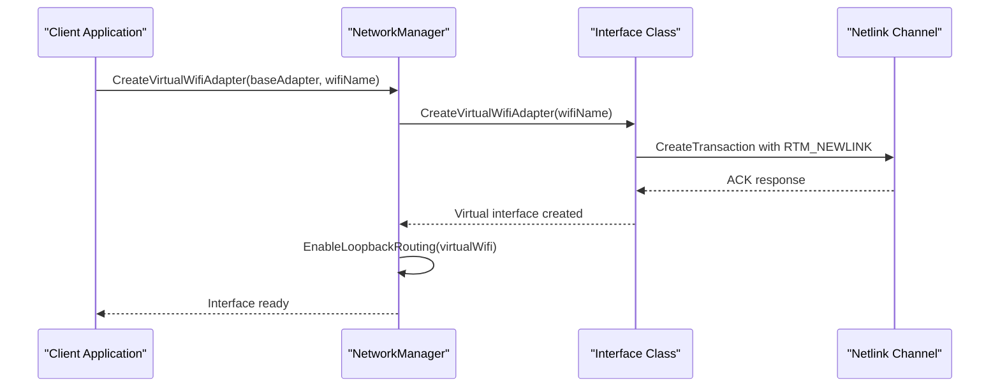
```mermaid
sequenceDiagram
participant Client as "Client Application"
participant NM as "NetworkManager"
participant Interface as "Interface Class"
participant Netlink as "Netlink Channel"
Client->>NM : CreateVirtualWifiAdapter(baseAdapter, wifiName)
NM->>Interface : CreateVirtualWifiAdapter(wifiName)
Interface->>Netlink : CreateTransaction with RTM_NEWLINK
Netlink-->>Interface : ACK response
Interface-->>NM : Virtual interface created
NM->>NM : EnableLoopbackRouting(virtualWifi)
NM-->>Client : Interface ready
```

**Diagram sources**
- [NetworkManager.cpp](file://src/linux/init/NetworkManager.cpp#L77-L96)
- [Interface.cpp](file://src/linux/netlinkutil/Interface.cpp#L155-L200)

#### Bond Adapter Management

Bond adapters provide network interface aggregation capabilities:

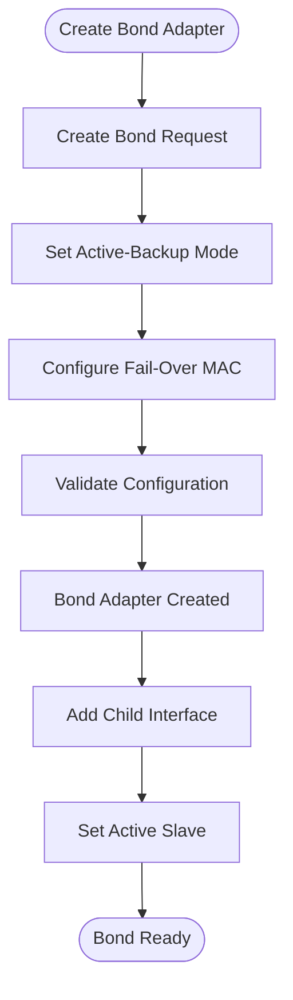
```mermaid
flowchart TD
Start([Create Bond Adapter]) --> CreateReq["Create Bond Request"]
CreateReq --> SetMode["Set Active-Backup Mode"]
SetMode --> SetFailover["Configure Fail-Over MAC"]
SetFailover --> ValidateConfig["Validate Configuration"]
ValidateConfig --> Success["Bond Adapter Created"]
Success --> AddChild["Add Child Interface"]
AddChild --> SetActive["Set Active Slave"]
SetActive --> Complete([Bond Ready])
```

**Diagram sources**
- [Interface.cpp](file://src/linux/netlinkutil/Interface.cpp#L201-L249)
- [NetworkManager.cpp](file://src/linux/init/NetworkManager.cpp#L252-L261)

### IP Address Configuration

The system provides comprehensive IP address management with support for both IPv4 and IPv6:

#### Address Modification Operations

The ModifyAddress method handles IP address changes with careful route preservation:

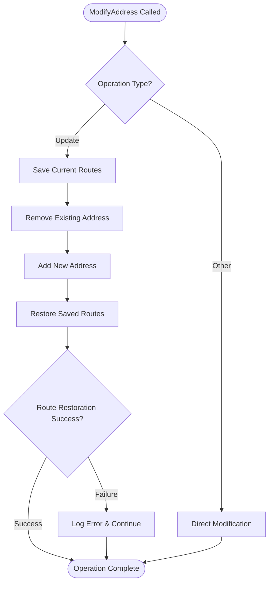
```mermaid
flowchart TD
Start([ModifyAddress Called]) --> CheckOp{"Operation Type?"}
CheckOp --> |Update| SaveRoutes["Save Current Routes"]
CheckOp --> |Other| DirectMod["Direct Modification"]
SaveRoutes --> RemoveAddr["Remove Existing Address"]
RemoveAddr --> AddNew["Add New Address"]
AddNew --> RestoreRoutes["Restore Saved Routes"]
RestoreRoutes --> CheckRoute{"Route Restoration Success?"}
CheckRoute --> |Success| Complete([Operation Complete])
CheckRoute --> |Failure| LogError["Log Error & Continue"]
LogError --> Complete
DirectMod --> Complete
```

**Diagram sources**
- [NetworkManager.cpp](file://src/linux/init/NetworkManager.cpp#L176-L216)
- [Interface.cpp](file://src/linux/netlinkutil/Interface.cpp#L120-L152)

**Section sources**
- [NetworkManager.cpp](file://src/linux/init/NetworkManager.cpp#L98-L116)
- [Interface.cpp](file://src/linux/netlinkutil/Interface.cpp#L120-L152)

## Netlink Communication Layer

The netlink communication layer provides the foundation for all network configuration operations. It consists of several key components that handle message construction, transmission, and response processing.

### NetlinkChannel Architecture

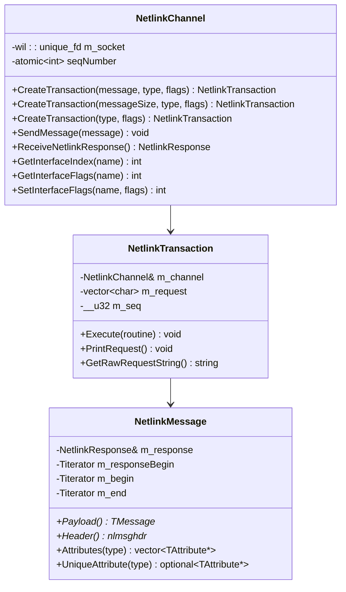
```mermaid
classDiagram
class NetlinkChannel {
-wil : : unique_fd m_socket
-atomic~int~ seqNumber
+CreateTransaction(message, type, flags) NetlinkTransaction
+CreateTransaction(messageSize, type, flags) NetlinkTransaction
+CreateTransaction(type, flags) NetlinkTransaction
+SendMessage(message) void
+ReceiveNetlinkResponse() NetlinkResponse
+GetInterfaceIndex(name) int
+GetInterfaceFlags(name) int
+SetInterfaceFlags(name, flags) int
}
class NetlinkTransaction {
-NetlinkChannel& m_channel
-vector~char~ m_request
-__u32 m_seq
+Execute(routine) void
+PrintRequest() void
+GetRawRequestString() string
}
class NetlinkMessage {
-NetlinkResponse& m_response
-Titerator m_responseBegin
-Titerator m_begin
-Titerator m_end
+Payload() TMessage*
+Header() nlmsghdr*
+Attributes(type) vector~TAttribute*~
+UniqueAttribute(type) optional~TAttribute*~
}
NetlinkChannel --> NetlinkTransaction
NetlinkTransaction --> NetlinkMessage
```

**Diagram sources**
- [NetlinkChannel.h](file://src/linux/netlinkutil/NetlinkChannel.h#L9-L55)
- [NetlinkTransaction.h](file://src/linux/netlinkutil/NetlinkTransaction.h#L8-L24)
- [NetlinkMessage.h](file://src/linux/netlinkutil/NetlinkMessage.h#L10-L38)

### Message Construction and Parsing

The system uses template-based message construction for type-safe netlink operations:

#### Route Message Construction

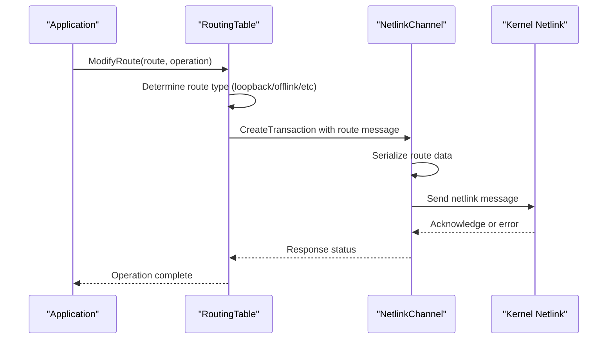
```mermaid
sequenceDiagram
participant App as "Application"
participant RT as "RoutingTable"
participant Netlink as "NetlinkChannel"
participant Kernel as "Kernel Netlink"
App->>RT : ModifyRoute(route, operation)
RT->>RT : Determine route type (loopback/offlink/etc)
RT->>Netlink : CreateTransaction with route message
Netlink->>Netlink : Serialize route data
Netlink->>Kernel : Send netlink message
Kernel-->>Netlink : Acknowledge or error
Netlink-->>RT : Response status
RT-->>App : Operation complete
```

**Diagram sources**
- [RoutingTable.cpp](file://src/linux/netlinkutil/RoutingTable.cpp#L69-L86)
- [NetlinkChannel.h](file://src/linux/netlinkutil/NetlinkChannel.h#L21-L26)

**Section sources**
- [RoutingTable.cpp](file://src/linux/netlinkutil/RoutingTable.cpp#L69-L86)
- [NetlinkChannel.h](file://src/linux/netlinkutil/NetlinkChannel.h#L9-L55)

## Virtual Adapter Management

The system supports multiple types of virtual adapters, each serving specific networking purposes:

### Adapter Types and Capabilities

| Adapter Type | Purpose | Features |
|--------------|---------|----------|
| Virtual WiFi | Testing and development | Supports virtual WiFi networks |
| Proxy WiFi | Network simulation | Simulates WiFi proxy scenarios |
| Bond | Load balancing | Aggregates multiple interfaces |
| Tunnel | Point-to-point | Creates tunnel interfaces |
| GELNIC | Loopback mirroring | Handles loopback traffic |

### Adapter Lifecycle Management

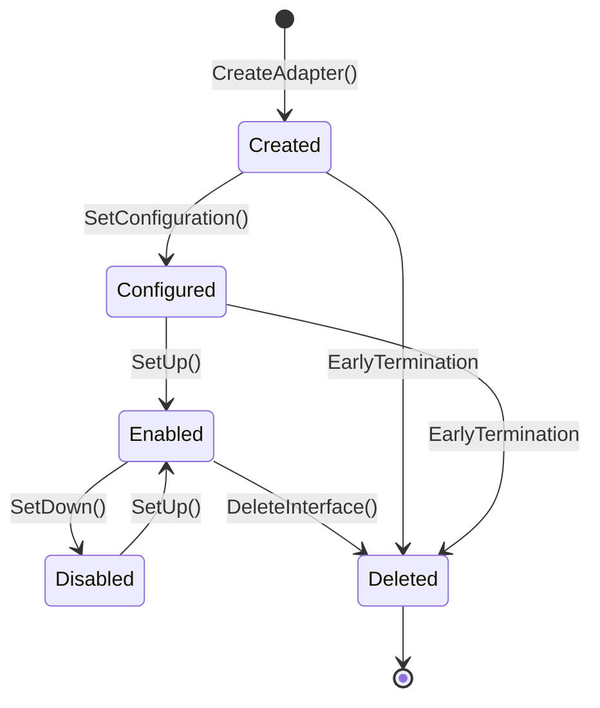
```mermaid
stateDiagram-v2
[*] --> Created : CreateAdapter()
Created --> Configured : SetConfiguration()
Configured --> Enabled : SetUp()
Enabled --> Disabled : SetDown()
Disabled --> Enabled : SetUp()
Enabled --> Deleted : DeleteInterface()
Deleted --> [*]
Created --> Deleted : EarlyTermination
Configured --> Deleted : EarlyTermination
```

**Diagram sources**
- [Interface.cpp](file://src/linux/netlinkutil/Interface.cpp#L501-L509)
- [NetworkManager.cpp](file://src/linux/init/NetworkManager.cpp#L118-L129)

**Section sources**
- [Interface.cpp](file://src/linux/netlinkutil/Interface.cpp#L155-L249)
- [NetworkManager.cpp](file://src/linux/init/NetworkManager.cpp#L77-L96)

## Routing Table Operations

The routing table management system provides comprehensive control over IP routing decisions:

### Routing Table Architecture

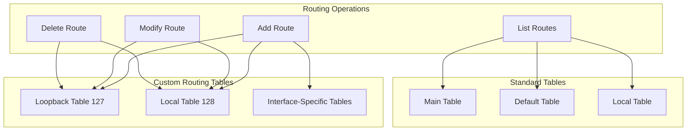
```mermaid
graph TB
subgraph "Custom Routing Tables"
Loopback[Loopback Table 127]
Local[Local Table 128]
Interface[Interface-Specific Tables]
end
subgraph "Standard Tables"
Main[Main Table]
Default[Default Table]
LocalStd[Local Table]
end
subgraph "Routing Operations"
Add[Add Route]
Modify[Modify Route]
Delete[Delete Route]
List[List Routes]
end
Add --> Loopback
Add --> Local
Add --> Interface
Modify --> Loopback
Modify --> Local
Delete --> Loopback
Delete --> Local
List --> Main
List --> Default
List --> LocalStd
```

**Diagram sources**
- [RoutingTable.cpp](file://src/linux/netlinkutil/RoutingTable.cpp#L11-L332)

### Route Types and Classification

The system handles different types of routes with specialized processing:

#### Route Type Classification

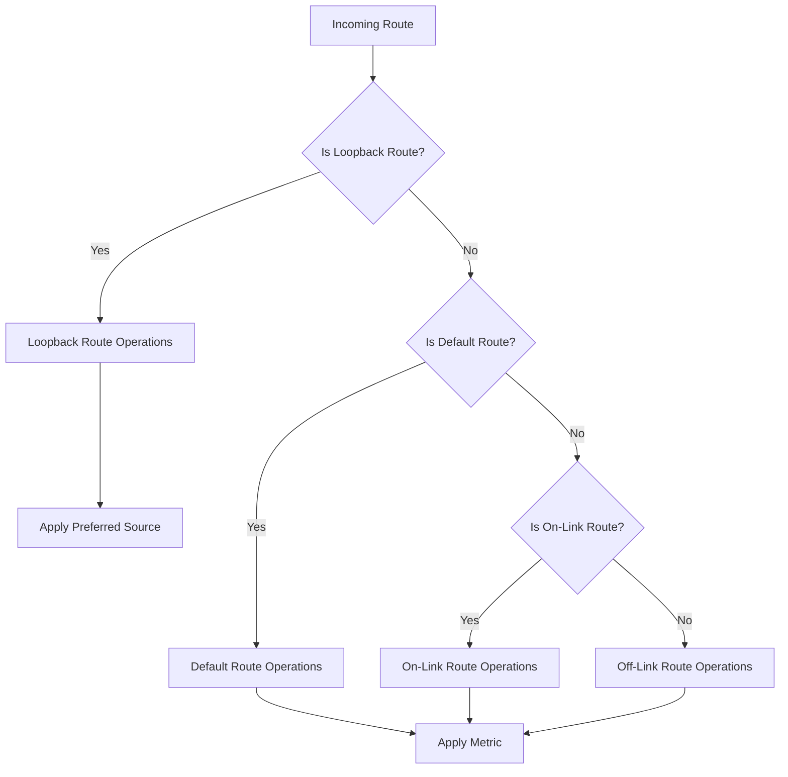
```mermaid
flowchart TD
Route[Incoming Route] --> CheckLoopback{"Is Loopback Route?"}
CheckLoopback --> |Yes| LoopbackOps["Loopback Route Operations"]
CheckLoopback --> |No| CheckDefault{"Is Default Route?"}
CheckDefault --> |Yes| DefaultOps["Default Route Operations"]
CheckDefault --> |No| CheckOnlink{"Is On-Link Route?"}
CheckOnlink --> |Yes| OnlinkOps["On-Link Route Operations"]
CheckOnlink --> |No| OfflinkOps["Off-Link Route Operations"]
LoopbackOps --> ApplyPrefs["Apply Preferred Source"]
DefaultOps --> ApplyMetric["Apply Metric"]
OnlinkOps --> ApplyMetric
OfflinkOps --> ApplyMetric
```

**Diagram sources**
- [RoutingTable.cpp](file://src/linux/netlinkutil/RoutingTable.cpp#L88-L126)

**Section sources**
- [RoutingTable.cpp](file://src/linux/netlinkutil/RoutingTable.cpp#L69-L332)
- [Route.cpp](file://src/linux/netlinkutil/Route.cpp#L1-L54)

## Policy-Based Routing

Policy-based routing enables sophisticated traffic steering capabilities, particularly important for mirrored networking scenarios:

### IP Rule Management

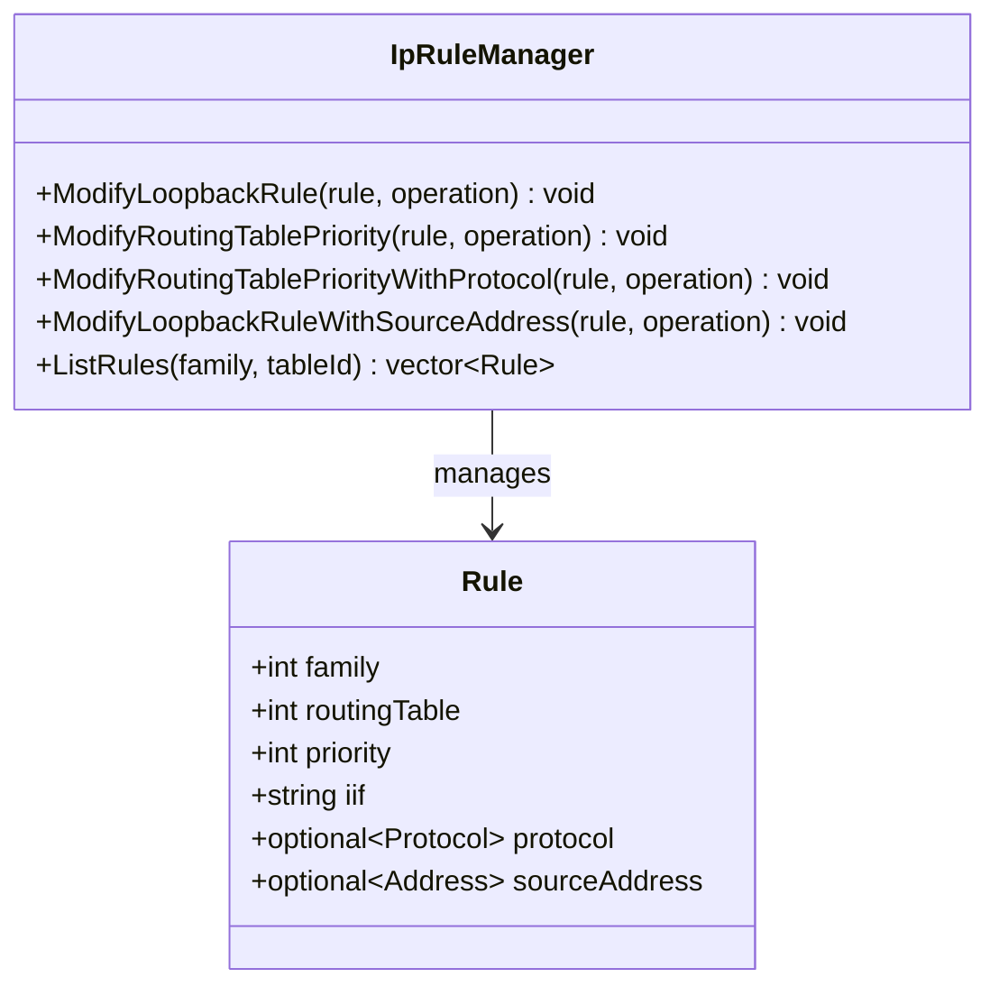
```mermaid
classDiagram
class IpRuleManager {
+ModifyLoopbackRule(rule, operation) void
+ModifyRoutingTablePriority(rule, operation) void
+ModifyRoutingTablePriorityWithProtocol(rule, operation) void
+ModifyLoopbackRuleWithSourceAddress(rule, operation) void
+ListRules(family, tableId) vector~Rule~
}
class Rule {
+int family
+int routingTable
+int priority
+string iif
+optional~Protocol~ protocol
+optional~Address~ sourceAddress
}
IpRuleManager --> Rule : manages
```

**Diagram sources**
- [IpRuleManager.cpp](file://src/linux/netlinkutil/IpRuleManager.cpp#L16-L300)

### Mirrored Networking Rules

In mirrored networking mode, the system establishes specific routing rules for bidirectional traffic flow:

#### Rule Priority Structure

| Priority | Purpose | Protocol | Interface |
|----------|---------|----------|-----------|
| 0 | Windows-to-Linux loopback | TCP/UDP | Specific interface |
| 1 | Linux-to-Windows | TCP/UDP | Loopback table |
| 2 | Local traffic fallback | All | Local table |

**Section sources**
- [IpRuleManager.cpp](file://src/linux/netlinkutil/IpRuleManager.cpp#L53-L300)
- [NetworkManager.cpp](file://src/linux/init/NetworkManager.cpp#L353-L427)

## Neighbor Discovery and ARP Management

The neighbor discovery system manages ARP entries and IPv6 neighbor table entries:

### Neighbor Management Architecture

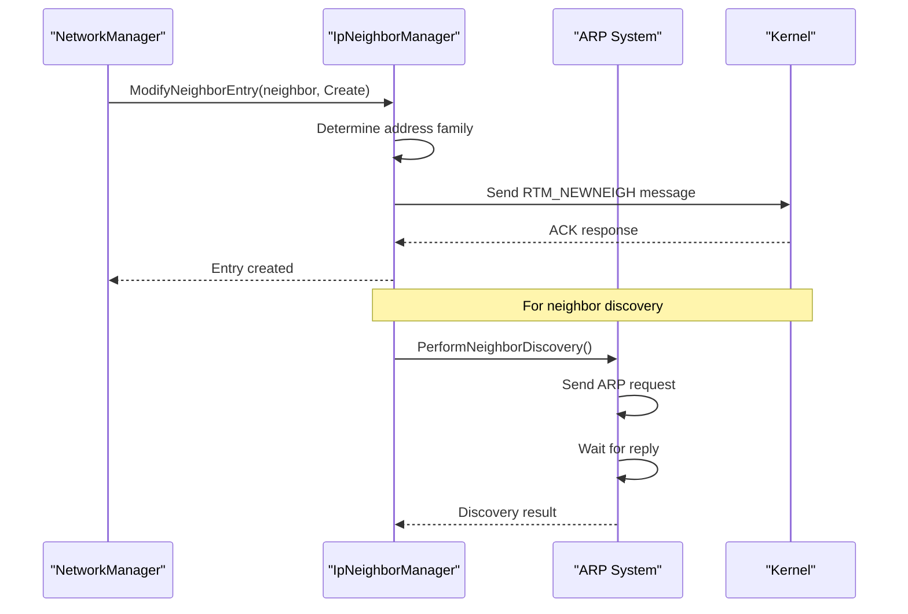
```mermaid
sequenceDiagram
participant NM as "NetworkManager"
participant NMgr as "IpNeighborManager"
participant ARP as "ARP System"
participant Kernel as "Kernel"
NM->>NMgr : ModifyNeighborEntry(neighbor, Create)
NMgr->>NMgr : Determine address family
NMgr->>Kernel : Send RTM_NEWNEIGH message
Kernel-->>NMgr : ACK response
NMgr-->>NM : Entry created
Note over NMgr,Kernel : For neighbor discovery
NMgr->>ARP : PerformNeighborDiscovery()
ARP->>ARP : Send ARP request
ARP->>ARP : Wait for reply
ARP-->>NMgr : Discovery result
```

**Diagram sources**
- [IpNeighborManager.cpp](file://src/linux/netlinkutil/IpNeighborManager.cpp#L177-L255)

### ARP Packet Structure

The system supports both IPv4 and IPv6 ARP operations:

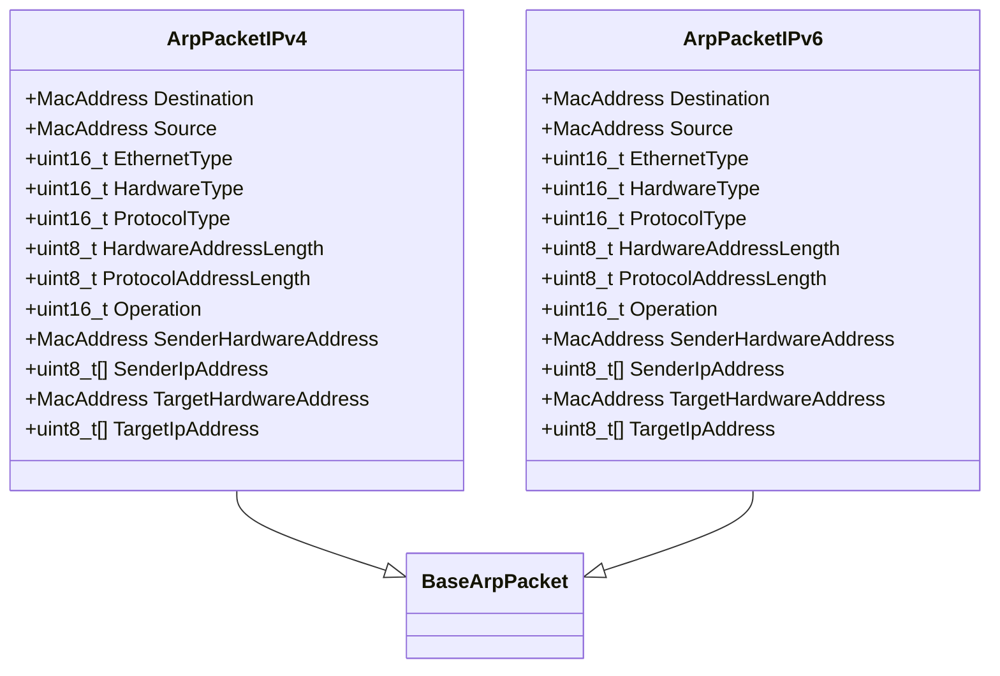
```mermaid
classDiagram
class ArpPacketIPv4 {
+MacAddress Destination
+MacAddress Source
+uint16_t EthernetType
+uint16_t HardwareType
+uint16_t ProtocolType
+uint8_t HardwareAddressLength
+uint8_t ProtocolAddressLength
+uint16_t Operation
+MacAddress SenderHardwareAddress
+uint8_t[] SenderIpAddress
+MacAddress TargetHardwareAddress
+uint8_t[] TargetIpAddress
}
class ArpPacketIPv6 {
+MacAddress Destination
+MacAddress Source
+uint16_t EthernetType
+uint16_t HardwareType
+uint16_t ProtocolType
+uint8_t HardwareAddressLength
+uint8_t ProtocolAddressLength
+uint16_t Operation
+MacAddress SenderHardwareAddress
+uint8_t[] SenderIpAddress
+MacAddress TargetHardwareAddress
+uint8_t[] TargetIpAddress
}
ArpPacketIPv4 --|> BaseArpPacket
ArpPacketIPv6 --|> BaseArpPacket
```

**Diagram sources**
- [IpNeighborManager.cpp](file://src/linux/netlinkutil/IpNeighborManager.cpp#L20-L40)

**Section sources**
- [IpNeighborManager.cpp](file://src/linux/netlinkutil/IpNeighborManager.cpp#L108-L255)

## Windows HNS Integration

The system integrates with Windows Host Network Service (HNS) through HNSEndpoint configuration objects:

### HNS Schema Integration

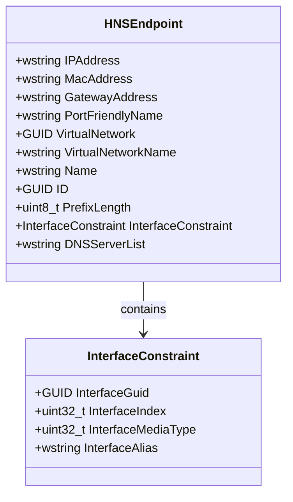
```mermaid
classDiagram
class HNSEndpoint {
+wstring IPAddress
+wstring MacAddress
+wstring GatewayAddress
+wstring PortFriendlyName
+GUID VirtualNetwork
+wstring VirtualNetworkName
+wstring Name
+GUID ID
+uint8_t PrefixLength
+InterfaceConstraint InterfaceConstraint
+wstring DNSServerList
}
class InterfaceConstraint {
+GUID InterfaceGuid
+uint32_t InterfaceIndex
+uint32_t InterfaceMediaType
+wstring InterfaceAlias
}
HNSEndpoint --> InterfaceConstraint : contains
```

**Diagram sources**
- [hns_schema.h](file://src/shared/inc/hns_schema.h#L138-L154)

### HNS Configuration Flow

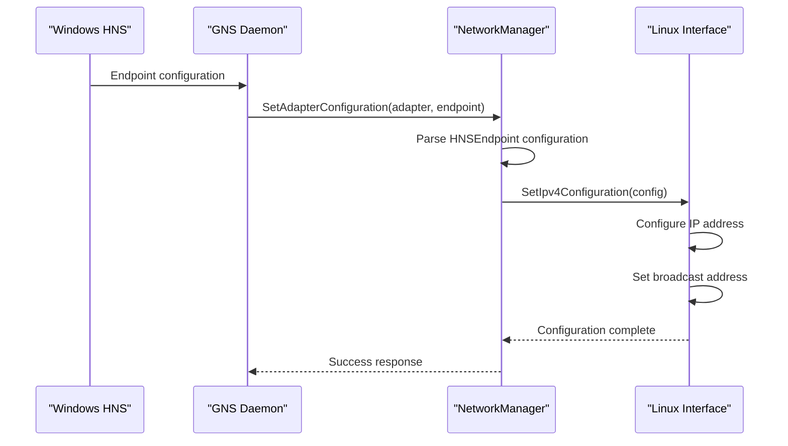
```mermaid
sequenceDiagram
participant HNS as "Windows HNS"
participant GNS as "GNS Daemon"
participant NM as "NetworkManager"
participant Interface as "Linux Interface"
HNS->>GNS : Endpoint configuration
GNS->>NM : SetAdapterConfiguration(adapter, endpoint)
NM->>NM : Parse HNSEndpoint configuration
NM->>Interface : SetIpv4Configuration(config)
Interface->>Interface : Configure IP address
Interface->>Interface : Set broadcast address
Interface-->>NM : Configuration complete
NM-->>GNS : Success response
```

**Diagram sources**
- [NetworkManager.cpp](file://src/linux/init/NetworkManager.cpp#L99-L116)
- [hns_schema.h](file://src/shared/inc/hns_schema.h#L138-L154)

**Section sources**
- [NetworkManager.cpp](file://src/linux/init/NetworkManager.cpp#L99-L116)
- [hns_schema.h](file://src/shared/inc/hns_schema.h#L138-L154)

## BPF Program Installation

The system supports Berkeley Packet Filter (BPF) program installation for advanced networking capabilities:

### BPF Classifier Attachment

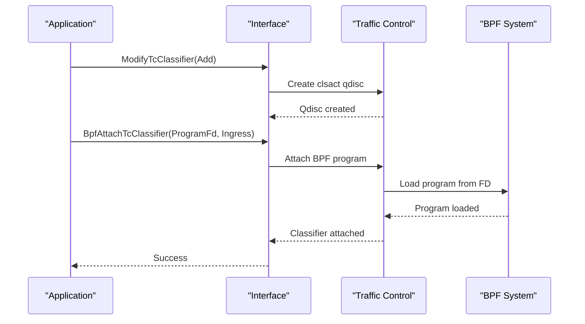
```mermaid
sequenceDiagram
participant App as "Application"
participant Interface as "Interface"
participant TC as "Traffic Control"
participant BPF as "BPF System"
App->>Interface : ModifyTcClassifier(Add)
Interface->>TC : Create clsact qdisc
TC-->>Interface : Qdisc created
App->>Interface : BpfAttachTcClassifier(ProgramFd, Ingress)
Interface->>TC : Attach BPF program
TC->>BPF : Load program from FD
BPF-->>TC : Program loaded
TC-->>Interface : Classifier attached
Interface-->>App : Success
```

**Diagram sources**
- [Interface.cpp](file://src/linux/netlinkutil/Interface.cpp#L693-L758)

### BPF Program Types

The system supports various BPF program types for different networking functions:

| Program Type | Purpose | Attachment Point |
|--------------|---------|------------------|
| Classifier | Traffic classification | Ingress/egress |
| Action | Packet modification | Ingress/egress |
| Monitor | Traffic monitoring | Both directions |

**Section sources**
- [Interface.cpp](file://src/linux/netlinkutil/Interface.cpp#L693-L758)

## Common Issues and Solutions

### Routing Table Conflicts

**Problem**: Multiple routes conflicting for the same destination

**Solution**: The system implements route precedence rules and automatic conflict resolution:

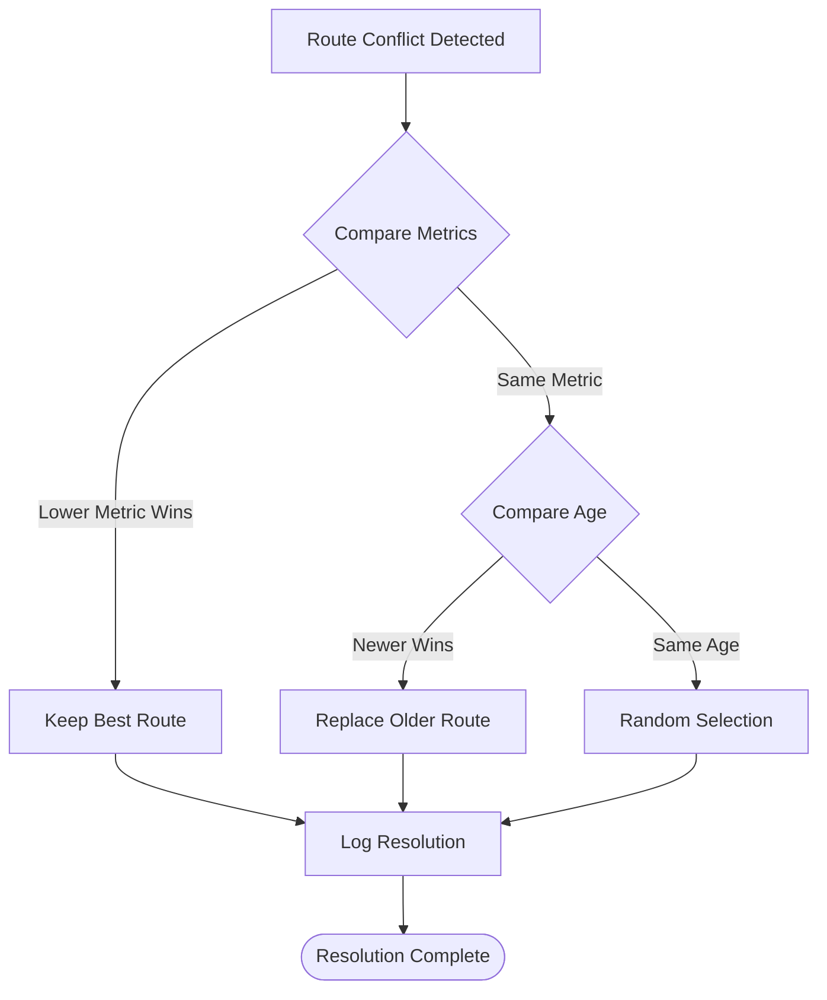
```mermaid
flowchart TD
Conflict[Route Conflict Detected] --> CheckMetric{"Compare Metrics"}
CheckMetric --> |Lower Metric Wins| KeepBest["Keep Best Route"]
CheckMetric --> |Same Metric| CheckAge{"Compare Age"}
CheckAge --> |Newer Wins| ReplaceOld["Replace Older Route"]
CheckAge --> |Same Age| RandomChoice["Random Selection"]
KeepBest --> LogResolution["Log Resolution"]
ReplaceOld --> LogResolution
RandomChoice --> LogResolution
LogResolution --> Complete([Resolution Complete])
```

**Diagram sources**
- [RoutingTable.cpp](file://src/linux/netlinkutil/RoutingTable.cpp#L145-L177)

### Interface State Synchronization

**Problem**: Asynchronous interface state changes causing race conditions

**Solution**: The system implements atomic state transitions with proper error handling:

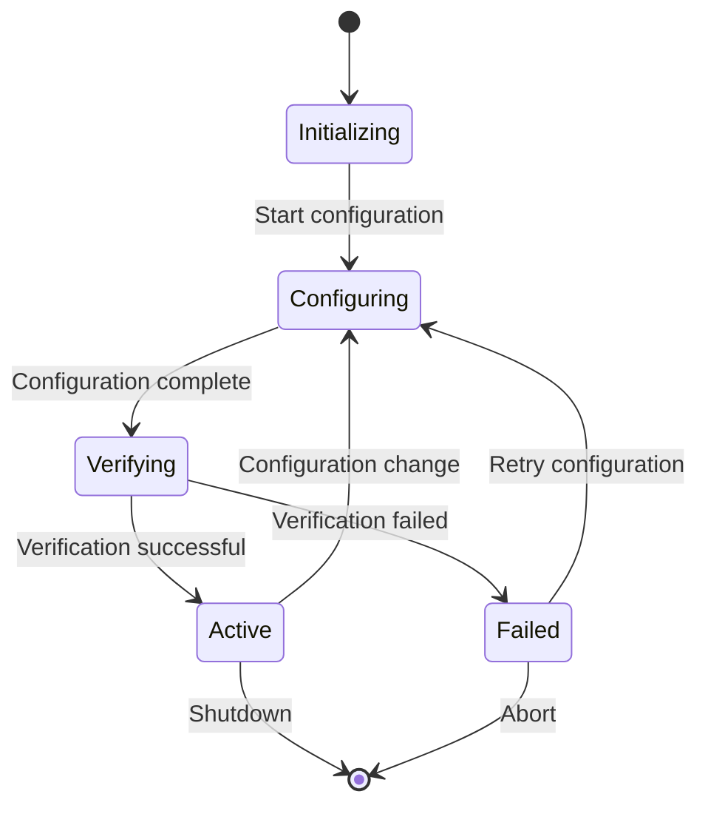
```mermaid
stateDiagram-v2
[*] --> Initializing
Initializing --> Configuring : Start configuration
Configuring --> Verifying : Configuration complete
Verifying --> Active : Verification successful
Verifying --> Failed : Verification failed
Active --> Configuring : Configuration change
Failed --> Configuring : Retry configuration
Active --> [*] : Shutdown
Failed --> [*] : Abort
```

**Diagram sources**
- [Interface.cpp](file://src/linux/netlinkutil/Interface.cpp#L501-L509)

### ARP Resolution Issues

**Problem**: ARP entries becoming stale or conflicting

**Solution**: The system implements neighbor discovery with retry mechanisms:

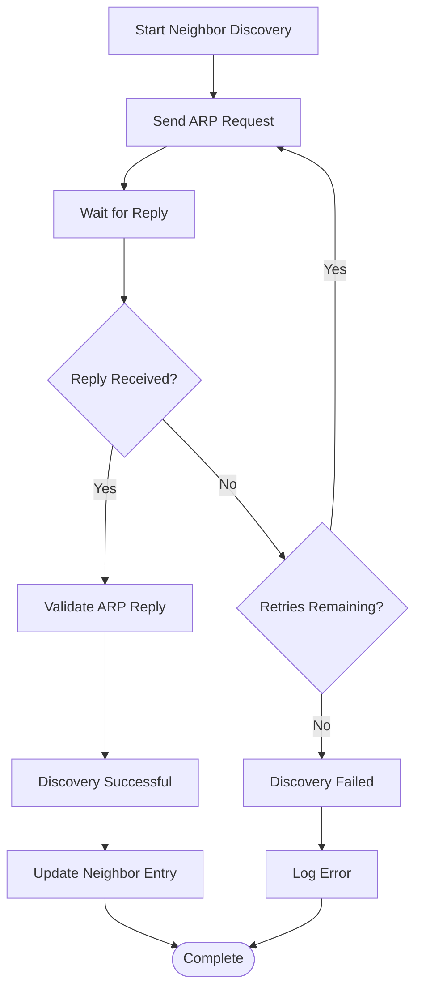
```mermaid
flowchart TD
StartDiscovery[Start Neighbor Discovery] --> SendARP["Send ARP Request"]
SendARP --> WaitReply["Wait for Reply"]
WaitReply --> CheckReply{"Reply Received?"}
CheckReply --> |Yes| ValidateReply["Validate ARP Reply"]
CheckReply --> |No| Retry{"Retries Remaining?"}
ValidateReply --> Success["Discovery Successful"]
Retry --> |Yes| SendARP
Retry --> |No| Failure["Discovery Failed"]
Success --> UpdateEntry["Update Neighbor Entry"]
Failure --> LogError["Log Error"]
UpdateEntry --> Complete([Complete])
LogError --> Complete
```

**Diagram sources**
- [IpNeighborManager.cpp](file://src/linux/netlinkutil/IpNeighborManager.cpp#L108-L174)

**Section sources**
- [RoutingTable.cpp](file://src/linux/netlinkutil/RoutingTable.cpp#L145-L177)
- [Interface.cpp](file://src/linux/netlinkutil/Interface.cpp#L501-L509)
- [IpNeighborManager.cpp](file://src/linux/netlinkutil/IpNeighborManager.cpp#L108-L174)

## Performance Considerations

### Netlink Message Optimization

The system optimizes netlink message handling through several techniques:

1. **Batch Operations**: Multiple related operations are batched together
2. **Message Caching**: Frequently accessed messages are cached
3. **Asynchronous Processing**: Non-blocking operations prevent UI freezing
4. **Memory Management**: Efficient memory allocation for large routing tables

### Routing Table Performance

Large routing tables can impact performance. The system implements:

- **Table Segmentation**: Routes are distributed across multiple tables
- **Index Optimization**: Efficient indexing for route lookups
- **Lazy Evaluation**: Routes are computed only when needed

### Memory Usage Patterns

The network configuration system manages memory efficiently:

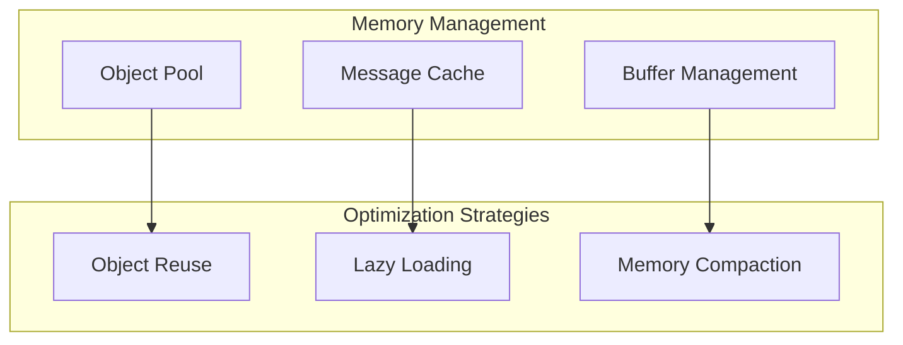
```mermaid
graph TB
subgraph "Memory Management"
Pool[Object Pool]
Cache[Message Cache]
Buffer[Buffer Management]
end
subgraph "Optimization Strategies"
Reuse[Object Reuse]
Lazy[Lazy Loading]
Compact[Memory Compaction]
end
Pool --> Reuse
Cache --> Lazy
Buffer --> Compact
```

## Troubleshooting Guide

### Diagnostic Commands

Key commands for diagnosing network configuration issues:

| Command | Purpose | Output |
|---------|---------|--------|
| `ip route show table all` | Show all routing tables | Complete routing table dump |
| `ip rule show` | Show policy routing rules | IP rule configuration |
| `ip neigh show` | Show neighbor table | ARP/ND entries |
| `ip addr show` | Show interface addresses | IP address configuration |

### Common Error Codes

| Error Code | Meaning | Solution |
|------------|---------|----------|
| `-EEXIST` | Route/entry already exists | Ignore or remove conflicting entry |
| `-ENOENT` | Route/entry not found | Verify route exists before removal |
| `-ESRCH` | No such process | Check interface state |
| `-EADDRNOTAVAIL` | Address not available | Verify IP address configuration |

### Debug Information Collection

The system provides comprehensive logging for troubleshooting:

```mermaid
flowchart TD
Error[Error Detected] --> CollectLogs["Collect Debug Logs"]
CollectLogs --> AnalyzeNetlink["Analyze Netlink Messages"]
AnalyzeNetlink --> CheckInterfaces["Verify Interface States"]
CheckInterfaces --> ValidateRoutes["Validate Route Configuration"]
ValidateRoutes --> CheckRules["Check IP Rules"]
CheckRules --> GenerateReport["Generate Troubleshooting Report"]
GenerateReport --> Solution["Apply Solution"]
```

**Section sources**
- [RoutingTable.cpp](file://src/linux/netlinkutil/RoutingTable.cpp#L145-L177)
- [IpNeighborManager.cpp](file://src/linux/netlinkutil/IpNeighborManager.cpp#L177-L255)

## Conclusion

The WSL network configuration management system represents a sophisticated approach to cross-platform network virtualization. Through the NetworkManager class and supporting components, it provides comprehensive control over network interfaces, routing tables, and policy-based routing.

Key strengths of the system include:

- **Robust Architecture**: Clear separation of concerns with well-defined interfaces
- **Comprehensive Coverage**: Support for all major networking scenarios
- **Error Resilience**: Comprehensive error handling and recovery mechanisms
- **Performance Optimization**: Efficient memory and processing optimizations
- **Extensibility**: Modular design allows for easy addition of new features

The system successfully bridges the gap between Windows and Linux networking stacks, enabling seamless development and deployment scenarios for cross-platform applications. Its integration with Windows HNS and support for advanced features like BPF programs make it a powerful foundation for modern containerized and virtualized networking environments.

Future enhancements could include expanded BPF program support, improved IPv6 handling, and enhanced monitoring capabilities for production deployments.