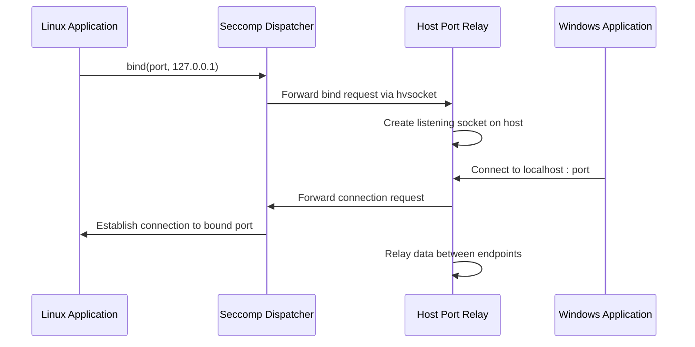
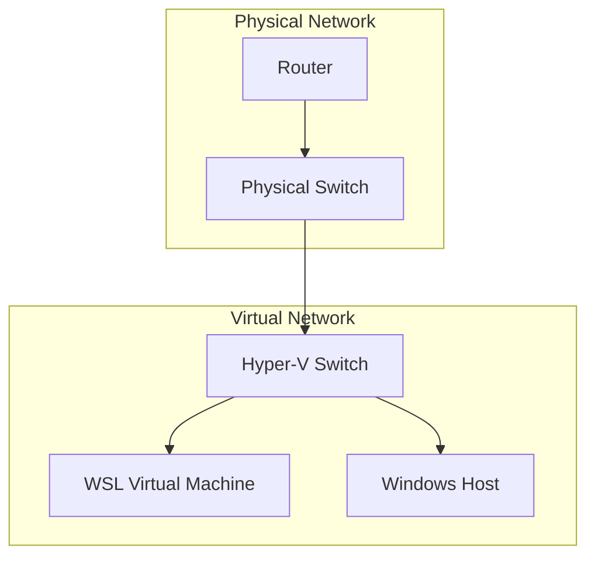
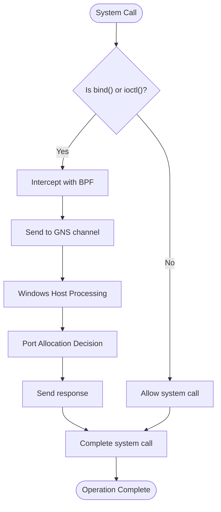
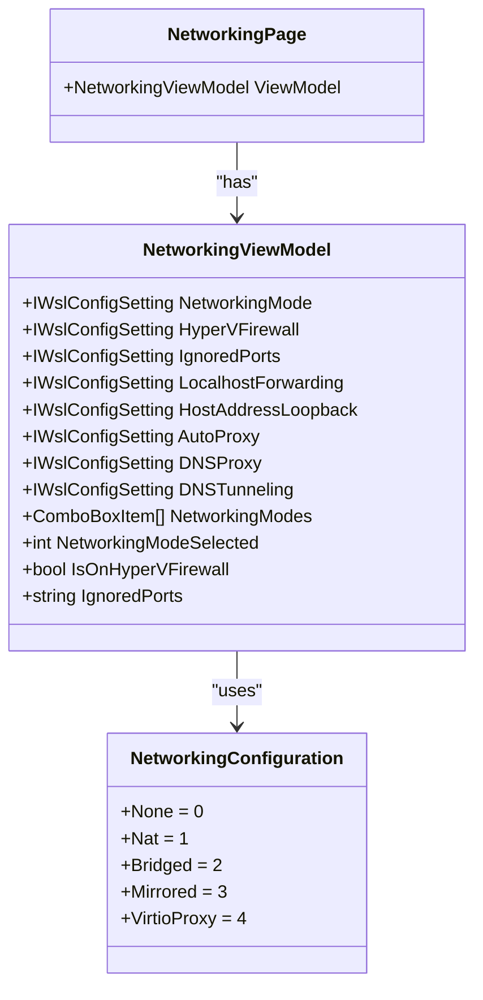

# Networking Modes

<cite>
**Referenced Files in This Document**   
- [localhost.cpp](file://src/linux/init/localhost.cpp)
- [NetworkManager.cpp](file://src/linux/init/NetworkManager.cpp)
- [NatNetworking.cpp](file://src/windows/service/exe/NatNetworking.cpp)
- [BridgedNetworking.cpp](file://src/windows/service/exe/BridgedNetworking.cpp)
- [MirroredNetworking.cpp](file://src/windows/service/exe/MirroredNetworking.cpp)
- [NetworkingViewModel.cs](file://src/windows/wslsettings/ViewModels/Settings/NetworkingViewModel.cs)
- [NetworkingPage.xaml.cs](file://src/windows/wslsettings/Views/Settings/NetworkingPage.xaml.cs)
- [WslCoreConfig.cpp](file://src/windows/common/WslCoreConfig.cpp)
- [configfile.cpp](file://src/shared/configfile/configfile.cpp)
- [LxssIpTables.cpp](file://src/windows/service/exe/LxssIpTables.cpp)
</cite>

## Table of Contents
1. [Introduction](#introduction)
2. [NAT Mode](#nat-mode)
3. [Bridged Mode](#bridged-mode)
4. [Mirrored Mode](#mirrored-mode)
5. [Configuration Options](#configuration-options)
6. [Trade-offs and Recommendations](#trade-offs-and-recommendations)
7. [Common Issues and Solutions](#common-issues-and-solutions)

## Introduction
Windows Subsystem for Linux (WSL) provides three distinct networking modes: NAT (Network Address Translation), Bridged, and Mirrored. Each mode offers different approaches to network connectivity between the Windows host and Linux guest, with varying trade-offs in performance, security, and compatibility. This document provides a comprehensive analysis of these networking modes, focusing on their implementation details, configuration options, and practical considerations for users.

The networking architecture in WSL is designed to provide seamless integration between the Windows and Linux environments while maintaining appropriate isolation and security boundaries. The choice of networking mode affects how network traffic is routed, how services are exposed, and how the Linux distribution interacts with the host network stack.

**Section sources**
- [NetworkManager.cpp](file://src/linux/init/NetworkManager.cpp#L31-L345)
- [WslCoreConfig.cpp](file://src/windows/common/WslCoreConfig.cpp#L181-L220)

## NAT Mode

### Port Forwarding Implementation
NAT mode in WSL uses a network address translation approach to provide network connectivity to the Linux distribution. The implementation centers around the `localhost.cpp` file in the Linux init component, which handles port forwarding between the host and guest systems.

The port forwarding mechanism works by intercepting bind system calls in the Linux guest using seccomp (secure computing mode) and BPF (Berkeley Packet Filter) programs. When a process in the Linux guest attempts to bind to a port on localhost (127.0.0.1), the seccomp dispatcher intercepts this call and communicates with the Windows host through an hvsocket channel. This allows the host to establish a relay that forwards traffic between the host's localhost interface and the guest's localhost interface.

The implementation in `localhost.cpp` creates a thread that monitors for incoming connections on a designated hvsocket port. When a connection is received, it reads the target TCP port information and establishes a relay between the host and guest. The relay uses a simple polling mechanism with `poll()` to forward data between the two endpoints, ensuring bidirectional communication.

**Diagram sources **
- [localhost.cpp](file://src/linux/init/localhost.cpp#L29-L146)
- [NetworkManager.cpp](file://src/linux/init/NetworkManager.cpp#L335-L338)

**Section sources**
- [localhost.cpp](file://src/linux/init/localhost.cpp#L1-L562)
- [NatNetworking.cpp](file://src/windows/service/exe/NatNetworking.cpp#L1-L844)

### Configuration and Behavior
NAT mode is the default networking configuration in WSL and provides a simple, secure way to access services running in the Linux distribution from the Windows host. The configuration is managed through the `NatNetworking` class in the Windows service component, which handles the creation and management of the NAT network interface.

The NAT implementation uses Host Compute Network (HCN) APIs to create a virtual network adapter that provides Internet connectivity to the Linux guest while isolating it from direct network access. The Linux guest receives a private IP address from a designated subnet, and all outbound traffic is translated through the host's network interface.

One key aspect of NAT mode is its handling of localhost services. By default, services bound to localhost in the Linux guest are automatically forwarded to the Windows host, allowing seamless access to development servers and other services. This behavior can be controlled through configuration settings that determine whether localhost forwarding is enabled.

**Section sources**
- [NatNetworking.cpp](file://src/windows/service/exe/NatNetworking.cpp#L29-L844)
- [WslCoreConfig.cpp](file://src/windows/common/WslCoreConfig.cpp#L211-L220)

## Bridged Mode

### Implementation Details
Bridged networking mode connects the WSL virtual machine directly to a specified Hyper-V switch, providing the Linux guest with network connectivity at the same level as the host machine. This mode is implemented in the `BridgedNetworking.cpp` file, which handles the configuration and attachment of the virtual network interface.

The bridged networking implementation works by creating a virtual network adapter that is attached to a designated Hyper-V switch. This allows the Linux guest to obtain an IP address from the same network as the host, either through DHCP or static configuration. The implementation uses HCN APIs to create and manage the network endpoint, with the virtual machine appearing as a separate device on the network.

The `BridgedNetworking` class constructor takes the system handle and configuration parameters, including the name of the virtual switch to use. During initialization, it enumerates available Hyper-V switches and locates the one matching the specified name. Once the switch is identified, it creates a network endpoint and attaches it to the virtual machine.

**Diagram sources **
- [BridgedNetworking.cpp](file://src/windows/service/exe/BridgedNetworking.cpp#L1-L87)
- [WslCoreConfig.cpp](file://src/windows/common/WslCoreConfig.cpp#L1494-L1530)

**Section sources**
- [BridgedNetworking.cpp](file://src/windows/service/exe/BridgedNetworking.cpp#L1-L87)

### Configuration Requirements
Bridged mode requires specific configuration parameters to function correctly. The most critical parameter is the virtual switch name (`vmSwitch`), which must be specified in the WSL configuration. If no virtual switch is specified, the initialization will fail with an appropriate error message.

Additional configuration options include:
- MAC address assignment (auto-generated if not specified)
- IPv6 support (can be enabled or disabled)
- DHCP client behavior (can be enabled or disabled)

The implementation ensures that the virtual machine receives a consistent MAC address across restarts by generating a random address when first configured and preserving it in subsequent sessions. This prevents issues with network services that track devices by MAC address.

**Section sources**
- [BridgedNetworking.cpp](file://src/windows/service/exe/BridgedNetworking.cpp#L11-L68)
- [WslCoreConfig.cpp](file://src/windows/common/WslCoreConfig.cpp#L1494-L1530)

## Mirrored Mode

### BPF Program Implementation
Mirrored networking mode represents a more advanced approach to WSL networking, using BPF programs and policy-based routing to create a seamless network experience between the host and guest. The implementation is centered in the `MirroredNetworking.cpp` file and leverages sophisticated network routing techniques.

The core of mirrored mode is the use of BPF programs to intercept network operations and policy-based routing rules to direct traffic appropriately. When a process in the Linux guest attempts to bind to a port, the BPF program intercepts the `bind` system call and communicates with the Windows host to coordinate port allocation.

The implementation uses a combination of seccomp user notifications and BPF filters to intercept system calls. The BPF filter is configured to trigger user notifications for specific system calls, including `bind` and `ioctl`. When a notification is received, the dispatcher routes it to the appropriate handler, which communicates with the host through the GNS (Guest Network Service) channel.

**Diagram sources **
- [MirroredNetworking.cpp](file://src/windows/service/exe/MirroredNetworking.cpp#L361-L377)
- [localhost.cpp](file://src/linux/init/localhost.cpp#L513-L530)

**Section sources**
- [MirroredNetworking.cpp](file://src/windows/service/exe/MirroredNetworking.cpp#L1-L756)
- [localhost.cpp](file://src/linux/init/localhost.cpp#L491-L527)

### Policy-Based Routing
Mirrored mode implements sophisticated policy-based routing to enable seamless communication between the host and guest. The routing rules are configured to handle different types of traffic based on its source, destination, and protocol.

The implementation creates custom routing tables and rules that direct traffic appropriately:
- Traffic from the host to guest localhost addresses is routed through the virtual network interface
- Traffic from the guest to host localhost addresses is similarly routed
- Local traffic (traffic to IP addresses assigned to either host or guest) is handled appropriately
- External traffic follows standard routing rules

The `NetworkManager.cpp` file contains the implementation of these routing rules, including the creation of custom routing tables with IDs 127 and 128 for loopback and local traffic respectively. The rules are applied with specific priorities to ensure correct traffic flow.

**Section sources**
- [NetworkManager.cpp](file://src/linux/init/NetworkManager.cpp#L15-L26)
- [MirroredNetworking.cpp](file://src/windows/service/exe/MirroredNetworking.cpp#L247-L349)

## Configuration Options

### wslsettings GUI Configuration
The WSL settings application provides a graphical interface for configuring networking options through the `NetworkingViewModel.cs` and `NetworkingPage.xaml.cs` files. The view model exposes several configuration properties that correspond to the underlying WSL configuration settings.

Key configuration options available in the GUI include:
- Networking mode selection (None, NAT, Bridged, Mirrored, VirtioProxy)
- Hyper-V firewall enablement
- Ignored ports specification
- Localhost forwarding toggle
- Host address loopback enablement
- Auto-proxy configuration
- DNS proxy and tunneling settings

The view model uses data binding to connect the UI elements to the underlying configuration settings, with change notifications ensuring that the UI reflects the current configuration state. The networking mode selection is implemented as a combo box populated with the values from the `NetworkingConfiguration` enum.

**Diagram sources **
- [NetworkingViewModel.cs](file://src/windows/wslsettings/ViewModels/Settings/NetworkingViewModel.cs#L1-L90)
- [NetworkingPage.xaml.cs](file://src/windows/wslsettings/Views/Settings/NetworkingPage.xaml.cs#L1-L40)

**Section sources**
- [NetworkingViewModel.cs](file://src/windows/wslsettings/ViewModels/Settings/NetworkingViewModel.cs#L1-L90)
- [NetworkingPage.xaml.cs](file://src/windows/wslsettings/Views/Settings/NetworkingPage.xaml.cs#L1-L40)

### wsl.conf Configuration
Network settings can also be configured through the `wsl.conf` file, which is parsed by the configuration system in `WslCoreConfig.cpp` and `configfile.cpp`. The configuration system supports both user-level and system-level configuration files, with appropriate precedence rules.

The supported configuration sections and keys for networking include:
- `[wsl2]` section with general WSL2 settings
- `[experimental]` section with experimental networking features
- `networkingMode` - sets the networking mode
- `firewall` - enables or disables the Hyper-V firewall
- `dnsTunneling` - enables DNS tunneling
- `ignoredPorts` - specifies ports that should not be forwarded
- `vmSwitch` - specifies the virtual switch for bridged mode
- `macAddress` - specifies the MAC address for the virtual network interface

The configuration parser validates input values and provides appropriate error messages for invalid configurations. For example, port numbers in the `ignoredPorts` setting must be valid integers between 1 and 65535.

**Section sources**
- [WslCoreConfig.cpp](file://src/windows/common/WslCoreConfig.cpp#L35-L127)
- [configfile.cpp](file://src/shared/configfile/configfile.cpp#L62-L200)

## Trade-offs and Recommendations

### Performance Comparison
Each networking mode offers different performance characteristics that affect various aspects of WSL usage:

**NAT Mode**
- Network latency: Moderate (additional translation layer)
- Throughput: High for outbound traffic, moderate for forwarded ports
- CPU overhead: Low to moderate
- Memory usage: Low

**Bridged Mode**
- Network latency: Low (direct network access)
- Throughput: High for all traffic types
- CPU overhead: Low
- Memory usage: Low

**Mirrored Mode**
- Network latency: Very low (optimized routing)
- Throughput: Very high
- CPU overhead: Moderate (BPF processing)
- Memory usage: Moderate (additional routing tables)

The performance differences stem from the underlying implementation. NAT mode requires packet translation, which introduces some overhead. Bridged mode provides direct network access with minimal overhead. Mirrored mode uses optimized routing but requires additional processing for policy enforcement.

### Security Considerations
Security implications vary significantly between the networking modes:

**NAT Mode**
- Provides strong isolation between guest and host networks
- Services are not directly accessible from external networks by default
- Port forwarding must be explicitly configured
- Vulnerable to port conflicts when multiple services use the same port

**Bridged Mode**
- Guest appears as a separate device on the network
- Subject to the same network security policies as other devices
- Requires careful firewall configuration
- Potential for IP address conflicts
- More exposed to network-based attacks

**Mirrored Mode**
- Tight integration between host and guest networking
- Advanced firewall capabilities through Hyper-V firewall
- Risk of configuration conflicts between host and guest
- Requires elevated privileges for BPF program installation
- Most complex security model

### Compatibility and Use Cases
The choice of networking mode should be based on specific use cases and requirements:

**NAT Mode is recommended for:**
- General development work
- Web application development
- Database servers
- When network isolation is desired
- Users who need simple, automatic port forwarding

**Bridged Mode is recommended for:**
- Network appliance simulation
- Testing network services
- When the Linux guest needs to appear as a separate network device
- Applications that require direct network access
- Integration with existing network infrastructure

**Mirrored Mode is recommended for:**
- High-performance applications
- Complex network topologies
- Advanced networking scenarios
- When fine-grained control over network traffic is required
- Development of network-intensive applications

## Common Issues and Solutions

### Port Conflicts in NAT Mode
Port conflicts are a common issue in NAT mode when multiple services attempt to bind to the same port on localhost. The system handles this by prioritizing the first service to bind, but this can lead to unexpected behavior.

Solutions include:
- Using different ports for different services
- Configuring ignored ports to prevent forwarding of specific ports
- Using network namespaces to isolate services
- Implementing proper service startup ordering

The `ignoredPorts` configuration option can be used to specify ports that should not be forwarded, allowing services to bind to localhost in the guest without exposing them to the host.

### Firewall Integration in Bridged Mode
Bridged mode requires careful consideration of firewall settings, as the Linux guest appears as a separate device on the network. The Windows Defender Firewall must be configured to allow appropriate traffic to and from the guest.

Key considerations include:
- Configuring inbound rules for services running in the guest
- Ensuring outbound rules allow necessary traffic
- Managing rule precedence to avoid conflicts
- Monitoring connection attempts for security purposes

The Hyper-V firewall can be enabled to provide additional protection, with rules that can be configured to allow or block specific types of traffic based on port, protocol, and direction.

**Section sources**
- [LxssIpTables.cpp](file://src/windows/service/exe/LxssIpTables.cpp#L170-L613)
- [WslCoreConfig.cpp](file://src/windows/common/WslCoreConfig.cpp#L510-L530)