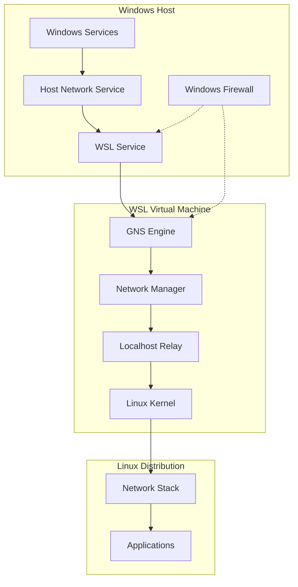
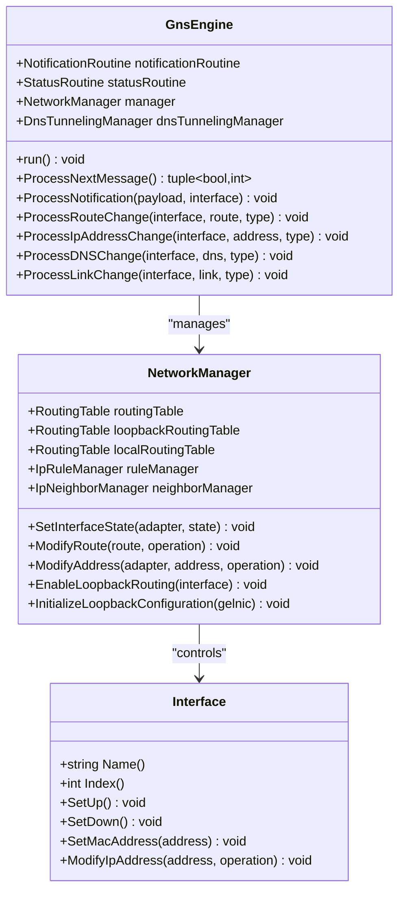
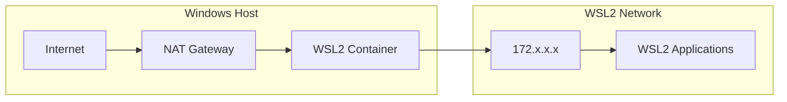
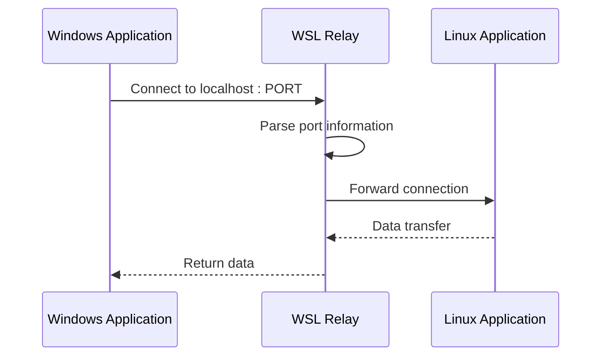
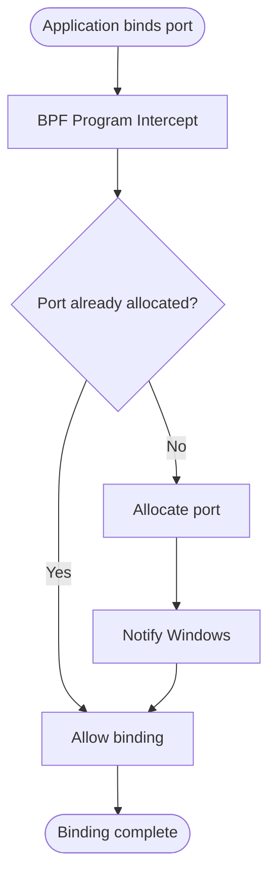
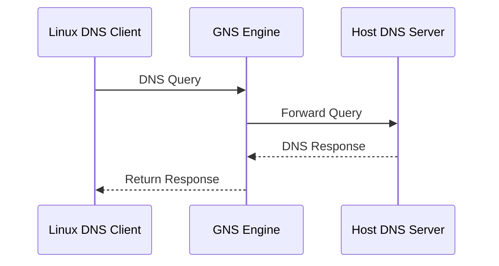
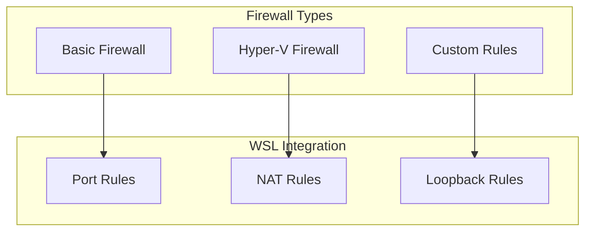
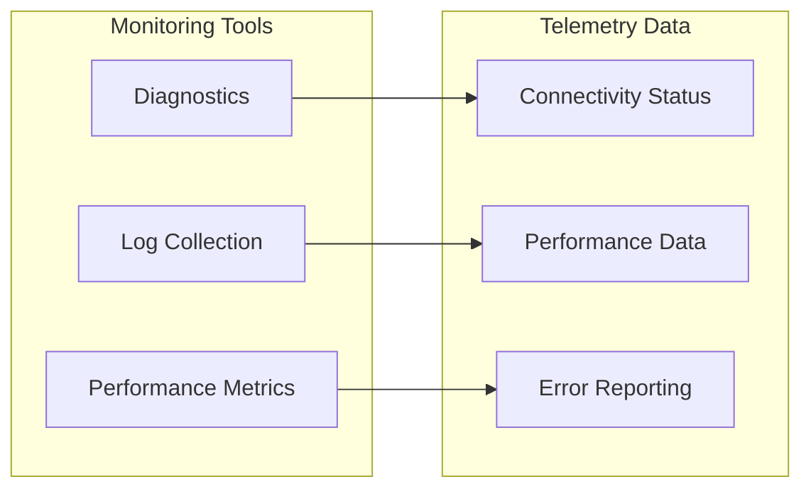

# WSL Networking Capabilities

<cite>
**Referenced Files in This Document**
- [localhost.cpp](file://src/linux/init/localhost.cpp)
- [GnsEngine.cpp](file://src/linux/init/GnsEngine.cpp)
- [NetworkManager.cpp](file://src/linux/init/NetworkManager.cpp)
- [NatNetworking.cpp](file://src/windows/service/exe/NatNetworking.cpp)
- [BridgedNetworking.cpp](file://src/windows/service/exe/BridgedNetworking.cpp)
- [GnsEngine.h](file://src/linux/init/GnsEngine.h)
- [NetworkManager.h](file://src/linux/init/NetworkManager.h)
- [socketshared.h](file://src/shared/inc/socketshared.h)
- [GnsPortTrackerChannel.cpp](file://src/windows/service/exe/GnsPortTrackerChannel.cpp)
- [main.cpp](file://src/linux/init/main.cpp)
- [GnsPortTracker.cpp](file://src/linux/init/GnsPortTracker.cpp)
- [gns.md](file://doc/docs/technical-documentation/gns.md)
- [localhost.md](file://doc/docs/technical-documentation/localhost.md)
- [WslCoreFirewallSupport.cpp](file://src/windows/common/WslCoreFirewallSupport.cpp)
- [LxssIpTables.cpp](file://src/windows/service/exe/LxssIpTables.cpp)
- [NatNetworking.cpp](file://src/windows/service/exe/NatNetworking.cpp)
- [networking.sh](file://diagnostics/networking.sh)
- [conncheckshared.h](file://src/shared/inc/conncheckshared.h)
</cite>

## Table of Contents
1. [Introduction](#introduction)
2. [Networking Architecture Overview](#networking-architecture-overview)
3. [Core Networking Components](#core-networking-components)
4. [Networking Modes](#networking-modes)
5. [Localhost Forwarding Implementation](#localhost-forwarding-implementation)
6. [DNS Resolution Through GNS](#dns-resolution-through-gns)
7. [Network Address Translation](#network-address-translation)
8. [Firewall Integration](#firewall-integration)
9. [Configuration Options](#configuration-options)
10. [Common Issues and Troubleshooting](#common-issues-and-troubleshooting)
11. [Advanced Features](#advanced-features)
12. [Conclusion](#conclusion)

## Introduction

WSL (Windows Subsystem for Linux) networking capabilities provide sophisticated mechanisms for connecting Linux distributions running in WSL2 to the Windows host and external networks. The networking system consists of multiple interconnected components that handle different aspects of network communication, from basic IP routing to advanced features like DNS tunneling and firewall integration.

The WSL networking architecture is built around several key principles:
- **Dual-mode operation**: Support for both NAT and mirrored networking modes
- **Cross-platform compatibility**: Seamless communication between Windows and Linux networking stacks
- **Security integration**: Deep integration with Windows firewall and security policies
- **Performance optimization**: Efficient packet forwarding and minimal overhead

## Networking Architecture Overview

WSL networking operates through a layered architecture that bridges Windows and Linux networking subsystems:



**Diagram sources**
- [GnsEngine.cpp](file://src/linux/init/GnsEngine.cpp#L27-L45)
- [NatNetworking.cpp](file://src/windows/service/exe/NatNetworking.cpp#L29-L42)
- [NetworkManager.cpp](file://src/linux/init/NetworkManager.cpp#L57-L61)

**Section sources**
- [GnsEngine.cpp](file://src/linux/init/GnsEngine.cpp#L27-L45)
- [NatNetworking.cpp](file://src/windows/service/exe/NatNetworking.cpp#L29-L42)

## Core Networking Components

### GNS (Guest Name Service) Engine

The GNS engine serves as the central coordinator for all networking operations within WSL2. It manages interface configuration, routing tables, DNS settings, and maintains communication channels with the Windows host.



**Diagram sources**
- [GnsEngine.h](file://src/linux/init/GnsEngine.h#L14-L77)
- [NetworkManager.h](file://src/linux/init/NetworkManager.h#L11-L94)

### Network Manager

The Network Manager handles low-level network interface operations, routing table management, and network configuration tasks. It provides abstractions for network interfaces and manages the complex routing rules required for WSL networking.

### Localhost Component

The localhost component manages port forwarding and traffic relay between Windows and Linux. It operates differently depending on the networking mode but always ensures seamless communication between host and guest applications.

**Section sources**
- [GnsEngine.cpp](file://src/linux/init/GnsEngine.cpp#L27-L752)
- [NetworkManager.cpp](file://src/linux/init/NetworkManager.cpp#L57-L538)
- [localhost.cpp](file://src/linux/init/localhost.cpp#L27-L562)

## Networking Modes

WSL supports three primary networking modes, each designed for different use cases and environments:

### NAT Mode

NAT (Network Address Translation) mode provides internet connectivity while maintaining network isolation. In this mode, WSL2 creates a private network with the host acting as a router.



**Diagram sources**
- [NatNetworking.cpp](file://src/windows/service/exe/NatNetworking.cpp#L160-L195)

**Key characteristics:**
- Private IP addressing within the WSL2 network
- Internet access through host NAT
- Port forwarding for external access
- DNS resolution through host or custom DNS servers
- Firewall integration for security

### Bridged Mode

Bridged mode connects WSL2 directly to the host's physical network interface, making it appear as a separate device on the network.

**Key characteristics:**
- Direct network access with real IP addresses
- DHCP support for automatic IP assignment
- Full network visibility and accessibility
- Requires compatible network infrastructure
- Enhanced performance for network-intensive applications

### Mirrored Mode

Mirrored mode provides the most transparent networking experience by mirroring the host's network configuration directly to the WSL2 environment.

**Key characteristics:**
- Identical network configuration to host
- Zero-configuration networking
- Advanced loopback routing support
- BPF-based port tracking for precise control
- Enhanced security through policy enforcement

**Section sources**
- [NatNetworking.cpp](file://src/windows/service/exe/NatNetworking.cpp#L160-L195)
- [BridgedNetworking.cpp](file://src/windows/service/exe/BridgedNetworking.cpp#L11-L87)
- [NetworkManager.cpp](file://src/linux/init/NetworkManager.cpp#L300-L371)

## Localhost Forwarding Implementation

WSL's localhost forwarding system enables seamless communication between Windows and Linux applications on the same machine. The implementation varies significantly between networking modes.

### NAT Mode Localhost Forwarding

In NAT mode, the localhost component monitors bound TCP ports and forwards traffic through a relay mechanism:



**Diagram sources**
- [localhost.cpp](file://src/linux/init/localhost.cpp#L29-L146)

### Mirrored Mode Port Tracking

In mirrored mode, WSL uses BPF (Berkeley Packet Filter) programs to intercept `bind()` system calls and manage port allocations directly:



**Diagram sources**
- [GnsPortTracker.cpp](file://src/linux/init/GnsPortTracker.cpp#L261-L448)

**Section sources**
- [localhost.cpp](file://src/linux/init/localhost.cpp#L29-L562)
- [GnsPortTracker.cpp](file://src/linux/init/GnsPortTracker.cpp#L199-L448)

## DNS Resolution Through GNS

WSL's DNS resolution system provides flexible and reliable name resolution through multiple mechanisms:

### DNS Tunneling

DNS tunneling enables WSL2 to resolve host network names by tunneling DNS requests through the GNS channel:



**Diagram sources**
- [NatNetworking.cpp](file://src/windows/service/exe/NatNetworking.cpp#L435-L473)

### DNS Configuration Management

The GNS engine manages `/etc/resolv.conf` dynamically based on network configuration:

| Configuration Type | Method | Purpose |
|-------------------|--------|---------|
| Host DNS Servers | Automatic detection | Primary name resolution |
| Custom DNS Servers | Manual configuration | Specific domain resolution |
| DNS Tunneling | GNS channel | Cross-platform resolution |
| Search Domains | Network discovery | Simplified hostname resolution |

**Section sources**
- [GnsEngine.cpp](file://src/linux/init/GnsEngine.cpp#L294-L338)
- [NatNetworking.cpp](file://src/windows/service/exe/NatNetworking.cpp#L435-L473)

## Network Address Translation

WSL's NAT implementation provides efficient IP address translation and network isolation:

### NAT Implementation Details

The NAT system operates through Windows HNS (Host Network Service) and provides:

- **IP Address Management**: Automatic allocation of private IP addresses
- **Port Forwarding**: Dynamic port mapping for external access
- **Gateway Configuration**: Automatic default gateway setup
- **DNS Proxy**: Integrated DNS resolution services

### NAT Configuration Options

| Setting | Description | Default Value |
|---------|-------------|---------------|
| `NatNetwork` | Network range for NAT | Automatically assigned |
| `NatGateway` | Gateway IP address | First address in network |
| `NatIpAddress` | Static IP assignment | Auto-assigned |
| `DnsTunneling` | Enable DNS tunneling | Disabled |

**Section sources**
- [NatNetworking.cpp](file://src/windows/service/exe/NatNetworking.cpp#L160-L844)

## Firewall Integration

WSL integrates deeply with Windows firewall to provide comprehensive network security:

### Windows Firewall Support

WSL supports multiple firewall configurations:



**Diagram sources**
- [WslCoreFirewallSupport.cpp](file://src/windows/common/WslCoreFirewallSupport.cpp#L810-L846)

### Firewall Configuration

| Feature | NAT Mode | Mirrored Mode | Bridged Mode |
|---------|----------|---------------|--------------|
| Basic Firewall | Supported | Not supported | Supported |
| Hyper-V Firewall | Not supported | Supported | Supported |
| Port Rules | Automatic | Automatic | Manual |
| Loopback Rules | Automatic | Automatic | Manual |

**Section sources**
- [WslCoreFirewallSupport.cpp](file://src/windows/common/WslCoreFirewallSupport.cpp#L810-L846)
- [LxssIpTables.cpp](file://src/windows/service/exe/LxssIpTables.cpp#L373-L587)

## Configuration Options

WSL networking can be configured through multiple methods:

### wsl.conf Configuration

The primary configuration method uses the `wsl.conf` file:

```ini
[wsl2]
# Networking mode selection
networkingMode = NAT

# Enable/disable localhost relay
localhostRelay = true

# DNS configuration
dnsTunneling = true
dnsTunnelingIpAddress = 192.168.1.1

# Firewall configuration
firewall = true

# Experimental features
experimental.autoMemoryReclaim = true
experimental.sparseVhd = true
```

### Registry Settings

Advanced configuration options are available through Windows registry:

| Registry Path | Purpose | Impact |
|---------------|---------|--------|
| `HKLM\SOFTWARE\Microsoft\Windows\CurrentVersion\Lxss` | Global WSL settings | System-wide defaults |
| `HKCU\SOFTWARE\Microsoft\Windows\CurrentVersion\Lxss` | User-specific settings | Per-user overrides |
| `HKLM\System\CurrentControlSet\Services\Tcpip\Parameters` | TCP/IP settings | Network stack behavior |

### Command Line Configuration

Temporary configuration changes can be made through command-line tools:

```bash
# Check current networking status
wsl --shutdown
wsl --list --verbose

# Restart with specific networking mode
wsl --shutdown
wsl --mount <distribution> --networking-mode NAT
```

**Section sources**
- [WslCoreConfig.cpp](file://src/windows/common/WslCoreConfig.cpp#L364-L396)
- [WslCoreConfig.h](file://src/windows/common/WslCoreConfig.h#L281-L304)

## Common Issues and Troubleshooting

### Port Conflicts

**Problem**: Applications fail to bind to specific ports
**Causes**: 
- Port already in use by another process
- Firewall blocking port access
- NAT port exhaustion

**Solutions**:
1. Check port availability: `netstat -tulpn | grep :PORT`
2. Use dynamic port allocation
3. Configure ignored ports in wsl.conf
4. Restart WSL service: `wsl --shutdown`

### DNS Resolution Failures

**Problem**: Unable to resolve host network names
**Causes**:
- DNS server configuration issues
- DNS tunneling disabled
- Network connectivity problems

**Solutions**:
1. Verify DNS configuration: `cat /etc/resolv.conf`
2. Test DNS resolution: `nslookup example.com`
3. Enable DNS tunneling: `wsl.conf` setting
4. Check network connectivity: `ping google.com`

### Network Connectivity Problems

**Problem**: Loss of internet or intranet access
**Causes**:
- Incorrect routing configuration
- Firewall blocking traffic
- Network adapter issues

**Diagnostic Steps**:
1. Check interface status: `ip a`
2. Verify routing table: `ip route show`
3. Test connectivity: `ping -c 4 8.8.8.8`
4. Review firewall rules: `iptables -L`

### Performance Issues

**Problem**: Slow network performance
**Causes**:
- Excessive firewall rules
- Misconfigured routing
- Resource contention

**Optimization Tips**:
1. Minimize firewall rules
2. Use appropriate networking mode
3. Monitor resource usage
4. Optimize application configuration

**Section sources**
- [networking.sh](file://diagnostics/networking.sh#L1-L64)
- [conncheckshared.h](file://src/shared/inc/conncheckshared.h#L183-L215)

## Advanced Features

### Service Discovery

WSL supports various service discovery mechanisms:

- **mDNS/Bonjour**: Local network service discovery
- **DNS-SD**: Standard DNS-based service discovery
- **LLMNR**: Link-local multicast name resolution

### Load Balancing

WSL can distribute network load across multiple interfaces:

- **Round-robin routing**: Distribute traffic evenly
- **Policy-based routing**: Route based on criteria
- **Interface bonding**: Combine multiple interfaces

### Quality of Service (QoS)

Network traffic can be prioritized based on:

- **Protocol classification**: TCP/UDP differentiation
- **Port-based prioritization**: Specific port handling
- **Application-based QoS**: Application-aware routing

### Monitoring and Telemetry

WSL provides comprehensive networking monitoring:



**Diagram sources**
- [NatNetworking.cpp](file://src/windows/service/exe/NatNetworking.cpp#L83-L103)

**Section sources**
- [NatNetworking.cpp](file://src/windows/service/exe/NatNetworking.cpp#L83-L103)
- [NetworkManager.cpp](file://src/linux/init/NetworkManager.cpp#L300-L371)

## Conclusion

WSL networking capabilities represent a sophisticated and flexible system that seamlessly bridges Windows and Linux networking environments. The architecture supports multiple networking modes, from simple NAT configurations to advanced mirrored setups, each optimized for specific use cases.

Key strengths of the WSL networking system include:

- **Flexibility**: Multiple networking modes to suit different requirements
- **Integration**: Deep integration with Windows networking infrastructure
- **Security**: Comprehensive firewall and security feature support
- **Performance**: Optimized packet forwarding and minimal overhead
- **Reliability**: Robust error handling and diagnostic capabilities

The modular design allows for easy extension and customization while maintaining stability and performance. Whether deploying development environments, production workloads, or specialized networking applications, WSL's networking capabilities provide the foundation for successful cross-platform development and deployment.

Future enhancements continue to expand WSL's networking capabilities, with ongoing improvements in performance, security, and ease of use. The system's architecture ensures that these enhancements can be integrated smoothly while maintaining backward compatibility and system stability.