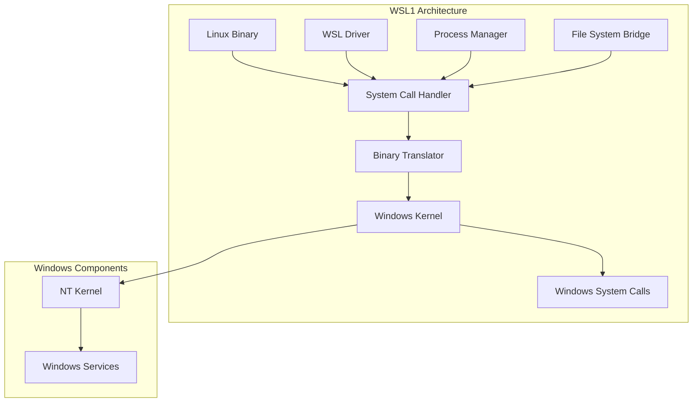
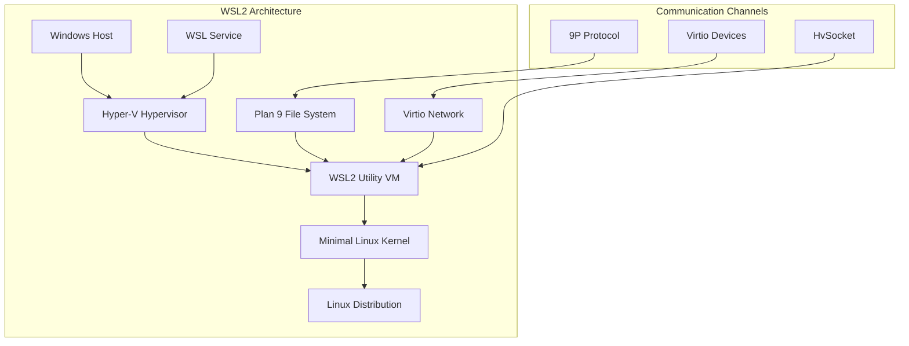
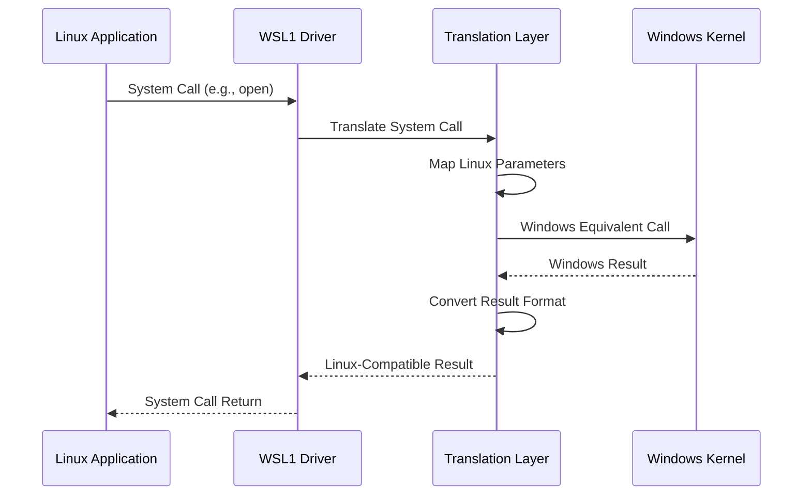
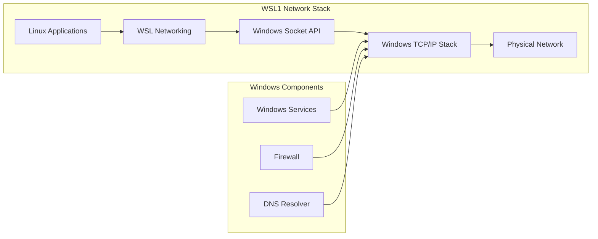

# WSL Versions

<cite>
**Referenced Files in This Document**
- [wslinfo.cpp](file://src/linux/init/wslinfo.cpp)
- [lxtutil.c](file://test/linux/unit_tests/lxtutil.c)
- [WslCoreVm.cpp](file://src/windows/service/exe/WslCoreVm.cpp)
- [LxssInstance.cpp](file://src/windows/service/exe/LxssInstance.cpp)
- [util.cpp](file://src/linux/init/util.cpp)
- [lxinitshared.h](file://src/shared/inc/lxinitshared.h)
- [NatNetworking.cpp](file://src/windows/service/exe/NatNetworking.cpp)
- [VirtioNetworking.cpp](file://src/windows/service/exe/VirtioNetworking.cpp)
- [lxdef.h](file://src/linux/inc/lxdef.h)
- [wslversioninfo.h](file://src/windows/inc/wslversioninfo.h)
</cite>

## Table of Contents
1. [Introduction](#introduction)
2. [WSL1 Execution Model](#wsl1-execution-model)
3. [WSL2 Execution Model](#wsl2-execution-model)
4. [Version Detection Mechanism](#version-detection-mechanism)
5. [Architectural Differences](#architectural-differences)
6. [System Call Translation Layer](#system-call-translation-layer)
7. [File System Behavior](#file-system-behavior)
8. [Networking Architecture](#networking-architecture)
9. [Performance Characteristics](#performance-characteristics)
10. [Compatibility Trade-offs](#compatibility-trade-offs)
11. [Use Case Recommendations](#use-case-recommendations)
12. [Troubleshooting Common Issues](#troubleshooting-common-issues)
13. [Conclusion](#conclusion)

## Introduction

The Windows Subsystem for Linux (WSL) has evolved from a simple binary translation layer to a sophisticated virtualization platform. This document explores the fundamental differences between WSL1 and WSL2 execution models, focusing on their architectural approaches, implementation details, and practical implications for developers and system administrators.

WSL1 operates as a compatibility layer that translates Linux system calls to Windows equivalents, while WSL2 employs lightweight virtualization using a minimal Linux kernel running in a virtual machine. Understanding these differences is crucial for optimizing performance, resolving compatibility issues, and making informed decisions about which version to use for specific workloads.

## WSL1 Execution Model

### Binary Translation Architecture

WSL1 implements a compatibility layer that enables direct execution of Linux binaries on Windows without requiring a full virtual machine. This approach involves several key components:



**Diagram sources**
- [LxssInstance.cpp](file://src/windows/service/exe/LxssInstance.cpp#L52-L120)
- [util.cpp](file://src/linux/init/util.cpp#L1-L50)

### Core Components

The WSL1 execution model consists of several interconnected components:

#### LXSS Driver Layer
The LXSS (Linux Subsystem) driver serves as the foundation for WSL1 operation, providing:
- Process and thread management
- Memory management interfaces
- File system virtualization
- Signal handling mechanisms

#### Process Management
WSL1 maintains a separate process tree that mirrors the Linux process hierarchy while translating system calls to Windows equivalents. This includes:
- Process creation and termination
- Signal delivery mechanisms
- Job object integration
- Security context management

#### File System Integration
The file system bridge enables transparent access to Windows file systems from Linux applications through:
- Path translation mechanisms
- Permission mapping
- Attribute conversion
- Symlink handling

**Section sources**
- [LxssInstance.cpp](file://src/windows/service/exe/LxssInstance.cpp#L52-L120)
- [util.cpp](file://src/linux/init/util.cpp#L1-L200)

## WSL2 Execution Model

### Lightweight Virtualization Architecture

WSL2 represents a significant architectural shift, implementing a complete Linux kernel environment within a virtual machine. This approach provides true Linux compatibility while maintaining the benefits of virtualization.



**Diagram sources**
- [WslCoreVm.cpp](file://src/windows/service/exe/WslCoreVm.cpp#L103-L200)
- [VirtioNetworking.cpp](file://src/windows/service/exe/VirtioNetworking.cpp#L1-L50)

### Virtual Machine Management

WSL2 utilizes Hyper-V technology to create and manage virtual machines:

#### VM Lifecycle Management
The WSL2 service orchestrates VM creation, configuration, and termination through:
- Compute System API integration
- Resource allocation and management
- Boot sequence orchestration
- Graceful shutdown procedures

#### Kernel Integration
WSL2 boots a minimal Linux kernel that provides:
- Native Linux system call support
- Hardware abstraction layer
- Device driver infrastructure
- Security isolation

#### Device Emulation
Virtio devices enable efficient hardware emulation:
- Virtio block devices for storage
- Virtio network devices for networking
- Virtio console devices for debugging
- Virtio filesystem devices for file sharing

**Section sources**
- [WslCoreVm.cpp](file://src/windows/service/exe/WslCoreVm.cpp#L103-L300)

## Version Detection Mechanism

### Implementation Using uname()

WSL implements version detection through the Linux `uname()` system call, which provides kernel information to user-space applications. The detection logic examines the kernel release string to determine the WSL version.

```mermaid
flowchart TD
A[Application Calls uname()] --> B[WSL Kernel Processes Request]
B --> C{Check Release String}
C --> |Contains "Microsoft"| D[WSL1 Detected]
C --> |No "Microsoft" String| E[WSL2 Detected]
D --> F[Return Version 1]
E --> G[Return Version 2]
H[lxtutil.c Implementation] --> C
I[Static Variable g_WslVersion] --> F
I --> G
```

**Diagram sources**
- [lxtutil.c](file://test/linux/unit_tests/lxtutil.c#L2678-L2709)

### Detection Algorithm

The version detection algorithm in `lxtutil.c` demonstrates the implementation approach:

The function examines the kernel release string returned by `uname()` and looks for the presence of the "Microsoft" substring. If found, it identifies the system as WSL1; otherwise, it assumes WSL2.

**Section sources**
- [lxtutil.c](file://test/linux/unit_tests/lxtutil.c#L2678-L2709)

## Architectural Differences

### Binary Translation vs Virtualization

The fundamental difference between WSL1 and WSL2 lies in their approach to Linux compatibility:

| Aspect | WSL1 (Binary Translation) | WSL2 (Virtualization) |
|--------|---------------------------|----------------------|
| **Execution Model** | Direct binary execution | Virtual machine execution |
| **Kernel** | Windows kernel | Native Linux kernel |
| **System Call Handling** | Translation layer | Native implementation |
| **Performance** | Moderate overhead | Near-native performance |
| **Compatibility** | Limited binary support | Full Linux compatibility |
| **Resource Usage** | Lower memory footprint | Higher memory requirements |
| **Startup Time** | Faster startup | Slower startup due to VM boot |

### Process Lifecycle Management

WSL1 and WSL2 handle process lifecycles differently:

#### WSL1 Process Management
- Direct process creation through Windows APIs
- Signal handling via Windows mechanisms
- Memory management through Windows subsystem
- Job object integration for resource control

#### WSL2 Process Management
- Native Linux process creation
- Signal handling through Linux kernel
- Memory management through Linux virtual memory system
- Container-style isolation through namespaces

**Section sources**
- [LxssInstance.cpp](file://src/windows/service/exe/LxssInstance.cpp#L300-L400)
- [WslCoreVm.cpp](file://src/windows/service/exe/WslCoreVm.cpp#L400-L500)

## System Call Translation Layer

### WSL1 Binary Translation

WSL1 implements a sophisticated system call translation layer that converts Linux system calls to equivalent Windows operations:



**Diagram sources**
- [util.cpp](file://src/linux/init/util.cpp#L100-L200)

### Translation Challenges

The binary translation approach faces several challenges:

#### Parameter Mapping
Converting Linux system call parameters to Windows equivalents requires careful consideration of:
- Data structure layouts
- Endianness differences
- Pointer size variations
- Error code translation

#### Signal Handling
Linux signals must be translated to Windows exception mechanisms, involving:
- Signal disposition mapping
- Context preservation
- Handler execution synchronization

#### File System Operations
File system operations require complex translation between:
- POSIX file semantics and NTFS semantics
- Permission models and access control lists
- Path separators and naming conventions

**Section sources**
- [util.cpp](file://src/linux/init/util.cpp#L1-L300)

## File System Behavior

### WSL1 File System Integration

WSL1 provides file system access through a bridge that translates between Linux and Windows file systems:

#### Path Translation
WSL1 converts Linux paths to Windows paths using:
- `/mnt/c/` prefix for Windows drives
- Automatic drive letter mapping
- Case-insensitive path resolution

#### Permission Mapping
File permissions are translated between Linux and Windows models:
- Unix permission bits to ACLs
- Group ownership mapping
- Special permission handling

#### Symlink Support
Symbolic links are handled through:
- NTFS symlink creation
- Junction point fallback
- Cross-platform compatibility

### WSL2 File System Architecture

WSL2 uses Plan 9 file system (9P) protocol for efficient file sharing:

#### Plan 9 Protocol
The 9P protocol enables:
- Bidirectional file system access
- Transparent file operations
- Efficient data transfer
- Real-time synchronization

#### Virtio File System
Virtio-based file system drivers provide:
- High-performance I/O operations
- Memory-efficient transfers
- Hardware acceleration support
- Scalable architecture

**Section sources**
- [util.cpp](file://src/linux/init/util.cpp#L150-L250)

## Networking Architecture

### WSL1 Networking Model

WSL1 networking relies on Windows networking stack with Linux-compatible interfaces:



**Diagram sources**
- [LxssInstance.cpp](file://src/windows/service/exe/LxssInstance.cpp#L780-L800)

### WSL2 Networking Models

WSL2 supports multiple networking modes, each optimized for different use cases:

#### NAT Networking
The default WSL2 networking mode provides:
- Automatic IP address assignment
- Internet access through host NAT
- Port forwarding capabilities
- Firewall integration

#### Bridged Networking
Bridged mode connects WSL2 directly to the physical network:
- Direct IP addressing
- Network discovery capabilities
- Advanced firewall rules
- Network segmentation support

#### Mirrored Networking
Mirrored mode provides complete network transparency:
- Identical network stack to host
- Network packet inspection
- Advanced debugging capabilities
- Development environment parity

#### Virtio Proxy Networking
Virtio proxy mode offers:
- High-performance network I/O
- Hardware-accelerated networking
- Low-latency communication
- Scalable architecture

**Section sources**
- [NatNetworking.cpp](file://src/windows/service/exe/NatNetworking.cpp#L1-L200)
- [VirtioNetworking.cpp](file://src/windows/service/exe/VirtioNetworking.cpp#L1-L50)

## Performance Characteristics

### WSL1 Performance Profile

WSL1 performance characteristics reflect its binary translation approach:

#### Advantages
- **Fast Startup**: Minimal overhead for VM boot
- **Low Memory Usage**: Shared Windows kernel resources
- **Quick Process Creation**: Direct Windows process APIs
- **Simple Architecture**: Fewer moving parts

#### Limitations
- **System Call Overhead**: Translation layer adds latency
- **Limited Compatibility**: Some Linux system calls unsupported
- **Performance Bottlenecks**: I/O operations through translation
- **Resource Contention**: Shared Windows kernel components

### WSL2 Performance Profile

WSL2 delivers near-native Linux performance:

#### Advantages
- **Native System Calls**: Direct kernel execution
- **Hardware Acceleration**: Virtio device support
- **Optimized I/O**: Efficient file system protocols
- **Scalable Architecture**: Proper virtualization overhead

#### Considerations
- **Higher Memory Usage**: VM overhead and kernel memory
- **Slower Startup**: VM boot and initialization time
- **Network Latency**: Additional virtualization layer
- **Storage Overhead**: File system virtualization costs

**Section sources**
- [WslCoreVm.cpp](file://src/windows/service/exe/WslCoreVm.cpp#L100-L200)

## Compatibility Trade-offs

### Binary Compatibility

WSL1 and WSL2 offer different levels of binary compatibility:

#### WSL1 Compatibility
- **Supported Binaries**: Most statically linked applications
- **Limitations**: Dynamic linking restrictions
- **Dependencies**: Limited library support
- **Performance**: Translation overhead for complex operations

#### WSL2 Compatibility
- **Full Linux ABI**: Complete system call support
- **Library Compatibility**: Standard Linux libraries
- **Development Tools**: Full toolchain support
- **Container Support**: Docker and container technologies

### Application Behavior

Different application categories exhibit varying compatibility:

#### Development Tools
- **IDEs and Editors**: Generally compatible with WSL2
- **Build Systems**: Full support with WSL2
- **Debuggers**: Enhanced debugging capabilities in WSL2
- **Package Managers**: Complete package ecosystem support

#### System Utilities
- **File Operations**: Improved performance in WSL2
- **Process Management**: Better signal handling in WSL2
- **Network Tools**: Advanced networking capabilities in WSL2
- **System Monitoring**: Enhanced system introspection in WSL2

**Section sources**
- [LxssInstance.cpp](file://src/windows/service/exe/LxssInstance.cpp#L400-L500)

## Use Case Recommendations

### When to Choose WSL1

Select WSL1 for scenarios requiring:
- **Quick Development Setup**: Fast startup and minimal overhead
- **Lightweight Workloads**: Simple applications and scripts
- **Legacy Compatibility**: Existing WSL1 applications
- **Resource-Constrained Environments**: Limited memory and storage
- **Basic Linux Tools**: Essential utilities and command-line tools

### When to Choose WSL2

Choose WSL2 for:
- **Full Development Environments**: Complete Linux development stacks
- **Container Technologies**: Docker and Kubernetes workloads
- **High-Performance Computing**: I/O-intensive applications
- **System Administration**: Administrative tasks and monitoring
- **Advanced Networking**: Complex network configurations
- **GUI Applications**: Graphical Linux applications

### Migration Strategies

#### WSL1 to WSL2 Migration
- **Backup Data**: Export important data and configurations
- **Test Applications**: Verify application compatibility
- **Adjust Settings**: Configure networking and resource allocation
- **Monitor Performance**: Track performance improvements

#### Hybrid Approaches
- **Environment-Specific Selection**: Use WSL1 for quick tasks, WSL2 for heavy workloads
- **Application-Based Routing**: Route specific applications to appropriate WSL version
- **Development Workflow**: Leverage WSL2 for development, WSL1 for deployment

**Section sources**
- [WslCoreVm.cpp](file://src/windows/service/exe/WslCoreVm.cpp#L500-L600)

## Troubleshooting Common Issues

### Version Switching Failures

Common issues when switching between WSL versions:

#### WSL1 to WSL2 Transition Problems
- **Virtual Machine Platform Missing**: Install Hyper-V and Virtual Machine Platform features
- **Insufficient Resources**: Ensure adequate RAM and disk space
- **Conflicting Software**: Disable conflicting virtualization software
- **Permission Issues**: Run PowerShell as administrator

#### WSL2 to WSL1 Transition Issues
- **Data Migration**: Export and import data between versions
- **Configuration Loss**: Backup and restore WSL configuration
- **Application Compatibility**: Test application functionality
- **Performance Degradation**: Monitor resource usage and optimize

### Kernel Compatibility Problems

#### WSL2 Kernel Issues
- **Unsupported Features**: Verify kernel module compatibility
- **Hardware Requirements**: Check CPU virtualization support
- **Memory Constraints**: Ensure sufficient RAM allocation
- **Storage Performance**: Optimize VHD/VHDX settings

#### WSL1 Translation Issues
- **System Call Failures**: Identify unsupported system calls
- **Library Dependencies**: Resolve missing library requirements
- **Permission Problems**: Configure proper file system permissions
- **Path Resolution**: Fix path translation issues

### Performance Bottlenecks

#### WSL1 Performance Issues
- **Slow I/O Operations**: Optimize file system access patterns
- **High CPU Usage**: Reduce translation overhead
- **Memory Fragmentation**: Monitor memory allocation patterns
- **Network Latency**: Configure network settings appropriately

#### WSL2 Performance Issues
- **VM Boot Time**: Optimize VM configuration and startup
- **Storage I/O**: Use SSD storage and optimize file system settings
- **Network Throughput**: Configure network adapters and drivers
- **Memory Usage**: Adjust VM memory allocation and compression

**Section sources**
- [WslCoreVm.cpp](file://src/windows/service/exe/WslCoreVm.cpp#L150-L250)

## Conclusion

The evolution from WSL1 to WSL2 represents a fundamental shift in how Linux compatibility is achieved on Windows. While WSL1 provides a lightweight solution for basic Linux functionality, WSL2 offers true Linux compatibility with near-native performance characteristics.

Understanding the architectural differences, implementation details, and practical implications of each approach enables developers and system administrators to make informed decisions about which version to use for specific workloads. The choice between WSL1 and WSL2 should consider factors such as performance requirements, compatibility needs, resource constraints, and development workflow preferences.

As WSL continues to evolve, both versions will likely see continued improvements and optimizations. Staying informed about these developments and understanding the underlying architectures will help maximize productivity and effectiveness when working with Linux environments on Windows systems.

The future of WSL promises even greater integration between Windows and Linux ecosystems, with ongoing improvements in performance, compatibility, and user experience. Whether choosing WSL1 for its simplicity and speed or WSL2 for its completeness and power, users can expect continued enhancements that expand the possibilities of cross-platform development and system administration.