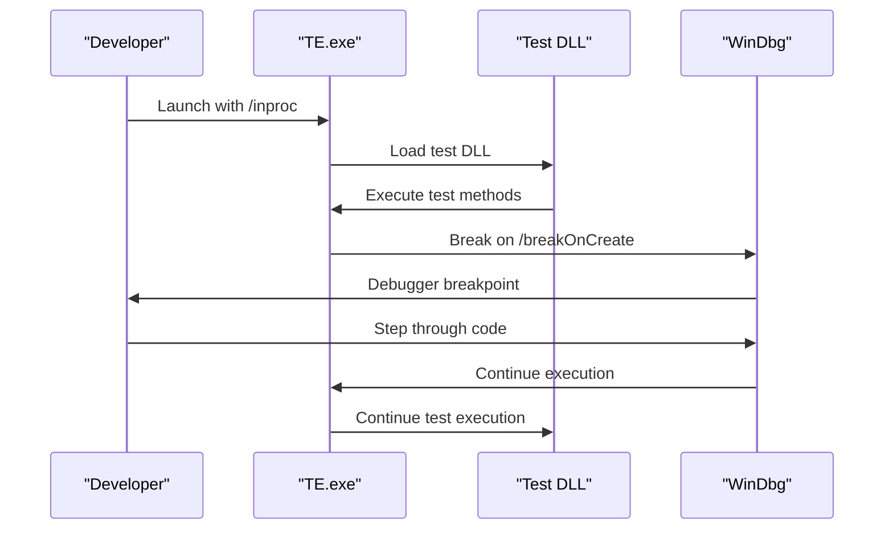
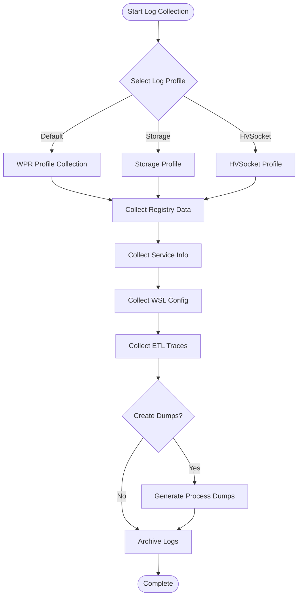
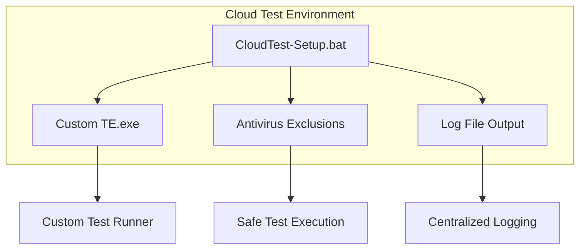
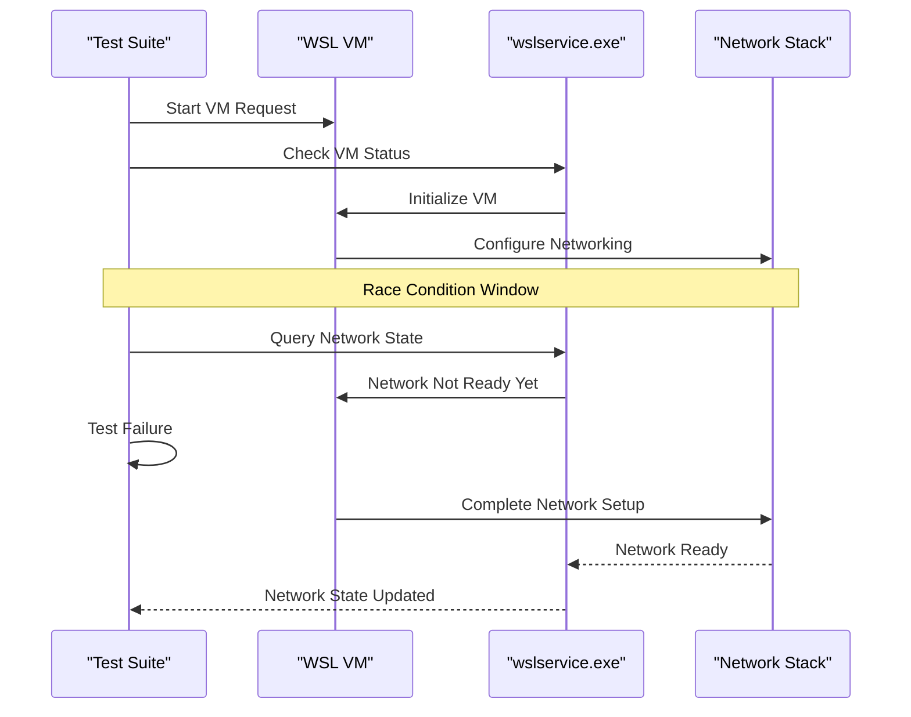
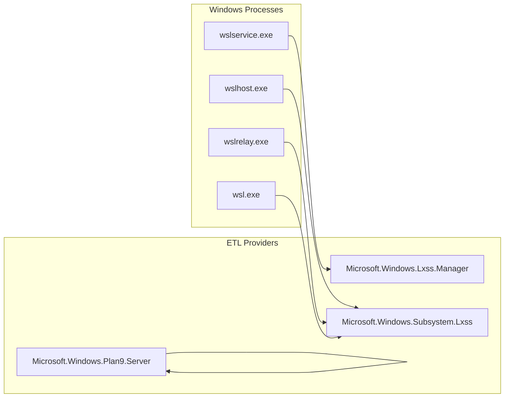

# Debugging Tests

<cite>
**Referenced Files in This Document**
- [debugging.md](file://doc/docs/debugging.md)
- [collect-wsl-logs.ps1](file://diagnostics/collect-wsl-logs.ps1)
- [dump-init.sh](file://diagnostics/dump-init.sh)
- [dump-init-stacks.sh](file://diagnostics/dump-init-stacks.sh)
- [networking.sh](file://diagnostics/networking.sh)
- [CloudTest-Setup.bat](file://tools/test/CloudTest-Setup.bat)
- [Common.h](file://test/windows/Common.h)
- [Common.cpp](file://test/windows/Common.cpp)
- [lxsstest.h](file://test/windows/lxsstest.h)
- [run-tests.ps1](file://tools/test/run-tests.ps1)
- [README.md](file://test/README.md)
- [Dmesg.cpp](file://src/windows/service/exe/Dmesg.cpp)
- [Dmesg.h](file://src/windows/service/exe/Dmesg.h)
- [WslCoreVm.cpp](file://src/windows/service/exe/WslCoreVm.cpp)
- [NetworkTests.cpp](file://test/windows/NetworkTests.cpp)
</cite>

## Table of Contents
1. [Introduction](#introduction)
2. [Test Execution Debugging](#test-execution-debugging)
3. [Debugger Attachment Techniques](#debugger-attachment-techniques)
4. [Diagnostic Scripts and Tools](#diagnostic-scripts-and-tools)
5. [Cloud-Based Test Environment Setup](#cloud-based-test-environment-setup)
6. [Common Test Failure Patterns](#common-test-failure-patterns)
7. [Logging and Telemetry Strategies](#logging-and-telemetry-strategies)
8. [Post-Mortem Analysis](#post-mortem-analysis)
9. [Best Practices](#best-practices)
10. [Troubleshooting Guide](#troubleshooting-guide)

## Introduction

WSL (Windows Subsystem for Linux) employs a comprehensive testing framework built on the Test Authoring and Execution Framework (TAEF) to ensure reliability and stability. Debugging WSL tests requires specialized techniques for diagnosing failures, understanding race conditions, and analyzing complex interactions between Windows and Linux components. This guide provides practical techniques for effectively debugging WSL tests, from basic test execution to advanced post-mortem analysis.

The WSL testing infrastructure encompasses multiple layers:
- **Windows-side tests**: Implemented using TAEF framework for system-level testing
- **Linux-side unit tests**: Standalone executable tests for kernel and filesystem components
- **Integration tests**: Cross-platform tests validating communication between Windows and Linux
- **Cloud-based testing**: Automated testing infrastructure for continuous integration

## Test Execution Debugging

### Basic Test Execution Commands

WSL tests are executed using the `TE.exe` binary from the TAEF framework. The basic execution pattern follows:

```bash
TE.exe test1.dll test2.dll [options]
```

### Essential Debugging Parameters

#### /inproc Mode for WinDbg Integration

The `/inproc` parameter is crucial for debugging tests with WinDbg:

```bash
TE.exe test1.dll /inproc
```

This executes tests within the TE.exe process rather than in separate TE.ProcessHost.exe child processes, enabling seamless debugger attachment.

#### Breakpoint Control Parameters

For granular debugging control, use these parameters:

- **/breakOnCreate**: Breaks when instantiating a test class
- **/breakOnError**: Breaks when an error or test failure is logged  
- **/breakOnInvoke**: Breaks before test method invocation

Combined usage example:
```bash
TE.exe test1.dll /inproc /breakOnCreate /breakOnError /breakOnInvoke
```

#### Test Selection and Filtering

Use wildcard patterns to target specific tests:
```bash
TE.exe test1.dll /name:*UnitTest*
TE.exe test1.dll /name:*SpecificTest*
```

### Runtime Parameter Passing

Pass runtime parameters to tests using the `/p:` syntax:
```bash
TE.exe test1.dll /p:"foo=hello" /p:"bar=2"
```

Retrieve parameters in test code:
```cpp
using namespace WEX::Common;
using namespace WEX::TestExecution;

String runtimeParamString;
DWORD fooBar;

VERIFY_SUCCEEDED(RuntimeParameters::TryGetValue(L"foo", runtimeParamString));
VERIFY_SUCCEEDED(RuntimeParameters::TryGetValue(L"bar", fooBar));
```

**Section sources**
- [README.md](file://test/README.md#L15-L67)
- [run-tests.ps1](file://tools/test/run-tests.ps1#L48-L53)

## Debugger Attachment Techniques

### WinDbg Integration with /inproc Mode

The `/inproc` mode enables powerful debugging scenarios by running tests in-process:



**Diagram sources**
- [README.md](file://test/README.md#L31-L42)

### Using /waitfordebugger for Manual Attachment

The `/waitfordebugger` parameter pauses test execution until a debugger attaches:

```bash
test.bat /name:*UnitTest* -f /waitfordebugger
```

This technique is particularly useful for:
- Interactive debugging sessions
- Memory analysis scenarios
- Complex state inspection

### /breakonfailure for Automatic Breakpoint

Automatically break on the first test failure:
```bash
TE.exe test1.dll /breakonfailure
```

This parameter is invaluable for:
- Identifying root causes of test failures
- Capturing failure state immediately
- Reducing debugging iteration time

**Section sources**
- [README.md](file://test/README.md#L31-L42)
- [dev-loop.md](file://doc/docs/dev-loop.md#L69-L75)

## Diagnostic Scripts and Tools

### Comprehensive Log Collection

The `collect-wsl-logs.ps1` script provides automated log collection for post-mortem analysis:



**Diagram sources**
- [collect-wsl-logs.ps1](file://diagnostics/collect-wsl-logs.ps1#L1-L172)

Key features of the log collection script:
- **Multiple log profiles**: Default, storage, and hvsocket-specific collections
- **Automated registry capture**: Critical WSL configuration data
- **Process dump generation**: Memory dumps for crashed processes
- **Comprehensive system state**: Service states, network configuration, and system information

### Linux Initialization Stack Analysis

The `dump-init.sh` script provides detailed Linux-side debugging information:

```bash
# Execute in debug shell (wsl.exe -u root --debug-shell)
./dump-init.sh
```

This script captures:
- **Process enumeration**: All running processes with parent-child relationships
- **Stack traces**: Thread stack information for each process
- **File descriptor analysis**: Open file descriptors and their states
- **Memory statistics**: System memory information
- **HVSocket connections**: Virtual socket network state

### Network Diagnostics

The `networking.sh` script provides comprehensive network troubleshooting:

Key diagnostic areas:
- **Interface configuration**: IP addresses, routing tables, and network interfaces
- **DNS resolution**: DNS server configuration and resolution capabilities
- **Firewall rules**: iptables and nftables rule sets
- **Proxy configuration**: HTTP/HTTPS proxy settings and PAC URLs

**Section sources**
- [collect-wsl-logs.ps1](file://diagnostics/collect-wsl-logs.ps1#L1-L172)
- [dump-init.sh](file://diagnostics/dump-init.sh#L1-L74)
- [networking.sh](file://diagnostics/networking.sh#L1-L64)

## Cloud-Based Test Environment Setup

### CloudTest-Setup.bat Configuration

The cloud-based testing infrastructure uses specialized setup scripts for cloud environments:



**Diagram sources**
- [CloudTest-Setup.bat](file://tools/test/CloudTest-Setup.bat#L1-L11)

### Environment Configuration Details

The CloudTest-Setup.bat script performs several critical configurations:

1. **Custom TE.exe Path**: Sets the CloudTestWorkerCustomTaefExe environment variable
2. **Log Directory Creation**: Establishes centralized log output directories
3. **Symbolic Link Creation**: Links test output directories for accessibility
4. **Antivirus Exclusions**: Adds WSL processes to antivirus exclusion lists

### Cloud-Specific Considerations

Cloud-based testing environments require special attention to:
- **Resource isolation**: Ensuring tests don't interfere with each other
- **Network configuration**: Proper virtual networking setup
- **Storage limitations**: Managing test data and temporary files
- **Security policies**: Compliance with organizational security requirements

**Section sources**
- [CloudTest-Setup.bat](file://tools/test/CloudTest-Setup.bat#L1-L11)

## Common Test Failure Patterns

### Race Condition Scenarios

Race conditions are among the most challenging test failures to diagnose and resolve. Common patterns include:

#### VM Startup Race Conditions



**Diagram sources**
- [NetworkTests.cpp](file://test/windows/NetworkTests.cpp#L3872-L3899)

The networking subsystem demonstrates sophisticated race condition handling through heuristics:

```cpp
static void WaitForMirroredStateInLinux()
{
    // Wait for networking state mirroring completion
    // Uses default routes as indicator of complete mirroring
    Stopwatch<std::chrono::seconds> Watchdog(std::chrono::seconds(30));
    
    do {
        // Check for gateway presence as mirror completion indicator
        for (const auto& i : GetAllInterfaceStates()) {
            if (i.Gateway.has_value()) {
                // Gateway presence indicates complete mirroring
                return;
            }
        }
    } while (!Watchdog.HasExpired());
}
```

#### File System Permission Issues

File system permission problems often manifest as intermittent test failures:

Common failure patterns:
- **Temporary file creation**: Race conditions in temp file creation
- **Directory permissions**: Insufficient permissions for test directories
- **Symbolic link creation**: Permission issues with symlink operations
- **Mount point conflicts**: Conflicting mount operations

### Timeout-Related Failures

Timeout-related failures can occur at multiple levels:

#### Test Execution Timeouts

```cpp
#define LXSS_DEFAULT_TIMEOUT (15 * 1000)
#define LXSS_INSTANCE_TEST_TIMEOUT (3 * 1000)
#define LXSS_WATCHDOG_TIMEOUT (3 * 60 * 60 * 1000)
```

These timeouts serve different purposes:
- **Default timeouts**: General test execution limits
- **Instance timeouts**: VM startup and initialization limits
- **Watchdog timeouts**: Long-running operation protection

#### Network Connectivity Timeouts

Network-related timeouts often indicate underlying infrastructure issues:
- **DNS resolution delays**: Slow DNS servers or misconfiguration
- **Connection establishment**: Network latency or firewall blocking
- **Data transfer timeouts**: Bandwidth limitations or congestion

### Memory and Resource Exhaustion

Resource exhaustion failures typically exhibit these patterns:
- **Memory leaks**: Gradual memory consumption in long-running tests
- **Handle exhaustion**: Unreleased file handles or process handles
- **Disk space**: Insufficient temporary storage for test operations
- **CPU utilization**: High CPU usage causing test timeouts

**Section sources**
- [NetworkTests.cpp](file://test/windows/NetworkTests.cpp#L3872-L3899)
- [Common.h](file://test/windows/Common.h#L32-L50)

## Logging and Telemetry Strategies

### Windows Side Logging Infrastructure

WSL implements comprehensive logging through multiple channels:

#### ETL Trace Collection

The primary logging mechanism uses Event Tracing for Windows (ETL):



**Diagram sources**
- [debugging.md](file://doc/docs/debugging.md#L19-L35)

Key ETL providers and their significance:
- **Microsoft.Windows.Lxss.Manager**: VM lifecycle events, guest logs, errors
- **Microsoft.Windows.Subsystem.Lxss**: User-visible errors and general WSL events
- **Microsoft.Windows.Plan9.Server**: Plan9 filesystem operations

#### Kernel-Level Logging

Linux-side logging occurs through `/dev/kmsg` and dmesg:

```cpp
int InitializeLogging(bool SetStderr, wil::LogFunction* ExceptionCallback)
{
    auto devicePath = DEVFS_PATH "/kmsg";
    g_LogFd = TEMP_FAILURE_RETRY(open(devicePath, (O_WRONLY | O_CLOEXEC)));
    if (g_LogFd < 0) {
        g_LogFd = STDERR_FILENO;
        LOG_ERROR("open({}) failed {}", devicePath, errno);
        return -1;
    }
}
```

### Telemetry Collection

WSL implements extensive telemetry for monitoring and debugging:

#### VM Crash Telemetry

Critical error conditions trigger comprehensive telemetry collection:

```cpp
WSL_LOG_TELEMETRY(
    "FailedToStartVm",
    PDT_ProductAndServicePerformance,
    TraceLoggingValue(VmId, "vmId"),
    TraceLoggingValue(hr, "error"),
    CONFIG_TELEMETRY(newInstance->m_vmConfig));
```

#### Runtime Telemetry

Runtime telemetry captures:
- **Performance metrics**: VM startup times, operation durations
- **Error rates**: Failure frequencies and patterns
- **Resource utilization**: Memory, CPU, and I/O usage
- **Configuration changes**: Dynamic configuration modifications

### Remote Debugging Considerations

Remote debugging scenarios require careful consideration of:
- **Network latency**: Impact on debugging session responsiveness
- **Credential management**: Secure access to remote systems
- **Log aggregation**: Centralized collection of distributed logs
- **Synchronization**: Coordinating debugging activities across multiple systems

**Section sources**
- [debugging.md](file://doc/docs/debugging.md#L1-L66)
- [Dmesg.cpp](file://src/windows/service/exe/Dmesg.cpp#L1-L45)
- [Dmesg.h](file://src/windows/service/exe/Dmesg.h#L1-L53)

## Post-Mortem Analysis

### Automated Diagnostic Collection

The diagnostic infrastructure provides comprehensive post-mortem analysis capabilities:

#### Process State Analysis

The dump-init-stacks.sh script performs detailed process state analysis:

```bash
#!/bin/bash
# Process enumeration and stack analysis
for proc in /proc/[0-9]*; do
    pid=$(basename "$proc")
    echo "Process: $pid"
    echo "cmd: $(cat "/proc/$pid/cmdline" 2>/dev/null)"
    echo "stat: $(cat "/proc/$pid/stat" 2>/dev/null)"
    
    # Thread stack analysis
    for tid in $(ls "/proc/$pid/task" 2>/dev/null); do
        echo "tid: $tid - $(cat "/proc/$pid/task/$tid/comm" 2>/dev/null)"
        cat "/proc/$pid/task/$tid/stack" 2>/dev/null
    done
done
```

#### Memory Dump Generation

The collection script generates memory dumps for crashed processes:

```powershell
# Process dump generation for crashed applications
$executables = "wsl", "wslservice", "wslhost", "msrdc", "dllhost"
foreach($process in Get-Process | Where-Object { $executables -contains $_.ProcessName}) {
    $dumpFile = "$dumpFolder\$($process.ProcessName).$($process.Id).dmp"
    # Generate dump using Windows API
}
```

### Log Correlation and Analysis

Effective post-mortem analysis requires correlating logs from multiple sources:

#### Timeline Reconstruction

Reconstruct failure timelines by aligning events across:
- **Windows system logs**: Event Viewer entries and system events
- **WSL service logs**: wslservice.exe and related service events
- **Linux kernel logs**: dmesg and kernel message logs
- **Application logs**: Test execution logs and custom logging

#### Pattern Recognition

Common failure patterns to look for:
- **Recurring errors**: Repeated error messages indicating systemic issues
- **Timing correlations**: Errors occurring at specific intervals or after certain operations
- **Resource patterns**: Resource exhaustion or allocation failures
- **Configuration drift**: Unexpected changes in system configuration

### Automated Analysis Tools

The diagnostic infrastructure includes automated analysis capabilities:

#### Log Parsing and Analysis

```cpp
NTSTATUS LxsstuParseLinuxLogFiles(__in PCWSTR LogFileName, __out PBOOL TestPassed)
{
    // Parse Linux log files for test results
    // Extract pass/fail information and error details
}
```

#### Health Monitoring

Continuous health monitoring tracks:
- **System stability**: Long-term failure rates and patterns
- **Performance trends**: Degradation over time
- **Resource utilization**: Capacity planning and optimization
- **Security events**: Unauthorized access attempts and anomalies

**Section sources**
- [dump-init-stacks.sh](file://diagnostics/dump-init-stacks.sh#L1-L28)
- [collect-wsl-logs.ps1](file://diagnostics/collect-wsl-logs.ps1#L135-L167)
- [Common.cpp](file://test/windows/Common.cpp#L1710-L1728)

## Best Practices

### Debugging Workflow

Establish a systematic debugging workflow:

1. **Reproduce consistently**: Ensure the failure occurs reliably
2. **Capture comprehensive logs**: Use diagnostic scripts to collect all relevant data
3. **Isolate the issue**: Narrow down the scope to specific components
4. **Analyze systematically**: Correlate logs and identify root causes
5. **Verify fixes**: Confirm that proposed solutions resolve the issue

### Environment Management

Maintain clean, reproducible testing environments:

#### Clean Test Execution

```bash
# Clean environment setup
wsl --shutdown
wsl --unregister test_distro
# Reinstall fresh test distribution
```

#### Configuration Isolation

Use isolated configurations for different test scenarios:
- **Minimal configurations**: Base configurations for basic functionality tests
- **Advanced configurations**: Complex setups for integration testing
- **Stress configurations**: High-load scenarios for performance testing

### Debugging Tool Selection

Choose appropriate debugging tools for different scenarios:

#### For Windows Components
- **WinDbg**: Full-featured debugger for Windows processes
- **Visual Studio**: Integrated development environment with debugging support
- **Process Monitor**: File and registry access monitoring

#### For Linux Components
- **GDB**: Standard Linux debugger
- **strace**: System call tracing
- **valgrind**: Memory debugging and profiling

#### For Cross-Platform Issues
- **Wireshark**: Network traffic analysis
- **ETW collectors**: Windows event tracing
- **System Monitor**: Real-time system performance monitoring

### Documentation and Knowledge Sharing

Maintain comprehensive documentation of debugging procedures:

#### Debugging Procedures
- **Step-by-step guides**: Detailed instructions for common debugging scenarios
- **Troubleshooting matrices**: Decision trees for identifying failure causes
- **Known issues**: List of documented bugs and their workarounds

#### Lessons Learned
- **Common pitfalls**: Frequently encountered debugging mistakes
- **Efficiency tips**: Time-saving techniques and shortcuts
- **Tool recommendations**: Best tools for specific debugging scenarios

## Troubleshooting Guide

### Common Debugging Issues

#### Debugger Attachment Problems

**Problem**: Cannot attach debugger to test process
**Solutions**:
- Verify `/inproc` parameter is used for in-process debugging
- Check process permissions and elevation requirements
- Ensure debugger is running with appropriate privileges

#### Log Collection Failures

**Problem**: Diagnostic scripts fail to collect logs
**Solutions**:
- Verify administrator privileges for log collection
- Check available disk space for log files
- Ensure required dependencies are installed

#### Test Execution Timeouts

**Problem**: Tests hang or timeout unexpectedly
**Solutions**:
- Increase timeout values for complex operations
- Check for resource contention or system overload
- Verify network connectivity and external dependencies

### Performance Optimization

#### Reducing Debugging Iteration Time

Optimize debugging workflows for faster iteration:
- Use targeted test selection with `/name:` parameters
- Implement incremental debugging approaches
- Leverage automated log collection to reduce manual effort

#### Memory and Resource Management

Monitor and optimize resource usage during debugging:
- Close unnecessary applications to free memory
- Use lightweight debugging tools when possible
- Implement proper cleanup procedures for test artifacts

### Advanced Debugging Techniques

#### Multi-Process Debugging

Debug complex scenarios involving multiple processes:
- Use process correlation techniques to track interactions
- Implement logging synchronization across processes
- Employ distributed debugging tools for cross-process analysis

#### Network Debugging

Debug network-related issues:
- Use packet capture tools for network analysis
- Implement network monitoring and alerting
- Test network configurations in isolation

#### File System Debugging

Debug file system operations:
- Monitor file system events and access patterns
- Use file system monitoring tools for analysis
- Test file system operations under stress conditions

**Section sources**
- [Common.cpp](file://test/windows/Common.cpp#L1925-L1977)
- [WslCoreVm.cpp](file://src/windows/service/exe/WslCoreVm.cpp#L130-L164)