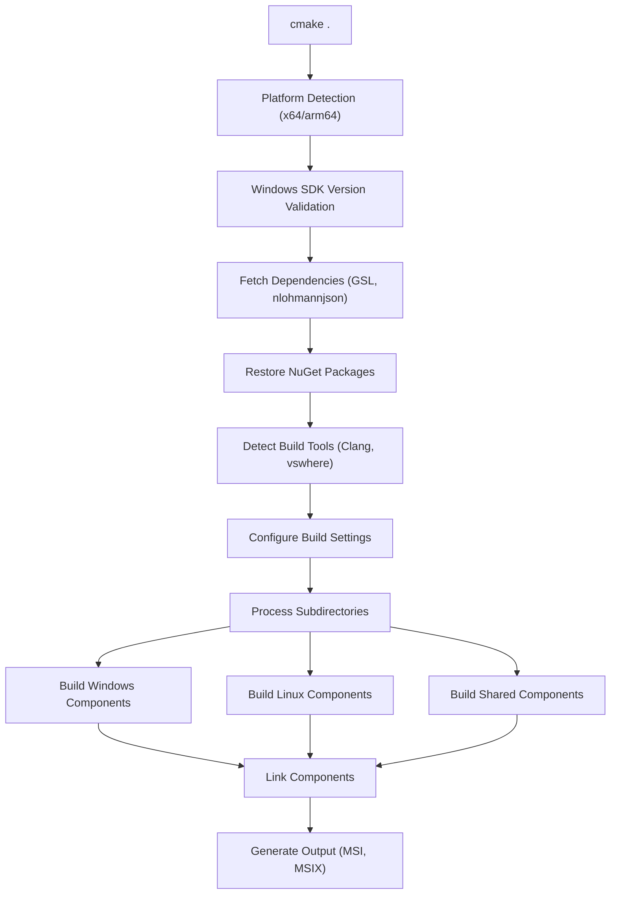
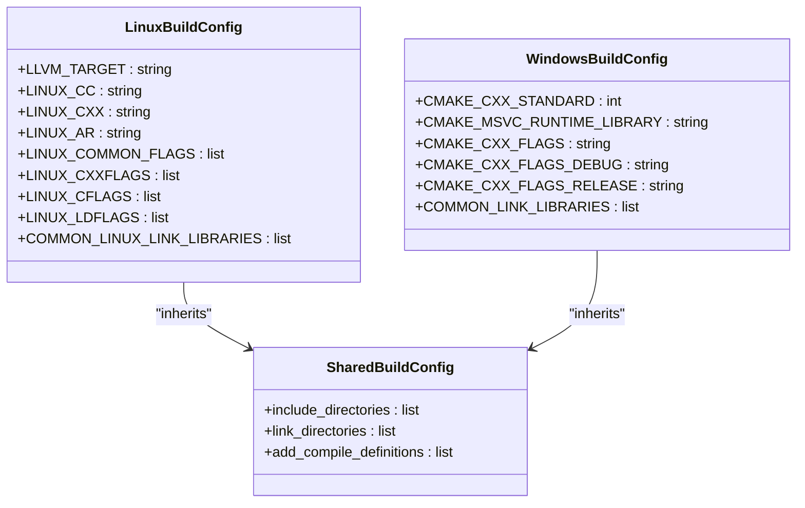
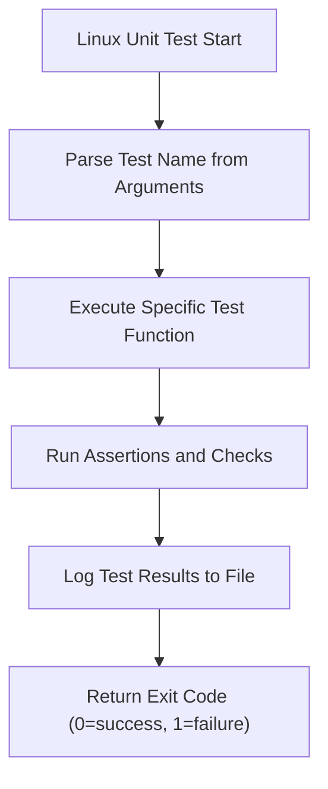
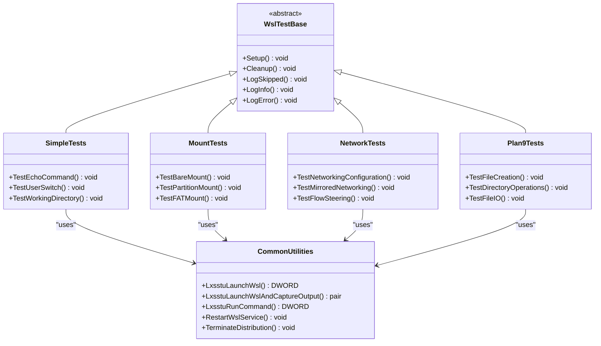
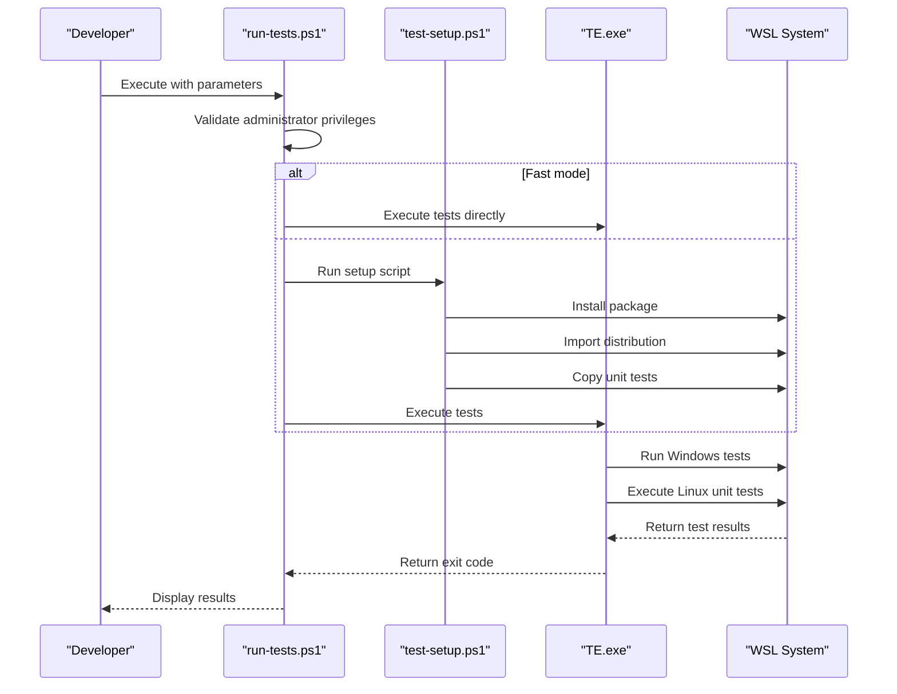
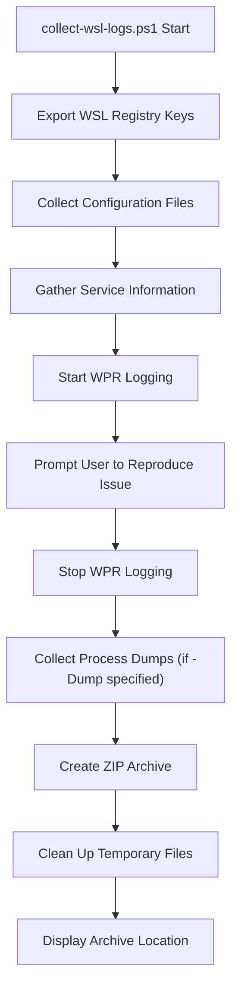

# Development and Testing

<cite>
**Referenced Files in This Document**   
- [CMakeLists.txt](file://CMakeLists.txt)
- [dev-loop.md](file://doc/docs/dev-loop.md)
- [README.md](file://README.md)
- [test/windows/CMakeLists.txt](file://test/windows/CMakeLists.txt)
- [test/linux/unit_tests/Makefile](file://test/linux/unit_tests/Makefile)
- [test/linux/unit_tests/build_tests.sh](file://test/linux/unit_tests/build_tests.sh)
- [tools/test/run-tests.ps1](file://tools/test/run-tests.ps1)
- [tools/deploy/deploy-to-host.ps1](file://tools/deploy/deploy-to-host.ps1)
- [diagnostics/collect-wsl-logs.ps1](file://diagnostics/collect-wsl-logs.ps1)
- [diagnostics/collect-networking-logs.ps1](file://diagnostics/collect-networking-logs.ps1)
- [test/README.md](file://test/README.md)
- [tools/test/test.bat.in](file://tools/test/test.bat.in)
- [test/windows/Common.h](file://test/windows/Common.h)
- [test/linux/unit_tests/unittests.h](file://test/linux/unit_tests/unittests.h)
</cite>

## Table of Contents
1. [Development Environment Setup](#development-environment-setup)
2. [Build Process with CMake](#build-process-with-cmake)
3. [Testing Framework Structure](#testing-framework-structure)
4. [Running Tests](#running-tests)
5. [Diagnostic Tools and Log Collection](#diagnostic-tools-and-log-collection)
6. [Development Utilities](#development-utilities)
7. [Advanced Testing and Debugging](#advanced-testing-and-debugging)

## Development Environment Setup

To develop and test WSL, you need to set up a proper development environment with the required tools and configurations. The repository uses CMake as the build system and requires specific versions of Visual Studio and Windows SDK.

The prerequisites for building WSL include:
- CMake version 2.25 or higher
- Visual Studio with specific components including Windows SDK 26100, MSBuild, Universal Windows platform support, MSVC v143 C++ ARM64 build tools, C++ Clang compiler for Windows, and .NET development tools
- Developer Mode enabled in Windows Settings or running the build process with Administrator privileges to support symbolic links

The development environment must be properly configured to handle both Windows and Linux components of WSL. This includes setting up the necessary build tools for cross-compilation of Linux components using Clang/LLVM, which is integrated into the Visual Studio toolchain.

**Section sources**
- [dev-loop.md](file://doc/docs/dev-loop.md#L1-L21)
- [CMakeLists.txt](file://CMakeLists.txt#L1-L447)

## Build Process with CMake

The WSL build process is orchestrated through CMake, which manages the compilation and linking of different components across Windows and Linux platforms. The build system is designed to handle three main component types: Windows-specific, Linux-specific, and shared components.

The build process begins by generating a Visual Studio solution file (wsl.sln) using the command `cmake .` from the repository root. This command processes the root CMakeLists.txt file and generates the necessary build configuration. The build can be customized using various parameters:



**Diagram sources**
- [CMakeLists.txt](file://CMakeLists.txt#L1-L447)
- [dev-loop.md](file://doc/docs/dev-loop.md#L22-L38)

**Section sources**
- [CMakeLists.txt](file://CMakeLists.txt#L1-L447)
- [dev-loop.md](file://doc/docs/dev-loop.md#L22-L38)

### Windows Components Build

Windows components are built using the MSVC compiler and are organized in the src/windows directory. Each component has its own CMakeLists.txt file that defines the build configuration. The build system uses target_link_libraries to link against common libraries and dependencies.

Key Windows components include:
- wsl.exe: The main WSL command-line interface
- wslservice.exe: The WSL service that manages distributions
- wslhost.exe: The host process for WSL distributions
- wslrelay.exe: Handles network relay functionality
- wslg.exe: Supports Linux GUI applications in WSL

The Windows components are built as shared libraries or executables and are linked against Windows system libraries and third-party dependencies managed through NuGet packages.

### Linux Components Build

Linux components are cross-compiled for the target architecture (x64 or arm64) using Clang/LLVM. The build system configures Clang with specific flags and paths to ensure compatibility with the WSL environment.

The Linux components are located in the src/linux directory and include:
- init: The initialization system for WSL distributions
- netlinkutil: Utilities for network communication
- mountutil: Tools for filesystem mounting
- plan9: Implementation of the Plan 9 filesystem protocol

The build process for Linux components uses a custom toolchain configuration that sets the target to musl-based Linux systems. The compilation flags include architecture-specific definitions, include paths for WSL-specific headers, and optimization settings.



**Diagram sources**
- [CMakeLists.txt](file://CMakeLists.txt#L259-L367)
- [CMakeLists.txt](file://CMakeLists.txt#L176-L227)

**Section sources**
- [CMakeLists.txt](file://CMakeLists.txt#L259-L367)
- [CMakeLists.txt](file://CMakeLists.txt#L176-L227)

### Shared Components Build

Shared components are built to be used by both Windows and Linux parts of the system. These components are located in the src/shared directory and include configuration file handling and common utilities.

The shared components are compiled with settings that ensure compatibility across both platforms. They are linked into both Windows executables and Linux binaries as needed. The build system ensures that shared components are built only once and referenced by both platform-specific build processes.

## Testing Framework Structure

The WSL testing framework is built around the Test Authoring and Execution Framework (TAEF), Microsoft's test automation framework. The testing structure is divided into two main categories: Linux unit tests written in C and Windows tests written in C++.

### Linux Unit Tests

The Linux unit tests are located in the test/linux/unit_tests directory and are written in C. These tests validate core Linux functionality within the WSL environment, including file system operations, process management, networking, and system calls.

The Linux unit tests are organized as individual C source files, each focusing on a specific aspect of Linux behavior:
- File system operations (drvfs.c, fstab.c, vfsaccess.c)
- Process management (fork.c, execve.c, waitpid.c)
- Networking (socket.c, netlink.c, getaddrinfo.c)
- System calls (brk.c, mprotect.c, mremap.c)
- Inter-process communication (pipe.c, epoll.c, poll.c)

The tests are compiled into a single executable (wsl_unit_tests) using a Makefile that specifies the compilation flags and linking requirements. The build process uses GCC with specific flags to ensure compatibility with the WSL environment.



**Diagram sources**
- [test/linux/unit_tests/Makefile](file://test/linux/unit_tests/Makefile#L1-L92)
- [test/linux/unit_tests/unittests.h](file://test/linux/unit_tests/unittests.h#L1-L207)

**Section sources**
- [test/linux/unit_tests/Makefile](file://test/linux/unit_tests/Makefile#L1-L92)
- [test/linux/unit_tests/unittests.h](file://test/linux/unit_tests/unittests.h#L1-L207)

### Windows Tests

The Windows tests are located in the test/windows directory and are written in C++ using the TAEF framework. These tests validate the integration between Windows and Linux components, focusing on WSL-specific functionality.

The Windows tests are organized into several categories:
- SimpleTests: Basic connectivity and command execution tests
- MountTests: Tests for the wsl --mount functionality
- NetworkTests: Tests for networking aspects of WSL
- Plan9Tests: Tests for the Plan 9 filesystem component
- DrvFsTests: Tests for the DrvFs filesystem driver
- PluginTests: Tests for WSL plugin functionality
- PolicyTests: Tests for WSL policy enforcement
- InstallerTests: Tests for WSL installation and registration

The tests are structured as C++ classes that inherit from TAEF's test framework. Each test class contains multiple test methods annotated with TEST_METHOD macros. The tests use common utilities and helper functions defined in Common.h to interact with the WSL system.



**Diagram sources**
- [test/windows/CMakeLists.txt](file://test/windows/CMakeLists.txt#L1-L33)
- [test/windows/Common.h](file://test/windows/Common.h#L1-L515)

**Section sources**
- [test/windows/CMakeLists.txt](file://test/windows/CMakeLists.txt#L1-L33)
- [test/windows/Common.h](file://test/windows/Common.h#L1-L515)

## Running Tests

The WSL testing framework provides several methods for running tests, from individual test execution to comprehensive test suites. The primary method for running tests is through the run-tests.ps1 PowerShell script, which orchestrates the entire test process.

### Using run-tests.ps1 Script

The run-tests.ps1 script is the primary interface for running WSL tests. It accepts several parameters to customize the test execution:

```powershell
.\tools\test\run-tests.ps1 -Version 2 -Fast -TeArgs "/name:*UnitTests*"
```

Key parameters include:
- Version: Specifies the WSL version (1 or 2) for testing
- Fast: Skips package and distribution installation for faster development cycles
- TeArgs: Passes additional arguments to TE.exe (TAEF executable)
- SetupScript: Path to a setup script to run before tests
- DistroPath: Path to a tarball of the test distribution
- Package: Path to the WSL package to install
- UnitTestsPath: Path to the Linux unit tests directory

The script performs the following steps:
1. Validates prerequisites and runs with administrator privileges
2. Sets up the test environment (if not in fast mode)
3. Installs the WSL package (if specified)
4. Imports the test distribution (if specified)
5. Copies Linux unit tests to the distribution
6. Executes the TAEF test runner with specified arguments



**Diagram sources**
- [tools/test/run-tests.ps1](file://tools/test/run-tests.ps1#L1-L53)
- [tools/test/test-setup.ps1](file://tools/test/test-setup.ps1#L1-L128)

**Section sources**
- [tools/test/run-tests.ps1](file://tools/test/run-tests.ps1#L1-L53)
- [tools/test/test-setup.ps1](file://tools/test/test-setup.ps1#L1-L128)

### Direct Test Execution

For debugging and development purposes, tests can be executed directly using TE.exe:

```cmd
TE.exe wsltests.dll /name:*UnitTests* /inproc /breakOnError
```

This approach allows for more granular control over test execution and is particularly useful for debugging. The /inproc flag runs tests in the same process as TE.exe, making it easier to attach a debugger. The /breakOnError flag causes the debugger to break when a test fails.

### Test Categories and Selection

Tests can be selected using wildcards in the /name parameter:
- `*SimpleTests*`: All simple connectivity tests
- `*MountTests*`: All mount functionality tests
- `*NetworkTests*`: All networking tests
- `*Plan9Tests*`: All Plan 9 filesystem tests
- `*UnitTests*`: All Linux unit tests
- `UnitTests::UnitTests::Systemd*`: Only systemd-related unit tests

## Diagnostic Tools and Log Collection

The WSL repository includes several diagnostic tools to help identify and troubleshoot issues during development and testing.

### Log Collection Scripts

The diagnostics directory contains PowerShell scripts for collecting comprehensive logs:

- collect-wsl-logs.ps1: Collects general WSL logs, registry information, and system configuration
- collect-networking-logs.ps1: Focuses specifically on networking-related logs and configuration
- dump-init-stacks.sh: Collects stack traces from the init process
- dump-init.sh: Collects detailed information about the init process
- networking.sh: Gathers networking configuration and status information

The collect-wsl-logs.ps1 script is particularly comprehensive, collecting:
- Registry exports from WSL-related keys
- WSL service configuration and status
- .wslconfig file if present
- Windows version and optional features
- WSL installation logs
- Application package information
- Performance monitoring data using WPR (Windows Performance Recorder)



**Diagram sources**
- [diagnostics/collect-wsl-logs.ps1](file://diagnostics/collect-wsl-logs.ps1#L1-L172)

**Section sources**
- [diagnostics/collect-wsl-logs.ps1](file://diagnostics/collect-wsl-logs.ps1#L1-L172)
- [diagnostics/collect-networking-logs.ps1](file://diagnostics/collect-networking-logs.ps1#L1-L1)

## Development Utilities

The tools directory contains various utilities to support WSL development and testing.

### Deployment Scripts

The deploy subdirectory contains scripts for deploying WSL builds:
- deploy-to-host.ps1: Installs the WSL MSI package on the local machine
- deploy-to-vm.ps1: Deploys WSL to a Hyper-V virtual machine

These scripts handle the installation process, including:
- Resolving symbolic links in the package path
- Executing msiexec with appropriate parameters
- Handling installation errors and reporting success

### Test Utilities

The test subdirectory contains scripts for test automation:
- build-test-distro.ps1: Builds a test distribution
- copy_and_build_tests.ps1: Copies and builds test components
- copy_tests.ps1: Copies test files to the target location
- setup-vm-for-tests.ps1: Configures a VM for testing
- test-setup.ps1: Sets up the test environment (called by run-tests.ps1)

### Other Development Tools

Additional development utilities include:
- create-dev-cert.ps1: Creates a development certificate for signing packages
- generateLocalizationHeader.ps1: Generates localization headers
- build-bundle.bat: Builds a bundle MSIX package
- SetupClangFormat.bat: Sets up Clang format for code styling

## Advanced Testing and Debugging

For advanced testing scenarios, several techniques and tools are available to optimize test performance and debug complex system interactions.

### Debugging Tests

The dev-loop.md documentation provides guidance on debugging tests:
- Use the /waitfordebugger parameter with test.bat to pause execution until a debugger is attached
- Use /breakonfailure to automatically break on the first test failure
- Set the test_distro as the default distribution to skip package installation with the -f flag

### Performance Optimization

To optimize test performance during development:
- Use the -f flag to skip package installation when the test environment is already set up
- Use specific test names instead of wildcards to run only relevant tests
- Use the Fast parameter in run-tests.ps1 to skip setup steps
- Run tests in parallel when possible by dividing test suites

### Test Configuration

The testing framework supports various configuration options through runtime parameters passed to TE.exe:
- SetupScript: Path to a script to run before tests
- Version: WSL version to test (1 or 2)
- DistroPath: Path to the test distribution tarball
- Package: Path to the WSL package to install
- UnitTestsPath: Path to the Linux unit tests
- PullRequest: Flag indicating if running in a pull request context

These parameters allow for flexible test configuration and can be used to create different test scenarios for various development and release workflows.

**Section sources**
- [dev-loop.md](file://doc/docs/dev-loop.md#L69-L75)
- [test/README.md](file://test/README.md#L1-L162)
- [tools/test/test.bat.in](file://tools/test/test.bat.in#L1-L1)