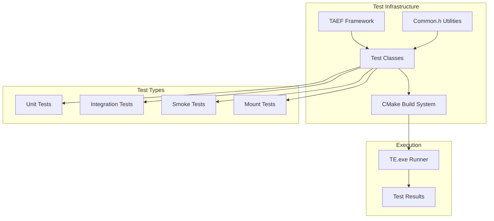
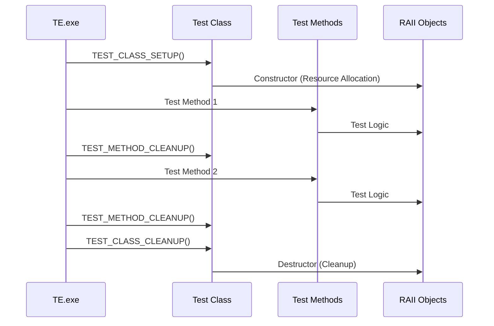

# Test Creation

<cite>
**Referenced Files in This Document**
- [Common.h](file://test/windows/Common.h)
- [SimpleTests.cpp](file://test/windows/SimpleTests.cpp)
- [MountTests.cpp](file://test/windows/MountTests.cpp)
- [CMakeLists.txt](file://test/windows/CMakeLists.txt)
- [lxsstest.h](file://test/windows/lxsstest.h)
- [UnitTests.cpp](file://test/windows/UnitTests.cpp)
- [Plugin.cpp](file://test/windows/testplugin/Plugin.cpp)
- [test/README.md](file://test/README.md)
</cite>

## Table of Contents
1. [Introduction](#introduction)
2. [Test Framework Overview](#test-framework-overview)
3. [Setting Up Your Development Environment](#setting-up-your-development-environment)
4. [Creating a New Test File](#creating-a-new-test-file)
5. [Test Class Structure and Macros](#test-class-structure-and-macros)
6. [Test Method Implementation](#test-method-implementation)
7. [Verification Macros](#verification-macros)
8. [Setup and Cleanup Methods](#setup-and-cleanup-methods)
9. [Integrating with the Build System](#integrating-with-the-build-system)
10. [Best Practices and Guidelines](#best-practices-and-guidelines)
11. [Debugging and Troubleshooting](#debugging-and-troubleshooting)
12. [Complete Example Walkthrough](#complete-example-walkthrough)

## Introduction

WSL (Windows Subsystem for Linux) uses the Test Authoring and Execution Framework (TAEF) to create comprehensive test suites that validate the functionality of the WSL subsystem. This documentation provides a complete guide for creating new WSL tests, from initial setup through implementation and integration with the build system.

TAEF provides a robust framework for writing automated tests in C++, offering features like test class organization, setup/cleanup mechanisms, assertion capabilities, and detailed logging. The WSL test infrastructure builds upon TAEF with specialized utilities for testing WSL functionality.

## Test Framework Overview

The WSL test infrastructure consists of several key components:



**Diagram sources**
- [CMakeLists.txt](file://test/windows/CMakeLists.txt#L1-L33)
- [Common.h](file://test/windows/Common.h#L1-L50)

### Key Components

1. **TAEF Framework**: Provides the core testing infrastructure including test class management, assertion macros, and execution framework
2. **Common Utilities**: Shared functionality for WSL testing including helper functions, RAII wrappers, and test utilities
3. **Test Classes**: Individual test implementations organized by functionality (SimpleTests, MountTests, etc.)
4. **Build System**: CMake configuration that compiles all tests into a single DLL (`wsltests.dll`)
5. **Execution Engine**: TE.exe runner that discovers, executes, and reports test results

**Section sources**
- [CMakeLists.txt](file://test/windows/CMakeLists.txt#L1-L33)
- [test/README.md](file://test/README.md#L1-L50)

## Setting Up Your Development Environment

### Prerequisites

Before creating WSL tests, ensure you have:

1. **Visual Studio**: With C++ development tools
2. **Windows SDK**: Version compatible with TAEF
3. **TAEF Binaries**: Available in the Microsoft.Taef NuGet package
4. **WSL Installation**: Properly built and deployed WSL binaries
5. **Administrative Privileges**: Required for test execution

### Environment Configuration

1. **Locate TAEF Headers**: Typically found in `%Program Files (x86)%\Windows Kits\10\Testing\Development\inc\WexTestClass.h`
2. **Verify Build Tools**: Ensure MSBuild and CMake are available in your PATH
3. **Test Deployment**: Confirm WSL binaries are properly deployed to the test environment

**Section sources**
- [test/README.md](file://test/README.md#L3-L10)

## Creating a New Test File

### File Structure Template

Every WSL test file follows a standardized structure:

```cpp
/*++
Copyright (c) Microsoft. All rights reserved.

Module Name:

    NewTestFile.cpp

Abstract:

    This file contains test cases for [specific functionality].

--*/
#include "precomp.h"
#include "Common.h"

namespace NewTestNamespace {
class NewTestClass
{
    WSL_TEST_CLASS(NewTestClass)

    // Setup and cleanup methods
    TEST_CLASS_SETUP(TestClassSetup)
    {
        // Initialization code
        return true;
    }

    TEST_CLASS_CLEANUP(TestClassCleanup)
    {
        // Cleanup code
        return true;
    }

    // Test methods
    TEST_METHOD(TestMethodName)
    {
        // Test implementation
    }
};
} // namespace NewTestNamespace
```

### File Naming Conventions

- **Naming Pattern**: `[Functionality]Tests.cpp` (e.g., `MountTests.cpp`, `NetworkTests.cpp`)
- **Namespace**: Use descriptive namespace names matching the test file name
- **Class Name**: Use the same name as the namespace with "Test" suffix

**Section sources**
- [SimpleTests.cpp](file://test/windows/SimpleTests.cpp#L1-L20)
- [MountTests.cpp](file://test/windows/MountTests.cpp#L1-L30)

## Test Class Structure and Macros

### Basic Test Class Declaration

The foundation of every TAEF test class uses specific macros:

```cpp
namespace TestNamespace {
class TestClassName
{
    WSL_TEST_CLASS(TestClassName)
    
    // Test methods and setup go here
};
} // namespace TestNamespace
```

### TEST_CLASS Macro

The `WSL_TEST_CLASS` macro defines the test class and registers it with the TAEF framework. It automatically sets up binary dependencies and test properties.

### Namespace Organization

All test classes should be properly namespaced to avoid conflicts:

```cpp
namespace MountTests {
class MountTests
{
    // Test implementation
};
} // namespace MountTests
```

**Section sources**
- [SimpleTests.cpp](file://test/windows/SimpleTests.cpp#L18-L22)
- [MountTests.cpp](file://test/windows/MountTests.cpp#L101-L123)

## Test Method Implementation

### TEST_METHOD Macro

Individual test methods are declared using the `TEST_METHOD` macro:

```cpp
TEST_METHOD(TestMethodName)
{
    // Test implementation
}
```

### Test Method Structure

Each test method follows this pattern:

1. **Preparation**: Set up test data and environment
2. **Execution**: Perform the action being tested
3. **Verification**: Use assertion macros to validate results
4. **Cleanup**: Clean up any resources created during testing

### Example Test Method

```cpp
TEST_METHOD(EchoTest)
{
    const std::wstring echoExpected = L"LOW!\n";
    auto [output, __] = LxsstuLaunchWslAndCaptureOutput(L"echo LOW!");
    VERIFY_ARE_EQUAL(output, echoExpected);
}
```

**Section sources**
- [SimpleTests.cpp](file://test/windows/SimpleTests.cpp#L37-L42)

## Verification Macros

### Core Assertion Macros

TAEF provides a comprehensive set of verification macros for different types of assertions:

#### Numeric Comparisons

| Macro | Purpose | Usage |
|-------|---------|-------|
| `VERIFY_ARE_EQUAL(a, b)` | Assert equality | `VERIFY_ARE_EQUAL(actual, expected)` |
| `VERIFY_ARE_NOT_EQUAL(a, b)` | Assert inequality | `VERIFY_ARE_NOT_EQUAL(value, unexpected)` |
| `VERIFY_IS_TRUE(condition)` | Assert truthiness | `VERIFY_IS_TRUE(is_valid)` |
| `VERIFY_IS_FALSE(condition)` | Assert falsiness | `VERIFY_IS_FALSE(is_error)` |

#### Success/Failure Checks

| Macro | Purpose | Usage |
|-------|---------|-------|
| `VERIFY_SUCCEEDED(hr)` | Assert success | `VERIFY_SUCCEEDED(result)` |
| `VERIFY_FAILED(hr)` | Assert failure | `VERIFY_FAILED(error_code)` |
| `VERIFY_NO_THROW(expression)` | Assert no exception | `VERIFY_NO_THROW(operation())` |

#### String Comparisons

| Macro | Purpose | Usage |
|-------|---------|-------|
| `VERIFY_STRING_EQUALS(a, b)` | String equality | `VERIFY_STRING_EQUALS(str1, str2)` |
| `VERIFY_IS_NULL(ptr)` | Null pointer check | `VERIFY_IS_NULL(pointer)` |
| `VERIFY_IS_NOT_NULL(ptr)` | Non-null pointer check | `VERIFY_IS_NOT_NULL(pointer)` |

### Advanced Verification Patterns

#### Using Lambda Functions

```cpp
TEST_METHOD(ComplexValidation)
{
    auto result = PerformComplexOperation();
    VERIFY_ARE_EQUAL(result.status, STATUS_SUCCESS);
    VERIFY_IS_TRUE(result.data.size() > 0);
    VERIFY_IS_NOT_NULL(result.data.data());
}
```

#### Exception Handling

```cpp
TEST_METHOD(ExceptionHandling)
{
    VERIFY_THROWS_HR(exception_operation(), E_INVALIDARG);
    VERIFY_THROWS_EXCEPTION(failed_operation(), std::exception, [](const std::exception& e) {
        VERIFY_STRING_CONTAINS(e.what(), L"expected_error");
    });
}
```

**Section sources**
- [SimpleTests.cpp](file://test/windows/SimpleTests.cpp#L39-L41)
- [lxsstest.h](file://test/windows/lxsstest.h#L24-L47)

## Setup and Cleanup Methods

### TEST_CLASS_SETUP

Executed once before any test methods in the class:

```cpp
TEST_CLASS_SETUP(TestClassSetup)
{
    VERIFY_ARE_EQUAL(LxsstuInitialize(FALSE), TRUE);
    return true;
}
```

### TEST_CLASS_CLEANUP

Executed once after all test methods in the class:

```cpp
TEST_CLASS_CLEANUP(TestClassCleanup)
{
    LxsstuUninitialize(FALSE);
    return true;
}
```

### TEST_METHOD_CLEANUP

Executed after each test method:

```cpp
TEST_METHOD_CLEANUP(MethodCleanup)
{
    LxssLogKernelOutput();
    return true;
}
```

### RAII Pattern for Resource Management

The WSL test infrastructure provides RAII wrappers for common resources:

```cpp
TEST_METHOD(ResourceManagementTest)
{
    // Automatic cleanup when scope exits
    WslConfigChange config(LxssGenerateTestConfig({.vmIdleTimeout = 0}));
    WslKeepAlive keepAlive;
    
    // Test logic here
    VERIFY_ARE_EQUAL(LxsstuLaunchWsl(L"command"), (DWORD)0);
}
```

### Lifecycle Management



**Diagram sources**
- [SimpleTests.cpp](file://test/windows/SimpleTests.cpp#L23-L35)
- [MountTests.cpp](file://test/windows/MountTests.cpp#L125-L165)

**Section sources**
- [SimpleTests.cpp](file://test/windows/SimpleTests.cpp#L23-L35)
- [MountTests.cpp](file://test/windows/MountTests.cpp#L125-L203)

## Integrating with the Build System

### Adding to CMakeLists.txt

To integrate a new test file into the build system:

1. **Add to SOURCES**: Include the new test file in the sources list
2. **Update HEADERS**: Add any new header files
3. **Link Dependencies**: Ensure proper linking of libraries

```cmake
set(SOURCES
    SimpleTests.cpp
    UnitTests.cpp
    MountTests.cpp
    NetworkTests.cpp
    Plan9Tests.cpp
    DrvFsTests.cpp
    Common.cpp
    PluginTests.cpp
    PolicyTests.cpp
    InstallerTests.cpp
    NewTestFile.cpp  # Add new file here
)

set(HEADERS
    Common.h
    PluginTests.h
    lxsstest.h
    NewTestFile.h    # Add new header if needed
)

add_library(wsltests SHARED ${SOURCES} ${HEADERS})
```

### Library Dependencies

The test library links against several key components:

```cmake
target_link_libraries(wsltests
    common
    ${TAEF_LINK_LIBRARIES}
    ${COMMON_LINK_LIBRARIES}
    VirtDisk.lib
    Wer.lib
    Dbghelp.lib
    sfc.lib)
```

### Precompiled Headers

Tests utilize precompiled headers for faster compilation:

```cmake
target_precompile_headers(wsltests REUSE_FROM common)
```

### Build Configuration

Ensure your test file is properly configured for both Debug and Release builds:

```cmake
add_compile_definitions(INLINE_TEST_METHOD_MARKUP)
```

**Section sources**
- [CMakeLists.txt](file://test/windows/CMakeLists.txt#L1-L33)

## Best Practices and Guidelines

### Test Organization

1. **Logical Grouping**: Group related tests in the same file
2. **Descriptive Names**: Use clear, descriptive test method names
3. **Single Responsibility**: Each test should verify one specific behavior
4. **Independent Tests**: Tests should not depend on each other's state

### Error Handling

1. **Proper Assertions**: Use appropriate verification macros
2. **Resource Cleanup**: Always clean up resources in destructors
3. **Error Messages**: Include meaningful error messages in assertions
4. **Logging**: Use the logging macros for debugging information

### Performance Considerations

1. **Minimal Setup**: Keep setup code minimal and fast
2. **Resource Management**: Use RAII patterns for automatic cleanup
3. **Timeout Handling**: Implement timeouts for potentially hanging operations
4. **Parallel Execution**: Design tests to be suitable for parallel execution

### Code Quality

1. **Consistent Style**: Follow the existing code style
2. **Documentation**: Comment complex test logic
3. **Reusability**: Create reusable helper functions when appropriate
4. **Maintainability**: Write tests that are easy to understand and modify

**Section sources**
- [Common.h](file://test/windows/Common.h#L1-L100)
- [test/README.md](file://test/README.md#L75-L110)

## Debugging and Troubleshooting

### Debugging with WinDbg

Use the `/inproc` and `/breakOnCreate` parameters for debugging:

```cmd
TE.exe wsltests.dll /inproc /breakOnCreate /breakOnError
```

### Common Issues

1. **Missing Dependencies**: Ensure all required libraries are linked
2. **Permission Issues**: Tests may require administrative privileges
3. **Timing Issues**: Some tests may have timing-dependent failures
4. **Environment State**: Tests may leave the environment in an inconsistent state

### Logging and Diagnostics

Use the provided logging macros for debugging:

```cpp
LogInfo("Test started with parameter: %ls", param.c_str());
LogError("Unexpected error occurred: %d", hr);
LogWarning("Test may be unstable: %ls", warning.c_str());
```

### Test Isolation

Ensure tests are isolated and don't interfere with each other:

```cpp
TEST_METHOD_CLEANUP(MethodCleanup)
{
    // Clean up any state changes
    CleanupTestState();
    return true;
}
```

**Section sources**
- [test/README.md](file://test/README.md#L16-L42)
- [lxsstest.h](file://test/windows/lxsstest.h#L24-L47)

## Complete Example Walkthrough

### Step 1: Create the Test File

```cpp
/*++
Copyright (c) Microsoft. All rights reserved.

Module Name:

    FileSystemTests.cpp

Abstract:

    This file contains test cases for WSL filesystem operations.

--*/
#include "precomp.h"
#include "Common.h"

namespace FileSystemTests {
class FileSystemTests
{
    WSL_TEST_CLASS(FileSystemTests)

    TEST_CLASS_SETUP(TestClassSetup)
    {
        VERIFY_ARE_EQUAL(LxsstuInitialize(FALSE), TRUE);
        return true;
    }

    TEST_CLASS_CLEANUP(TestClassCleanup)
    {
        LxsstuUninitialize(FALSE);
        return true;
    }

    TEST_METHOD_CLEANUP(MethodCleanup)
    {
        LxssLogKernelOutput();
        return true;
    }

    TEST_METHOD(CreateFileTest)
    {
        // Arrange
        const std::wstring testFilePath = L"/tmp/testfile.txt";
        
        // Act
        auto [output, error] = LxsstuLaunchWslAndCaptureOutput(
            std::format(L"touch {}", testFilePath));
        
        // Assert
        VERIFY_ARE_EQUAL(output, L"");
        VERIFY_ARE_EQUAL(error, L"");
        
        // Verify file exists
        auto [existsOutput, existsError] = LxsstuLaunchWslAndCaptureOutput(
            std::format(L"test -f {} && echo exists", testFilePath));
        VERIFY_ARE_EQUAL(existsOutput, L"exists\n");
    }

    TEST_METHOD(FilePermissionsTest)
    {
        // Arrange
        const std::wstring testFilePath = L"/tmp/perms_test.txt";
        
        // Act
        LxsstuLaunchWslAndCaptureOutput(std::format(L"touch {}", testFilePath));
        LxsstuLaunchWslAndCaptureOutput(L"chmod 644 " + testFilePath);
        
        // Assert
        auto [permsOutput, permsError] = LxsstuLaunchWslAndCaptureOutput(
            std::format(L"stat -c %a {}", testFilePath));
        VERIFY_ARE_EQUAL(permsOutput, L"644\n");
    }

    TEST_METHOD(DirectoryOperationsTest)
    {
        // Arrange
        const std::wstring testDirPath = L"/tmp/testdir";
        
        // Act
        auto [output, error] = LxsstuLaunchWslAndCaptureOutput(
            std::format(L"mkdir -p {}", testDirPath));
        
        // Assert
        VERIFY_ARE_EQUAL(output, L"");
        VERIFY_ARE_EQUAL(error, L"");
        
        // Verify directory exists
        auto [existsOutput, existsError] = LxsstuLaunchWslAndCaptureOutput(
            std::format(L"test -d {} && echo exists", testDirPath));
        VERIFY_ARE_EQUAL(existsOutput, L"exists\n");
    }
};
} // namespace FileSystemTests
```

### Step 2: Add to CMakeLists.txt

```cmake
set(SOURCES
    SimpleTests.cpp
    UnitTests.cpp
    MountTests.cpp
    NetworkTests.cpp
    Plan9Tests.cpp
    DrvFsTests.cpp
    Common.cpp
    PluginTests.cpp
    PolicyTests.cpp
    InstallerTests.cpp
    FileSystemTests.cpp  # Add new file here
)

# ... rest of CMakeLists.txt remains unchanged
```

### Step 3: Build and Execute

1. **Build the Solution**: Compile the WSL solution with your new test
2. **Navigate to Binary Directory**: Go to `bin/<Platform>/<Configuration>/`
3. **Run Tests**: Execute `TE.exe wsltests.dll /name:*FileSystemTests*`

### Step 4: Verify Results

Monitor the test execution output to ensure your tests pass:

```cmd
TE.exe wsltests.dll /name:*FileSystemTests*
```

Expected output should show your test methods executing successfully with appropriate PASS/FAIL indicators.

**Section sources**
- [SimpleTests.cpp](file://test/windows/SimpleTests.cpp#L18-L266)
- [CMakeLists.txt](file://test/windows/CMakeLists.txt#L1-L33)