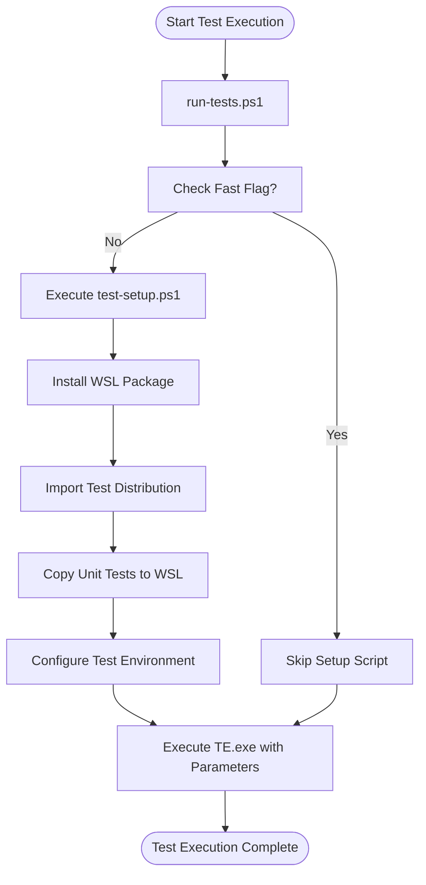
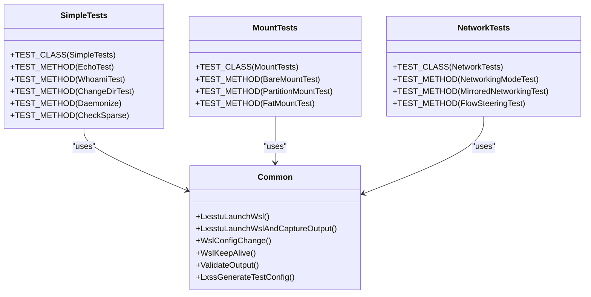

# Test Execution

<cite>
**Referenced Files in This Document**   
- [test/README.md](file://test/README.md)
- [tools/test/run-tests.ps1](file://tools/test/run-tests.ps1)
- [tools/test/test-setup.ps1](file://tools/test/test-setup.ps1)
- [test/windows/SimpleTests.cpp](file://test/windows/SimpleTests.cpp)
- [test/windows/Common.h](file://test/windows/Common.h)
- [test/windows/CMakeLists.txt](file://test/windows/CMakeLists.txt)
</cite>

## Table of Contents
1. [Introduction](#introduction)
2. [Test Execution with TAEF](#test-execution-with-taef)
3. [Command-Line Parameters](#command-line-parameters)
4. [Runtime Parameters in Test Code](#runtime-parameters-in-test-code)
5. [Test Automation Scripts](#test-automation-scripts)
6. [Test Organization and Structure](#test-organization-and-structure)

## Introduction
This document details the WSL test execution process using the Test Authoring and Execution Framework (TAEF). It covers the complete workflow for running tests, including the required administrative privileges, command-line parameters for test execution and debugging, and the automation scripts that orchestrate the testing process. The documentation explains how tests are organized within the codebase and how runtime parameters are passed from execution scripts to test code.

## Test Execution with TAEF
The WSL test suite utilizes the Test Authoring and Execution Framework (TAEF) for test execution. Tests are executed by invoking the `TE.exe` binary with the appropriate test DLLs as arguments. This process requires administrative privileges to ensure proper access to system resources and WSL components.

To execute tests, follow these steps:
1. Open a command prompt with administrative privileges
2. Navigate to the directory containing the built test binaries (typically `bin/<X64|Arm64>/<Debug|Release>/`)
3. Execute the tests using TE.exe with the test DLL as an argument: `TE.exe wsltests.dll`

The test binaries are built as part of the standard build process and are organized according to the CMakeLists.txt configuration in the test directory. The primary test DLL, `wsltests.dll`, contains all the compiled test cases from various test files including SimpleTests, MountTests, NetworkTests, Plan9Tests, and others.

**Section sources**
- [test/README.md](file://test/README.md#L9-L13)
- [test/windows/CMakeLists.txt](file://test/windows/CMakeLists.txt#L1-L33)

## Command-Line Parameters
TAEF provides several command-line parameters that enhance test execution, filtering, and debugging capabilities. These parameters are passed to `TE.exe` after specifying the target test DLL.

### /list
The `/list` parameter displays all available tests contained within the specified test DLL. This is useful for identifying specific test names for targeted execution:
```
TE.exe wsltests.dll /list
```

### /name
The `/name` parameter allows filtering of tests to execute, supporting wildcards (`*` and `?`) for pattern matching. This enables running specific test groups or individual tests:
```
TE.exe wsltests.dll /name:*SimpleTests*
TE.exe wsltests.dll /name:UnitTests::UnitTests::Systemd*
```

### /inproc
The `/inproc` parameter executes tests within the TE.exe process rather than in a separate TE.ProcessHost.exe process. This is particularly useful for debugging with WinDbg:
```
TE.exe wsltests.dll /inproc
```

### /breakOnCreate, /breakOnError, /breakOnInvoke
These debugging parameters work in conjunction with `/inproc` to break into the debugger at specific points:
- `/breakOnCreate`: Breaks before instantiating a test class
- `/breakOnError`: Breaks when an error or test failure is logged
- `/breakOnInvoke`: Breaks prior to test method invocation

```
TE.exe wsltests.dll /inproc /breakOnCreate /breakOnError /breakOnInvoke
```

### /p
The `/p` parameter passes runtime parameters to test methods, setup, and cleanup methods. Multiple parameters can be specified:
```
TE.exe wsltests.dll /p:"foo=hello" /p:"bar=2"
```

### /runas
The `/runas` parameter specifies the execution context for tests, allowing tests to run under different security contexts:
```
TE.exe wsltests.dll /runas:System
TE.exe wsltests.dll /runas:Elevated
```

### /sessionTimeout
The `/sessionTimeout` parameter sets a timeout for the entire TE.exe execution session, causing it to abort if the timeout is exceeded:
```
TE.exe wsltests.dll /sessionTimeout:0:0:0.5
```

**Section sources**
- [test/README.md](file://test/README.md#L19-L73)

## Runtime Parameters in Test Code
Runtime parameters passed via the `/p` command-line option can be retrieved within test code using the `RuntimeParameters::TryGetValue` method from the WEX framework. This allows tests to receive configuration values and test data from the execution environment.

In test code, parameters are accessed as follows:
```cpp
using namespace WEX::Common;
using namespace WEX::TestExecution;

String runtimeParamString;
DWORD fooBar;

VERIFY_SUCCEEDED(RuntimeParameters::TryGetValue(L"foo", runtimeParamString));
VERIFY_SUCCEEDED(RuntimeParameters::TryGetValue(L"bar", fooBar));
```

The test automation scripts pass several important parameters to configure the test environment, including:
- `SetupScript`: Path to the setup script to run before tests
- `Version`: WSL version to use for testing (default: 2)
- `DistroPath`: Path to the distribution tarball for import
- `Package`: Path to the wsl.msix package to install
- `UnitTestsPath`: Path to Linux unit tests directory
- `PullRequest`: Flag indicating if running in a pull request context
- `AllowUnsigned`: Flag to allow installation of unsigned packages

**Section sources**
- [test/README.md](file://test/README.md#L43-L60)
- [tools/test/run-tests.ps1](file://tools/test/run-tests.ps1#L48)

## Test Automation Scripts
The WSL test suite includes PowerShell scripts that automate the test execution process, handling environment setup, package installation, and test orchestration.

### run-tests.ps1
The `run-tests.ps1` script serves as the primary entry point for executing WSL tests. It accepts several parameters to configure the test environment and orchestrates the entire test process. Key parameters include:

- `Version`: Specifies the WSL version for testing (default: 2)
- `SetupScript`: Path to the setup script (default: `.\test-setup.ps1`)
- `DistroPath`: Path to the distribution tarball (default: `.\test_distro.tar.gz`)
- `Package`: Path to the wsl.msix package (default: `.\wsl.msix`)
- `UnitTestsPath`: Path to Linux unit tests directory
- `PullRequest`: Switch for pull request testing (skips certain tests)
- `TestDllPath`: Path to the TAEF test DLL (default: `.\wsltests.dll`)
- `Fast`: Flag to skip package and distro installation for faster development cycles
- `TeArgs`: Additional arguments to pass to TE.exe

The script invokes TE.exe with the appropriate parameters, including all runtime parameters needed by the tests.

### test-setup.ps1
The `test-setup.ps1` script prepares the test environment by performing essential setup tasks:
1. Removing previous WSL package installations
2. Installing the specified WSL package (MSIX or MSI)
3. Importing and configuring the test distribution
4. Setting up unit tests within the WSL environment
5. Configuring registry settings for testing

When the `AllowUnsigned` parameter is specified, the script imports the private WSL certificate to the LocalMachine\Root store to enable installation of unsigned packages. The script also disables the OOBE (Out-of-Box Experience) during testing by setting the `OOBEComplete` registry value.

The setup script handles both package installation and distribution management, ensuring a clean test environment before test execution begins.



**Diagram sources**
- [tools/test/run-tests.ps1](file://tools/test/run-tests.ps1#L1-L53)
- [tools/test/test-setup.ps1](file://tools/test/test-setup.ps1#L1-L128)

**Section sources**
- [tools/test/run-tests.ps1](file://tools/test/run-tests.ps1#L1-L53)
- [tools/test/test-setup.ps1](file://tools/test/test-setup.ps1#L1-L128)

## Test Organization and Structure
The WSL tests are organized into multiple categories, each focusing on specific aspects of WSL functionality. The test structure follows the TAEF framework conventions, with test classes and methods defined using appropriate macros.

### Test Categories
- **SimpleTests**: Basic connectivity tests focusing on fundamental WSL commands like `wsl echo`, `wsl --user`, and `wsl --cd`
- **MountTests**: Tests for the `wsl --mount` functionality, including bare mounting, disk partition mounting, and FAT partition mounting
- **NetworkTests**: Tests for WSL networking aspects, including configuration, mirrored networking, and flow steering
- **Plan9Tests**: Tests for the Plan 9 filesystem component, validating file and directory operations
- **UnitTests**: Tests assessing general Linux behavior and WSL-specific features, including process creation, signals, and sockets

### Test Implementation
Tests are implemented in C++ using the WEX testing framework. Each test file includes the necessary headers and defines test classes using the `TEST_CLASS` macro. Test methods are defined using the `TEST_METHOD` macro, with setup and cleanup methods defined using `TEST_CLASS_SETUP` and `TEST_CLASS_CLEANUP` respectively.

The Common.h header provides shared utilities and helper functions used across multiple test files, including functions for launching WSL commands, handling test configuration, and managing test environment state.



**Diagram sources**
- [test/windows/SimpleTests.cpp](file://test/windows/SimpleTests.cpp#L1-L266)
- [test/windows/Common.h](file://test/windows/Common.h#L1-L515)

**Section sources**
- [test/windows/SimpleTests.cpp](file://test/windows/SimpleTests.cpp#L1-L266)
- [test/windows/Common.h](file://test/windows/Common.h#L1-L515)
- [test/windows/CMakeLists.txt](file://test/windows/CMakeLists.txt#L1-L33)